# 1. Chuẩn bị mô hình thực hành

- Sơ đồ mạng trong GNS3: 

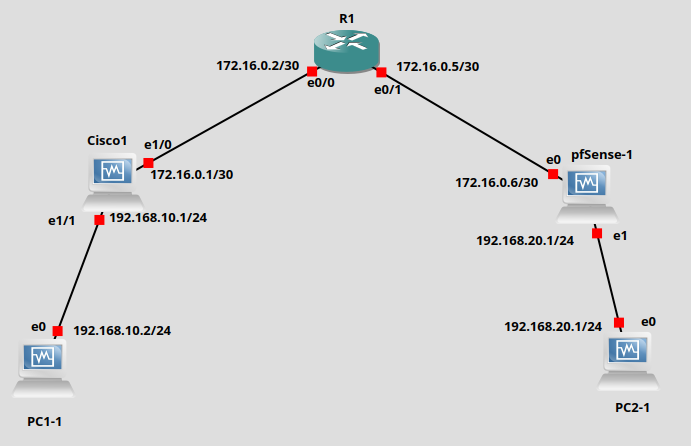

# 2. Cấu hình IP cho các thiết bị trong mô hình mạng

| **Thiết bị (Device)** | **Cổng (Port)** | **Địa chỉ IP (/30 hoặc /24)** | **Vai trò (Role)**  |
| --------------------- | --------------- | ----------------------------- | ------------------- |
| **PC1-1**             | `e0`            | `192.168.10.2/24`             | Client A            |
| **Cisco1**            | `e1/1`          | `192.168.10.1/24`             | LAN A               |
|                       | `e1/0`          | `172.16.0.1/30`               | WAN A               |
| **R1**                | `e0/0`          | `172.16.0.2/30`               | Kết nối với Cisco1  |
|                       | `e0/1`          | `172.16.0.5/30`               | Kết nối với pfSense |
| **pfSense-1**         | `WAN`           | `172.16.0.6/30`               | WAN B               |
|                       | `LAN`           | `192.168.20.1/24`             | LAN B               |
| **PC2-1**             | `e0`            | `192.168.20.2/24`             | Client B            |

# 3. Cấu hình chi tiết IPsec

### Phase 1 (ISAKMP)

| Thông số                     | Giá trị              |
| ---------------------------- | -------------------- |
| **Exchange type**            | Main mode            |
| **Authentication method**    | PSK (Pre-Shared Key) |
| **Encryption algorithm**     | AES-256-CTR          |
| **Authentication algorithm** | SHA-256              |
| **Diffie-Hellman group**     | Group 2              |
| **IKE session key lifetime** | 86400 giây (1 ngày)  |

---

### Phase 2 (IPsec)

| Thông số                          | Giá trị           |
| --------------------------------- | ----------------- |
| **IPSec Protocol**                | ESP               |
| **Mode**                          | Tunnel            |
| **Encryption algorithm**          | AES-256-CTR       |
| **Authentication algorithm**      | HMAC-SHA-256      |
| **IPSec session key lifetime**    | 3600 giây (1 giờ) |
| **Perfect Forward Secrecy (PFS)** | Group 5           |

---

# 4. Cấu hình cho PC1:

- Install tools:

```bash
# Cập nhật danh sách gói
sudo apt update

# Cài đặt các công cụ mạng cơ bản
sudo apt install -y net-tools iproute2 iputils-ping traceroute dnsutils curl wget

# Cài đặt công cụ đo thông lượng mạng
sudo apt install -y iperf3

# Cài đặt công cụ bắt gói tin
sudo apt install -y tcpdump

# Cài đặt máy chủ SSH
sudo apt install -y openssh-server
```

- IP configuration for PC1:
- Cấu hình trong file ```/etc/netplan/*.yaml```

```bash
network:
 version: 2
 ethernets:
   enp0s3:
     dhcp4: no
     addresses:
       - 192.168.10.2/24
     gateway4: 192.168.10.1
     routes:
       - to: 192.168.20.0/24
         via: 192.168.10.1
```
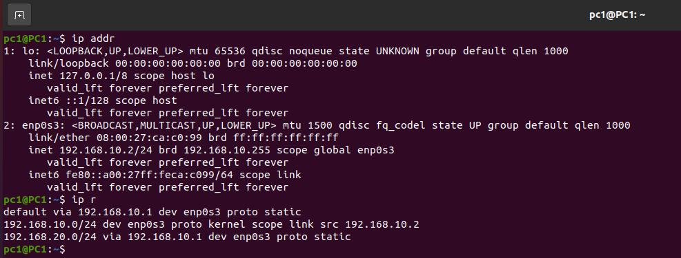

# 5. Cấu hình cho PC2:

## Các công cụ cần tải:

```bash
# Cập nhật danh sách gói
sudo apt update

# Cài đặt các công cụ mạng cơ bản
sudo apt install -y net-tools iproute2 iputils-ping traceroute dnsutils curl wget

# Cài đặt công cụ đo thông lượng mạng
sudo apt install -y iperf3

# Cài đặt công cụ bắt gói tin
sudo apt install -y tcpdump

# Cài đặt máy chủ SSH
sudo apt install -y openssh-server

```

- IP configuration for PC1:
- Cấu hình trong file ```/etc/netplan/*.yaml```

```bash
network:
 version: 2
 ethernets:
   enp0s3:
     dhcp4: no
     addresses:
       - 192.168.20.2/24
     gateway4: 192.168.20.1
     routes:
       - to: 192.168.10.0/24
         via: 192.168.20.1
```

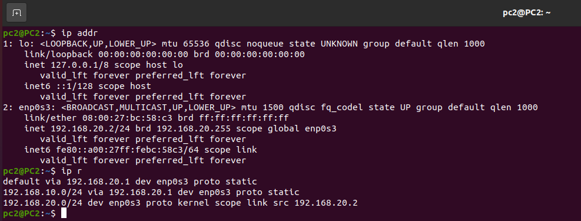

# 6. Cấu hình IP và định tuyến cho Cisco

```bash
enable
configure terminal

! WAN kết nối R1
interface Ethernet1/0
 description WAN_to_R1
 ip address 172.16.0.1 255.255.255.252
 no shutdown

! LAN kết nối PC1
interface Ethernet1/1
 description LAN_to_PC1
 ip address 192.168.10.1 255.255.255.0
 no shutdown

! Định tuyến đến LAN B (192.168.20.0/24) qua R1
ip route 192.168.20.0 255.255.255.0 172.16.0.2

! Định tuyến đến pfSense (nếu muốn ping trực tiếp tunnel endpoint)
ip route 172.16.0.6 255.255.255.255 172.16.0.2

end
write memory
```

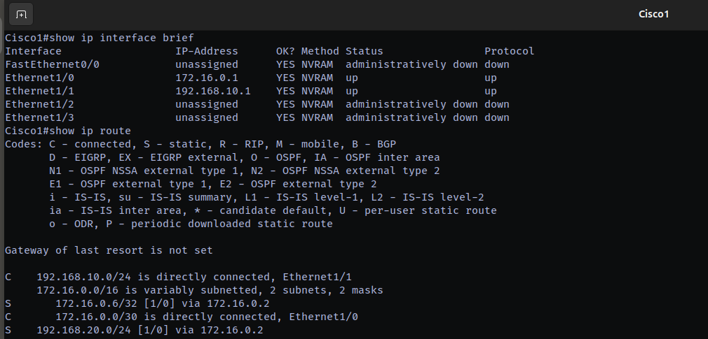

# 7. Cấu hình R1

```bash
enable
configure terminal

! Cổng kết nối Cisco1
interface Ethernet0/0
 description Link_to_Cisco1
 ip address 172.16.0.2 255.255.255.252
 no shutdown

! Cổng kết nối pfSense
interface Ethernet0/1
 description Link_to_pfSense
 ip address 172.16.0.5 255.255.255.252
 no shutdown

! Định tuyến đến LAN A (192.168.10.0/24 qua Cisco1)
ip route 192.168.10.0 255.255.255.0 172.16.0.1

! Định tuyến đến LAN B (192.168.20.0/24 qua pfSense)
ip route 192.168.20.0 255.255.255.0 172.16.0.6

! Bật Cisco Express Forwarding (CEF)
ip cef

end
write memory
```

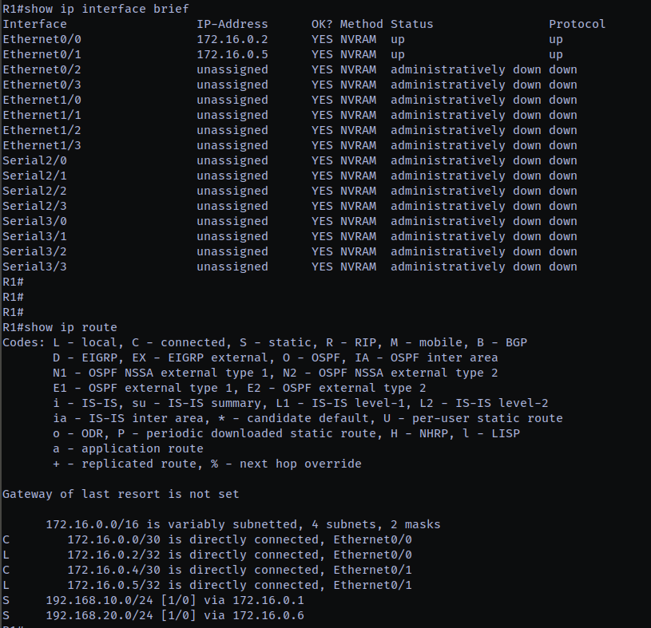

# 8. Cấu hình pfSense

- Cấu hình IP:

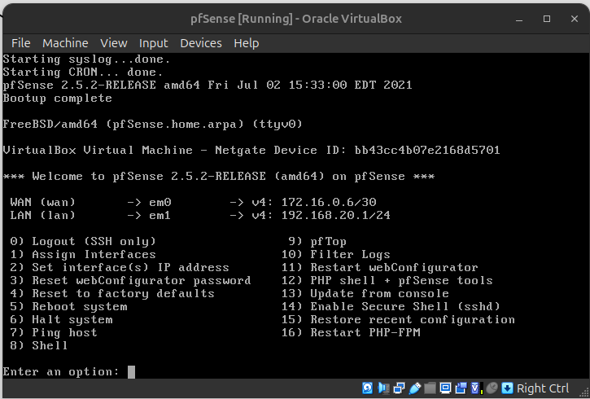

- Truy cập từ máy khách (Từ PC2) theo địa chỉ LAN: ```http://192.168.20.1```

- Tên đăng nhập: ```admin```
- Mật khẩu: ```pfsense```

- Cấu hình NAT

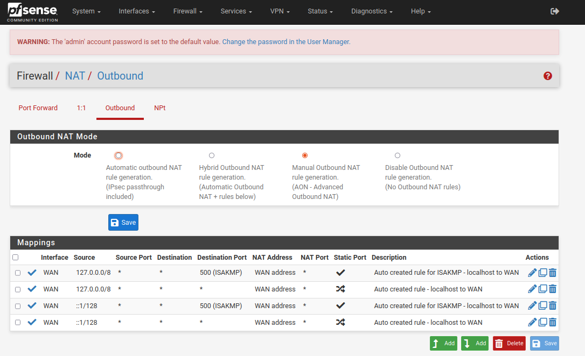

- Cấu hình WAN

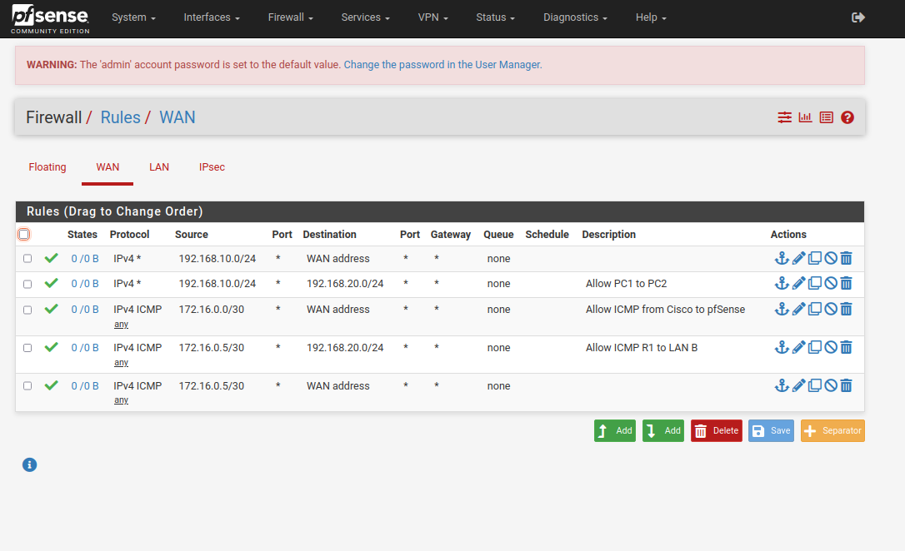

- Cấu hình LAN

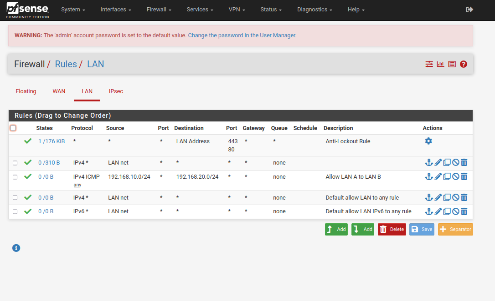

- Cấu hình Gateways:

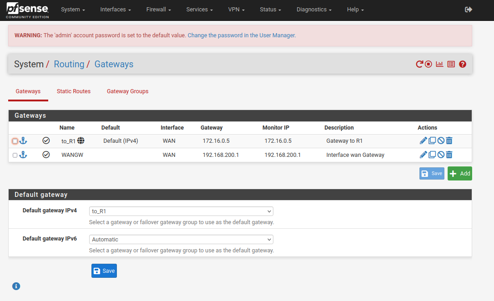

- Static Router

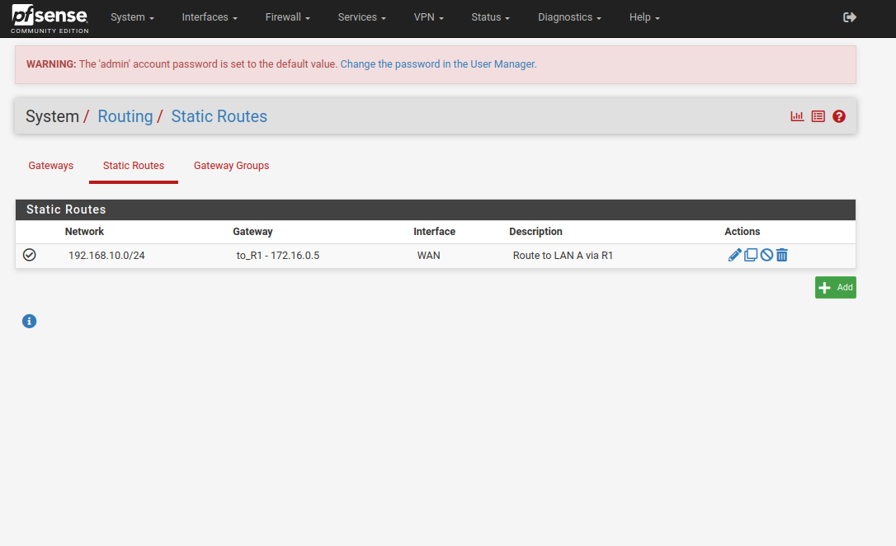

# 9. Kiểm tra kết nối

- Từ PC1 ping về Cisco

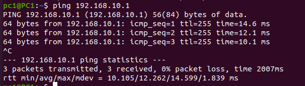

- Từ PC1 ping về R1

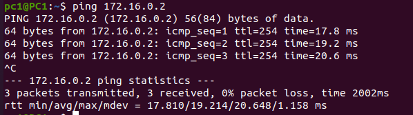


