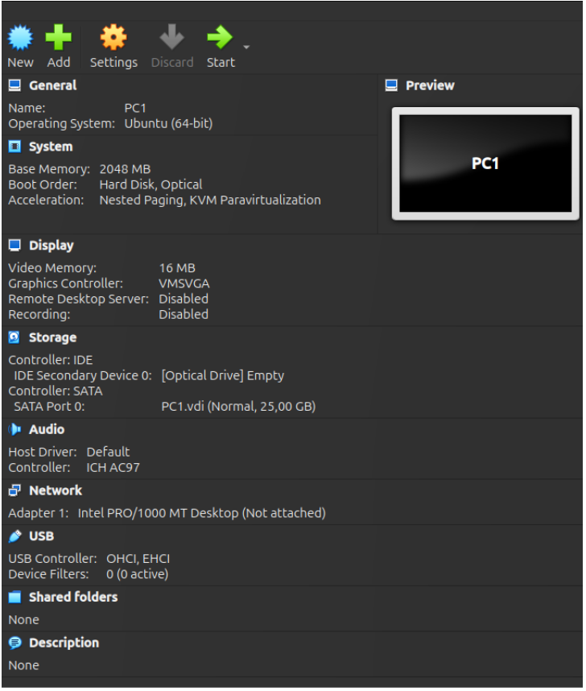

- Cấu hình trong virtualbox:



- Các công cụ cần tải:


```bash
# Cập nhật danh sách gói
sudo apt update

# Cài đặt các công cụ mạng cơ bản
sudo apt install -y net-tools iproute2 iputils-ping traceroute dnsutils curl wget

# Cài đặt công cụ đo thông lượng mạng
sudo apt install -y iperf3

# Cài đặt công cụ bắt gói tin
sudo apt install -y tcpdump

# Cài đặt máy chủ SSH
sudo apt install -y openssh-server

```

- IP configuration for PC1:

- Cấu hình trong file ```/etc/netplan/*.yaml```

```bash
network:
  version: 2
  ethernets:
    enp0s3:
      dhcp4: no
      addresses:
        - 192.168.10.2/24
      gateway4: 192.168.10.1
      routes:
        - to: 192.168.20.0/24
          via: 192.168.10.1
```

| Dòng                     | Giải thích                                                               |
| ------------------------ | ------------------------------------------------------------------------ |
| `network:`               | Bắt đầu cấu hình mạng                                                    |
| `version: 2`             | Sử dụng **Netplan version 2** – định dạng cấu hình mới của Ubuntu        |
| `ethernets:`             | Cấu hình cho các thiết bị mạng Ethernet                                  |
| `enp0s3:`                | Tên interface mạng (có thể là `eth0`, `enp0s3`, v.v. tùy hệ thống. Để xem giao diện mạng ta sử dụng `ip addr`)       |
| `dhcp4: no`              | **Tắt DHCP**, cấu hình IP tĩnh                                           |
| `addresses:`             | Gán IP tĩnh cho interface                                                |
| `- 192.168.10.2/24`      | IP tĩnh: `192.168.10.2` với subnet mask `/24` (255.255.255.0)            |
| `gateway4: 192.168.10.1` | Cổng mặc định (default gateway) để ra ngoài mạng                         |
| `routes:`                | Cấu hình tuyến tĩnh (static route)                                       |
| `- to: 192.168.20.0/24`  | Mạng đích là `192.168.20.0/24`                                           |
| `via: 192.168.10.1`      | Để tới mạng `192.168.20.0/24`, cần gửi gói tin đến router `192.168.10.1` |
