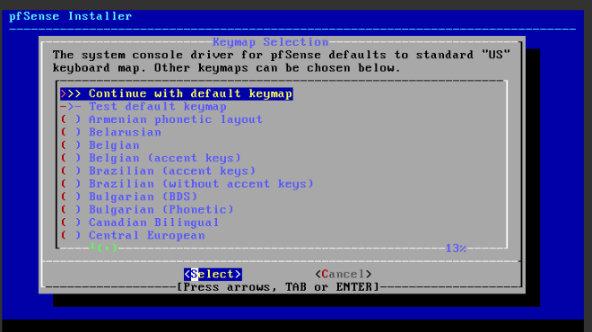
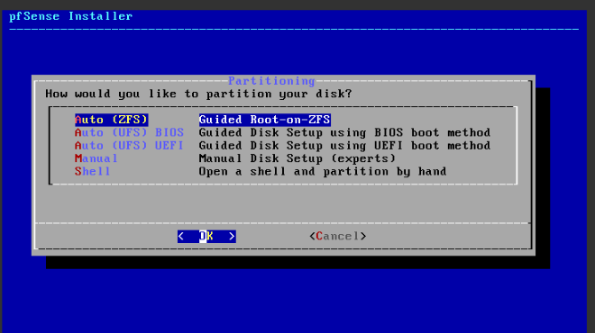
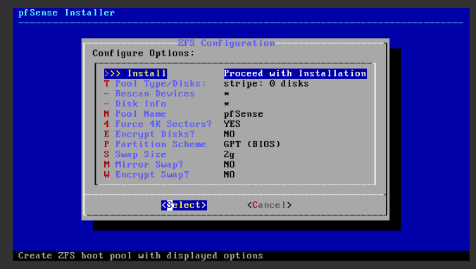
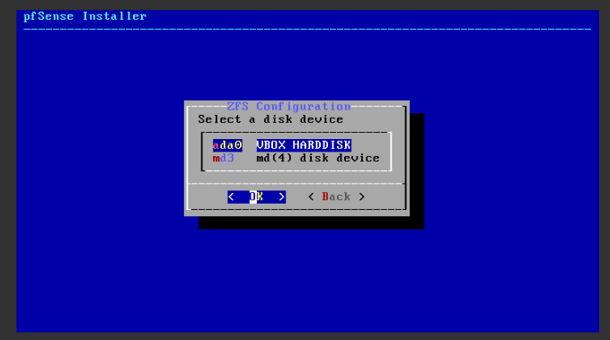
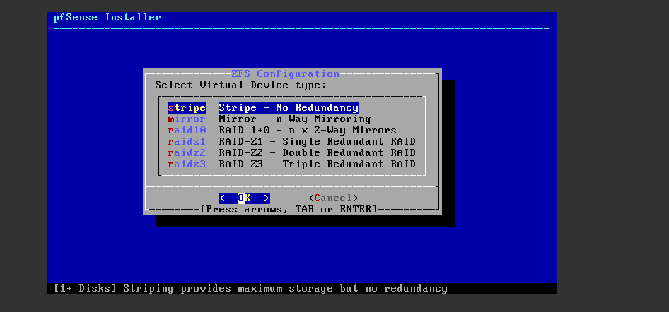
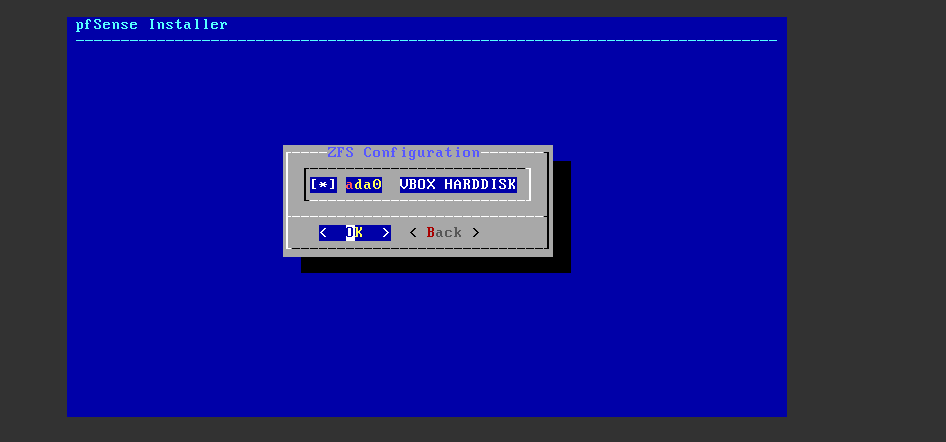

## Cấu hình pfSense trong virtualbox

# PHẦN 1 –  Cài đặt pfSense 

- Tải file iso của pfSense [tại đây](https://github.com/CloudSentralDotNet/iso_pfsense/releases)

## **Bước 1: Tạo máy ảo pfSense trong VirtualBox**

1. **Mở VirtualBox** → Bấm `New` (Tạo máy ảo mới)
2. Nhập thông tin:
   - **Name:** pfSenseGW
   - **Type:** BSD
   - **Version:** FreeBSD (64-bit)

3. **Memory size:** Chọn ít nhất **1024 MB**, tốt nhất là **2048 MB**

4. **Hard disk:**
   - Chọn “Create a virtual hard disk now” → Next
   - Loại: VDI → Next
   - Storage: Dynamically allocated → Next
   - Kích thước: Tối thiểu **10 GB** → Create

---

## **Bước 2: Gắn file ISO và cấu hình mạng**

1. Chọn máy `pfSenseGW` → bấm `Settings`

### ➤ **Tab System:**
- Bỏ chọn “Floppy” trong Boot Order (giữ lại Optical & Hard Disk)

### ➤ **Tab Storage:**
- Click vào “Empty” dưới "Controller: IDE"
- Click biểu tượng đĩa bên phải → `Choose a disk file...` → chọn `pfSense-CE-2.5.2-RELEASE-amd64.iso`
- Chọn OK

### ➤ **Tab Network:**
- **Adapter 1 (WAN):**
  - Enable → Attached to: **Internal Network**
  - Name: `net-WAN` *(bạn có thể đặt tên tùy ý)*

- **Adapter 2 (LAN):**
  - Enable → Attached to: **Internal Network**
  - Name: `net-LAN1`

> Nếu bạn chưa tạo Internal Network, bạn có thể vào `File > Preferences > Network` để thêm chúng (hoặc trong Adapter, gõ tên mạng là đủ).

---

## **Bước 3: Khởi động và cài đặt pfSense**

1. Bấm `Start` để khởi động máy ảo.
2. Giao diện cài đặt pfSense sẽ hiện lên:
   - Chọn `[Accept]` để chấp nhận License
   - Chọn `Install pfSense` → Enter

3. Chọn kiểu bàn phím:

- nên chọn dòng đầu

4. Chọn phân vùng ổ đĩa
- Chọn Auto (ZFS)

- Di chuyển xuống dòng Disk info

- Tìm ổ nhớ khả dụng

- Quay trở lại chọn Pool Type/Disks:
- Chọn stripe

- Nhấn phím cách để chọn ổ nhớ và nhấn ok

- sau đó nhấn ok để cài đặt

5. Reboot

 Trước khi reboot:

**Phải tháo file ISO cài đặt ra khỏi máy ảo** nếu không nó sẽ khởi động lại vào trình cài đặt!

**Cách tháo ISO:**

1. Tắt máy ảo nếu đang chạy
2. Vào **Settings > Storage**
3. Chọn dòng chứa file `.iso` dưới `Controller: IDE`
4. Nhấn biểu tượng đĩa CD bên phải → Chọn **Remove Disk from Virtual Drive**
5. Bấm OK

KHÔNG được xóa file .vdi!

File .vdi là ổ cứng ảo chính của máy pfSense (nơi chứa toàn bộ hệ điều hành bạn vừa cài).

Nếu bạn xóa nó, pfSense sẽ không còn hệ điều hành để khởi động → bạn sẽ phải cài lại từ đầu.

Sau đó mở lại :

- **Gõ:** `exit`
- Sau đó nhấn **Enter**

Sau khi bạn gõ `exit`:
1. Bạn sẽ quay về menu chính
2. Chọn **`Reboot`** để khởi động lại hệ thống

Sau khi reboot, pfSense sẽ khởi động vào hệ thống thật → bạn có thể bắt đầu thiết lập địa chỉ IP và giao diện WAN/LAN như mình đã hướng dẫn ở phần đầu.
