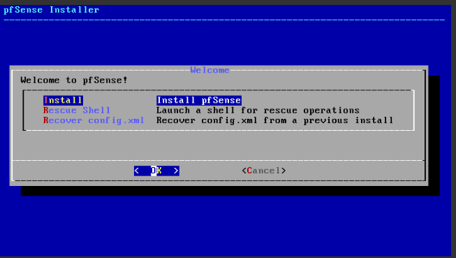
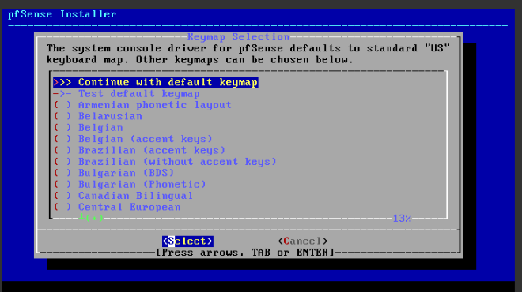
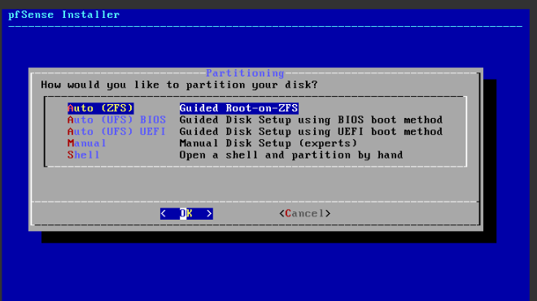
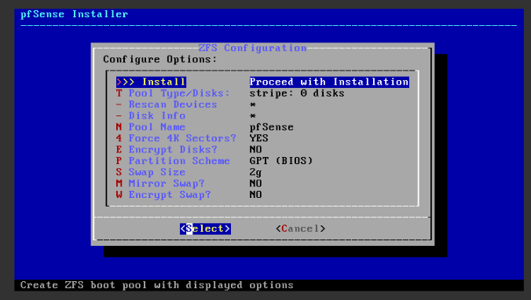
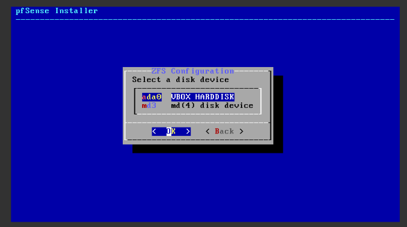
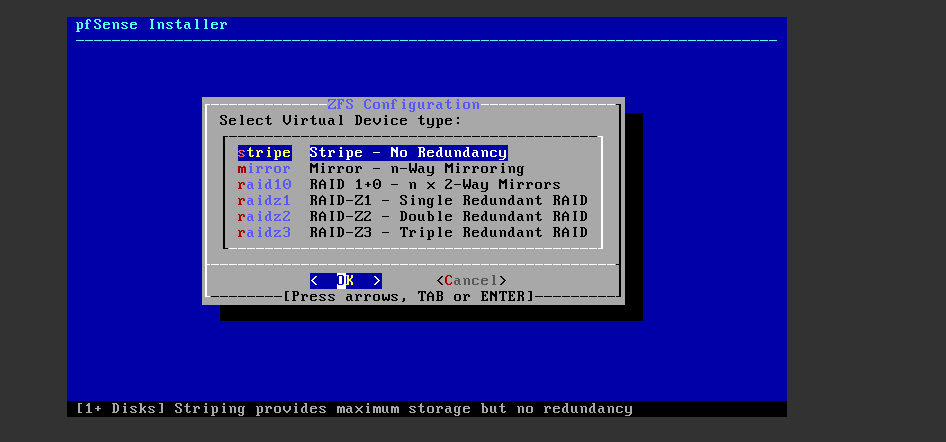
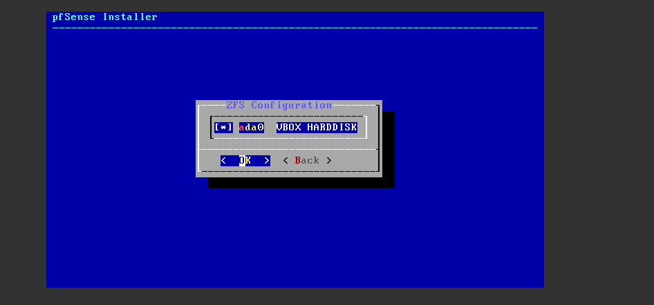
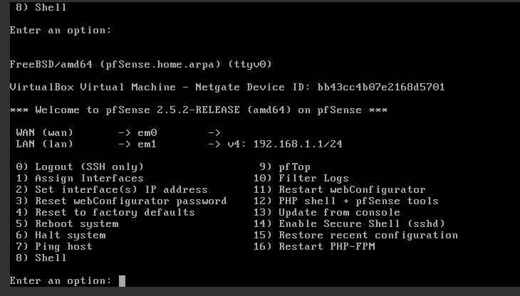
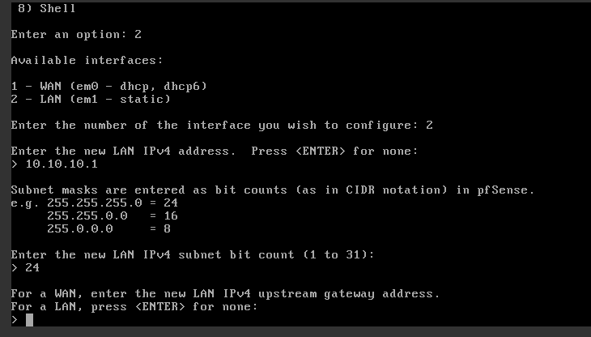
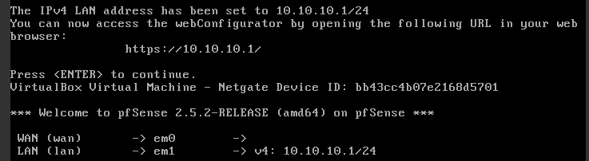

# 🧱 PHẦN 1 –  Cài đặt pfSense 

- Tải file iso của pfSense [tại đây](https://github.com/CloudSentralDotNet/iso_pfsense/releases)

## ✅ **Bước 1: Tạo máy ảo pfSense trong VirtualBox**

1. **Mở VirtualBox** → Bấm `New` (Tạo máy ảo mới)
2. Nhập thông tin:
   - **Name:** pfSenseGW
   - **Type:** BSD
   - **Version:** FreeBSD (64-bit)

3. **Memory size:** Chọn ít nhất **1024 MB**, tốt nhất là **2048 MB**

4. **Hard disk:**
   - Chọn “Create a virtual hard disk now” → Next
   - Loại: VDI → Next
   - Storage: Dynamically allocated → Next
   - Kích thước: Tối thiểu **10 GB** → Create

---

## ✅ **Bước 2: Gắn file ISO và cấu hình mạng**

1. Chọn máy `pfSenseGW` → bấm `Settings`

### ➤ **Tab System:**
- Bỏ chọn “Floppy” trong Boot Order (giữ lại Optical & Hard Disk)

### ➤ **Tab Storage:**
- Click vào “Empty” dưới "Controller: IDE"
- Click biểu tượng đĩa bên phải → `Choose a disk file...` → chọn `pfSense-CE-2.5.2-RELEASE-amd64.iso`
- Chọn OK

### ➤ **Tab Network:**
- **Adapter 1 (WAN):**
  - Enable → Attached to: **Internal Network**
  - Name: `net-WAN` *(bạn có thể đặt tên tùy ý)*

- **Adapter 2 (LAN):**
  - Enable → Attached to: **Internal Network**
  - Name: `net-LAN1`

> ⚠️ Nếu bạn chưa tạo Internal Network, bạn có thể vào `File > Preferences > Network` để thêm chúng (hoặc trong Adapter, gõ tên mạng là đủ).

---

## ✅ **Bước 3: Khởi động và cài đặt pfSense**

1. Bấm `Start` để khởi động máy ảo.
2. Giao diện cài đặt pfSense sẽ hiện lên:
   - Chọn `[Accept]` để chấp nhận License
   - Chọn `Install pfSense` → Enter



3. Chọn kiểu bàn phím:

- nên chọn dòng đầu



4. Chọn phân vùng ổ đĩa
- Chọn Auto (ZFS)



- Di chuyển xuống dòng Disk info



- Tìm ổ nhớ khả dụng



- Quay trở lại chọn Pool Type/Disks:
- Chọn stripe



- Nhấn phím cách để chọn ổ nhớ và nhấn ok



- sau đó nhấn ok để cài đặt

5. Reboot

⚠️ Trước khi reboot:

**Phải tháo file ISO cài đặt ra khỏi máy ảo** nếu không nó sẽ khởi động lại vào trình cài đặt!

**Cách tháo ISO:**

1. Tắt máy ảo nếu đang chạy
2. Vào **Settings > Storage**
3. Chọn dòng chứa file `.iso` dưới `Controller: IDE`
4. Nhấn biểu tượng đĩa CD bên phải → Chọn **Remove Disk from Virtual Drive**
5. Bấm OK

🔴 KHÔNG được xóa file .vdi!

File .vdi là ổ cứng ảo chính của máy pfSense (nơi chứa toàn bộ hệ điều hành bạn vừa cài).

Nếu bạn xóa nó, pfSense sẽ không còn hệ điều hành để khởi động → bạn sẽ phải cài lại từ đầu.

Sau đó mở lại :

- **Gõ:** `exit`
- Sau đó nhấn **Enter**

💡 Sau khi bạn gõ `exit`:
1. Bạn sẽ quay về menu chính
2. Chọn **`Reboot`** để khởi động lại hệ thống


Sau khi reboot, pfSense sẽ khởi động vào hệ thống thật → bạn có thể bắt đầu thiết lập địa chỉ IP và giao diện WAN/LAN như mình đã hướng dẫn ở phần đầu.

## ✅ **Bước 4: Đặt lại địa chỉ IP LAN**'



Hiện tại LAN đang là: `192.168.1.1/24`  
→ Bạn nên **đổi thành `10.10.10.1/24`** để dễ thiết lập mô hình sau này 

🟢 **Bước 1:** Nhập số `2` (Set interface(s) IP address) → nhấn `Enter`

🟢 **Bước 2:** Chọn interface LAN

Ở màn hình tiếp theo, pfSense sẽ hỏi bạn chọn giao diện để cấu hình IP.

Bạn sẽ thấy:
```
Available interfaces:
 1 - em0 (WAN)
 2 - em1 (LAN)
```

→ Nhập: `2` → nhấn `Enter`


 🟢 **Bước 3:** Nhập IP cho LAN

- **IP address:** `10.10.10.1`
- **Subnet bit count:** `24`



- **Upstream Gateway:** để trống → nhấn `Enter`
- **IPv6:** chọn `n`
- **Enable DHCP server on LAN?** chọn `n` (sẽ cấu hình sau trên GUI)
- **Do you want to revert to HTTP?** chọn `n` (giữ HTTPS)

Sau khi thiết lập thành công nó sẽ như sau:




- Bạn sẽ thấy địa chỉ LAN đã là: `10.10.10.1/24`
- Từ bây giờ, có thể dùng trình duyệt ở máy `ClientVM` (trong mạng LAN) để truy cập:

```
https://10.10.10.1
```

> Tên đăng nhập mặc định:
> - **Username:** `admin`
> - **Password:** `pfsense`

---


# 🏗️ PHẦN 2 – TẠO MÔ HÌNH TRONG GNS3

## ✅ Bước 2.1: Kéo thiết bị vào
1. Mở GNS3, tạo project mới: `IPsec_Site2Site`
2. Kéo vào các thiết bị sau:
   - 1 × pfSense (dưới tab "QEMU VMs")
   - 1 × Cisco c7200 Router
   - 1 × Router trung gian (R1, có thể là Cisco c3725 hoặc IOU)
   - 2 × VPCS (PC1 và PC2)

## ✅ Bước 2.2: Kết nối dây như sơ đồ
```
PC1 -- pfSense(em0/em1) -- R1 -- Cisco -- PC2
```

| Kết nối       | Interface             |
|---------------|------------------------|
| PC1 → pfSense | VPCS e0 ↔ pfSense em0 |
| pfSense ↔ R1  | pfSense em1 ↔ R1 f0/1 |
| R1 ↔ Cisco    | R1 f0/0 ↔ Cisco f0/1  |
| Cisco → PC2   | Cisco f0/0 ↔ VPCS e0  |

---

# ⚙️ PHẦN 3 – CẤU HÌNH MẠNG

## ✅ Bước 3.1: IP các thiết bị

| Thiết bị         | Interface | IP Address        |
|------------------|-----------|-------------------|
| PC1              | e0        | `192.168.10.2/24` |
| pfSense LAN      | em0       | `192.168.10.1/24` |
| pfSense WAN      | em1       | `10.10.10.2/30`   |
| R1 f0/1          |           | `10.10.10.1/30`   |
| R1 f0/0          |           | `10.10.20.1/30`   |
| Cisco f0/1       |           | `10.10.20.2/30`   |
| Cisco f0/0       |           | `192.168.20.1/24` |
| PC2              | e0        | `192.168.20.2/24` |

---

# 🛠️ PHẦN 4 – CẤU HÌNH PC1 & PC2 (VPCS)

## ✅ PC1:
```bash
ip 192.168.10.2 255.255.255.0 192.168.10.1
```

## ✅ PC2:
```bash
ip 192.168.20.2 255.255.255.0 192.168.20.1
```

---

# 🧱 PHẦN 5 – CẤU HÌNH pfSENSE

## ✅ Bước 5.1: Khởi động pfSense

1. Khi boot lần đầu → hỏi gán interface:
   - **WAN (em1)**: 10.10.10.2/30
   - **LAN (em0)**: 192.168.10.1/24

2. Sau khi cấu hình IP xong, từ PC1 mở browser:
   - Truy cập: `http://192.168.10.1`
   - Login: `admin / pfsense`

## ✅ Bước 5.2: Vào giao diện cấu hình VPN

### ➤ `VPN > IPsec` → Add Phase 1

| Thông số | Giá trị |
|----------|--------|
| Remote Gateway | `10.10.20.2` |
| Authentication | Pre-Shared Key |
| PSK | `mypresharedkey` |
| Key Exchange | IKEv2 |
| Encryption | AES-256-CTR |
| Hash | SHA-256 |
| DH Group | 2 |
| Lifetime | 86400 |

### ➤ Thêm Phase 2 (trong Phase 1)
| Thông số | Giá trị |
|----------|---------|
| Local Subnet | `192.168.10.0/24` |
| Remote Subnet | `192.168.20.0/24` |
| Encryption | AES-256-CTR |
| Auth | SHA-256 |
| PFS | Group 5 |
| Lifetime | 3600 |

✅ Nhấn Save và Apply Changes

---

# 🔧 PHẦN 6 – CẤU HÌNH R1 (TRUNG GIAN)

## R1 (ví dụ dùng Cisco)
```cisco
interface FastEthernet0/0
 ip address 10.10.20.1 255.255.255.252
 no shutdown
interface FastEthernet0/1
 ip address 10.10.10.1 255.255.255.252
 no shutdown
```

---

# 🔒 PHẦN 7 – CẤU HÌNH CISCO VPN GATEWAY

### ✅ Interface và routing
```cisco
interface FastEthernet0/0
 ip address 192.168.20.1 255.255.255.0
 no shutdown
interface FastEthernet0/1
 ip address 10.10.20.2 255.255.255.252
 no shutdown
ip route 192.168.10.0 255.255.255.0 10.10.20.1
```

### ✅ IPsec configuration
```cisco
crypto isakmp policy 10
 encr aes 256
 hash sha256
 authentication pre-share
 group 2
 lifetime 86400

crypto isakmp key mypresharedkey address 10.10.10.2

crypto ipsec transform-set MYSET esp-aes 256 esp-sha256-hmac
 mode tunnel

crypto map MYMAP 10 ipsec-isakmp
 set peer 10.10.10.2
 set transform-set MYSET
 match address 101

interface FastEthernet0/1
 crypto map MYMAP

access-list 101 permit ip 192.168.20.0 0.0.0.255 192.168.10.0 0.0.0.255
```

---

# 🧪 PHẦN 8 – KIỂM TRA HOẠT ĐỘNG

## ✅ Kiểm tra ping
Từ **PC1**:
```bash
ping 192.168.20.2
```

Từ **Cisco**:
```bash
show crypto isakmp sa
show crypto ipsec sa
```

Từ **pfSense**:
- `Status > IPsec` → kiểm tra SA

---

# 📊 PHẦN 9 – ĐO THÔNG LƯỢNG (IPERF3)

### ✅ Trên PC2:
```bash
iperf3 -s
```

### ✅ Trên PC1:
```bash
iperf3 -c 192.168.20.2
```

- Ghi lại kết quả **khi có tunnel**
- Sau đó **disable tunnel**, đo lại → so sánh

---

# 📝 PHẦN 10 – GHI NHẬN KẾT QUẢ

| Trạng thái        | Tốc độ (Mbps) |
|-------------------|---------------|
| Không dùng IPsec  | XXX           |
| Qua IPsec tunnel  | XXX           |

---

