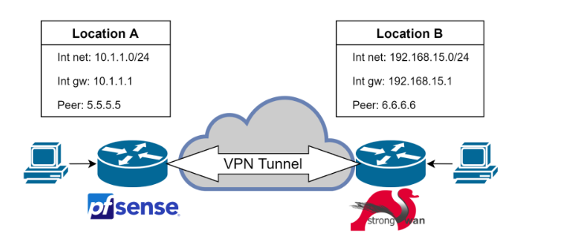

# Bài thực hành số 4 – Các giao thức tạo đường hầm (Tunneling Protocols)

> Trong bài thực hành này, cần nghiên cứu việc tạo đường hầm cho lưu lượng mạng bằng giao thức IPsec nhằm đảm bảo trao đổi dữ liệu an toàn giữa các mạng. Yêu cầu tạo và cấu hình đường hầm IPsec, thiết lập các tham số xác thực và mã hóa, cũng như kiểm tra việc truyền dữ liệu qua kết nối được bảo vệ.

## Mục tiêu của bài học

Tìm hiểu các giao thức tạo đường hầm chính thông qua ví dụ cấu hình đường hầm IPSEC.

## Nhiệm vụ

- Cấu hình mô hình mạng thí nghiệm trong GNS3, bao gồm các nút sau;
- Kiểm tra khả năng truy cập lẫn nhau giữa các gateway;
- Thực hiện cấu hình cần thiết cho đường hầm IPSEC site-to-site theo yêu cầu bài tập;
- Đảm bảo đường hầm hoạt động bình thường và lưu lượng mạng được định tuyến qua đường hầm;
- Nghiên cứu cấu trúc tiêu đề (header) của từng giao thức tunneling;
- Đo thông lượng của kênh truyền không sử dụng đường hầm và kênh truyền sử dụng IPSEC, cũng như cho từng giao thức được cấu hình. So sánh các giá trị thu được;
- Trình bày kết quả thực hiện bài thực hành dưới dạng báo cáo.

## Các tham số cấu hình đường hầm (được giảng viên phân công riêng)

### IPSEC
- AH + ESP
- Key exchange protocol – IKE v2
- Mode of operation – Tunneling
- Authentication – Preshared key

### Phase 1 (ISAKMP)  
- Exchange type  Main mode
- Authentication method  PSK
- Encryption algorithm  AES-256-CTR
- Authentication algorithm  SHA-256
- Diffie-Hellman group  group 2 
- IKE session key lifetime  86400 s = 1 day

### Phase 2 (IPSec)  
- IPSec Protocol  ESP
- Mode  Tunnel
- Encryption algorithm  AES-256-CTR
- Authentication algorithm  HMAC-SHA-256
- IPSec session key lifetime  3600 s = 1 hour
- Perfect Forward Secrecy (PFS)  group 5

## Đo tốc độ

Sử dụng `iperf3` – chạy server và client trên hai máy ở hai phía của IPSEC tunnel

- **Trên server:** `iperf3 -s`
- **Trên client:** `iperf3 -c SERVER_IP_ADDR`

Cổng 5201 mặc định phải được mở trong firewall

Cần đo hai lần – cho kết nối không mã hóa và kết nối qua IPSEC tunnel

## Sơ đồ mạng

- Ví dụ về sơ đồ mạng:

Việc triển khai gateway IPSEC có thể khác sơ đồ minh họa và tùy sinh viên lựa chọn.

**Yêu cầu bắt buộc:** sử dụng hai loại gateway khác nhau ở hai đầu tunnel
**Lưu lượng không đi qua tunnel phải NAT**

**Các lựa chọn có thể dùng:**
- Cisco VPN gateway images (chú ý hỗ trợ IKEv2)  
- Mikrotik device images  
- StrongSwan (Linux-based)  
- Pfsense (FreeBSD software router)  
- VyOS