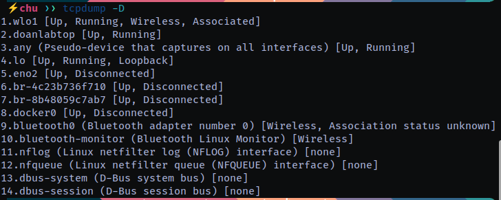
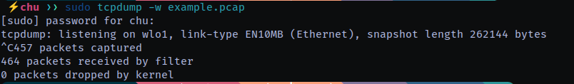

# Kiến thức cơ bản về **tcpdump**:
**tcpdump** là một công cụ dòng lệnh dùng để bắt gói tin trên mạng, giúp phân tích và chẩn đoán lưu lượng mạng.

## 1. **Cài đặt tcpdump**
- **Ubuntu/Debian:**  
  ```bash
  sudo apt install tcpdump
  ```
- **CentOS/RHEL:**  
  ```bash
  sudo yum install tcpdump
  ```
- **macOS (Homebrew):**  
  ```bash
  brew install tcpdump
  ```

---

## 2. **Các lệnh cơ bản**
- **Kiểm tra danh sách giao diện mạng**  
  ```bash
  tcpdump -D
  ```

  

- **Bắt gói tin trên một giao diện**  
  ```bash
  sudo tcpdump -i eth0
  ```
  (Thay `eth0` bằng giao diện mạng của bạn)

- **Lưu gói tin vào file để phân tích sau**  
  ```bash
  sudo tcpdump -i eth0 -w file.pcap
  ```


  Đọc lại file đã lưu:
  ```bash
  tcpdump -r file.pcap
  ```

---

## 3. **Lọc gói tin**
### a) **Lọc theo địa chỉ IP**
- Bắt gói tin từ hoặc đến một IP:
  ```bash
  tcpdump -i eth0 host 192.168.1.1
  ```
- Chỉ bắt gói tin đi từ một IP:
  ```bash
  tcpdump -i eth0 src host 192.168.1.1
  ```
- Chỉ bắt gói tin đến một IP:
  ```bash
  tcpdump -i eth0 dst host 192.168.1.1
  ```

### b) **Lọc theo giao thức**
- Bắt gói tin TCP:
  ```bash
  tcpdump -i eth0 tcp
  ```
- Bắt gói tin UDP:
  ```bash
  tcpdump -i eth0 udp
  ```
- Bắt gói tin ICMP (ping):
  ```bash
  tcpdump -i eth0 icmp
  ```

### c) **Lọc theo cổng**
- Bắt gói tin HTTP (cổng 80):
  ```bash
  tcpdump -i eth0 port 80
  ```
- Bắt gói tin SSH (cổng 22):
  ```bash
  tcpdump -i eth0 port 22
  ```
- Bắt gói tin từ hoặc đến nhiều cổng:
  ```bash
  tcpdump -i eth0 port 22 or port 443
  ```

### d) **Lọc theo mạng**
- Bắt gói tin từ mạng 192.168.1.0/24:
  ```bash
  tcpdump -i eth0 net 192.168.1.0/24
  ```

---

## 4. **Hiển thị thông tin gói tin chi tiết**
- Hiển thị chi tiết tiêu đề gói tin:
  ```bash
  tcpdump -i eth0 -v
  ```
- Hiển thị rất chi tiết:
  ```bash
  tcpdump -i eth0 -vv
  ```
- Hiển thị cả dữ liệu thô của gói tin:
  ```bash
  tcpdump -i eth0 -X
  ```
- Hiển thị dữ liệu dạng hex và ASCII:
  ```bash
  tcpdump -i eth0 -XX
  ```

---

## 5. **Kết hợp nhiều bộ lọc**
- Bắt gói tin TCP từ 192.168.1.1 đến cổng 80:
  ```bash
  tcpdump -i eth0 tcp and src host 192.168.1.1 and port 80
  ```
- Bắt tất cả gói tin ngoại trừ SSH:
  ```bash
  tcpdump -i eth0 not port 22
  ```

---

## 6. **Một số tùy chọn hữu ích**
- **Giới hạn số lượng gói tin bắt được** (ví dụ: 10 gói):
  ```bash
  tcpdump -i eth0 -c 10
  ```
- **Giới hạn kích thước gói tin được bắt** (chỉ lấy 100 byte đầu mỗi gói):
  ```bash
  tcpdump -i eth0 -s 100
  ```
- **Bắt gói tin nhưng không phân giải tên miền** (giảm tải hệ thống):
  ```bash
  tcpdump -i eth0 -n
  ```
- **Bắt gói tin và hiển thị thời gian đầy đủ**:
  ```bash
  tcpdump -i eth0 -tttt
  ```

---

## 7. **Phân tích file .pcap bằng Wireshark**
File `.pcap` có thể mở bằng **Wireshark** để phân tích trực quan hơn.

Cài Wireshark:
```bash
sudo apt install wireshark
```
Mở file `.pcap`:
```bash
wireshark file.pcap
```

---

## 8. **Ví dụ thực tế**
### a) **Giám sát lưu lượng HTTP**
```bash
sudo tcpdump -i eth0 port 80 -A
```
(Xem nội dung HTTP dưới dạng ASCII)

### b) **Phát hiện cuộc tấn công ping flood**
```bash
sudo tcpdump -i eth0 icmp
```

### c) **Kiểm tra lưu lượng SSH**
```bash
sudo tcpdump -i eth0 port 22
```

---

## **Tóm tắt nhanh**
| Lệnh | Chức năng |
|------|----------|
| `tcpdump -i eth0` | Bắt tất cả gói tin trên `eth0` |
| `tcpdump -D` | Liệt kê các giao diện mạng |
| `tcpdump -i eth0 port 80` | Bắt gói tin HTTP |
| `tcpdump -i eth0 host 192.168.1.1` | Bắt gói tin từ/đến IP 192.168.1.1 |
| `tcpdump -i eth0 -w file.pcap` | Lưu gói tin vào file |
| `tcpdump -r file.pcap` | Đọc file gói tin |
| `tcpdump -i eth0 -n` | Không phân giải tên miền |
| `tcpdump -i eth0 -X` | Hiển thị dữ liệu thô của gói tin |

---

# **Hướng dẫn sử dụng Wireshark để phân tích gói tin mạng**

Wireshark là một công cụ mạnh mẽ dùng để bắt và phân tích lưu lượng mạng theo cách trực quan hơn so với tcpdump.

---

## **1. Cài đặt Wireshark**
### **Trên Linux**
- **Ubuntu/Debian**:
  ```bash
  sudo apt update
  sudo apt install wireshark
  ```
  Trong quá trình cài đặt, nếu được hỏi *"Should non-superusers be able to capture packets?"*, chọn **Yes** để sử dụng Wireshark mà không cần quyền root.

- **CentOS/RHEL**:
  ```bash
  sudo yum install wireshark
  ```

### **Trên macOS**
Nếu đã cài **Homebrew**, chạy:
```bash
brew install wireshark
```

### **Trên Windows**
1. Tải Wireshark từ trang chính thức: [https://www.wireshark.org/download.html](https://www.wireshark.org/download.html)
2. Chạy file `.exe` và làm theo hướng dẫn.

---

## **2. Mở Wireshark và bắt gói tin**
### **Bước 1: Chạy Wireshark**
Mở Wireshark từ Start Menu (Windows) hoặc terminal (`wireshark &` trên Linux).

### **Bước 2: Chọn giao diện mạng**
- Sau khi mở Wireshark, bạn sẽ thấy danh sách các **giao diện mạng** (`Interfaces`).
- Chọn giao diện cần theo dõi (VD: Wi-Fi, Ethernet) rồi bấm **Start**.

### **Bước 3: Dừng bắt gói tin**
- Nhấn nút **Stop** (🔴) hoặc phím **Ctrl + E**.

---

## **3. Lọc gói tin**
Wireshark cho phép sử dụng bộ lọc để dễ dàng tìm kiếm gói tin quan trọng.

### **a) Lọc bằng Display Filter (lọc hiển thị)**
- **Lọc theo giao thức**:
  ```plaintext
  http
  tcp
  udp
  icmp
  dns
  ```
- **Lọc theo địa chỉ IP**:
  ```plaintext
  ip.src == 192.168.1.1  # Chỉ hiển thị gói tin từ IP này
  ip.dst == 192.168.1.100  # Chỉ hiển thị gói tin đến IP này
  ip.addr == 192.168.1.1  # Hiển thị cả gửi và nhận từ IP này
  ```
- **Lọc theo cổng**:
  ```plaintext
  tcp.port == 80   # Chỉ hiển thị gói tin HTTP
  udp.port == 53   # Chỉ hiển thị gói tin DNS
  ```
- **Lọc theo từ khóa trong dữ liệu gói tin**:
  ```plaintext
  frame contains "password"  # Tìm gói tin chứa từ "password"
  ```

### **b) Lọc bằng Capture Filter (lọc trong quá trình bắt)**
- **Bắt gói tin từ IP cụ thể**:
  ```plaintext
  host 192.168.1.1
  ```
- **Bắt gói tin TCP hoặc UDP**:
  ```plaintext
  tcp
  udp
  ```
- **Bắt gói tin HTTP (cổng 80)**:
  ```plaintext
  port 80
  ```
- **Bắt gói tin ICMP (ping)**:
  ```plaintext
  icmp
  ```

---

## **4. Phân tích gói tin**
### **a) Hiểu về giao diện Wireshark**
Wireshark có **ba phần chính**:
1. **Danh sách gói tin** (Packet List): Hiển thị tất cả gói tin đã bắt được.
2. **Chi tiết gói tin** (Packet Details): Hiển thị thông tin chi tiết về gói tin đang chọn.
3. **Dữ liệu thô (Packet Bytes)**: Hiển thị dữ liệu dạng hex và ASCII.

### **b) Các thông tin quan trọng trong một gói tin**
- **Source (SRC)**: Địa chỉ IP nguồn.
- **Destination (DST)**: Địa chỉ IP đích.
- **Protocol**: Giao thức (TCP, UDP, ICMP, DNS, HTTP...).
- **Length**: Kích thước gói tin.
- **Info**: Thông tin tóm tắt gói tin.

### **c) Xem nội dung gói tin**
- Nhấn vào một gói tin trong danh sách.
- Dưới phần **Packet Details**, mở rộng mục **Hypertext Transfer Protocol** để xem nội dung HTTP.
- Đối với TCP, có thể thấy cổng và các cờ (SYN, ACK...).

---

## **5. Xuất và phân tích dữ liệu**
### **a) Lưu gói tin**
- **Lưu gói tin đã bắt**:
  1. Vào **File > Save As**.
  2. Chọn định dạng `.pcapng` hoặc `.pcap`.

- **Mở file đã lưu**:
  ```bash
  wireshark file.pcap
  ```

### **b) Xuất dữ liệu gói tin**
- Xuất dữ liệu sang **CSV, JSON, XML** qua **File > Export Packet Dissections**.

---

## **6. Một số tình huống thực tế**
### **a) Phân tích HTTP để tìm dữ liệu đăng nhập**
1. Sử dụng filter:
   ```plaintext
   http.request.method == "POST"
   ```
2. Kiểm tra phần **Form data** để xem username, password (nếu không mã hóa).

### **b) Xem các kết nối TCP đang mở**
- Dùng filter:
  ```plaintext
  tcp.flags.syn == 1 and tcp.flags.ack == 0
  ```
  → Hiển thị các gói **SYN**, tức là kết nối TCP mới.

### **c) Kiểm tra tấn công DDoS**
- Dùng filter:
  ```plaintext
  ip.src == 192.168.1.1 and tcp.flags.syn == 1
  ```
  → Kiểm tra xem có quá nhiều kết nối SYN từ một IP không.

---

## **7. Mẹo nâng cao**
### **a) Dùng Wireshark để theo dõi các thiết bị IoT**
- Dùng filter:
  ```plaintext
  eth.src == 00:1A:2B:3C:4D:5E
  ```
  → Lọc theo địa chỉ MAC của thiết bị IoT.

### **b) Phân tích DNS requests để phát hiện malware**
- Dùng filter:
  ```plaintext
  dns.qry.name contains "malicious-domain.com"
  ```
  → Xem liệu thiết bị có đang truy cập domain độc hại không.

### **c) Theo dõi tải xuống file từ HTTP**
- Dùng filter:
  ```plaintext
  http.response.code == 200 and http.content_type contains "application/octet-stream"
  ```
  → Xem gói tin tải xuống file.

---

## **8. So sánh Wireshark với tcpdump**
| Tính năng         | Wireshark | tcpdump |
|------------------|-----------|---------|
| Giao diện đồ họa | ✅ Có | ❌ Không |
| Lọc mạnh mẽ | ✅ Có | ✅ Có |
| Phân tích dữ liệu | ✅ Có | ❌ Không |
| Hiển thị dữ liệu trực quan | ✅ Có | ❌ Không |
| Lưu gói tin | ✅ Có | ✅ Có |

---

## **9. Kết luận**
Wireshark là một công cụ phân tích mạng mạnh mẽ, giúp kiểm tra lưu lượng, phát hiện tấn công và chẩn đoán lỗi mạng dễ dàng hơn. Nếu bạn mới bắt đầu, hãy thử:
- Bắt gói tin HTTP.
- Xem lưu lượng DNS.
- Lọc các kết nối TCP mở.


# **Giải thích về ACK trong mạng máy tính (TCP/IP)**

#### **1. ACK là gì?**
ACK (**Acknowledgment**) là một cờ (**flag**) trong giao thức **TCP** (Transmission Control Protocol), dùng để xác nhận rằng một gói tin hoặc một tập dữ liệu đã được nhận thành công.

- Khi một thiết bị gửi dữ liệu, nó mong đợi một **ACK** từ phía nhận để xác nhận rằng dữ liệu đã đến nơi.
- Nếu không nhận được **ACK**, thiết bị gửi sẽ giả định rằng gói tin bị mất hoặc lỗi và gửi lại.

---

#### **2. Cách hoạt động của ACK trong TCP**
Giao thức TCP sử dụng **cơ chế bắt tay ba bước (3-way handshake)** để thiết lập kết nối giữa hai thiết bị. **ACK đóng vai trò quan trọng** trong quá trình này.

**🌟 Bắt tay 3 bước của TCP (TCP 3-way Handshake):**
1. **SYN (Synchronize):** Máy gửi (Client) gửi một gói tin có cờ **SYN** đến máy nhận (Server) để bắt đầu kết nối.
2. **SYN-ACK:** Máy nhận phản hồi bằng một gói tin có cờ **SYN và ACK** để xác nhận yêu cầu kết nối.
3. **ACK:** Máy gửi gửi lại một gói tin có cờ **ACK** để hoàn tất quá trình bắt tay.

✅ Sau khi quá trình bắt tay hoàn tất, dữ liệu mới có thể truyền tải giữa hai máy.

---

#### **3. Ví dụ về ACK trong truyền dữ liệu TCP**
🔹 **Ví dụ:**
- Máy A gửi một gói tin có số thứ tự (`SEQ = 1`) đến Máy B.
- Máy B nhận được gói tin và phản hồi lại bằng một **ACK** với **Số ACK (ACK Number) = 2**, nghĩa là nó đã nhận được gói `SEQ = 1` và mong đợi gói tiếp theo có `SEQ = 2`.
- Nếu Máy A không nhận được **ACK**, nó sẽ gửi lại gói tin.

**Ví dụ thực tế trên Wireshark:**
```plaintext
Packet 1: A → B  [SEQ=1, ACK=0, SYN]
Packet 2: B → A  [SEQ=1, ACK=2, SYN-ACK]
Packet 3: A → B  [SEQ=2, ACK=2, ACK]
```

---

#### **4. Vai trò của ACK trong kiểm soát lỗi**
- Nếu một gói tin bị mất hoặc hỏng, máy nhận **không gửi ACK**.
- Sau một khoảng thời gian, máy gửi sẽ gửi lại gói tin.
- Đây là cơ chế **TCP Retransmission** giúp đảm bảo dữ liệu không bị mất.

🛑 **Ví dụ lỗi trong Wireshark**:
```plaintext
Packet 1: A → B  [SEQ=1, ACK=0]
Packet 2: A → B  [SEQ=1, ACK=0] (Retransmission, do không nhận được ACK)
```

---

#### **5. Một số trạng thái ACK đặc biệt**
1. **ACK bị mất**:
   - Máy gửi sẽ gửi lại dữ liệu sau khi hết **Timeout**.

2. **ACK bị trễ (Delayed ACK)**:
   - TCP có thể trì hoãn ACK một chút để giảm số lượng gói tin trên mạng.

3. **ACK kép (Duplicate ACK)**:
   - Nếu một gói tin bị mất, thiết bị nhận có thể gửi **ACK trùng lặp** để báo cho thiết bị gửi biết cần retransmit.

4. **Fast Retransmit (Gửi lại nhanh)**:
   - Nếu thiết bị gửi nhận được 3 **ACK trùng lặp**, nó sẽ hiểu rằng một gói tin đã mất và gửi lại ngay mà không cần đợi timeout.

---

#### **6. So sánh TCP ACK với UDP**
| **Tính năng** | **TCP (ACK có mặt)** | **UDP (Không có ACK)** |
|--------------|--------------------|----------------------|
| Đảm bảo dữ liệu | ✅ Có (nhờ ACK) | ❌ Không (không có ACK) |
| Kiểm soát lỗi | ✅ Có | ❌ Không |
| Độ trễ | ❌ Cao hơn do cần chờ ACK | ✅ Thấp hơn do không cần chờ ACK |
| Ứng dụng | HTTP, SSH, FTP | VoIP, Streaming, Gaming |

---

### **7. Kết luận**
- **ACK** là một phần quan trọng của TCP, giúp xác nhận dữ liệu đã đến nơi an toàn.
- Nó giúp TCP trở thành một giao thức **đáng tin cậy**, đảm bảo không có gói tin bị mất mà không được gửi lại.
- Nếu bạn thấy nhiều **ACK bị trễ, mất hoặc trùng lặp** trong Wireshark, có thể hệ thống đang gặp vấn đề về kết nối.

# **Giải thích về SYN trong TCP/IP**

#### **1. SYN là gì?**
SYN (**Synchronize**) là một cờ (**flag**) trong tiêu đề của giao thức **TCP**. Nó được sử dụng để bắt đầu một kết nối giữa hai thiết bị theo cơ chế **TCP 3-way handshake** (bắt tay ba bước).

- Khi một thiết bị muốn thiết lập kết nối TCP, nó gửi một gói tin **SYN** đến thiết bị đích.
- Nếu thiết bị đích chấp nhận, nó sẽ phản hồi bằng một gói **SYN-ACK**.
- Sau đó, thiết bị gửi ban đầu xác nhận bằng một gói **ACK**.

🛑 **Lưu ý:** SYN chỉ xuất hiện trong quá trình thiết lập kết nối và không có trong các gói tin dữ liệu thông thường.

---

### **2. Cách hoạt động của SYN trong TCP**
Giao thức TCP sử dụng **cơ chế bắt tay ba bước (3-way handshake)** để thiết lập một kết nối đáng tin cậy.

**🌟 3 bước bắt tay TCP (TCP 3-way handshake):**
1. **Client → Server:** Gửi gói tin SYN
   ```plaintext
   SYN (SEQ=x)
   ```
   - Client chọn một số thứ tự ban đầu (`SEQ=x`).
   - Yêu cầu thiết lập kết nối với Server.

2. **Server → Client:** Phản hồi bằng SYN-ACK
   ```plaintext
   SYN-ACK (SEQ=y, ACK=x+1)
   ```
   - Server gửi **SYN** để đồng bộ hóa.
   - Đồng thời gửi **ACK=x+1** để xác nhận đã nhận SYN từ Client.

3. **Client → Server:** Gửi ACK để hoàn tất kết nối
   ```plaintext
   ACK (SEQ=x+1, ACK=y+1)
   ```
   - Client gửi **ACK** để xác nhận gói SYN-ACK từ Server.
   - Sau bước này, kết nối TCP được thiết lập và sẵn sàng truyền dữ liệu.

✅ **Sau khi quá trình bắt tay hoàn tất, cả hai thiết bị có thể trao đổi dữ liệu một cách an toàn.**

---

### **3. Ví dụ về SYN trong Wireshark**
Trong Wireshark, khi bắt đầu một kết nối TCP, bạn sẽ thấy chuỗi gói tin như sau:

1. **Gói SYN từ Client đến Server**
   ```plaintext
   Frame 1: TCP 192.168.1.2 → 192.168.1.3 [SYN] SEQ=1000
   ```
   - Client (192.168.1.2) yêu cầu kết nối với Server (192.168.1.3).
   - `SEQ=1000`: Số thứ tự ban đầu của Client.

2. **Gói SYN-ACK từ Server đến Client**
   ```plaintext
   Frame 2: TCP 192.168.1.3 → 192.168.1.2 [SYN, ACK] SEQ=2000, ACK=1001
   ```
   - Server phản hồi bằng **SYN-ACK**.
   - `SEQ=2000`: Số thứ tự ban đầu của Server.
   - `ACK=1001`: Xác nhận đã nhận `SEQ=1000` từ Client.

3. **Gói ACK từ Client đến Server**
   ```plaintext
   Frame 3: TCP 192.168.1.2 → 192.168.1.3 [ACK] SEQ=1001, ACK=2001
   ```
   - Client gửi **ACK** để hoàn tất kết nối.
   - `ACK=2001`: Xác nhận đã nhận `SEQ=2000` từ Server.

🔹 **Sau giai đoạn này, dữ liệu thực tế có thể được truyền tải.**

---

### **4. SYN Flood Attack - Tấn công từ chối dịch vụ bằng SYN**
🚨 **SYN Flood** là một loại **tấn công từ chối dịch vụ (DoS/DDoS)** lợi dụng quá trình bắt tay 3 bước của TCP.

#### **Cách hoạt động của SYN Flood**
1. **Kẻ tấn công gửi một lượng lớn gói tin SYN** đến Server mục tiêu.
2. **Server phản hồi bằng SYN-ACK**, chờ Client hoàn tất kết nối.
3. **Nhưng kẻ tấn công không gửi ACK**, làm Server giữ tài nguyên kết nối trong trạng thái chờ.
4. **Khi quá nhiều kết nối SYN chưa hoàn tất**, Server hết tài nguyên và không thể phục vụ các yêu cầu hợp lệ.

🛑 **Dấu hiệu SYN Flood trong Wireshark**:
- Rất nhiều gói SYN đến từ các địa chỉ IP khác nhau.
- Không có (hoặc rất ít) gói ACK từ phía Client.

🔹 **Cách giảm thiểu SYN Flood**:
- **Sử dụng SYN Cookies**: Giúp Server không giữ trạng thái kết nối khi nhận quá nhiều SYN.
- **Hạn chế số lượng kết nối TCP chưa hoàn tất** (`net.ipv4.tcp_max_syn_backlog` trong Linux).
- **Firewall rules** để chặn các gói SYN không hợp lệ.

---

### **5. So sánh SYN và ACK**
| **Thuộc tính** | **SYN** | **ACK** |
|--------------|--------|--------|
| Vai trò | Bắt đầu kết nối | Xác nhận dữ liệu đã nhận |
| Xuất hiện khi nào? | Bắt tay TCP (kết nối ban đầu) | Suốt quá trình truyền dữ liệu |
| Gói tin liên quan | SYN, SYN-ACK | ACK |
| Có thể bị tấn công? | Có (SYN Flood) | Không phổ biến |

---

### **6. Kết luận**
- **SYN** là bước đầu tiên của kết nối TCP, giúp đồng bộ hóa giữa hai thiết bị.
- **Bắt tay ba bước (3-way handshake) với SYN, SYN-ACK, ACK** giúp thiết lập một kết nối đáng tin cậy.
- **SYN Flood** là một dạng tấn công DoS/DDoS phổ biến làm quá tải tài nguyên Server.
- Dùng **Wireshark** để kiểm tra trạng thái SYN, giúp phát hiện sự bất thường trong mạng.
