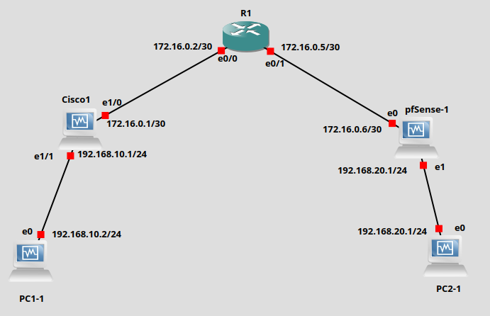

## 📘 Nhiệm vụ

1. **Cấu hình mô hình mạng thí nghiệm trong GNS3**, bao gồm các nút sau:

   * Các PC (client)
   * Các gateway (router/firewall)
   * Thiết bị trung gian (nếu có)

2. **Kiểm tra khả năng truy cập lẫn nhau giữa các gateway**:

   * Sử dụng `ping`, `traceroute` hoặc công cụ tương tự để xác minh kết nối.

3. **Thực hiện cấu hình cần thiết cho đường hầm IPSEC site-to-site** theo yêu cầu bài tập:

   * Thiết lập Phase 1 (ISAKMP/IKE)
   * Thiết lập Phase 2 (ESP/AH)
   * Chọn thuật toán mã hóa, xác thực, và nhóm DH phù hợp.

4. **Đảm bảo đường hầm hoạt động bình thường**:

   * Kiểm tra trạng thái tunnel (`ipsec status`, `show vpn`, hoặc GUI pfSense).
   * **Lưu lượng mạng phải được định tuyến qua đường hầm** (kiểm tra bằng `tcpdump`, `wireshark` hoặc `traceroute`).

5. **Nghiên cứu cấu trúc tiêu đề (header) của từng giao thức tunneling**:

   * IPsec ESP / AH
   * GRE (nếu có)
   * So sánh độ dài, thông tin nhận dạng, bảo mật...

6. **Đo thông lượng của kênh truyền**:

   * **Trước khi sử dụng IPsec tunnel** (`iperf3` hoặc công cụ tương tự)
   * **Sau khi bật IPsec tunnel**
   * Đo và **so sánh thông lượng**:

     * Kênh thường
     * Kênh IPsec
     * Các cấu hình giao thức tunneling khác nhau (nếu có)

---

## 🔐 Cấu hình chi tiết IPsec

### 📌 Phase 1 (ISAKMP)

| Thông số                     | Giá trị              |
| ---------------------------- | -------------------- |
| **Exchange type**            | Main mode            |
| **Authentication method**    | PSK (Pre-Shared Key) |
| **Encryption algorithm**     | AES-256-CTR          |
| **Authentication algorithm** | SHA-256              |
| **Diffie-Hellman group**     | Group 2              |
| **IKE session key lifetime** | 86400 giây (1 ngày)  |

---

### 📌 Phase 2 (IPsec)

| Thông số                          | Giá trị           |
| --------------------------------- | ----------------- |
| **IPSec Protocol**                | ESP               |
| **Mode**                          | Tunnel            |
| **Encryption algorithm**          | AES-256-CTR       |
| **Authentication algorithm**      | HMAC-SHA-256      |
| **IPSec session key lifetime**    | 3600 giây (1 giờ) |
| **Perfect Forward Secrecy (PFS)** | Group 5           |

---

## 🖧 Cấu hình IP cho các thiết bị trong mô hình mạng

| **Thiết bị (Device)** | **Cổng (Port)** | **Địa chỉ IP (/30 hoặc /24)** | **Vai trò (Role)**  |
| --------------------- | --------------- | ----------------------------- | ------------------- |
| **PC1-1**             | `e0`            | `192.168.10.2/24`             | Client A            |
| **Cisco1**            | `e1/1`          | `192.168.10.1/24`             | LAN A               |
|                       | `e1/0`          | `172.16.0.1/30`               | WAN A               |
| **R1**                | `e0/0`          | `172.16.0.2/30`               | Kết nối với Cisco1  |
|                       | `e0/1`          | `172.16.0.5/30`               | Kết nối với pfSense |
| **pfSense-1**         | `WAN`           | `172.16.0.6/30`               | WAN B               |
|                       | `LAN`           | `192.168.20.1/24`             | LAN B               |
| **PC2-1**             | `e0`            | `192.168.20.2/24`             | Client B            |

---
## Network diagram:

