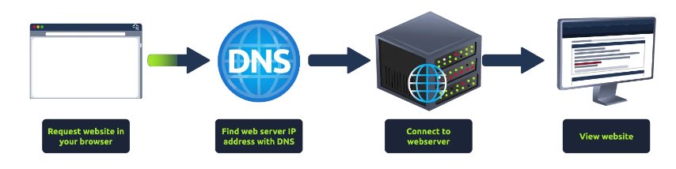
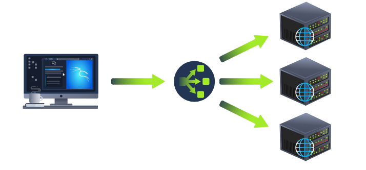
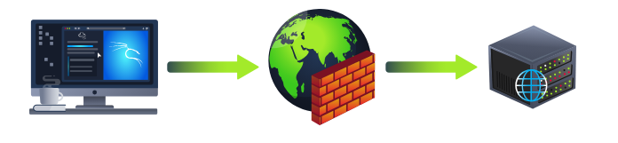
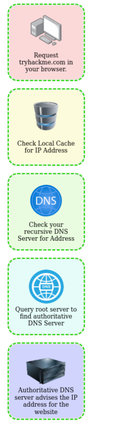
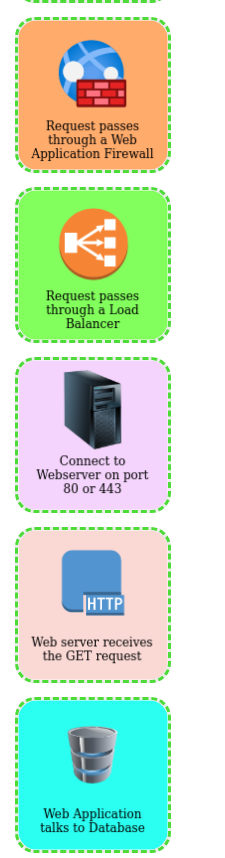

# Putting it all together

> Tổng hợp tất cả: Tìm hiểu cách tất cả các thành phần riêng lẻ của web hoạt động cùng nhau để giúp bạn truy cập vào các trang web yêu thích của mình.


## Mục Lục

1. [Task 1: Putting It All Together](#task-1-putting-it-all-together)

2. [Task 2: Other Components](#task-2-other-components)

3. [Task 3: How Web Servers Work](#task-3-how-web-servers-work)

4. [Task 4: Quiz](#task-4-quiz)

## Nội dung

# Task 1: Putting It All Together

**Tổng hợp tất cả**

Từ các module trước, bạn đã học được rằng có rất nhiều thứ diễn ra đằng sau khi bạn yêu cầu truy cập một trang web trong trình duyệt của mình.

Tóm lại, khi bạn yêu cầu một trang web, máy tính của bạn cần biết địa chỉ IP của máy chủ mà nó cần giao tiếp; để làm điều này, nó sử dụng DNS. Sau đó, máy tính của bạn giao tiếp với máy chủ web bằng một tập hợp lệnh đặc biệt được gọi là giao thức HTTP; máy chủ web sau đó trả về HTML, JavaScript, CSS, hình ảnh, v.v., mà trình duyệt của bạn sử dụng để định dạng và hiển thị chính xác trang web cho bạn.



Ngoài ra còn có một số thành phần khác giúp web hoạt động hiệu quả hơn và cung cấp các tính năng bổ sung.

# Task 2: Other Components

**Các thành phần khác**

## **Bộ cân bằng tải**

Khi lưu lượng truy cập vào một trang web trở nên rất lớn hoặc một ứng dụng cần có tính sẵn sàng cao, một máy chủ web duy nhất có thể không còn đủ khả năng xử lý. Bộ cân bằng tải cung cấp hai tính năng chính, đảm bảo rằng các trang web có lưu lượng cao có thể xử lý tải và cung cấp khả năng dự phòng nếu một máy chủ trở nên không phản hồi.

Khi bạn yêu cầu một trang web sử dụng bộ cân bằng tải, bộ cân bằng tải sẽ nhận yêu cầu của bạn trước và sau đó chuyển tiếp nó đến một trong các máy chủ phía sau nó. Bộ cân bằng tải sử dụng các thuật toán khác nhau để quyết định máy chủ nào là tốt nhất để xử lý yêu cầu. Một vài ví dụ về các thuật toán này là **vòng tròn luân phiên (round-robin)**, chuyển yêu cầu đến từng máy chủ lần lượt, hoặc **trọng số (weighted)**, kiểm tra số lượng yêu cầu mà một máy chủ hiện đang xử lý và gửi đến máy chủ ít bận rộn nhất.

Bộ cân bằng tải cũng thực hiện các kiểm tra định kỳ với từng máy chủ để đảm bảo chúng đang hoạt động chính xác; điều này được gọi là **kiểm tra tình trạng (health check)**. Nếu một máy chủ không phản hồi đúng cách hoặc không phản hồi, bộ cân bằng tải sẽ ngừng gửi lưu lượng truy cập đến máy chủ đó cho đến khi nó phản hồi bình thường trở lại.



## **CDN (Mạng phân phối nội dung - Content Delivery Networks)**

CDN có thể là một nguồn tài nguyên tuyệt vời để giảm tải lưu lượng truy cập cho một trang web bận rộn. Nó cho phép bạn lưu trữ các tệp tĩnh từ trang web của bạn, chẳng hạn như JavaScript, CSS, Hình ảnh, Video, và lưu trữ chúng trên hàng ngàn máy chủ trên khắp thế giới. Khi người dùng yêu cầu một trong những tệp được lưu trữ, CDN sẽ xác định vị trí máy chủ gần nhất về mặt vật lý và gửi yêu cầu đến đó thay vì phải gửi qua bên kia thế giới.

## **Cơ sở dữ liệu (Databases)**

Các trang web thường cần một cách để lưu trữ thông tin cho người dùng của họ. Máy chủ web có thể giao tiếp với cơ sở dữ liệu để lưu trữ và truy xuất dữ liệu từ đó. Cơ sở dữ liệu có thể chỉ đơn giản là một tệp văn bản đơn thuần hoặc phức tạp hơn là các cụm máy chủ nhiều lớp cung cấp tốc độ và khả năng phục hồi cao. Bạn có thể gặp các cơ sở dữ liệu phổ biến như: MySQL, MSSQL, MongoDB, Postgres, và nhiều loại khác; mỗi loại có các tính năng cụ thể riêng.

## **Tường lửa ứng dụng web (WAF - Web Application Firewall)**

WAF nằm giữa yêu cầu web của bạn và máy chủ web; mục đích chính của nó là bảo vệ máy chủ web khỏi bị tấn công hoặc từ chối dịch vụ (DoS). Nó phân tích các yêu cầu web để phát hiện các kỹ thuật tấn công phổ biến, bất kể yêu cầu đến từ trình duyệt thực hay từ bot. Nó cũng kiểm tra xem có quá nhiều yêu cầu web được gửi đi hay không bằng cách sử dụng một phương pháp gọi là **giới hạn tốc độ (rate limiting)**, chỉ cho phép một số lượng yêu cầu nhất định từ một địa chỉ IP trong mỗi giây. Nếu một yêu cầu bị coi là tiềm năng tấn công, nó sẽ bị loại bỏ và không bao giờ được gửi đến máy chủ web.



**Trả lời các câu hỏi dưới đây**  

1. **Cái gì có thể được sử dụng để lưu trữ các tệp tĩnh và tăng tốc truy cập của khách hàng đến một website?**  
<details>  
<summary>Hiển thị đáp án</summary>  
Đáp án: CDN  
</details>  

2. **Trình cân bằng tải thực hiện điều gì để đảm bảo một máy chủ vẫn hoạt động?**  
<details>  
<summary>Hiển thị đáp án</summary>  
Đáp án: health check  
</details>  

3. **Cái gì có thể được sử dụng để chống lại việc tấn công một website?**  
<details>  
<summary>Hiển thị đáp án</summary>  
Đáp án: WAF  
</details>  

# Task 3: How Web Servers Work

**Cách hoạt động của máy chủ web**

## **Máy chủ web là gì?**

Máy chủ web là một phần mềm lắng nghe các kết nối đến và sau đó sử dụng giao thức **HTTP** để cung cấp nội dung web đến cho các máy khách. Các phần mềm máy chủ web phổ biến nhất mà bạn sẽ gặp bao gồm Apache, Nginx, IIS và NodeJS. Một máy chủ web cung cấp các tệp từ cái gọi là thư mục gốc của nó, được định nghĩa trong cài đặt của phần mềm. Ví dụ, Nginx và Apache chia sẻ cùng một vị trí mặc định là **/var/www/html** trong các hệ điều hành Linux, còn IIS sử dụng **C:\inetpub\wwwroot** cho hệ điều hành Windows. Vì vậy, ví dụ, nếu bạn yêu cầu tệp **http://www.example.com/picture.jpg**, nó sẽ gửi tệp **/var/www/html/picture.jpg** từ ổ cứng cục bộ của nó.

## **Máy chủ ảo (Virtual Hosts)**

Máy chủ web có thể lưu trữ nhiều trang web với các tên miền khác nhau; để thực hiện điều này, nó sử dụng máy chủ ảo. Phần mềm máy chủ web kiểm tra tên máy chủ (hostname) được yêu cầu từ các tiêu đề HTTP và so sánh nó với danh sách các máy chủ ảo của nó (máy chủ ảo chỉ là các tệp cấu hình dựa trên văn bản). Nếu tìm thấy một khớp, trang web chính xác sẽ được cung cấp. Nếu không tìm thấy khớp nào, trang web mặc định sẽ được cung cấp thay thế.

Máy chủ ảo có thể có thư mục gốc của chúng được ánh xạ đến các vị trí khác nhau trên ổ cứng. Ví dụ: **one.com** được ánh xạ đến **/var/www/website_one**, và **two.com** được ánh xạ đến **/var/www/website_two**.

Không có giới hạn về số lượng các trang web khác nhau mà bạn có thể lưu trữ trên một máy chủ web.

## **Nội dung tĩnh và nội dung động**

Nội dung tĩnh, như tên gọi, là nội dung không bao giờ thay đổi. Ví dụ phổ biến của nội dung này bao gồm hình ảnh, JavaScript, CSS, v.v., nhưng cũng có thể bao gồm các tệp HTML không thay đổi. Hơn nữa, đây là những tệp được gửi trực tiếp từ máy chủ web mà không có bất kỳ thay đổi nào.

Ngược lại, nội dung động là nội dung có thể thay đổi tùy theo từng yêu cầu khác nhau. Lấy ví dụ, một blog. Trên trang chủ của blog, nó sẽ hiển thị các bài viết mới nhất. Nếu có một bài viết mới được tạo, trang chủ sẽ được cập nhật với bài viết mới nhất, hoặc một ví dụ khác là trang tìm kiếm trên blog. Tùy thuộc vào từ khóa mà bạn tìm kiếm, kết quả khác nhau sẽ được hiển thị.

Những thay đổi đối với những gì bạn nhìn thấy được thực hiện thông qua cái được gọi là **Backend** (phần nền) bằng cách sử dụng các ngôn ngữ lập trình và kịch bản. Nó được gọi là Backend bởi vì tất cả những gì được thực hiện đều xảy ra phía sau. Bạn không thể xem mã nguồn HTML của trang web và biết điều gì đang xảy ra trong Backend, trong khi HTML là kết quả của quá trình xử lý từ Backend. Tất cả những gì bạn thấy trong trình duyệt được gọi là **Frontend**.

## **Ngôn ngữ kịch bản và Backend**

Không có giới hạn lớn nào đối với những gì một ngôn ngữ Backend có thể đạt được, và chính điều này làm cho một trang web có tính tương tác với người dùng. Một số ví dụ về các ngôn ngữ này (không theo thứ tự cụ thể) là **PHP**, Python, Ruby, NodeJS, Perl và nhiều ngôn ngữ khác. Những ngôn ngữ này có thể tương tác với cơ sở dữ liệu, gọi các dịch vụ bên ngoài, xử lý dữ liệu từ người dùng, và còn nhiều nữa. Một ví dụ cơ bản về **PHP** sẽ là khi bạn yêu cầu trang web **http://example.com/index.php?name=adam**.

Nếu tệp **index.php** được xây dựng như sau:

```php
<html><body>Hello <?php echo $_GET["name"]; ?></body></html>
```

Kết quả trả về cho máy khách sẽ là:

```html
<html><body>Hello adam</body></html>
```

Bạn sẽ nhận thấy rằng máy khách không nhìn thấy bất kỳ mã PHP nào bởi vì nó được thực hiện ở **Backend**. Tính tương tác này mở ra nhiều vấn đề bảo mật hơn đối với các ứng dụng web chưa được xây dựng một cách an toàn, như bạn sẽ tìm hiểu trong các module tiếp theo.


**Trả lời các câu hỏi dưới đây**  

1. **Phần mềm máy chủ web sử dụng gì để lưu trữ nhiều website?**  
<details>  
<summary>Hiển thị đáp án</summary>  
Đáp án: Virtual Hosts  
</details>  

2. **Tên của loại nội dung có thể thay đổi là gì?**  
<details>  
<summary>Hiển thị đáp án</summary>  
Đáp án: Dynamic  
</details>  

3. **Khách hàng có nhìn thấy mã nguồn của backend không? Yay/Nay**  
<details>  
<summary>Hiển thị đáp án</summary>  
Đáp án: Nay  
</details>  

# Task 4: Quiz

Nhấp vào nút "Xem trang web" ở bên phải. Sử dụng mọi thứ bạn đã học được từ các mô-đun khác, kéo và thả các ô theo đúng thứ tự về cách yêu cầu đến một trang web hoạt động để hiển thị cờ.

Lưu ý: Khi đặt một ô vào đúng vị trí, nó sẽ được tô sáng màu xanh lá cây. Khi một ô ở sai vị trí, nó sẽ được tô sáng màu đỏ. Đảm bảo không làm mới trang, vì nó sẽ đặt lại tất cả các ô về trạng thái trống một lần nữa






<details>  
<summary>Hiển thị đáp án</summary>  
Đáp án: THM{YOU_GOT_THE_ORDER}  
</details> 

Dưới đây là mô tả chi tiết hơn về quy trình từ lúc bạn gõ địa chỉ trang web trong trình duyệt cho đến khi trang web hiển thị:

1. **Gõ địa chỉ (URL) vào trình duyệt**  
   - Bạn nhập “tryhackme.com” vào thanh địa chỉ. Trình duyệt sẽ bắt đầu quá trình tìm địa chỉ IP tương ứng với tên miền này.

2. **Kiểm tra bộ nhớ đệm (cache) cục bộ**  
   - Trình duyệt hoặc hệ điều hành có thể đã lưu trữ sẵn địa chỉ IP của “tryhackme.com” nếu bạn đã truy cập trước đó. Nếu tìm thấy bản ghi hợp lệ, quá trình phân giải tên miền (DNS resolution) sẽ kết thúc tại đây. Nếu không, chuyển sang bước tiếp theo.

3. **Kiểm tra máy chủ DNS đệ quy (recursive DNS server)**  
   - Nếu trình duyệt không có thông tin trong cache cục bộ, nó sẽ gửi truy vấn tới máy chủ DNS đệ quy mà bạn đang sử dụng (thường là máy chủ DNS của nhà cung cấp dịch vụ Internet hoặc DNS công cộng như 8.8.8.8 của Google).
   - Máy chủ DNS đệ quy sẽ kiểm tra cache của chính nó. Nếu máy chủ này đã biết địa chỉ IP của “tryhackme.com”, nó sẽ trả về kết quả ngay. Nếu không, nó chuyển sang bước truy vấn các máy chủ DNS cao hơn (root server).

4. **Truy vấn máy chủ gốc (root server) để tìm máy chủ DNS thẩm quyền (authoritative DNS server)**  
   - Máy chủ DNS đệ quy đầu tiên sẽ hỏi các máy chủ gốc về tên miền “.com”. Từ đó, root server sẽ trả về danh sách máy chủ DNS chịu trách nhiệm cho miền “.com”.
   - Máy chủ DNS đệ quy tiếp tục truy vấn máy chủ DNS của miền “tryhackme.com” (tức máy chủ DNS thẩm quyền) để lấy chính xác địa chỉ IP.

5. **Máy chủ DNS thẩm quyền trả về địa chỉ IP**  
   - Máy chủ DNS thẩm quyền của “tryhackme.com” sẽ gửi lại địa chỉ IP chính xác của trang web. Máy chủ DNS đệ quy lưu nó vào cache của mình để phục vụ các yêu cầu tương lai.

6. **Yêu cầu qua Tường lửa Ứng dụng Web (Web Application Firewall - WAF)**  
   - Sau khi đã có địa chỉ IP, trình duyệt sẽ gửi gói tin đến server. Nếu nhà cung cấp dịch vụ hoặc tổ chức sử dụng WAF ở lớp ngoài, gói tin sẽ đi qua WAF trước. WAF sẽ kiểm tra và lọc các yêu cầu đáng ngờ, bảo vệ ứng dụng khỏi các tấn công phổ biến (SQL Injection, XSS, v.v.).

7. **Yêu cầu qua Bộ cân bằng tải (Load Balancer)**  
   - Nếu hạ tầng của trang web có sử dụng Load Balancer, yêu cầu tiếp tục được phân phối đến một trong nhiều máy chủ web (webserver) chạy phía sau. Load Balancer giúp chia tải, đảm bảo tính sẵn sàng và hiệu suất cho hệ thống.

8. **Kết nối đến máy chủ web (Webserver) trên cổng 80 (HTTP) hoặc 443 (HTTPS)**  
   - Máy chủ web lắng nghe kết nối trên cổng 80 (nếu dùng HTTP) hoặc cổng 443 (nếu dùng HTTPS). Sau khi Load Balancer (nếu có) định tuyến, yêu cầu sẽ đến được máy chủ web cụ thể.

9. **Máy chủ web nhận yêu cầu GET**  
   - Máy chủ web nhận và xử lý yêu cầu HTTP GET (hoặc các phương thức khác nếu có). Trong quá trình này, máy chủ web sẽ xác định nội dung cần trả về.

10. **Ứng dụng web trao đổi với cơ sở dữ liệu (Database)**  
   - Nếu trang web cần dữ liệu (vd: nội dung bài viết, thông tin người dùng, v.v.), ứng dụng web sẽ kết nối và truy vấn cơ sở dữ liệu. Sau đó nó xây dựng (hoặc tạo động) trang HTML hoàn chỉnh.

11. **Trình duyệt của bạn kết xuất (render) mã HTML thành trang web hiển thị**  
   - Máy chủ web gửi phản hồi (thường là HTML, kèm CSS, JavaScript, hình ảnh, v.v.).  
   - Trình duyệt nhận dữ liệu, parse (phân tích) mã HTML, tải các tài nguyên liên quan, sau đó dựng (render) giao diện cuối cùng.  
   - Kết quả là bạn thấy được trang “tryhackme.com” hoàn chỉnh trên màn hình.

Như vậy, toàn bộ quy trình bao gồm: phân giải tên miền (DNS resolution) → lọc và phân phối yêu cầu (WAF, Load Balancer) → xử lý trên máy chủ (webserver, ứng dụng web, cơ sở dữ liệu) → trả kết quả (HTML/CSS/JS) về cho trình duyệt. Trình duyệt cuối cùng sẽ hiển thị trang web hoàn chỉnh để người dùng tương tác.
