# Linux Fundamentals Part 1

>   Bắt đầu hành trình tìm hiểu những điều cơ bản của Linux. Học cách chạy một số lệnh thiết yếu đầu tiên trên thiết bị đầu cuối tương tác.

## Mục Lục

1. [Task 1: Introduction](#task-1-introduction)

2. [Task 2: A Bit of Background on Linux](#task-2-a-bit-of-background-on-linux)

3. [Task 3: Interacting With Your First Linux Machine (In-Browser)](#task-3-interacting-with-your-first-linux-machine-in-browser)

4. [Task 4: Running Your First Few Commands](#task-4-running-your-first-few-commands)

5. [Task 5: Interacting With the Filesystem!](#task-5-interacting-with-the-filesystem)

6. [Task 6: Searching for Files](#task-6-searching-for-files)

7. [Task 7: An Introduction to Shell Operators](#task-7-an-introduction-to-shell-operators)

8. [Task 8: Conclusions & Summaries](#task-8-conclusions-summaries)

## Nội dung

# Task 1: Introduction

Chào mừng bạn đến với phần đầu tiên trong chuỗi “Linux Fundamentals”. Rất có thể bạn đang sử dụng máy tính Windows hoặc Mac, cả hai đều có thiết kế giao diện và cách hoạt động khác nhau. Cũng giống như Windows, iOS và MacOS, Linux chỉ đơn giản là một hệ điều hành khác và là một trong những hệ điều hành phổ biến nhất trên thế giới, vận hành xe hơi thông minh, thiết bị Android, siêu máy tính, thiết bị gia dụng, máy chủ doanh nghiệp, và hơn thế nữa.

Chúng ta sẽ tìm hiểu một chút về lịch sử của Linux và sau đó bắt đầu hành trình để bạn trở thành một “phù thủy Linux”! Trong phòng này, bạn sẽ được:

- Chạy những lệnh đầu tiên của mình trên một máy Linux tương tác ngay trong trình duyệt.  
- Học một số lệnh cần thiết để tương tác với hệ thống tệp (file system).  
- Tìm hiểu cách tìm kiếm tệp và được giới thiệu về các toán tử của shell.

# Task 2: A Bit of Background on Linux

**Một chút thông tin nền về Linux**  

**Linux được sử dụng ở đâu?**  
Có thể nói rằng Linux khiến nhiều người cảm thấy “khó tiếp cận” hơn so với các Hệ điều hành (OS) như Windows. Cả hai dạng này đều có những ưu điểm và nhược điểm riêng. Ví dụ, Linux nhẹ hơn đáng kể và bạn sẽ ngạc nhiên khi biết rằng có khả năng rất cao bạn đã sử dụng Linux ở một hình thức nào đó mỗi ngày! Linux hiện đang vận hành những thứ như:  

- Các trang web bạn truy cập  
- Hệ thống giải trí/bảng điều khiển trên xe hơi  
- Hệ thống POS (Point of Sale) như máy tính tiền và quầy thanh toán trong cửa hàng  
- Cơ sở hạ tầng quan trọng như bộ điều khiển đèn giao thông hoặc các cảm biến công nghiệp  

**Các “phiên bản” (flavours) của Linux**  
Tên gọi “Linux” thực chất là một thuật ngữ “bao trùm” cho nhiều Hệ điều hành (OS) dựa trên UNIX (một hệ điều hành khác). Nhờ Linux là mã nguồn mở, các phiên bản của Linux có đủ mọi hình dạng và kích cỡ – phù hợp nhất với mục đích sử dụng của hệ thống.  

Ví dụ, Ubuntu và Debian là một vài trong số những bản phân phối (distribution) Linux phổ biến hơn, bởi chúng rất mở rộng được. Nói cách khác, bạn có thể chạy Ubuntu như một máy chủ (ví dụ: cho website và ứng dụng web) hoặc dùng nó như một máy tính để bàn đầy đủ chức năng. Trong chuỗi bài học này, chúng ta sẽ sử dụng Ubuntu.  

> **Ubuntu Server có thể chạy trên các hệ thống chỉ với 512MB RAM**  

Tương tự như việc Windows có nhiều phiên bản khác nhau (7, 8 và 10), Linux cũng có rất nhiều phiên bản/bản phân phối (distribution) khác nhau.  

**Hãy trả lời các câu hỏi bên dưới**  

**Nghiên cứu: Năm đầu tiên phát hành một hệ điều hành Linux là năm nào?**  

<details>
  <summary>Hiển thị đáp án</summary>
  Đáp án: 1991
</details>

# Task 3: Interacting With Your First Linux Machine (In-Browser)

# Task 4: Running Your First Few Commands

Như đã đề cập trước đó, một ưu điểm lớn khi sử dụng những Hệ điều hành như Ubuntu là khả năng hoạt động rất “nhẹ” của chúng. Dĩ nhiên, điều này không phải là không có nhược điểm. Chẳng hạn, thường thì không có giao diện đồ họa (GUI – Graphical User Interface), hay còn được gọi là môi trường desktop, để chúng ta tương tác với máy (trừ khi nó đã được cài đặt). Phần lớn việc tương tác với những hệ thống này được thực hiện qua “Terminal”.

“Terminal” hoàn toàn dựa trên văn bản (text-based) và ban đầu có thể khiến bạn e ngại. Tuy nhiên, nếu chúng ta phân tích một số lệnh, sau một thời gian, bạn sẽ nhanh chóng quen thuộc với việc sử dụng terminal!

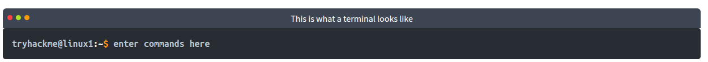

Chúng ta cần có khả năng thực hiện những thao tác cơ bản như di chuyển đến các tệp, xuất nội dung của chúng và tạo tệp! Các lệnh để làm việc này khá dễ hiểu (một khi bạn biết chúng là gì, tất nhiên…).

Hãy bắt đầu với hai lệnh đầu tiên mà tôi đã trình bày trong bảng dưới đây:

**Lệnh** | **Mô tả**  
--- | ---  
**echo** | Xuất (in) bất kỳ đoạn văn bản nào mà chúng ta chỉ định  
**whoami** | Cho biết chúng ta đang đăng nhập bằng tài khoản người dùng nào  

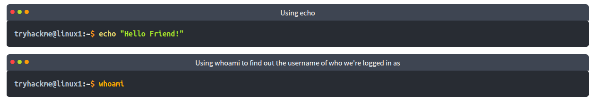

**Trả lời các câu hỏi dưới đây**  

1. **Nếu chúng ta muốn xuất ra dòng chữ "TryHackMe", lệnh của chúng ta sẽ là gì?**  
<details>  
<summary>Hiển thị đáp án</summary>  
Đáp án: echo "TryHackMe"  
</details>  

2. **Tên người dùng mà bạn đang đăng nhập trên máy Linux đã triển khai là gì?**


<details>  
<summary>Hiển thị đáp án</summary>  
Đáp án: tryhackme  
</details>  

# Task 5: Interacting With the Filesystem!

**Tương tác Với Hệ Thống Tệp!**

Cho đến lúc này, chúng ta mới chỉ đề cập hai lệnh “echo” và “whoami”. Chúng không thật sự hữu dụng lắm nếu xét đến những việc mà chúng ta cần làm — chẳng hạn như di chuyển (điều hướng) qua hệ thống tệp, đọc và ghi vào đó. Trong nhiệm vụ này, chúng ta sẽ học những lệnh cần thiết để làm được điều đó. Tương tự như nhiệm vụ trước, tôi sẽ hiển thị các lệnh trong một bảng ở phần tiếp theo và cho ví dụ về cách sử dụng.


## Tương Tác Với Hệ Thống Tệp

Như tôi đã nói, việc có thể điều hướng trên máy mà bạn đang đăng nhập, mà không phụ thuộc vào môi trường máy tính để bàn, là khá quan trọng. Rốt cuộc, nếu chúng ta đăng nhập mà chẳng thể đi đâu thì được gì?

| **Command** | **Full Name**           |
|-------------|-------------------------|
| **ls**      | listing (  liệt kê)              |
| **cd**      | change directory  (chuyển hoặc thay đổi thư mục)      |
| **cat**     | concatenate   (nối)          |
| **pwd**     | print working directory (hiển thị thư mục đang làm việc |

## Liệt Kê Tệp Trong Thư Mục Hiện Tại (ls)

Trước khi chúng ta có thể làm bất cứ điều gì, chẳng hạn như xem nội dung của bất kỳ tệp hay thư mục nào, chúng ta cần biết những gì đang có trong đó. Để làm điều này, bạn có thể dùng lệnh “ls” (viết tắt của “listing”).

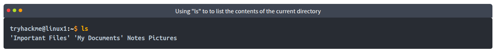

Trong ảnh chụp màn hình ở trên, chúng ta có thể thấy các thư mục sau:  
- Important Files  
- My Documents  
- Notes  
- Pictures  

Tuyệt! Dựa vào tên, có lẽ bạn cũng đoán được mỗi thư mục sẽ chứa những gì.

> **Mẹo nhỏ**: Bạn có thể liệt kê nội dung của một thư mục mà không cần phải di chuyển vào đó, chỉ cần dùng lệnh `ls` kèm theo tên thư mục, ví dụ: `ls Pictures`.

## Thay Đổi Thư Mục Hiện Tại (cd)

Giờ chúng ta đã biết thư mục nào đang tồn tại, cần sử dụng lệnh `cd` (viết tắt của *change directory*) để chuyển vào thư mục đó. Giả sử tôi muốn mở thư mục “Pictures”, tôi sẽ gõ `cd Pictures`. Sau đó, tôi lại muốn kiểm tra nội dung của thư mục “Pictures” này, và để làm vậy, tôi sẽ tiếp tục dùng lệnh `ls` như trước.

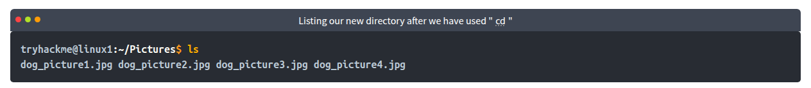

Trong trường hợp này, có vẻ như có 4 bức ảnh về chó!

## Xuất Nội Dung Của Một Tệp (cat)

Mặc dù biết được sự tồn tại của các tệp là tốt, nhưng điều đó cũng không có nhiều ý nghĩa nếu chúng ta không thể xem nội dung của chúng. Ở một bài học sau, chúng ta sẽ thảo luận về một số công cụ cho phép chuyển tệp từ máy này sang máy khác. Nhưng hiện tại, chúng ta sẽ chỉ tập trung vào việc xem nội dung của các tệp văn bản bằng cách sử dụng một lệnh có tên là **“cat”**.

“Cat” là viết tắt của “concatenate” và là một cách tuyệt vời để xuất nội dung của tệp (không chỉ riêng tệp văn bản!).

Trong ảnh chụp màn hình bên dưới, bạn có thể thấy cách tôi đã kết hợp lệnh “ls” để liệt kê các tệp bên trong thư mục có tên “Documents”:

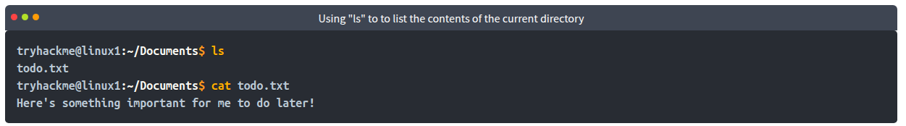

Chúng ta đã vận dụng một số kiến thức đã học từ nhiệm vụ trước để thực hiện những việc sau:

1. Dùng lệnh **`ls`** để xem những tệp có trong thư mục “Documents” trên máy này. Trong ví dụ, tệp đó có tên là **`todo.txt`**.  
2. Sau đó chúng ta dùng **`cat todo.txt`** để ghép/xuất nội dung của tệp “todo.txt”, trong đó nội dung là: **"Here's something important for me to do later!"** (Tạm dịch: “Đây là việc quan trọng mà tôi sẽ làm sau!”).

**Mẹo nhỏ**: Bạn có thể dùng **`cat`** để xuất nội dung của một tệp trong các thư mục mà không cần phải di chuyển vào chúng. Ví dụ:  

```
cat /home/ubuntu/Documents/todo.txt
```
Đôi khi, những thứ như tên người dùng (username), mật khẩu (password) — vâng, thật đấy…, các cờ (flags) hoặc thiết lập cấu hình lại nằm trong tệp, và bạn có thể dùng **`cat`** để lấy chúng.

## Tìm Toàn Bộ Đường Dẫn Đến Thư Mục Hiện Tại (pwd)

Bạn sẽ để ý rằng khi điều hướng trong máy Linux, tên thư mục hiện tại bạn đang làm việc sẽ xuất hiện trong terminal. Nhưng thật dễ để mất dấu vị trí của chúng ta trên hệ thống tệp. Vì vậy, tôi muốn giới thiệu lệnh **`pwd`**, viết tắt của **“print working directory”**.

Với ví dụ máy trước đây, chúng ta đang ở trong thư mục “Documents” — nhưng vị trí của nó chính xác ở đâu trên hệ thống tệp của máy Linux? Chúng ta có thể tìm hiểu điều này bằng cách sử dụng lệnh **`pwd`**, giống như trong ảnh chụp màn hình bên dưới.

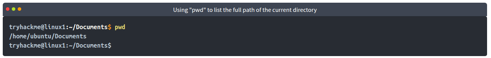

**Hãy phân tích điều này:**

1. Chúng ta biết đang ở trong thư mục “Documents” nhờ vào terminal, nhưng tại thời điểm này, chúng ta không biết thư mục “Documents” được lưu ở đâu để có thể quay lại đó một cách dễ dàng về sau.  
2. Tôi đã dùng lệnh **`pwd`** (print working directory) để tìm toàn bộ đường dẫn của thư mục “Documents” này.  
3. Linux tiện lợi cho chúng ta biết rằng thư mục “Documents” được lưu tại “/home/ubuntu/Documents” trên máy — thật tuyệt khi biết điều đó!  
4. Giờ đây, nếu về sau chúng ta chuyển sang vị trí khác, chỉ cần dùng lệnh:

   ```
   cd /home/ubuntu/Documents
   ```  
   để thay đổi thư mục làm việc về “Documents”.

**Trả lời các câu hỏi dưới đây**  

1. **Trên máy Linux mà bạn triển khai, có bao nhiêu thư mục?**  

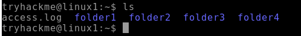

<details>  
<summary>Hiển thị đáp án</summary>  
Đáp án: 4  
</details>  

2. **Thư mục nào chứa một tệp?**  

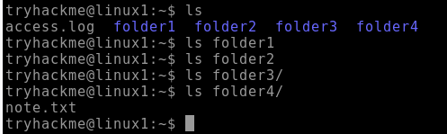

<details>  
<summary>Hiển thị đáp án</summary>  
Đáp án: folder4  
</details>  

3. **Nội dung của tệp này là gì?**  

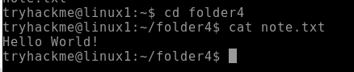

<details>  
<summary>Hiển thị đáp án</summary>  
Đáp án: Hello World  
</details>  

4. **Sử dụng lệnh `cd` để điều hướng đến tệp này và tìm ra thư mục làm việc hiện tại mới. Đường dẫn là gì?**  

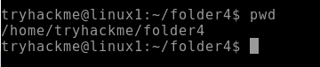

<details>  
<summary>Hiển thị đáp án</summary>  
Đáp án: /home/tryhackme/folder4  
</details>  

# Task 6: Searching for Files

Mặc dù đến thời điểm hiện tại có thể trông không rõ lắm, nhưng một trong những điểm nổi bật của Linux chính là bạn có thể làm việc vô cùng hiệu quả với nó. Tất nhiên, mức độ hiệu quả cũng phụ thuộc vào việc bạn thành thạo hệ điều hành này đến đâu. Khi bạn tương tác với những Hệ điều hành như Ubuntu qua thời gian, các lệnh cơ bản mà chúng ta vừa tìm hiểu sẽ dần trở thành “phản xạ tự nhiên”.

Một cách tuyệt vời để thể hiện bạn có thể làm việc hiệu quả thế nào với hệ thống như thế này là sử dụng một bộ lệnh giúp tìm kiếm nhanh các tệp trên toàn bộ hệ thống mà người dùng có quyền truy cập. Không còn cần phải liên tục sử dụng `cd` và `ls` để tìm xem tệp nằm ở đâu. Thay vào đó, chúng ta có thể dùng các lệnh như `find` để tự động hóa việc này!

Đây là lúc Linux bắt đầu trở nên có vẻ hơi đáng sợ để bắt đầu — nhưng chúng ta sẽ phân tích rõ và giúp bạn làm quen dần.

## Sử Dụng `find`

Lệnh `find` rất tuyệt vời ở chỗ nó có thể được dùng một cách đơn giản hoặc khá phức tạp, tùy thuộc vào mục đích cụ thể của bạn. Dù sao, trước hết hãy tập trung vào những kiến thức căn bản.

Hãy xem đoạn mã dưới đây; chúng ta sẽ thấy danh sách các thư mục sẵn có:

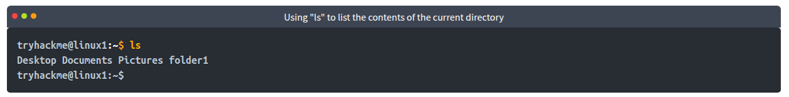

1. Desktop  
2. Documents  
3. Pictures  
4. folder1  

Tất nhiên, các thư mục có thể chứa thêm những thư mục khác bên trong. Việc phải lần tìm qua từng thư mục chỉ để cố gắng tìm đúng tệp cần thiết đúng là đau đầu. Chúng ta có thể dùng lệnh **`find`** để thực hiện việc này!

Hãy bắt đầu đơn giản, giả sử chúng ta đã biết tên của tệp mà mình đang tìm — nhưng lại không nhớ chính xác nó nằm ở đâu! Trong trường hợp này, chúng ta đang tìm tệp “passwords.txt”.

Nếu nhớ tên tệp, bạn chỉ cần dùng:  

```
find -name passwords.txt
```
Lệnh này sẽ tìm qua mọi thư mục trong thư mục hiện tại để tìm tệp cụ thể đó, ví dụ như sau:

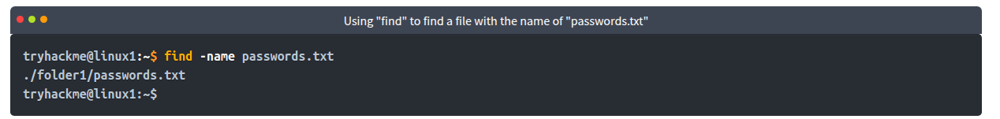

“Find” đã tìm được tệp — hóa ra nó nằm ở đường dẫn `folder1/passwords.txt` — thật tuyệt. Nhưng giả sử chúng ta không biết tên tệp, hoặc muốn tìm tất cả những tệp có phần mở rộng như “.txt”. May mắn thay, lệnh **find** cũng cho phép chúng ta làm điều đó!

Chúng ta chỉ cần dùng ký tự đại diện (*), gọi là **wildcard**, để tìm mọi thứ có đuôi `.txt`. Trong trường hợp này, chúng ta muốn tìm tất cả các tệp `.txt` có trong thư mục hiện tại. Ta sẽ xây dựng lệnh như sau:  

```
find -name *.txt
```
Lúc này, “Find” sẽ tìm tất cả tệp `.txt` và sau đó trả về vị trí của mỗi tệp.

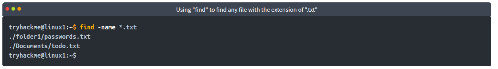

**Find** đã tìm được:

1. “passwords.txt” nằm trong “folder1”  
2. “todo.txt” nằm trong “Documents”  

Không quá khó, phải không nào!

## Sử Dụng `grep`

Một tiện ích tuyệt vời khác rất đáng để tìm hiểu là **grep**. Lệnh **grep** cho phép chúng ta tìm kiếm nội dung bên trong các tệp để tìm những giá trị cụ thể mà ta cần.

Ví dụ, hãy xem xét tệp nhật ký truy cập (access log) của một máy chủ web. Trong trường hợp này, tệp `access.log` của máy chủ web có 244 dòng mục nhập.

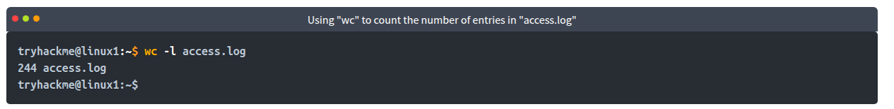

Dùng một lệnh như **`cat`** sẽ không mấy hiệu quả trong trường hợp này. Lấy ví dụ, giả sử chúng ta muốn tìm kiếm trong tệp nhật ký này để xem những nội dung mà một người dùng hoặc một địa chỉ IP cụ thể đã truy cập? Việc lục soát 244 dòng mục nhập không thật sự tiện lợi khi ta chỉ muốn tìm đúng một giá trị cụ thể.

Chúng ta có thể sử dụng **`grep`** để tìm kiếm trong toàn bộ nội dung của tệp nhằm tìm bất kỳ dòng nào chứa giá trị mà ta đang cần. Với ví dụ về nhật ký truy cập của máy chủ web, chúng ta muốn xem tất cả những gì mà địa chỉ IP **"81.143.211.90"** đã truy cập (lưu ý rằng đây là dữ liệu giả định).

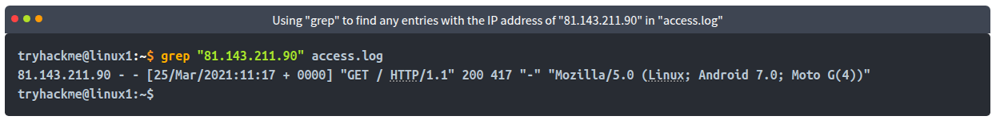

"Grep" đã tìm kiếm trong tệp này và hiển thị cho chúng tôi mọi mục nhập mà chúng tôi đã cung cấp và có trong tệp nhật ký này cho IP.

**Câu hỏi: Sử dụng grep trên "access.log" để tìm cờ có tiền tố là "THM". Cờ đó là gì?**

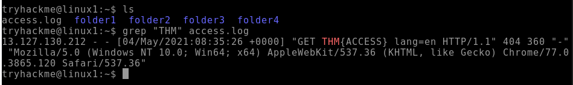

<details>  
<summary>Hiển thị đáp án</summary>  
Đáp án: THM{ACCESS}  
</details>  

# Task 7: An Introduction to Shell Operators

**Giới Thiệu Về Các Toán Tử Trong Shell**

**Các toán tử (operators) của Linux** là một cách tuyệt vời để nâng cao kiến thức làm việc với Linux. Có một vài toán tử quan trọng bạn cần lưu ý. Chúng ta sẽ tìm hiểu những điều cơ bản và chia nhỏ chúng thành những phần ngắn gọn dễ hiểu.  

Về tổng quan, tôi sẽ giới thiệu các toán tử sau:

| **Ký hiệu / Toán tử** | **Mô tả**                                                                                                                |
|-----------------------|---------------------------------------------------------------------------------------------------------------------------|
| **&**                | Cho phép bạn chạy lệnh dưới nền (background) của terminal.                                                                |
| **&&**               | Cho phép bạn kết hợp nhiều lệnh lại trong cùng một dòng trên terminal.                                                   |
| **>**                | Đây là toán tử dùng để chuyển hướng (redirector) — nghĩa là chúng ta có thể lấy đầu ra của một lệnh (ví dụ dùng `cat` để xuất nội dung tệp) rồi chuyển nó đi nơi khác. |
| **>>**               | Có chức năng giống với toán tử **>** nhưng thay vì ghi đè, nó nối thêm đầu ra vào cuối tệp (nghĩa là không có gì bị ghi đè).                        |

Hãy tìm hiểu chi tiết hơn về chúng.

## Toán Tử “&”

Toán tử này cho phép chúng ta thực thi các lệnh dưới nền. Lấy ví dụ, giả sử ta muốn sao chép một tệp lớn. Điều này rõ ràng sẽ mất khá nhiều thời gian và sẽ khiến ta không thể làm gì khác cho đến khi quá trình sao chép hoàn tất.

Toán tử “&” trong shell cho phép chúng ta chạy một lệnh và để nó chạy dưới nền (chẳng hạn quá trình sao chép tệp), nhờ vậy ta có thể làm việc khác trong lúc chờ!

## **Toán tử "&&"**  
Toán tử shell này hơi dễ gây hiểu lầm nếu bạn đã quen với người anh em của nó là "&". Không giống như toán tử "&", chúng ta có thể sử dụng "&&" để tạo danh sách các lệnh sẽ được thực thi, ví dụ: `command1 && command2`. Tuy nhiên, cần lưu ý rằng `command2` chỉ được chạy nếu `command1` đã thành công.


## **Toán tử ">"**  
Toán tử này được gọi là công cụ chuyển hướng đầu ra. Điều này có nghĩa là chúng ta lấy kết quả đầu ra của một lệnh và gửi kết quả đó đến một nơi khác.  

Một ví dụ tuyệt vời là chuyển hướng kết quả đầu ra của lệnh `echo` mà chúng ta đã học trong Bài 4. Tất nhiên, chạy một lệnh như `echo howdy` sẽ trả về "howdy" trên terminal — điều đó không thực sự hữu ích. Thay vào đó, chúng ta có thể "chuyển hướng" "howdy" vào một tệp mới!  

Giả sử chúng ta muốn tạo một tệp có tên là "welcome" với nội dung "hey". Chúng ta có thể chạy lệnh `echo hey > welcome` để tạo tệp với nội dung "hey", như sau:

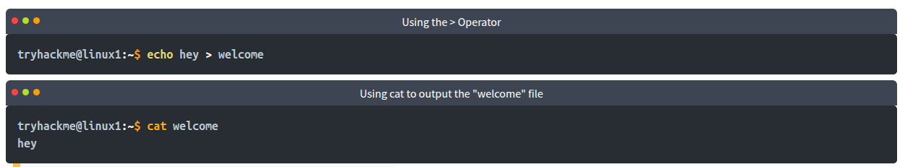

**Lưu ý:** Nếu tệp, ví dụ: "welcome", đã tồn tại, nội dung sẽ bị ghi đè!  


## **Toán tử ">>"**  

Toán tử này cũng là một công cụ chuyển hướng đầu ra, giống như toán tử `>` đã đề cập trước đó. Tuy nhiên, điều làm cho toán tử này khác biệt là nó không ghi đè bất kỳ nội dung nào trong tệp, mà thay vào đó chỉ thêm nội dung mới vào cuối tệp.  

Theo ví dụ trước, chúng ta có tệp "welcome" chứa nội dung là "hey". Nếu chúng ta sử dụng lệnh `echo` để thêm "hello" vào tệp bằng toán tử `>` thì tệp này sẽ chỉ còn nội dung "hello" và không còn "hey".  

Toán tử `>>` cho phép thêm kết quả đầu ra vào cuối tệp — thay vì thay thế nội dung, như sau:  

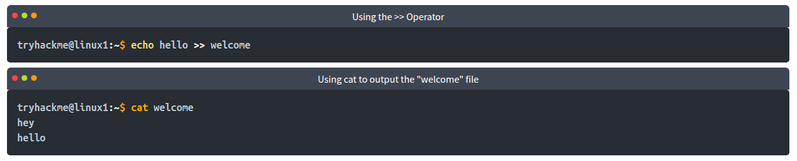

**Trả lời các câu hỏi dưới đây**  

1. **Nếu chúng ta muốn chạy một lệnh trong nền, chúng ta sẽ sử dụng toán tử nào?**  
<details>  
<summary>Hiển thị đáp án</summary>  
Đáp án: &  
</details>  

2. **Nếu tôi muốn thay thế nội dung của một tệp có tên là "passwords" bằng từ "password123", lệnh của tôi sẽ là gì?**  
<details>  
<summary>Hiển thị đáp án</summary>  
Đáp án: echo password123 > passwords  
</details>  

3. **Bây giờ, nếu tôi muốn thêm "tryhackme" vào tệp này có tên là "passwords" nhưng vẫn giữ lại "password123", lệnh của tôi sẽ là gì?**  
<details>  
<summary>Hiển thị đáp án</summary>  
Đáp án: echo tryhackme >> passwords  
</details>  

# Task 8: Conclusions & Summaries

Hãy cùng nhanh chóng điểm lại, chúng ta đã học những nội dung sau:

- Hiểu tại sao Linux lại phổ biến như ngày nay.  
- Tương tác với máy Linux đầu tiên của bạn!  
- Chạy một số lệnh cơ bản nhất.  
- Giới thiệu cách điều hướng trong hệ thống tệp và cách sử dụng các lệnh như `find` và `grep` để tìm dữ liệu hiệu quả hơn!  
- Tăng cường sức mạnh cho các lệnh của bạn bằng cách tìm hiểu một số toán tử shell quan trọng.  

