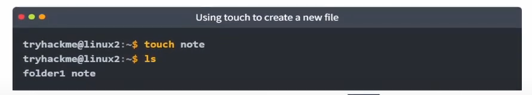

# Linux Fundamentals Part 2

> Tiếp tục hành trình học Linux của bạn với phần hai. Bạn sẽ học cách đăng nhập vào máy Linux bằng SSH, cách nâng cao lệnh của bạn, tương tác hệ thống tệp.

## Mục Lục

1. [Task 1: Introduction](#task-1-introduction)

2. [Task 2: Accessing Your Linux Machine Using SSH (Deploy)](#task-2-accessing-your-linux-machine-using-ssh-deploy)

3. [Task 3: Introduction to Flags and Switches](#task-3-introduction-to-flags-and-switches)

4. [Task 4: Filesystem Interaction Continued](#task-4-filesystem-interaction-continued)

5. [Task 5: Permissions 101](#task-5-permissions-101)

6. [Task 6: Common Directories](#task-6-common-directories)

7. [Task 7: Conclusions and Summaries](#task-7-conclusions-and-summaries)

## Nội dung

# Task 1: Introduction

Trong phần 2, chúng ta sẽ loại bỏ chức năng trên trình duyệt và giúp bạn bắt đầu với một kỹ năng cơ bản, đó là đăng nhập và điều khiển các terminal của máy từ xa. Không chỉ vậy, phần này còn giúp bạn:

- Khai thác tiềm năng của những lệnh đầu tiên bằng cách giới thiệu cho bạn cách sử dụng các **flag** và **tham số**.  
- Nâng cao kiến thức về hệ thống tệp để thực hiện một số lệnh hữu ích hơn, chẳng hạn như sao chép và di chuyển tệp.  
- Tìm hiểu cách quyền truy cập vào tệp và thư mục được quản lý cũng như cách chúng ta xác định quyền truy cập của mình.  
- Chạy một số script và tệp thực thi đầu tiên của bạn!  

# Task 2: Accessing Your Linux Machine Using SSH (Deploy)

Trên thực tế, chức năng trong trình duyệt sử dụng chính xác cùng giao thức mà chúng ta sẽ sử dụng ngày hôm nay. Giao thức này được gọi là **Secure Shell** hoặc viết tắt là **SSH**, và đây là phương thức phổ biến để kết nối và tương tác với dòng lệnh của một máy Linux từ xa.

Chúng ta sẽ triển khai hai máy trong căn phòng này:

- Máy Linux của bạn  
- TryHackMe AttackBox  

## SSH là gì và nó hoạt động như thế nào?

**Secure Shell (SSH)** đơn giản là một giao thức giữa các thiết bị dưới dạng mã hóa. Sử dụng mật mã học, bất kỳ dữ liệu nào chúng ta gửi đi ở định dạng có thể đọc được đều được mã hóa để truyền qua mạng – nơi dữ liệu đó sẽ được giải mã khi đến máy từ xa, như minh họa trong sơ đồ bên dưới.


- **SSH** cho phép chúng ta thực thi các lệnh từ xa trên một thiết bị khác.  
- Bất kỳ dữ liệu nào được gửi giữa các thiết bị đều được mã hóa khi nó được truyền qua mạng, chẳng hạn như Internet.  

## Sử dụng SSH để đăng nhập vào máy Linux của bạn

Cú pháp để sử dụng SSH rất đơn giản. Chúng ta chỉ cần cung cấp hai thứ:  

1. Địa chỉ IP của máy từ xa.  
2. Thông tin xác thực chính xác cho một tài khoản hợp lệ để đăng nhập vào máy từ xa.  

Trong phòng này, chúng ta sẽ đăng nhập với tài khoản "tryhackme", mật khẩu là "tryhackme" (không bao gồm dấu ngoặc kép). Hãy sử dụng địa chỉ IP của máy được hiển thị trên thẻ ở đầu phòng làm địa chỉ IP và sử dụng tài khoản này để tạo một lệnh đăng nhập vào máy từ xa bằng SSH. Lệnh cần sử dụng là `ssh`, sau đó là tên người dùng của tài khoản và **@** theo sau bởi địa chỉ IP của máy.

Nhưng trước tiên, chúng ta cần mở terminal trên TryHackMe AttackBox. Có một biểu tượng trên màn hình desktop được gọi là "Terminal". Bây giờ, chúng ta có thể bắt đầu nhập lệnh.

Ví dụ:  
```bash
ssh tryhackme@10.10.155.221
```

Thay thế địa chỉ IP bằng địa chỉ IP của máy Linux mục tiêu của bạn. Sau khi thực thi, bạn sẽ được yêu cầu tin tưởng vào host và cung cấp mật khẩu cho tài khoản "tryhackme", mật khẩu này cũng là **"tryhackme"**.


# Task 3: Introduction to Flags and Switches

**Giới thiệu về Flags và Switches**

Phần lớn các lệnh cho phép sử dụng các tham số. Các tham số này được xác định bằng một dấu gạch ngang và một từ khóa cụ thể được gọi là **flags** hoặc **switches**.

Chúng ta sẽ thảo luận sau về cách xác định lệnh nào cho phép sử dụng các tham số và hiểu rõ các **flags** này thực sự làm gì.

Khi sử dụng một lệnh, nếu không có chỉ định khác, nó sẽ thực thi hành vi mặc định của mình. Ví dụ, lệnh `ls` hiển thị nội dung của thư mục làm việc hiện tại. Tuy nhiên, các tệp ẩn sẽ không được hiển thị. Chúng ta có thể sử dụng **flags** và **switches** để mở rộng chức năng của lệnh.

Sử dụng ví dụ `ls`, lệnh này cho biết rằng chỉ có một thư mục tên là "folder1" như được làm nổi bật trong ảnh chụp màn hình bên dưới. Lưu ý rằng nội dung trong ảnh chụp màn hình chỉ là ví dụ minh họa.


Tuy nhiên, sau khi sử dụng tham số `-a` (viết tắt của `--all`), chúng ta đột nhiên nhận được một đầu ra với nhiều tệp và thư mục hơn, chẳng hạn như ".hiddenfolder". Các tệp và thư mục có ký tự "." ở đầu là các tệp ẩn.


Các lệnh hỗ trợ các tham số này cũng sẽ có tùy chọn `--help`. Tùy chọn này sẽ liệt kê các tùy chọn có thể sử dụng mà lệnh chấp nhận, cung cấp mô tả ngắn gọn và ví dụ về cách sử dụng chúng.


Tùy chọn này thực chất là một đầu ra được định dạng từ cái được gọi là **trang man** (viết tắt của manual - hướng dẫn sử dụng), chứa tài liệu cho các lệnh và ứng dụng trong Linux.

## Trang Hướng dẫn Sử dụng (Man Page)

Các trang hướng dẫn sử dụng là một nguồn thông tin tuyệt vời cho cả các lệnh hệ thống và ứng dụng có sẵn trên máy Linux, có thể truy cập được cả trên máy và trực tuyến.

Để truy cập tài liệu này, chúng ta có thể sử dụng lệnh `man` và sau đó cung cấp lệnh mà chúng ta muốn đọc tài liệu. Sử dụng ví dụ `ls`, chúng ta sẽ sử dụng lệnh `man ls` để xem trang hướng dẫn sử dụng cho lệnh `ls` như sau:

```bash
man ls
```


**Câu hỏi:**

1. **Phím mũi tên nào được sử dụng để di chuyển xuống trang hướng dẫn (manual page)?**  
<details>  
<summary>Hiển thị đáp án</summary>  
Đáp án: down  
</details>  

2. **Cờ nào được sử dụng để hiển thị đầu ra theo cách "human-readable"?**  
<details>  
<summary>Hiển thị đáp án</summary>  
Đáp án: -h  
</details>  

# Task 4: Filesystem Interaction Continued


Chúng ta đã tìm hiểu một số lệnh cơ bản nhất khi tương tác với hệ thống tệp trên máy Linux. Ví dụ, chúng ta đã học cách liệt kê và tìm nội dung của các thư mục bằng lệnh `ls` và `find` cũng như cách điều hướng hệ thống tệp bằng lệnh `cd`.

Trong nhiệm vụ này, chúng ta sẽ tìm hiểu thêm một số lệnh khác để tương tác với hệ thống tệp, cho phép chúng ta:

- Tạo tệp và thư mục  
- Di chuyển tệp và thư mục  
- Xóa tệp và thư mục  

Cụ thể hơn, các lệnh sau:

| Lệnh   | Tên đầy đủ         | Mục đích                        |
|--------|--------------------|---------------------------------|
| touch  | touch              | Tạo tệp                        |
| mkdir  | make directory     | Tạo thư mục                    |
| cp     | copy               | Sao chép tệp hoặc thư mục      |
| mv     | move               | Di chuyển tệp hoặc thư mục     |
| rm     | remove             | Xóa tệp hoặc thư mục           |
| file   | file               | Xác định loại của một tệp      |

**Mẹo:** Tương tự như khi sử dụng lệnh `cat`, chúng ta có thể cung cấp đường dẫn đầy đủ cho tất cả các lệnh này, ví dụ: `directory1/directory2/note`.

## Tạo tệp và thư mục (touch, mkdir)

Việc tạo tệp và thư mục trên Linux là một quy trình đơn giản. Đầu tiên, chúng ta sẽ nói về cách tạo một tệp. Lệnh `touch` chỉ cần một tham số duy nhất – tên mà chúng ta muốn đặt cho tệp được tạo. Ví dụ: chúng ta có thể tạo một tệp tên là "note" bằng cách sử dụng lệnh:

```bash
touch note
```

Lưu ý rằng `touch` chỉ đơn thuần tạo một tệp trống. Bạn sẽ cần sử dụng các lệnh khác như `echo` hoặc các trình chỉnh sửa văn bản như `nano` để thêm nội dung vào tệp trống.



Đây là một quy trình tương tự để tạo thư mục, chỉ cần sử dụng lệnh `mkdir` và cung cấp tên mà chúng ta muốn gán cho thư mục. Ví dụ, tạo thư mục "mydirectory" bằng cách sử dụng lệnh:

```bash
mkdir mydirectory
```


## Xóa tệp và thư mục (rm)

Lệnh `rm` là một trong những lệnh mạnh mẽ nhất mà chúng ta đã đề cập cho đến nay. Bạn có thể đơn giản xóa tệp bằng cách sử dụng `rm`. Tuy nhiên, bạn cần cung cấp thêm tùy chọn `-R` (recursive) kèm theo tên của thư mục mà bạn muốn xóa.


## **Sao chép và Di chuyển Tệp và Thư mục (cp, mv)**

Việc sao chép và di chuyển tệp là một chức năng quan trọng trên máy Linux. Bắt đầu với lệnh **cp**, lệnh này yêu cầu hai tham số:

1. tên của tệp hiện có

2. tên mà chúng ta muốn đặt cho tệp mới khi sao chép

**cp** sao chép toàn bộ nội dung của tệp hiện có vào tệp mới. Trong ảnh chụp màn hình bên dưới, chúng ta đang sao chép tệp "note" thành "note2".


Việc di chuyển một tệp cũng yêu cầu hai tham số, giống như lệnh **cp**. Tuy nhiên, thay vì sao chép và/hoặc tạo một tệp mới, **mv** sẽ gộp hoặc sửa đổi tệp thứ hai mà chúng ta cung cấp làm tham số. Không chỉ có thể sử dụng **mv** để di chuyển tệp sang một thư mục mới, bạn cũng có thể dùng **mv** để đổi tên một tệp hoặc thư mục. Ví dụ, trong ảnh chụp màn hình bên dưới, chúng ta đang đổi tên tệp "note2" thành "note3". "note3" giờ sẽ chứa nội dung của "note2".


## **Xác định Loại Tệp**

Điều thường gây hiểu lầm và làm mọi người bối rối là việc đưa ra giả định về mục đích hoặc nội dung của tệp. Thông thường, các tệp sẽ có cái gọi là phần mở rộng (extension) để giúp nhận diện dễ dàng hơn. Ví dụ, các tệp văn bản thường có phần mở rộng là ".txt". Tuy nhiên, điều này không phải lúc nào cũng cần thiết.

Cho đến nay, các tệp mà chúng ta đã sử dụng trong các ví dụ không có phần mở rộng. Khi không biết ngữ cảnh của tệp đó, chúng ta không thể biết được mục đích của nó. Hãy sử dụng lệnh **file**. Lệnh này chỉ yêu cầu một tham số. Ví dụ, chúng ta sẽ sử dụng **file** để kiểm tra xem tệp "note" trong các ví dụ của chúng ta có thực sự là tệp văn bản hay không, như sau: **file note**.


**Trả lời các câu hỏi dưới đây**  

1. **Làm thế nào bạn tạo tệp có tên là "newnote"?**  
<details>  
<summary>Hiển thị đáp án</summary>  
Đáp án: touch newnote  
</details>  

2. **Trên máy được triển khai, loại tệp của "unknown1" trong thư mục chính của "tryhackme" là gì?**  


<details>  
<summary>Hiển thị đáp án</summary>  
Đáp án: ASCII text  
</details>  

3. **Làm thế nào để di chuyển tệp "myfile" vào thư mục "myfolder"?**  
<details>  
<summary>Hiển thị đáp án</summary>  
Đáp án: mv myfile myfolder  
</details>  

4. **Nội dung của tệp này là gì?**  


<details>  
<summary>Hiển thị đáp án</summary>  
Đáp án: THM{FILESYSTEM}  
</details>  

# Task 5: Permissions 101

**Quyền truy cập 101**

Như bạn có thể đã nhận ra, một số người dùng không thể truy cập vào một số tệp hoặc thư mục nhất định. Chúng ta đã tìm hiểu một số lệnh có thể được sử dụng để xác định quyền truy cập mà chúng ta có và những giới hạn của chúng.

Trong các nhiệm vụ trước, chúng ta đã học cách mở rộng việc sử dụng các lệnh thông qua các cờ (flags) và tùy chọn (switches). Ví dụ, lệnh **ls** liệt kê nội dung của thư mục hiện tại. Khi sử dụng tùy chọn **-l**, chúng ta có thể thấy mười cột như trong ảnh chụp màn hình bên dưới. Tuy nhiên, chúng ta chỉ quan tâm đến ba cột đầu tiên:


Mặc dù có vẻ phức tạp, nhưng ba cột này rất quan trọng trong việc xác định các đặc điểm nhất định của một tệp hoặc thư mục và liệu chúng ta có quyền truy cập vào nó hay không. Một tệp hoặc thư mục có thể có một số đặc điểm xác định những hành động nào được phép và người dùng hoặc nhóm nào có quyền thực hiện hành động đó – như sau:

- Đọc (Read)  
- Ghi (Write)  
- Thực thi (Execute)  

Sử dụng **su** để chuyển sang **user2**.


Hãy sử dụng tệp "cmnatic.pem" trong ảnh chụp màn hình ban đầu của nhiệm vụ này. Nó có ký hiệu "-" để chỉ rằng đây là một tệp và tiếp theo là "rw". Điều này có nghĩa là chỉ chủ sở hữu của tệp mới có thể đọc và ghi vào tệp "cmnatic.pem" này nhưng không thể thực thi nó.

## **Tóm tắt: Sự khác biệt giữa Người dùng và Nhóm**

Điều tuyệt vời về Linux là quyền truy cập có thể được phân chia chi tiết đến mức, mặc dù một người dùng về mặt kỹ thuật sở hữu một tệp, nếu quyền đã được thiết lập, thì một nhóm người dùng cũng có thể có cùng hoặc khác bộ quyền truy cập đối với cùng một tệp mà không ảnh hưởng đến chính chủ sở hữu tệp.

Hãy đặt điều này vào ngữ cảnh thực tế: người dùng hệ thống chạy một máy chủ web phải có quyền đọc và ghi tệp để ứng dụng web hoạt động hiệu quả. Tuy nhiên, các công ty như các nhà cung cấp dịch vụ lưu trữ web (web hosting) sẽ muốn cho phép khách hàng của họ tải lên các tệp riêng cho trang web của họ mà không cần dùng đến người dùng hệ thống web server – điều này nhằm tránh ảnh hưởng đến bảo mật của những khách hàng khác.

Chúng ta sẽ học các lệnh cần thiết để chuyển đổi giữa các người dùng ở phần dưới đây.

## **Chuyển đổi giữa các người dùng**

Việc chuyển đổi giữa các người dùng trên một hệ thống Linux rất đơn giản nhờ vào lệnh **su**. Trừ khi bạn là người dùng root (hoặc sử dụng quyền root thông qua sudo), bạn cần biết hai điều để thực hiện việc chuyển đổi tài khoản người dùng này:

- Người dùng mà bạn muốn chuyển sang.
- Mật khẩu của người dùng đó.

Lệnh **su** có một số tùy chọn (switches) có thể hữu ích cho bạn. Ví dụ, thực thi một lệnh ngay khi bạn đăng nhập hoặc chỉ định một shell cụ thể để sử dụng. Tôi khuyến khích bạn đọc tài liệu hướng dẫn (man page) của **su** để tìm hiểu thêm. Tuy nhiên, tôi sẽ trình bày về tùy chọn **-l** hoặc **--login**.

Đơn giản, bằng cách cung cấp tùy chọn **-l** cho lệnh **su**, chúng ta bắt đầu một shell tương tự như việc người dùng thực sự đăng nhập vào hệ thống – điều này cho phép chúng ta kế thừa nhiều thuộc tính của người dùng mới, ví dụ như các biến môi trường (environment variables) và các đặc điểm tương tự.


Ví dụ, khi sử dụng lệnh **su** để chuyển sang "user2", phiên làm việc mới của chúng ta sẽ đưa chúng ta vào thư mục chính (home directory) của người dùng trước đó.


Tuy nhiên, bây giờ, sau khi sử dụng tùy chọn **-l**, phiên làm việc mới của chúng ta đã tự động đưa chúng ta vào thư mục chính (home directory) của "user".


**Trả lời các câu hỏi dưới đây**  

1. **Trên máy được triển khai, ai là chủ sở hữu của "important"?**  


<details>  
<summary>Hiển thị đáp án</summary>  
Đáp án: user2  
</details>  

2. **Lệnh để chuyển sang người dùng "user2" là gì?**  
<details>  
<summary>Hiển thị đáp án</summary>  
Đáp án: su user2  
</details>  

3. **Bây giờ, hãy chuyển sang người dùng "user2" bằng mật khẩu "user2"**  

4. **Xuất nội dung của "important", cờ là gì?**  


<details>  
<summary>Hiển thị đáp án</summary>  
Đáp án: THM{SU_USER2}  
</details>  

# Task 6: Common Directories

**Các Thư mục Chung**

## **/etc**

Thư mục gốc này là một trong những thư mục gốc quan trọng nhất trên hệ thống của bạn. Thư mục **etc** (viết tắt của "et cetera") là một vị trí phổ biến để lưu trữ các tệp hệ thống được sử dụng bởi hệ điều hành của bạn.

Ví dụ, tệp **sudoers** được đánh dấu trong ảnh chụp màn hình bên dưới chứa danh sách các người dùng và nhóm có quyền chạy lệnh **sudo** hoặc một tập lệnh dưới quyền người dùng root.

Ngoài ra, cũng được đánh dấu bên dưới là các tệp **passwd** và **shadow**. Hai tệp này đặc biệt quan trọng trong Linux vì chúng hiển thị cách hệ thống lưu trữ mật khẩu của từng người dùng dưới định dạng mã hóa được gọi là **sha512**.


## **/var**

Thư mục **/var**, với "var" là viết tắt của **variable data** (dữ liệu thay đổi), là một trong những thư mục gốc chính được tìm thấy trên một hệ thống Linux. Thư mục này lưu trữ dữ liệu thường xuyên được truy cập hoặc ghi bởi các dịch vụ hoặc ứng dụng đang chạy trên hệ thống.

Ví dụ, các tệp nhật ký (log files) từ các dịch vụ và ứng dụng đang chạy được ghi tại đây (**/var/log**), hoặc các dữ liệu khác không nhất thiết phải liên quan đến một người dùng cụ thể (ví dụ: cơ sở dữ liệu và các loại dữ liệu tương tự).


## **/root**

Khác với thư mục **/home**, thư mục **/root** thực sự là thư mục chính (home directory) của người dùng hệ thống "root". Không có gì đặc biệt về thư mục này ngoài việc hiểu rằng đây là thư mục chính dành cho người dùng "root".

Tuy nhiên, điều này đáng được đề cập vì giả định hợp lý là người dùng này sẽ có dữ liệu của họ trong một thư mục như **/home/root** theo mặc định.


## **/tmp**

Đây là một thư mục gốc đặc biệt được tìm thấy trên một hệ thống Linux. Viết tắt của "temporary" (tạm thời), thư mục **/tmp** có tính chất tạm thời và được sử dụng để lưu trữ dữ liệu chỉ cần truy cập một hoặc hai lần. Tương tự như bộ nhớ trên máy tính của bạn, khi máy tính khởi động lại, nội dung trong thư mục này sẽ bị xóa sạch.

Điều hữu ích cho chúng ta trong kiểm thử bảo mật (pentesting) là bất kỳ người dùng nào cũng có thể ghi dữ liệu vào thư mục này theo mặc định. Điều này có nghĩa là một khi chúng ta có quyền truy cập vào máy, nó có thể là một nơi tốt để lưu trữ các tập lệnh kiểm kê (enumeration scripts) của chúng ta.


**Trả lời các câu hỏi dưới đây**  

1. **Đường dẫn thư mục nào mà chúng ta mong đợi nhật ký (logs) được lưu trữ?**  
<details>  
<summary>Hiển thị đáp án</summary>  
Đáp án: /var/log  
</details>  

2. **Thư mục gốc nào tương tự cách hoạt động của RAM trên máy tính?**  
<details>  
<summary>Hiển thị đáp án</summary>  
Đáp án: /tmp  
</details>  

3. **Tên thư mục chính (home directory) của người dùng root là gì?**  
<details>  
<summary>Hiển thị đáp án</summary>  
Đáp án: /root  
</details>  

# Task 7: Conclusions and Summaries

**Kết luận và Tóm tắt**

Làm tốt lắm! Phần này khá nặng về lý thuyết và bao quát khá nhiều khái niệm cơ bản để giúp bạn làm quen với **Linux**. Tóm tắt nhanh, phần này đã dạy bạn:

- Cách kết nối từ xa với một máy Linux bằng **SSH**.
- Cách nâng cao việc sử dụng các lệnh bằng cách sử dụng các cờ (flags), tùy chọn (switches) và nơi bạn có thể tìm hiểu thêm về các lệnh này (trang man - man pages).
- Một số lệnh khác mà bạn sẽ thường xuyên sử dụng để tương tác với hệ thống tệp và nội dung của nó.
- Giới thiệu ngắn gọn về quyền truy cập tệp và cách chuyển đổi giữa các người dùng.
- Một đoạn tóm tắt về các thư mục gốc quan trọng trên một hệ thống Ubuntu Linux và cách chúng ta có thể sử dụng dữ liệu được lưu trữ trong đó.

Tôi khuyến khích bạn nên xem lại phần này một hoặc hai lần nữa để làm quen với các khái niệm. Sau tất cả, thực hành sẽ tạo nên sự hoàn hảo!

