# Bash Scripting
> Cơ bản về những tập lệnh bash


# Mục Lục

1. [Task 1: Introduction](#task-1-introduction)  
2. [Task 2: Our first simple bash scripts](#task-2-our-first-simple-bash-scripts)  
3. [Task 3: Variables](#task-3-variables)  
4. [Task 4: Parameters](#task-4-parameters)  
5. [Task 5: Arrays](#task-5-arrays)  
6. [Task 6: Conditionals](#task-6-conditionals)  
7. [Task 7: Flag](#task-7-Flag)

## Nội dung

# Task 1: Introduction

---

### Bash là gì?

Bash là một ngôn ngữ kịch bản (scripting language) chạy trong terminal trên hầu hết các bản phân phối Linux, cũng như trên MacOS. Shell script là một chuỗi các lệnh bash nằm trong một tệp, kết hợp lại với nhau để thực hiện các tác vụ phức tạp hơn so với các lệnh một dòng đơn giản, và đặc biệt hữu ích khi cần tự động hóa các tác vụ quản trị hệ thống như sao lưu dữ liệu.

Dưới đây là một vài nội dung  sẽ học:

* Bash syntax
* Variables
* Using parameters
* Arrays
* Conditionals

Trang web hữu ích học Bash: [https://devhints.io/bash](https://devhints.io/bash)

Trang web tra cứu chức năng của các lệnh: [https://explainshell.com/](https://explainshell.com/)

---

# Task 2: Our first simple bash scripts

---

Một file bash script thường có đuôi `.sh`

Trước tiên, hãy trình bày cấu trúc của chúng ta.

Một bash script luôn bắt đầu với dòng mã sau ở đầu tập tin:

```
#!/bin/bash
```

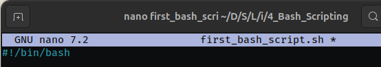

Dòng này giúp shell của bạn (bất kể loại shell nào) biết rằng nó cần phải chạy tập tin của bạn bằng bash trong terminal.

---

Hãy cùng bắt đầu với một vài ví dụ cơ bản.

```bash
#!/bin/bash
echo "Hello World!"
```
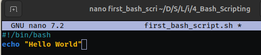

Lệnh này sẽ in ra chuỗi “Hello World!”.
Lệnh `echo` được dùng để xuất văn bản ra màn hình, tương tự như lệnh `print` trong Python.

---

Chúng cũng có thể thực thi các lệnh Linux thông thường bên trong bash script, và chúng sẽ được chạy nếu bạn định dạng đúng.
Ví dụ, chúng ta có thể chạy lệnh `ls` bên trong bash script và sẽ thấy kết quả khi chạy file đó. 

```bash
#!/bin/bash
echo "Hello World"
whoami
id
```
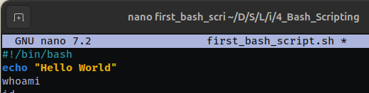

---

Trong đoạn script trên:

* `whoami` sẽ in ra tên người dùng hiện tại.
* `id` sẽ hiển thị thông tin UID, GID, và nhóm của người dùng.

---

Bây giờ để chạy một bash script, trước tiên ta cần cấp quyền thực thi cho nó:

```
chmod +x yourfile.sh
```

Sau đó ta chạy nó bằng cách sử dụng:

```
./
```

Ví dụ:

```bash
./first_bash_script.sh 
Hello World
chu
uid=1000(chu) gid=1000(chu) groups=1000(chu),4(adm),24(cdrom),27(sudo),30(dip),46(plugdev),109(kvm),119(vboxusers),122(lpadmin),134(lxd),135(sambashare),139(wireshark),140(docker),143(ubridge),145(libvirt)
```

Ta có thể thấy script đã xuất ra kết quả của các lệnh `whoami` và `id`.

---

**Hãy trả lời các câu hỏi bên dưới**

**Câu hỏi: Dòng mã nào có thể được chèn vào đầu dòng để biến dòng đó thành chú thích trong code?**

<details>
  <summary>Hiển thị đáp án</summary>
  Đáp án: `#`
</details>

---

**Câu hỏi: Đoạn script sau sẽ in ra màn hình nội dung gì? Dòng lệnh: `echo "BishBashBosh"`**

<details>
  <summary>Hiển thị đáp án</summary>
  Đáp án: `BishBashBosh`
</details>

# Task 3: Variables

---

Bây giờ chúng ta sẽ chuyển sang phần **Variables**,
trong bash thì việc này khá đơn giản và chúng ta khai báo biến như sau:

```bash
name="Sun"
```

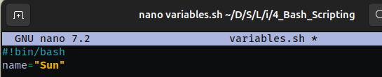

Ở đây, chúng ta gán giá trị `"Sun"` cho biến có tên là `name`.

Lưu ý: để biến hoạt động đúng trong bash, bạn **không được để khoảng trắng** giữa tên biến, dấu `=` và giá trị. Biến không được chứa khoảng trắng.

Vậy làm sao để sử dụng biến vừa tạo? Điều đó cũng rất đơn giản — ta sẽ xem ngay sau đây.

Chúng ta cần thêm dấu **`$`** phía trước tên biến để sử dụng nó.

```bash
name="Sun"
echo $name
```
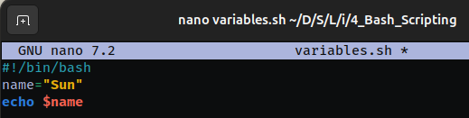

Nếu chúng ta thử điều này trong terminal của mình, kết quả sẽ giống như sau:

Lệnh này sẽ in ra chữ **Sun** trên màn hình.

```bash
 ./variables.sh
Sun
```

---

Biến giúp việc lưu trữ dữ liệu trở nên dễ dàng hơn rất nhiều. Thay vì phải gõ đi gõ lại cùng một nội dung ở nhiều nơi, chúng ta có thể đơn giản chèn biến với cú pháp `$var` và gán cho nó một giá trị cụ thể — điều này giúp dễ dàng thay đổi sau này nếu cần.
Vậy làm thế nào để gỡ lỗi (debug) mã của chúng ta?

---

**Gỡ lỗi là một phần rất quan trọng trong lập trình**, vì vậy chúng ta nên làm quen với việc giải quyết vấn đề và sửa lỗi càng sớm càng tốt.
Bash có một số tính năng tích hợp sẵn giúp việc này đơn giản hơn.

Khi chạy lệnh trên dòng lệnh, bạn có thể dùng:

```bash
bash -x ./file.sh
```

Ví dụ:

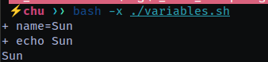

Bạn có thể tạo một bash script đơn giản (giờ bạn đã biết cú pháp cơ bản) và cố ý viết sai để kiểm tra.
Sau đó chạy chương trình của bạn với chế độ gỡ lỗi (debug) và xem nó trông như thế nào khi xảy ra lỗi!

---

Lệnh này cho bạn biết dòng nào đang hoạt động và dòng nào không.
Nếu bạn muốn gỡ lỗi tại một điểm cụ thể trong script, bạn có thể chèn lệnh `set -x` vào script, và dùng `set +x` để kết thúc phần đó, như sau:

```bash
echo "hi"

set -x
# đoạn này sẽ được gỡ lỗi
set +x
```

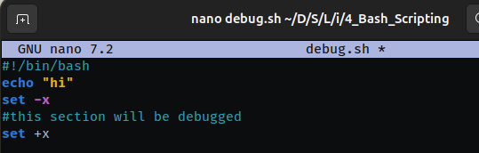

---

Với cách này, chỉ phần nằm giữa `set -x` và `set +x` sẽ được theo dõi chi tiết khi chạy.

---

Hãy xem một ví dụ. Đây là script mà ta đã viết trước đó, được chạy bằng lệnh:

```bash
 bash -x ./first_bash_script.sh 
+ echo 'Hello World'
Hello World
+ whoami
chu
+ id
uid=1000(chu) gid=1000(chu) groups=1000(chu),4(adm),24(cdrom),27(sudo),30(dip),46(plugdev),109(kvm),119(vboxusers),122(lpadmin),134(lxd),135(sambashare),139(wireshark),140(docker),143(ubridge),145(libvirt)
```

Bạn có thể thấy đầu ra có dấu `+` phía trước mỗi lệnh, sau đó là kết quả thực thi của lệnh đó.
Nếu có lỗi xảy ra, dòng đó sẽ hiển thị với dấu `-`, điều này giúp bạn dễ dàng phát hiện chỗ sai để sửa lỗi.

Dưới đây là bản dịch tiếng Việt của nội dung trong ảnh:

---

Chúng ta cũng có thể sử dụng **nhiều biến** trong một câu lệnh `echo`. Bạn không bị giới hạn chỉ dùng 1 biến đâu!

```bash
#!/bin/bash
name="Sun"
age=23

echo "$name is $age years old"
```
Kết quả:

```bash
 ./print_name_age.bash 
Sun is 23 years old
```

---

**Trả lời các câu hỏi sau** và sử dụng đoạn mã dưới đây để hỗ trợ bạn:

```bash
name="Jammy"
age=21
echo "$name is $age years old"

city="Paris"
country="France"
```

---

**Câu hỏi: Đoạn mã trên sẽ trả về gì?**

<details>
  <summary>Hiển thị đáp án</summary>
  Đáp án: Jammy is 21 years old
</details>

---

**Câu hỏi: Làm thế nào để in tên thành phố ra màn hình?**

<details>
  <summary>Hiển thị đáp án</summary>
  Đáp án: echo $city
</details>

---

**Câu hỏi: Làm thế nào để in tên quốc gia ra màn hình?**

<details>
  <summary>Hiển thị đáp án</summary>
  Đáp án: echo $country
</details>

---

# Task 4: Parameters

Bây giờ chúng ta sẽ tìm hiểu một trong những tính năng chính của bash — đó là **sử dụng tham số (parameters)**.

Trước tiên, ta sẽ xem xét các tham số được chỉ định thông qua dòng lệnh khi chạy file. Những tham số này có thể có nhiều dạng, nhưng thường có tiền tố `$` vì tham số cũng là một biến.

Hãy bắt đầu bằng cách khai báo một tham số sẽ là đối số (argument) đầu tiên khi chạy bash script:

```bash
#!/bin/bash
name=$1
echo $name
```

Sau đó, ta chạy script với:

```bash
./parameters_1.sh Sun
Sun
```

Và đúng như mong đợi, ta nhận được kết quả là `"Sun"`.

Vậy nếu ta muốn sử dụng đối số thứ hai thì sao? Quá trình cũng rất đơn giản, chỉ cần thay `$1` thành `$2`, ví dụ:

```bash
#!/bin/bash
name=$2
echo $name
```

Sau đó chạy:

```bash
./parameters_2.sh Sun Moon
Moon
```

Theo bạn, nó sẽ trả về gì? — Nó sẽ trả về `"Moon"`.

---

Nhưng nếu ta **không muốn truyền tham số từ dòng lệnh**, mà muốn cho người dùng **nhập tên tương tác trực tiếp**, ta có thể dùng lệnh `read`:

```bash
#!/bin/bash
echo Enter your name
read name
echo "Your name is $name"
```

Khi chạy đoạn code này, chương trình sẽ tạm dừng để bạn nhập tên vào, ví dụ:

```bash
./parameters_3.sh 
Enter your name:
Sun
Your name is Sun
```

Và ta thấy rằng nó hoạt động!

---

### **Tham số trong Shell**

| **Tham số**    | **Chức năng**                                                             |
| -------------- | ------------------------------------------------------------------------- |
| `$1`–`$9`      | Đại diện cho các tham số vị trí (positional parameters) từ đối số 1 đến 9 |
| `${10}`–`${n}` | Đại diện cho các tham số vị trí từ đối số thứ 10 trở đi                   |
| `$0`           | Đại diện cho tên của script                                               |
| `$*`           | Đại diện cho tất cả các đối số dưới dạng một chuỗi duy nhất               |
| `$@`           | Tương tự như `$*`, nhưng khác biệt khi đặt trong dấu ngoặc kép `(")`      |
| `$#`           | Đại diện cho tổng số đối số được truyền vào                               |
| `$$`           | PID (Process ID) của script                                               |
| `$?`           | Đại diện cho mã trả về (return code) cuối cùng của lệnh vừa thực hiện     |

---

**Hãy trả lời các câu hỏi bên dưới**

**Câu hỏi: Làm thế nào để lấy số lượng đối số được truyền vào một script?**

<details>
  <summary>Hiển thị đáp án</summary>
  Đáp án: $#
</details>

---

**Câu hỏi: Làm thế nào để lấy tên file script hiện tại (tức là đối số đầu tiên)?**

<details>
  <summary>Hiển thị đáp án</summary>
  Đáp án: $0
</details>

---

**Câu hỏi: Làm thế nào để lấy đối số thứ 4 được truyền vào script?**

<details>
  <summary>Hiển thị đáp án</summary>
  Đáp án: $4
</details>

---

**Câu hỏi: Nếu script yêu cầu nhập dữ liệu, làm sao để lưu đầu vào đó vào biến có tên là `test` bằng lệnh `read`?**

<details>
  <summary>Hiển thị đáp án</summary>
  Đáp án: read test
</details>

---

**Câu hỏi: Lệnh `echo "$1 $3"` sẽ in ra gì nếu script được chạy với `./script.sh hello hola aloha`?**

<details>
  <summary>Hiển thị đáp án</summary>
  Đáp án: hello aloha
</details>

# Task 5: Arrays

---

**Mảng (Arrays)** được sử dụng để lưu trữ nhiều phần dữ liệu trong một biến, sau đó có thể truy xuất từng phần bằng **chỉ số (index)**.
Cách viết phổ biến nhất là: `var[index_position]`.

Mảng sử dụng đánh chỉ số, nghĩa là mỗi phần tử trong mảng tương ứng với một số.

Ví dụ, trong mảng `['car', 'train', 'bike', 'bus']`, mỗi phần tử sẽ có chỉ số như sau:

Tất cả chỉ số bắt đầu từ **0**.

| item  | index |
| ----- | ----- |
| car   | 0     |
| train | 1     |
| bike  | 2     |
| bus   | 3     |

---

Giờ chúng ta đã học xong phần lý thuyết, hãy cùng tạo một mảng trong Bash.

**Cú pháp như sau:**

Chúng ta có tên biến, ví dụ ở đây là `transport`.

Sau đó ta đặt từng phần tử trong ngoặc đơn `()` và cách nhau bằng khoảng trắng:

```bash
#!/bin/bash
transport=('car' 'train' 'bike' 'bus')
```

Chúng ta có thể in ra tất cả phần tử trong mảng bằng lệnh:

```bash
echo "${transport[@]}"
```

Bạn có thể thử lệnh này trong terminal của mình để xem kết quả.
Dấu `@` có nghĩa là tất cả các phần tử, còn `[]` là để truy cập theo chỉ số.

---

Nếu ta muốn in ra phần tử `"train"` (ở vị trí thứ 1), ta chỉ cần viết:

```bash
echo "${transport[1]}"
```

```bash
./array_1.sh 
car train bike bus
train
```

---

Nếu muốn **xóa** một phần tử khỏi mảng, ta dùng lệnh `unset`, ví dụ:

```bash
unset transport[1]
```

Lệnh này sẽ xóa phần tử `"train"`. Nếu bạn thử in lại phần tử đó, sẽ thấy nó đã biến mất.

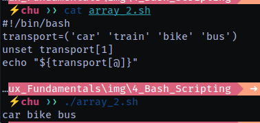


---

Nếu muốn **gán lại giá trị khác** cho một phần tử, bạn có thể làm như sau:

```bash
transport[1]='trainride'
```

Nếu in mảng ra:

```bash
echo "${transport[@]}"
```

Sẽ được:

```
car trainride bike bus
```

---

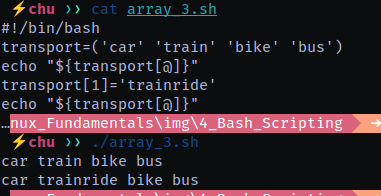

Như vậy, bạn đã biết cách thay thế phần tử trong mảng thành công!

---

**Bài tập mở rộng:**

**Cho mảng sau:**

```bash
cars=('honda' 'audi' 'bmw' 'tesla')
```

**Câu hỏi: Lệnh nào sẽ in `audi` ra màn hình bằng cách sử dụng chỉ số của mảng?**

<details>
  <summary>Hiển thị đáp án</summary>
  Đáp án: `echo "${cars[1]}"`
</details>

---

**Câu hỏi: Nếu muốn xóa `tesla` khỏi mảng, chúng ta cần làm gì?**

<details>
  <summary>Hiển thị đáp án</summary>
  Đáp án: `unset cars[3]`
</details>

---

**Câu hỏi: Làm thế nào để thêm giá trị mới `toyota` để thay thế `tesla`?**

<details>
  <summary>Hiển thị đáp án</summary>
  Đáp án: `cars[3]='toyota'`
</details>

# Task 6: Conditionals (Câu điều kiện)

---

```bash
#!/bin/bash

filename=$1

if [ -f "${filename}" ] && [ -w "${filename}" ]
then
    echo "hello" > $filename
else
    touch "$filename"
    echo "hello" > $filename
fi
```

---

Khi nói về **câu lệnh điều kiện (conditionals)**, điều đó có nghĩa là một đoạn mã chỉ được thực thi nếu một điều kiện nào đó được thỏa mãn. Điều kiện này thường được xác định bởi các **toán tử quan hệ** như bằng, lớn hơn, nhỏ hơn,...

---

Trong ví dụ này, ta sẽ tạo một câu lệnh `if` đơn giản để kiểm tra xem một biến có bằng một giá trị nào đó hay không. Đồng thời, chúng ta cũng viết một đoạn script để kiểm tra:

* Nếu một **tệp tồn tại** và **có thể ghi (writeable)**, thì sẽ ghi dòng `"hello"` vào tệp đó.
* Nếu tệp **không tồn tại hoặc không thể ghi**, nó sẽ **xóa hoặc tạo mới tệp đó**, rồi ghi `"hello"` vào.

---

Trước tiên, chúng ta sẽ tìm hiểu cú pháp cơ bản của một câu lệnh `if`.

Tất cả các câu lệnh `if` đều có dạng như sau:

```bash
if [ điều_kiện_so_sánh ]
then
    thực hiện_nếu_đúng
else
    thực hiện_nếu_sai
fi
```

Trong đó:

* `if ... then ... else ... fi` là cấu trúc chuẩn.
* `[]` là nơi bạn đặt điều kiện so sánh.
* `fi` là từ khóa kết thúc khối `if`.

---

Hãy cùng xem một ví dụ:

```bash
count=10

if [ $count -eq 10 ]
then
    echo "true"
else
    echo "false"
fi
```

---

Câu lệnh `if` luôn sử dụng một cặp dấu ngoặc vuông `[]` và trong trường hợp này, **phải có dấu cách** ở cả hai bên của biểu thức bên trong (đây là cú pháp Bash).
Ngoài ra, luôn phải kết thúc khối `if` bằng từ khóa `fi`.

---

Trong ví dụ này, một biến `count` được khai báo bằng giá trị `10`, và dòng đầu tiên của câu lệnh `if` so sánh biến `$count` với số nguyên `10`.

* Nếu hai giá trị **bằng nhau**, chương trình sẽ in ra `true`.
* Nếu **không bằng**, chương trình sẽ in ra `false`.

Vì 10 bằng 10 nên kết quả sẽ là `true`.

Dấu `-eq` là một cách để kiểm tra sự bằng nhau. Bạn cũng có thể dùng dấu `=` để làm việc này.

---

Dưới đây là bảng tổng hợp **các toán tử phổ biến trong Bash**, được chia thành 3 nhóm chính: **so sánh số học**, **so sánh chuỗi**, và **kiểm tra tệp tin**.

---

###  Toán tử so sánh số học

| Toán tử | Mô tả                   |
| ------- | ----------------------- |
| `-eq`   | Bằng (`=`)              |
| `-ne`   | Khác (`≠`)              |
| `-gt`   | Lớn hơn (`>`)           |
| `-lt`   | Nhỏ hơn (`<`)           |
| `-ge`   | Lớn hơn hoặc bằng (`≥`) |
| `-lt`   | Nhỏ hơn hoặc bằng (`≤`) |

> Ví dụ:
> `[ "$a" -gt 10 ]` – đúng nếu `$a > 10`

---

### Toán tử so sánh chuỗi

| Toán tử | Mô tả                                          |
| ------- | ---------------------------------------------- |
| `=`     | Bằng nhau                                      |
| `!=`    | Khác nhau                                      |
| `<`     | Nhỏ hơn theo thứ tự từ điển (cần dùng `[[ ]]`) |
| `>`     | Lớn hơn theo thứ tự từ điển (cần dùng `[[ ]]`) |
| `-z`    | Chuỗi rỗng                                     |
| `-n`    | Chuỗi không rỗng                               |

> Ví dụ:
> `[ "$name" = "admin" ]` – đúng nếu `$name` bằng `"admin"`

---

### Toán tử kiểm tra tệp tin

| Toán tử | Mô tả               |
| ------- | ------------------- |
| `-e`    | Tệp tồn tại         |
| `-f`    | Là tệp thông thường |
| `-d`    | Là thư mục          |
| `-r`    | Có quyền đọc        |
| `-w`    | Có quyền ghi        |
| `-x`    | Có quyền thực thi   |
| `-s`    | Tệp không rỗng      |
| `!`     | Phủ định điều kiện  |

> Ví dụ:
> `[ -d "/etc" ]` – đúng nếu `/etc` là thư mục

---

Bây giờ hãy sử dụng những gì chúng ta đã học để tạo một đoạn script nhỏ, so sánh một đầu vào (tham số) với một giá trị cụ thể để kiểm tra xem nó có đúng hay không. Một kiểu trò chơi "đoán" đơn giản.

```bash
#!/bin/bash

value="guessme"
guess=$1

if [ "$value" = "$guess" ]
then
    echo "They are equal"
else
    echo "They are not equal"
fi
```

---

Bây giờ hãy thử chạy đoạn script này trong terminal:

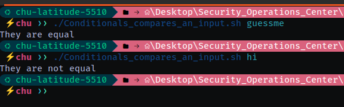

Và chúng ta thấy rằng nó hoạt động như mong đợi!

---

Bây giờ chúng ta sẽ tạo một script khác, nơi chúng ta sẽ sử dụng **2 điều kiện đồng thời** và ôn lại một khái niệm đã học ở bài đầu tiên.

Bắt đầu nhé!

Chúng ta sẽ viết một script hoạt động với **tệp được truyền vào dưới dạng tham số**.

Sau đó, chúng ta sẽ kiểm tra xem tệp đó có tồn tại hay không và nó có quyền **ghi (write)** hay không.

* Nếu có quyền ghi, chúng ta sẽ ghi `"hello"` vào tệp đó.
* Nếu không truy cập được hoặc tệp không tồn tại, ta sẽ **tạo tệp mới** rồi ghi `"hello"` vào đó.

Bắt đầu thôi!

```bash
#!/bin/bash

filename=$1

if [ -f "$filename" ] && [ -w "$filename" ]
then
    echo "hello" > $filename
else
    touch "$filename"
    echo "hello" > $filename
fi
```

---

Chạy thử trong terminal:

```bash
# ./Conditionals_check_exists_write_permissions.sh hello.txt
# cat hello.txt
hello
```

Và ta thấy rằng nó đã hoạt động!

* `-f` kiểm tra xem tệp có tồn tại không
* `-w` kiểm tra xem tệp có thể ghi được hay không
  → Nếu không có quyền ghi, thì ta không thể ghi nội dung vào tệp đó.

---

Để hoàn thiện bài tập nhỏ từ phần trước, bạn có thể mở rộng script bằng cách thêm lệnh `if/else` để:

* Kiểm tra xem tuổi có dưới 18 không → nếu có thì in tên + thông báo "Bạn không đủ điều kiện làm việc"
* Nếu trên 18 thì yêu cầu nhập nghề nghiệp của họ.

Bạn có thể dùng `read` để nhập tên, tuổi, nghề nghiệp.

```bash
#!/bin/bash
echo "Enter your name:"
read name
echo "Enter your age:"
read age
if [ "$age" -ge 18 ]
then
	echo "$name can work"
else
	echo "$name is not eligible for work"
fi
```

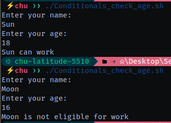


**Hãy trả lời các câu hỏi bên dưới**

**Câu hỏi: Tham số nào dùng để kiểm tra xem ta có quyền đọc file không?**

<details>
  <summary>Hiển thị đáp án</summary>
  Đáp án: -r
</details>

---

**Câu hỏi: Tham số nào dùng để kiểm tra xem đối tượng có phải là thư mục không?**

<details>
  <summary>Hiển thị đáp án</summary>
  Đáp án: -d
</details>


# Task 7 Flag

Dưới đây là **bảng tổng hợp các flag (tùy chọn)** thường dùng trong các lệnh phổ biến của Bash/Linux, chia theo nhóm **lệnh** và **mục đích sử dụng**:

---

### `ls` – Liệt kê thư mục

| Flag | Mô tả                              | Ví dụ sử dụng |
| ---- | ---------------------------------- | ------------- |
| `-l` | Hiển thị chi tiết (dạng danh sách) | `ls -l`       |
| `-a` | Hiện cả file ẩn (bắt đầu bằng `.`) | `ls -a`       |
| `-h` | Kích thước dễ đọc (KB, MB...)      | `ls -lh`      |
| `-t` | Sắp xếp theo thời gian sửa đổi     | `ls -lt`      |
| `-r` | Đảo ngược thứ tự hiển thị          | `ls -lr`      |

---

### `cp` – Sao chép file/thư mục

| Flag | Mô tả                                | Ví dụ sử dụng       |
| ---- | ------------------------------------ | ------------------- |
| `-r` | Sao chép đệ quy (cả thư mục con)     | `cp -r dir1 dir2`   |
| `-i` | Hỏi trước khi ghi đè                 | `cp -i file1 file2` |
| `-u` | Chỉ sao chép nếu nguồn mới hơn đích  | `cp -u file1 file2` |
| `-v` | Hiển thị chi tiết quá trình sao chép | `cp -v file1 file2` |

---

### `rm` – Xoá file/thư mục

| Flag | Mô tả                                      | Ví dụ sử dụng    |
| ---- | ------------------------------------------ | ---------------- |
| `-r` | Xoá đệ quy (thư mục và nội dung bên trong) | `rm -r folder/`  |
| `-f` | Bỏ qua cảnh báo, xoá thẳng tay             | `rm -f file.txt` |
| `-i` | Hỏi trước khi xoá từng file                | `rm -i file.txt` |
| `-v` | Hiển thị chi tiết quá trình xoá            | `rm -v file.txt` |

---

### `grep` – Tìm kiếm chuỗi trong văn bản

| Flag | Mô tả                          | Ví dụ sử dụng              |
| ---- | ------------------------------ | -------------------------- |
| `-i` | Không phân biệt chữ hoa/thường | `grep -i hello file.txt`   |
| `-r` | Tìm kiếm đệ quy trong thư mục  | `grep -r keyword ./`       |
| `-n` | Hiển thị số dòng khớp          | `grep -n "error" file.log` |
| `-v` | Hiển thị dòng **không khớp**   | `grep -v "skip" file.txt`  |

---

### `tar` – Nén/Giải nén file

| Flag | Mô tả                                    | Ví dụ sử dụng                  |
| ---- | ---------------------------------------- | ------------------------------ |
| `-c` | Tạo file nén mới                         | `tar -cf archive.tar folder/`  |
| `-x` | Giải nén                                 | `tar -xf archive.tar`          |
| `-z` | Nén hoặc giải nén với gzip (.gz)         | `tar -czf file.tar.gz folder/` |
| `-v` | Hiển thị chi tiết quá trình nén/giải nén | `tar -xvf file.tar`            |
| `-f` | Chỉ định tên file nén                    | `tar -xf archive.tar`          |

---

### `chmod` – Cấp quyền truy cập

| Flag  | Mô tả                            | Ví dụ sử dụng        |
| ----- | -------------------------------- | -------------------- |
| `+x`  | Thêm quyền thực thi              | `chmod +x script.sh` |
| `-x`  | Gỡ quyền thực thi                | `chmod -x script.sh` |
| `+r`  | Thêm quyền đọc                   | `chmod +r file.txt`  |
| `u+x` | Chỉ thêm quyền thực thi cho user | `chmod u+x myapp`    |

---

### `test` – Kiểm tra điều kiện (được dùng trong `if`)

| Flag | Mô tả                          | Ví dụ sử dụng         |
| ---- | ------------------------------ | --------------------- |
| `-e` | File hoặc thư mục tồn tại      | `[ -e "$file" ]`      |
| `-f` | File thường tồn tại            | `[ -f "$file" ]`      |
| `-d` | Thư mục tồn tại                | `[ -d "$folder" ]`    |
| `-s` | File tồn tại và **không rỗng** | `[ -s "$file" ]`      |
| `-r` | Có quyền đọc                   | `[ -r "$file" ]`      |
| `-w` | Có quyền ghi                   | `[ -w "$file" ]`      |
| `-x` | Có quyền thực thi              | `[ -x "$script.sh" ]` |
| `!`  | Phủ định điều kiện             | `[ ! -d "$folder" ]`  |

---

### `find` – Tìm kiếm file và thư mục

| Flag     | Mô tả                                    | Ví dụ sử dụng                         |
| -------- | ---------------------------------------- | ------------------------------------- |
| `-name`  | Tìm theo tên chính xác                   | `find . -name "file.txt"`             |
| `-iname` | Tìm tên không phân biệt hoa/thường       | `find . -iname "*.jpg"`               |
| `-type`  | Tìm theo loại (f: file, d: directory)    | `find . -type f`                      |
| `-size`  | Tìm theo kích thước (e.g. `+1M`, `-10k`) | `find . -size +1M`                    |
| `-exec`  | Thực thi lệnh trên mỗi file tìm thấy     | `find . -name "*.log" -exec rm {} \;` |
| `-mtime` | Tìm file sửa đổi trong vòng `n` ngày     | `find . -mtime -7`                    |

---

### `ps` – Xem tiến trình đang chạy

| Flag  | Mô tả                                    | Ví dụ sử dụng    |
| ----- | ---------------------------------------- | ---------------- |
| `aux` | Hiển thị toàn bộ tiến trình              | `ps aux`         |
| `-u`  | Hiển thị tiến trình của user cụ thể      | `ps -u username` |
| `-p`  | Hiển thị tiến trình theo PID             | `ps -p 1234`     |
| `-ef` | Hiển thị tiến trình dưới dạng cây đầy đủ | `ps -ef`         |

---

### `awk` – Xử lý dòng và cột văn bản

| Cú pháp                | Mô tả                          | Ví dụ sử dụng                      |
| ---------------------- | ------------------------------ | ---------------------------------- |
| `{print $1}`           | In ra cột đầu tiên             | `awk '{print $1}' file.txt`        |
| `/pattern/ {print $0}` | In dòng chứa chuỗi khớp        | `awk '/error/ {print $0}' log.txt` |
| `BEGIN {}`             | Thiết lập khởi tạo             | `awk 'BEGIN {print "Start"}'`      |
| `END {}`               | Lệnh kết thúc sau khi đọc xong | `awk 'END {print "Done"}'`         |

---

### `curl` – Gửi yêu cầu HTTP

| Flag | Mô tả                               | Ví dụ sử dụng                          |
| ---- | ----------------------------------- | -------------------------------------- |
| `-O` | Lưu file theo tên gốc               | `curl -O https://site.com/file.zip`    |
| `-o` | Lưu file với tên chỉ định           | `curl -o abc.html https://site.com`    |
| `-L` | Theo dõi chuyển hướng (redirect)    | `curl -L http://example.com`           |
| `-I` | Hiển thị header của phản hồi        | `curl -I https://google.com`           |
| `-X` | Chỉ định phương thức (GET, POST...) | `curl -X POST https://api.example.com` |
| `-d` | Gửi dữ liệu POST                    | `curl -d "key=value" -X POST URL`      |
| `-H` | Thêm header HTTP                    | `curl -H "Auth: token" URL`            |

---

### `wget` – Tải file qua HTTP/FTP

| Flag | Mô tả                                  | Ví dụ sử dụng                       |
| ---- | -------------------------------------- | ----------------------------------- |
| `-O` | Ghi ra file theo tên chỉ định          | `wget -O abc.html https://site.com` |
| `-c` | Tiếp tục tải file bị ngắt              | `wget -c file.zip`                  |
| `-q` | Chế độ yên lặng (không in ra màn hình) | `wget -q https://site.com`          |
| `-r` | Tải đệ quy (cả thư mục)                | `wget -r https://site.com/folder/`  |

---

### `head` và `tail` – Xem đầu/cuối file

| Lệnh   | Flag | Mô tả                            | Ví dụ sử dụng             |
| ------ | ---- | -------------------------------- | ------------------------- |
| `head` | `-n` | In ra `n` dòng đầu của file      | `head -n 10 file.txt`     |
| `tail` | `-n` | In ra `n` dòng cuối của file     | `tail -n 20 file.txt`     |
| `tail` | `-f` | Theo dõi log theo thời gian thực | `tail -f /var/log/syslog` |

---

### `sort` – Sắp xếp dữ liệu

| Flag | Mô tả                             | Ví dụ sử dụng        |
| ---- | --------------------------------- | -------------------- |
| `-n` | Sắp xếp theo số                   | `sort -n file.txt`   |
| `-r` | Đảo ngược thứ tự                  | `sort -r file.txt`   |
| `-k` | Sắp xếp theo cột cụ thể           | `sort -k 2 file.txt` |
| `-u` | Bỏ dòng trùng lặp sau khi sắp xếp | `sort -u file.txt`   |

---

### `cut` – Cắt cột từ dòng

| Flag | Mô tả                       | Ví dụ sử dụng                |
| ---- | --------------------------- | ---------------------------- |
| `-d` | Đặt ký tự phân tách         | `cut -d ':' -f1 /etc/passwd` |
| `-f` | Chọn cột/fiels cần hiển thị | `cut -f2 data.txt`           |
| `-c` | Cắt theo ký tự (vị trí)     | `cut -c 1-5 file.txt`        |

---

### `sed` – Trình biên tập dòng (stream editor)

| Flag/Cú pháp         | Mô tả                                       | Ví dụ sử dụng                |
| -------------------- | ------------------------------------------- | ---------------------------- |
| `s/pattern/thaythế/` | Thay thế mẫu đầu tiên trong mỗi dòng        | `sed 's/cat/dog/' file.txt`  |
| `s/pattern/thay/g`   | Thay tất cả mẫu trong dòng                  | `sed 's/foo/bar/g' file.txt` |
| `-i`                 | Chỉnh sửa trực tiếp trong file (in-place)   | `sed -i 's/A/B/g' file.txt`  |
| `-n '/pattern/p'`    | In ra dòng khớp mẫu, không in toàn bộ       | `sed -n '/error/p' log.txt`  |
| `d`                  | Xoá dòng (khi kết hợp với số dòng hoặc mẫu) | `sed '2d' file.txt`          |

---

### `diff` – So sánh 2 file

| Flag             | Mô tả                                       | Ví dụ sử dụng                     |
| ---------------- | ------------------------------------------- | --------------------------------- |
| `-u`             | Hiển thị khác biệt theo định dạng “unified” | `diff -u old.txt new.txt`         |
| `-c`             | Hiển thị theo định dạng “context”           | `diff -c file1 file2`             |
| `--side-by-side` | So sánh 2 file song song                    | `diff --side-by-side a.txt b.txt` |

---

### `xargs` – Thực thi lệnh với đầu vào

| Flag/Cú pháp | Mô tả                                          | Ví dụ sử dụng    |                              |
| ------------ | ---------------------------------------------- | ---------------- | ---------------------------- |
| `xargs`      | Chuyển stdin thành đối số cho lệnh khác        | \`ls \*.txt      | xargs rm\`                   |
| `-n`         | Chạy với n đối số mỗi lần                      | \`cat list.txt   | xargs -n 1 echo\`            |
| `-I {}`      | Đặt vị trí thay thế                            | \`cat files      | xargs -I {} cp {} /backup/\` |
| `-0`         | Xử lý với ký tự null (phối hợp `find -print0`) | \`find . -print0 | xargs -0 rm\`                |

---

### `tee` – Ghi đầu ra ra nhiều nơi

| Flag       | Mô tả                              | Ví dụ sử dụng |                      |
| ---------- | ---------------------------------- | ------------- | -------------------- |
| (mặc định) | Ghi đồng thời ra màn hình và file  | \`ls          | tee output.txt\`     |
| `-a`       | Ghi bổ sung vào cuối file (append) | \`echo "log"  | tee -a logfile.txt\` |

---

### `rsync` – Đồng bộ thư mục/file

| Flag       | Mô tả                                     | Ví dụ sử dụng                        |
| ---------- | ----------------------------------------- | ------------------------------------ |
| `-a`       | Chế độ lưu toàn bộ thuộc tính (`archive`) | `rsync -a src/ dest/`                |
| `-v`       | Hiển thị chi tiết quá trình               | `rsync -av src/ dest/`               |
| `--delete` | Xoá file ở đích nếu không có ở nguồn      | `rsync -av --delete src/ dest/`      |
| `-z`       | Nén khi truyền                            | `rsync -az src/ remote:/backup/`     |
| `-e`       | Chỉ định chương trình truyền (như ssh)    | `rsync -e ssh file user@host:/path/` |

---

### `nc` (Netcat) – Công cụ mạng đa năng

| Flag | Mô tả                                 | Ví dụ sử dụng             |
| ---- | ------------------------------------- | ------------------------- |
| `-l` | Nghe ở cổng (listen mode)             | `nc -l -p 1234`           |
| `-p` | Chỉ định cổng lắng nghe               | `nc -l -p 8080`           |
| `-v` | Verbose – hiển thị thông tin chi tiết | `nc -v host 80`           |
| `-z` | Scan cổng không gửi dữ liệu           | `nc -zv 127.0.0.1 1-1000` |

---

### `tr` – Dịch/ký tự hóa văn bản (translate)

| Cú pháp       | Mô tả                           | Ví dụ sử dụng  |               |
| ------------- | ------------------------------- | -------------- | ------------- |
| `tr a-z A-Z`  | Chuyển chữ thường thành chữ hoa | \`echo hello   | tr a-z A-Z\`  |
| `tr -d 'a'`   | Xoá tất cả ký tự 'a'            | \`echo banana  | tr -d 'a'\`   |
| `tr -s ' '`   | Rút gọn khoảng trắng dư         | \`echo "a   b" | tr -s ' '\`   |
| `tr '\n' ' '` | Chuyển newline thành dấu cách   | \`cat file.txt | tr '\n' ' '\` |

---

### `basename` – Lấy tên file từ đường dẫn

| Cú pháp / Flag       | Mô tả                                      | Ví dụ sử dụng                               |
| -------------------- | ------------------------------------------ | ------------------------------------------- |
| `basename path`      | Trả về tên file cuối cùng từ một đường dẫn | `basename /home/user/file.txt` → `file.txt` |
| `basename path .ext` | Loại bỏ phần mở rộng                       | `basename file.txt .txt` → `file`           |

---

### `dirname` – Lấy đường dẫn thư mục từ file path

| Cú pháp        | Mô tả                         | Ví dụ sử dụng                                |
| -------------- | ----------------------------- | -------------------------------------------- |
| `dirname path` | Trả về phần thư mục chứa file | `dirname /home/user/file.txt` → `/home/user` |

---

### `uniq` – Loại bỏ dòng trùng lặp (thường kết hợp với `sort`)

| Flag       | Mô tả                             | Ví dụ sử dụng        |
| ---------- | --------------------------------- | -------------------- |
| (mặc định) | Loại bỏ các dòng trùng kề nhau    | `uniq file.txt`      |
| `-c`       | Đếm số lần xuất hiện mỗi dòng     | `uniq -c sorted.txt` |
| `-d`       | Chỉ hiển thị dòng bị trùng        | `uniq -d sorted.txt` |
| `-u`       | Chỉ hiển thị dòng **không trùng** | `uniq -u sorted.txt` |

---

### `wc` – Đếm dòng, từ, byte

| Flag | Mô tả        | Ví dụ sử dụng    |
| ---- | ------------ | ---------------- |
| `-l` | Đếm số dòng  | `wc -l file.txt` |
| `-w` | Đếm số từ    | `wc -w file.txt` |
| `-c` | Đếm số byte  | `wc -c file.txt` |
| `-m` | Đếm số ký tự | `wc -m file.txt` |

---

### `date` – Xem hoặc định dạng ngày giờ

| Flag        | Mô tả                                | Ví dụ sử dụng           |
| ----------- | ------------------------------------ | ----------------------- |
| (mặc định)  | Hiển thị ngày giờ hiện tại           | `date`                  |
| `+%Y-%m-%d` | Định dạng theo năm-tháng-ngày        | `date "+%Y-%m-%d"`      |
| `-d`        | Hiển thị thời gian tương lai/quá khứ | `date -d "next Friday"` |
| `+%T`       | Hiển thị giờ/phút/giây               | `date "+%T"`            |

---

### `uptime` – Thời gian hệ thống đã chạy

| Cú pháp  | Mô tả                                                   | Ví dụ sử dụng |
| -------- | ------------------------------------------------------- | ------------- |
| `uptime` | Hiển thị thời gian bật máy, số người dùng, tải hệ thống | `uptime`      |

---

### `env` – Biến môi trường

| Cú pháp       | Mô tả                                       | Ví dụ sử dụng       |
| ------------- | ------------------------------------------- | ------------------- |
| `env`         | Hiển thị tất cả biến môi trường             | `env`               |
| `env VAR=val` | Thiết lập biến môi trường tạm thời khi chạy | `env DEBUG=1 ./app` |

---

### `alias` – Định nghĩa lệnh tắt

| Cú pháp            | Mô tả                         | Ví dụ sử dụng |
| ------------------ | ----------------------------- | ------------- |
| `alias`            | Hiển thị tất cả alias hiện có | `alias`       |
| `alias ll='ls -l'` | Tạo alias cho `ls -l`         | `ll`          |
| `unalias ll`       | Xoá alias                     | `unalias ll`  |

---

### `lsof` – Liệt kê file đang mở

| Flag | Mô tả                                 | Ví dụ sử dụng      |
| ---- | ------------------------------------- | ------------------ |
| `-i` | Hiển thị kết nối mạng đang mở         | `lsof -i`          |
| `-u` | Hiển thị file mở bởi user cụ thể      | `lsof -u username` |
| `-p` | Hiển thị file mở bởi PID cụ thể       | `lsof -p 1234`     |
| `+D` | Xem tất cả file được mở trong thư mục | `lsof +D /var/log` |

---

### `journalctl` – Xem log hệ thống (systemd)

| Flag         | Mô tả                                              | Ví dụ sử dụng                     |
| ------------ | -------------------------------------------------- | --------------------------------- |
| `-b`         | Xem log từ lần khởi động gần nhất                  | `journalctl -b`                   |
| `-u service` | Xem log của một service cụ thể                     | `journalctl -u ssh.service`       |
| `-f`         | Theo dõi log theo thời gian thực (giống `tail -f`) | `journalctl -f`                   |
| `--since`    | Lọc log theo thời gian                             | `journalctl --since "2024-01-01"` |


---

### `systemctl` – Quản lý dịch vụ hệ thống (systemd)

| Lệnh / Flag | Mô tả                                    | Ví dụ sử dụng             |
| ----------- | ---------------------------------------- | ------------------------- |
| `start`     | Bắt đầu dịch vụ                          | `systemctl start nginx`   |
| `stop`      | Dừng dịch vụ                             | `systemctl stop apache2`  |
| `restart`   | Khởi động lại dịch vụ                    | `systemctl restart sshd`  |
| `status`    | Kiểm tra trạng thái dịch vụ              | `systemctl status docker` |
| `enable`    | Bật dịch vụ khởi động cùng hệ thống      | `systemctl enable mysql`  |
| `disable`   | Tắt dịch vụ khỏi khởi động cùng hệ thống | `systemctl disable cups`  |

---

### `iptables` – Cấu hình tường lửa

| Lệnh / Flag | Mô tả                             | Ví dụ sử dụng                                   |
| ----------- | --------------------------------- | ----------------------------------------------- |
| `-L`        | Liệt kê các luật hiện có          | `iptables -L`                                   |
| `-A`        | Thêm luật mới                     | `iptables -A INPUT -p tcp --dport 22 -j ACCEPT` |
| `-D`        | Xoá luật                          | `iptables -D INPUT 1`                           |
| `-F`        | Xoá tất cả luật                   | `iptables -F`                                   |
| `-I`        | Chèn luật vào vị trí cụ thể       | `iptables -I INPUT 1 -p icmp -j DROP`           |
| `-p`        | Chỉ định giao thức (tcp/udp/icmp) | `iptables -A INPUT -p tcp ...`                  |

---

### `cron` & `crontab` – Tác vụ định kỳ

| Lệnh / Flag  | Mô tả                                 | Ví dụ sử dụng |
| ------------ | ------------------------------------- | ------------- |
| `crontab -e` | Mở file cấu hình tác vụ định kỳ       | `crontab -e`  |
| `crontab -l` | Xem danh sách tác vụ định kỳ hiện tại | `crontab -l`  |
| `crontab -r` | Xoá toàn bộ crontab                   | `crontab -r`  |

> **Ví dụ dòng crontab**:
> `0 2 * * * /usr/bin/backup.sh` – chạy lúc 2h sáng hàng ngày

---

### `kill` – Kết thúc tiến trình

| Flag       | Mô tả                                  | Ví dụ sử dụng  |
| ---------- | -------------------------------------- | -------------- |
| `kill PID` | Gửi tín hiệu dừng mặc định (TERM)      | `kill 1234`    |
| `-9`       | Gửi tín hiệu SIGKILL (mạnh nhất)       | `kill -9 5678` |
| `-l`       | Liệt kê danh sách tín hiệu có thể dùng | `kill -l`      |

---

### `top` – Giám sát tiến trình theo thời gian thực

| Flag       | Mô tả                                     | Ví dụ sử dụng |
| ---------- | ----------------------------------------- | ------------- |
| (mặc định) | Mở giao diện top                          | `top`         |
| `-u`       | Chỉ hiển thị tiến trình của 1 user cụ thể | `top -u root` |

---

### `htop` – Giao diện tương tác quản lý tiến trình (cải tiến từ `top`)

| Cú pháp | Mô tả                    | Ví dụ sử dụng |
| ------- | ------------------------ | ------------- |
| `htop`  | Khởi chạy giao diện htop | `htop`        |

> (Nếu chưa có, cài bằng: `sudo apt install htop`)

---

### `ping` – Kiểm tra kết nối mạng

| Flag | Mô tả                             | Ví dụ sử dụng          |
| ---- | --------------------------------- | ---------------------- |
| `-c` | Số lượng gói gửi                  | `ping -c 4 google.com` |
| `-i` | Thời gian chờ giữa mỗi gói (giây) | `ping -i 2 8.8.8.8`    |
| `-t` | TTL (Time to live)                | `ping -t 64 8.8.8.8`   |

---

### `ss` – Hiển thị kết nối mạng (thay thế `netstat`)

| Flag | Mô tả                            | Ví dụ sử dụng |
| ---- | -------------------------------- | ------------- |
| `-t` | Chỉ hiển thị kết nối TCP         | `ss -t`       |
| `-l` | Hiển thị cổng đang lắng nghe     | `ss -l`       |
| `-n` | Không phân giải tên              | `ss -tunlp`   |
| `-p` | Hiển thị tiến trình gắn với cổng | `ss -tulnp`   |

---

### `netstat` – Kiểm tra kết nối mạng (cũ, nhưng vẫn hữu ích)

| Flag    | Mô tả                                       | Ví dụ sử dụng    |
| ------- | ------------------------------------------- | ---------------- |
| `-tuln` | Cổng TCP/UDP đang lắng nghe không phân giải | `netstat -tuln`  |
| `-p`    | Hiển thị PID/Tên tiến trình                 | `netstat -tulnp` |
| `-r`    | Hiển thị bảng định tuyến                    | `netstat -r`     |

---

### `mount` – Gắn kết hệ thống tệp

| Flag       | Mô tả                        | Ví dụ sử dụng                   |
| ---------- | ---------------------------- | ------------------------------- |
| (mặc định) | Gắn một thiết bị vào thư mục | `mount /dev/sdb1 /mnt/usb`      |
| `-t`       | Chỉ định hệ thống tệp        | `mount -t ext4 /dev/sda1 /data` |

---

### `df` – Xem dung lượng ổ đĩa

| Flag | Mô tả                         | Ví dụ sử dụng |
| ---- | ----------------------------- | ------------- |
| `-h` | Dung lượng dễ đọc (KB, MB...) | `df -h`       |
| `-T` | Hiển thị loại hệ thống tệp    | `df -T`       |

---

### `du` – Kiểm tra dung lượng thư mục

| Flag | Mô tả                         | Ví dụ sử dụng    |
| ---- | ----------------------------- | ---------------- |
| `-h` | Hiển thị dễ đọc               | `du -h folder/`  |
| `-s` | Chỉ tổng dung lượng thư mục   | `du -sh folder/` |
| `-a` | Hiển thị dung lượng từng file | `du -ah folder/` |

---

### `docker` – Quản lý container Docker

| Lệnh / Flag     | Mô tả                                    | Ví dụ sử dụng                       |
| --------------- | ---------------------------------------- | ----------------------------------- |
| `docker ps`     | Liệt kê container đang chạy              | `docker ps`                         |
| `docker ps -a`  | Liệt kê tất cả container (kể cả đã dừng) | `docker ps -a`                      |
| `docker images` | Liệt kê images đang có                   | `docker images`                     |
| `docker run`    | Tạo và chạy container                    | `docker run -it ubuntu /bin/bash`   |
| `docker exec`   | Thực thi lệnh trong container đang chạy  | `docker exec -it container_id bash` |
| `docker stop`   | Dừng container                           | `docker stop container_id`          |
| `docker rm`     | Xoá container                            | `docker rm container_id`            |

---

### `nmap` – Quét cổng và dịch vụ mạng

| Flag  | Mô tả                                 | Ví dụ sử dụng              |
| ----- | ------------------------------------- | -------------------------- |
| `-sS` | Quét SYN (stealth scan)               | `nmap -sS 192.168.1.1`     |
| `-sV` | Phát hiện phiên bản dịch vụ           | `nmap -sV scanme.nmap.org` |
| `-p`  | Quét cổng cụ thể                      | `nmap -p 80,443 10.0.0.1`  |
| `-O`  | Phát hiện hệ điều hành (OS detection) | `nmap -O 192.168.1.1`      |

---

### `tcpdump` – Phân tích gói tin mạng

| Flag | Mô tả                             | Ví dụ sử dụng                 |
| ---- | --------------------------------- | ----------------------------- |
| `-i` | Chỉ định interface mạng           | `tcpdump -i eth0`             |
| `-n` | Không phân giải tên hostname/port | `tcpdump -n port 80`          |
| `-w` | Ghi dữ liệu vào file `.pcap`      | `tcpdump -i eth0 -w out.pcap` |
| `-r` | Đọc dữ liệu từ file `.pcap`       | `tcpdump -r out.pcap`         |

---

### `ufw` – Tường lửa đơn giản (Uncomplicated Firewall)

| Lệnh / Flag    | Mô tả            | Ví dụ sử dụng       |
| -------------- | ---------------- | ------------------- |
| `ufw enable`   | Bật tường lửa    | `sudo ufw enable`   |
| `ufw disable`  | Tắt tường lửa    | `sudo ufw disable`  |
| `ufw status`   | Xem trạng thái   | `sudo ufw status`   |
| `ufw allow 22` | Cho phép cổng 22 | `sudo ufw allow 22` |
| `ufw deny 80`  | Chặn cổng 80     | `sudo ufw deny 80`  |

---

### `watch` – Theo dõi lệnh theo thời gian thực

| Flag       | Mô tả                                       | Ví dụ sử dụng      |
| ---------- | ------------------------------------------- | ------------------ |
| (mặc định) | Chạy lặp lại một lệnh mỗi 2 giây            | `watch ls -l`      |
| `-n`       | Chỉ định khoảng thời gian giữa các lần chạy | `watch -n 5 df -h` |
| `-d`       | Tô màu những phần thay đổi                  | `watch -d date`    |

---

### `time` – Đo thời gian thực thi lệnh

| Cú pháp        | Mô tả                               | Ví dụ sử dụng  |
| -------------- | ----------------------------------- | -------------- |
| `time command` | Hiển thị thời gian user/system/real | `time sleep 1` |

---

### `yes` – Lặp lại chuỗi vô hạn (dùng test hoặc pipe)

| Cú pháp  | Mô tả            | Ví dụ sử dụng |       |             |
| -------- | ---------------- | ------------- | ----- | ----------- |
| `yes`    | In “y” lặp lại   | `yes`         |       |             |
| `yes No` | In “No” liên tục | `yes No`      |       |             |
| \`yes    | head -n 3\`      | In 3 dòng “y” | \`yes | head -n 3\` |

---

### `cut` – Cắt trường từ dòng

| Flag | Mô tả                    | Ví dụ sử dụng                |
| ---- | ------------------------ | ---------------------------- |
| `-d` | Chỉ định ký tự phân cách | `cut -d ':' -f1 /etc/passwd` |
| `-f` | Chọn trường cụ thể       | `cut -f2 data.txt`           |
| `-c` | Cắt theo vị trí ký tự    | `cut -c1-5 file.txt`         |

---

### `paste` – Ghép dòng file theo chiều ngang

| Flag       | Mô tả                             | Ví dụ sử dụng              |
| ---------- | --------------------------------- | -------------------------- |
| (mặc định) | Ghép dòng tương ứng giữa các file | `paste file1 file2`        |
| `-d`       | Đặt ký tự phân cách giữa cột      | `paste -d ',' a.txt b.txt` |

---

### `zcat`, `bzcat` – Xem nội dung file nén `.gz`, `.bz2`

| Lệnh    | Mô tả                                      | Ví dụ sử dụng        |
| ------- | ------------------------------------------ | -------------------- |
| `zcat`  | Xem nội dung file `.gz` không cần giải nén | `zcat file.txt.gz`   |
| `bzcat` | Xem nội dung file `.bz2`                   | `bzcat file.txt.bz2` |

---


