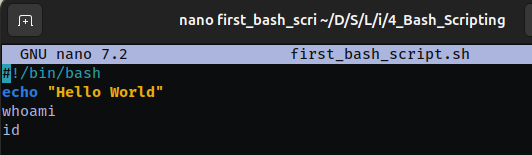

# Bash Scripting
> Cơ bản về những tập lệnh bash


# Mục Lục

1. [Task 1: Introduction](#task-1-introduction)  
2. [Task 2: Our first simple bash scripts](#task-2-our-first-simple-bash-scripts)  
3. [Task 3: Variables](#task-3-variables)  
4. [Task 4: Parameters](#task-4-parameters)  
5. [Task 5: Arrays](#task-5-arrays)  
6. [Task 6: Conditionals](#task-6-conditionals)  
7. [Task 7: Further reading](#task-7-further-reading)

## Nội dung

# Task 1: Introduction

---

### Bash là gì?

Bash là một ngôn ngữ kịch bản (scripting language) chạy trong terminal trên hầu hết các bản phân phối Linux, cũng như trên MacOS. Shell script là một chuỗi các lệnh bash nằm trong một tệp, kết hợp lại với nhau để thực hiện các tác vụ phức tạp hơn so với các lệnh một dòng đơn giản, và đặc biệt hữu ích khi cần tự động hóa các tác vụ quản trị hệ thống như sao lưu dữ liệu.

Dưới đây là một vài nội dung  sẽ học:

* Bash syntax
* Variables
* Using parameters
* Arrays
* Conditionals

Trong suốt quá trình học, bạn có thể làm theo cùng với tôi! Bạn có thể thử các lệnh được trình bày hoặc tích hợp chúng vào các dự án riêng của mình, sau khi bạn học bằng cách thực hành và áp dụng những gì đã học vào các tình huống thực tế. Hãy chắc chắn rằng bạn đã khởi động "tryhackme attackbox" hoặc sử dụng terminal của riêng bạn.

Trang web hữu ích học Bash: [https://devhints.io/bash](https://devhints.io/bash)

Trang web tra cứu chức năng của các lệnh: [https://explainshell.com/](https://explainshell.com/)

---

# Task 2: Our first simple bash scripts

Dưới đây là bản dịch tiếng Việt của nội dung trong ảnh:

---

### Task 2 – Những đoạn bash script đơn giản đầu tiên của chúng ta

Một file bash script thường có đuôi `.sh`

Trước tiên, hãy trình bày cấu trúc của chúng ta.

Một bash script luôn bắt đầu với dòng mã sau ở đầu tập tin:

```
#!/bin/bash
```


Dòng này giúp shell của bạn (bất kể loại shell nào) biết rằng nó cần phải chạy tập tin của bạn bằng bash trong terminal.

---

Hãy cùng bắt đầu với một vài ví dụ cơ bản.

```bash
#!/bin/bash
echo "Hello World!"
```


Lệnh này sẽ in ra chuỗi “Hello World!”.
Lệnh `echo` được dùng để xuất văn bản ra màn hình, tương tự như lệnh `print` trong Python.

---

Chúng cũng có thể thực thi các lệnh Linux thông thường bên trong bash script, và chúng sẽ được chạy nếu bạn định dạng đúng.
Ví dụ, chúng ta có thể chạy lệnh `ls` bên trong bash script và sẽ thấy kết quả khi chạy file đó. 

```bash
#!/bin/bash
echo "Hello World"
whoami
id
```


---

Trong đoạn script trên:

* `whoami` sẽ in ra tên người dùng hiện tại.
* `id` sẽ hiển thị thông tin UID, GID, và nhóm của người dùng.

Dưới đây là bản dịch tiếng Việt của nội dung trong ảnh:

---

Bây giờ để chạy một bash script, trước tiên ta cần cấp quyền thực thi cho nó:

```
chmod +x yourfile.sh
```

Sau đó ta chạy nó bằng cách sử dụng:

```
./
```

Ví dụ:

```bash
./first_bash_script.sh 
Hello World
chu
uid=1000(chu) gid=1000(chu) groups=1000(chu),4(adm),24(cdrom),27(sudo),30(dip),46(plugdev),109(kvm),119(vboxusers),122(lpadmin),134(lxd),135(sambashare),139(wireshark),140(docker),143(ubridge),145(libvirt)
```

Ta có thể thấy script đã xuất ra kết quả của các lệnh `whoami` và `id`.

---
