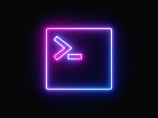

# Bash Scripting
> Cơ bản về những tập lệnh bash

# Mục Lục

1. [Task 1: Introduction](#task-1-introduction)  
2. [Task 2: Our first simple bash scripts](#task-2-our-first-simple-bash-scripts)  
3. [Task 3: Variables](#task-3-variables)  
4. [Task 4: Parameters](#task-4-parameters)  
5. [Task 5: Arrays](#task-5-arrays)  
6. [Task 6: Conditionals](#task-6-conditionals)  
7. [Task 7: Further reading](#task-7-further-reading)

## Nội dung

# Task 1: Introduction

Dưới đây là bản dịch tiếng Việt của nội dung trong ảnh:

---

### Bash là gì?

Bash là một ngôn ngữ kịch bản (scripting language) chạy trong terminal trên hầu hết các bản phân phối Linux, cũng như trên MacOS. Shell script là một chuỗi các lệnh bash nằm trong một tệp, kết hợp lại với nhau để thực hiện các tác vụ phức tạp hơn so với các lệnh một dòng đơn giản, và đặc biệt hữu ích khi cần tự động hóa các tác vụ quản trị hệ thống như sao lưu dữ liệu.

Dưới đây là một vài nội dung  sẽ học:

* Bash syntax
* Variables
* Using parameters
* Arrays
* Conditionals

Trong suốt quá trình học, bạn có thể làm theo cùng với tôi! Bạn có thể thử các lệnh được trình bày hoặc tích hợp chúng vào các dự án riêng của mình, sau khi bạn học bằng cách thực hành và áp dụng những gì đã học vào các tình huống thực tế. Hãy chắc chắn rằng bạn đã khởi động "tryhackme attackbox" hoặc sử dụng terminal của riêng bạn.

Trang web hữu ích học Bash: [https://devhints.io/bash](https://devhints.io/bash)

Trang web tra cứu chức năng của các lệnh: [https://explainshell.com/](https://explainshell.com/)
---

