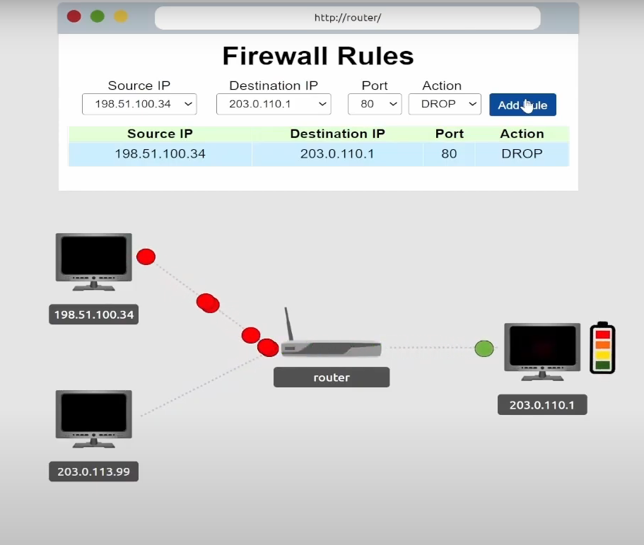
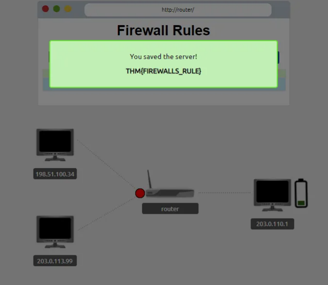
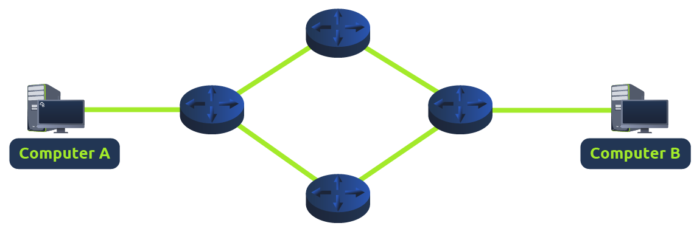
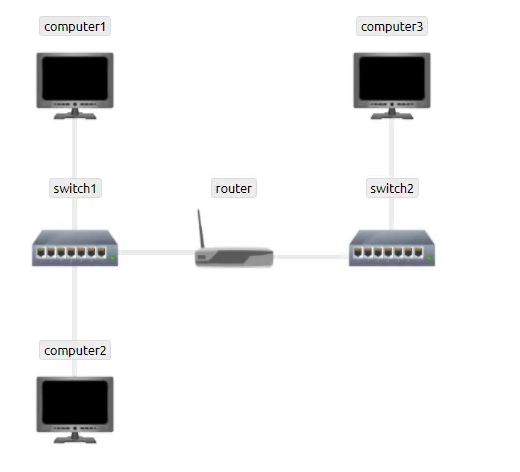

# Extending Your Network

> Tìm hiểu về một số công nghệ được sử dụng để mở rộng mạng ra Internet và các động cơ đằng sau việc này.

## Mục Lục

1. [Task 1: Introduction to Port Forwarding](#task-1-introduction-to-port-forwarding)  
2. [Task 2: Firewalls 101](#task-2-firewalls-101)  
3. [Task 3: Practical — Firewall](#task-3-practical--firewall)  
4. [Task 4: VPN Basics](#task-4-vpn-basics)  
5. [Task 5: LAN Networking Devices](#task-5-lan-networking-devices)  
6. [Task 6: Practical — Network Simulator](#task-6-practical--network-simulator)

## nội dung

# Task 1: Introduction to Port Forwarding

**Chuyển tiếp cổng (Port Forwarding)** là một thành phần hữu ích được sử dụng để kết nối các ứng dụng và dịch vụ với internet.  

Ví dụ, một máy chủ có địa chỉ IP **“192.168.1.10”** chạy dịch vụ trên cổng **80**, cùng với hai máy tính được kết nối với nó (mạng nội bộ - intranet). Quản trị viên muốn làm cho nội dung trên máy chủ này hiển thị công khai cho mọi người. Vì vậy, anh ấy sử dụng khái niệm **chuyển tiếp cổng (port forwarding)** để nội dung này có thể được truy cập từ internet.

Nếu quản trị viên muốn trang web có thể được truy cập công khai (sử dụng Internet), họ sẽ phải triển khai **chuyển tiếp cổng (port forwarding)**, như trong sơ đồ bên dưới:

Với thiết kế này, **Mạng #2** bây giờ sẽ có thể truy cập vào máy chủ web đang chạy trên **Mạng #1** bằng cách sử dụng địa chỉ IP công khai của **Mạng #1** (**82.62.51.70**).

Rất dễ nhầm lẫn giữa **chuyển tiếp cổng (port forwarding)** với hành vi của **tường lửa (firewall)** (một công nghệ mà chúng ta sẽ thảo luận trong nhiệm vụ sau). Tuy nhiên, ở giai đoạn này, chỉ cần hiểu rằng chuyển tiếp cổng mở các cổng cụ thể (hãy nhớ cách các gói tin hoạt động). Ngược lại, **tường lửa** xác định xem lưu lượng truy cập có thể đi qua các cổng này hay không (ngay cả khi các cổng này đã được mở bằng cách chuyển tiếp cổng).

**Chuyển tiếp cổng** được cấu hình tại **router** của mạng.

**Câu hỏi:**  

Tên của thiết bị được sử dụng để cấu hình **chuyển tiếp cổng** là gì?  

  
  
Hiển thị đáp án
  
  Đáp án: router  

  

# Task 2: Firewalls 101

**Tường lửa (Firewall)** là một thiết bị trong mạng chịu trách nhiệm xác định loại lưu lượng nào được phép ra vào mạng. Hãy nghĩ về tường lửa như một lớp bảo vệ biên giới cho mạng. Quản trị viên có thể cấu hình tường lửa để **cho phép (permit)** hoặc **từ chối (deny)** lưu lượng truy cập vào hoặc ra khỏi mạng dựa trên nhiều yếu tố như:

- **Lưu lượng đến từ đâu?** (Tường lửa đã được cấu hình để chấp nhận/từ chối lưu lượng từ một mạng cụ thể chưa?)  
- **Lưu lượng đi đến đâu?** (Tường lửa đã được cấu hình để chấp nhận/từ chối lưu lượng đến một mạng cụ thể chưa?)  
- **Lưu lượng truy cập đến cổng nào?** (Tường lửa đã được cấu hình để chấp nhận/từ chối lưu lượng đến cổng 80 chưa?)  
- **Lưu lượng sử dụng giao thức nào?** (Tường lửa đã được cấu hình để chấp nhận/từ chối lưu lượng sử dụng giao thức **UDP**, **TCP** hay cả hai chưa?)  

Tường lửa thực hiện kiểm tra gói tin (**packet inspection**) để trả lời các câu hỏi trên.

**Tường lửa** có nhiều kích thước và hình dạng khác nhau. Từ các thiết bị phần cứng chuyên dụng (thường được tìm thấy trong các mạng lớn như doanh nghiệp) có thể xử lý lượng dữ liệu khổng lồ, đến các bộ định tuyến dân dụng (như tại nhà bạn!) hoặc phần mềm như **Snort**, tường lửa có thể được phân loại thành **2 đến 5 loại**.

Chúng ta sẽ khám phá **hai loại chính** của tường lửa trong bảng dưới đây:

| **Loại tường lửa** | **Mô tả**                                                                                                                                       |
|---------------------|-------------------------------------------------------------------------------------------------------------------------------------------------|
| **Stateful**        | Loại tường lửa này sử dụng toàn bộ thông tin từ một kết nối; thay vì kiểm tra từng gói tin riêng lẻ, tường lửa này xác định hành vi của một thiết bị dựa trên toàn bộ kết nối.    Loại tường lửa này tiêu thụ nhiều tài nguyên hơn so với tường lửa không trạng thái vì quá trình ra quyết định là động. Ví dụ: một tường lửa có thể cho phép các phần đầu tiên của quá trình bắt tay TCP, nhưng sau đó phát hiện và chặn nếu kết nối thất bại.     Nếu một kết nối từ một host là xấu, nó sẽ chặn toàn bộ thiết bị. |
| **Stateless**       | Loại tường lửa này sử dụng một tập hợp quy tắc tĩnh để xác định liệu các gói tin riêng lẻ (individual packets) có được chấp nhận hay không. Ví dụ: một thiết bị gửi một gói tin xấu sẽ không đồng nghĩa với việc toàn bộ thiết bị đó bị chặn.    Mặc dù các tường lửa này sử dụng ít tài nguyên hơn so với các lựa chọn khác, nhưng chúng kém thông minh hơn. Ví dụ: các tường lửa này chỉ hiệu quả nếu các quy tắc được định nghĩa chính xác. Nếu quy tắc không khớp chính xác, tường lửa sẽ không hoạt động hiệu quả.    Tuy nhiên, các tường lửa này rất hiệu quả khi xử lý lượng lớn lưu lượng từ một tập hợp các host (chẳng hạn như trong một cuộc tấn công từ chối dịch vụ phân tán - DDoS).|

**Câu hỏi :**  

1. Tường lửa hoạt động ở những lớp nào trong mô hình OSI?
   

  
  
Hiển thị đáp án
  
  Đáp án: Layer 3, Layer 4  

  

2. Loại tường lửa nào kiểm tra toàn bộ kết nối?  

  
  
Hiển thị đáp án
  
  Đáp án: stateful  

  

3. Loại tường lửa nào kiểm tra từng gói tin riêng lẻ?  

  
  
Hiển thị đáp án
  
  Đáp án: stateless  

  

# Task 3: Practical — Firewall

Trang web tại 203.0.110.1 đang bị tấn công! Hãy nhanh chóng thêm một số quy tắc tường lửa để ngăn máy chủ bị sập!

Các gói tin màu đỏ đến từ máy của kẻ tấn công!

Lựa chọn cổng 80 vì cổng này dành cho HyperText Transfer Protocol (HTTP).

# Task 4: VPN Basics

**Mạng riêng ảo (VPN)**  

**VPN** (viết tắt của Virtual Private Network) là một công nghệ cho phép các thiết bị trên các mạng riêng biệt giao tiếp an toàn bằng cách tạo ra một đường dẫn chuyên dụng giữa các thiết bị này qua Internet (được gọi là một "đường hầm"). Các thiết bị được kết nối trong đường hầm này sẽ tạo thành mạng riêng của chính chúng.  

Ví dụ, chỉ các thiết bị trong cùng một mạng (chẳng hạn như trong một doanh nghiệp) mới có thể giao tiếp trực tiếp với nhau. Tuy nhiên, **VPN** cho phép hai văn phòng được kết nối với nhau. Hãy xem sơ đồ bên dưới, nơi có ba mạng riêng biệt:  

Các thiết bị kết nối trên **Mạng #3** vẫn là một phần của **Mạng #1** và **Mạng #2**, nhưng đồng thời cũng tạo thành một mạng riêng (**Mạng #3**) mà chỉ các thiết bị được kết nối qua **VPN** này mới có thể giao tiếp với nhau.

Hãy cùng khám phá một số lợi ích khác mà **VPN** mang lại trong bảng dưới đây:

| **Lợi ích**                                             | **Mô tả**                                                                                                                                                                                                                   |
|---------------------------------------------------------|-----------------------------------------------------------------------------------------------------------------------------------------------------------------------------------------------------------------------------|
| **Kết nối các mạng ở các địa điểm địa lý khác nhau.**   | Ví dụ, một doanh nghiệp có nhiều văn phòng sẽ thấy VPN hữu ích vì nó cho phép truy cập tài nguyên như máy chủ/hạ tầng từ một văn phòng khác.                                                                                |
| **Cung cấp quyền riêng tư.**                            | Công nghệ VPN sử dụng mã hóa để bảo vệ dữ liệu. Điều này đảm bảo rằng dữ liệu chỉ có thể được hiểu bởi các thiết bị gửi và nhận, tránh bị đánh cắp dữ liệu (**sniffing**).   Mã hóa này hữu ích trong các mạng WiFi công cộng không cung cấp bảo mật. |
| **Cung cấp tính ẩn danh.**                              | Các nhà báo và nhà hoạt động dựa vào VPN để báo cáo các vấn đề toàn cầu tại những quốc gia kiểm soát quyền tự do ngôn luận.   Lưu lượng của bạn thường bị nhà cung cấp dịch vụ Internet (ISP) hoặc bên trung gian khác xem và theo dõi.   Mức độ ẩn danh VPN cung cấp phụ thuộc vào cách các thiết bị khác trên mạng tôn trọng quyền riêng tư. Ví dụ, một VPN ghi lại toàn bộ dữ liệu/lịch sử của bạn cũng tương đương với việc không sử dụng VPN trong khía cạnh này. |

**TryHackMe** sử dụng **VPN** để kết nối bạn với các máy dễ bị tấn công mà không làm cho chúng có thể truy cập trực tiếp trên Internet! Điều này có nghĩa là:  

- Bạn có thể tương tác an toàn với các máy của chúng tôi.  
- Các nhà cung cấp dịch vụ như **ISP** sẽ không nghĩ rằng bạn đang tấn công một máy khác trên Internet (điều này có thể vi phạm điều khoản dịch vụ).  
- **VPN** cung cấp bảo mật cho **TryHackMe** vì các máy dễ bị tấn công sẽ không thể truy cập qua Internet.  

Công nghệ VPN đã được cải tiến qua các năm. Hãy cùng khám phá một số công nghệ **VPN** hiện tại dưới đây:  

| **Công nghệ VPN** | **Mô tả**                                                                                                                                                                                                                 |
|--------------------|-----------------------------------------------------------------------------------------------------------------------------------------------------------------------------------------------------------------------------|
| **PPP**           | Công nghệ này được sử dụng bởi **PPTP** (được giải thích bên dưới) để cho phép xác thực và cung cấp mã hóa dữ liệu. VPN hoạt động bằng cách sử dụng khóa riêng (**private key**) và chứng chỉ công khai (**public certificate**) (tương tự như **SSH**). Một khóa riêng và chứng chỉ phải khớp để bạn có thể kết nối.     Công nghệ này không thể tự rời khỏi mạng (không định tuyến được). |
| **PPTP**          | **Point-to-Point Tunneling Protocol (PPTP)** là công nghệ cho phép dữ liệu từ PPP di chuyển và thoát khỏi mạng.     PPTP rất dễ thiết lập và được hầu hết các thiết bị hỗ trợ. Tuy nhiên, nó được mã hóa yếu hơn so với các lựa chọn thay thế. |
| **IPSec**         | **Internet Protocol Security (IPSec)** mã hóa dữ liệu bằng cách sử dụng cấu trúc giao thức Internet (**IP**) hiện có.     IPSec khó thiết lập hơn so với các lựa chọn khác; tuy nhiên, nếu thành công, nó cung cấp mã hóa mạnh mẽ và được hỗ trợ trên nhiều thiết bị. |

**PPP** là viết tắt của **Point-to-Point Protocol**, một giao thức được sử dụng để truyền dữ liệu giữa hai thiết bị trực tiếp kết nối với nhau.  

Trong bối cảnh VPN, **PPP** được sử dụng bởi các giao thức như **PPTP (Point-to-Point Tunneling Protocol)** để cung cấp **mã hóa** và **xác thực dữ liệu** trước khi dữ liệu được truyền qua mạng.  

PPP không phải là một công nghệ VPN độc lập mà là một giao thức cơ sở hỗ trợ các công nghệ VPN khác như PPTP.

**Câu hỏi:**  

1. Công nghệ VPN nào chỉ mã hóa và cung cấp xác thực dữ liệu?  

  
  
Hiển thị đáp án
  
  Đáp án: PPP  

  

2. Công nghệ VPN nào sử dụng cấu trúc giao thức IP?  

  
  
Hiển thị đáp án
  
  Đáp án: IPSec  

  

# Task 5: LAN Networking Devices

## **Router là gì?**

Công việc của một **router** là kết nối các mạng và truyền dữ liệu giữa chúng. Router thực hiện điều này bằng cách sử dụng quá trình định tuyến (**routing**) (do đó có tên là **router**).

**Routing** là thuật ngữ chỉ quá trình dữ liệu di chuyển qua các mạng. Quá trình này bao gồm việc tạo ra một đường dẫn giữa các mạng để dữ liệu có thể được truyền thành công. Các router hoạt động tại **Layer 3** của mô hình OSI. Chúng thường có giao diện tương tác (chẳng hạn như một trang web hoặc giao diện điều khiển) cho phép quản trị viên cấu hình các quy tắc khác nhau như **chuyển tiếp cổng (port forwarding)** hoặc **tường lửa (firewalling)**.

Routing đặc biệt hữu ích khi các thiết bị được kết nối qua nhiều đường dẫn, như trong sơ đồ ví dụ bên dưới, nơi mà con đường tối ưu nhất được chọn.

**Router** là các thiết bị chuyên dụng và không thực hiện các chức năng giống như **switch**.

Chúng ta có thể thấy rằng mạng của **Máy tính A** được kết nối với mạng của **Máy tính B** thông qua hai **router** ở giữa. Câu hỏi đặt ra là: **đường dẫn nào sẽ được chọn?** Các giao thức khác nhau sẽ quyết định đường dẫn nào nên được sử dụng, nhưng các yếu tố bao gồm:

- Đường dẫn nào là **ngắn nhất**?  
- Đường dẫn nào là **đáng tin cậy nhất**?  
- Đường dẫn nào sử dụng phương tiện nhanh hơn (ví dụ: **dây đồng** hay **cáp quang**)?

## **Switch là gì?**

**Switch** là một thiết bị mạng chuyên dụng chịu trách nhiệm cung cấp phương tiện kết nối nhiều thiết bị. Switch có thể kết nối nhiều thiết bị (từ 3 đến 63 thiết bị) bằng cáp Ethernet.

Switch có thể hoạt động ở cả **Layer 2** và **Layer 3** của mô hình OSI. Tuy nhiên, điều này mang tính đặc thù ở chỗ **Switch Layer 2** không thể hoạt động ở **Layer 3**.

Ví dụ, hãy xem một **Switch Layer 2** trong sơ đồ dưới đây. Các switch này sẽ chuyển tiếp các **frame** (hãy nhớ rằng chúng không còn là các gói tin vì giao thức IP đã được loại bỏ) đến các thiết bị được kết nối bằng địa chỉ **MAC** của chúng.

**Switch này chỉ chịu trách nhiệm gửi frame đến đúng thiết bị.**

Bây giờ, hãy chuyển sang **switch ở Layer 3**. Các switch này tinh vi hơn **Layer 2**, vì chúng có thể thực hiện **một số** trách nhiệm của router. Cụ thể, các switch này sẽ gửi frame đến thiết bị (như Layer 2 thực hiện) và định tuyến các packet đến các thiết bị khác bằng giao thức IP.

Hãy xem sơ đồ bên dưới về hoạt động của một **switch ở Layer 3**. Chúng ta có thể thấy rằng có hai địa chỉ IP:
- **192.168.1.1**  
- **192.168.2.1**  

Một công nghệ được gọi là **VLAN** (**Virtual Local Area Network**) cho phép các thiết bị cụ thể trong một mạng được phân chia ảo. Sự phân chia này có nghĩa là tất cả thiết bị có thể tận dụng các lợi ích như kết nối Internet nhưng được quản lý tách biệt.  

Sự phân tách mạng này cung cấp bảo mật vì nó đặt ra các quy tắc xác định cách các thiết bị cụ thể giao tiếp với nhau. Sự phân chia này được minh họa trong sơ đồ bên dưới.

Trong bối cảnh của sơ đồ ở trên, **"Phòng Kinh doanh" (Sales Department)** và **"Phòng Kế toán" (Accounting Department)** sẽ có thể truy cập Internet nhưng không thể giao tiếp với nhau (mặc dù cả hai đều được kết nối đến cùng một switch).

**Câu hỏi:**  

1. Động từ mô tả hành động mà router thực hiện là gì?  

  
  
Hiển thị đáp án
  
  Đáp án: routing  

  

2. Hai lớp khác nhau của switch là gì? (Ngăn cách bằng dấu phẩy, ví dụ: LayerX,LayerY)  

  
  
Hiển thị đáp án
  
  Đáp án: Layer2,Layer3  

  

# Task 6: Practical — Network Simulator

Triển khai trang tĩnh được đính kèm với nhiệm vụ này và thử nghiệm với trình mô phỏng mạng. Trình mô phỏng sẽ phân tích từng bước mà một gói tin cần thực hiện để di chuyển từ điểm A đến điểm B. Hãy thử gửi một gói **TCP** từ **máy tính 1** đến **máy tính 3** để tiết lộ một flag.

**Lưu ý:** Vui lòng sử dụng trình duyệt **Chrome** hoặc **Firefox** để hoàn thành bài thực hành này.

Nhật ký mạng (Network Log)

- **HANDSHAKE:** Bắt đầu quá trình bắt tay TCP/IP giữa **máy tính 1** và **máy tính 3**.  
- **HANDSHAKE:** Gửi gói **SYN** từ **máy tính 1** đến **máy tính 3**.  
- **ROUTING:** **Máy tính 1** báo rằng **máy tính 3** không nằm trong mạng cục bộ, đang gửi đến gateway: **router**.
- **ARP REQUEST:** Ai là **router**, hãy báo cho **máy tính 1**.  
- **ARP RESPONSE:** Này **máy tính 1**, tôi là **router**.  
- **ARP REQUEST:** Ai là **máy tính 3**, hãy báo cho **router**.
- **ARP RESPONSE:** Này **router**, tôi là **máy tính 3**.  
- **HANDSHAKE:** **Máy tính 3** đã nhận được gói **SYN** từ **máy tính 1**, đang gửi gói **SYN/ACK** đến **máy tính 1**.
- **HANDSHAKE:** **Máy tính 1** đã nhận được gói **SYN/ACK** từ **máy tính 3**, đang gửi gói **ACK** đến **máy tính 3**.
- **HANDSHAKE:** **Máy tính 3** đã nhận được gói **ACK** từ **máy tính 1**, quá trình bắt tay hoàn tất.  
- **TCP:** Đang gửi gói **TCP** từ **máy tính 1** đến **máy tính 3**.  
- **TCP:** **Máy tính 3** đã nhận được gói **TCP** từ **máy tính 1**, đang gửi gói **ACK** đến **máy tính 1**.  
