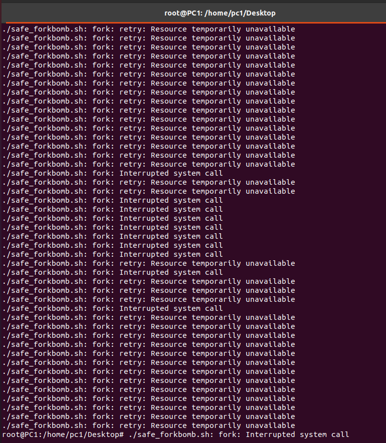
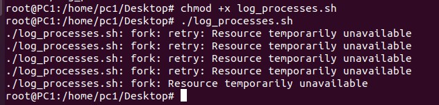
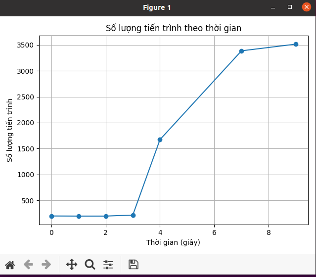

## ⚠️ Cảnh báo:

**Chỉ thực hiện trong môi trường ảo hoá có giới hạn tài nguyên. Không chạy trên máy thật!**

---

## Mục tiêu lab:

1. **Viết fork bomb đơn giản** cho Linux và Windows.
2. **Theo dõi và vẽ biểu đồ số tiến trình theo thời gian**.
3. **Phân tích phản ứng của hệ điều hành (OС)**.

---

## 1. Viết Fork Bomb

### Linux – Fork Bomb bằng Bash (dạng đơn giản, có kiểm soát):

Tạo file `safe_forkbomb.sh`:

```bash
#!/bin/bash
limit=50  # giới hạn số lần fork để tránh sập máy
counter=0

forkbomb() {
    ((counter++))
    if [ "$counter" -lt "$limit" ]; then
        forkbomb & forkbomb &
    else
        sleep 60  # giữ tiến trình để quan sát
    fi
}

forkbomb
```

Chương trình trên là một **phiên bản an toàn của fork bomb** viết bằng Bash, có **giới hạn số lần fork** để tránh làm sập hệ thống.

---

### Giải thích

```bash
#!/bin/bash
```

* Khai báo đây là một script Bash.

---

```bash
limit=50  # giới hạn số lần fork để tránh sập máy
counter=0
```

* Biến `limit`: số lần tối đa được phép gọi đệ quy (tức là tạo tiến trình con).
* Biến `counter`: đếm số lần gọi hàm `forkbomb`.

---

```bash
forkbomb() {
    ((counter++))
```

* Định nghĩa hàm `forkbomb`.
* Mỗi lần hàm được gọi, biến `counter` tăng thêm 1.

---

```bash
    if [ "$counter" -lt "$limit" ]; then
        forkbomb & forkbomb &
```

* Nếu số lần gọi nhỏ hơn giới hạn (`limit = 50`):

  * Hàm sẽ tự gọi lại **2 lần** trong **nền** (dùng `&`).
  * Tức là tạo ra **2 tiến trình con** mới từ mỗi lần gọi.

→ Hiệu ứng là **tăng số tiến trình theo cấp số nhân** (giống fork bomb thật), **nhưng có kiểm soát**.

---

```bash
    else
        sleep 60  # giữ tiến trình để quan sát
    fi
```

* Khi đã đến giới hạn (50 lần), các tiến trình sẽ **dừng đệ quy** và ngủ 60 giây.
* Việc này giúp bạn quan sát chúng bằng lệnh như `ps`, `top`, v.v.

---

```bash
forkbomb
```

* Gọi hàm lần đầu để bắt đầu quá trình fork.

---

### **Lưu ý**

* **Đây không phải là fork bomb thực sự nguy hiểm** vì có giới hạn (`limit=50`).
* Fork bomb thật sẽ không có giới hạn và sẽ khiến hệ thống **hết PID/process**, dẫn đến treo máy.

---
### Linux: Sử dụng script ghi log:

```bash
#!/bin/bash
> process_log.txt
for i in {1..60}; do
    echo "$(date +%s) $(ps -e | wc -l)" >> process_log.txt
    sleep 1
done
```
Đoạn script Bash này có nhiệm vụ **ghi lại số lượng tiến trình đang chạy trong hệ thống mỗi giây** trong vòng **60 giây**.

---

### **Giải thích**

```bash
> process_log.txt
```

* Xóa nội dung cũ (nếu có) của file `process_log.txt` bằng cách ghi đè một dòng rỗng.
* Nếu file chưa tồn tại, nó sẽ được tạo.

---

```bash
for i in {1..60}; do
```

* Vòng lặp `for` chạy **60 lần**, tương ứng với **60 giây**.

---

```bash
    echo "$(date +%s) $(ps -e | wc -l)" >> process_log.txt
```

* `date +%s`: lấy **timestamp hiện tại** (số giây từ 01/01/1970).
* `ps -e`: liệt kê tất cả các tiến trình hiện tại.
* `wc -l`: đếm số dòng, tức là **số tiến trình hiện có**.
* Kết quả ví dụ: `1719150000 378` → vào thời điểm đó, có 378 tiến trình.
* Dữ liệu được **ghi vào cuối** file `process_log.txt`.

---

```bash
    sleep 1
done
```

* Dừng 1 giây trước khi lặp lại → ghi log **mỗi giây**.

---

### Thực thi:

Cấp quyền:

```bash
chmod +x safe_forkbomb.sh
```
> Dừng bằng: `killall bash` hoặc `pkill -f safe_forkbomb.sh`

```bash
chmod +x log_processes.sh
```

Chúng ta tiến hành chạy song song 2 chương trình

```bash
./safe_forkbomb.sh
./log_processes.sh
```





---

### Vẽ biểu đồ tiến trình:

```python
import matplotlib.pyplot as plt

# Đọc dữ liệu từ file
timestamps = []
process_counts = []

with open("process_log.txt", "r") as f:
    for line in f:
        ts, count = line.strip().split()
        timestamps.append(int(ts))
        process_counts.append(int(count))

# Chuyển timestamp về dạng thời gian tương đối (giây từ thời điểm đầu tiên)
t0 = timestamps[0]
relative_time = [t - t0 for t in timestamps]

# Vẽ đồ thị
plt.plot(relative_time, process_counts, marker='o')
plt.title("Số lượng tiến trình theo thời gian")
plt.xlabel("Thời gian (giây)")
plt.ylabel("Số lượng tiến trình")
plt.grid(True)
plt.tight_layout()
plt.show()
```

---


**Nhận xét về biểu đồ "Số lượng tiến trình theo thời gian":**

---

### **Phân tích diễn biến**

* **Từ giây 0 đến \~3 giây:**
  Số lượng tiến trình ổn định quanh mức **200** → Hệ thống đang ở trạng thái bình thường, chưa có tác động mạnh từ fork bomb.

* **Từ giây 3 đến giây 4:**
  Số tiến trình tăng **vọt** từ khoảng **\~200 lên \~1600** → Đây là thời điểm **fork bomb bắt đầu lan rộng**, tiến trình tự nhân bản song song (fork & fork).

* **Từ giây 4 đến giây 8:**
  Số tiến trình tiếp tục tăng nhanh:

  * Giây 6: \~3400
  * Giây 8: \~3500
    → Hệ thống bị **ngập lệnh fork**, nhưng tốc độ tăng bắt đầu chậm lại do:
  * Đã gần chạm giới hạn `limit=50`
  * Hệ thống bắt đầu phản ứng bằng cách **chặn fork** hoặc tiến trình cạn tài nguyên (PID, RAM).

---

### **Kết luận**

* **Hiệu ứng fork bomb rõ rệt và nguy hiểm**:

  * Số tiến trình tăng cấp số nhân trong vài giây.
  * Nếu không có giới hạn, hệ thống sẽ **đóng băng hoàn toàn**.

---


### Windows – Fork Bomb bằng Python:

Tạo file `safe_forkbomb_win.py`:

```python
import multiprocessing
import time

def bomb():
    while True:
        time.sleep(60)

if __name__ == '__main__':
    processes = []
    for _ in range(50):  # giới hạn tiến trình để không làm sập Windows
        p = multiprocessing.Process(target=bomb)
        p.start()
        processes.append(p)
```

Chạy bằng:

```bash
python safe_forkbomb_win.py
```

---

## 2. Ghi lại và vẽ biểu đồ số tiến trình


Sau đó vẽ bằng Python:

```python
import matplotlib.pyplot as plt

times, processes = [], []
with open('process_log.txt') as f:
    for line in f:
        t, p = line.strip().split()
        times.append(int(t))
        processes.append(int(p))

plt.plot(times, processes)
plt.xlabel('Unix Time')
plt.ylabel('Number of Processes')
plt.title('Process Count Over Time')
plt.grid()
plt.show()
```

---

## 🧠 3. Phân tích phản ứng của hệ điều hành

**Ghi chú trong báo cáo:**

* **Giai đoạn đầu**: hệ thống cho phép tạo tiến trình mới.
* **Khi gần đến giới hạn** (Linux mặc định `ulimit -u` \~4096): người dùng không thể mở terminal, GUI treo.
* **Hệ thống có thể giết tiến trình** bằng `OOM Killer` (Linux).
* **Windows** thường chậm dần, và hiển thị lỗi "Không thể tạo tiến trình mới".

---


