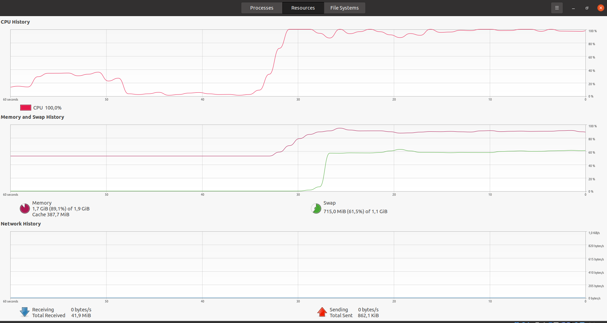
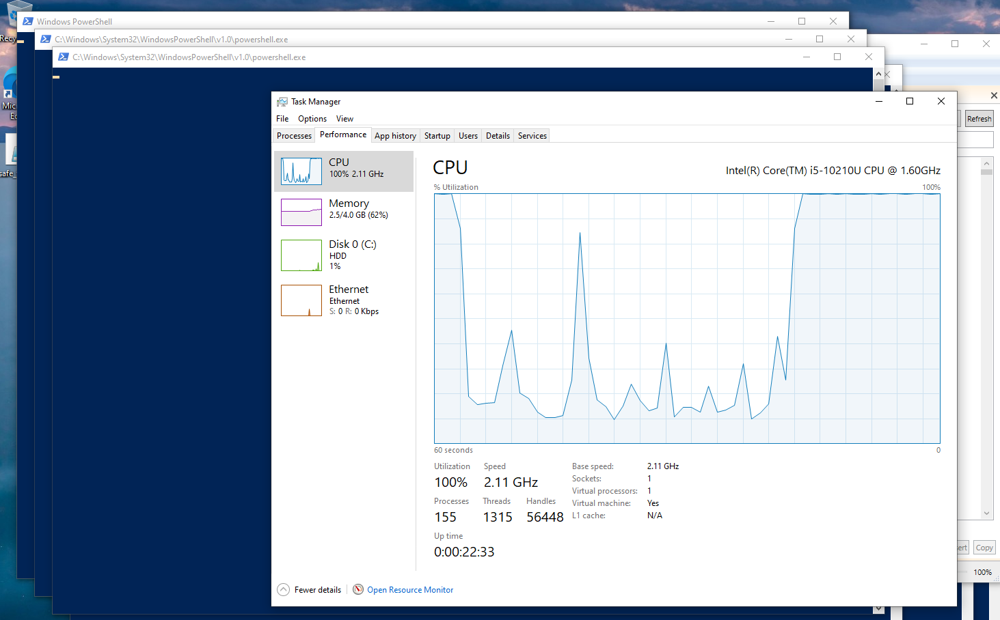
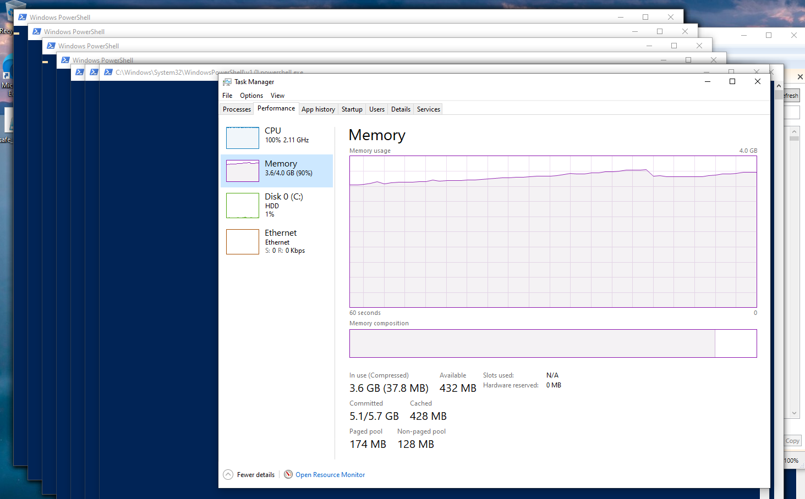
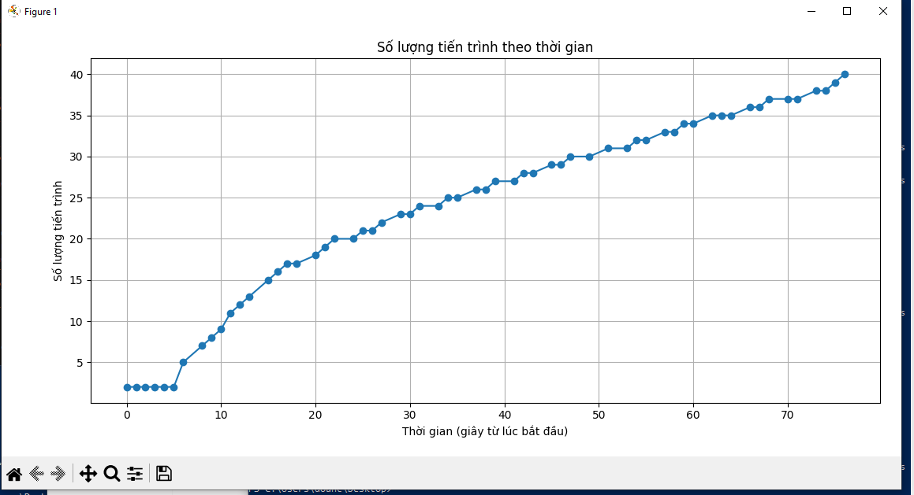

## ⚠️ Cảnh báo:

**Chỉ thực hiện trong môi trường ảo hoá có giới hạn tài nguyên. Không chạy trên máy thật!**

---

## Mục tiêu lab:

1. **Viết fork bomb đơn giản** cho Linux và Windows.
2. **Theo dõi và vẽ biểu đồ số tiến trình theo thời gian**.
3. **Phân tích phản ứng của hệ điều hành (OS)**.

---

## 1. Linux 

>Fork Bomb bằng Bash (dạng đơn giản, có kiểm soát):

Tạo file `safe_forkbomb.sh`:

```bash
#!/bin/bash
limit=50  # giới hạn số lần fork để tránh sập máy
counter=0

forkbomb() {
    ((counter++))
    if [ "$counter" -lt "$limit" ]; then
        forkbomb & forkbomb &
    else
        sleep 60  # giữ tiến trình để quan sát
    fi
}

forkbomb
```

Chương trình trên là một **phiên bản an toàn của fork bomb** viết bằng Bash, có **giới hạn số lần fork** để tránh làm sập hệ thống.

---

### Giải thích

```bash
#!/bin/bash
```

* Khai báo đây là một script Bash.

---

```bash
limit=50  # giới hạn số lần fork để tránh sập máy
counter=0
```

* Biến `limit`: số lần tối đa được phép gọi đệ quy (tức là tạo tiến trình con).
* Biến `counter`: đếm số lần gọi hàm `forkbomb`.

---

```bash
forkbomb() {
    ((counter++))
```

* Định nghĩa hàm `forkbomb`.
* Mỗi lần hàm được gọi, biến `counter` tăng thêm 1.

---

```bash
    if [ "$counter" -lt "$limit" ]; then
        forkbomb & forkbomb &
```

* Nếu số lần gọi nhỏ hơn giới hạn (`limit = 50`):

  * Hàm sẽ tự gọi lại **2 lần** trong **nền** (dùng `&`).
  * Tức là tạo ra **2 tiến trình con** mới từ mỗi lần gọi.

→ Hiệu ứng là **tăng số tiến trình theo cấp số nhân** (giống fork bomb thật), **nhưng có kiểm soát**.

---

```bash
    else
        sleep 60  # giữ tiến trình để quan sát
    fi
```

* Khi đã đến giới hạn (50 lần), các tiến trình sẽ **dừng đệ quy** và ngủ 60 giây.
* Việc này giúp bạn quan sát chúng bằng lệnh như `ps`, `top`, v.v.

---

```bash
forkbomb
```

* Gọi hàm lần đầu để bắt đầu quá trình fork.

---

>**Lưu ý**

* **Đây không phải là fork bomb thực sự nguy hiểm** vì có giới hạn (`limit=50`).
* Fork bomb thật sẽ không có giới hạn và sẽ khiến hệ thống **hết PID/process**, dẫn đến treo máy.

---
### Sử dụng script ghi log:

```bash
#!/bin/bash
> process_log.txt
for i in {1..60}; do
    echo "$(date +%s) $(ps -e | wc -l)" >> process_log.txt
    sleep 1
done
```
Đoạn script Bash này có nhiệm vụ **ghi lại số lượng tiến trình đang chạy trong hệ thống mỗi giây** trong vòng **60 giây**.

---

### **Giải thích**

```bash
> process_log.txt
```

* Xóa nội dung cũ (nếu có) của file `process_log.txt` bằng cách ghi đè một dòng rỗng.
* Nếu file chưa tồn tại, nó sẽ được tạo.

---

```bash
for i in {1..60}; do
```

* Vòng lặp `for` chạy **60 lần**, tương ứng với **60 giây**.

---

```bash
    echo "$(date +%s) $(ps -e | wc -l)" >> process_log.txt
```

* `date +%s`: lấy **timestamp hiện tại** (số giây từ 01/01/1970).
* `ps -e`: liệt kê tất cả các tiến trình hiện tại.
* `wc -l`: đếm số dòng, tức là **số tiến trình hiện có**.
* Kết quả ví dụ: `1719150000 378` → vào thời điểm đó, có 378 tiến trình.
* Dữ liệu được **ghi vào cuối** file `process_log.txt`.

---

```bash
    sleep 1
done
```

* Dừng 1 giây trước khi lặp lại → ghi log **mỗi giây**.

---

### Thực thi:

Cấp quyền:

```bash
chmod +x safe_forkbomb.sh
```
> Dừng bằng: `killall bash` hoặc `pkill -f safe_forkbomb.sh`

```bash
chmod +x log_processes.sh
```

Chúng ta tiến hành chạy song song 2 chương trình

```bash
./safe_forkbomb.sh
./log_processes.sh
```


---

### Vẽ biểu đồ tiến trình:

```python
import matplotlib.pyplot as plt

# Đọc dữ liệu từ file
timestamps = []
process_counts = []

with open("process_log.txt", "r") as f:
    for line in f:
        ts, count = line.strip().split()
        timestamps.append(int(ts))
        process_counts.append(int(count))

# Chuyển timestamp về dạng thời gian tương đối (giây từ thời điểm đầu tiên)
t0 = timestamps[0]
relative_time = [t - t0 for t in timestamps]

# Vẽ đồ thị
plt.plot(relative_time, process_counts, marker='o')
plt.title("Số lượng tiến trình theo thời gian")
plt.xlabel("Thời gian (giây)")
plt.ylabel("Số lượng tiến trình")
plt.grid(True)
plt.tight_layout()
plt.show()
```

---


### **Nhận xét về biểu đồ "Số lượng tiến trình theo thời gian":**

* **Từ giây 0 đến \~3 giây:**
  Số lượng tiến trình ổn định quanh mức **200** → Hệ thống đang ở trạng thái bình thường, chưa có tác động mạnh từ fork bomb.

* **Từ giây 3 đến giây 4:**
  Số tiến trình tăng **vọt** từ khoảng **\~200 lên \~1600** → Đây là thời điểm **fork bomb bắt đầu lan rộng**, tiến trình tự nhân bản song song (fork & fork).

* **Từ giây 4 đến giây 8:**
  Số tiến trình tiếp tục tăng nhanh:

  * Giây 6: \~3400
  * Giây 8: \~3500
    → Hệ thống bị **ngập lệnh fork**, nhưng tốc độ tăng bắt đầu chậm lại do:
  * Đã gần chạm giới hạn `limit=50`
  * Hệ thống bắt đầu phản ứng bằng cách **chặn fork** hoặc tiến trình cạn tài nguyên (PID, RAM).

---

> **Kết luận**

* **Hiệu ứng fork bomb rõ rệt và nguy hiểm**:

  * Số tiến trình tăng cấp số nhân trong vài giây.
  * Nếu không có giới hạn, hệ thống sẽ **đóng băng hoàn toàn**.

---



## 2. Windows 

---

### 1. Fork Bomb Script (nguy hiểm)

Tên file: **`fork_bomb.ps1`**

```powershell
:fork
Start-Process -FilePath "powershell.exe" -ArgumentList "-NoLogo", "-NoProfile", "-Command & { . $MyInvocation.MyCommand.Path }"
goto fork
```

---

### 2. Fork Bomb Giới Hạn (phiên bản an toàn để test)

Tên file: **`safe_fork_bomb.ps1`**

```powershell
$max = 50
$count = 0

while ($count -lt $max) {
    Start-Process -FilePath "powershell.exe" -ArgumentList "-NoLogo", "-NoProfile", "-Command & { . $MyInvocation.MyCommand.Path }"
    $count++
    Start-Sleep -Milliseconds 300
}
```

---

### 3. Process Monitor Script

Tên file: **`monitor_process_count.ps1`**

```powershell
$duration = 60  # theo dõi trong 60 giây
$interval = 1

$times = @()
$counts = @()

for ($i = 0; $i -lt $duration; $i += $interval) {
    $now = Get-Date -Format "HH:mm:ss"
    $count = (Get-Process -Name "powershell" -ErrorAction SilentlyContinue).Count
    $times += $now
    $counts += $count
    Write-Host "${now}: $count"
    Start-Sleep -Seconds $interval
}

# Tạo dữ liệu kết quả
$results = for ($i = 0; $i -lt $times.Count; $i++) {
    [PSCustomObject]@{
        Time = $times[$i]
        Count = $counts[$i]
    }
}

# Lấy đường dẫn Desktop
$desktopPath = [Environment]::GetFolderPath("Desktop")
$csvPath = Join-Path $desktopPath "process_monitor.csv"

# Xuất file CSV lên Desktop
$results | Export-Csv -Path $csvPath -NoTypeInformation

Write-Host "`n File CSV đã được lưu tại: $csvPath"

```

---

**Lưu ý khi sử dụng:**

* Đặt các file `.ps1` vào thư mục riêng để quản lý.
* Khi chạy script fork bomb, nên dùng `safe_fork_bomb.ps1` để tránh treo máy.
* Khi theo dõi bằng `monitor_process_count.ps1`, **chạy trước hoặc đồng thời** với fork để có dữ liệu đầy đủ.


### Chạy forkbomb


- Mở PowerShell với quyền admin

- Cấp quyền:

```bash
Set-ExecutionPolicy RemoteSigned -Scope CurrentUser
```

- Chạy:

```bash
.\monitor_process_count.ps1
```

```bash
.\safe_fork_bomb.ps1
```

- Kết quả:


- CPU:



- Memory:



- Biểu đồ:



---

**Phân tích biểu đồ:**

1. **Trục X (thời gian – giây từ lúc bắt đầu)**:

* Ghi lại các mốc thời gian theo từng giây (0 → 75 giây).
* Đây là kết quả từ việc chạy script `monitor_process_count.ps1`.

2. **Trục Y (số lượng tiến trình)**:

* Số tiến trình PowerShell đang tồn tại tại mỗi thời điểm.
* Bắt đầu từ 2–3 tiến trình, sau đó tăng dần đều.

---

**Nhận xét chi tiết:**

| Giai đoạn                              | Mô tả                                                                                                            |
| -------------------------------------- | ---------------------------------------------------------------------------------------------------------------- |
| **0–5s**                               | Số tiến trình gần như không đổi (\~3), cho thấy hệ thống đang ổn định hoặc fork bomb chưa bắt đầu                |
| **5–15s**                              | Số tiến trình bắt đầu tăng rất nhanh → dấu hiệu rõ ràng fork bomb hoặc chương trình sinh tiến trình đã khởi động |
| **15–75s**                             | Tăng tuyến tính → quá trình nhân bản tiến trình đang diễn ra đều đặn (ví dụ mỗi 1–2 tiến trình mới/giây)         |
| **Không có giai đoạn chững hoặc giảm** | Chứng tỏ OS vẫn đang chịu được, chưa chặn tạo process                                                            |

---


