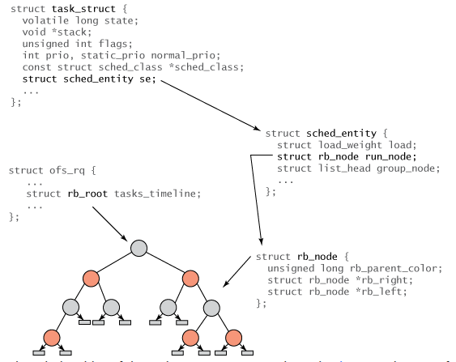

# Inside the Linux 2.6 Completely Fair Scheduler

[Bài viết gốc](https://developer.ibm.com/tutorials/l-completely-fair-scheduler/)

Bộ lập lịch của Linux là một nghiên cứu thú vị về sự cạnh tranh giữa các áp lực. Một mặt là các mô hình sử dụng mà Linux được áp dụng. Mặc dù ban đầu Linux được phát triển như một hệ điều hành máy tính để bàn thử nghiệm, ngày nay bạn có thể thấy nó trên các máy chủ, thiết bị nhúng nhỏ, máy tính lớn (mainframe) và siêu máy tính. Không có gì ngạc nhiên khi tải công việc lập lịch cho các lĩnh vực này khác nhau. Mặt khác là các tiến bộ công nghệ trong nền tảng, bao gồm kiến trúc (đa xử lý, siêu phân luồng đối xứng, truy cập bộ nhớ không đồng nhất \[NUMA]) và ảo hóa. Ngoài ra còn có sự cân bằng giữa tính tương tác (phản hồi của người dùng) và tính công bằng tổng thể. Từ góc nhìn này, có thể thấy rõ vấn đề lập lịch trong Linux khó khăn đến mức nào.

---

## 1. **Lược sử ngắn về các bộ lập lịch của Linux**

Các bộ lập lịch Linux thời kỳ đầu sử dụng thiết kế tối giản, rõ ràng là chưa tập trung vào các kiến trúc quy mô lớn với nhiều bộ xử lý hoặc thậm chí là siêu phân luồng. Bộ lập lịch Linux 1.2 sử dụng hàng đợi vòng tròn (circular queue) để quản lý các tác vụ có thể thực thi, hoạt động theo chính sách lập lịch vòng luân phiên (round-robin). Bộ lập lịch này hiệu quả trong việc thêm và xóa tiến trình (có cơ chế khóa để bảo vệ cấu trúc). Tóm lại, bộ lập lịch này không phức tạp nhưng đơn giản và nhanh.

Linux phiên bản 2.2 đã giới thiệu khái niệm *lớp lập lịch* (scheduling classes), cho phép áp dụng các chính sách lập lịch khác nhau cho các tác vụ thời gian thực, tác vụ không thể gián đoạn, và các tác vụ không yêu cầu thời gian thực. Bộ lập lịch 2.2 cũng hỗ trợ xử lý đối xứng đa xử lý (SMP - Symmetric Multiprocessing).

Nhân Linux 2.4 bao gồm một bộ lập lịch khá đơn giản hoạt động trong thời gian O(N) (do phải duyệt qua mọi tác vụ trong mỗi sự kiện lập lịch). Bộ lập lịch 2.4 chia thời gian thành các *epoch* (thời kỳ), và trong mỗi epoch, mọi tác vụ được phép sử dụng phần thời gian của mình. Nếu một tác vụ không dùng hết thời gian, thì một nửa thời gian còn lại sẽ được cộng thêm vào thời gian mới để nó có thể thực thi lâu hơn trong epoch tiếp theo. Bộ lập lịch này sẽ lặp qua các tác vụ, áp dụng một hàm đánh giá (goodness function) để xác định tác vụ nào sẽ được thực thi tiếp theo. Mặc dù phương pháp này khá đơn giản, nhưng lại thiếu hiệu quả, không mở rộng tốt, và yếu khi xử lý các hệ thống thời gian thực. Nó cũng thiếu các tính năng để khai thác kiến trúc phần cứng mới như bộ xử lý đa nhân.


Bộ lập lịch đầu tiên của Linux 2.6, được gọi là **bộ lập lịch O(1)**, được thiết kế để giải quyết nhiều vấn đề của bộ lập lịch 2.4 — cụ thể là, bộ lập lịch không cần phải duyệt toàn bộ danh sách tác vụ để xác định tác vụ tiếp theo cần lập lịch (do đó có tên gọi **O(1)**, tức là thời gian thực hiện không phụ thuộc vào số lượng tác vụ), điều này giúp nó hiệu quả hơn nhiều và dễ mở rộng hơn.

Bộ lập lịch O(1) theo dõi các tác vụ có thể thực thi trong một hàng đợi (thực tế là **hai hàng đợi** cho mỗi mức độ ưu tiên — một cho các tác vụ đang hoạt động và một cho các tác vụ đã hết hạn), điều đó có nghĩa là để xác định tác vụ cần thực thi tiếp theo, bộ lập lịch chỉ cần lấy tác vụ tiếp theo từ hàng đợi đang hoạt động tương ứng với mức ưu tiên.

Bộ lập lịch O(1) mở rộng hơn nhiều và tích hợp các chỉ số về tính tương tác với nhiều heuristic (phép suy đoán) để xác định liệu một tác vụ là bị ràng buộc bởi I/O hay CPU. Tuy nhiên, bộ lập lịch O(1) dần trở nên cồng kềnh trong nhân hệ điều hành. Một lượng lớn mã nguồn cần thiết để tính toán các heuristic khiến nó trở nên khó quản lý, và đối với những người theo chủ nghĩa thuần túy, thì nó thiếu tính chặt chẽ về mặt thuật toán.

Trước những vấn đề mà bộ lập lịch O(1) gặp phải cùng với các áp lực từ bên ngoài, một sự thay đổi là điều cần thiết. Sự thay đổi đó đến từ một bản vá nhân (kernel patch) do **Con Kolivas** phát triển, với bộ lập lịch **Rotating Staircase Deadline Scheduler (RSDL)**, bao gồm cả công trình trước đó của ông về **staircase scheduler**.

Kết quả của công trình này là một bộ lập lịch được thiết kế đơn giản, kết hợp sự **công bằng với độ trễ có giới hạn**. Bộ lập lịch của Kolivas gây ấn tượng mạnh (với nhiều lời kêu gọi tích hợp nó vào nhân chính 2.6.21), điều này cho thấy rõ rằng một sự thay đổi về bộ lập lịch đang đến gần.

**Ingo Molnar**, tác giả của bộ lập lịch O(1), sau đó đã phát triển **CFS (Completely Fair Scheduler)** dựa trên một số ý tưởng từ công trình của Kolivas. Hãy cùng khám phá CFS để xem cách nó hoạt động ở mức độ khái quát.


---

## 2. **Tổng quan về CFS**

Ý tưởng chính của **CFS (Completely Fair Scheduler)** là **duy trì sự cân bằng (công bằng)** trong việc phân phối thời gian xử lý của CPU cho các tác vụ. Điều này có nghĩa là các tiến trình cần được cấp một lượng thời gian xử lý công bằng trên bộ xử lý.

Khi thời gian thực thi giữa các tác vụ trở nên mất cân bằng (nghĩa là một hoặc nhiều tác vụ không được cấp đủ thời gian so với các tác vụ khác), thì những tác vụ bị "thiệt thòi" đó sẽ được ưu tiên cấp thời gian để thực thi.

Để xác định sự cân bằng, **CFS duy trì lượng thời gian mà một tác vụ đã được cấp quyền truy cập CPU**, gọi là **virtual runtime (thời gian chạy ảo)**. Thời gian chạy ảo của một tác vụ càng nhỏ (tức là nó càng ít được cấp thời gian CPU), thì **nhu cầu được xử lý càng cao**. CFS cũng đưa ra khái niệm **sleeper fairness** (công bằng cho tác vụ "ngủ") để đảm bảo rằng các tác vụ hiện chưa có khả năng thực thi (ví dụ đang chờ I/O) sẽ nhận được phần CPU công bằng khi chúng sẵn sàng chạy trở lại.

Tuy nhiên, thay vì duy trì các tác vụ trong một hàng đợi như các bộ lập lịch Linux trước đó, **CFS sử dụng một cây đỏ-đen (red-black tree) có thứ tự theo thời gian** (xem Hình 1). Một **cây đỏ-đen** là một loại cây với một vài đặc tính thú vị và hữu ích. Đầu tiên, nó là cây **tự cân bằng**, nghĩa là độ dài bất kỳ đường đi nào trong cây cũng không lớn hơn gấp đôi độ dài đường đi ngắn nhất. Thứ hai, các thao tác trên cây xảy ra trong thời gian **O(log n)** (với *n* là số node trong cây), điều này có nghĩa là bạn có thể chèn hoặc xóa một tác vụ một cách nhanh chóng và hiệu quả.

---

**Hình 1. Ví dụ về cây đỏ-đen**


Hình trên là minh họa **cây đỏ-đen (red-black tree)** trong bộ lập lịch **CFS (Completely Fair Scheduler)** của Linux, dùng để quản lý các tác vụ đang chờ CPU. Dưới đây là phần giải thích chi tiết:

**Giải thích các thành phần trong hình**

* **Các nút (node)**: Đại diện cho các `sched_entity`, tức là các thực thể lập lịch (thường là tiến trình hoặc luồng).

* **Giá trị trong mỗi nút**: Là **virtual runtime** – thời gian chạy ảo của tiến trình. Đây là thước đo mức độ công bằng:

  * **Virtual runtime càng nhỏ → tiến trình càng ít được CPU phục vụ → cần được cấp CPU sớm.**
  * **Virtual runtime càng lớn → tiến trình đã được phục vụ nhiều hơn → ít ưu tiên hơn.**

* **Các nút màu đỏ / xám**: Màu sắc thể hiện quy tắc cân bằng trong cây đỏ-đen (không quá quan trọng để hiểu logic lập lịch ở đây, mà chủ yếu dùng để cân bằng cây).

* **NIL**: Đại diện cho các nút rỗng (null), đặc trưng của cây nhị phân.

 **Cách CFS chọn tiến trình để chạy**

* **Duyệt cây theo thứ tự virtual runtime tăng dần** (bên trái → phải).
* **Chọn tiến trình có virtual runtime nhỏ nhất** → tức là node **trái nhất** của cây.
* Trong hình trên, **nút “2” là tiến trình có nhu cầu CPU cao nhất**, vì nó có virtual runtime nhỏ nhất.

---

Với các tác vụ (được đại diện bởi các đối tượng `sched_entity`) được lưu trữ trong **cây đỏ-đen có thứ tự theo thời gian**, các tác vụ **có nhu cầu CPU lớn nhất** (tức là có **virtual runtime thấp nhất**) sẽ được đặt về phía bên **trái** của cây, còn các tác vụ **ít cần CPU nhất** (có **virtual runtime cao nhất**) sẽ nằm ở phía **phải** của cây.

Để đảm bảo tính công bằng, bộ lập lịch sẽ chọn **nút ngoài cùng bên trái** của cây đỏ-đen để lập lịch thực thi tiếp theo. Sau khi tiến trình được cấp CPU, nó sẽ **cộng thêm thời gian thực thi vào virtual runtime** và nếu vẫn còn runnable, nó sẽ được **chèn lại vào cây**.

Nhờ cách này, **các tiến trình bên trái được ưu tiên thực thi**, và các tiến trình trong cây sẽ **dần dịch chuyển từ phải sang trái** để duy trì sự công bằng. Vì vậy, **mỗi tác vụ có thể thực thi sẽ “đuổi theo” các tác vụ khác** để giữ cho tổng thể tiến trình luôn được phân phối CPU một cách cân bằng.


## 3. Cấu trúc bên trong của CFS

Tất cả các tác vụ trong Linux đều được đại diện bằng một cấu trúc gọi là `task_struct`. Cấu trúc này (cùng với các cấu trúc liên quan khác) mô tả đầy đủ về tác vụ, bao gồm trạng thái hiện tại, ngăn xếp (stack), cờ tiến trình, mức độ ưu tiên (cả tĩnh và động), và nhiều thông tin khác. Bạn có thể tìm thấy cấu trúc này và nhiều cấu trúc liên quan trong file `./linux/include/linux/sched.h`.

Tuy nhiên, vì **không phải tất cả tác vụ đều có thể thực thi ngay (runnable)**, nên bạn sẽ **không thấy các trường liên quan đến CFS trong `task_struct`**. Thay vào đó, một cấu trúc mới gọi là **`sched_entity`** được tạo ra để lưu trữ thông tin lập lịch (xem Hình 2).

---

**Hình 2. Cấu trúc phân cấp giữa các tác vụ và cây đỏ-đen**




Mối quan hệ giữa các cấu trúc khác nhau được thể hiện trong **Hình 2**. Gốc của cây được tham chiếu thông qua phần tử `rb_root` từ cấu trúc `cfs_rq` (trong `./kernel/sched.c`). Lá của cây đỏ-đen không chứa thông tin, nhưng các **nút bên trong** đại diện cho một hoặc nhiều tác vụ có thể thực thi. Mỗi nút trong cây đỏ-đen được đại diện bởi một `rb_node`, bao gồm các tham chiếu đến nút con và màu của nút cha.

`rb_node` được chứa trong cấu trúc `sched_entity`, trong đó bao gồm tham chiếu đến `rb_node`, thông tin về tải (load weight) và nhiều dữ liệu thống kê khác. Quan trọng nhất, `sched_entity` chứa **`vruntime` (trường 64-bit)**, là **thời gian chạy ảo của tác vụ** và được dùng làm chỉ số cho cây đỏ-đen. Cuối cùng, `task_struct` là cấu trúc cấp cao nhất, mô tả đầy đủ về một tác vụ và bao gồm cả cấu trúc `sched_entity`.

Chức năng lập lịch của phần CFS khá đơn giản. Trong `./kernel/sched.c`, bạn sẽ thấy hàm **`schedule()`** dùng để **tạm ngắt (preempt)** tác vụ hiện tại (trừ khi nó tự tạm ngắt bằng `yield()`). Cần lưu ý rằng **CFS không có khái niệm thời gian chia lát (time slices)** như các bộ lập lịch truyền thống, vì thời gian tạm ngắt là biến đổi.

Tác vụ hiện tại (sau khi bị ngắt) sẽ được đưa trở lại cây đỏ-đen thông qua lời gọi `put_prev_task` (thông qua lớp lập lịch). Khi hàm `schedule` cần xác định tác vụ tiếp theo để lập lịch, nó sẽ gọi hàm **`pick_next_task`**. Đây là một hàm tổng quát (trong `./kernel/sched.c`), nhưng nó sẽ gọi bộ lập lịch CFS thông qua lớp lập lịch.

Hàm `pick_next_task` trong CFS nằm trong `./kernel/sched_fair.c` (có tên là **`pick_next_task_fair()`**). Hàm này **chọn tác vụ ngoài cùng bên trái** từ cây đỏ-đen và trả về cấu trúc `sched_entity` tương ứng. Với tham chiếu này, một lời gọi đơn giản đến `task_of()` sẽ xác định **con trỏ `task_struct`** tương ứng được trả về. Cuối cùng, bộ lập lịch tổng quát sẽ cấp CPU cho tác vụ này.

---

### 4. Mức ưu tiên và CFS

**CFS không sử dụng mức ưu tiên một cách trực tiếp**, mà thay vào đó dùng chúng như **hệ số suy giảm** cho khoảng thời gian mà một tác vụ được phép thực thi. **Tác vụ có mức ưu tiên thấp** sẽ có hệ số suy giảm cao hơn, trong khi **tác vụ có mức ưu tiên cao** sẽ có hệ số suy giảm thấp hơn.

Điều này có nghĩa là **thời gian mà một tác vụ được phép thực thi sẽ “tiêu hao” nhanh hơn đối với các tác vụ ưu tiên thấp**, so với các tác vụ ưu tiên cao. Đây là một giải pháp thông minh để tránh việc phải duy trì các hàng đợi tác vụ riêng cho từng mức ưu tiên.

---

### 5. Lập lịch theo nhóm trong CFS

Một khía cạnh thú vị khác của CFS là khái niệm **lập lịch theo nhóm (group scheduling)** (được giới thiệu từ nhân Linux 2.6.24). Lập lịch theo nhóm là một cách khác để đảm bảo công bằng trong lập lịch, đặc biệt trong trường hợp có những tác vụ sinh ra nhiều tác vụ con.

Hãy xem xét một máy chủ tạo ra nhiều tác vụ để xử lý song song các kết nối đến (một kiến trúc phổ biến trong máy chủ HTTP). Thay vì xử lý tất cả các tác vụ một cách đồng đều, **CFS giới thiệu khái niệm nhóm để điều chỉnh hành vi này**.

Tiến trình máy chủ tạo ra các tác vụ sẽ **chia sẻ virtual runtime giữa các tác vụ trong cùng một nhóm** (theo cấu trúc phân cấp), trong khi **một tác vụ đơn lẻ sẽ giữ thời gian chạy ảo riêng biệt của nó**. Nhờ đó, tác vụ đơn lẻ sẽ nhận được thời gian lập lịch xấp xỉ bằng với một nhóm các tác vụ.

Bạn có thể tìm thấy giao diện `/proc` để quản lý **cấu trúc phân cấp tiến trình**, cho phép bạn kiểm soát đầy đủ cách các nhóm được hình thành. Với cấu hình này, bạn có thể thiết lập công bằng theo **người dùng**, theo **tiến trình**, hoặc **kết hợp cả hai**.

---

### 6. Lớp và miền lập lịch (Scheduling classes and domains)

Cùng với CFS, khái niệm **lớp lập lịch (scheduling class)** cũng được giới thiệu (xem lại **Hình 2**). Mỗi tác vụ sẽ thuộc về một **lớp lập lịch**, lớp này xác định cách tác vụ sẽ được lập lịch.

Một lớp lập lịch định nghĩa **tập hợp các hàm chung** (thông qua `sched_class`) mô tả hành vi của bộ lập lịch. Ví dụ, mỗi bộ lập lịch sẽ có hàm để:

* thêm một tác vụ vào danh sách lập lịch,
* lấy ra tác vụ tiếp theo để thực thi,
* nhường quyền điều khiển cho bộ lập lịch, v.v.

Các lớp lập lịch được **liên kết với nhau bằng danh sách liên kết đơn**, cho phép các lớp này được duyệt qua tuần tự (ví dụ, để kích hoạt hoặc vô hiệu hóa trên một bộ xử lý cụ thể).

**Cấu trúc tổng thể được minh họa trong Hình 3**. Lưu ý rằng **các hàm enqueue và dequeue** sẽ chỉ đơn giản là thêm hoặc xóa tác vụ ra khỏi các cấu trúc lập lịch tương ứng.

Hàm **`pick_next_task`** sẽ chọn tác vụ tiếp theo để thực thi (dựa vào chính sách cụ thể của lớp lập lịch mà tác vụ đó thuộc về).

---

**Hình 3. Sơ đồ minh họa các lớp lập lịch**


---

Tuy nhiên, hãy nhớ rằng **các lớp lập lịch (scheduling classes)** là một phần của chính cấu trúc tác vụ (task struct) (xem **Hình 2**). Điều này giúp đơn giản hóa các thao tác với tác vụ, **bất kể chúng thuộc lớp lập lịch nào**. Ví dụ, hàm sau đây **tạm ngắt (preempt)** tác vụ hiện tại bằng một tác vụ mới (trong đó `curr` là tác vụ hiện tại, `rq` là cây đỏ-đen đại diện cho CFS, và `p` là tác vụ tiếp theo được lập lịch) từ file `./kernel/sched.c`:

```c
static inline void check_preempt( struct rq rq, struct task_struct p ) 
{
    rq->curr->sched_class->check_preempt_curr( rq, p );
}
```

Nếu tác vụ đang sử dụng **lớp lập lịch "fair" (CFS)** thì lời gọi đến `check_preempt_curr()` sẽ được ánh xạ đến hàm **`check_preempt_wakeup()`**. Bạn có thể thấy các mối liên hệ này trong các file:

* `./kernel/sched_rt.c`
* `./kernel/sched_fair.c`
* `./kernel/sched_idle.c`

**Miền lập lịch (Scheduling domains)**

Các **lớp lập lịch** là một khía cạnh thú vị trong thay đổi của hệ thống lập lịch, nhưng chức năng còn mở rộng hơn với sự bổ sung của **miền lập lịch (scheduling domains)**.

Các miền lập lịch cho phép bạn **gom một hoặc nhiều bộ xử lý lại theo kiểu phân cấp**, nhằm phục vụ mục đích **cân bằng tải và phân đoạn**. Một hoặc nhiều bộ xử lý có thể **chia sẻ chính sách lập lịch** (và thực hiện cân bằng tải giữa chúng), hoặc **thực hiện các chính sách độc lập** để tách biệt các tác vụ một cách có chủ ý.

---

### 7. Các bộ lập lịch khác

Công việc nghiên cứu về lập lịch vẫn tiếp tục, và bạn sẽ thấy có nhiều bộ lập lịch đang được phát triển nhằm mở rộng giới hạn về **hiệu năng và khả năng mở rộng**. **Con Kolivas** không nản lòng với trải nghiệm của mình trong cộng đồng Linux và đã phát triển một bộ lập lịch khác cho Linux với tên viết tắt đầy khiêu khích: **BFS** (Brain Fuck Scheduler).

Bộ lập lịch này được báo cáo là có **hiệu năng tốt hơn trên các hệ thống NUMA** cũng như **trên thiết bị di động**, và đã được tích hợp vào một **biến thể của hệ điều hành Android**.

---

### 8. Hướng phát triển tiếp theo

Nếu có điều gì đó luôn tồn tại trong Linux, thì đó chính là **sự thay đổi là điều tất yếu**. Hôm nay, **CFS là bộ lập lịch của Linux phiên bản nhân 2.6**; nhưng ngày mai, nó có thể là một bộ lập lịch khác hoặc **một tập hợp các bộ lập lịch** có thể được kích hoạt tĩnh hoặc động.

Quá trình phát triển phía sau **CFS**, **RSDL**, và việc tích hợp vào nhân Linux vẫn còn nhiều điều bí ẩn. Nhưng nhờ vào công trình của **Kolivas và Molnar**, chúng ta đã đạt được **một cấp độ công bằng mới trong lập lịch tác vụ của nhân 2.6**.
