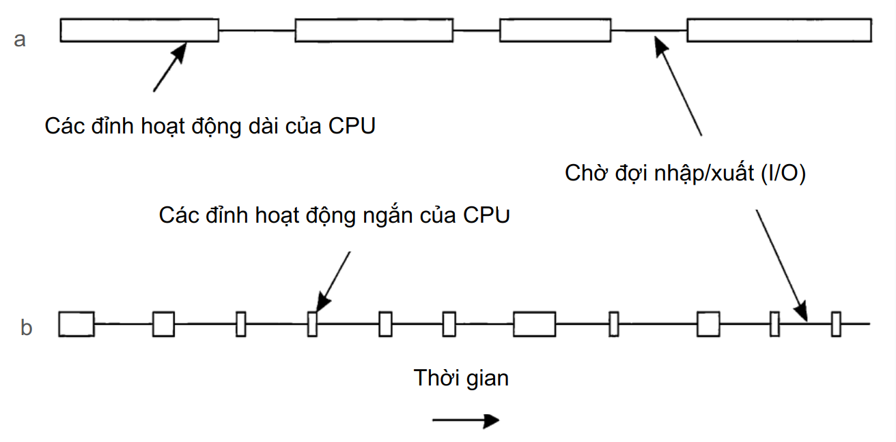
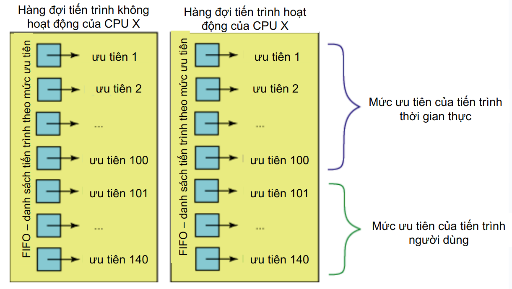
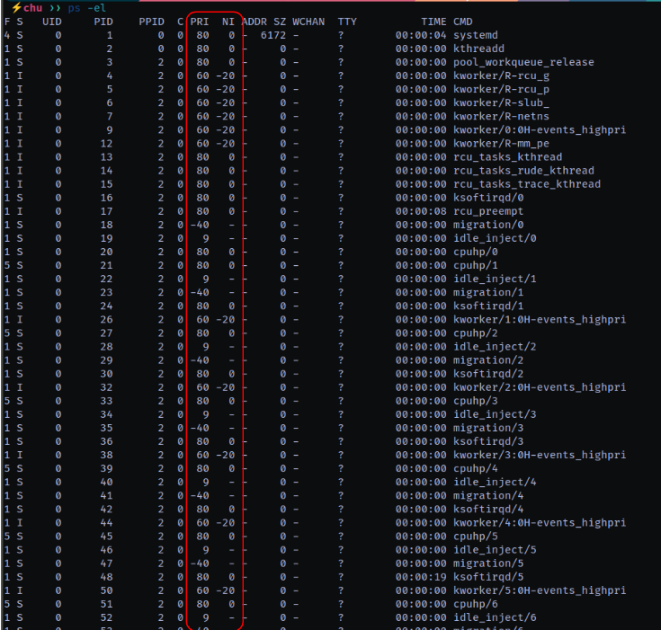

# Process Scheduling
>Lập lịch tiến trình

## 1. **Đa nhiệm**

* **Hệ điều hành được gọi là đa nhiệm**, nếu nó có khả năng luân phiên thực hiện nhiều tiến trình, tạo ra cảm giác rằng tại mỗi thời điểm có nhiều hơn một tiến trình đang chạy.

* **Đa nhiệm hợp tác**
  Việc tiến trình **tự nguyện ngắt việc thực thi của mình** được gọi là **nhượng quyền (yield)**.

* **Đa nhiệm có ưu tiên**

**Quantum thời gian** của tiến trình – là khoảng thời gian mà một tiến trình được phép chạy, **trước khi bị bộ lập lịch ngắt**.

---

## 2. **Bộ lập lịch hệ thống của Linux**

➤ Thành phần của nhân hệ điều hành, xác định **tiến trình nào sẽ được thực thi**, **vào thời điểm nào** và **trong bao lâu**.

| **Phiên bản nhân Linux** | **Loại bộ lập lịch**                                                                              |
| ------------------------ | ------------------------------------------------------------------------------------------------- |
| Trước phiên bản 2.4      | Bộ lập lịch đơn giản, **khó mở rộng**                                                             |
| 2.5                      | Bộ lập lịch loại **O(1)**                                                                         |
| 2.6                      | Bộ lập lịch loại **RSDL** (Rotating Staircase Deadline – Bộ lập lịch giới hạn theo bậc xoay vòng) |
| 2.6.23                   | Bộ lập lịch loại **CFS** (Completely Fair Scheduler – Bộ lập lịch hoàn toàn công bằng)            |

---

## 3. **Hành vi của tiến trình**



---
 **a** — Tiến trình nặng về CPU (CPU-bound):

  ⟶ **Các đỉnh hoạt động dài của CPU**
  ⇒ Tiến trình sử dụng CPU trong các khoảng thời gian dài liên tục, gần như không bị gián đoạn bởi I/O.

  ⟶ **Chờ đợi I/O (nhập/xuất)**
  ⇒ Có một số khoảng thời gian mà tiến trình chờ dữ liệu từ ổ đĩa, mạng, hoặc thiết bị ngoại vi.

➡ Đây là **tiến trình ưu tiên tính toán (CPU-bound)**: chủ yếu dùng CPU, ít yêu cầu I/O.

**b** — Tiến trình nặng về I/O (I/O-bound):

  ⟶ **Các đỉnh hoạt động ngắn của CPU**
  ⇒ Tiến trình chỉ sử dụng CPU trong thời gian rất ngắn, sau đó chờ I/O rất nhiều lần.

➡ Đây là **tiến trình ưu tiên nhập/xuất (I/O-bound)**: CPU chỉ được sử dụng ngắn hạn; phần lớn thời gian chờ đợi phản hồi từ thiết bị I/O.

* Tiến trình **CPU-bound** cần được lập lịch khác với **I/O-bound** để tối ưu tài nguyên hệ thống.
* **CFS** và các bộ lập lịch hiện đại sử dụng thông tin này để phân phối CPU công bằng và hiệu quả giữa các loại tiến trình.

---

## 4.  **Độ ưu tiên của tiến trình**

➤ **Mục tiêu của lập lịch theo độ ưu tiên** là sắp xếp các tiến trình theo mức độ quan trọng và nhu cầu sử dụng thời gian CPU của chúng.

➤ **Các tiến trình có độ ưu tiên cao hơn** nên được thực thi **trước** các tiến trình có độ ưu tiên thấp hơn.

➤ **Các tiến trình có cùng độ ưu tiên** sẽ được lập lịch **theo thuật toán vòng tròn (Round Robin)**.

## 5. Lập lịch tiến trình trong Linux



Trong sơ đồ này, ta thấy **cách Linux tổ chức và xử lý lập lịch các tiến trình dựa trên mức độ ưu tiên**:

1. **Tiến trình được chia thành 2 loại**:

   * **Tiến trình thời gian thực** (real-time tasks): Ưu tiên từ **1 đến 100**
   * **Tiến trình người dùng** (user-space tasks): Ưu tiên từ **101 đến 140**

2. **Cơ chế hàng đợi FIFO theo mức ưu tiên**:

   * Mỗi mức ưu tiên có một hàng đợi FIFO riêng (tức là tiến trình nào đến trước thì được xử lý trước trong cùng một mức ưu tiên).
   * **CPU chọn tiến trình có mức ưu tiên cao nhất trong hàng đợi hoạt động để thực thi**.

3. **Hàng đợi hoạt động và không hoạt động**:

   * Khi tiến trình trong hàng đợi hoạt động hoàn thành hoặc hết thời gian, chúng sẽ chuyển sang hàng đợi không hoạt động, và ngược lại.
   * Cơ chế chuyển đổi này giúp điều phối công bằng và hiệu quả giữa các tiến trình có mức ưu tiên khác nhau.

---

Linux sử dụng **2 hàng đợi (hoạt động và không hoạt động)** kết hợp với **mức ưu tiên (1–140)** và **thuật toán FIFO** để lập lịch tiến trình.

* **Ưu tiên thấp hơn (số lớn hơn)** không có nghĩa là bị bỏ qua, mà chỉ ít được CPU chú ý hơn.
* Các **tiến trình thời gian thực** có thể chiếm CPU nhiều hơn nếu không được giới hạn đúng mức.

---

## 6. **Lập lịch trong Linux. Độ ưu tiên**

**Giá trị `nice`**
Từ **-20 đến +19** (giá trị mặc định = **0**)

---

**Chạy lệnh với một độ ưu tiên nhất định:**

```bash
nice -n giá_trị_nice lệnh
```

**Thay đổi độ ưu tiên của tiến trình đang chạy:**

```bash
renice -n giá_trị_nice id_tiến_trình
```

---
 **Lưu ý**:

* Giá trị `nice` càng **thấp** ⇒ **ưu tiên càng cao**.
* Giá trị `nice` càng **cao** ⇒ **ưu tiên càng thấp**, tiến trình sẽ được CPU xử lý **ít hơn**.

---



Kết quả của lệnh `ps -eL` trên Linux, hiển thị danh sách các tiến trình và luồng (threads) đang chạy, bao gồm cả **độ ưu tiên (PRI)** và **giá trị nice (NI)**. Dưới đây là giải thích chi tiết về các cột liên quan đến lập lịch:

---

| Cột                 | Ý nghĩa                                                                                                                                   |
| ------------------- | ----------------------------------------------------------------------------------------------------------------------------------------- |
| **PRI (Priority)**  | Độ ưu tiên thực tế mà hệ thống dùng để quyết định thứ tự lập lịch tiến trình. Giá trị càng **thấp**, tiến trình càng **ưu tiên cao hơn**. |
| **NI (Nice value)** | Giá trị "nice", phạm vi từ **-20 (ưu tiên cao)** đến **+19 (ưu tiên thấp)**. Mặc định là **0**.                                           |

---
 **Mối quan hệ giữa NI và PRI**:

Trên hệ thống Linux sử dụng **scheduler kiểu cổ điển (O(1) hoặc CFS)**, `PRI` được tính dựa trên `NI` và loại tiến trình:

* Với tiến trình **người dùng**, PRI ≈ 20 + NI (có thể thay đổi tùy scheduler)
* Với tiến trình **real-time**, `NI` sẽ là **-20**, và PRI thường là **60–99**, cao hơn để ưu tiên.

---

* Các tiến trình có `NI = -20` thường là **tiến trình real-time** (ví dụ: `kworker`, `migration`, `idle_inject`, `cpuhp`...), được hệ thống ưu tiên.
* Các tiến trình `systemd`, `kthreadd`, `rcu_tasks` có `NI = 0`, đây là các tiến trình hệ thống cơ bản, được lập lịch theo mức ưu tiên chuẩn.
* `PRI` ở đây dao động trong khoảng **40–80**, thể hiện mức ưu tiên tương ứng.

---

* Các tiến trình có `NI = -20` sẽ được lập lịch trước nhờ `PRI` thấp hơn.
* Bạn có thể thay đổi mức độ ưu tiên khi chạy hoặc sau khi tiến trình đã chạy với:

  * `nice -n -5 command` (ưu tiên cao hơn bình thường)
  * `renice -n 10 -p PID` (giảm ưu tiên của tiến trình)

---
 **Công thức tính quantum thời gian cơ bản (đơn vị: mili giây):**

$$
\text{Quantum thời gian cơ bản} = 
\begin{cases} 
(140 - \text{độ ưu tiên tĩnh}) \times 20, & \text{nếu độ ưu tiên tĩnh} < 120 \\
(140 - \text{độ ưu tiên tĩnh}) \times 5, & \text{nếu độ ưu tiên tĩnh} \geq 120 
\end{cases}
$$

---

**Bảng giá trị liên quan đến độ ưu tiên:**

| **Mô tả**              | **Độ ưu tiên tĩnh** | **Giá trị nice** | **Quantum cơ bản** | **Delta tương tác** | **Ngưỡng thời gian ngủ** |
| ---------------------- | ------------------- | ---------------- | ------------------ | ------------------- | ------------------------ |
| Ưu tiên tĩnh cao nhất  | 100                 | -20              | 800 ms             | -3                  | 299 ms                   |
| Ưu tiên tĩnh cao       | 110                 | -10              | 600 ms             | -1                  | 499 ms                   |
| Ưu tiên tĩnh mặc định  | 120                 | 0                | 100 ms             | +2                  | 799 ms                   |
| Ưu tiên tĩnh thấp      | 130                 | +10              | 50 ms              | +4                  | 999 ms                   |
| Ưu tiên tĩnh thấp nhất | 139                 | +19              | 5 ms               | +6                  | 1199 ms                  |

---

* **Độ ưu tiên tĩnh**: xác định dựa trên giá trị `nice` của tiến trình.
* **Quantum thời gian**: khoảng thời gian tiến trình được cấp CPU.
* **Delta tương tác**: ảnh hưởng đến cách hệ thống đánh giá tiến trình có “tính tương tác” tốt hay không.
* **Ngưỡng thời gian ngủ**: nếu tiến trình ngủ quá thời gian này thì sẽ được coi là có tính tương tác cao (thường là I/O-bound), và được ưu tiên hơn trong lập lịch.
