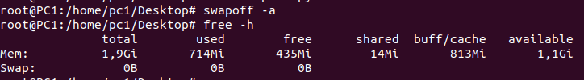
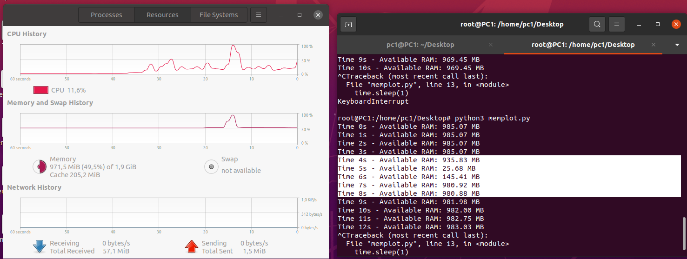
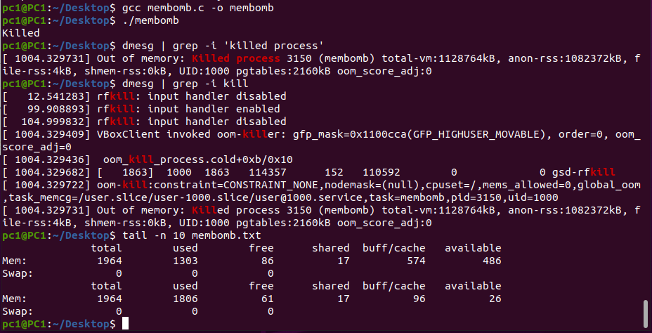
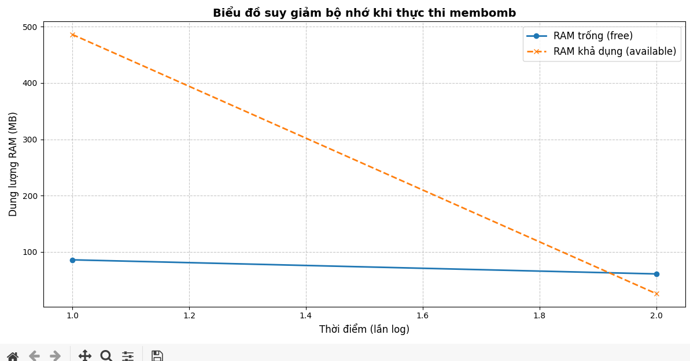
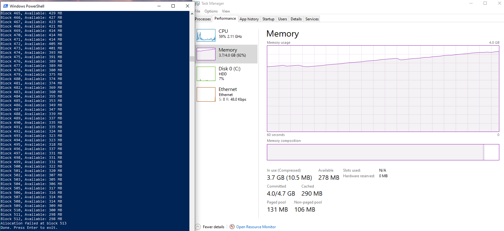
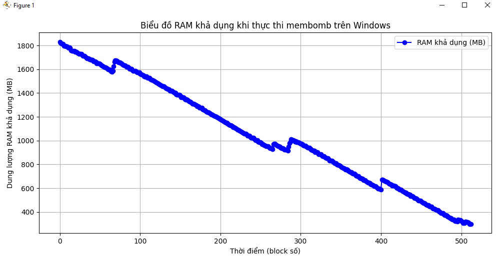

# Membomb

## Nhiệm vụ

1. Viết một chương trình cấp phát bộ nhớ và điền nó bằng số 0
   với bước nhảy bằng kích thước của một trang bộ nhớ (sử dụng `mmap`, `VirtualAlloc`)
2. Vẽ biểu đồ bộ nhớ trống
3. Tìm hiểu cách hoạt động của daemon OOM Killer trong Linux
4. Nhận được thông báo không thể cấp phát thêm bộ nhớ trong Windows

```bash
swapon -a
```

---

# 1. Linux

```c
#include <stdlib.h>
#include <sys/mman.h>
#include <string.h>
#include <stdio.h>
#include <unistd.h>

int main(){
    unsigned int size = 50*1024*1024;
    long page_size = sysconf(_SC_PAGESIZE);
    int count = 0;

    while(1){
        unsigned char *p = mmap(NULL, size, PROT_READ | PROT_WRITE, MAP_PRIVATE | MAP_ANONYMOUS, -1, 0);
        if (p == MAP_FAILED) {
            perror("mmap failed");
            break;
        }

        for(int i = 0; i < size; i += page_size)
            p[i] = 0;

        count++;
        if (count % 10 == 0)  // log sau mỗi 10 lần
            system("free -m >> membomb.txt");

        // usleep(50000); // không bắt buộc
    }

    return 0;
}
```

**Biên dịch**:

```bash
gcc membomb.c -o membomb
```
**Vô hiệu hoá swap để kích hoạt OOM Killer

- Tắt swap:

```bash
sudo swapoff -a
```

- Kiểm tra swap đã tắt chưa:

```bash
free -h
```

Phần Swap phải là 0B.



**Tạo script Python vẽ biểu đồ RAM**

```python
import psutil
import matplotlib.pyplot as plt
import time

mem_used = []
timestamps = []

for i in range(60):  # 60 giây theo dõi
    mem = psutil.virtual_memory()
    mem_used.append(mem.available / (1024 * 1024))  # MB
    timestamps.append(i)
    print(f"Time {i}s - Available RAM: {mem.available / (1024*1024):.2f} MB")
    time.sleep(1)

plt.plot(timestamps, mem_used, label='RAM trống (MB)')
plt.xlabel('Thời gian (giây)')
plt.ylabel('RAM trống (MB)')
plt.title('Biểu đồ RAM theo thời gian')
plt.grid(True)
plt.legend()
plt.show()
```

### Chạy chương trình



Hình 2 – Theo dõi bộ nhớ hệ thống + script Python**

* Cửa sổ bên phải cho thấy **script `memplot.py`** đang đo `Available RAM` mỗi giây.
* RAM khả dụng **giảm mạnh từ \~985MB → \~145MB**, cho thấy tiến trình `membomb` đang **chiếm dần bộ nhớ** đúng như thiết kế.
* Biểu đồ của Ubuntu Resource Monitor (Memory and Swap History) **xác nhận RAM đang bị chiếm liên tục**.

**Kết luận:** Đo RAM khả dụng thời gian thực hoạt động chính xác, phản ánh rõ xu hướng.

### Kiểm tra OOM Killer



Hình 3 – OOM Killer

* Dòng `Killed process 3150 (membomb)` từ `dmesg` cho thấy tiến trình đã bị **OOM Killer tự động chấm dứt** do hệ thống không còn RAM trống.
* RAM khả dụng giảm còn `26MB`, swap = `0` → đúng tình huống gây OOM.

 **Kết luận:** OOM Killer hoạt động đúng 

### Đồ thị



Hình 4 – Biểu đồ vẽ từ `membomb.txt`

* Biểu đồ thể hiện **RAM trống (`free`) và RAM khả dụng (`available`)** theo thời gian.
* Đường `available` (màu cam) **giảm mạnh**, đúng với hành vi thực tế của `membomb`.
* Đường `free` giảm nhẹ vì hệ thống còn giữ phần `buff/cache`.


# 2. Windows

**Chương trình c ghi log RAM**

```c
#include <windows.h>
#include <stdio.h>

int main() {
    SYSTEM_INFO sysInfo;
    GetSystemInfo(&sysInfo);
    SIZE_T page_size = sysInfo.dwPageSize;
    SIZE_T block_size = page_size * 1000;  // mỗi block khoảng 4MB

    FILE* f = fopen("win_membomb.txt", "w");
    if (!f) {
        printf("Cannot open file\n");
        return 1;
    }

    fprintf(f, "Time\tAvailable_MB\n");

    int count = 0;
    while (1) {
        char* addr = (char*)VirtualAlloc(NULL, block_size, MEM_COMMIT | MEM_RESERVE, PAGE_READWRITE);
        if (addr == NULL) {
            printf("Allocation failed at block %d\n", count);
            break;
        }

        for (SIZE_T i = 0; i < block_size; i += page_size)
            addr[i] = 0;

        // Ghi bộ nhớ khả dụng hiện tại
        MEMORYSTATUSEX memInfo;
        memInfo.dwLength = sizeof(memInfo);
        GlobalMemoryStatusEx(&memInfo);
        DWORDLONG avail_phys = memInfo.ullAvailPhys;
        fprintf(f, "%d\t%lld\n", count, avail_phys / (1024 * 1024));  // đơn vị MB

        printf("Block %d, Available: %lld MB\n", count, avail_phys / (1024 * 1024));
        Sleep(200);  // delay để quan sát
        count++;
    }

    fclose(f);
    printf("Done. Press Enter to exit.\n");
    getchar();
    return 0;
}
```

**Biên dịch**

```bash
gcc win_membomb.c -o win_membomb.exe
```

**Chạy chương trình**

```bash
win_membomb.exe
```



Hình 1 – Chương trình chạy & giám sát RAM trong Task Manager

* **PowerShell** hiển thị:

  * RAM khả dụng (`Available`) giảm dần đều theo từng block.
  * Đến `Block 513`: chương trình không thể cấp phát thêm → `Allocation failed`.

* **Task Manager**:

  * RAM sử dụng tăng dần đều lên đến **3.7/4.0 GB (\~92%)**.
  * Dung lượng khả dụng giảm còn **278 MB** → sát mức cạn kiệt.
  * Đồ thị Memory Usage tăng tuyến tính → xác nhận chương trình chiếm bộ nhớ ổn định.

**Kết luận:**

* Chương trình `win_membomb` đã **chiếm RAM thành công cho đến giới hạn hệ thống cho phép**.
* Windows không bị crash mà từ chối cấp phát khi quá ngưỡng → phản ứng an toàn.

**Biểu đồ**



Hình 2 – Biểu đồ RAM khả dụng theo block**

* Trục hoành: **Block số** (thời gian gián tiếp).

* Trục tung: **Dung lượng RAM khả dụng (MB)**.

* Đường đồ thị **giảm đều**, thể hiện rõ mức sử dụng RAM tăng dần.

* Các đoạn **gãy khúc nhỏ** (như tại block \~90, \~300, \~400) có thể là:

  * Tạm thời hệ thống giải phóng RAM hoặc dọn bộ nhớ cache.
  * Tác vụ nền khác chiếm RAM hoặc Windows quản lý lại vùng nhớ.

**Kết luận:**

* Biểu đồ cho thấy RAM giảm đều → xác thực hoạt động của `VirtualAlloc`.
* Rất gần với đồ thị bên Linux → thể hiện nhất quán và chính xác.

---
