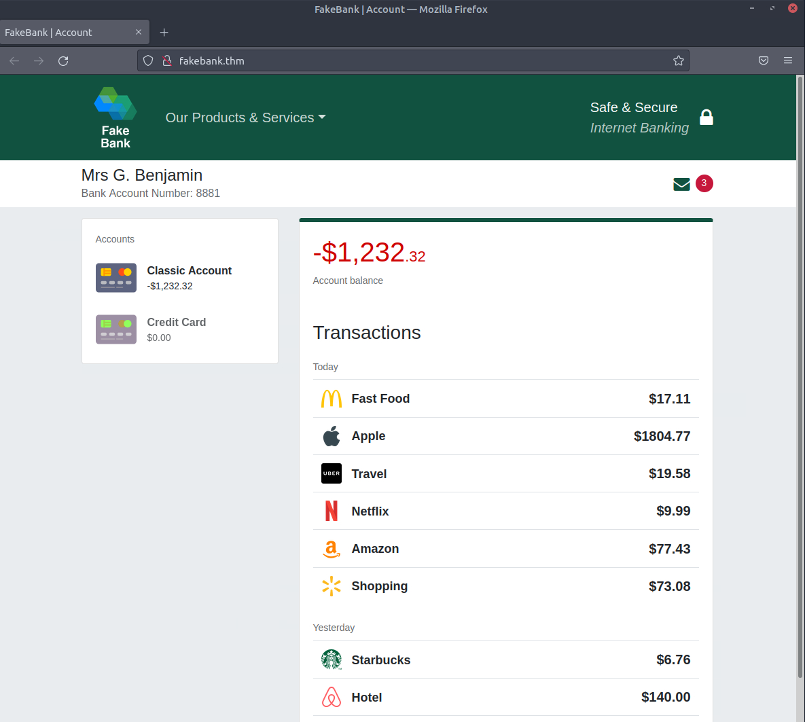
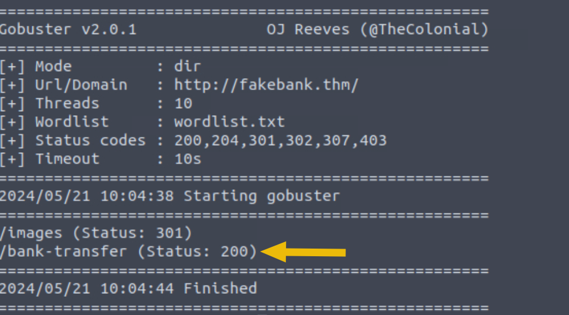
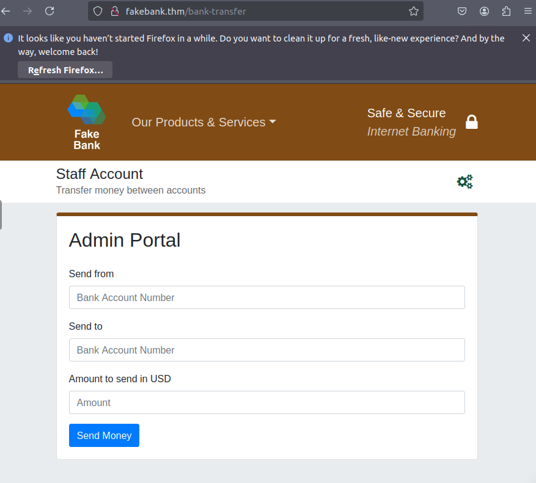
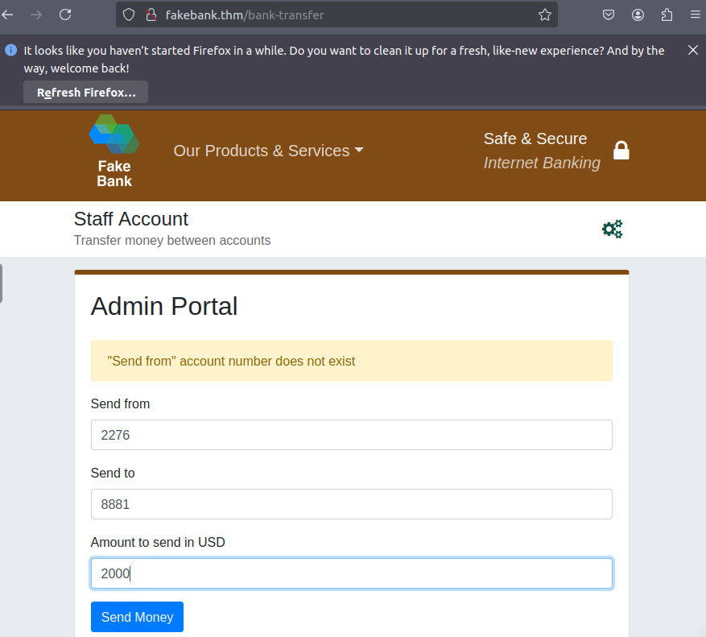
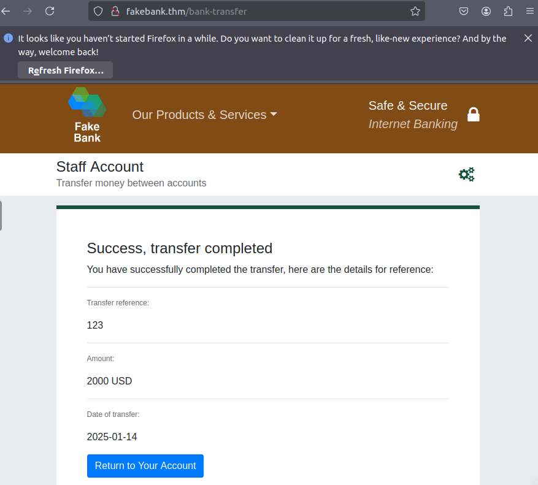
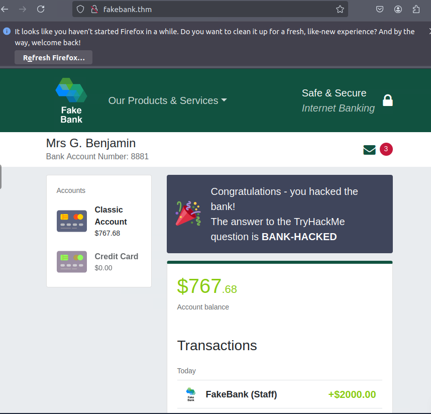

# Offensive Security Intro
> Hack một trang web đầu tiên của bạn (một cách hợp pháp trong một môi trường an toàn) và trải nghiệm công việc của một hacker có đạo đức.

## Mục Lục

1. [Task 1: What is Offensive Security?](#task-1-what-is-offensive-security)

2. [Task 2: Hacking your first machine](#task-2-hacking-your-first-machine)

3. [Task 3: Careers in Cyber Security](#task-3-careers-in-cyber-security)

## Nội dung

# Task 1: What is Offensive Security?

Để vượt qua một hacker, bạn cần suy nghĩ như một hacker.  

Đây là cốt lõi của "An ninh Tấn công" (Offensive Security). Nó bao gồm việc xâm nhập vào các hệ thống máy tính, khai thác lỗi phần mềm và tìm các lỗ hổng trong ứng dụng để truy cập trái phép. Mục tiêu là hiểu các chiến thuật của hacker và tăng cường phòng thủ cho hệ thống của chúng ta.  

**Bắt đầu hành trình học tập của bạn**  

Trong phòng TryHackMe này, bạn sẽ được hướng dẫn cách hack một trang web đầu tiên trong một môi trường hợp pháp và an toàn. Mục tiêu là chỉ ra cách một hacker có đạo đức hoạt động.  

**Trả lời các câu hỏi sau**  
Tùy chọn nào dưới đây đại diện tốt hơn cho quá trình bạn mô phỏng hành động của một hacker để tìm ra các lỗ hổng trong hệ thống?  

- An ninh Tấn công (Offensive Security)  
- An ninh Phòng thủ (Defensive Security)

<details>
  <summary>Hiển thị đáp án</summary>
  Đáp án: Offensive Security
</details>

# Task 2: Hacking your first machine

Trong phòng học này, chúng tôi đã chuẩn bị một ứng dụng ngân hàng giả lập mang tên Fakebank:




### **Lần hack đầu tiên của bạn**  

Chúng ta sẽ sử dụng một ứng dụng dòng lệnh tên là **Gobuster** để thực hiện tấn công brute-force vào trang web của FakeBank, nhằm tìm các thư mục và trang ẩn. Gobuster sẽ lấy một danh sách các tên trang hoặc thư mục tiềm năng và thử truy cập vào trang web với từng cái trong danh sách; nếu trang tồn tại, nó sẽ thông báo cho bạn.  

#### **Bước 1. Mở Terminal**  

Terminal, còn được gọi là dòng lệnh, cho phép chúng ta tương tác với máy tính mà không cần sử dụng giao diện đồ họa. Trên máy ảo, mở terminal bằng cách nhấp vào biểu tượng **Terminal** bên phải màn hình.  

#### **Bước 2. Sử dụng Gobuster để tìm các trang web ẩn**  

Hầu hết các công ty có một trang quản trị (admin portal), cho phép nhân viên truy cập vào các công cụ quản trị cơ bản để phục vụ công việc hàng ngày. Với một ngân hàng, nhân viên có thể cần thực hiện chuyển tiền giữa các tài khoản khách hàng. Do lỗi con người hoặc sự bất cẩn, có thể xảy ra trường hợp những trang này không được bảo mật, cho phép kẻ tấn công tìm thấy các trang ẩn cho phép truy cập vào chức năng quản trị hoặc dữ liệu nhạy cảm.  

Để bắt đầu, gõ lệnh sau vào terminal để tìm các trang ẩn tiềm năng trên trang web của FakeBank bằng Gobuster (một ứng dụng bảo mật dòng lệnh):  

```bash
gobuster -u http://fakebank.thm -w wordlist.txt dir
```

Lệnh này sẽ chạy và hiển thị đầu ra tương tự như thế này:  

```bash
ubuntu@tryhackme:~/Desktop$ gobuster -u http://fakebank.thm -w wordlist.txt dir

=====================================================
Gobuster v2.0.1              OJ Reeves (@TheColonial)
=====================================================
[+] Mode         : dir
[+] Url/Domain   : http://fakebank.thm/
[+] Threads      : 10
[+] Wordlist     : wordlist.txt
[+] Status codes : 200,204,301,302,307,403
[+] Timeout      : 10s
=====================================================
2024/05/21 10:04:38 Starting gobuster
=====================================================
/images (Status: 301)
/bank-transfer (Status: 200)
=====================================================
2024/05/21 10:04:44 Finished
=====================================================
```

Trong lệnh trên:  

- `-u` được sử dụng để chỉ định trang web cần quét.  
- `-w` nhận danh sách từ để lặp qua và tìm các trang ẩn.  

Bạn sẽ thấy Gobuster quét trang web với từng từ trong danh sách, tìm các trang tồn tại trên trang web. Gobuster sẽ cho bạn biết các trang trong danh sách các tên trang/thư mục (được chỉ định bằng **Status: 200**).  



#### **Bước 3. Hack Ngân hàng**  

Bạn sẽ tìm thấy một trang chuyển khoản bí mật cho phép bạn chuyển tiền giữa các tài khoản ngân hàng (**/bank-transfer**). Nhập trang ẩn này vào trang web FakeBank bằng thanh địa chỉ của trình duyệt.  


Từ trang này, kẻ tấn công có thể truy cập trái phép và đánh cắp tiền từ bất kỳ tài khoản ngân hàng nào.

**Nhiệm vụ của bạn là chuyển $2000 từ tài khoản ngân hàng số 2276 sang tài khoản của bạn (số tài khoản 8881).**  
Nếu chuyển khoản thành công, bạn sẽ thấy số dư mới được cập nhật trên trang tài khoản của mình.  

Hãy đến đó ngay và xác nhận bạn đã nhận được tiền! *(Có thể bạn cần nhấn Refresh để các thay đổi hiển thị)*  

**Các bước thực hiện**

- Sau khi truy cập được vào trang ẩn ta có như sau:



- Nhập thông tin chuyển khoản:



- Kết quả:



---

### **Trả lời câu hỏi dưới đây**  

 Trên số dư tài khoản của bạn, bạn sẽ thấy một thông báo chỉ ra câu trả lời cho câu hỏi này. Bạn có thể tìm thấy câu trả lời cần thiết không?  



<details>
  <summary>Hiển thị đáp án</summary>
  Đáp án: BANK-HACKED
</details>

TỔNG KẾT: Nếu bạn là một người kiểm tra xâm nhập hoặc tư vấn bảo mật, đây là một bài tập bạn sẽ thực hiện cho các công ty để kiểm tra lỗ hổng trong ứng dụng web của họ và tìm các trang ẩn để điều tra các lỗ hổng.  

# Task 3: Careers in Cyber Security

### **Làm thế nào để bắt đầu học?**  

Mọi người thường tự hỏi làm thế nào người khác trở thành hacker (tư vấn viên bảo mật) hoặc người bảo vệ (chuyên gia phân tích bảo mật chống tội phạm mạng), và câu trả lời rất đơn giản:  
**Chia nhỏ vấn đề, tìm hiểu một lĩnh vực an ninh mạng mà bạn quan tâm và thường xuyên thực hành thông qua các bài tập thực tế.** Hình thành thói quen học một chút mỗi ngày trên TryHackMe, và bạn sẽ tích lũy đủ kiến thức để có được công việc đầu tiên trong ngành.  

Hãy tin chúng tôi; bạn có thể làm được! Hãy xem một số người đã sử dụng TryHackMe để đạt được công việc bảo mật đầu tiên của họ:  

- **Paul**: Từ công nhân xây dựng trở thành kỹ sư bảo mật. [Xem thêm](https://tryhackme.com/r/resources/blog/construction-worker-to-security-engineer-how-paul-used-tryhackme-to-land-his-first-job-in-security)  
- **Kassandra**: Từ giáo viên âm nhạc trở thành chuyên gia bảo mật. [Xem thêm](https://tryhackme.com/r/resources/blog/the-teacher-becomes-the-student)  
- **Brandon**: Sử dụng TryHackMe khi còn đi học để có được công việc đầu tiên trong lĩnh vực an ninh mạng. [Xem thêm](https://tryhackme.com/r/resources/blog/brandons-success-story)  

---

### **Có những nghề nghiệp nào?**  

Phòng học về **nghề nghiệp trong lĩnh vực an ninh mạng** (Cyber Careers Room) sẽ đi sâu hơn vào các công việc khác nhau trong ngành. Tuy nhiên, đây là mô tả ngắn gọn về một số vai trò trong lĩnh vực an ninh tấn công:  

- **Penetration Tester (Người kiểm tra xâm nhập)**: Chịu trách nhiệm kiểm tra các sản phẩm công nghệ để tìm các lỗ hổng bảo mật có thể khai thác.  
- **Red Teamer**: Đóng vai trò là một kẻ tấn công, tấn công vào tổ chức và cung cấp phản hồi từ góc nhìn của đối thủ.  
- **Security Engineer (Kỹ sư bảo mật)**: Thiết kế, giám sát và duy trì các biện pháp bảo mật, mạng và hệ thống để giúp ngăn chặn các cuộc tấn công mạng.  
