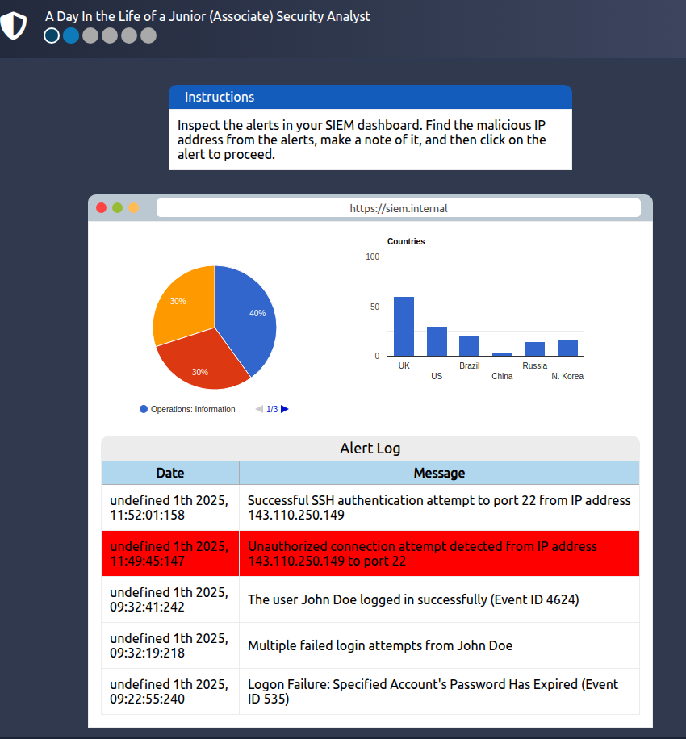

# Defensive Security Intro

**Giới thiệu về An ninh Phòng thủ**  

> Giới thiệu về an ninh phòng thủ và các chủ đề liên quan như: **Tình báo mối đe dọa (Threat Intelligence)**, **Trung tâm Điều hành An ninh (SOC)**, **Phân tích và Ứng phó Sự cố Kỹ thuật số (DFIR)**, **Phân tích phần mềm độc hại (Malware Analysis)**, và **Hệ thống Quản lý Sự kiện và Thông tin Bảo mật (SIEM)**.

### Mục Lục

1. [Task 1: Introduction to Defensive Security](#task-1-introduction-to-defensive-security)

2. [Task 2: Areas of Defensive Security](#task-2-areas-of-defensive-security)

3. [Task 3: Practical Example of Defensive Security](#task-3-practical-example-of-defensive-security)

### Nội dung

# Task 1: Introduction to Defensive Security

**Giới thiệu về An ninh Phòng thủ**  

Trong phòng học trước, chúng ta đã tìm hiểu về **an ninh tấn công** (offensive security), với mục tiêu xác định và khai thác các lỗ hổng hệ thống nhằm tăng cường các biện pháp bảo mật. Điều này bao gồm khai thác lỗi phần mềm, lợi dụng các cài đặt không an toàn, và tận dụng chính sách kiểm soát truy cập không được thực thi, cùng với các chiến lược khác. **Đội Red Team** và các chuyên gia kiểm tra xâm nhập (penetration testers) chuyên về những kỹ thuật tấn công này.  

Trong phòng học này, chúng ta sẽ khám phá đối trọng của nó, **an ninh phòng thủ** (defensive security). Nó tập trung vào hai nhiệm vụ chính:  

1. **Ngăn chặn các hành vi xâm nhập trước khi chúng xảy ra.**  
2. **Phát hiện các hành vi xâm nhập khi chúng xảy ra và phản hồi một cách thích hợp.**  

**Blue Team** (Đội Xanh) là một phần quan trọng của lĩnh vực an ninh phòng thủ.  

---

### **Một số nhiệm vụ liên quan đến an ninh phòng thủ bao gồm:**  

- **Nâng cao nhận thức về an ninh mạng cho người dùng:** Đào tạo người dùng về an ninh mạng giúp bảo vệ chống lại các cuộc tấn công nhắm vào hệ thống của họ.  
- **Lập tài liệu và quản lý tài sản:** Chúng ta cần biết các hệ thống và thiết bị nào cần quản lý và bảo vệ một cách phù hợp.  
- **Cập nhật và vá lỗi hệ thống:** Đảm bảo rằng máy tính, máy chủ, và các thiết bị mạng được cập nhật và vá lỗi đúng cách để chống lại bất kỳ lỗ hổng nào đã biết.  
- **Cài đặt các thiết bị bảo mật phòng ngừa:** Tường lửa (firewall) và hệ thống ngăn chặn xâm nhập (IPS) là các thành phần quan trọng của bảo mật phòng ngừa. Tường lửa kiểm soát lưu lượng mạng nào có thể đi vào và ra khỏi hệ thống hoặc mạng. **IPS** chặn bất kỳ lưu lượng mạng nào khớp với các quy tắc và chữ ký tấn công đã được định sẵn.  
- **Cài đặt các thiết bị ghi log và giám sát:** Việc ghi nhật ký và giám sát mạng đúng cách là điều cần thiết để phát hiện các hoạt động độc hại và hành vi xâm nhập. Nếu một thiết bị trái phép xuất hiện trên mạng của chúng ta, chúng ta cần có khả năng phát hiện ra nó.  

---

### **Ngoài ra, chúng ta sẽ tìm hiểu các chủ đề liên quan sau:**  

- **Trung tâm Điều hành An ninh (SOC)**  
- **Tình báo mối đe dọa (Threat Intelligence)**  
- **Phân tích pháp y số và ứng phó sự cố (DFIR)**  
- **Phân tích phần mềm độc hại (Malware Analysis)**

Trả lời các câu hỏi dưới đây:  
**Đội nào tập trung vào an ninh phòng thủ?**

  
Hiển thị đáp án

  Đáp án: Blue Team

# Task 2: Areas of Defensive Security

**Nhiệm vụ 2: Các lĩnh vực của An ninh Phòng thủ**  

Trong nhiệm vụ này, chúng ta sẽ khám phá hai chủ đề chính liên quan đến an ninh phòng thủ:  

- **Security Operations Center - Trung tâm Điều hành An ninh (SOC)**, nơi chúng ta tìm hiểu về **Tình báo mối đe dọa (Threat Intelligence)**  
- **Digital Forensics and Incident Response - Phân tích pháp y số và ứng phó sự cố (DFIR)**, nơi chúng ta cũng tìm hiểu về **Phân tích phần mềm độc hại (Malware Analysis)**  

---

### **Trung tâm Điều hành An ninh (SOC)**  
Một **Trung tâm Điều hành An ninh (SOC)** là một nhóm các chuyên gia an ninh mạng, chịu trách nhiệm giám sát mạng và hệ thống để phát hiện các sự kiện an ninh mạng độc hại. Một số lĩnh vực chính mà SOC tập trung gồm:  

- **Lỗ hổng bảo mật (Vulnerabilities):** Khi phát hiện một lỗ hổng hệ thống, cần phải sửa chữa nó bằng cách cài đặt bản cập nhật hoặc vá lỗi phù hợp. Nếu không thể sửa ngay, các biện pháp cần thiết phải được áp dụng để ngăn chặn kẻ tấn công khai thác.  
- **Vi phạm chính sách (Policy violations):** Một chính sách bảo mật là tập hợp các quy tắc được yêu cầu để bảo vệ mạng và hệ thống. Ví dụ, nếu người dùng tải dữ liệu công ty nhạy cảm lên dịch vụ lưu trữ trực tuyến, đây là một vi phạm chính sách.  
- **Hoạt động trái phép (Unauthorized activity):** Xem xét trường hợp thông tin đăng nhập của người dùng bị đánh cắp và kẻ tấn công sử dụng chúng để đăng nhập vào mạng. SOC phải phát hiện và chặn sự kiện này ngay khi có thể để ngăn chặn thiệt hại thêm.  
- **Xâm nhập mạng (Network intrusions):** Dù bảo mật tốt đến đâu, luôn có khả năng bị xâm nhập, ví dụ, khi người dùng nhấp vào liên kết độc hại hoặc kẻ tấn công khai thác máy chủ công cộng. SOC phải phát hiện và ứng phó nhanh chóng.  

---

#### **Tình báo mối đe dọa (Threat Intelligence)**  
Tình báo mối đe dọa tập trung vào việc thu thập thông tin về các mối đe dọa hiện tại và tiềm năng, nhằm chuẩn bị tốt hơn cho công ty chống lại các đối thủ.  
Ví dụ:  

- Một số đối thủ có thể đánh cắp dữ liệu khách hàng từ nhà cung cấp dịch vụ di động.  
- Một số khác có thể nhằm mục đích ngừng sản xuất tại một nhà máy lọc dầu.  

**Quy trình:**  

1. **Thu thập dữ liệu:** Từ nhật ký mạng, nguồn công khai (như diễn đàn), và các nguồn khác.  
2. **Phân tích:** Tạo thông tin chi tiết về động cơ và phương pháp của kẻ tấn công.  
3. **Hành động:** Đưa ra khuyến nghị và các bước giảm thiểu rủi ro.

---

### **Phân tích pháp y số và Ứng phó Sự cố - Digital Forensics and Incident Response (DFIR)**  

Phần này nói về **Phân tích pháp y số (Digital Forensics)** và **Ứng phó sự cố (Incident Response)**, đồng thời bao gồm:  

- Phân tích pháp y số  (Digital Forensics)
- Ứng phó sự cố  (Incident Response)
- Phân tích phần mềm độc hại  (Malware Analysis)

---

#### **Phân tích pháp y số (Digital Forensics)**  

Pháp y là việc áp dụng khoa học để điều tra tội phạm và xác lập sự thật. Với sự sử dụng và phổ biến của các hệ thống số như máy tính và điện thoại thông minh, một nhánh mới của pháp y đã ra đời để điều tra tội phạm liên quan: pháp y máy tính, sau này phát triển thành pháp y số.  

Trong an ninh phòng thủ, trọng tâm của pháp y số chuyển sang phân tích bằng chứng về các cuộc tấn công và thủ phạm, cùng các lĩnh vực khác như trộm cắp sở hữu trí tuệ, gián điệp mạng và xử lý nội dung không được phép. Kết quả là, pháp y số tập trung vào các lĩnh vực khác nhau như sau:  

- **Hệ thống tệp (File System):** Phân tích một bản sao pháp y số cấp thấp (low-level copy) của hệ thống lưu trữ tiết lộ nhiều thông tin, chẳng hạn như chương trình đã cài đặt, tập tin được tạo, các tập tin bị ghi đè một phần và các tập tin bị xóa.  
- **Bộ nhớ hệ thống (System Memory):** Nếu kẻ tấn công chạy chương trình độc hại của họ trong bộ nhớ mà không lưu nó vào đĩa, việc tạo một hình ảnh pháp y (bản sao cấp thấp) của bộ nhớ hệ thống là cách tốt nhất để phân tích nội dung và tìm hiểu về cuộc tấn công.  
- **Nhật ký hệ thống (System Logs):** Mỗi máy khách và máy chủ duy trì các tệp nhật ký khác nhau về những gì đã xảy ra. Các tệp nhật ký cung cấp rất nhiều thông tin về những gì đã xảy ra trên hệ thống. Ngay cả khi kẻ tấn công cố xóa dấu vết, một số dấu vết vẫn sẽ còn lại.  
- **Nhật ký mạng (Network Logs):** Nhật ký của các gói tin mạng đã truyền qua mạng sẽ giúp trả lời thêm nhiều câu hỏi về việc liệu có một cuộc tấn công đang xảy ra hay không và nó bao gồm những gì.  

---

#### **Ứng phó sự cố (Incident Response)**  
Một **sự cố (incident)** thường liên quan đến một vụ vi phạm dữ liệu hoặc tấn công mạng; tuy nhiên, trong một số trường hợp, nó có thể là một vấn đề ít nghiêm trọng hơn, chẳng hạn như cấu hình sai, cố gắng xâm nhập hoặc vi phạm chính sách.  

Ví dụ về một cuộc tấn công mạng bao gồm:  

- Kẻ tấn công làm cho mạng hoặc hệ thống của bạn không thể truy cập được  
- Thay đổi (defacing) trang web công khai  
- Vi phạm dữ liệu (đánh cắp dữ liệu công ty)  

**Bạn sẽ phản hồi như thế nào trước một cuộc tấn công mạng?** Ứng phó sự cố chỉ ra phương pháp cần được thực hiện để xử lý trường hợp như vậy. Mục tiêu là giảm thiểu thiệt hại và phục hồi trong thời gian ngắn nhất có thể. Lý tưởng nhất, bạn sẽ phát triển một kế hoạch sẵn sàng cho việc ứng phó sự cố.  

**Bốn giai đoạn chính của quy trình ứng phó sự cố:**  

1. **Chuẩn bị (Preparation):** Điều này yêu cầu một nhóm được đào tạo và sẵn sàng xử lý các sự cố. Lý tưởng nhất, các biện pháp khác nhau sẽ được đưa ra để ngăn chặn các sự cố xảy ra ngay từ đầu.  
2. **Phát hiện và Phân tích (Detection and Analysis):** Nhóm phải có các nguồn lực cần thiết để phát hiện bất kỳ sự cố nào; hơn nữa, điều quan trọng là phải phân tích sâu hơn sự cố được phát hiện để tìm hiểu về mức độ nghiêm trọng của nó.  
3. **Kiểm soát, Loại bỏ và Phục hồi (Containment, Eradication, and Recovery):** Một khi sự cố được xác định, điều quan trọng là phải ngăn chặn nó ảnh hưởng đến các hệ thống khác, loại bỏ nó và phục hồi các hệ thống bị ảnh hưởng. Ví dụ, khi nhận thấy rằng một hệ thống bị nhiễm virus máy tính, chúng ta sẽ muốn dừng (kiểm soát) virus khỏi lan sang các hệ thống khác, làm sạch (loại bỏ) virus, và đảm bảo khôi phục hệ thống.  
4. **Hoạt động sau sự cố (Post-Incident Activity):** Sau khi phục hồi thành công, một báo cáo được tạo ra và bài học rút ra được chia sẻ để ngăn chặn các sự cố tương tự trong tương lai.

#### **Phân tích phần mềm độc hại (Malware Analysis)**  

**Malware** là viết tắt của **malicious software** (phần mềm độc hại). **Software** đề cập đến các chương trình, tài liệu, và tệp tin mà bạn có thể lưu trữ trên đĩa hoặc gửi qua mạng. Malware bao gồm nhiều loại khác nhau, chẳng hạn như:  

- **Virus:** Là một đoạn mã (một phần của chương trình) tự gắn vào một chương trình. Nó được thiết kế để lan truyền từ máy tính này sang máy tính khác và hoạt động bằng cách thay đổi, ghi đè, và xóa tệp tin sau khi lây nhiễm máy tính. Kết quả có thể khiến máy tính trở nên chậm hoặc không sử dụng được.  
- **Trojan Horse (Ngựa Trojan):** Là một chương trình hiển thị một chức năng mong muốn nhưng ẩn chứa một chức năng độc hại bên trong. Ví dụ, nạn nhân có thể tải về một trình phát video từ một trang web không đáng tin cậy mà thực chất là một phần mềm độc hại, cho phép kẻ tấn công kiểm soát hoàn toàn hệ thống của họ.  
- **Ransomware:** Là một chương trình độc hại mã hóa các tệp tin của người dùng. Mã hóa khiến các tệp tin không thể đọc được nếu không có mật khẩu giải mã. Kẻ tấn công sẽ yêu cầu người dùng trả một khoản tiền chuộc để lấy lại mật khẩu giải mã.  

---

Phân tích phần mềm độc hại nhằm tìm hiểu về các chương trình độc hại này bằng các phương pháp khác nhau, như:  

1. **Phân tích tĩnh (Static Analysis):**  
   Phân tích tĩnh được thực hiện bằng cách kiểm tra chương trình độc hại mà không chạy nó. Điều này thường yêu cầu kiến thức vững chắc về ngôn ngữ assembly (tập lệnh của bộ xử lý, tức là các chỉ dẫn cơ bản của máy tính).  

2. **Phân tích động (Dynamic Analysis):**  
   Phân tích động được thực hiện bằng cách chạy phần mềm độc hại trong một môi trường được kiểm soát và giám sát các hoạt động của nó. Điều này cho phép bạn quan sát cách phần mềm độc hại hoạt động khi chạy.

**Trả lời các câu hỏi dưới đây**  

1. **Bạn sẽ gọi nhóm các chuyên gia an ninh mạng giám sát mạng và hệ thống để phát hiện các sự kiện độc hại là gì?**  

  
Hiển thị đáp án

  Đáp án: Security Operations Center

2. **DFIR là viết tắt của gì?**

  
Hiển thị đáp án

  Đáp án: Digital Forensics and Incident Response

3. **Loại phần mềm độc hại nào yêu cầu người dùng trả tiền để lấy lại quyền truy cập vào tệp của họ?**  

  
Hiển thị đáp án

  Đáp án: ransomware

# Task 3: Practical Example of Defensive Security

### **Tình huống**  

Hãy giả sử bạn là một nhà phân tích tại **Trung tâm Điều hành An ninh (SOC)**, chịu trách nhiệm bảo vệ một ngân hàng. SOC của ngân hàng này sử dụng một công cụ **Quản lý Thông tin và Sự kiện Bảo mật - Security Information and Event Management (SIEM)**, công cụ này thu thập các thông tin và sự kiện liên quan đến bảo mật từ nhiều nguồn khác nhau và hiển thị chúng trên một bảng điều khiển duy nhất. Nếu SIEM phát hiện điều gì đó đáng ngờ, nó sẽ tạo ra một cảnh báo.  

Tuy nhiên, không phải tất cả các cảnh báo đều mang tính chất độc hại. Chính các nhà phân tích sẽ sử dụng kiến thức chuyên môn của mình trong lĩnh vực an ninh mạng để điều tra và xác định những cảnh báo nào là nguy hiểm.  

Ví dụ, bạn có thể gặp một cảnh báo về việc một người dùng không thành công trong nhiều lần đăng nhập. Mặc dù điều này đáng nghi ngờ, nhưng đôi khi nó xảy ra, đặc biệt khi người dùng quên mật khẩu và tiếp tục cố gắng đăng nhập.  

Ngoài ra, có thể xuất hiện các cảnh báo liên quan đến kết nối từ các địa chỉ IP không xác định. **Địa chỉ IP** giống như địa chỉ nhà của máy tính bạn trên Internet—nó cho các máy tính khác biết nơi gửi thông tin mà bạn yêu cầu. Khi các địa chỉ này không xác định, điều đó có thể có nghĩa là có người mới đang cố gắng kết nối hoặc ai đó đang cố gắng truy cập trái phép.  

### **Mô phỏng SIEM**  

Chúng tôi đã chuẩn bị một mô phỏng tương tác, đơn giản hóa hệ thống **SIEM** (Quản lý Thông tin và Sự kiện Bảo mật) để mang đến cho bạn trải nghiệm thực tế tương tự như những gì các nhà phân tích an ninh mạng gặp phải.  

Hành động này sẽ mở một "trang tĩnh" ở phía bên phải màn hình của bạn. Hãy làm theo các hướng dẫn từng bước được cung cấp trong mô phỏng để duyệt qua các sự kiện và tìm **"flag"** (lá cờ). Một flag là một chuỗi ký tự với định dạng như sau: **"THM{RANDOM_WORDS}"**. Sử dụng flag này để trả lời các câu hỏi từ các phòng học tại TryHackMe, chẳng hạn như câu hỏi bên dưới.  

1. Kiểm tra các cảnh báo trong bảng điều khiển SIEM của bạn. Tìm địa chỉ IP độc hại từ các cảnh báo, ghi chú lại, sau đó nhấp vào cảnh báo để tiếp tục.

Ta thấy rằng có một phát hiện nỗ lực kết nối trái phép từ địa chỉ IP 143.110.250.149 tới cổng 22. 

Ngày: undefined 1th 2025, 11:49:45:147
Thông báo: Unauthorized connection attempt detected from IP address 143.110.250.149 to port 22

2. Kiểm tra

Có những trang web trên Internet cho phép bạn kiểm tra uy tín của một địa chỉ IP để xem liệu địa chỉ đó có độc hại hay đáng ngờ hay không.

kết quả: 

Có nhiều cơ sở dữ liệu nguồn mở, như AbuseIPDB và Cisco Talos Intelligence, nơi bạn có thể thực hiện kiểm tra danh tiếng và vị trí cho địa chỉ IP. Hầu hết các nhà phân tích bảo mật sử dụng các công cụ này để hỗ trợ họ trong các cuộc điều tra cảnh báo. Bạn cũng có thể làm cho Internet an toàn hơn bằng cách báo cáo các IP độc hại, ví dụ, trên AbuseIPDB.
Bây giờ chúng ta đã biết địa chỉ IP là độc hại, chúng ta cần chuyển nó đến một nhân viên!

3. Chọn người phụ trách

Chúng ta không nên quá lo lắng nếu đó là một nỗ lực xác thực không thành công, nhưng có lẽ bạn đã nhận thấy nỗ lực xác thực thành công từ địa chỉ IP độc hại. Hãy khai báo một sự cố nhỏ và nâng cấp nó. Có một số nhân viên tuyệt vời làm việc tại công ty, nhưng bạn sẽ không muốn nâng cấp điều này cho người không phù hợp không phụ trách nhóm hoặc phòng ban của bạn.

Ở đây ta cần chọn SOC Team Lead

4. Chặn IP độc hại

Bạn đã có quyền chặn địa chỉ IP độc hại và bây giờ bạn có thể tiến hành và triển khai quy tắc chặn. Chặn địa chỉ IP độc hại trên tường lửa và tìm hiểu xem họ đã để lại tin nhắn gì cho bạn.

5. Nhận kết quả cho flag

---

### **Tiếp theo là gì?**  

Trong phòng học này, chúng ta đã thảo luận về các lĩnh vực con khác nhau (**SOC, Threat Intelligence, Malware Analysis, và DFIR**) và trải nghiệm trực tiếp cách xử lý các cảnh báo trong môi trường SIEM mô phỏng. Mặc dù chúng ta đã đề cập nhiều nội dung, độ sâu và sự phức tạp của lĩnh vực này đòi hỏi còn nhiều điều phải học hỏi và khám phá. Những bài học ở đây sẽ là nền tảng của bạn khi các mối đe dọa mạng phát triển, đòi hỏi việc học tập liên tục, sự cảnh giác và khả năng thích nghi.  

Hãy tiếp tục học bằng cách kiểm tra phòng học tiếp theo trong chuỗi này, **"Search Skills"**. Phòng học này sẽ dạy bạn các kỹ thuật có giá trị để tìm kiếm thông tin trực tuyến nhằm hỗ trợ các cuộc điều tra và việc học của bạn.  

Nếu bạn muốn học trước và tìm hiểu thêm về các chủ đề đã thảo luận trong phòng học này, các phòng học sau được đề xuất:  

- **[Introduction to SIEM](https://tryhackme.com/r/room/introtosiem):** Giới thiệu về Quản lý Thông tin và Sự kiện Bảo mật  
- **[Security Operations](https://tryhackme.com/r/why-subscribe?roomCode=securityoperations):** Tìm hiểu về Trung tâm Điều hành An ninh (SOC), trách nhiệm, dịch vụ, và các nguồn dữ liệu của SOC  
- **[DFIR: An Introduction](https://tryhackme.com/r/room/introductoryroomdfirmodule):** Phòng học giới thiệu về mô-đun DFIR  
- **[Intro to Malware Analysis](https://tryhackme.com/r/why-subscribe?roomCode=intromalwareanalysis):** Những gì cần làm khi bạn gặp một phần mềm độc hại nghi ngờ

