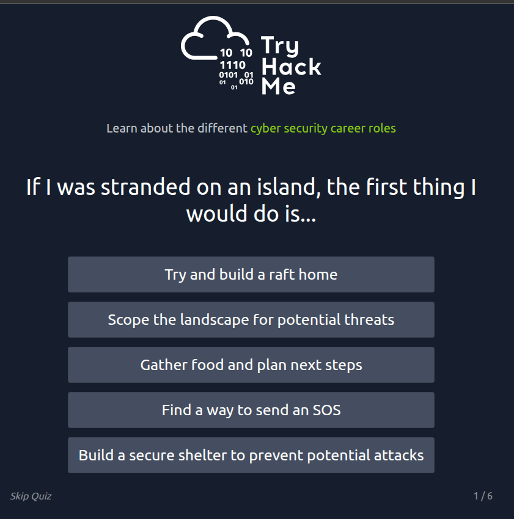
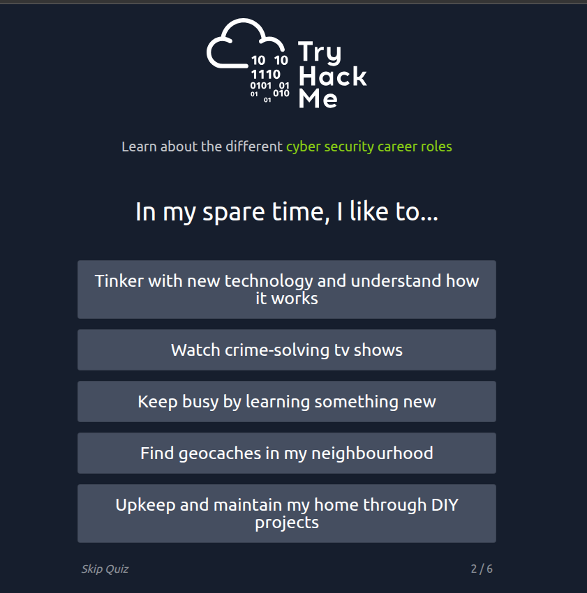
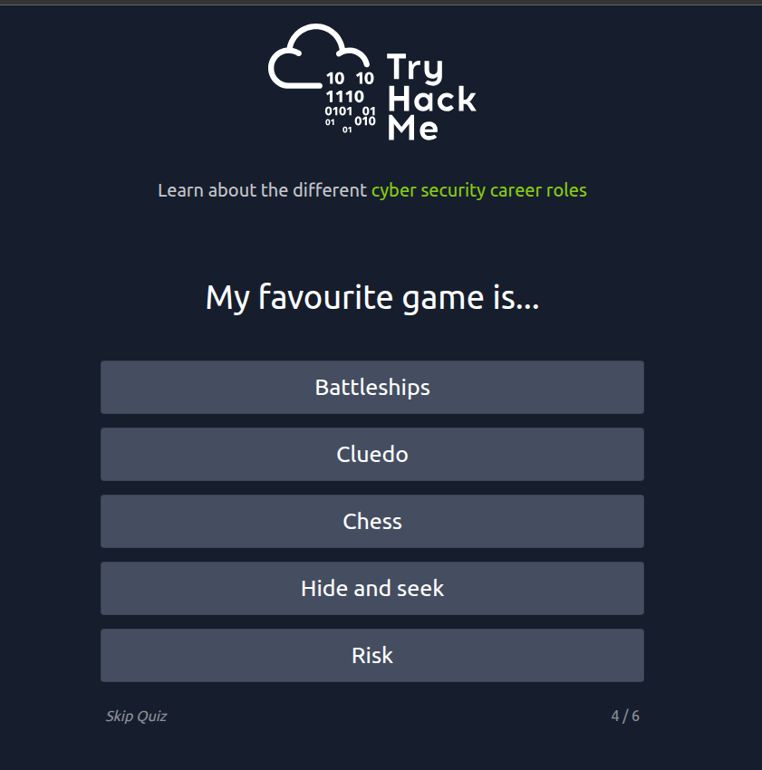
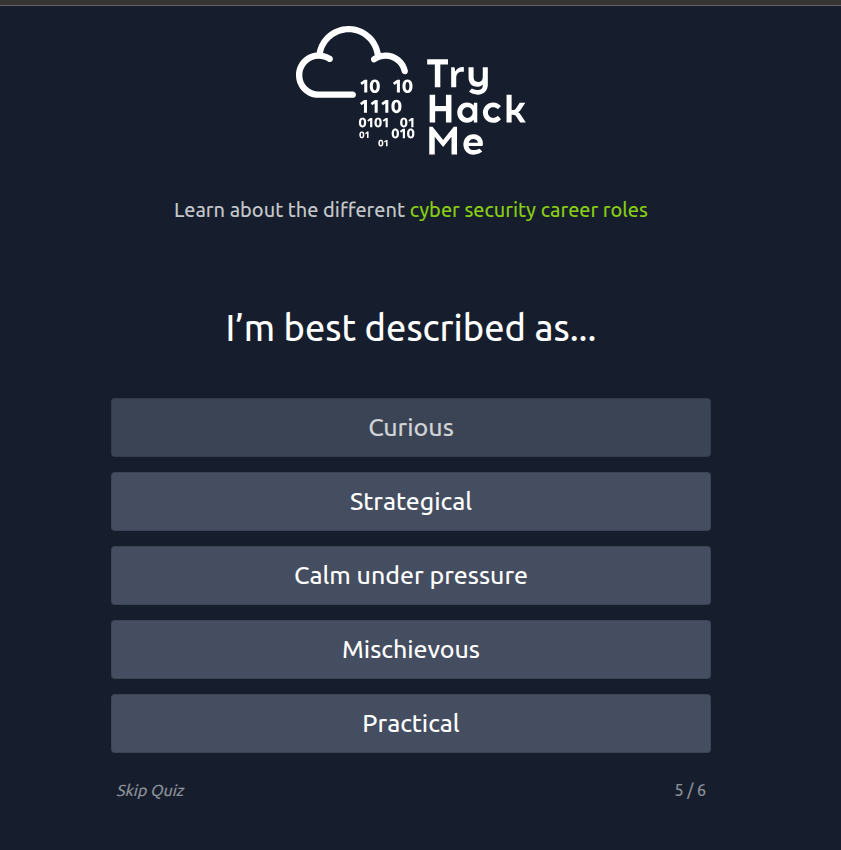

# Careers in Cyber

**Nghề nghiệp trong lĩnh vực An ninh mạng**  

> Tìm hiểu về các nghề nghiệp khác nhau trong lĩnh vực an ninh mạng.

## Mục Lục

1. [Task 1: Introduction](#task-1-introduction)

2. [Task 2: Security Analyst](#task-2-security-analyst)

3. [Task 3: Security Engineer](#task-3-security-engineer)

4. [Task 4: Incident Responder](#task-4-incident-responder)

5. [Task 5: Digital Forensics Examiner](#task-5-digital-forensics-examiner)

6. [Task 6: Malware Analyst](#task-6-malware-analyst)

7. [Task 7: Penetration Tester](#task-7-penetration-tester)

8. [Task 8: Red Teamer](#task-8-red-teamer)

9. [Task 9: Quiz](#task-9-quiz)

## Nội dung

# Task 1: Introduction

**Nghề nghiệp trong lĩnh vực An ninh mạng**  

Các nghề nghiệp trong an ninh mạng đang ngày càng được yêu cầu cao và mang lại mức lương hấp dẫn. Ngành công nghiệp an ninh có rất nhiều công việc khác nhau, từ kiểm thử xâm nhập (pentesting) tấn công (hack hệ thống và báo cáo về các lỗ hổng) đến an ninh phòng thủ (bảo vệ và điều tra các cuộc tấn công mạng).

**Tại sao nên theo đuổi sự nghiệp trong lĩnh vực an ninh mạng?**  

- **Lương cao:** Các công việc trong ngành an ninh mạng có mức lương khởi điểm rất hấp dẫn.  
- **Hấp dẫn:** Công việc có thể bao gồm hack hệ thống hợp pháp hoặc bảo vệ chống lại các cuộc tấn công mạng.  
- **Nhu cầu cao:** Có hơn 3,5 triệu vị trí trong ngành an ninh mạng chưa được lấp đầy.  

Phòng học này sẽ giúp bạn thâm nhập vào lĩnh vực an ninh mạng bằng cách cung cấp thông tin về các vai trò khác nhau trong lĩnh vực này; đồng thời liên kết đến các lộ trình học tập khác nhau để bạn bắt đầu xây dựng kỹ năng an ninh mạng của mình.  

[Đọc thêm](https://tryhackme.com/r/resources/blog/cyber-security-salary-career-options)

# Task 2: Security Analyst

**Nhà phân tích An ninh (Security Analyst)**  

Các nhà phân tích an ninh đóng vai trò quan trọng trong việc xây dựng các biện pháp bảo mật trên toàn tổ chức để bảo vệ công ty khỏi các cuộc tấn công. Họ khám phá và đánh giá mạng lưới của công ty nhằm tìm ra dữ liệu và khuyến nghị hành động để các kỹ sư phát triển các biện pháp phòng ngừa. Vai trò này đòi hỏi làm việc với nhiều bên liên quan khác nhau để hiểu rõ các yêu cầu bảo mật và bối cảnh an ninh.  

---

### **Trách nhiệm chính**  

- Làm việc với các bên liên quan khác nhau để phân tích tình trạng an ninh mạng trong toàn công ty.  
- Tổng hợp các báo cáo liên tục về mức độ an toàn của mạng, ghi chép các vấn đề bảo mật và các biện pháp đã thực hiện để phản hồi.  
- Phát triển các kế hoạch bảo mật, kết hợp nghiên cứu về các công cụ và xu hướng tấn công mới, cũng như các biện pháp cần thiết trên toàn đội để duy trì an toàn dữ liệu.  

---

### **Lộ trình học tập**  

Lộ trình học tập của TryHackMe cung cấp cho bạn cả kiến thức kỹ thuật cơ bản và trải nghiệm thực tế, điều rất cần thiết để trở thành một **Security Analyst** thành công.  

- **[Introduction to Cyber Security](https://tryhackme.com/r/path/outline/introtocyber):** Giới thiệu về An ninh mạng.  
- **[Pre Security](https://tryhackme.com/r/path/outline/presecurity):** Các kiến thức nền tảng trước khi đi sâu vào bảo mật.  
- **[SOC Level 1](https://tryhackme.com/r/path/outline/soclevel1):** Các kỹ năng cấp độ 1 của Trung tâm Điều hành An ninh.  

---

### **Hướng dẫn nghề nghiệp liên quan**  

- **[Becoming a Cyber Security Analyst](https://tryhackme.com/r/careers/cyber-security-analyst):** Trở thành Nhà phân tích An ninh mạng.  
- **[How to Become a Level 1 SOC Analyst](https://tryhackme.com/r/resources/blog/become-level-1-soc-analyst):** Cách trở thành Nhà phân tích SOC cấp độ 1.  
- **[A Day in the Life of a SOC Analyst](https://tryhackme.com/r/resources/blog/interview-with-soc-analyst):** Một ngày làm việc của Nhà phân tích SOC.  
- **[The Ultimate SOC L1 Analyst Interview Guide](https://tryhackme.com/r/resources/blog/soc-analyst-interview-guide):** Hướng dẫn phỏng vấn Nhà phân tích SOC cấp 1.  
- **[From Student to SOC Analyst: Hayden’s Success Story](https://tryhackme.com/r/resources/blog/haydens-success-story):** Câu chuyện thành công của Hayden từ sinh viên đến Nhà phân tích SOC.

# Task 3: Security Engineer

**Kỹ sư Bảo mật (Security Engineer)**  

Kỹ sư bảo mật phát triển và triển khai các giải pháp bảo mật sử dụng dữ liệu về mối đe dọa và lỗ hổng – thường được thu thập từ các thành viên trong nhóm bảo mật. Họ làm việc để giải quyết nhiều loại tấn công khác nhau, bao gồm tấn công ứng dụng web, mối đe dọa mạng, và các xu hướng và chiến thuật đang phát triển. Mục tiêu cuối cùng là duy trì và áp dụng các biện pháp bảo mật để giảm thiểu nguy cơ tấn công và mất dữ liệu.  

---

### **Trách nhiệm chính**  

- Kiểm tra và sàng lọc các biện pháp bảo mật trên phần mềm.  
- Giám sát mạng và báo cáo để cập nhật hệ thống và giảm thiểu các lỗ hổng.  
- Xác định và triển khai các hệ thống cần thiết để đảm bảo an ninh tối ưu.  

---

### **Lộ trình học tập**  

Lộ trình học tập của TryHackMe cung cấp cho bạn cả kiến thức kỹ thuật cơ bản và trải nghiệm thực tế, điều rất cần thiết để trở thành một **Kỹ sư Bảo mật** thành công.  

- **[SOC Level 1](https://tryhackme.com/r/path/outline/soclevel1):** Kỹ năng cấp độ 1 của Trung tâm Điều hành An ninh.  
- **[JR Penetration Tester](https://tryhackme.com/r/path/outline/jrpenetrationtester):** Chuyên gia kiểm tra xâm nhập cấp Junior.  
- **[Offensive Pentesting](https://tryhackme.com/r/path/outline/pentesting):** Tấn công kiểm thử bảo mật.  

---

### **Hướng dẫn nghề nghiệp liên quan**  

- **[Becoming a Security Engineer](https://tryhackme.com/r/careers/security-engineer):** Trở thành một Kỹ sư Bảo mật.  
- **[How to Become a Security Engineer](https://tryhackme.com/r/resources/blog/become-security-engineer):** Cách để trở thành một Kỹ sư Bảo mật.  
- **[A Day in the Life of a Security Engineer](https://tryhackme.com/r/resources/blog/interview-with-security-engineer):** Một ngày làm việc của Kỹ sư Bảo mật.  
- **[Preparing for a Security Engineering Interview](https://tryhackme.com/r/resources/blog/security-engineer-interview-guide):** Chuẩn bị cho buổi phỏng vấn Kỹ sư Bảo mật.  
- **[Becoming a Security Engineer: Richárd’s Success Story](https://tryhackme.com/r/resources/blog/richard-success-story):** Câu chuyện thành công của Richárd trong hành trình trở thành Kỹ sư Bảo mật.

# Task 4: Incident Responder

**Người phản hồi sự cố (Incident Responder)**  

Người phản hồi sự cố làm việc hiệu quả và nhanh chóng để xử lý các vi phạm bảo mật. Trách nhiệm của họ bao gồm tạo ra các kế hoạch, chính sách và quy trình để tổ chức thực hiện trong và sau các sự cố. Đây thường là một vị trí yêu cầu áp lực cao với các đánh giá và phản hồi cần được thực hiện trong thời gian thực, khi các cuộc tấn công đang diễn ra.  

Các chỉ số đánh giá hiệu quả phản hồi sự cố bao gồm:  
- **MTTD (Mean Time to Detect):** Thời gian trung bình để phát hiện.  
- **MTTA (Mean Time to Acknowledge):** Thời gian trung bình để nhận biết.  
- **MTTR (Mean Time to Recover):** Thời gian trung bình để phục hồi (sau cuộc tấn công).  

Mục tiêu là đạt được phản hồi nhanh chóng và hiệu quả, duy trì vị thế tài chính và tránh những tác động tiêu cực từ các cuộc tấn công mạng. Cuối cùng, những người phản hồi sự cố bảo vệ dữ liệu, danh tiếng và tình hình tài chính của công ty khỏi các cuộc tấn công mạng.  

---

### **Trách nhiệm chính**  

- Phát triển và áp dụng một kế hoạch phản hồi sự cố toàn diện và có thể thực hiện được.  
- Duy trì các thực hành bảo mật tốt nhất và hỗ trợ các biện pháp phản hồi sự cố.  
- Báo cáo sau sự cố và chuẩn bị cho các cuộc tấn công trong tương lai, xem xét bài học kinh nghiệm và thích nghi từ các sự cố.  

---

### **Lộ trình học tập**  

Lộ trình học tập của TryHackMe cung cấp cho bạn cả kiến thức kỹ thuật cơ bản và trải nghiệm thực tế, điều rất cần thiết để trở thành một **Incident Responder** thành công.  

- **[SOC Level 1](https://tryhackme.com/r/path/outline/soclevel1):** Kỹ năng cấp độ 1 của Trung tâm Điều hành An ninh.

# Task 5 Digital Forensics Examiner

**Giám định viên pháp y kỹ thuật số**

**Nếu bạn thích làm "thám tử," công việc này có thể là lựa chọn hoàn hảo dành cho bạn.**  

Nếu bạn làm việc trong một bộ phận thực thi pháp luật, bạn sẽ tập trung vào việc thu thập và phân tích bằng chứng để giúp giải quyết tội phạm: buộc tội kẻ phạm tội và minh oan cho người vô tội. Mặt khác, nếu công việc của bạn liên quan đến việc bảo vệ mạng lưới của một công ty, bạn sẽ sử dụng kỹ năng pháp y của mình để phân tích các sự cố, chẳng hạn như các vi phạm chính sách.  

---

### **Trách nhiệm chính**  

- Thu thập bằng chứng kỹ thuật số trong khi tuân thủ các quy trình pháp lý.  
- Phân tích bằng chứng kỹ thuật số để tìm câu trả lời liên quan đến vụ việc.  
- Ghi chép lại các phát hiện của bạn và lập báo cáo về vụ việc.

# Task 6: Malware Analyst

**Công việc của một nhà phân tích phần mềm độc hại (Malware Analyst)**  

Công việc của nhà phân tích phần mềm độc hại bao gồm phân tích các chương trình đáng ngờ, tìm hiểu chúng hoạt động như thế nào và viết báo cáo về các phát hiện của họ. Một nhà phân tích phần mềm độc hại đôi khi được gọi là một kỹ sư đảo ngược (reverse-engineer), vì nhiệm vụ cốt lõi của họ xoay quanh việc chuyển đổi các chương trình đã biên dịch từ ngôn ngữ máy thành mã có thể đọc được, thường là trong ngôn ngữ cấp thấp.  

Công việc này yêu cầu nhà phân tích phần mềm độc hại có nền tảng lập trình vững chắc, đặc biệt là trong các ngôn ngữ cấp thấp như **assembly** và **C language**. Mục tiêu cuối cùng là tìm hiểu tất cả các hoạt động mà một chương trình độc hại thực hiện, cách phát hiện chúng và cách báo cáo chúng.  

---

### **Trách nhiệm chính**  

- Thực hiện phân tích tĩnh các chương trình độc hại, bao gồm cả kỹ thuật đảo ngược (reverse-engineering).  
- Tiến hành phân tích động các mẫu phần mềm độc hại bằng cách quan sát các hoạt động của chúng trong môi trường được kiểm soát.  
- Ghi chép và báo cáo tất cả các phát hiện.

# Task 7: Penetration Tester

**Kiểm thử xâm nhập (Penetration Testing)**  

Bạn có thể thấy kiểm thử xâm nhập (penetration testing) được gọi là pentesting hoặc hacking có đạo đức (ethical hacking). Vai trò của một kiểm thử viên xâm nhập (Penetration Tester) là kiểm tra tính bảo mật của các hệ thống và phần mềm trong một công ty. Điều này được thực hiện bằng cách cố gắng phát hiện các lỗ hổng thông qua hacking có hệ thống.  

Kiểm thử viên xâm nhập khai thác các lỗ hổng này để đánh giá rủi ro trong từng trường hợp cụ thể. Sau đó, công ty có thể sử dụng những phát hiện này để khắc phục các vấn đề và ngăn chặn các cuộc tấn công mạng trong thực tế.  

---

### **Trách nhiệm chính**  

- Tiến hành kiểm tra trên các hệ thống máy tính, mạng, và ứng dụng web.  
- Thực hiện đánh giá bảo mật, kiểm tra, và phân tích chính sách.  
- Đánh giá và báo cáo các phát hiện, đề xuất các biện pháp phòng ngừa tấn công.  

---

### **Lộ trình học tập**  

Lộ trình học tập của TryHackMe cung cấp cả kiến thức kỹ thuật cơ bản và trải nghiệm thực tế, điều rất cần thiết để trở thành một **Penetration Tester** thành công.  

- **[JR Penetration Tester](https://tryhackme.com/r/path/outline/jrpenetrationtester):** Kiểm thử viên xâm nhập cấp Junior.  
- **[Offensive Pentesting](https://tryhackme.com/r/path/outline/pentesting):** Kiểm thử tấn công bảo mật.  

---

### **Hướng dẫn nghề nghiệp liên quan**  

- **[Becoming a Penetration Tester](https://tryhackme.com/r/careers/penetration-tester):** Trở thành một kiểm thử viên xâm nhập.  
- **[How to Become a Penetration Tester](https://tryhackme.com/r/resources/blog/how-to-become-a-penetration-tester):** Làm thế nào để trở thành một kiểm thử viên xâm nhập.  
- **[Preparing for a Junior Penetration Tester Interview](https://tryhackme.com/r/resources/blog/jr-pentester-interview-guide):** Chuẩn bị cho buổi phỏng vấn kiểm thử viên xâm nhập cấp Junior.  
- **[From IT Support to Pentester: Tom’s Success Story](https://tryhackme.com/r/resources/blog/tom-success-story):** Câu chuyện thành công của Tom: Từ hỗ trợ CNTT đến kiểm thử viên xâm nhập.

# Task 8: Red Teamer

**Đội Red Team (Red Teamers)**  

Các thành viên **Red Team** có nhiều điểm tương đồng với kiểm thử viên xâm nhập (Penetration Testers), nhưng vai trò của họ tập trung hơn. Kiểm thử viên xâm nhập tìm cách phát hiện nhiều lỗ hổng trên các hệ thống để đảm bảo khả năng phòng thủ mạng. Trong khi đó, **Red Teamers** được triển khai để kiểm tra khả năng phát hiện và ứng phó của công ty.  

Vai trò này yêu cầu bắt chước hành vi của tội phạm mạng, mô phỏng các cuộc tấn công độc hại, duy trì quyền truy cập và tránh bị phát hiện. Các đánh giá của đội Red Team có thể kéo dài lên đến một tháng, thường được thực hiện bởi một nhóm bên ngoài công ty. Họ thường phù hợp nhất với các tổ chức đã có chương trình bảo mật trưởng thành.  

---

### **Trách nhiệm chính**  

- Mô phỏng vai trò của một tác nhân đe dọa để tìm ra các lỗ hổng có thể khai thác, duy trì quyền truy cập và tránh bị phát hiện.  
- Đánh giá các biện pháp kiểm soát an ninh, tình báo mối đe dọa và quy trình ứng phó sự cố của tổ chức.  
- Đánh giá và báo cáo các phát hiện, cung cấp dữ liệu hành động để các công ty tránh các tình huống thực tế.  

---

### **Lộ trình học tập**  

Lộ trình học tập của TryHackMe cung cấp cả kiến thức kỹ thuật cơ bản và trải nghiệm thực tế, điều rất cần thiết để trở thành một **Red Teamer** thành công.  

- **[JR Penetration Tester](https://tryhackme.com/r/path/outline/jrpenetrationtester):** Kiểm thử viên xâm nhập cấp Junior.  
- **[Offensive Pentesting](https://tryhackme.com/r/path/outline/pentesting):** Kiểm thử tấn công bảo mật.  
- **[Red Teamer](https://tryhackme.com/r/path/outline/redteaming):** Chuyên gia Red Team.  

---

### **Hướng dẫn nghề nghiệp liên quan**  

- **[Red Teaming: Job Roles, Salaries & Opportunities](https://tryhackme.com/r/resources/blog/red-teaming-jobs-salaries-opportunities):** Hướng dẫn về vai trò, mức lương và cơ hội cho đội Red Team.

# Task 9: Quiz

Phòng này cung cấp cho bạn cái nhìn tổng quan về các nghề nghiệp khác nhau trong lĩnh vực an ninh mạng. Đừng quên rằng bạn có thể tận dụng đào tạo trực tuyến để có được công việc mơ ước trong lĩnh vực an ninh mạng. Để tìm ra vai trò an ninh mạng nào phù hợp nhất với bạn, hãy thử làm bài kiểm tra thú vị của chúng tôi

