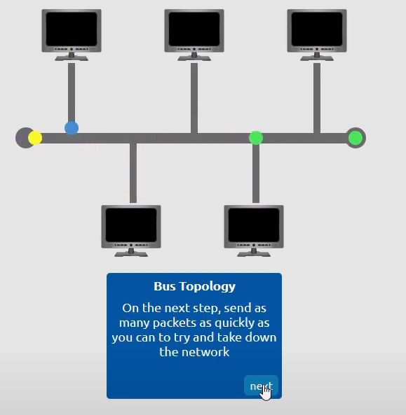

# Intro to LAN

## Mục Lục

1. [Task 1: Introducing LAN Topologies](#task-1-introducing-lan-topologies)

2. [Task 2: A Primer on Subnetting](#task-2-a-primer-on-subnetting)

3. [Task 3: The ARP Protocol](#task-3-the-arp-protocol)

4. [Task 4: The DHCP Protocol](#task-4-the-dhcp-protocol)

## Nội dung

# Task 1: Introducing LAN Topologies

## **Giới thiệu về các loại hình mạng LAN (LAN Topologies)**

Trong nhiều năm, đã có các thử nghiệm và triển khai các thiết kế mạng khác nhau. Khi đề cập đến mạng, thuật ngữ "topology" (hình học mạng) thực chất là nói về thiết kế hoặc cấu trúc của mạng đang được sử dụng. Hãy cùng thảo luận về những ưu điểm và nhược điểm của các loại hình mạng dưới đây.

### **Hình sao (Star Topology)**

Ý tưởng chính của **mạng hình sao** là các thiết bị được kết nối riêng biệt thông qua một thiết bị mạng trung tâm, chẳng hạn như **switch** hoặc **hub**. Loại hình mạng này rất phổ biến ngày nay vì tính **đáng tin cậy** và **khả năng mở rộng** – mặc dù chi phí có thể cao.

---

**Ưu điểm:**  
- Mọi thông tin được gửi đến thiết bị trong mô hình này đều thông qua thiết bị trung tâm mà nó kết nối.  
- Dễ dàng thêm các thiết bị mới khi nhu cầu mạng tăng lên, nhờ khả năng mở rộng tốt.  

---

**Nhược điểm:**  
- Do cần nhiều dây cáp hơn và phải mua thiết bị mạng chuyên dụng, chi phí cho loại hình này cao hơn so với các loại hình khác.  
- Càng mở rộng mạng, việc bảo trì càng khó khăn hơn để giữ mạng hoạt động hiệu quả.  
- Nếu thiết bị trung tâm kết nối các thiết bị bị lỗi, các thiết bị khác sẽ không thể gửi hoặc nhận dữ liệu.  

May mắn thay, các thiết bị phần cứng trung tâm thường rất mạnh mẽ, giúp giảm thiểu khả năng lỗi nghiêm trọng.  

### **Hình tuyến (Bus Topology)**

Loại kết nối này dựa trên một kết nối duy nhất được gọi là **cáp xương sống (backbone cable)**. Loại hình topology này tương tự như các lá của một cái cây, nơi các thiết bị (lá) phân nhánh từ thân cây trên cáp này.

---

**Ưu điểm:**  
- **Chi phí thấp và dễ thiết lập:** Đây là một trong những loại topology dễ cài đặt nhất và có chi phí thấp hơn, vì chỉ cần sử dụng dây cáp hoặc thiết bị mạng cơ bản để kết nối các thiết bị.

---

**Nhược điểm:**  
1. **Hiệu suất thấp:** Vì tất cả dữ liệu dành cho mỗi thiết bị đều truyền dọc theo cùng một cáp, hiệu suất của mạng rất nhanh chóng trở nên **chậm** và **tắc nghẽn** nếu nhiều thiết bị trong mạng đồng thời yêu cầu dữ liệu.  
2. **Khó khắc phục sự cố:** Tắc nghẽn dữ liệu khiến việc khắc phục sự cố trở nên rất khó khăn vì rất khó xác định thiết bị nào gặp vấn đề khi tất cả dữ liệu đều truyền trên cùng một tuyến.  
3. **Không có khả năng dự phòng:** Nếu có lỗi xảy ra trên cáp xương sống, toàn bộ mạng sẽ bị ảnh hưởng. Các thiết bị sẽ không thể nhận hoặc truyền dữ liệu dọc theo tuyến.  

---

Cuối cùng, một hạn chế khác của mạng hình tuyến là khả năng dự phòng thấp trong trường hợp xảy ra lỗi. Đây là do chỉ có một điểm lỗi duy nhất trên cáp xương sống. Nếu cáp này bị đứt, các thiết bị sẽ không còn khả năng nhận hoặc truyền dữ liệu qua tuyến nữa.  

### **Hình vòng (Ring Topology)**

**Mạng hình vòng** (còn được gọi là **token topology**) có một số đặc điểm tương tự các topology khác. Các thiết bị như máy tính được kết nối trực tiếp với nhau để tạo thành một vòng lặp, điều này có nghĩa là cần rất ít dây cáp và ít phụ thuộc vào phần cứng chuyên dụng, như trong mạng hình sao.

---

**Cách hoạt động:**  
Mạng hình vòng hoạt động bằng cách truyền dữ liệu dọc theo vòng cho đến khi dữ liệu đến thiết bị đích, sử dụng các thiết bị khác trong vòng để chuyển tiếp dữ liệu. Điểm thú vị là một thiết bị trong topology này chỉ nhận dữ liệu từ thiết bị khác nếu nó không có dữ liệu nào để gửi. Nếu thiết bị có dữ liệu để gửi, nó sẽ gửi dữ liệu của mình trước khi chuyển tiếp dữ liệu từ thiết bị khác.

---

**Ưu điểm:**  
- **Dễ khắc phục sự cố:** Do chỉ có một hướng duy nhất để dữ liệu di chuyển qua mạng này, việc xác định và sửa lỗi phát sinh khá dễ dàng.  
- **Ít tắc nghẽn hơn:** So với mạng hình tuyến (bus topology), lượng dữ liệu lớn không di chuyển qua mạng cùng lúc, giúp giảm tắc nghẽn.  

---

**Nhược điểm:**  
1. **Hiệu suất không cao:** Đây là con dao hai lưỡi, vì cách truyền dữ liệu này không phải là cách hiệu quả nhất. Dữ liệu có thể phải đi qua nhiều thiết bị trước khi đến đích mong muốn.  
2. **Điểm lỗi duy nhất:** Nếu một sự cố như cáp bị cắt hoặc một thiết bị bị hỏng xảy ra, toàn bộ mạng sẽ bị gián đoạn.  

--- 

Mặc dù thiết kế của mạng hình vòng giúp giảm tắc nghẽn, nhưng nó vẫn phụ thuộc nhiều vào việc đảm bảo không có thiết bị hoặc phần cáp nào bị lỗi.  

## Switch là gì?

Switch là các thiết bị chuyên dụng trong một mạng được thiết kế để tập hợp nhiều thiết bị khác như máy tính, máy in hoặc bất kỳ thiết bị hỗ trợ mạng nào khác sử dụng Ethernet. Các thiết bị này được cắm vào cổng của switch. Switch thường được tìm thấy trong các mạng lớn hơn như doanh nghiệp, trường học hoặc các mạng có quy mô tương tự, nơi có nhiều thiết bị cần kết nối với mạng. Switch có thể kết nối một số lượng lớn thiết bị thông qua các cổng 4, 8, 16, 24, 32 và 64.

Switch hiệu quả hơn nhiều so với các thiết bị tiền nhiệm của chúng (hubs/repeaters). Switch theo dõi thiết bị nào được kết nối với cổng nào. Do đó, khi nhận được một gói dữ liệu, thay vì lặp lại gói đó đến mọi cổng như hub sẽ làm, nó chỉ gửi đến mục tiêu dự định, từ đó giảm lưu lượng mạng.

Cả Switch và Router đều có thể kết nối với nhau. Khả năng làm điều này làm tăng tính dự phòng (độ tin cậy) của mạng bằng cách thêm nhiều đường dẫn cho dữ liệu. Nếu một đường dẫn gặp sự cố, một đường khác có thể được sử dụng. Mặc dù điều này có thể làm giảm hiệu suất tổng thể của mạng vì các gói phải di chuyển lâu hơn, nhưng mạng không bị gián đoạn – một cái giá nhỏ để trả xét đến các lựa chọn thay thế khác.

## Router là gì?

Router có nhiệm vụ kết nối các mạng và truyền dữ liệu giữa chúng. Nó thực hiện điều này bằng cách sử dụng định tuyến (routing - do đó mới có tên router!).  

Định tuyến là thuật ngữ dùng để chỉ quá trình dữ liệu di chuyển qua các mạng. Định tuyến bao gồm việc tạo một đường dẫn giữa các mạng để dữ liệu có thể được truyền tải thành công.  

Định tuyến rất hữu ích khi các thiết bị được kết nối bằng nhiều đường dẫn, như trong sơ đồ minh họa dưới đây.  

---

## Thực hành  
Đính kèm trong nhiệm vụ này là một bài thực hành tương tác về các mô hình LAN đã thảo luận. Tìm hiểu về các cách khác nhau mà chúng dễ bị phá vỡ. Phá vỡ các mô hình LAN để nhận flag.  

1 – LAN viết tắt của từ gì?  

  
Hiển thị đáp án

  Đáp án: Local Area Network

2 – Động từ nào được dùng để mô tả công việc mà Router thực hiện?  

  
Hiển thị đáp án

  Đáp án: Routing

3 – Thiết bị nào được sử dụng để kết nối trung tâm nhiều thiết bị trong mạng cục bộ và truyền dữ liệu đến đúng vị trí?  

  
Hiển thị đáp án

  Đáp án: Switch

4 – Mô hình mạng nào tiết kiệm chi phí để thiết lập?  

  
Hiển thị đáp án

  Đáp án: Bus Topology

5 – Mô hình mạng nào tốn kém để thiết lập và duy trì?  

  
Hiển thị đáp án

  Đáp án: Star Topology

6 – Hoàn thành bài thực hành tương tác được đính kèm trong nhiệm vụ này. Flag nào được cung cấp ở cuối?  

- Topology Vòng (Ring Topology)

Trong mô hình vòng, tất cả các thiết bị được kết nối với hai thiết bị khác để tạo thành một vòng tròn hoàn chỉnh.  

Các gói dữ liệu di chuyển từ một thiết bị đến thiết bị kế tiếp cho đến khi chúng đến được đích.

Một trong những nhược điểm lớn của topology vòng là nếu một thiết bị gặp sự cố hoặc cáp bị đứt, dữ liệu sẽ không thể truyền đi được nữa.

Nếu bạn di chuột qua giữa cáp mạng, bạn có thể cắt nó và xem điều gì sẽ xảy ra với các gói dữ liệu.

Các gói dữ liệu hiện không thể di chuyển quanh mạng được nữa và không thiết bị nào có thể giao tiếp với nhau.

---

- Topology Bus

Với topology bus, tất cả các thiết bị đều được kết nối với một cáp duy nhất, thường được gọi là "backbone".

Dữ liệu được gửi theo cả hai hướng trái và phải dọc theo backbone cho đến khi gói tin đến được đích.

Một nhược điểm lớn của topology bus là nó không thể xử lý một lượng lớn dữ liệu.

Ở bước tiếp theo, hãy gửi nhiều gói tin (packets) nhanh nhất có thể để thử làm ngắt kết nối mạng.

Và kết quả 

- Topology Sao  

Trong topology sao, tất cả các thiết bị được kết nối với cáp riêng của chúng tới một switch/hub trung tâm.

Mọi gói dữ liệu được gửi qua switch này, điều này có nghĩa là nếu switch bị hỏng, mạng sẽ không thể hoạt động nữa.

Mạng hiện đã ngừng hoạt động.

  
Hiển thị đáp án

  Đáp án: THM{TOPOLOGY_FLAWS}

# Task 2: A Primer on Subnetting

## **Giới Thiệu Về Subnetting**

Như đã thảo luận trước đó trong module, mạng có thể được tìm thấy với mọi hình dạng và kích thước - từ nhỏ đến lớn. **Subnetting** là thuật ngữ chỉ việc chia một mạng thành các mạng nhỏ hơn, giống như chia một chiếc bánh cho bạn bè của bạn. Chỉ có một lượng bánh nhất định, và ai cũng muốn một phần. Subnetting là cách bạn quyết định ai sẽ nhận phần nào và dành riêng một phần của "chiếc bánh ẩn dụ" này.

Lấy một doanh nghiệp làm ví dụ, bạn sẽ có các phòng ban khác nhau như:  
- Kế toán  
- Tài chính  
- Nhân sự

Trong thực tế, bạn biết cách gửi thông tin đến đúng bộ phận, thì trong mạng máy tính, mạng cũng cần biết điều này. Các quản trị viên mạng sử dụng phương pháp chia subnet (subnetting) để phân loại và gán các phần cụ thể của mạng nhằm phản ánh điều đó.

Subnetting được thực hiện bằng cách chia nhỏ số lượng host có thể tồn tại trong một mạng, được biểu diễn bằng một giá trị gọi là **subnet mask** (mặt nạ mạng con). Hãy cùng quay lại sơ đồ từ phần đầu tiên của mô-đun này:

Như chúng ta có thể nhớ, một địa chỉ IP được tạo thành từ bốn phần gọi là **octet**. Tương tự, **subnet mask** cũng được biểu diễn dưới dạng một số bao gồm bốn byte (32 bit), với giá trị trong khoảng từ 0 đến 255 (0-255).

Các subnet sử dụng địa chỉ IP theo ba cách khác nhau:

- Xác định địa chỉ mạng (**network address**).
- Xác định địa chỉ host (**host address**).
- Xác định cổng mặc định (**default gateway**).

Hãy chia ba phần này ra để hiểu rõ mục đích của chúng trong bảng dưới đây: 

| Loại             | Mục đích                                                                                 | Giải thích                                                                                                                                           | Ví dụ           |
|-------------------|------------------------------------------------------------------------------------------|-------------------------------------------------------------------------------------------------------------------------------------------------------|-----------------|
| Địa chỉ Mạng      | Địa chỉ này xác định điểm bắt đầu của mạng thực tế và được sử dụng để nhận dạng sự tồn tại của một mạng. | Ví dụ: Một thiết bị có địa chỉ IP 192.168.1.100 sẽ thuộc về mạng được xác định bởi 192.168.1.0                                                        | 192.168.1.0     |
| Địa chỉ Máy Chủ   | Địa chỉ IP ở đây được sử dụng để nhận dạng một thiết bị trong mạng con.                   | Ví dụ: Một thiết bị sẽ có địa chỉ máy chủ là 192.168.1.1                                                                                             | 192.168.1.100   |
| Cổng Mặc Định  (Default Gateway)   | Địa chỉ cổng mặc định là một địa chỉ đặc biệt được gán cho thiết bị trên mạng có khả năng gửi thông tin đến mạng khác. | Bất kỳ dữ liệu nào cần được gửi đến một thiết bị không nằm trong cùng mạng (ví dụ: không thuộc 192.168.1.0) sẽ được gửi tới thiết bị này. Những thiết bị này thường sử dụng địa chỉ đầu tiên hoặc cuối cùng trong mạng (như .1 hoặc .254). | 192.168.1.254   |

Trong các mạng nhỏ, chẳng hạn như mạng tại nhà, bạn sẽ chỉ cần một subnet vì khả năng cần hơn 254 thiết bị kết nối cùng lúc là rất thấp.

Tuy nhiên, ở những nơi như doanh nghiệp và văn phòng, nơi có nhiều thiết bị hơn (PC, máy in, camera và cảm biến), subnetting sẽ được sử dụng.

**Subnetting** mang lại nhiều lợi ích, bao gồm:

- Hiệu quả (**Efficiency**).
- Bảo mật (**Security**).
- Kiểm soát toàn diện (**Full control**).

Chúng ta sẽ tìm hiểu chi tiết cách subnetting mang lại những lợi ích này vào một thời điểm sau. Tuy nhiên, hiện tại, điều cần hiểu là yếu tố bảo mật của nó. Hãy lấy ví dụ về một quán cà phê điển hình:

1. Một mạng dành cho nhân viên, máy tính tiền và các thiết bị khác trong cơ sở.
2. Một mạng dành cho công chúng để sử dụng như điểm truy cập (**hotspot**).

Subnetting cho phép bạn tách biệt hai trường hợp sử dụng này, đồng thời vẫn tận hưởng lợi ích của việc kết nối với các mạng lớn hơn, chẳng hạn như Internet.

## **Câu hỏi**

Câu hỏi 1 – Thuật ngữ kỹ thuật để chia một mạng thành các phần nhỏ hơn là gì?  

  
  
Hiển thị đáp án
  
  Đáp án: Subnetting  

  

Câu hỏi 2 – Một subnet mask có bao nhiêu bit?  

  
  
Hiển thị đáp án
  
  Đáp án: 32  

  

Câu hỏi 3 – Phạm vi của một phần (octet) trong subnet mask là gì?  

  
  
Hiển thị đáp án
  
  Đáp án: 0-255  

  

Câu hỏi 4 – Địa chỉ nào được sử dụng để xác định điểm bắt đầu của một mạng?  

  
  
Hiển thị đáp án
  
  Đáp án: Network Address  

  

Câu hỏi 5 – Địa chỉ nào được sử dụng để xác định các thiết bị trong một mạng?  

  
  
Hiển thị đáp án
  
  Đáp án: Host Address  

  

Câu hỏi 6 – Tên gọi của thiết bị chịu trách nhiệm gửi dữ liệu đến một mạng khác là gì?  

  
  
Hiển thị đáp án
  
  Đáp án: Default Gateway  

  

# Task 3: The ARP Protocol

**Giao thức ARP**

Hồi tưởng lại từ các nhiệm vụ trước, chúng ta biết rằng các thiết bị có thể có hai định danh: một địa chỉ MAC và một địa chỉ IP. Giao thức ARP, hay **Address Resolution Protocol**, là công nghệ chịu trách nhiệm cho phép các thiết bị tự nhận dạng trong một mạng.

Một cách đơn giản, giao thức ARP cho phép một thiết bị liên kết địa chỉ MAC của nó với một địa chỉ IP trong mạng. Mỗi thiết bị trong một mạng sẽ duy trì một bản ghi các địa chỉ MAC liên kết với các thiết bị khác.

Khi các thiết bị muốn giao tiếp với nhau, chúng sẽ gửi một **broadcast** đến toàn bộ mạng để tìm kiếm thiết bị cụ thể. Các thiết bị có thể sử dụng giao thức ARP để tìm địa chỉ MAC (và do đó là định danh vật lý) của thiết bị cần liên lạc.

## Giao thức ARP hoạt động như thế nào?

Mỗi thiết bị trong mạng có một bảng để lưu trữ thông tin, được gọi là **cache**. Trong ngữ cảnh của giao thức ARP, bảng cache này lưu trữ các định danh của các thiết bị khác trong mạng.

Để ánh xạ hai định danh này (địa chỉ IP và địa chỉ MAC), giao thức ARP gửi hai loại thông điệp:

1. **ARP Request**  
2. **ARP Reply**

Khi một **ARP Request** được gửi, một thông điệp được phát (broadcast) đến tất cả các thiết bị khác trên mạng, yêu cầu kiểm tra xem địa chỉ MAC của thiết bị có khớp với địa chỉ IP được yêu cầu hay không. Nếu thiết bị đó có địa chỉ IP được yêu cầu, một **ARP Reply** sẽ được gửi trở lại cho thiết bị ban đầu để xác nhận. Thiết bị ban đầu sẽ ghi nhớ thông tin này và lưu trữ nó trong bảng cache của mình (một mục nhập ARP - ARP entry).

Quá trình này được minh họa trong sơ đồ bên dưới:

## Câu hỏi

**Câu hỏi 1 – ARP là viết tắt của gì?**  

  
  
Hiển thị đáp án
  
  Đáp án: Address Resolution Protocol  

  

**Câu hỏi 2 – Loại gói tin ARP nào yêu cầu một thiết bị kiểm tra xem nó có một địa chỉ IP cụ thể hay không?**  

  
  
Hiển thị đáp án
  
  Đáp án: Request  

  

**Câu hỏi 3 – Địa chỉ nào được sử dụng làm định danh vật lý cho một thiết bị trong mạng?**  

  
  
Hiển thị đáp án
  
  Đáp án: MAC Address  

  

**Câu hỏi 4 – Địa chỉ nào được sử dụng làm định danh logic cho một thiết bị trong mạng?**  

  
  
Hiển thị đáp án
  
  Đáp án: IP Address  

  

# Task 4: The DHCP Protocol

**Giao thức DHCP**

## Khái niệm

Địa chỉ IP có thể được gán theo hai cách: bằng cách nhập thủ công vào thiết bị hoặc tự động, phổ biến nhất là sử dụng máy chủ **DHCP** (Dynamic Host Configuration Protocol). Khi một thiết bị kết nối với mạng, nếu chưa được gán địa chỉ IP thủ công, nó sẽ gửi một yêu cầu (**DHCP Discover**) để kiểm tra xem có máy chủ DHCP nào trên mạng hay không.  

Máy chủ DHCP sau đó phản hồi với một địa chỉ IP mà thiết bị có thể sử dụng (**DHCP Offer**). Thiết bị sẽ gửi lại phản hồi xác nhận rằng nó muốn sử dụng địa chỉ IP được cung cấp (**DHCP Request**), và cuối cùng, máy chủ DHCP gửi một thông báo xác nhận rằng quá trình này đã hoàn tất (**DHCP ACK**). Sau đó, thiết bị có thể bắt đầu sử dụng địa chỉ IP đó. 

## Câu hỏi

**Câu hỏi 1 – Loại gói tin DHCP nào được một thiết bị sử dụng để lấy một địa chỉ IP?**  

  
  
Hiển thị đáp án
  
  Đáp án: DHCP Discover  

  

**Câu hỏi 2 – Loại gói tin DHCP nào được một thiết bị gửi sau khi nhận được địa chỉ IP từ máy chủ DHCP?**  

  
  
Hiển thị đáp án
  
  Đáp án: DHCP Request  

  

**Câu hỏi 3 – Cuối cùng, gói tin DHCP nào được máy chủ DHCP gửi đến thiết bị để hoàn tất quá trình cấp phát địa chỉ IP?**  

  
  
Hiển thị đáp án
  
  Đáp án: DHCP Ack  

  
