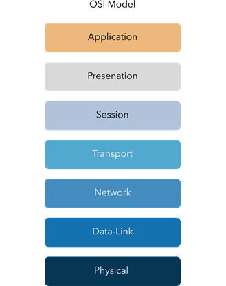

# OSI Model

> Tìm hiểu về khung cơ bản của mạng (networking framework) xác định các giai đoạn khác nhau trong đó dữ liệu được xử lý trên một mạng.

## Mục Lục

1. [Task 1: What is the OSI Model?](#task-1-what-is-the-osi-model)
2. [Task 2: Layer 7 - Application](#task-2-layer-7---application)
3. [Task 3: Layer 6 - Presentation](#task-3-layer-6---presentation)
4. [Task 4: Layer 5 - Session](#task-4-layer-5---session)
5. [Task 5: Layer 4 - Transport](#task-5-layer-4---transport)
6. [Task 6: Layer 3 - Network](#task-6-layer-3---network)
7. [Task 7: Layer 2 - Data Link](#task-7-layer-2---data-link)
8. [Task 8: Layer 1 - Physical](#task-8-layer-1---physical)
9. [Task 9: Practical - OSI Game](#task-9-practical---osi-game)

## Nội dung

# Task 1: What is the OSI Model?

**Mô hình OSI**  

Mô hình OSI (viết tắt của **Open Systems Interconnection Model**) là một mô hình cơ bản và quan trọng được sử dụng trong lĩnh vực mạng máy tính. Mô hình quan trọng này cung cấp một khung lý thuyết quy định cách tất cả các thiết bị mạng gửi, nhận và diễn giải dữ liệu.

Một trong những lợi ích chính của mô hình OSI là các thiết bị có thể có các chức năng và thiết kế khác nhau trong một mạng nhưng vẫn có thể giao tiếp với các thiết bị khác. Dữ liệu được gửi qua mạng tuân theo sự thống nhất của mô hình OSI có thể được các thiết bị khác hiểu được.

Mô hình OSI bao gồm **bảy lớp** được minh họa trong sơ đồ dưới đây. Mỗi lớp đảm nhận một tập hợp trách nhiệm khác nhau và được sắp xếp từ **Lớp 7 đến Lớp 1**.

Ở mỗi lớp mà dữ liệu đi qua, các quy trình cụ thể sẽ diễn ra và những thông tin bổ sung sẽ được thêm vào dữ liệu. Đây chính là quá trình mà chúng ta sẽ thảo luận trong các nhiệm vụ tiếp theo trong phần này. Tuy nhiên, hiện tại, chúng ta chỉ cần hiểu rằng quá trình này được gọi là **encapsulation** (đóng gói) và mô hình OSI trông như thế nào qua sơ đồ dưới đây:  

**Đây là một khái niệm rất quan trọng trong các khái niệm về mạng. Việc ghi nhớ các lớp theo đúng thứ tự được khuyến nghị mạnh mẽ.**

**Mẹo:** Hãy ghi nhớ câu này — **"Anxious Pale Ceaser Treated Nervous Drunks Patiently."**  

Bây giờ, chữ cái đầu tiên của mỗi từ trong câu tương ứng với mỗi lớp trong mô hình OSI:

- **A** → Application (Lớp 7 - Ứng dụng)  
- **P** → Presentation (Lớp 6 - Trình bày)  
- **C** → Session (Lớp 5 - Phiên)  
- **T** → Transport (Lớp 4 - Vận chuyển)  
- **N** → Network (Lớp 3 - Mạng)  
- **D** → Data Link (Lớp 2 - Liên kết dữ liệu)  
- **P** → Physical (Lớp 1 - Vật lý)  

Cách ghi nhớ này sẽ giúp bạn dễ dàng nhớ các lớp trong mô hình OSI theo đúng thứ tự!

**Câu hỏi:**  

**1. "OSI" trong "Mô hình OSI" là viết tắt của gì?**  

  
  
Hiển thị đáp án
  
  Đáp án: Open System Interconnection 

  

**2. Mô hình OSI có bao nhiêu lớp (số dạng chữ số)?**  

  
  
Hiển thị đáp án
  
  Đáp án: 7

  

**3. Thuật ngữ chính cho quá trình khi các mảnh thông tin được thêm vào dữ liệu là gì?**  

  
  
Hiển thị đáp án
  
  Đáp án: Encapsulation

  

# Task 2: Layer 7 - Application

**Lớp ứng dụng (Application Layer) của mô hình OSI** là lớp mà bạn sẽ quen thuộc nhất. Điều này là vì lớp ứng dụng là nơi các giao thức và quy tắc được thiết lập để xác định cách người dùng tương tác với dữ liệu được gửi hoặc nhận.

Các ứng dụng hàng ngày như trình duyệt email, trình duyệt web hoặc phần mềm duyệt máy chủ tệp như FileZilla cung cấp giao diện đồ họa thân thiện (Graphical User Interface - GUI) để người dùng dễ dàng tương tác với dữ liệu được gửi hoặc nhận. Ngoài ra, còn có các giao thức khác như **DNS (Domain Name System)**, là cách các địa chỉ trang web được chuyển đổi thành địa chỉ IP.

**Câu hỏi:**  

**1. Tên của lớp này là gì?**  

  
  
Hiển thị đáp án
  
  Đáp án: Application  

  

**2. Thuật ngữ kỹ thuật nào được dùng để gọi tên phần mềm mà người dùng tương tác?**  

  
  
Hiển thị đáp án
  
  Đáp án: Graphical User Interface 

  

# Task 3: Layer 6 - Presentation

**Lớp 6 của mô hình OSI** là lớp mà việc chuẩn hóa bắt đầu được thực hiện. Vì các nhà phát triển phần mềm có thể phát triển bất kỳ phần mềm nào, chẳng hạn như ứng dụng email, theo cách khác nhau, dữ liệu vẫn cần được xử lý theo cùng một cách — bất kể phần mềm hoạt động như thế nào.

Lớp này hoạt động như một bộ dịch cho dữ liệu đi đến và đi từ lớp ứng dụng (lớp 7). Máy tính nhận sẽ hiểu dữ liệu được gửi đến từ một máy tính khác, dù định dạng ban đầu và định dạng đích là khác nhau. Ví dụ, khi bạn gửi một email, người nhận có thể sử dụng một ứng dụng email khác với bạn, nhưng nội dung email vẫn cần hiển thị giống nhau.

Các tính năng bảo mật như mã hóa dữ liệu (chẳng hạn như HTTPS khi truy cập trang web an toàn) xảy ra tại lớp này.

**Câu hỏi:**  

**1. Tên của lớp này là gì?**  

  
  
Hiển thị đáp án
  
  Đáp án: Presentation  

  

**2. Mục đích chính mà lớp này đảm nhận là gì?**  

  
  
Hiển thị đáp án
  
  Đáp án: Translator  

  

# Task 4: Layer 5 - Session

**Khi dữ liệu đã được dịch hoặc định dạng đúng từ lớp trình bày - Presentation (lớp 6), lớp phiên - Session (lớp 5) sẽ bắt đầu tạo kết nối với máy tính khác mà dữ liệu được gửi đến.** Khi kết nối được thiết lập, một phiên làm việc (**session**) sẽ được tạo. Khi kết nối hoạt động, phiên làm việc cũng sẽ hoạt động.

Lớp phiên (**Session Layer**) đồng bộ hóa hai máy tính để đảm bảo rằng chúng đang ở cùng một trạng thái trước khi dữ liệu được gửi và nhận. Sau khi các kiểm tra này được thực hiện, lớp phiên sẽ bắt đầu chia nhỏ dữ liệu được gửi thành các phần nhỏ hơn và bắt đầu gửi từng phần nhỏ này (gói tin - **packets**) lần lượt. Việc chia nhỏ này rất hữu ích vì nếu kết nối bị mất, chỉ những phần dữ liệu chưa được gửi sẽ phải gửi lại — không phải toàn bộ dữ liệu (hãy tưởng tượng như việc tải lại một tệp lưu trong trò chơi điện tử).

Điều đáng chú ý là các phiên làm việc là **độc nhất** — nghĩa là dữ liệu không thể truyền qua các phiên khác nhau, mà chỉ truyền trong từng phiên cụ thể.

**Câu hỏi:**  

**1. Tên của lớp này là gì?**  

  
  
Hiển thị đáp án
  
  Đáp án: Session  

  

**2. Thuật ngữ kỹ thuật dùng để chỉ khi một kết nối được thiết lập thành công là gì?**  

  
  
Hiển thị đáp án
  
  Đáp án: Session  

  

**3. Thuật ngữ kỹ thuật để chỉ “các phần nhỏ của dữ liệu” là gì?**  

  
  
Hiển thị đáp án
  
  Đáp án: Packets  

  

# Task 5: Layer 4 - Transport

**Lớp 4 của mô hình OSI** đóng vai trò quan trọng trong việc truyền dữ liệu qua mạng và có thể hơi khó nắm bắt. Khi dữ liệu được gửi giữa các thiết bị, nó sẽ tuân theo một trong hai giao thức khác nhau được quyết định dựa trên một số yếu tố:

- **TCP**
- **UDP**

## TCP

Hãy bắt đầu với **TCP**. **Transmission Control Protocol (TCP)**, như tên gọi đã gợi ý, được thiết kế với mục tiêu đảm bảo độ tin cậy và tính chắc chắn. Giao thức này duy trì một kết nối liên tục giữa hai thiết bị trong suốt thời gian dữ liệu được gửi và nhận.

Không chỉ vậy, TCP còn tích hợp **kiểm tra lỗi** trong thiết kế của nó. Kiểm tra lỗi là cách TCP đảm bảo rằng dữ liệu được gửi từ các phần nhỏ (chunks) trong lớp phiên (lớp 5) đã được nhận và lắp ráp lại theo đúng thứ tự.

Dưới đây là bảng tóm tắt các **ưu điểm** và **nhược điểm** của TCP:

**Ưu điểm của TCP** | **Nhược điểm của TCP**  
---|---  
**Đảm bảo độ chính xác của dữ liệu.** | **Yêu cầu một kết nối đáng tin cậy giữa hai thiết bị. Nếu một phần nhỏ của dữ liệu không được nhận, thì toàn bộ dữ liệu không thể được sử dụng.**  
**Có khả năng đồng bộ hóa hai thiết bị để ngăn chặn việc làm tràn dữ liệu.** | **Kết nối chậm có thể làm nghẽn thiết bị khác vì kết nối sẽ được duy trì trên máy tính nhận trong suốt thời gian này.**  
**Thực hiện nhiều quy trình hơn để đảm bảo độ tin cậy.** | **TCP chậm hơn đáng kể so với UDP vì các thiết bị sử dụng giao thức này phải thực hiện nhiều công việc hơn.**  

**TCP** được sử dụng trong các tình huống như chia sẻ tệp, duyệt web hoặc gửi email. Nguyên nhân là do các dịch vụ này yêu cầu dữ liệu phải chính xác và đầy đủ (không ai muốn nhận được một nửa tệp!).

Trong sơ đồ dưới đây, chúng ta có thể thấy cách một bức ảnh của một con chó được chia thành các phần dữ liệu nhỏ (được gọi là **packets**) từ "máy chủ web" (**web server**), nơi mà "máy tính" (**computer**) sẽ tái cấu trúc bức ảnh của con chó theo đúng thứ tự.

## UDP

Bây giờ, chúng ta hãy chuyển sang **User Datagram Protocol** (viết tắt là **UDP**). Giao thức này không tiên tiến bằng "người anh em" của nó — giao thức TCP. UDP không có nhiều tính năng như TCP, chẳng hạn như kiểm tra lỗi và đảm bảo độ tin cậy. Trên thực tế, bất kỳ dữ liệu nào được gửi qua UDP sẽ được gửi đến máy tính mà không cần biết nó có đến đích hay không. Không có sự đồng bộ hóa giữa hai thiết bị hoặc bất kỳ sự đảm bảo nào; chỉ đơn giản là hy vọng mọi thứ diễn ra suôn sẻ.

Mặc dù điều này nghe có vẻ bất lợi, nhưng giao thức UDP vẫn có những lợi ích riêng, mà chúng ta sẽ trình bày trong bảng dưới đây:

**Ưu điểm của UDP** | **Nhược điểm của UDP**  
---|---  
**UDP nhanh hơn nhiều so với TCP.** | **UDP không quan tâm liệu dữ liệu có được nhận hay không.**  
**UDP để lớp ứng dụng (phần mềm người dùng) quyết định có kiểm soát tốc độ gửi các gói tin hay không.** | **Nó khá linh hoạt đối với các nhà phát triển phần mềm trong khía cạnh này.**  
**UDP không duy trì một kết nối liên tục trên thiết bị như TCP.** | **Điều này có nghĩa là các kết nối không ổn định sẽ mang lại trải nghiệm tồi tệ cho người dùng.**  

Sử dụng cùng một ví dụ như trước, bây giờ chúng ta có thể thấy rằng chỉ có **Gói tin #1** và **#3** được nhận bởi "Máy tính", có nghĩa là một nửa bức ảnh đã bị thiếu.

**UDP** hữu ích trong các tình huống khi các phần dữ liệu nhỏ được gửi. Ví dụ, các giao thức được sử dụng để tìm kiếm thiết bị hoặc các tệp lớn hơn như truyền phát video (**video streaming**) (trong trường hợp một số phần của video bị mờ, điều đó không sao cả. Các pixel bị mất chính là những mảnh dữ liệu đã không được nhận!)

**Câu hỏi:**  

**1. Tên của lớp này là gì?**  

  
  
Hiển thị đáp án
  
  Đáp án: Transport  

  

**2. TCP là viết tắt của gì?**  

  
  
Hiển thị đáp án
  
  Đáp án: Transmission Control Protocol  

  

**3. UDP là viết tắt của gì?**  

  
  
Hiển thị đáp án
  
  Đáp án: User Datagram Protocol  

  

**4. Giao thức nào đảm bảo độ chính xác của dữ liệu?**  

  
  
Hiển thị đáp án
  
  Đáp án: TCP  

  

**5. Giao thức nào không quan tâm liệu dữ liệu có được nhận bởi thiết bị khác hay không?**

  
  
Hiển thị đáp án
  
  Đáp án: UDP  

  

**6. Ứng dụng như trình duyệt email sẽ sử dụng giao thức nào?**  

  
  
Hiển thị đáp án
  
  Đáp án: TCP  

  

**7. Ứng dụng tải xuống tệp sẽ sử dụng giao thức nào?**  

  
  
Hiển thị đáp án
  
  Đáp án: TCP  

  

**8. Ứng dụng truyền phát video sẽ sử dụng giao thức nào?**  

  
  
Hiển thị đáp án
  
  Đáp án: UDP  

  

# Task 6: Layer 3 - Network

**Lớp thứ ba của mô hình OSI (lớp mạng - network layer)** là nơi diễn ra "phép màu" của việc định tuyến (routing) và tái tạo lại dữ liệu (từ các phần nhỏ thành phần lớn hơn). Trước tiên, **định tuyến** đơn giản là việc xác định con đường tối ưu nhất mà các phần dữ liệu (gói tin) nên được gửi qua.

Mặc dù một số giao thức tại lớp này xác định chính xác "con đường tối ưu" mà dữ liệu nên đi để đến được thiết bị đích, chúng ta chỉ cần biết về sự tồn tại của chúng trong giai đoạn này của mô-đun mạng. Các giao thức này bao gồm:  

- **OSPF** (Open Shortest Path First)  
- **RIP** (Routing Information Protocol)  

Những yếu tố quyết định con đường nào sẽ được chọn bao gồm:

1. **Con đường nào ngắn nhất?** Ví dụ: có ít thiết bị hơn mà gói tin cần đi qua.  
2. **Con đường nào đáng tin cậy nhất?** Ví dụ: con đường đó trước đây có bị mất gói tin không?  
3. **Con đường nào có kết nối vật lý nhanh hơn?** Ví dụ: một con đường sử dụng kết nối cáp đồng (chậm hơn) hay sợi quang (nhanh hơn đáng kể)?  

Tại lớp này, mọi thứ được xử lý qua địa chỉ IP, chẳng hạn như **192.168.1.100**. Các thiết bị như **router** có khả năng chuyển tiếp gói tin sử dụng địa chỉ IP được gọi là **thiết bị lớp 3** — vì chúng có khả năng hoạt động tại lớp thứ ba của mô hình OSI.  

**Câu hỏi:**  

**1. Tên của lớp này là gì?**  

  
  
Hiển thị đáp án
  
  Đáp án: Network  

  

**2. Các gói tin có đi qua con đường tối ưu nhất trong mạng không? (Y/N)**  

  
  
Hiển thị đáp án
  
  Đáp án: Y  

  

**3. Từ viết tắt “OSPF” là viết tắt của gì?**  

  
  
Hiển thị đáp án
  
  Đáp án: Open Shortest Path First  

  

**4. Từ viết tắt “RIP” là viết tắt của gì?**  

  
  
Hiển thị đáp án
  
  Đáp án: Routing Information Protocol  

  

**5. Loại địa chỉ nào được xử lý tại lớp này?**  

  
  
Hiển thị đáp án
  
  Đáp án: IP Addresses  

  

# Task 7: Layer 2 - Data Link

**Lớp liên kết dữ liệu (Data Link Layer)** tập trung vào việc định địa chỉ vật lý cho quá trình truyền dữ liệu. Lớp này nhận một gói tin từ lớp mạng (bao gồm địa chỉ IP của máy tính đích) và thêm vào địa chỉ vật lý **MAC** (Media Access Control) của điểm nhận. Bên trong mỗi máy tính có hỗ trợ mạng là một **Card giao diện mạng** (**NIC - Network Interface Card**) với một địa chỉ MAC duy nhất để xác định nó.

Địa chỉ MAC được nhà sản xuất gán và "được khắc" vĩnh viễn vào card; chúng không thể thay đổi — mặc dù có thể bị giả mạo (**spoofed**). Khi thông tin được gửi qua mạng, thực tế địa chỉ vật lý (MAC address) được sử dụng để xác định chính xác nơi thông tin cần được gửi đến.

Ngoài ra, lớp liên kết dữ liệu cũng chịu trách nhiệm trình bày dữ liệu ở định dạng phù hợp để truyền tải.

**Câu hỏi:**  

**1. Tên của lớp này là gì?**  

  
  
Hiển thị đáp án
  
  Đáp án: Data Link  

  

**2. Tên của phần cứng mà tất cả các thiết bị mạng đều có là gì?** 

  
  
Hiển thị đáp án
  
  Đáp án: Network Interface Card  

  

# Task 8: Layer 1 - Physical

**Lớp này là một trong những lớp dễ hiểu nhất.** Nói đơn giản, lớp này đề cập đến các thành phần vật lý của phần cứng được sử dụng trong mạng và là lớp thấp nhất trong mô hình OSI. Các thiết bị sử dụng tín hiệu điện để truyền dữ liệu giữa nhau trong hệ thống số nhị phân (0 và 1).

Ví dụ, các cáp Ethernet kết nối các thiết bị, như minh họa trong sơ đồ dưới đây.

**Câu hỏi:**  

**1. Tên của lớp này là gì?**  

  
  
Hiển thị đáp án
  
  Đáp án: Physical  

  

**2. Tên của hệ thống số bao gồm cả 0 và 1 là gì?**  

  
  
Hiển thị đáp án
  
  Đáp án: Binary  

  

**3. Tên của loại cáp được sử dụng để kết nối các thiết bị là gì?**  

  
  
Hiển thị đáp án
  
  Đáp án: Ethernet Cables  

  

# Task 9: Practical - OSI Game

