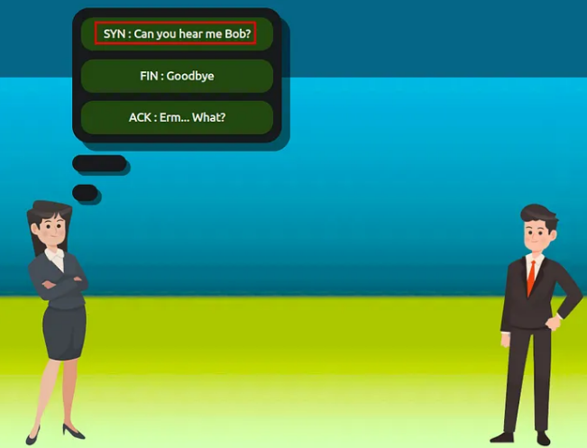
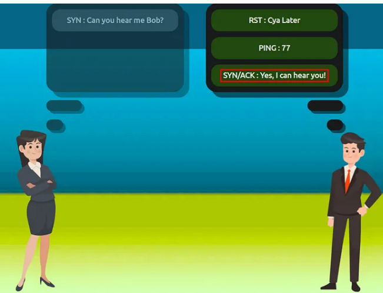
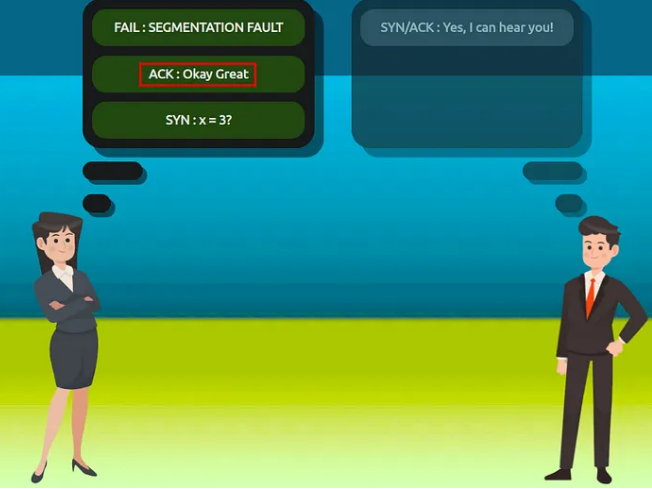
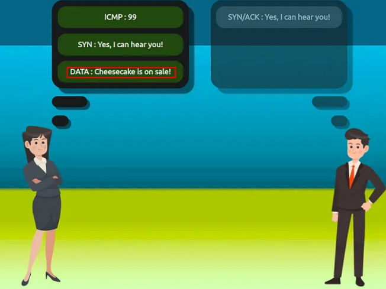
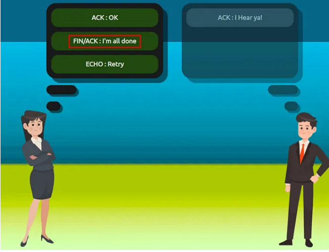
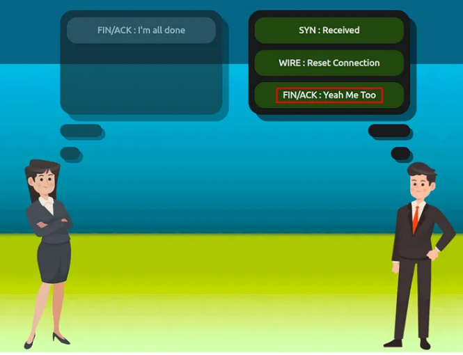
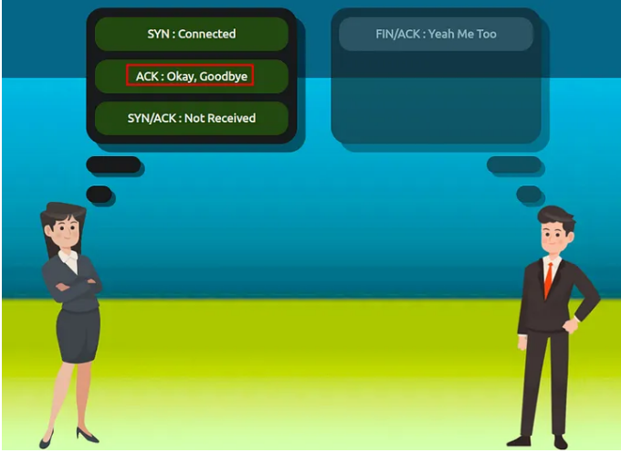
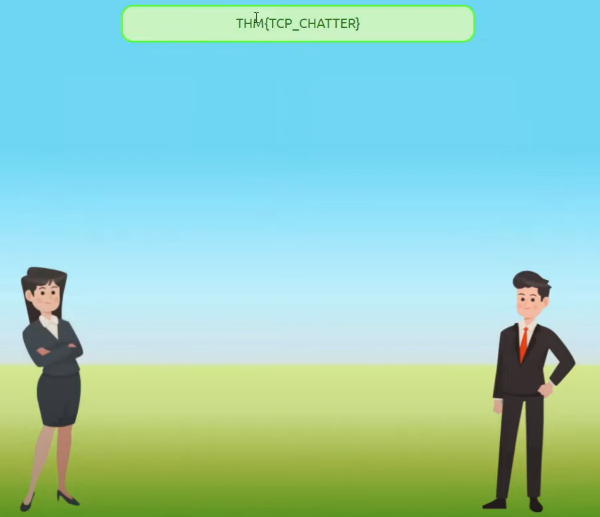
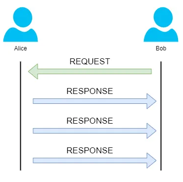
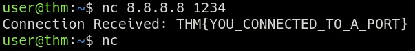

# Packets & Frames

> Hiểu cách dữ liệu được chia thành các phần nhỏ hơn và truyền qua mạng đến một thiết bị khác.

## Mục Lục

1. [Task 1: What are Packets and Frames](#task-1-what-are-packets-and-frames)  
2. [Task 2: TCP/IP (The Three-Way Handshake)](#task-2-tcpip-the-three-way-handshake)  
3. [Task 3: Practical - Handshake](#task-3-practical---handshake)  
4. [Task 4: UDP/IP](#task-4-udpip)  
5. [Task 5: Ports 101 (Practical)](#task-5-ports-101-practical)  

## Nội dung

# Task 1: What are Packets and Frames

Gói tin (**packets**) và khung (**frames**) là những phần nhỏ của dữ liệu, khi kết hợp lại sẽ tạo thành một mảnh thông tin hoặc thông điệp lớn hơn. Tuy nhiên, chúng là hai khái niệm khác nhau trong mô hình OSI. Một **khung** nằm ở lớp 2 — lớp liên kết dữ liệu (**data link layer**), nghĩa là không có thông tin như địa chỉ IP. Hãy nghĩ về điều này như việc đặt một phong bì bên trong một phong bì khác và gửi đi. Phong bì đầu tiên sẽ là gói tin mà bạn gửi đi, nhưng khi nó được mở ra, phong bì bên trong vẫn tồn tại và chứa dữ liệu (đây chính là khung).

Quá trình này được gọi là **encapsulation** (đóng gói), mà chúng ta đã thảo luận trong **Phòng 3: Mô hình OSI**. Tại giai đoạn này, chúng ta có thể giả định rằng bất kỳ khi nào đề cập đến địa chỉ IP, chúng ta đang nói về **gói tin**. Khi thông tin đóng gói được loại bỏ, chúng ta đang nói đến chính **khung**.

**Gói tin** là một cách hiệu quả để truyền dữ liệu giữa các thiết bị mạng, như đã giải thích trong Nhiệm vụ 1. Vì dữ liệu được trao đổi dưới dạng các phần nhỏ, khả năng xảy ra **tắc nghẽn mạng** sẽ ít hơn so với việc gửi các thông điệp lớn cùng một lúc.

Ví dụ, khi tải một hình ảnh từ một trang web, hình ảnh này không được gửi đến máy tính của bạn dưới dạng một khối lớn mà được chia thành các phần nhỏ hơn, sau đó được tái cấu trúc trên máy tính của bạn. Hãy xem hình ảnh dưới đây như một minh họa cho quá trình này. Hình ảnh con chó được chia thành ba gói tin, sau đó được tái tạo lại trên máy tính để tạo thành hình ảnh cuối cùng.

**Gói tin có các cấu trúc khác nhau tùy thuộc vào loại gói tin được gửi.** Như chúng ta sẽ thảo luận tiếp, mạng máy tính đầy rẫy các tiêu chuẩn và giao thức hoạt động như một tập hợp các quy tắc để xử lý gói tin trên một thiết bị. Với việc Internet được dự đoán sẽ có khoảng **50 tỷ thiết bị kết nối vào cuối năm 2020**, mọi thứ sẽ nhanh chóng trở nên hỗn loạn nếu không có sự chuẩn hóa.

Hãy tiếp tục với ví dụ về **Giao thức Internet (Internet Protocol - IP)**. Một gói tin sử dụng giao thức này sẽ có một tập hợp các **header** chứa thông tin bổ sung cho dữ liệu được gửi qua mạng.

Một số header đáng chú ý bao gồm: 

| **Header**             | **Mô tả**                                                                                             |
|-------------------------|-------------------------------------------------------------------------------------------------------|
| **Time to Live**        | Trường này đặt bộ đếm thời gian hết hạn cho gói tin để tránh làm tắc nghẽn mạng nếu gói tin không thể đến đích hoặc thoát khỏi mạng. |
| **Checksum**            | Trường này cung cấp cơ chế kiểm tra tính toàn vẹn cho các giao thức như TCP/IP. Nếu dữ liệu bị thay đổi, giá trị này sẽ khác với giá trị mong đợi và do đó gói tin bị hỏng. |
| **Source Address**      | Địa chỉ IP của thiết bị mà gói tin được gửi đi, để dữ liệu biết nơi cần quay lại.                     |
| **Destination Address** | Địa chỉ IP của thiết bị mà gói tin được gửi đến, để dữ liệu biết điểm đến tiếp theo.                  |

**Câu hỏi:**  

**1. Tên của một phần dữ liệu khi nó có thông tin địa chỉ IP là gì?**  

  
  
Hiển thị đáp án
  
  Đáp án: Packet  

  

**2. Tên của một phần dữ liệu khi nó không có thông tin địa chỉ IP là gì?**  

  
  
Hiển thị đáp án
  
  Đáp án: Frame  

  

#  Task 2: TCP/IP (The Three-Way Handshake)

**TCP** (hay viết tắt của **Transmission Control Protocol**) là một trong những quy tắc khác được sử dụng trong mạng máy tính.

Giao thức này rất giống với mô hình OSI mà chúng ta đã thảo luận trước đây trong **Phòng 3 của mô-đun này**. Giao thức **TCP/IP** bao gồm bốn lớp và có thể được coi như một phiên bản tóm tắt của mô hình OSI. Các lớp này bao gồm:  

1. **Application**  
2. **Transport**  
3. **Internet**  
4. **Network Interface**  

Rất giống với cách hoạt động của mô hình OSI, thông tin được thêm vào mỗi lớp trong mô hình TCP khi dữ liệu (hay **gói tin**) đi qua nó. Như bạn có thể nhớ, quá trình này được gọi là **encapsulation** (đóng gói), trong khi quá trình ngược lại được gọi là **decapsulation** (giải đóng gói).  

Một tính năng nổi bật của TCP là nó dựa trên kết nối (**connection-based**), nghĩa là TCP phải thiết lập một kết nối giữa **client** (máy khách) và thiết bị đóng vai trò **server** (máy chủ) trước khi dữ liệu được gửi đi.

Nhờ đặc điểm này, TCP đảm bảo rằng bất kỳ dữ liệu nào được gửi đi sẽ được nhận ở đầu bên kia. Quá trình này được gọi là **Three-way handshake** (bắt tay ba bước), mà chúng ta sẽ thảo luận chi tiết hơn ngay sau đây. Bảng so sánh các ưu điểm và nhược điểm của TCP được trình bày bên dưới:

| **Ưu điểm của TCP**                                                                 | **Nhược điểm của TCP**                                                                                               |
|-------------------------------------------------------------------------------------|----------------------------------------------------------------------------------------------------------------------|
| **Đảm bảo tính toàn vẹn của dữ liệu.**                                              | **Yêu cầu một kết nối đáng tin cậy giữa hai thiết bị. Nếu một phần nhỏ của dữ liệu không được nhận, toàn bộ dữ liệu phải được gửi lại.** |
| **Có khả năng đồng bộ hóa hai thiết bị để ngăn chặn việc dữ liệu bị tràn hoặc gửi sai thứ tự.** | **Kết nối chậm có thể làm nghẽn thiết bị khác vì kết nối sẽ được duy trì trên thiết bị nhận trong suốt thời gian này.** |
| **Thực hiện nhiều quy trình hơn để đảm bảo độ tin cậy.**                             | **TCP chậm hơn đáng kể so với UDP vì các thiết bị sử dụng giao thức này phải thực hiện nhiều xử lý hơn.**               |

**Các gói tin TCP** chứa nhiều phần thông tin khác nhau được gọi là **headers** (phần tiêu đề), được thêm vào trong quá trình đóng gói (**encapsulation**). Hãy cùng giải thích một số header quan trọng trong bảng dưới đây:

| **Header**               | **Mô tả**                                                                                                                                                                   |
|---------------------------|---------------------------------------------------------------------------------------------------------------------------------------------------------------------------|
| **Source Port**           | Đây là cổng được mở bởi thiết bị gửi để gửi gói tin TCP. Giá trị này được chọn ngẫu nhiên (trong các cổng từ 0-65535 chưa được sử dụng tại thời điểm đó).                      |
| **Destination Port**      | Đây là số cổng mà một ứng dụng hoặc dịch vụ đang chạy trên máy chủ từ xa (máy nhận dữ liệu). Ví dụ, một máy chủ web đang chạy trên cổng 80. Không giống cổng nguồn, giá trị này không được chọn ngẫu nhiên. |
| **Source IP**             | Đây là địa chỉ IP của thiết bị gửi gói tin.                                                                                                                                |
| **Destination IP**        | Đây là địa chỉ IP của thiết bị mà gói tin được gửi đến.                                                                                                                    |
| **Sequence Number**       | Khi kết nối được thiết lập, phần dữ liệu đầu tiên được truyền đi sẽ được gán một số ngẫu nhiên. Chúng ta sẽ giải thích chi tiết hơn về điều này ở phần sau.                       |
| **Acknowledgement Number**| Sau khi một phần dữ liệu được gán số thứ tự, số cho phần dữ liệu tiếp theo sẽ là số thứ tự hiện tại +1. Điều này cũng sẽ được giải thích chi tiết hơn ở phần sau.               |
| **Checksum**              | Đây là giá trị đảm bảo tính toàn vẹn của TCP. Một phép tính toán học được thực hiện để ghi nhớ đầu ra. Khi thiết bị nhận thực hiện phép tính này, dữ liệu sẽ bị coi là hỏng nếu đầu ra khác với đầu ra đã gửi. |
| **Data**                  | Tiêu đề này là nơi chứa dữ liệu, ví dụ: các byte của một tệp đang được truyền.                                                                                               |
| **Flag**                  | Tiêu đề này xác định cách gói tin sẽ được xử lý bởi thiết bị trong quá trình bắt tay (handshake). Các cờ cụ thể sẽ xác định các hành vi cụ thể, điều này sẽ được giải thích chi tiết hơn bên dưới. |

Tiếp theo, chúng ta sẽ thảo luận về **Three-way handshake** — thuật ngữ được sử dụng để mô tả quá trình thiết lập kết nối giữa hai thiết bị. **Three-way handshake** giao tiếp bằng một số thông điệp đặc biệt — bảng dưới đây nêu bật các thông điệp chính:

| **Bước** | **Thông điệp** | **Mô tả**                                                                                                                                                                           |
|----------|----------------|-----------------------------------------------------------------------------------------------------------------------------------------------------------------------------------|
| **1**    | **SYN**        | Một thông điệp SYN (Synchronize - đồng bộ hóa) là gói tin ban đầu được gửi bởi client trong quá trình bắt tay. Gói tin này được sử dụng để bắt đầu một kết nối và đồng bộ hóa hai thiết bị với nhau.               |
| **2**    | **SYN/ACK**    | Gói tin này được gửi bởi thiết bị nhận (server) để xác nhận nỗ lực đồng bộ hóa từ client.                                                                                        |
| **3**    | **ACK**        | Acknowledge - xác nhận: Gói tin xác nhận có thể được sử dụng bởi client hoặc server để xác nhận rằng một chuỗi các thông điệp/gói tin đã được nhận thành công.                                             |
| **4**    | **DATA**       | Sau khi kết nối được thiết lập, dữ liệu (chẳng hạn như các byte của một tệp) được gửi qua thông điệp "DATA".                                                                       |
| **5**    | **FIN**        | Finish - Kết thúc: Gói tin này được sử dụng để **đóng kết nối một cách gọn gàng** sau khi quá trình truyền tải đã hoàn tất.                                                                          |
| **#**    | **RST**        | Reset - Đặt lại: Gói tin này đột ngột chấm dứt toàn bộ giao tiếp. Đây là biện pháp cuối cùng và cho thấy đã xảy ra một vấn đề trong quá trình thực hiện. Ví dụ: dịch vụ hoặc ứng dụng không hoạt động đúng, hoặc hệ thống gặp lỗi như thiếu tài nguyên. |  

Sơ đồ bên dưới hiển thị quá trình bắt tay ba bước thông thường giữa Alice và Bob. Trong thực tế, điều này sẽ diễn ra giữa hai thiết bị.  

Bất kỳ dữ liệu nào được gửi đều được gán một **chuỗi số ngẫu nhiên** (**Number Sequence**) và được tái cấu trúc bằng cách sử dụng chuỗi số này, tăng dần lên 1. Cả hai máy tính phải đồng ý về cùng một chuỗi số để dữ liệu được gửi theo đúng thứ tự. Thứ tự này được thống nhất thông qua ba bước:

1. **SYN — Client:** Đây là **Initial Sequence Number (ISN)** của tôi để đồng bộ hóa (**SYNchronise**) với (0).  
2. **SYN/ACK — Server:** Đây là **Initial Sequence Number (ISN)** của tôi để đồng bộ hóa (**SYNchronise**) với (5.000), và tôi **ACKnowledge** chuỗi số ban đầu của bạn (0).  
3. **ACK — Client:** Tôi **ACKnowledge** chuỗi số ban đầu của bạn (**Initial Sequence Number (ISN)**) là (5.000), đây là dữ liệu của tôi với ISN+1 (5.000 + 1).

| **Thiết bị**          | **Chuỗi số ban đầu (ISN)** | **Chuỗi số cuối cùng** |
|------------------------|----------------------------|-------------------------|
| **Client (Sender)**    | 0                          | 0 + 1 = 1               |
| **Client (Sender)**    | 1                          | 1 + 1 = 2               |
| **Client (Sender)**    | 2                          | 2 + 1 = 3               |

 **Đóng kết nối TCP:**

Hãy nhanh chóng giải thích quá trình đóng kết nối TCP. Đầu tiên, TCP sẽ đóng một kết nối sau khi một thiết bị xác định rằng thiết bị khác đã nhận thành công toàn bộ dữ liệu.

Vì TCP giữ lại tài nguyên hệ thống trên một thiết bị, nên việc đóng kết nối TCP càng sớm càng tốt là một **thực hành tốt**.

Để bắt đầu quá trình đóng kết nối TCP, thiết bị sẽ gửi một gói tin **“FIN”** đến thiết bị khác. Tất nhiên, với TCP, thiết bị nhận cũng phải **xác nhận** (**acknowledge**) gói tin này.

Hãy minh họa quá trình này bằng cách sử dụng ví dụ **Alice và Bob**, như chúng ta đã làm trước đây.

Trong hình minh họa, chúng ta có thể thấy rằng **Alice** đã gửi một gói tin **“FIN”** cho **Bob**. Vì **Bob** đã nhận được gói tin này, anh ấy sẽ thông báo cho **Alice** rằng anh ấy đã nhận được và cũng muốn đóng kết nối (bằng cách sử dụng **FIN**). **Alice** đã nhận rõ thông báo của **Bob** và sẽ cho **Bob** biết rằng cô ấy **xác nhận** (**acknowledge**) điều này.

**Câu hỏi:**  

**1. Tiêu đề nào trong một gói tin TCP đảm bảo tính toàn vẹn của dữ liệu?**  

  
  
Hiển thị đáp án
  
  Đáp án: Checksum  

  

**2. Cung cấp thứ tự của một quá trình bắt tay ba bước thông thường (mỗi bước được phân tách bằng dấu phẩy)?**  

  
  
Hiển thị đáp án
  
  Đáp án: SYN, SYN/ACK, ACK  

  

# Task 3: Practical - Handshake

Hãy giúp Alice và Bob giao tiếp bằng cách lắp ráp lại bắt tay TCP theo đúng thứ tự trong phòng thí nghiệm tĩnh được đính kèm vào nhiệm vụ này!

  
  
Hiển thị đáp án
  
  Đáp án: THM{TCP_CHATTER} 

  

# Task 4: UDP/IP

**Giao thức User Datagram Protocol (UDP)** là một giao thức khác được sử dụng để truyền dữ liệu giữa các thiết bị.

Khác với "người anh em" TCP, **UDP** là một giao thức không trạng thái (**stateless protocol**), không yêu cầu kết nối liên tục giữa hai thiết bị để gửi dữ liệu. Ví dụ, quá trình **bắt tay ba bước (Three-way handshake)** không xảy ra, và cũng không có bất kỳ sự đồng bộ hóa nào giữa hai thiết bị.

Hãy nhớ lại một số so sánh đã được thực hiện về hai giao thức này trong **Phòng 3: "Mô hình OSI"**. Cụ thể, **UDP** được sử dụng trong các tình huống mà ứng dụng có thể chấp nhận mất dữ liệu (chẳng hạn như truyền phát video hoặc trò chuyện thoại) hoặc trong các kịch bản mà kết nối không ổn định không phải là vấn đề quá lớn. Một bảng so sánh các ưu điểm và nhược điểm của UDP được trình bày bên dưới:

| **Ưu điểm của UDP**                                                       | **Nhược điểm của UDP**                                                                                      |
|---------------------------------------------------------------------------|------------------------------------------------------------------------------------------------------------|
| **UDP nhanh hơn nhiều so với TCP.**                                       | **UDP không quan tâm liệu dữ liệu có được nhận hay không.**                                                |
| **UDP để ứng dụng (phần mềm người dùng) quyết định có kiểm soát tốc độ gửi gói tin hay không.** | **Điều này khá linh hoạt đối với các nhà phát triển phần mềm trong ngữ cảnh này.**                        |
| **UDP không duy trì kết nối liên tục trên thiết bị như TCP.**             | **Điều này có nghĩa là các kết nối không ổn định sẽ mang lại trải nghiệm tồi tệ cho người dùng.**           |

Như đã đề cập, không có quá trình nào diễn ra để thiết lập kết nối giữa hai thiết bị. Điều này có nghĩa là không quan tâm liệu dữ liệu có được nhận hay không, và không có các cơ chế bảo vệ như TCP, chẳng hạn như đảm bảo tính toàn vẹn của dữ liệu.

Các gói tin UDP đơn giản hơn nhiều so với các gói tin TCP và có ít tiêu đề (**headers**) hơn. Tuy nhiên, cả hai giao thức đều chia sẻ một số tiêu đề chuẩn, như được chú thích trong bảng dưới đây:

| **Tiêu đề**                | **Mô tả**                                                                                                                                                     |
|----------------------------|-------------------------------------------------------------------------------------------------------------------------------------------------------------|
| **Time to Live (TTL)**     | Trường này đặt bộ đếm thời gian hết hạn cho gói tin, để tránh làm tắc nghẽn mạng nếu gói tin không bao giờ đến được host hoặc thoát khỏi mạng.                |
| **Source Address**         | Địa chỉ IP của thiết bị mà gói tin được gửi đi, để dữ liệu biết nơi cần quay lại.                                                                             |
| **Destination Address**    | Địa chỉ IP của thiết bị mà gói tin được gửi đến, để dữ liệu biết nơi cần truyền tiếp theo.                                                                     |
| **Source Port**            | Giá trị này là cổng được mở bởi thiết bị gửi để gửi gói tin TCP. Giá trị này được chọn ngẫu nhiên (trong các cổng từ 0-65535 chưa được sử dụng tại thời điểm đó). |
| **Destination Port**       | Giá trị này là số cổng mà một ứng dụng hoặc dịch vụ đang chạy trên máy chủ từ xa (máy nhận dữ liệu); ví dụ, một máy chủ web chạy trên cổng 80. Không giống cổng nguồn, giá trị này không được chọn ngẫu nhiên. |
| **Data**                   | Tiêu đề này là nơi chứa dữ liệu, ví dụ: các byte của một tệp đang được truyền.                                                                               |

Tiếp theo, chúng ta sẽ thảo luận về cách quá trình kết nối qua **UDP** khác với một giao thức như **TCP**. Hãy nhớ rằng **UDP** là giao thức **không trạng thái (stateless)**. Không có bất kỳ gói tin xác nhận nào được gửi trong suốt quá trình kết nối.

Sơ đồ dưới đây minh họa một kết nối UDP thông thường giữa **Alice** và **Bob**. Trong thực tế, điều này sẽ diễn ra giữa hai thiết bị.

**Câu hỏi:**  

**1. Thuật ngữ “UDP” là viết tắt của gì?**  

  
  
Hiển thị đáp án
  
  Đáp án: User Datagram Protocol  

  

**2. Loại kết nối nào được “UDP” sử dụng?**  

  
  
Hiển thị đáp án
  
  Đáp án: Stateless  

  

**3. Bạn sẽ sử dụng giao thức nào để chuyển tệp?**  

  
  
Hiển thị đáp án
  
  Đáp án: TCP  

  

**4. Bạn sẽ sử dụng giao thức nào để thực hiện cuộc gọi video?**  

  
  
Hiển thị đáp án
  
  Đáp án: UDP  

  

# Task 5: Ports 101 (Practical)

Có lẽ đúng như tên gọi, **cổng** (**ports**) là một điểm thiết yếu để trao đổi dữ liệu. Hãy tưởng tượng một bến cảng và các cổng. Các con tàu muốn cập bến phải đi đến một cổng tương thích với kích thước và cơ sở vật chất trên tàu. Khi con tàu căn chỉnh, nó sẽ kết nối với một cổng tại bến cảng. Ví dụ, một tàu du lịch không thể cập bến tại cổng dành cho tàu đánh cá và ngược lại.

Những cổng này thực thi các quy tắc về những gì có thể "đỗ" và ở đâu — nếu không tương thích, nó không thể "đỗ" ở đây. Các thiết bị mạng cũng sử dụng **cổng** để thực thi các quy tắc nghiêm ngặt khi giao tiếp với nhau. Khi một kết nối được thiết lập (hồi tưởng từ phòng **mô hình OSI**), bất kỳ dữ liệu nào được gửi hoặc nhận bởi một thiết bị sẽ được truyền qua các cổng này. Trong máy tính, các cổng là một giá trị số nằm trong khoảng từ **0 đến 65535** (65,535).

Vì các cổng có phạm vi từ **0–65535**, nguy cơ mất kiểm soát về ứng dụng nào đang sử dụng cổng nào sẽ tăng lên nhanh chóng. Một bến cảng bận rộn sẽ rất hỗn loạn! May mắn thay, chúng ta liên kết các ứng dụng, phần mềm và hành vi với một tập hợp các quy tắc tiêu chuẩn. Ví dụ, bằng cách thực thi rằng bất kỳ dữ liệu trình duyệt web nào cũng được gửi qua **cổng 80**, các nhà phát triển phần mềm có thể thiết kế trình duyệt web như **Google Chrome** hoặc **Firefox** để diễn giải dữ liệu theo cùng một cách.

Điều này có nghĩa là tất cả các trình duyệt web giờ đây chia sẻ một quy tắc chung: **dữ liệu được gửi qua cổng 80**. Cách các trình duyệt hiển thị, cảm giác khi sử dụng và mức độ dễ sử dụng tùy thuộc vào quyết định của nhà thiết kế hoặc người dùng.

Mặc dù quy tắc tiêu chuẩn cho dữ liệu web là **cổng 80**, một số giao thức khác cũng đã được phân bổ quy tắc tiêu chuẩn. Bất kỳ cổng nào nằm trong khoảng **0 đến 1024** (1,024) được gọi là **cổng phổ biến** (**common port**). Hãy cùng khám phá một số giao thức khác dưới đây:

| **Giao thức**                      | **Số cổng** | **Mô tả**                                                                                                                                                    |
|------------------------------------|-------------|--------------------------------------------------------------------------------------------------------------------------------------------------------------|
| **File Transfer Protocol (FTP)**   | 21          | Giao thức này được sử dụng bởi các ứng dụng chia sẻ tệp dựa trên mô hình máy khách-máy chủ, nghĩa là bạn có thể tải tệp từ một vị trí trung tâm.               |
| **Secure Shell (SSH)**             | 22          | Giao thức này được sử dụng để đăng nhập an toàn vào các hệ thống qua giao diện dựa trên văn bản dành cho quản trị.                                            |
| **HyperText Transfer Protocol (HTTP)** | 80          | Giao thức này là nền tảng của World Wide Web (WWW)! Trình duyệt của bạn sử dụng nó để tải văn bản, hình ảnh và video từ các trang web.                         |
| **HyperText Transfer Protocol Secure (HTTPS)** | 443         | Giao thức này thực hiện chính xác những gì như trên, nhưng sử dụng mã hóa để đảm bảo an toàn.                                                                 |
| **Server Message Block (SMB)**     | 445         | Giao thức này tương tự như File Transfer Protocol (FTP); tuy nhiên, ngoài tệp, SMB cho phép bạn chia sẻ các thiết bị như máy in.                             |
| **Remote Desktop Protocol (RDP)**  | 3389        | Giao thức này là phương tiện an toàn để đăng nhập vào một hệ thống bằng giao diện desktop trực quan (khác với giới hạn giao diện văn bản của giao thức SSH). |

Chúng ta chỉ mới đề cập ngắn gọn đến các giao thức phổ biến trong lĩnh vực an ninh mạng. Bạn có thể tìm thấy một bảng danh sách 1024 cổng phổ biến để biết thêm thông tin. [Xem tại đây](https://www.vmaxx.net/techinfo/ports.htm)

Điều đáng lưu ý ở đây là các giao thức này chỉ tuân theo các tiêu chuẩn. Ví dụ: bạn có thể quản trị các ứng dụng tương tác với các giao thức này trên một cổng khác với cổng tiêu chuẩn (chạy một máy chủ web trên cổng **8080** thay vì cổng tiêu chuẩn **80**). Tuy nhiên, hãy lưu ý rằng các ứng dụng sẽ giả định rằng tiêu chuẩn đang được tuân theo, vì vậy bạn sẽ cần cung cấp dấu hai chấm (:) cùng với số cổng.

**Thử thách thực tế:**

Mở trang web được đính kèm trong nhiệm vụ này và kết nối đến địa chỉ IP **“8.8.8.8”** trên cổng **“1234”**, bạn sẽ nhận được một **flag**.

Câu lệnh **`nc 8.8.8.8 1234`** sử dụng công cụ **Netcat (nc)**, một tiện ích dòng lệnh phổ biến trong lĩnh vực mạng và bảo mật, để thực hiện kết nối đến một địa chỉ IP và cổng cụ thể. Dưới đây là ý nghĩa chi tiết của từng phần trong câu lệnh:

**Giải thích:**
1. **`nc` (Netcat):**
   - Đây là lệnh gọi công cụ **Netcat**.
   - Netcat được sử dụng để tạo kết nối TCP hoặc UDP giữa các thiết bị, gửi và nhận dữ liệu, kiểm tra các cổng mạng hoặc thực hiện các kiểm tra bảo mật.

2. **`8.8.8.8`:**
   - Đây là địa chỉ IP mà bạn muốn kết nối đến.
   - Trong ví dụ này, **8.8.8.8** là một địa chỉ IP công khai, thường được sử dụng bởi DNS của Google.

3. **`1234`:**
   - Đây là số **cổng** (port) mà bạn muốn kết nối đến trên thiết bị hoặc máy chủ có địa chỉ IP là **8.8.8.8**.
   - Cổng **1234** ở đây là nơi dịch vụ hoặc ứng dụng đang chạy và lắng nghe kết nối.

**Cách hoạt động:**
- Lệnh **`nc 8.8.8.8 1234`** sẽ gửi một yêu cầu kết nối **TCP** (theo mặc định) từ máy của bạn đến máy chủ tại **8.8.8.8** trên cổng **1234**.
- Nếu kết nối thành công, bạn sẽ được kết nối đến dịch vụ đang chạy tại địa chỉ IP và cổng này.
- Sau khi kết nối, bạn có thể gửi hoặc nhận dữ liệu qua kết nối này (tùy thuộc vào yêu cầu hoặc dịch vụ tại máy chủ).

