# HTTP in Detail

> Tìm hiểu cách bạn yêu cầu nội dung từ máy chủ web bằng giao thức HTTP.


## Mục Lục

1. [Task 1: What is HTTP(S)?](#task-1-what-is-https)  
2. [Task 2: Requests And Responses](#task-2-requests-and-responses)  
3. [Task 3: HTTP Methods](#task-3-http-methods)  
4. [Task 4: HTTP Status Codes](#task-4-http-status-codes)  
5. [Task 5: Headers](#task-5-headers)  
6. [Task 6: Cookies](#task-6-cookies)  
7. [Task 7: Making Requests](#task-7-making-requests)

## Nội dung

# Task 1: What is HTTP(S)?

**HTTP là gì? (HyperText Transfer Protocol)**

HTTP được sử dụng bất cứ khi nào bạn truy cập một trang web, được phát triển bởi Tim Berners-Lee và nhóm của ông trong khoảng thời gian 1989-1991. HTTP là tập hợp các quy tắc dùng để giao tiếp với máy chủ web nhằm truyền dữ liệu trang web, bao gồm HTML, hình ảnh, video, v.v.

**HTTPS là gì? (HyperText Transfer Protocol Secure)**

HTTPS là phiên bản bảo mật của HTTP. Dữ liệu HTTPS được mã hóa, giúp ngăn chặn người khác xem dữ liệu bạn nhận và gửi. Đồng thời, HTTPS đảm bảo rằng bạn đang giao tiếp với máy chủ web chính xác, không phải một máy chủ giả mạo.

**Câu hỏi:**

**Câu hỏi 1:** HTTP là viết tắt của cụm từ gì?  
<details>  
<summary>Hiển thị đáp án</summary>  
Đáp án: HyperText Transfer Protocol  
</details>  

**Câu hỏi 2:** Chữ "S" trong HTTPS là viết tắt của từ gì?  
<details>  
<summary>Hiển thị đáp án</summary>  
Đáp án: secure  
</details>  

**Câu hỏi 3:** Trên trang web giả lập bên phải có một vấn đề. Sau khi tìm ra vấn đề, hãy nhấp vào nó. Flag của thử thách là gì?  


> Ổ khóa có gạch chéo màu đỏ. Điều này chứng tỏ http bảo mật kém
<details>  
<summary>Hiển thị đáp án</summary>  
Đáp án: THM{INVALID_HTTP_CERT}  
</details>  

# Task 2: Requests And Responses

**Yêu cầu và Phản hồi**  
Khi chúng ta truy cập một trang web, trình duyệt của bạn sẽ cần gửi các yêu cầu đến máy chủ web để lấy các tài nguyên như HTML, hình ảnh và tải về các phản hồi. Trước khi làm điều đó, bạn cần cho trình duyệt biết cụ thể cách thức và nơi để truy cập các tài nguyên này, và đây là lúc URL sẽ giúp bạn.

## **URL là gì? (Uniform Resource Locator)**  

Nếu bạn đã từng sử dụng internet, bạn chắc chắn đã sử dụng URL. URL chủ yếu là một hướng dẫn về cách truy cập một tài nguyên trên internet. Hình ảnh dưới đây minh họa một URL với tất cả các thành phần của nó (không phải yêu cầu nào cũng sử dụng tất cả các thành phần này).


- **Scheme**: Đây là phần hướng dẫn sử dụng giao thức nào để truy cập tài nguyên, chẳng hạn như HTTP, HTTPS, FTP (File Transfer Protocol).  
- **User**: Một số dịch vụ yêu cầu xác thực để đăng nhập, bạn có thể đưa tên người dùng và mật khẩu vào URL để đăng nhập.  
- **Host**: Tên miền hoặc địa chỉ IP của máy chủ mà bạn muốn truy cập.  
- **Port**: Cổng mà bạn sẽ kết nối đến, thông thường là 80 cho HTTP và 443 cho HTTPS, nhưng cổng này có thể nằm trong phạm vi từ 1 - 65535.  
- **Path**: Tên tệp hoặc vị trí của tài nguyên mà bạn đang cố gắng truy cập.  
- **Query String**: Những phần thông tin bổ sung có thể được gửi đến đường dẫn yêu cầu. Ví dụ: `/blog?id=1` sẽ thông báo rằng bạn muốn nhận bài viết blog có ID là 1.  
- **Fragment**: Đây là tham chiếu đến một vị trí cụ thể trên trang mà bạn yêu cầu. Điều này thường được sử dụng cho các trang có nội dung dài và có thể liên kết trực tiếp đến một phần cụ thể, để nó có thể hiển thị cho người dùng ngay khi họ truy cập trang.  

## Thực hiện một yêu cầu (Request)

Có thể gửi một yêu cầu đến máy chủ web chỉ với một dòng lệnh:  `GET / HTTP/1.1`


Nhưng để có một trải nghiệm web phong phú hơn, bạn sẽ cần gửi thêm dữ liệu khác nữa. Dữ liệu này được gửi dưới dạng **headers** (tiêu đề), nơi chứa thông tin bổ sung để cung cấp cho máy chủ web mà bạn đang giao tiếp. Tuy nhiên, chúng ta sẽ tìm hiểu chi tiết hơn về vấn đề này trong nhiệm vụ **Header**.

## Ví dụ về Request

```bash
GET / HTTP/1.1

Host: tryhackme.com

User-Agent: Mozilla/5.0 Firefox/87.0

Referer: https://tryhackme.com/


```

**Để phân tích từng dòng của yêu cầu này:**

- **Dòng 1:** Yêu cầu này sử dụng phương thức **GET** (sẽ tìm hiểu thêm trong nhiệm vụ **HTTP Methods**), yêu cầu trang chủ với ký tự `/` và thông báo cho máy chủ web rằng chúng ta đang sử dụng giao thức **HTTP** phiên bản 1.1.

- **Dòng 2:** Chúng ta nói với máy chủ web rằng chúng ta muốn truy cập trang web **tryhackme.com**.

- **Dòng 3:** Chúng ta thông báo với máy chủ web rằng chúng ta đang sử dụng trình duyệt **Firefox phiên bản 87**.

- **Dòng 4:** Chúng ta thông báo với máy chủ web rằng trang web đã giới thiệu chúng ta đến trang này là **https://tryhackme.com**.

- **Dòng 5:** Các yêu cầu **HTTP** luôn kết thúc bằng một dòng trống để thông báo cho máy chủ web rằng yêu cầu đã hoàn tất.
  
## Ví dụ về Response

```bash
HTTP/1.1 200 OK

Server: nginx/1.15.8

Date: Fri, 09 Apr 2021 13:34:03 GMT

Content-Type: text/html

Content-Length: 98


<html>

<head>

    <title>TryHackMe</title>

</head>

<body>

    Welcome To TryHackMe.com

</body>

</html>
```

**Để phân tích từng dòng của phản hồi:**

- **Dòng 1:** **HTTP 1.1** là phiên bản của giao thức **HTTP** mà máy chủ đang sử dụng, theo sau đó là mã trạng thái **HTTP Status Code**, trong trường hợp này là **"200 Ok"**, cho biết yêu cầu đã được hoàn thành thành công.

- **Dòng 2:** Dòng này cho chúng ta biết phần mềm và phiên bản của máy chủ web.

- **Dòng 3:** Hiển thị ngày, giờ hiện tại và múi giờ của máy chủ web.

- **Dòng 4:** **Header Content-Type** cho khách hàng biết loại thông tin nào sẽ được gửi, chẳng hạn như **HTML**, hình ảnh, video, pdf, **XML**.

- **Dòng 5:** **Header Content-Length** cho khách hàng biết độ dài của phản hồi, từ đó có thể xác nhận rằng không có dữ liệu bị thiếu.

- **Dòng 6:** Phản hồi **HTTP** chứa một dòng trống để xác nhận kết thúc của phản hồi **HTTP**.

- **Dòng 7-14:** Là thông tin đã được yêu cầu, trong trường hợp này là trang chủ.

**Câu hỏi:**

**Câu hỏi 1:** Giao thức HTTP nào được sử dụng trong ví dụ trên?  
<details>  
<summary>Hiển thị đáp án</summary>  
Đáp án: HTTP/1.1  
</details>  

**Câu hỏi 2:** Header phản hồi nào cho trình duyệt biết lượng dữ liệu cần nhận?  
<details>  
<summary>Hiển thị đáp án</summary>  
Đáp án: Content-Length  
</details>  

# Task 3: HTTP Methods

Các phương thức HTTP là cách mà client (máy khách) thể hiện hành động dự định của mình khi thực hiện một yêu cầu HTTP. Có rất nhiều phương thức HTTP, nhưng chúng ta sẽ tập trung vào những phương thức phổ biến nhất, đặc biệt là **GET** và **POST**.

- **GET Request:**  
  Được sử dụng để lấy thông tin từ máy chủ web.

- **POST Request:**  
  Được sử dụng để gửi dữ liệu tới máy chủ web và có thể tạo ra các bản ghi mới.

- **PUT Request:**  
  Được sử dụng để gửi dữ liệu tới máy chủ web để cập nhật thông tin.

- **DELETE Request:**  
  Được sử dụng để xóa thông tin hoặc bản ghi từ máy chủ web.

**Câu hỏi:**

**Câu hỏi 1:** Phương thức nào được sử dụng để tạo một tài khoản người dùng mới?  
<details>  
<summary>Hiển thị đáp án</summary>  
Đáp án: POST  
</details>  

**Câu hỏi 2:** Phương thức nào được sử dụng để cập nhật địa chỉ email của bạn?  
<details>  
<summary>Hiển thị đáp án</summary>  
Đáp án: PUT  
</details>  

**Câu hỏi 3:** Phương thức nào được sử dụng để xóa một hình ảnh bạn đã tải lên tài khoản của mình?  
<details>  
<summary>Hiển thị đáp án</summary>  
Đáp án: DELETE  
</details>  

**Câu hỏi 4:** Phương thức nào được sử dụng để xem một bài báo tin tức?  
<details>  
<summary>Hiển thị đáp án</summary>  
Đáp án: GET  
</details>  

# Task 4: HTTP Status Codes

## HTTP Status Codes:

Trong nhiệm vụ trước, bạn đã học rằng khi một máy chủ HTTP phản hồi, dòng đầu tiên luôn chứa mã trạng thái, thông báo cho client về kết quả của yêu cầu và cũng có thể cách xử lý tiếp theo. Các mã trạng thái này có thể được phân loại thành 5 phạm vi khác nhau:

**Phạm vi mã trạng thái HTTP**

| Phạm vi          | Mô tả                                                                                           |
|-------------------|-------------------------------------------------------------------------------------------------|
| **100-199 - Information Response (Phản hồi thông tin)** | Được gửi để thông báo cho client rằng phần đầu tiên của yêu cầu đã được chấp nhận và họ nên tiếp tục gửi phần còn lại của yêu cầu. Các mã này không còn phổ biến nữa. |
| **200-299 - Success (Thành công)**          | Phạm vi mã trạng thái này được dùng để thông báo cho client rằng yêu cầu của họ đã thành công.                   |
| **300-399 - Redirection (Chuyển hướng)**        | Dùng để chuyển hướng yêu cầu của client đến một tài nguyên khác. Điều này có thể là một trang web khác hoặc một trang web hoàn toàn khác. |
| **400-499 - Client Errors (Lỗi client)**          | Dùng để thông báo cho client rằng đã xảy ra lỗi với yêu cầu của họ.                                     |
| **500-599 - Server Errors (Lỗi server)**          | Dành riêng cho các lỗi xảy ra ở phía server và thường chỉ ra một vấn đề nghiêm trọng với server xử lý yêu cầu.   |


## Common HTTP Status Codes:

Có rất nhiều mã trạng thái HTTP khác nhau, chưa kể đến việc các ứng dụng thậm chí có thể tự định nghĩa mã của riêng chúng. Dưới đây là những phản hồi HTTP phổ biến nhất mà bạn có thể gặp:

**Mã trạng thái HTTP phổ biến**

| Mã trạng thái                  | Mô tả                                                                                 |
|--------------------------------|---------------------------------------------------------------------------------------|
| **200 - Thành công (OK)**      | Yêu cầu đã được hoàn thành thành công.                                                |
| **201 - Đã tạo (Created)**     | Một tài nguyên đã được tạo (ví dụ như người dùng mới hoặc bài đăng blog mới).          |
| **301 - Chuyển hướng vĩnh viễn (Moved Permanently)** | Chuyển hướng trình duyệt của client đến một trang web mới hoặc báo cho công cụ tìm kiếm rằng trang đã di chuyển. |
| **302 - Đã tìm thấy (Found)**  | Tương tự như chuyển hướng vĩnh viễn, nhưng đây chỉ là thay đổi tạm thời và có thể thay đổi trong tương lai gần. |
| **400 - Yêu cầu không hợp lệ (Bad Request)** | Báo cho trình duyệt rằng có lỗi hoặc thiếu sót trong yêu cầu. Ví dụ, tham số cần thiết không được gửi. |
| **401 - Chưa được xác thực (Not Authorised)** | Bạn không được phép xem tài nguyên này cho đến khi bạn đã xác thực với ứng dụng web (thường với tên người dùng và mật khẩu). |
| **403 - Bị cấm (Forbidden)**   | Bạn không có quyền xem tài nguyên này dù đã đăng nhập hay chưa.                     |
| **405 - Phương thức không được phép (Method Not Allowed)** | Tài nguyên không cho phép yêu cầu phương thức này. Ví dụ, bạn gửi yêu cầu `GET` trong khi server yêu cầu `POST`. |
| **404 - Không tìm thấy (Page Not Found)** | Trang hoặc tài nguyên bạn yêu cầu không tồn tại.                                      |
| **500 - Lỗi dịch vụ nội bộ (Internal Service Error)** | Server gặp lỗi với yêu cầu của bạn mà không biết cách xử lý đúng cách.                |
| **503 - Dịch vụ không khả dụng (Service Unavailable)** | Server không thể xử lý yêu cầu của bạn vì quá tải hoặc đang bảo trì.                  |


# Task 5: Headers

- Tiêu đề là các phần thông tin bổ sung bạn có thể gửi tới máy chủ web khi thực hiện yêu cầu.

- Mặc dù không bắt buộc phải có tiêu đề khi gửi yêu cầu HTTP, bạn sẽ gặp khó khăn khi xem trang web nếu không sử dụng tiêu đề.

## Các tiêu đề yêu cầu phổ biến:

- **Host**: Một số máy chủ web lưu trữ nhiều trang web, do đó bằng cách cung cấp tiêu đề host, bạn có thể cho máy chủ biết bạn cần truy cập trang nào, nếu không bạn sẽ chỉ nhận được trang web mặc định của máy chủ.
- **User-Agent**: Đây là thông tin về phần mềm và phiên bản trình duyệt của bạn, giúp máy chủ web định dạng trang web đúng cách cho trình duyệt của bạn, đồng thời hỗ trợ một số phần tử HTML, JavaScript và CSS mà chỉ có trên các trình duyệt nhất định.
- **Content-Length**: Khi gửi dữ liệu đến máy chủ web, ví dụ như trong biểu mẫu, độ dài nội dung sẽ cho biết máy chủ biết phải mong đợi bao nhiêu dữ liệu trong yêu cầu. Bằng cách này, máy chủ có thể đảm bảo rằng không thiếu dữ liệu.
- **Accept-Encoding**: Cho máy chủ biết loại phương pháp nén nào mà trình duyệt hỗ trợ, để dữ liệu có thể được nén nhỏ hơn trước khi gửi qua internet.
- **Cookie**: Dữ liệu được gửi đến máy chủ để giúp ghi nhớ thông tin của bạn (xem bài học về cookie để biết thêm thông tin).

## Các tiêu đề phản hồi phổ biến:

- **Set-Cookie**: Thông tin để lưu trữ và được gửi trở lại máy chủ web trong mỗi yêu cầu (xem bài học về cookie để biết thêm thông tin).
- **Cache-Control**: Cho biết thời gian lưu trữ nội dung phản hồi trong bộ nhớ đệm của trình duyệt trước khi cần yêu cầu lại.
- **Content-Type**: Thông báo cho client biết loại dữ liệu nào đang được trả về, ví dụ: HTML, CSS, JavaScript, Hình ảnh, PDF, Video, v.v. Sử dụng tiêu đề content-type giúp trình duyệt biết cách xử lý dữ liệu.
- **Content-Encoding**: Phương pháp được sử dụng để nén dữ liệu để làm cho dữ liệu nhỏ hơn trước khi gửi qua internet.

**Câu hỏi:**

1. **Header nào cho máy chủ web biết trình duyệt nào đang được sử dụng?**  
<details>  
<summary>Hiển thị đáp án</summary>  
Đáp án: User-Agent  
</details>  

2. **Header nào cho trình duyệt biết loại dữ liệu nào đang được trả về?**  
<details>  
<summary>Hiển thị đáp án</summary>  
Đáp án: Content-Type  
</details>  

3. **Header nào cho máy chủ web biết website nào đang được yêu cầu?**  
<details>  
<summary>Hiển thị đáp án</summary>  
Đáp án: Host  
</details>  

# Task 6: Cookies

Bạn có thể đã nghe nói về **cookies** trước đây, chúng chỉ là một mẩu dữ liệu nhỏ được lưu trữ trên máy tính của bạn. **Cookies** được lưu khi bạn nhận được tiêu đề `"Set-Cookie"` từ một máy chủ web. Sau đó, với mỗi yêu cầu tiếp theo mà bạn thực hiện, bạn sẽ gửi dữ liệu cookie trở lại máy chủ web.  

Vì HTTP là giao thức **stateless** (không theo dõi các yêu cầu trước đó của bạn), **cookies** có thể được sử dụng để giúp máy chủ web nhớ bạn là ai, một số cài đặt cá nhân cho trang web hoặc liệu bạn đã truy cập trang web đó trước đây hay chưa.  

Hãy xem ví dụ sau về một yêu cầu HTTP:

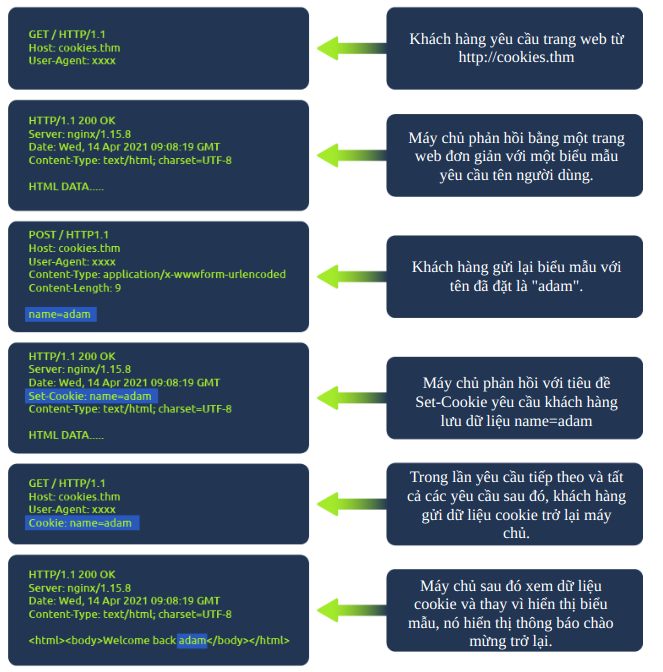

**Cookies** có thể được sử dụng cho nhiều mục đích, nhưng phổ biến nhất là dùng để xác thực trên trang web. Giá trị của cookie thường sẽ không phải là một chuỗi văn bản rõ ràng mà bạn có thể thấy mật khẩu, mà sẽ là một **token** (mã bí mật duy nhất không dễ dàng đoán được bởi con người).

### Xem Cookie Của Bạn

Bạn có thể dễ dàng xem cookie mà trình duyệt của bạn gửi đến một trang web bằng cách sử dụng công cụ dành cho nhà phát triển (developer tools) trong trình duyệt của bạn.

Khi bạn đã mở công cụ dành cho nhà phát triển, hãy nhấp vào tab **"Network"**. Tab này sẽ hiển thị danh sách tất cả các tài nguyên mà trình duyệt của bạn đã yêu cầu. Bạn có thể nhấp vào từng tài nguyên để nhận được phân tích chi tiết về yêu cầu và phản hồi. Nếu trình duyệt của bạn đã gửi một cookie, bạn sẽ thấy chúng trong tab **"Cookies"** của yêu cầu đó.

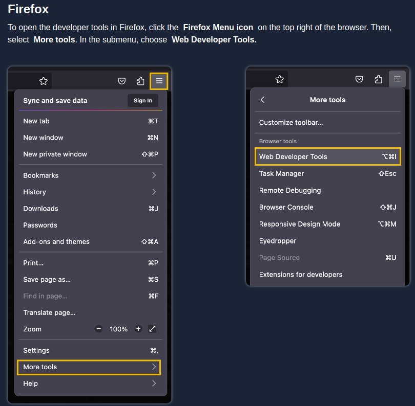

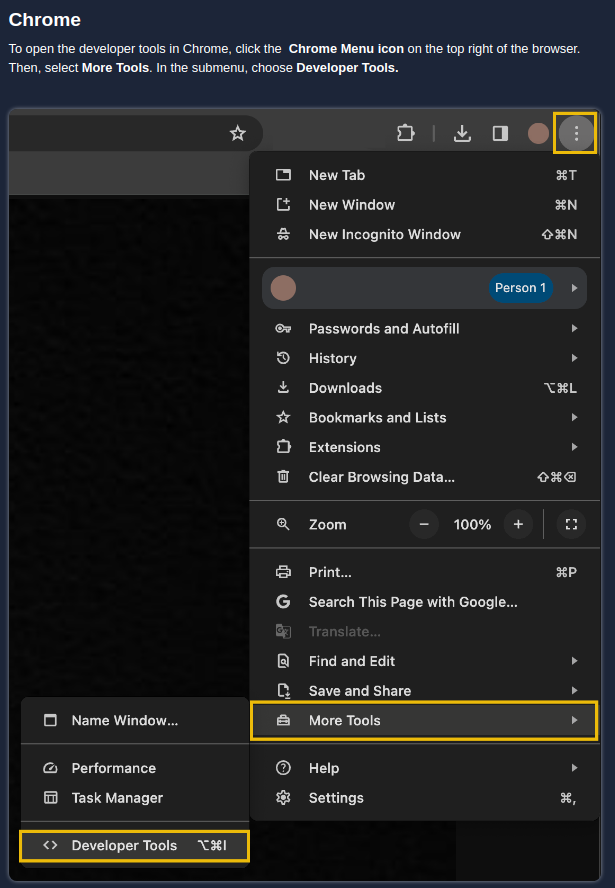

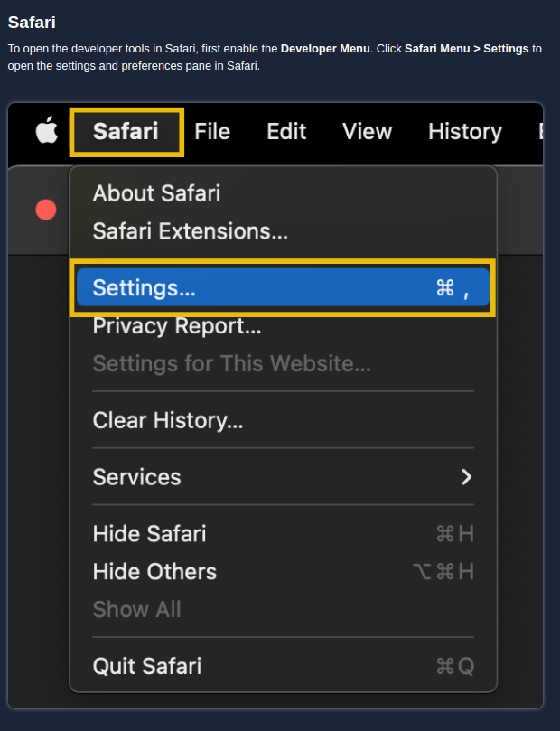

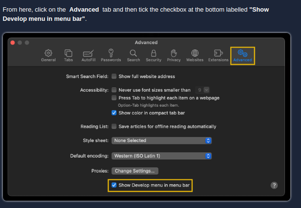

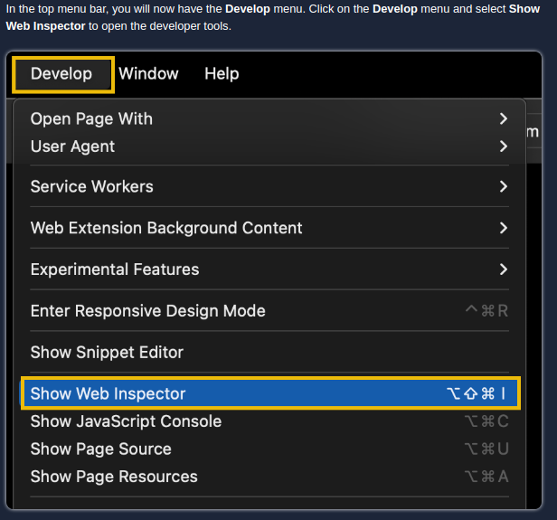

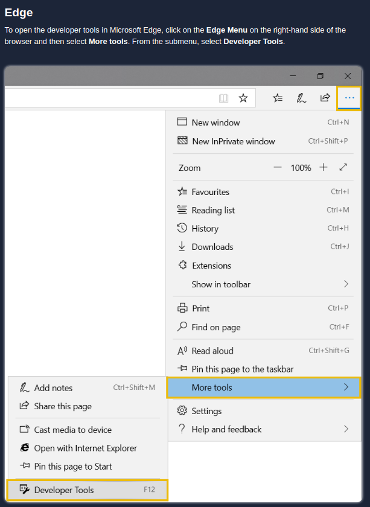

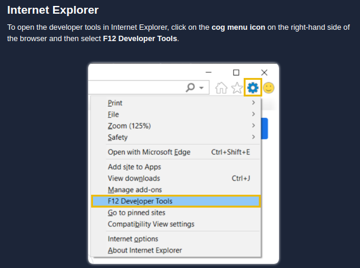


**Cây hỏi:**

**Header nào được sử dụng để lưu cookie vào máy tính của bạn?**  
<details>  
<summary>Hiển thị đáp án</summary>  
Đáp án: Set-Cookie  
</details>  

# Task 7: Making Requests


1. **Thực hiện yêu cầu GET tới `/room`**  

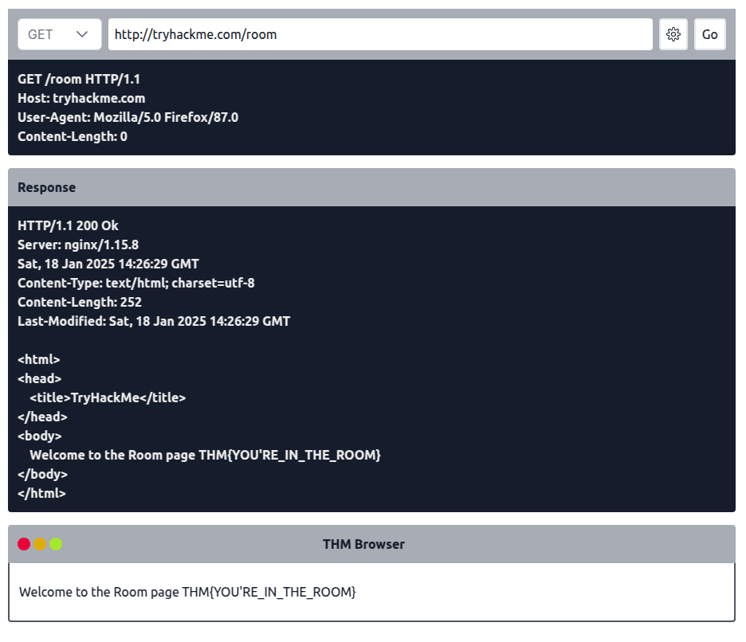

<details>  
<summary>Hiển thị đáp án</summary>  
Đáp án: THM{YOU'RE_IN_THE_ROOM}  
</details>  

2. **Thực hiện yêu cầu GET tới `/blog` và sử dụng biểu tượng bánh răng để đặt tham số `id` thành `1` trong trường URL**  

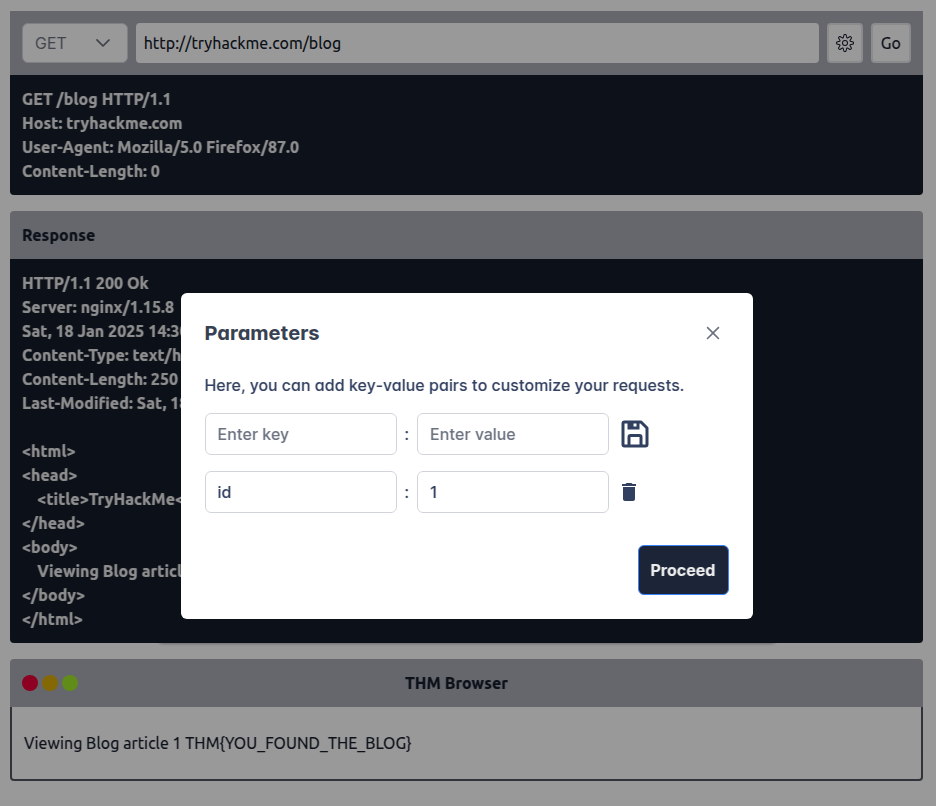

<details>  
<summary>Hiển thị đáp án</summary>  
Đáp án: THM{YOU_FOUND_THE_BLOG}  
</details>  

3. **Thực hiện yêu cầu DELETE tới `/user/1`**  

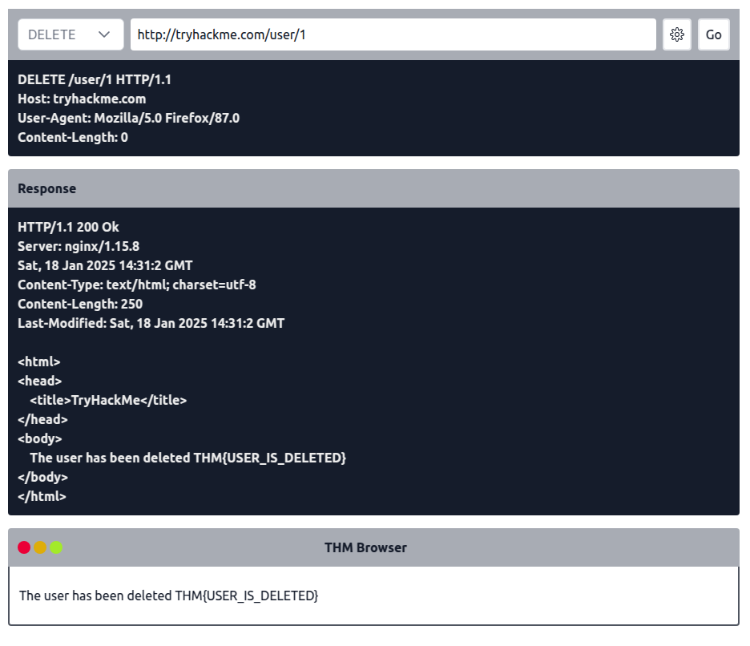

<details>  
<summary>Hiển thị đáp án</summary>  
Đáp án: THM{USER_IS_DELETED}  
</details>  

4. **Thực hiện yêu cầu PUT tới `/user/2` với tham số `username` được đặt là `admin`**  


<details>  
<summary>Hiển thị đáp án</summary>  
Đáp án: THM{USER_HAS_UPDATED}  
</details>  

5. **Gửi POST với `username` là `thm` và `password` là `letmein` tới `/login`**  

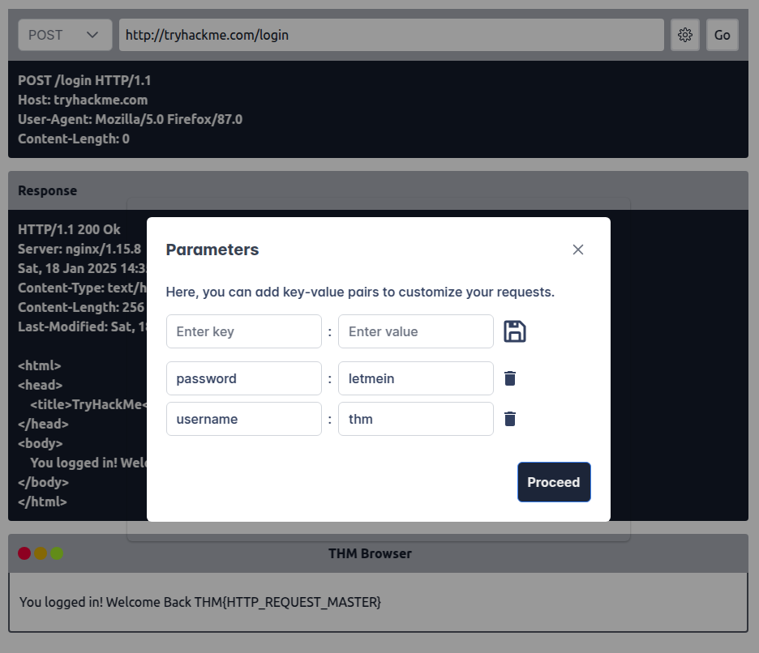

<details>  
<summary>Hiển thị đáp án</summary>  
Đáp án: THM{HTTP_REQUEST_MASTER}  
</details>  

