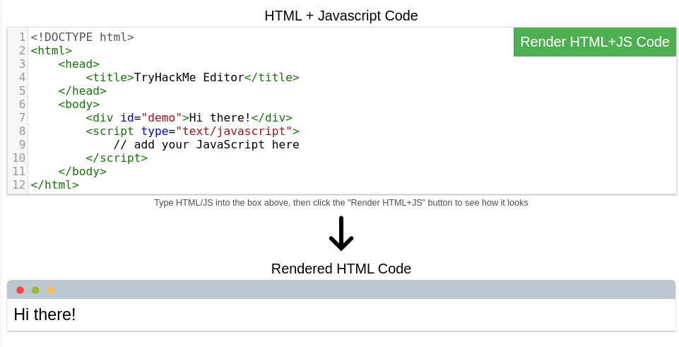
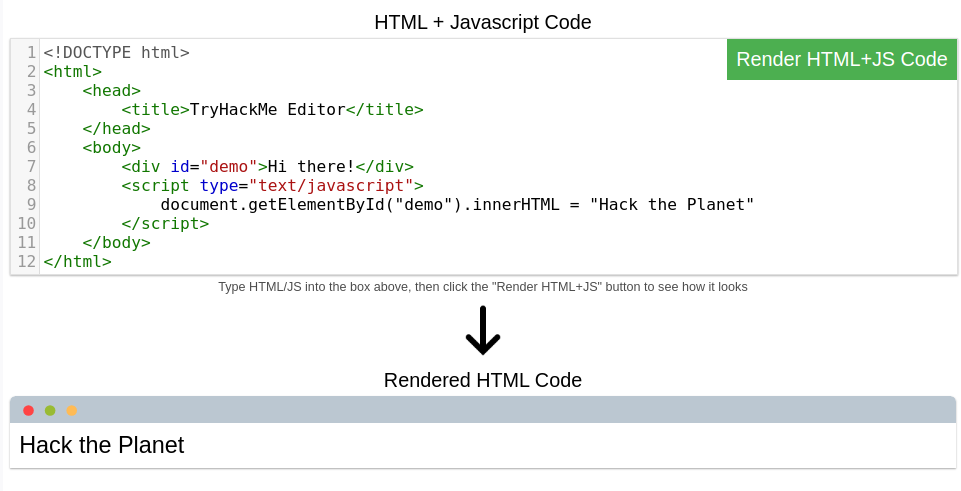
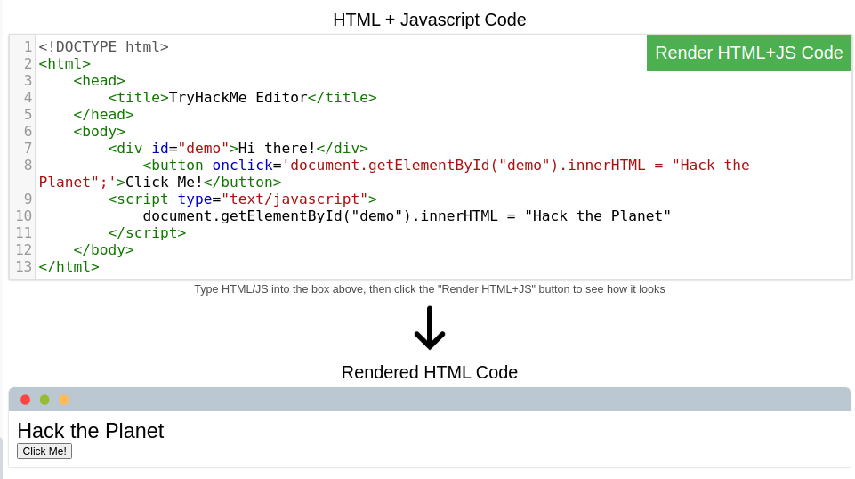
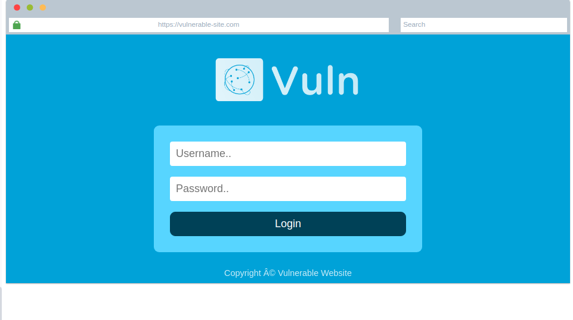
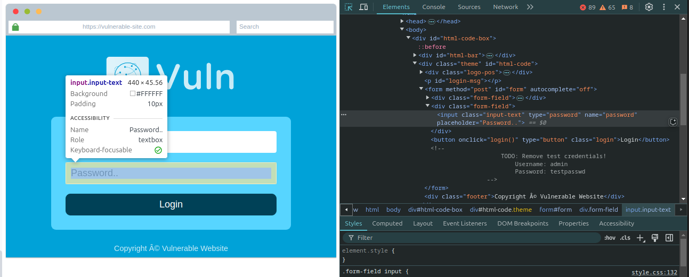
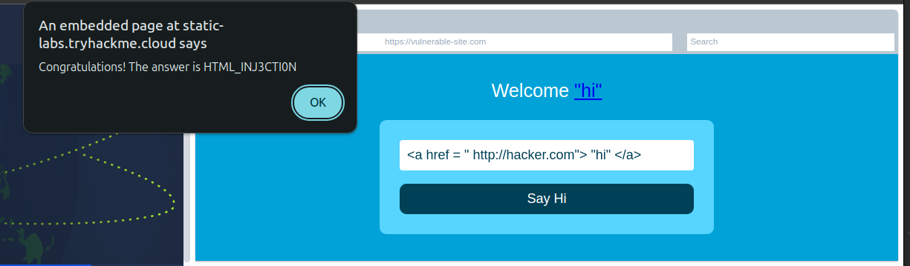

# How Websites Work

> Để khai thác một trang web, trước tiên bạn cần biết trang web đó được tạo ra như thế nào.

## Mục Lục

1. [Task 1: How Websites Work](#task-1-how-websites-work)

2. [Task 2: HTML](#task-2-html)

3. [Task 3: JavaScript](#task-3-javascript)

4. [Task 4: Sensitive Data Exposure](#task-4-sensitive-data-exposure)

5. [Task 5: HTML Injection](#task-5-html-injection)

## Nội dung

# Task 1: How Websites Work

Kết thúc bài học này, bạn sẽ hiểu cách các trang web được tạo ra và sẽ được giới thiệu về một số vấn đề bảo mật cơ bản.

Khi bạn truy cập một trang web, trình duyệt của bạn (như Safari hoặc Google Chrome) sẽ gửi một yêu cầu đến máy chủ web để yêu cầu thông tin về trang mà bạn đang truy cập. Máy chủ sẽ phản hồi bằng dữ liệu mà trình duyệt của bạn sử dụng để hiển thị trang; **máy chủ web** chỉ đơn giản là một máy tính chuyên dụng ở một nơi nào đó trên thế giới, xử lý các yêu cầu của bạn.


Một trang web được tạo thành từ hai thành phần chính:

- **Front End (Phía khách hàng)** - cách trình duyệt của bạn hiển thị một trang web.
- **Back End (Phía máy chủ)** - một máy chủ xử lý yêu cầu của bạn và trả về phản hồi.

Có nhiều quy trình khác liên quan đến việc trình duyệt của bạn gửi yêu cầu đến máy chủ web, nhưng hiện tại, bạn chỉ cần hiểu rằng bạn gửi yêu cầu đến một máy chủ, và máy chủ phản hồi bằng dữ liệu mà trình duyệt của bạn sử dụng để hiển thị thông tin cho bạn.

**Trả lời các câu hỏi dưới đây**  

**Thuật ngữ nào mô tả tốt nhất thành phần của một ứng dụng web được hiển thị bởi trình duyệt của bạn?**  

<details>  
<summary>Hiển thị đáp án</summary>  
Đáp án: Front End  
</details>  

# Task 2: HTML

Trang web chủ yếu được tạo bằng:

- **HTML**, để xây dựng trang web và xác định cấu trúc của chúng.
- **CSS**, để làm cho trang web trở nên đẹp mắt bằng cách thêm các tùy chọn tạo kiểu.
- **JavaScript**, triển khai các tính năng phức tạp trên trang web bằng cách sử dụng tính tương tác.

**HyperText Markup Language (HTML)** là ngôn ngữ mà các trang web được viết. Các thành phần (còn được gọi là thẻ) là các khối xây dựng của các trang HTML và cho trình duyệt biết cách hiển thị nội dung. Đoạn mã bên dưới hiển thị một tài liệu HTML đơn giản, với cấu trúc giống nhau cho mọi trang web:

```html
<!DOCTYPE html>
<html>
    <head>
        <title>Page Title</title>
    </head>
    <body>
        <h1>Example Heading</h1>
        <p>Example paragraph...</p>
    </body>
</html>
```

Cấu trúc HTML (như được hiển thị bên trên) bao gồm các thành phần sau:

- **`<!DOCTYPE html>`** xác định rằng trang là một tài liệu HTML5. Điều này giúp chuẩn hóa giữa các trình duyệt khác nhau và cho trình duyệt biết sử dụng HTML5 để diễn giải trang.
- **`<html>`** là phần tử gốc của trang HTML - tất cả các phần tử khác sẽ nằm bên trong phần tử này.
- **`<head>`** chứa thông tin về trang (chẳng hạn như tiêu đề của trang).
- **`<body>`** xác định nội dung của tài liệu HTML; chỉ nội dung bên trong phần body được hiển thị trong trình duyệt.
- **`<h1>`** xác định một tiêu đề lớn.
- **`<p>`** xác định một đoạn văn bản.
- Có rất nhiều phần tử khác (thẻ) được sử dụng cho các mục đích khác nhau. Ví dụ: có các thẻ cho nút (**`<button>`**), hình ảnh (**``**), danh sách, và nhiều thứ khác.


**Các thẻ có thể chứa các thuộc tính** như thuộc tính `class`, được sử dụng để định kiểu cho một phần tử (ví dụ: làm cho thẻ có màu khác nhau) **`<p class="bold-text">`**, hoặc thuộc tính `src`, được sử dụng trên hình ảnh để chỉ định vị trí của hình ảnh **``**. Một phần tử có thể có nhiều thuộc tính, mỗi thuộc tính có mục đích riêng, ví dụ: **`<p attribute1="value1" attribute2="value2">`**.

**Các phần tử cũng có thể có thuộc tính id**, ví dụ: **`<p id="example">`**, đây là thuộc tính duy nhất cho phần tử. Không giống như thuộc tính `class`, nơi nhiều phần tử có thể sử dụng cùng một lớp, mỗi phần tử phải có một `id` khác nhau để xác định duy nhất. `id` của phần tử được sử dụng để tạo kiểu và xác định nó thông qua JavaScript.

Bạn có thể xem HTML của bất kỳ trang web nào bằng cách nhấp chuột phải và chọn **"View Page Source"** (Chrome) / **"Show Page Source"** (Safari).

**Câu hỏi:**


1. Một trong những hình ảnh trên trang web về mèo bị hỏng - hãy sửa nó và hình ảnh sẽ hiển thị câu trả lời bằng văn bản ẩn!


<details>  
<summary>Hiển thị đáp án</summary>  
Đáp án: HTMLHERO
</details>  

2. Thêm hình ảnh con chó vào trang bằng cách thêm thẻ img khác () vào dòng 11. Vị trí hình ảnh con chó là img/dog-1.png. Văn bản trong hình ảnh con chó là gì?


<details>  
<summary>Hiển thị đáp án</summary>  
Đáp án: DOGHTML
</details>  

# Task 3: JavaScript

JavaScript (JS) là một trong những ngôn ngữ lập trình phổ biến nhất trên thế giới và cho phép các trang web trở nên tương tác. HTML được sử dụng để tạo cấu trúc và nội dung cho trang web, trong khi JavaScript được sử dụng để kiểm soát chức năng của các trang web - nếu không có JavaScript, một trang web sẽ không có các yếu tố tương tác và sẽ luôn là tĩnh. JS có thể cập nhật trang web theo thời gian thực, cung cấp các chức năng như thay đổi kiểu dáng của một nút khi một sự kiện cụ thể trên trang xảy ra (chẳng hạn như khi người dùng nhấp vào nút) hoặc hiển thị các hình ảnh động.

JavaScript được thêm vào trong mã nguồn của trang và có thể được tải trong các thẻ **`<script>`** hoặc được liên kết từ xa bằng thuộc tính **`src`**, như sau:  

```javascript
<script src="/location/of/javascript_file.js"></script>`**
```

Ví dụ sau đây trong JavaScript tìm một phần tử HTML trên trang với **id** là "demo" và thay đổi nội dung của phần tử đó thành "Hack the Planet":  
```javascript
document.getElementById("demo").innerHTML = "Hack the Planet";
```

Các phần tử HTML cũng có thể có các sự kiện, chẳng hạn như **"onclick"** hoặc **"onhover"**, để thực thi JavaScript khi sự kiện xảy ra. Ví dụ sau thay đổi nội dung của phần tử với ID "demo" thành "Button Clicked" khi nhấp vào nút:  
```html
<button onclick='document.getElementById("demo").innerHTML = "Button Clicked";'>Click Me!</button>
```

Các sự kiện **onclick** cũng có thể được định nghĩa trong các thẻ script JavaScript thay vì gắn trực tiếp trên các phần tử.

**Thực hành:**



1. Ở phía bên phải, thêm JavaScript để thay đổi nội dung của phần tử demo thành "Hack the Planet"



<details>  
<summary>Hiển thị đáp án</summary>  
Đáp án: JSISFUN
</details>  

2. Thêm nút HTML từ tác vụ này để thay đổi văn bản của phần tử thành "Button Clicked" trên trình chỉnh sửa bên phải, cập nhật mã bằng cách nhấp vào nút "Render HTML+JS Code" rồi nhấp vào nút.



# Task 4: Sensitive Data Exposure

**Lộ dữ liệu nhạy cảm**

Lộ dữ liệu nhạy cảm xảy ra khi một trang web không bảo vệ đúng cách (hoặc không loại bỏ) thông tin rõ ràng, nhạy cảm khỏi người dùng cuối; vấn đề này thường được tìm thấy trong mã nguồn frontend của trang web.

Chúng ta đã biết rằng các trang web được xây dựng bằng nhiều phần tử HTML (thẻ), tất cả những phần tử này có thể được xem đơn giản bằng cách "xem nguồn trang". Một nhà phát triển trang web có thể đã quên loại bỏ thông tin đăng nhập, các liên kết ẩn dẫn đến các phần riêng tư của trang web, hoặc dữ liệu nhạy cảm khác được hiển thị trong HTML hoặc JavaScript.

Thông tin nhạy cảm có thể bị khai thác tiềm năng để giúp kẻ tấn công xâm nhập sâu hơn vào các phần khác nhau của ứng dụng web. Ví dụ, có thể có các bình luận HTML chứa thông tin đăng nhập tạm thời, và nếu bạn xem mã nguồn của trang và tìm thấy thông tin này, bạn có thể sử dụng thông tin đó để đăng nhập vào các phần khác của ứng dụng (hoặc tệ hơn, dùng để truy cập vào các thành phần backend khác của trang web).

Bất cứ khi nào bạn kiểm tra một ứng dụng web để tìm các vấn đề bảo mật, một trong những việc đầu tiên bạn nên làm là xem mã nguồn của trang để kiểm tra xem liệu có thông tin đăng nhập hoặc các liên kết ẩn bị lộ hay không.

```html
<!DOCTYPE html>
<html>
  <head>
    <title>Fake Website</title>
  </head>
  <body>
    <form>
      <input type='text' name='username'>
      <input type='password' name='password'>
      <button>Login</button>
      <!-- TODO: remove test credentials admin:password123 -->
    </form>
  </body>
</html>
```

**Trả lời câu hỏi bên dưới:**  

*Mật khẩu được ẩn trong mã nguồn là gì?*

Ta có trang web sau:



Các bước thực hiện: Click chuột phải > Inspect > chọn Select an element in the page to inspect it > trỏ con trỏ chuột đến phần password trên web > Tại mục elements ta sẽ thấy phần code trong thẻ div có phần comments về mật khẩu:



<details>  
<summary>Hiển thị đáp án</summary>  
Đáp án: testpasswd  
</details>  

# Task 5: HTML Injection

**Chèn mã HTML (HTML Injection)**

Chèn mã HTML là một lỗ hổng xảy ra khi dữ liệu đầu vào của người dùng không được lọc và được hiển thị trực tiếp trên trang web. Nếu một trang web không thực hiện việc lọc dữ liệu đầu vào của người dùng (loại bỏ bất kỳ nội dung "độc hại" nào mà người dùng nhập vào), và dữ liệu đầu vào đó được sử dụng trên trang, kẻ tấn công có thể chèn mã HTML vào trang web bị tổn thương.

Việc lọc dữ liệu đầu vào là rất quan trọng để bảo vệ trang web, vì thông tin mà người dùng nhập vào trang web thường được sử dụng trong nhiều chức năng ở cả giao diện phía trước (frontend) và phía sau (backend). Một lỗ hổng khác mà bạn sẽ khám phá trong một bài thực hành khác là **chèn mã vào cơ sở dữ liệu** (database injection), nơi bạn có thể thao túng truy vấn tìm kiếm trong cơ sở dữ liệu để đăng nhập dưới danh nghĩa người dùng khác bằng cách kiểm soát dữ liệu đầu vào được sử dụng trực tiếp trong truy vấn - nhưng hiện tại, chúng ta sẽ tập trung vào việc chèn mã HTML (một vấn đề phía giao diện người dùng).

Khi người dùng có quyền kiểm soát cách dữ liệu đầu vào của họ được hiển thị, họ có thể gửi mã HTML (hoặc JavaScript), và trình duyệt sẽ sử dụng chúng trên trang, cho phép người dùng kiểm soát giao diện và chức năng của trang.

Hình ảnh trên minh họa cách một biểu mẫu hiển thị văn bản lên trang web. Bất kỳ nội dung nào người dùng nhập vào trường "What's your name" sẽ được truyền tới một hàm JavaScript và hiển thị trên trang web. Điều này có nghĩa là nếu người dùng thêm mã HTML hoặc JavaScript của riêng họ vào trường nhập liệu, nó sẽ được sử dụng trong hàm `sayHi` và được thêm vào trang - điều này cho phép bạn chèn mã HTML của riêng mình (chẳng hạn như thẻ `<h1>`) và nội dung bạn nhập sẽ được hiển thị như mã HTML thuần.

Quy tắc chung là **không bao giờ tin tưởng vào dữ liệu đầu vào của người dùng**. Để ngăn chặn nội dung độc hại, nhà phát triển trang web nên lọc tất cả dữ liệu mà người dùng nhập vào trước khi sử dụng chúng trong hàm JavaScript; trong trường hợp này, nhà phát triển có thể loại bỏ bất kỳ thẻ HTML nào.


**Câu hỏi: Xem trang web này trên tác vụ này và chèn HTML để hiển thị liên kết độc hại tới http://hacker.com.**

Chúng ta chèn một thẻ HTML có chứa liên kết đến link http://hacker.com

```HTML
<a href = " http://hacker.com"> "hi" </a>
```



<details>  
<summary>Hiển thị đáp án</summary>  
Đáp án: HTML_INJ3CTI0N  
</details>  
