# Windows Fundamentals 2

> Trong phần 2 của module **Windows Fundamentals**, bạn sẽ khám phá thêm về **System Configuration** (Cấu hình Hệ thống), **UAC Settings** (Cài đặt UAC), **Resource Monitoring** (Giám sát Tài nguyên), **Windows Registry** (Sổ đăng ký Windows) và nhiều nội dung khác.

## Mục Lục

1. [Task 1: Introduction](#task-1-introduction)

2. [Task 2: System Configuration](#task-2-system-configuration)

3. [Task 3: Change UAC Settings](#task-3-change-uac-settings)

4. [Task 4: Computer Management](#task-4-computer-management)

5. [Task 5: System Information](#task-5-system-information)

6. [Task 6: Resource Monitor](#task-6-resource-monitor)

7. [Task 7: Command Prompt](#task-7-command-prompt)

8. [Task 8: Registry Editor](#task-8-registry-editor)

9. [Task 9: Conclusion](#task-9-conclusion)

## Nội dung

# Task 1: Introduction

If you wish to access the virtual machine via Remote Desktop, use the credentials below. 

Machine IP: MACHINE_IP

User: administrator

Password: letmein123!

# Task 2: System Configuration

Tiện ích **System Configuration** (**MSConfig**) được sử dụng để khắc phục sự cố nâng cao, với mục đích chính là giúp chẩn đoán các vấn đề khởi động hệ thống.  

Tham khảo tài liệu sau [tại đây](https://learn.microsoft.com/en-us/troubleshoot/windows-client/performance/system-configuration-utility-troubleshoot-configuration-errors) để biết thêm thông tin về tiện ích **System Configuration**.  

Có một số phương pháp để mở **System Configuration**. Một phương pháp là thông qua **Start Menu**.

**Lưu ý:** Bạn cần quyền quản trị viên cục bộ để mở tiện ích này.

Tiện ích này có năm thẻ (tab) chính ở phía trên. Dưới đây là tên của từng thẻ. Chúng ta sẽ đề cập ngắn gọn đến mỗi thẻ trong nhiệm vụ này:

1. **General** (Chung)  
2. **Boot** (Khởi động)  
3. **Services** (Dịch vụ)  
4. **Startup** (Khởi chạy)  
5. **Tools** (Công cụ)

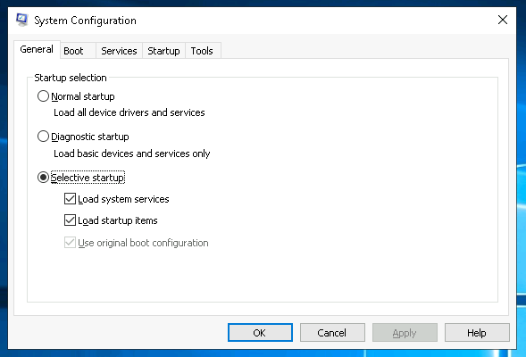

Trong thẻ **General** (Chung), bạn có thể chọn các thiết bị và dịch vụ mà Windows sẽ tải khi khởi động. Các tùy chọn bao gồm:  
- **Normal** (Bình thường)  
- **Diagnostic** (Chẩn đoán)  
- **Selective** (Tùy chọn)  

Trong thẻ **Boot** (Khởi động), bạn có thể xác định các tùy chọn khởi động khác nhau cho hệ điều hành.

Thẻ **Services** (Dịch vụ) liệt kê tất cả các dịch vụ được cấu hình cho hệ thống bất kể trạng thái của chúng (đang chạy hoặc đã dừng). Một dịch vụ là một loại ứng dụng đặc biệt chạy ở chế độ nền.

Trong thẻ **Startup** (Khởi động), bạn sẽ không thấy điều gì đặc biệt trong máy ảo (VM) đính kèm. Bên dưới là ảnh chụp màn hình của thẻ Startup trong **MSConfig** từ máy cục bộ của tôi.

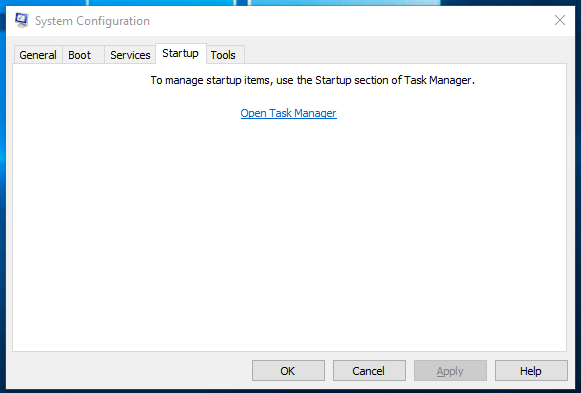

Như bạn thấy, Microsoft khuyến nghị sử dụng **Task Manager** (**taskmgr**) để quản lý (bật/tắt) các mục khởi động. Tiện ích **System Configuration** không phải là chương trình quản lý khởi động.

**Lưu ý:** Nếu bạn mở **Task Manager** trên máy ảo (VM) đính kèm, bạn sẽ nhận thấy rằng Task Manager không hiển thị thẻ **Startup**.

Trong thẻ **Tools** (Công cụ), có danh sách các tiện ích (tools) khác nhau mà bạn có thể chạy để cấu hình thêm hệ điều hành. Có một mô tả ngắn gọn cho mỗi công cụ để cung cấp cái nhìn tổng quan về mục đích sử dụng của nó.

Lưu ý phần **Selected command** (Lệnh được chọn). Thông tin trong hộp văn bản này sẽ thay đổi theo từng công cụ.

Để chạy một công cụ, bạn có thể sử dụng lệnh để khởi chạy công cụ qua **Run prompt**, **Command Prompt**, hoặc bằng cách nhấp vào nút **Launch**.

**Câu hỏi:**

**Câu hỏi 1: Tên của dịch vụ liệt kê Systems Internals là nhà sản xuất là gì?**  

  

Hiển thị đáp án
  
Đáp án: PsShutdown  

  

**Câu hỏi 2: Windows được đăng ký cho ai?**  

  

Hiển thị đáp án
  
Đáp án: Windows User  

  

**Câu hỏi 3: Lệnh cho Windows Troubleshooting là gì?**  

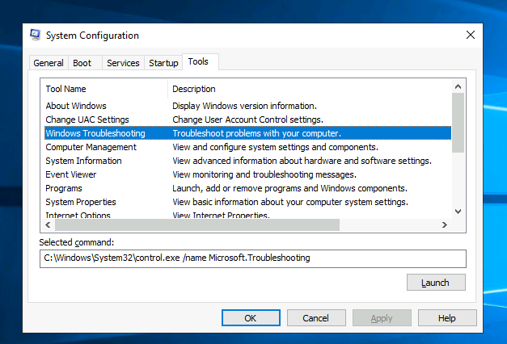

  

Hiển thị đáp án
  
Đáp án: `C:\Windows\System32\control.exe /name Microsoft.Troubleshooting`  

  

**Câu hỏi 4: Lệnh nào sẽ mở Control Panel? (Câu trả lời là tên file .exe, không phải đường dẫn đầy đủ)**  

  

Hiển thị đáp án
  
Đáp án: control.exe  

  

# Task 3: Change UAC Settings

**Thay đổi cài đặt UAC**

Chúng ta tiếp tục với các công cụ có sẵn thông qua bảng **System Configuration**.

**User Account Control (UAC)** đã được trình bày chi tiết trong **Windows Fundamentals 1**.

Cài đặt UAC có thể được thay đổi hoặc thậm chí tắt hoàn toàn (không được khuyến nghị).

Bạn có thể di chuyển thanh trượt để xem cách cài đặt sẽ thay đổi UAC và quan điểm của Microsoft về cài đặt này.

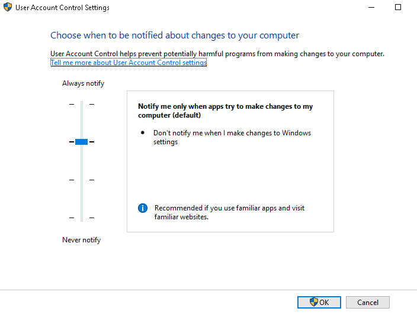

**Câu hỏi: Lệnh để mở User Account Control Settings là gì? (Câu trả lời là tên file .exe, không phải đường dẫn đầy đủ)**  

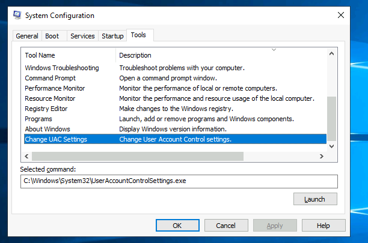

  

Hiển thị đáp án
  
Đáp án: UserAccountControlSettings.exe  

  

# Task 4: Computer Management

Chúng ta tiếp tục với các công cụ có sẵn thông qua bảng **System Configuration**.

Tiện ích **Computer Management** (**compmgmt**) có ba phần chính:  
1. **System Tools** (Công cụ Hệ thống)  
2. **Storage** (Lưu trữ)  
3. **Services and Applications** (Dịch vụ và Ứng dụng).

## **System Tools - Công cụ Hệ thống**

Hãy bắt đầu với **Task Scheduler** (Trình lập lịch tác vụ). Theo Microsoft, với **Task Scheduler**, chúng ta có thể tạo và quản lý các tác vụ thông thường mà máy tính sẽ thực hiện tự động vào các thời điểm chúng ta chỉ định.

- Một tác vụ có thể chạy một ứng dụng, một tập lệnh, v.v., và các tác vụ có thể được cấu hình để chạy tại bất kỳ thời điểm nào.  
- Một tác vụ có thể chạy khi đăng nhập hoặc đăng xuất.  
- Tác vụ cũng có thể được cấu hình để chạy theo lịch trình cụ thể, ví dụ: cứ năm phút một lần.

Để tạo một tác vụ cơ bản, nhấp vào **Create Basic Task** trong mục **Actions** (khung bên phải).

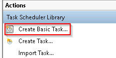

## **Event Viewer**

**Event Viewer** (Trình xem sự kiện) cho phép chúng ta xem các sự kiện đã xảy ra trên máy tính. Những bản ghi sự kiện này có thể được xem như một bản nhật ký kiểm toán, được sử dụng để hiểu hoạt động của hệ thống máy tính. Thông tin này thường được sử dụng để chẩn đoán các vấn đề và điều tra các hành động đã được thực hiện trên hệ thống.

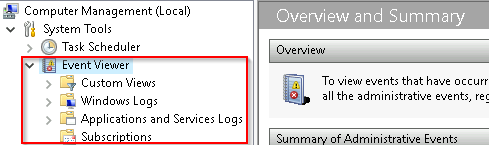

**Event Viewer** có ba khung chính:

1. Khung bên trái cung cấp danh sách dạng cây phân cấp của các nhà cung cấp nhật ký sự kiện (như hiển thị trong hình trên).  
2. Khung ở giữa hiển thị tổng quan chung và tóm tắt về các sự kiện cụ thể từ một nhà cung cấp được chọn.  
3. Khung bên phải là khung hành động (**actions pane**).  

Có năm loại sự kiện có thể được ghi lại. Bên dưới là một bảng từ [docs.microsoft.com](https://learn.microsoft.com/en-us/windows/win32/eventlog/event-types) cung cấp mô tả ngắn gọn cho từng loại.

Bảng dưới đây mô tả năm loại sự kiện được sử dụng trong ghi nhật ký sự kiện:

| **Loại sự kiện** | **Mô tả** |
|------------------|-----------|
| **Error** (Lỗi) | Một sự kiện chỉ ra vấn đề nghiêm trọng như mất dữ liệu hoặc mất chức năng. Ví dụ: nếu một dịch vụ không thể tải trong khi khởi động, một sự kiện lỗi sẽ được ghi lại. |
| **Warning** (Cảnh báo) | Một sự kiện không nhất thiết là nghiêm trọng nhưng có thể chỉ ra vấn đề tiềm ẩn trong tương lai. Ví dụ: khi dung lượng đĩa thấp, một sự kiện cảnh báo sẽ được ghi lại. Nếu một ứng dụng có thể phục hồi từ một sự kiện mà không mất dữ liệu hoặc chức năng, nó thường được phân loại là một sự kiện cảnh báo. |
| **Information** (Thông tin) | Một sự kiện mô tả hoạt động thành công của một ứng dụng, trình điều khiển hoặc dịch vụ. Ví dụ: khi một trình điều khiển mạng tải thành công, một sự kiện thông tin sẽ được ghi lại. Lưu ý rằng việc ghi lại mỗi lần khởi động của một ứng dụng không được khuyến nghị đối với các ứng dụng trên máy tính để bàn. |
| **Success Audit** (Kiểm tra thành công) | Một sự kiện ghi lại một lần truy cập bảo mật đã được kiểm tra và thành công. Ví dụ: nỗ lực đăng nhập thành công của người dùng sẽ được ghi lại là một sự kiện kiểm tra thành công. |
| **Failure Audit** (Kiểm tra thất bại) | Một sự kiện ghi lại một lần truy cập bảo mật đã được kiểm tra và thất bại. Ví dụ: nếu một người dùng cố gắng truy cập ổ đĩa mạng và thất bại, nỗ lực này sẽ được ghi lại là một sự kiện kiểm tra thất bại. |

**Các nhật ký chuẩn có thể được xem trong mục Windows Logs.** Dưới đây là một bảng từ [docs.microsoft.com](https://learn.microsoft.com/en-us/windows/win32/eventlog/eventlog-key) cung cấp mô tả ngắn gọn cho từng loại nhật ký:

| **Loại nhật ký**    | **Mô tả** |
|---------------------|-----------|
| **Application**     | Chứa các sự kiện được ghi bởi các ứng dụng. Ví dụ: một ứng dụng cơ sở dữ liệu có thể ghi lại lỗi tệp. Nhà phát triển ứng dụng quyết định sự kiện nào sẽ được ghi lại. |
| **Security**        | Chứa các sự kiện như các lần đăng nhập hợp lệ và không hợp lệ, cũng như các sự kiện liên quan đến việc sử dụng tài nguyên như tạo, mở hoặc xóa tệp hoặc đối tượng khác. Quản trị viên có thể bắt đầu kiểm tra để ghi lại các sự kiện trong nhật ký bảo mật. |
| **System**          | Chứa các sự kiện được ghi lại bởi các thành phần hệ thống, chẳng hạn như lỗi của trình điều khiển hoặc thành phần hệ thống khác không thể tải khi khởi động. |
| **CustomLog**       | Chứa các sự kiện được ghi bởi các ứng dụng tạo nhật ký tùy chỉnh. Sử dụng nhật ký tùy chỉnh cho phép một ứng dụng kiểm soát kích thước nhật ký hoặc gắn ACL (Access Control List) cho mục đích bảo mật mà không ảnh hưởng đến các ứng dụng khác. |

Để biết thêm thông tin về **Event Viewer** và **Event Logs**, vui lòng tham khảo **[Windows Event Log room](https://tryhackme.com/r/why-subscribe?roomCode=windowseventlogs)**.

**Shared Folders** (Thư mục được chia sẻ) là nơi bạn có thể xem danh sách đầy đủ các thư mục và tài nguyên được chia sẻ mà người khác có thể kết nối đến.

Trong hình trên, trong mục **Shares** (Chia sẻ), có các chia sẻ mặc định của Windows như **C$** và các chia sẻ quản trị từ xa mặc định được tạo bởi Windows, chẳng hạn như **ADMIN$**.

- Giống như bất kỳ đối tượng nào trong Windows, bạn có thể nhấp chuột phải vào một thư mục để xem thuộc tính của nó, chẳng hạn như **Permissions** (Quyền truy cập) để xác định ai có thể truy cập tài nguyên chia sẻ.

- Trong mục **Sessions**, bạn sẽ thấy danh sách những người dùng hiện đang kết nối đến các tài nguyên chia sẻ. Trong máy ảo (VM) này, bạn sẽ không thấy ai đang kết nối.

- Tất cả các thư mục và/hoặc tệp mà người dùng kết nối có thể truy cập sẽ được liệt kê trong **Open Files**.

- Phần **Local Users and Groups** (Người dùng và nhóm cục bộ) bạn có thể đã quen thuộc từ **Windows Fundamentals 1**, vì nó là **lusrmgr.msc**.

- Trong **Performance**, bạn sẽ thấy một tiện ích gọi là **Performance Monitor** (**perfmon**).

**Performance Monitor** được sử dụng để xem dữ liệu hiệu suất theo thời gian thực hoặc từ một tệp nhật ký. Tiện ích này rất hữu ích trong việc khắc phục các vấn đề hiệu suất trên hệ thống máy tính, dù là hệ thống cục bộ hay từ xa.

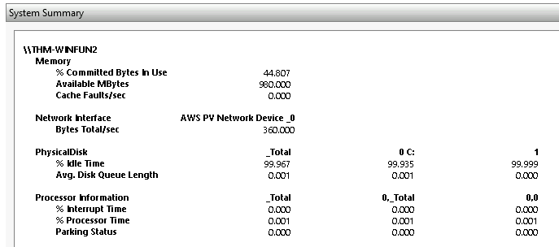

**Device Manager** (Trình quản lý Thiết bị) cho phép chúng ta xem và cấu hình phần cứng, chẳng hạn như vô hiệu hóa bất kỳ thiết bị phần cứng nào được kết nối với máy tính.

**Disk Management** (Quản lý Đĩa) là một tiện ích hệ thống trong Windows cho phép bạn thực hiện các tác vụ lưu trữ nâng cao. Một số tác vụ bao gồm:

- Thiết lập một ổ đĩa mới.  
- Mở rộng một phân vùng.  
- Thu nhỏ một phân vùng.  
- Gán hoặc thay đổi ký tự ổ đĩa (ví dụ: E:).  

## **Dịch vụ và Ứng dụng (Services and Applications)**

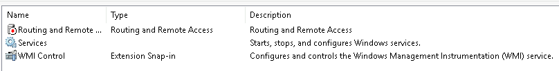

Nhớ lại từ nhiệm vụ trước, **một dịch vụ** là một loại ứng dụng đặc biệt chạy ở chế độ nền. Tại đây, bạn có thể làm nhiều hơn ngoài việc bật hoặc tắt một dịch vụ, chẳng hạn như xem **Properties** (Thuộc tính) của dịch vụ đó.

**WMI Control** cấu hình và kiểm soát dịch vụ **Windows Management Instrumentation (WMI)**.

Theo Wikipedia:  
“**WMI** cho phép các ngôn ngữ kịch bản (như VBScript hoặc Windows PowerShell) quản lý máy tính cá nhân và máy chủ Windows của Microsoft, cả cục bộ và từ xa. Microsoft cũng cung cấp một giao diện dòng lệnh cho WMI gọi là **Windows Management Instrumentation Command-line (WMIC)**.”

**Lưu ý:** Công cụ **WMIC** đã bị ngừng sử dụng trong Windows 10, phiên bản 21H1. **Windows PowerShell** thay thế công cụ này cho **WMI**.

**Câu hỏi:**

**Câu hỏi 1: Lệnh để mở Computer Management là gì? (Câu trả lời là tên file .msc, không phải đường dẫn đầy đủ)**  

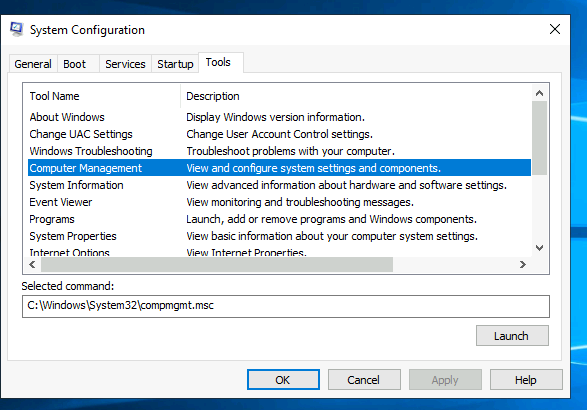

  

Hiển thị đáp án
  
Đáp án: compmgmt.msc  

  

**Câu hỏi 2: GoogleUpdateTaskMachineUA được cấu hình chạy vào thời gian nào mỗi ngày?**  

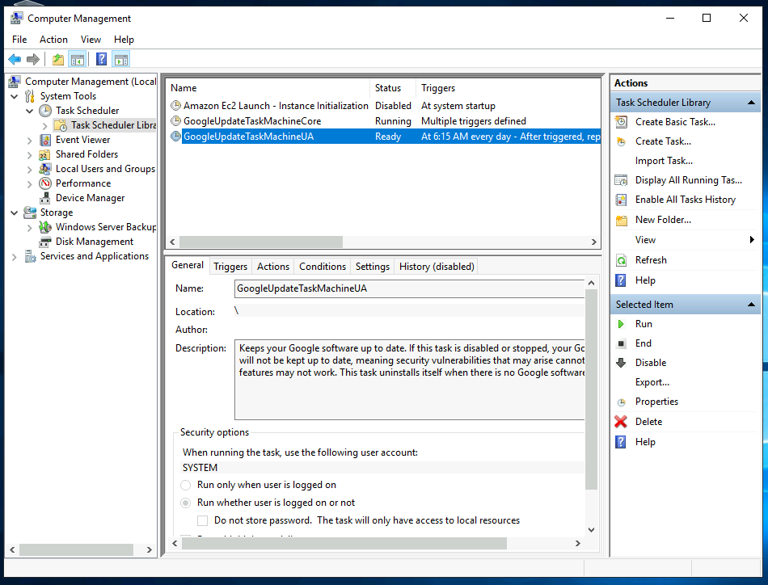

  

Hiển thị đáp án
  
Đáp án: 6:15 AM  

  

**Câu hỏi 3: Tên của thư mục ẩn được chia sẻ là gì?**  

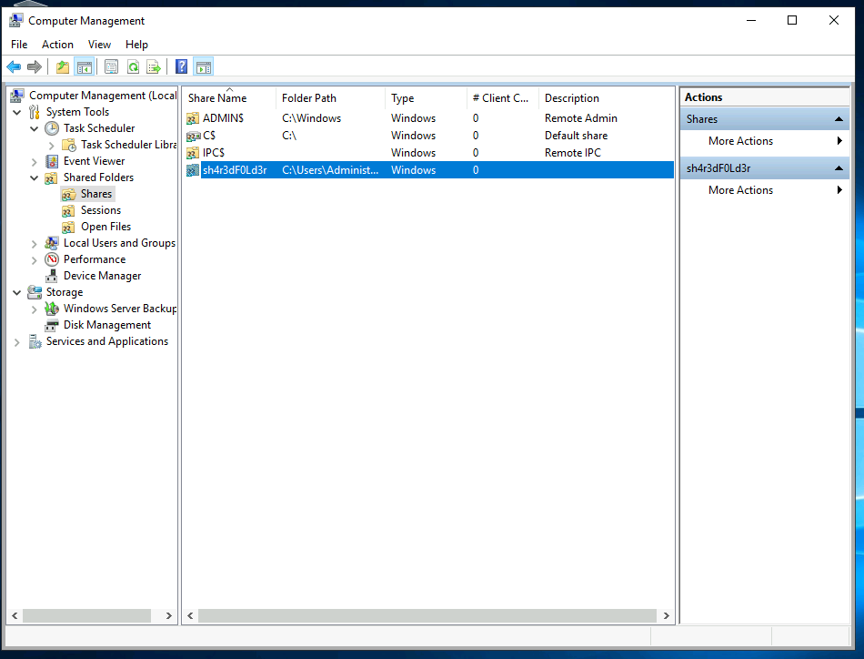

  

Hiển thị đáp án
  
Đáp án: sh4r3dF0Ld3r  

  

# Task 5: System Information

**Chúng ta tiếp tục với các công cụ có sẵn thông qua bảng System Configuration.**

**System Information** (msinfo32) là gì?

Theo Microsoft:  
“**Windows** bao gồm một công cụ được gọi là **Microsoft System Information** (Msinfo32.exe). Công cụ này thu thập thông tin về máy tính của bạn và hiển thị cái nhìn tổng quan toàn diện về phần cứng, các thành phần hệ thống và môi trường phần mềm, giúp bạn chẩn đoán các vấn đề của máy tính.”

Thông tin trong **System Summary** (Tóm tắt Hệ thống) được chia thành ba phần chính:  

- **Hardware Resources** (Tài nguyên Phần cứng)  
- **Components** (Các Thành phần)  
- **Software Environment** (Môi trường Phần mềm)  

**System Summary** sẽ hiển thị các thông số kỹ thuật chung của máy tính, chẳng hạn như nhãn hiệu và mẫu của bộ xử lý.

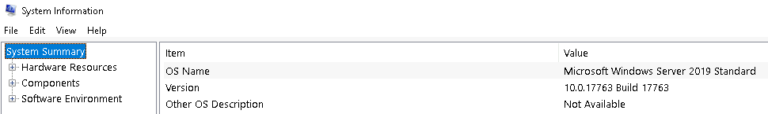

Thông tin hiển thị trong **Hardware Resources** (Tài nguyên Phần cứng) không dành cho người dùng máy tính phổ thông. Nếu bạn muốn tìm hiểu thêm về phần này, hãy tham khảo [trang chính thức của Microsoft](https://learn.microsoft.com/en-us/windows-hardware/drivers/kernel/hardware-resources).

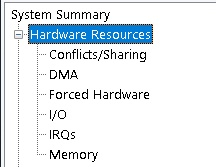

Trong mục **Components** (Các Thành phần), bạn có thể xem thông tin chi tiết về các thiết bị phần cứng được cài đặt trên máy tính. Một số mục có thể không hiển thị bất kỳ thông tin nào, nhưng một số mục như **Display** (Hiển thị) và **Input** (Thiết bị đầu vào) sẽ có thông tin.

Trong mục **Software Environment** (Môi trường Phần mềm), bạn có thể xem thông tin về phần mềm được tích hợp trong hệ điều hành và các phần mềm bạn đã cài đặt. Các chi tiết khác cũng có thể thấy trong phần này, chẳng hạn như **Environment Variables** (Biến Môi trường) và **Network Connections** (Kết nối Mạng).

Nhớ lại từ **Windows Fundamentals 1 room** (nhiệm vụ **Windows\System32 Folder**) nơi **Environment Variables** (Biến Môi trường) đã được đề cập ngắn gọn.

Theo Microsoft:  
**"Environment variables** lưu trữ thông tin về môi trường của hệ điều hành. Thông tin này bao gồm các chi tiết như đường dẫn hệ điều hành, số lượng bộ xử lý được sử dụng bởi hệ điều hành và vị trí của các thư mục tạm thời.  

Các biến môi trường lưu trữ dữ liệu được sử dụng bởi hệ điều hành và các chương trình khác. Ví dụ, biến môi trường **WINDIR** chứa vị trí của thư mục cài đặt Windows. Các chương trình có thể truy vấn giá trị của biến này để xác định nơi các tệp hệ điều hành Windows được đặt."

Nhấp vào **Environment Variables** để xem các giá trị được gán cho máy ảo.

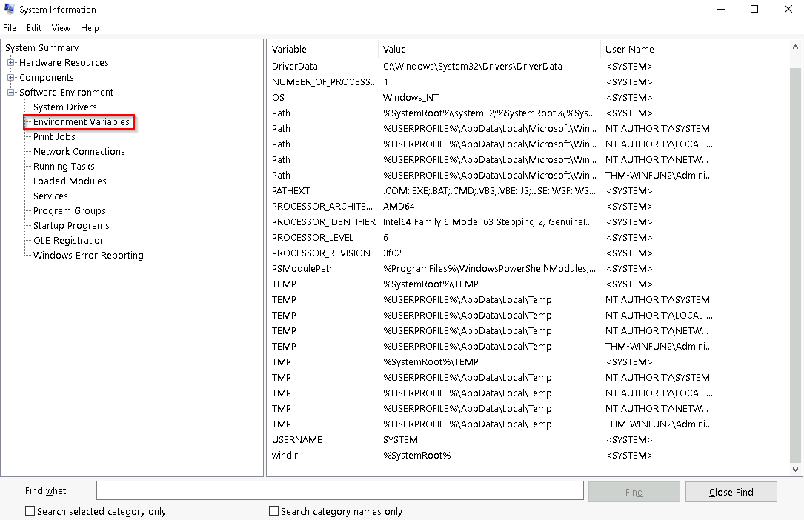

Một phương pháp khác để xem **Environment Variables** (Biến Môi trường) là:  

- **Control Panel** > **System and Security** > **System** > **Advanced system settings** > **Environment Variables**  
Hoặc:  
- **Settings** > **System** > **About** > **System info** > **Advanced system settings** > **Environment Variables**.

Đã hết phần chuyển hướng, chúng ta hãy quay trở lại với **msinfo32** và tiếp tục từ nơi đã dừng.

Ở phần dưới cùng của tiện ích này, có một thanh tìm kiếm. Hãy thử sử dụng nó. Chọn **Components** (Thành phần) và tìm kiếm **IP address** (Địa chỉ IP).

**Câu hỏi:**

**Câu hỏi 1: Lệnh để mở System Information là gì? (Câu trả lời là tên file .exe, không phải đường dẫn đầy đủ)**  

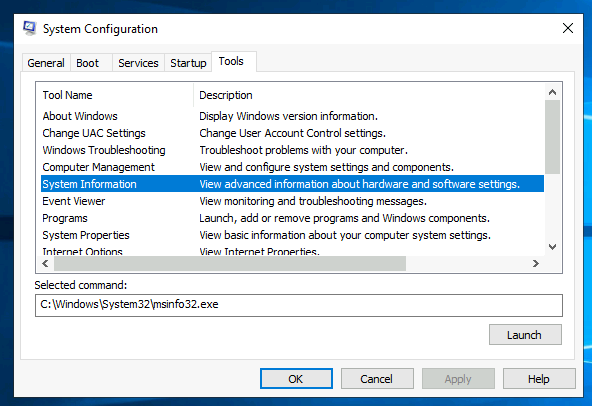

  

Hiển thị đáp án
  
Đáp án: msinfo32.exe  

  

**Câu hỏi 2: Dưới System Name, thông tin nào được liệt kê?**  

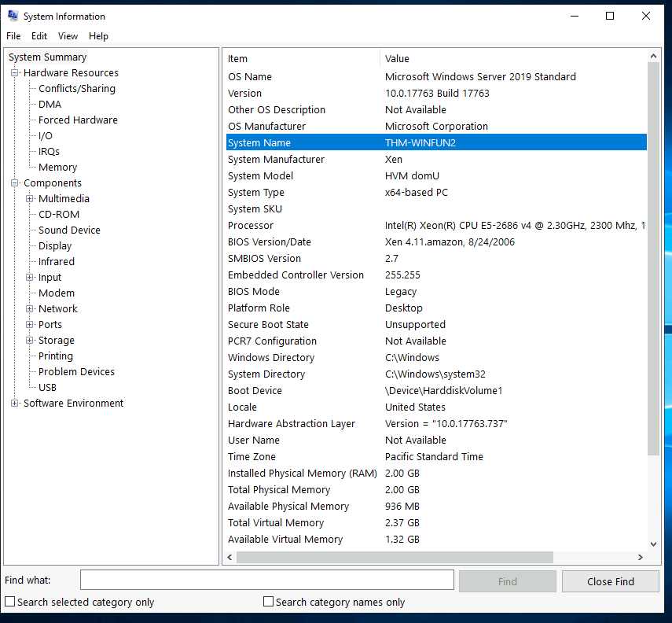

  

Hiển thị đáp án
  
Đáp án: THM-WINFUN2  

  

**Câu hỏi 3: Trong Environment Variables, giá trị cho ComSpec là gì?**  

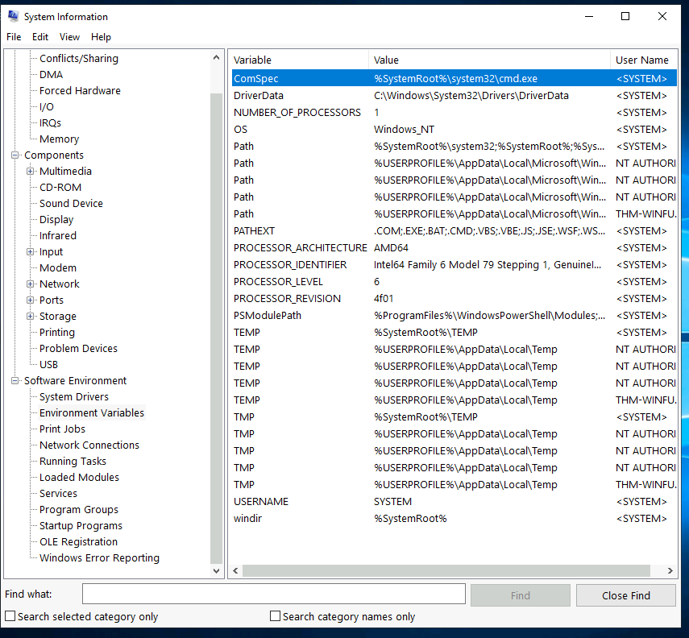

  

Hiển thị đáp án
  
Đáp án: %SystemRoot%\system32\cmd.exe  

  

# Task 6: Resource Monitor

Chúng ta tiếp tục với các công cụ có sẵn thông qua bảng **System Configuration**.

**Resource Monitor** (**resmon**) là gì?

Theo Microsoft:  
**"Resource Monitor hiển thị thông tin sử dụng CPU, bộ nhớ, ổ đĩa, và mạng theo từng quy trình và tổng hợp, bên cạnh việc cung cấp chi tiết về quy trình nào đang sử dụng từng tệp hoặc mô-đun cụ thể. Tính năng lọc nâng cao cho phép người dùng cô lập dữ liệu liên quan đến một hoặc nhiều quy trình (dù là ứng dụng hay dịch vụ), khởi động, dừng, tạm dừng, và tiếp tục các dịch vụ, và đóng các ứng dụng không phản hồi từ giao diện người dùng. Nó cũng bao gồm tính năng phân tích quy trình giúp xác định các quy trình bị khóa và các xung đột khóa tệp để người dùng có thể cố gắng giải quyết xung đột mà không cần đóng ứng dụng và có nguy cơ mất dữ liệu."**

Như một số công cụ khác được đề cập trong phần này, tiện ích này chủ yếu dành cho người dùng nâng cao cần thực hiện các thao tác khắc phục sự cố trên hệ thống máy tính.

Trong thẻ **Overview** (Tổng quan), **Resmon** có bốn phần chính:

- **CPU**  
- **Disk** (Ổ đĩa)  
- **Network** (Mạng)  
- **Memory** (Bộ nhớ)

Bốn phần tương ứng cũng có các thẻ riêng ở phía trên cùng. Xem bên dưới để biết thêm chi tiết.

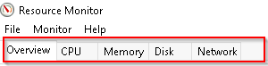

Lưu ý rằng mỗi thẻ có thông tin bổ sung riêng. Một hình ảnh được hiển thị bên dưới cho từng thẻ.

## CPU

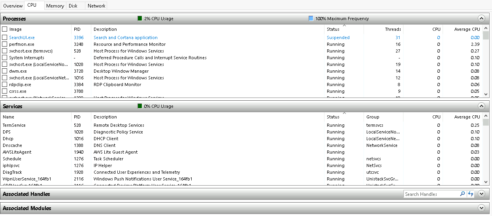

## Memory

## Disk

## Network

Mặc dù không được hiển thị trong bất kỳ hình ảnh nào ở trên, **Resource Monitor** có một khung ở bên phải cùng. Khung này hiển thị một chế độ xem đồ họa theo thời gian thực cho từng phần.

**Lưu ý:** Thông tin hiển thị trong **Resource Monitor** sẽ khác nhau tùy vào hệ thống của bạn so với các hình ảnh minh họa ở trên.

**Câu hỏi: Lệnh để mở Resource Monitor là gì? (Câu trả lời là tên file .exe, không phải đường dẫn đầy đủ)** 

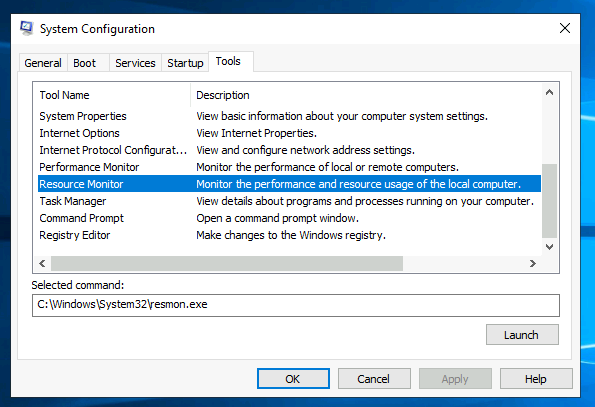

  

Hiển thị đáp án
  
Đáp án: resmon.exe  

  

# Task 7: Command Prompt

Chúng ta tiếp tục với các công cụ có sẵn thông qua bảng **System Configuration**.

**Command Prompt** (**cmd**) thoạt nhìn có vẻ khó hiểu, nhưng thực sự nó không quá phức tạp khi bạn hiểu cách tương tác với nó.

Trong các hệ điều hành cũ, dòng lệnh là cách duy nhất để tương tác với hệ điều hành.  
Khi giao diện người dùng đồ họa (**GUI**) được giới thiệu, nó cho phép người dùng thực hiện các tác vụ phức tạp chỉ với vài cú nhấp chuột thay vì nhập lệnh trong dòng lệnh.

Mặc dù **GUI** là cách chính để tương tác với hệ điều hành, người dùng máy tính vẫn có thể tương tác qua **Command Prompt**.

Trong nhiệm vụ này, chúng ta sẽ chỉ đề cập đến một vài lệnh cơ bản mà người dùng máy tính có thể chạy trong **Command Prompt** để thu thập thông tin về hệ thống.

Hãy bắt đầu với một vài lệnh đơn giản, chẳng hạn như:  
- **hostname**  
- **whoami**  

Lệnh **hostname** sẽ xuất ra tên máy tính.

Lệnh **whoami** sẽ xuất ra tên của người dùng hiện đang đăng nhập.

Tiếp theo, hãy xem xét một số lệnh hữu ích khi khắc phục sự cố.  

Một lệnh được sử dụng thường xuyên là **ipconfig**. Lệnh này sẽ hiển thị các thiết lập địa chỉ mạng cho máy tính.

Mỗi lệnh sẽ có một hướng dẫn trợ giúp để giải thích cú pháp cần thiết để thực hiện đúng lệnh, cùng với các tham số bổ sung có thể được thêm vào để mở rộng chức năng của lệnh.

Một lệnh để lấy hướng dẫn trợ giúp cho một lệnh là **/?**.

Ví dụ, để xem hướng dẫn trợ giúp cho **ipconfig**, bạn có thể sử dụng lệnh sau:  
**ipconfig /?**

**Lưu ý:** Để xóa màn hình dòng lệnh, sử dụng lệnh **cls**.  

Lệnh tiếp theo là **netstat**. Theo hướng dẫn trợ giúp, lệnh này sẽ hiển thị thống kê giao thức và các kết nối mạng TCP/IP hiện tại.

Trong hình trên, dòng nằm trong khung đỏ cho thấy một ví dụ về cú pháp của lệnh.

Cấu trúc này cho chúng ta biết lệnh **netstat** có thể chạy độc lập hoặc đi kèm với các tham số, như **-a**, **-b**, **-e**, v.v.

Khi bất kỳ tham số nào được thêm vào lệnh gốc (**netstat** trong trường hợp này), đầu ra sẽ thay đổi. Hãy thử vài tham số để xem kết quả.

Lệnh **net** chủ yếu được sử dụng để quản lý các tài nguyên mạng. Lệnh này hỗ trợ các lệnh con (**sub-commands**).  

Nếu bạn nhập **net** mà không có lệnh con, đầu ra sẽ hiển thị cú pháp cho lệnh gốc, bao gồm một vài lệnh con mà bạn có thể sử dụng.

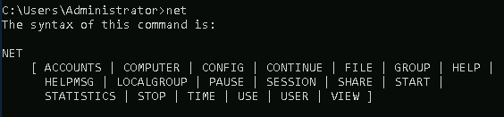

Đối với lệnh **net**, để hiển thị hướng dẫn trợ giúp, tham số **/?** sẽ không hoạt động. Trong trường hợp này, bạn cần sử dụng cú pháp khác, đó là:  
**net help**.

Vì vậy, nếu bạn muốn xem thông tin trợ giúp cho lệnh **net user**, lệnh cần sử dụng là:  
**net help user**.

Bạn có thể sử dụng cùng một lệnh để xem thông tin trợ giúp cho các lệnh con khác hữu ích của **net**, chẳng hạn như **localgroup**, **use**, **share**, và **session**.  

Tham khảo liên kết sau để xem danh sách đầy đủ các lệnh bạn có thể thực thi trong Command Prompt [tại đây](https://ss64.com/nt/).

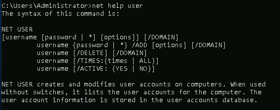

**Câu hỏi:**

**Câu hỏi 1: Trong System Configuration, lệnh đầy đủ cho Internet Protocol Configuration là gì?**  

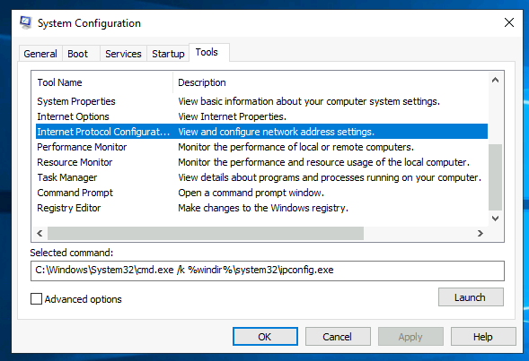

  

Hiển thị đáp án
  
Đáp án: C:\Windows\System32\cmd.exe /k %windir%\system32\ipconfig.exe  

  

**Câu hỏi 2: Với lệnh ipconfig, làm thế nào để hiển thị thông tin chi tiết?**  

  

Hiển thị đáp án
  
Đáp án: ipconfig /all  

  

# Task 8: Registry Editor

Windows Registry (theo Microsoft) là một cơ sở dữ liệu phân cấp trung tâm được sử dụng để lưu trữ thông tin cần thiết nhằm cấu hình hệ thống cho một hoặc nhiều người dùng, ứng dụng, và các thiết bị phần cứng.

Registry chứa các thông tin mà Windows tham chiếu liên tục trong quá trình hoạt động, chẳng hạn như:

- Hồ sơ cho từng người dùng.
- Các ứng dụng được cài đặt trên máy tính và loại tài liệu mà mỗi ứng dụng có thể tạo.
- Cài đặt tệp thuộc tính cho thư mục và biểu tượng ứng dụng.
- Những phần cứng nào đang tồn tại trên hệ thống.
- Các cổng đang được sử dụng.

**Cảnh báo:** Registry dành cho người dùng nâng cao. Việc thay đổi trong registry có thể ảnh hưởng đến hoạt động bình thường của máy tính.

Có nhiều cách để xem/chỉnh sửa registry. Một cách là sử dụng công cụ **Registry Editor** (regedit).

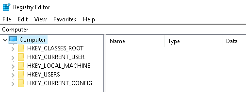

Để tìm hiểu thêm về Windows Registry, bạn có thể tham khảo tài liệu của Microsoft thông qua liên kết [tại đây](https://learn.microsoft.com/en-us/troubleshoot/windows-server/performance/windows-registry-advanced-users).

**Câu hỏi: Lệnh để mở Registry Editor là gì? (Câu trả lời là tên file .exe, không phải đường dẫn đầy đủ)**  

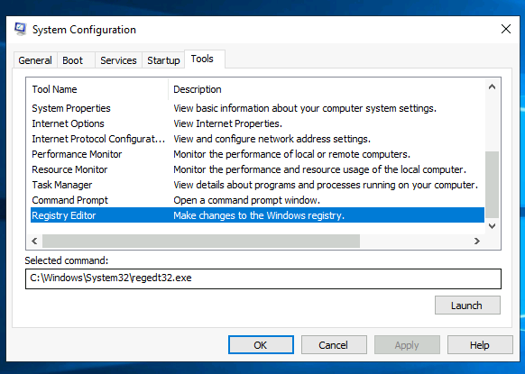

  

Hiển thị đáp án
  
Đáp án: regedt32.exe  

  

# Task 9: Conclusion

**Kết luận:**

Hãy nhớ rằng các nhiệm vụ được đề cập trong phần này là một số công cụ có thể được khởi chạy từ **MSConfig**.

Trong suốt phần này, các lệnh và phím tắt đã được chia sẻ để sử dụng các tiện ích. Điều này có nghĩa là bạn không nhất thiết phải khởi chạy **MSConfig** để sử dụng chúng.

Bạn cũng có thể chạy một số tiện ích này trực tiếp từ **Start Menu**. 

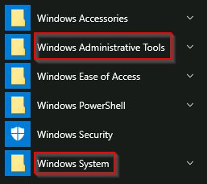

**Lưu ý:** Một số công cụ được liệt kê trong **MSConfig**, nhưng không được đề cập ở đây, đã được đề cập trong **Windows Fundamentals 1** hoặc để bạn tự khám phá thêm.

