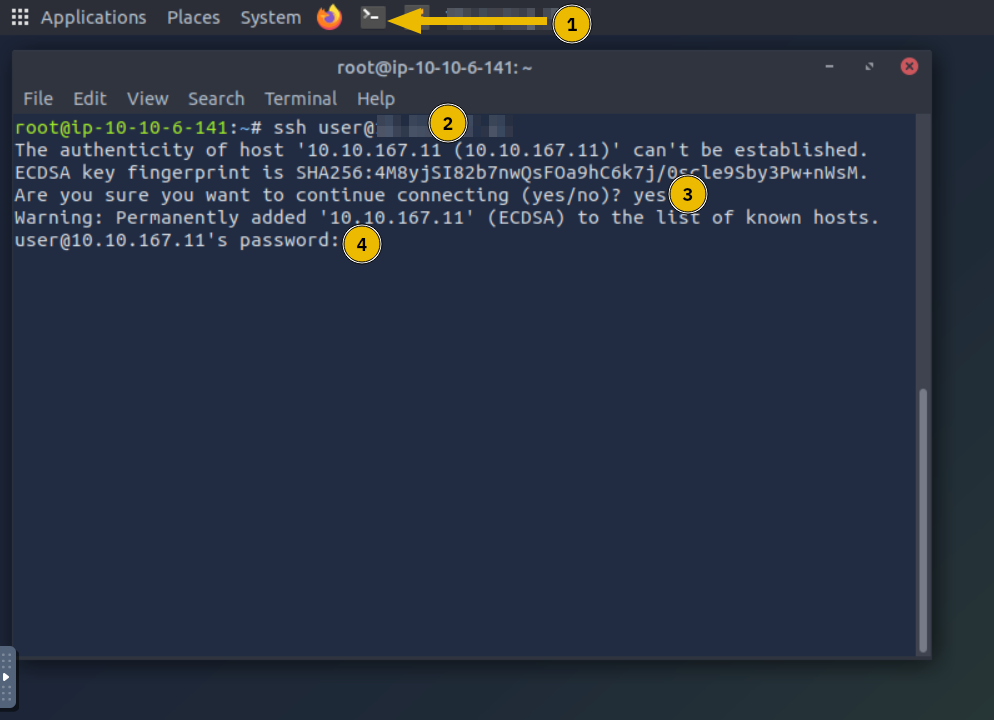
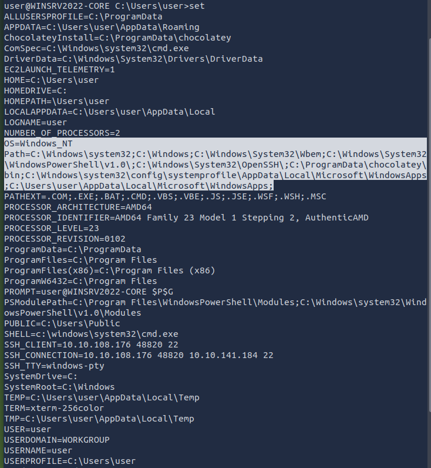

# Windows Command Line

>Tìm hiểu các lệnh Windows cần thiết.

## Mục lục

1. [Task 1: Introduction](#task-1-introduction)  
2. [Task 2: Basic System Information](#task-2-basic-system-information)  
3. [Task 3: Network Troubleshooting](#task-3-network-troubleshooting)  
4. [Task 4: File and Disk Management](#task-4-file-and-disk-management)  
5. [Task 5: Task and Process Management](#task-5-task-and-process-management)  
6. [Task 6: Conclusion](#task-6-conclusion)

## Nội dung

# Task 1: Introduction

---

Mọi người thường thích sử dụng giao diện đồ họa người dùng (GUI) cho đến khi họ thành thạo giao diện dòng lệnh (CLI). Có nhiều lý do cho điều đó. Một lý do là GUI thường trực quan. Nếu ai đó đưa cho bạn một giao diện GUI mà bạn không quen thuộc, bạn vẫn có thể dễ dàng khám phá và tìm ra phần không rõ ràng. So sánh điều đó với việc làm việc với CLI – tức là dòng lệnh.

CLI thường có đường cong học tập, tuy nhiên, khi bạn làm chủ dòng lệnh, bạn sẽ thấy nó nhanh hơn và hiệu quả hơn. Hãy xem ví dụ đơn giản sau: bạn cần bao nhiêu cú nhấp chuột để tìm địa chỉ IP của mình trên giao diện đồ họa? Sử dụng dòng lệnh, bạn thậm chí không cần rời tay khỏi bàn phím. Giả sử bạn muốn kiểm tra lại địa chỉ IP – bạn chỉ cần nhập lại cùng một lệnh, thay vì di chuyển chuột khắp màn hình.

Có rất nhiều lợi thế khác khi sử dụng CLI bên cạnh tốc độ và hiệu suất. Dưới đây là một vài:

* **Sử dụng ít tài nguyên hơn**: CLI yêu cầu ít tài nguyên hệ thống hơn các GUI đồ họa nặng. Nói cách khác, bạn có thể chạy hệ thống CLI trên phần cứng cũ hoặc các hệ thống có bộ nhớ hạn chế. Nếu bạn dùng điện toán đám mây, hệ thống của bạn sẽ yêu cầu ít tài nguyên hơn, từ đó giúp giảm chi phí.

* **Tự động hóa**: Dù bạn có thể tự động hóa các tác vụ GUI, việc tạo tập tin batch hoặc script với các lệnh bạn cần lặp lại sẽ dễ dàng hơn nhiều với CLI.

* **Quản lý từ xa**: CLI giúp việc sử dụng SSH để quản lý hệ thống từ xa như máy chủ, router hoặc thiết bị IoT trở nên dễ dàng hơn. Cách tiếp cận này rất hiệu quả trong mạng chậm hoặc hệ thống có tài nguyên hạn chế.

---

### Mục tiêu học tập

Mục đích của phần này là giúp bạn học cách sử dụng Command Prompt của Windows (cmd.exe) – trình thông dịch dòng lệnh mặc định trong môi trường Windows. Chúng ta sẽ học cách sử dụng dòng lệnh để:

* Hiển thị thông tin cơ bản về hệ thống
* Kiểm tra và khắc phục sự cố mạng
* Quản lý file và thư mục
* Kiểm tra các tiến trình đang chạy

---

Dưới đây là bản dịch tiếng Việt của nội dung trong ảnh:

---

### Yêu cầu trước khi bắt đầu

Ở đây chúng ta sử dụng máy ảo trên TryHackMe

Khởi động AttackBox bằng cách nhấn nút **Start AttackBox** ở đầu trang. Máy AttackBox sẽ bắt đầu ở chế độ màn hình chia đôi (Split-Screen). Nếu không thấy, hãy nhấn nút **Show Split View** màu xanh ở đầu trang.

Bạn có thể sử dụng client **SSH** trên AttackBox để kết nối đến địa chỉ `10.10.141.184` với thông tin đăng nhập sau:

* **Tên người dùng**: `user`
* **Mật khẩu**: `Tryhackme123!`

---

### Thiết lập kết nối SSH từ AttackBox

Nếu đây là lần đầu tiên bạn tạo kết nối SSH từ AttackBox đến hệ thống mục tiêu, hãy làm theo các bước dưới đây:

1. Mở terminal của AttackBox bằng cách nhấp vào biểu tượng terminal được đánh dấu số 1.
2. Để kết nối đến máy ảo mục tiêu, sử dụng lệnh:

   ```
   ssh user@10.10.141.184
   ```

   Trong đó `user` là tên người dùng.
3. Vì đây là lần đầu bạn kết nối tới máy ảo mục tiêu, bạn sẽ được hỏi có tin tưởng kết nối này không. Hãy trả lời **yes**.
4. Nhập mật khẩu: `Tryhackme123!`
   (Lưu ý rằng mật khẩu sẽ không hiển thị khi bạn gõ.)



---

**Hãy trả lời các câu hỏi bên dưới**

**Câu hỏi: Trình thông dịch dòng lệnh mặc định trong môi trường Windows là gì?**

<details>
  <summary>Hiển thị đáp án</summary>
  Đáp án: `cmd.exe`
</details>

---

# Task 2: Basic System Information


---

Trước khi thực thi các lệnh, chúng ta cần lưu ý rằng chỉ có thể sử dụng các lệnh nằm trong **Windows Path**.
Bạn có thể dùng lệnh `set` để kiểm tra biến đường dẫn từ dòng lệnh.
Kết quả hiển thị từ terminal sẽ cho biết đường dẫn mà hệ điều hành Windows sẽ sử dụng để thực thi các lệnh, được chỉ ra bằng dòng bắt đầu với `Path=`.



---

