# Windows Command Line

>Tìm hiểu các lệnh Windows cần thiết.

## Mục lục

1. [Task 1: Introduction](#task-1-introduction)  
2. [Task 2: Basic System Information](#task-2-basic-system-information)  
3. [Task 3: Network Troubleshooting](#task-3-network-troubleshooting)  
4. [Task 4: File and Disk Management](#task-4-file-and-disk-management)  
5. [Task 5: Task and Process Management](#task-5-task-and-process-management)  
6. [Task 6: Conclusion](#task-6-conclusion)

## Nội dung

# Task 1: Introduction

---

Mọi người thường thích sử dụng giao diện đồ họa người dùng (GUI) cho đến khi họ thành thạo giao diện dòng lệnh (CLI). Có nhiều lý do cho điều đó. Một lý do là GUI thường trực quan. Nếu ai đó đưa cho bạn một giao diện GUI mà bạn không quen thuộc, bạn vẫn có thể dễ dàng khám phá và tìm ra phần không rõ ràng. So sánh điều đó với việc làm việc với CLI – tức là dòng lệnh.

CLI thường có đường cong học tập, tuy nhiên, khi bạn làm chủ dòng lệnh, bạn sẽ thấy nó nhanh hơn và hiệu quả hơn. Hãy xem ví dụ đơn giản sau: bạn cần bao nhiêu cú nhấp chuột để tìm địa chỉ IP của mình trên giao diện đồ họa? Sử dụng dòng lệnh, bạn thậm chí không cần rời tay khỏi bàn phím. Giả sử bạn muốn kiểm tra lại địa chỉ IP – bạn chỉ cần nhập lại cùng một lệnh, thay vì di chuyển chuột khắp màn hình.

Có rất nhiều lợi thế khác khi sử dụng CLI bên cạnh tốc độ và hiệu suất. Dưới đây là một vài:

* **Sử dụng ít tài nguyên hơn**: CLI yêu cầu ít tài nguyên hệ thống hơn các GUI đồ họa nặng. Nói cách khác, bạn có thể chạy hệ thống CLI trên phần cứng cũ hoặc các hệ thống có bộ nhớ hạn chế. Nếu bạn dùng điện toán đám mây, hệ thống của bạn sẽ yêu cầu ít tài nguyên hơn, từ đó giúp giảm chi phí.

* **Tự động hóa**: Dù bạn có thể tự động hóa các tác vụ GUI, việc tạo tập tin batch hoặc script với các lệnh bạn cần lặp lại sẽ dễ dàng hơn nhiều với CLI.

* **Quản lý từ xa**: CLI giúp việc sử dụng SSH để quản lý hệ thống từ xa như máy chủ, router hoặc thiết bị IoT trở nên dễ dàng hơn. Cách tiếp cận này rất hiệu quả trong mạng chậm hoặc hệ thống có tài nguyên hạn chế.

---

### Mục tiêu học tập

Mục đích của phần này là giúp bạn học cách sử dụng Command Prompt của Windows (cmd.exe) – trình thông dịch dòng lệnh mặc định trong môi trường Windows. Chúng ta sẽ học cách sử dụng dòng lệnh để:

* Hiển thị thông tin cơ bản về hệ thống
* Kiểm tra và khắc phục sự cố mạng
* Quản lý file và thư mục
* Kiểm tra các tiến trình đang chạy

---

Dưới đây là bản dịch tiếng Việt của nội dung trong ảnh:

---

### Yêu cầu trước khi bắt đầu

Ở đây chúng ta sử dụng máy ảo trên TryHackMe

Khởi động AttackBox bằng cách nhấn nút **Start AttackBox** ở đầu trang. Máy AttackBox sẽ bắt đầu ở chế độ màn hình chia đôi (Split-Screen). Nếu không thấy, hãy nhấn nút **Show Split View** màu xanh ở đầu trang.

Bạn có thể sử dụng client **SSH** trên AttackBox để kết nối đến địa chỉ `10.10.141.184` với thông tin đăng nhập sau:

* **Tên người dùng**: `user`
* **Mật khẩu**: `Tryhackme123!`

---

### Thiết lập kết nối SSH từ AttackBox

Nếu đây là lần đầu tiên bạn tạo kết nối SSH từ AttackBox đến hệ thống mục tiêu, hãy làm theo các bước dưới đây:

1. Mở terminal của AttackBox bằng cách nhấp vào biểu tượng terminal được đánh dấu số 1.
2. Để kết nối đến máy ảo mục tiêu, sử dụng lệnh:

   ```
   ssh user@10.10.141.184
   ```

   Trong đó `user` là tên người dùng.
3. Vì đây là lần đầu bạn kết nối tới máy ảo mục tiêu, bạn sẽ được hỏi có tin tưởng kết nối này không. Hãy trả lời **yes**.
4. Nhập mật khẩu: `Tryhackme123!`
   (Lưu ý rằng mật khẩu sẽ không hiển thị khi bạn gõ.)


---

**Hãy trả lời các câu hỏi bên dưới**

**Câu hỏi: Trình thông dịch dòng lệnh mặc định trong môi trường Windows là gì?**

<details>
  <summary>Hiển thị đáp án</summary>
  Đáp án: `cmd.exe`
</details>

---

# Task 2: Basic System Information


---

Trước khi thực thi các lệnh, chúng ta cần lưu ý rằng chỉ có thể sử dụng các lệnh nằm trong **Windows Path**.
Bạn có thể dùng lệnh `set` để kiểm tra biến đường dẫn từ dòng lệnh.
Kết quả hiển thị từ terminal sẽ cho biết đường dẫn mà hệ điều hành Windows sẽ sử dụng để thực thi các lệnh, được chỉ ra bằng dòng bắt đầu với `Path=`.


---

**Hãy sử dụng lệnh `ver` để xác định phiên bản của hệ điều hành (OS). Terminal bên dưới sẽ hiển thị một ví dụ về đầu ra.**

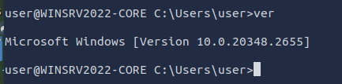

---

Khởi động vậy là đủ rồi. Hãy khám phá thêm thông tin chuyên sâu hơn về hệ thống. Chúng ta có thể chạy lệnh `systeminfo` để liệt kê nhiều thông tin khác nhau về hệ thống như thông tin hệ điều hành (OS), chi tiết hệ thống, bộ xử lý và bộ nhớ. Terminal bên dưới sẽ hiển thị một đoạn kết quả được hiển thị.

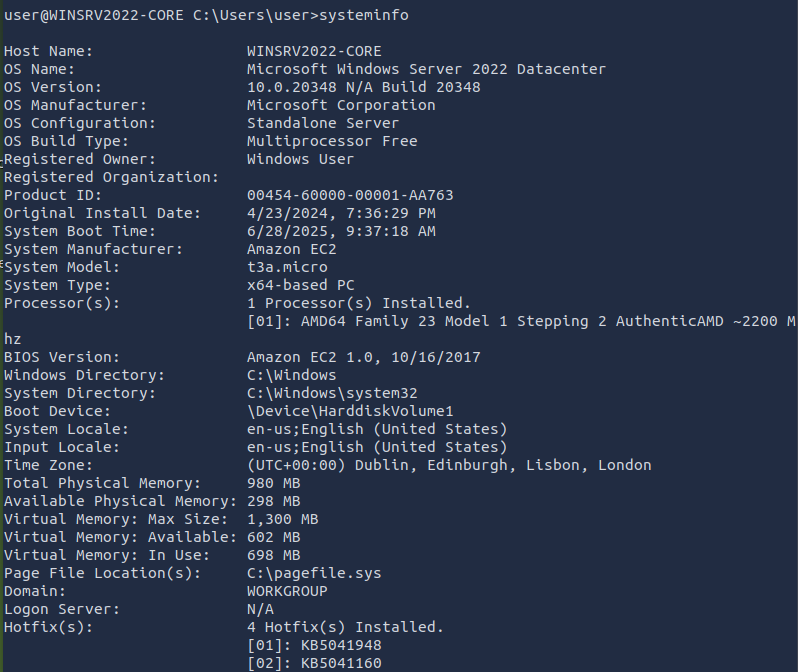

---

Trước khi tiếp tục, cũng đáng nhắc đến một vài mẹo nhỏ.

Đầu tiên, bạn có thể dùng lệnh `more` để phân trang nếu đầu ra quá dài. Sau đó, bạn có thể xem từng trang một bằng cách nhấn phím cách.
Để minh họa điều này, hãy thử chạy lệnh `driverquery` và so sánh với lệnh `driverquery | more`.
Trong lệnh thứ hai, bạn có thể hiển thị kết quả từng trang và có thể thoát bằng cách nhấn tổ hợp `CTRL + C`.

* `help` – Cung cấp thông tin trợ giúp cho một lệnh cụ thể
* `cls` – Xóa màn hình Command Prompt

---

**Hãy trả lời các câu hỏi bên dưới**

**Câu hỏi: Phiên bản hệ điều hành của máy ảo Windows là gì?**

<details>
  <summary>Hiển thị đáp án</summary>
  Đáp án: 10.0.20348.2655
</details>

---

**Câu hỏi: Tên máy (hostname) của máy ảo Windows là gì?**

<details>
  <summary>Hiển thị đáp án</summary>
  Đáp án: WINSRV2022-CORE
</details>


# Task 3: Network Troubleshooting

---

Hầu hết chúng ta đều quen với việc xem cấu hình mạng trong MS Windows thông qua giao diện đồ họa (GUI). Tuy nhiên, giao diện dòng lệnh (CLI) cung cấp rất nhiều lệnh liên quan đến mạng để kiểm tra cấu hình hiện tại, xem các kết nối đang hoạt động và khắc phục sự cố mạng.

### Cấu hình mạng

Bạn có thể kiểm tra thông tin mạng của mình bằng cách sử dụng lệnh `ipconfig`.
Đầu ra của lệnh trên terminal sẽ hiển thị địa chỉ IP, subnet mask (mặt nạ mạng con) và default gateway (cổng mặc định) của bạn.

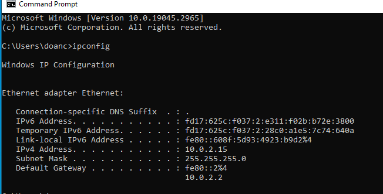

---

Bạn cũng có thể sử dụng lệnh `ipconfig /all` để xem thêm thông tin về cấu hình mạng của bạn.
Như hiển thị trong terminal bên dưới, chúng ta có thể xem các máy chủ DNS và xác nhận rằng DHCP đã được bật.

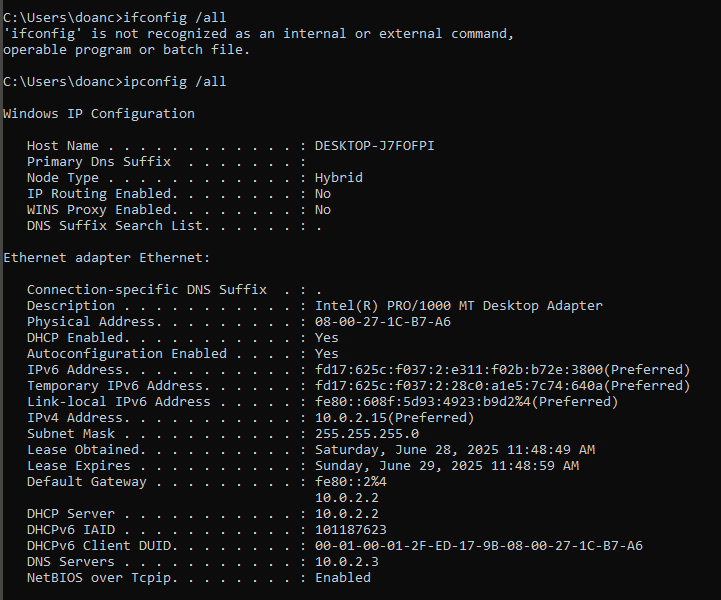

---

### Khắc phục sự cố mạng

Một tác vụ khắc phục sự cố phổ biến là kiểm tra xem máy chủ có thể truy cập một máy chủ cụ thể trên Internet hay không. Cú pháp lệnh là `ping target_name`.
Lấy cảm hứng từ trò chơi ping-pong, chúng ta gửi một gói ICMP cụ thể và chờ phản hồi. Nếu nhận được phản hồi, chúng ta biết rằng có thể liên lạc với máy đích và máy đích cũng có thể liên lạc lại với chúng ta.

Hãy kiểm tra xem chúng ta có thể truy cập được `example.com` không. Trong kết quả đầu ra của terminal bên dưới, chúng ta thấy rằng đã nhận được 4 phản hồi thành công.
Ngoài ra, chúng ta còn nhận được một vài thống kê; ví dụ, thời gian khứ hồi trung bình là 241 mili giây.

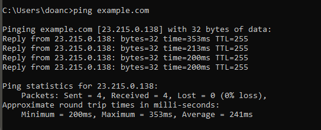

---

Một công cụ giá trị khác để khắc phục sự cố là `tracert`, viết tắt của "trace route" (truy dấu tuyến đường).
Lệnh `tracert target_name` sẽ truy dấu đường đi trong mạng mà gói tin đã đi qua để đến được đích.

Không đi sâu vào chi tiết kỹ thuật, nó dựa vào việc các bộ định tuyến (router) trên đường đi sẽ thông báo lại nếu chúng loại bỏ gói tin vì giá trị TTL (thời gian sống) đã về 0.
Kết quả đầu ra của terminal bên dưới cho thấy chúng ta đã đi qua 15 router trước khi đến được mục tiêu.

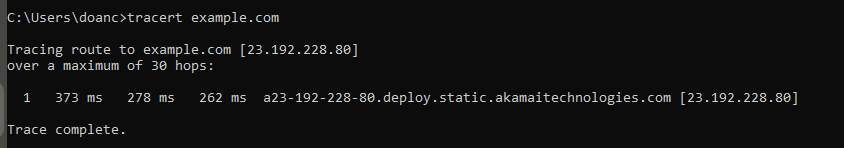

---

### Các lệnh mạng khác

Một lệnh mạng đáng biết là `nslookup`. Nó tra cứu một máy chủ hoặc tên miền và trả về địa chỉ IP của nó.
Cú pháp `nslookup example.com` sẽ tra cứu `example.com` bằng máy chủ tên miền mặc định.
Tuy nhiên, `nslookup example.com 1.1.1.1` sẽ sử dụng máy chủ tên `one.one.one.one`.

Terminal bên dưới hiển thị kết quả của cả hai lệnh.
Kết quả là giống nhau; tuy nhiên, bạn có thể thấy rằng các câu trả lời được lấy từ những máy chủ tên khác nhau.

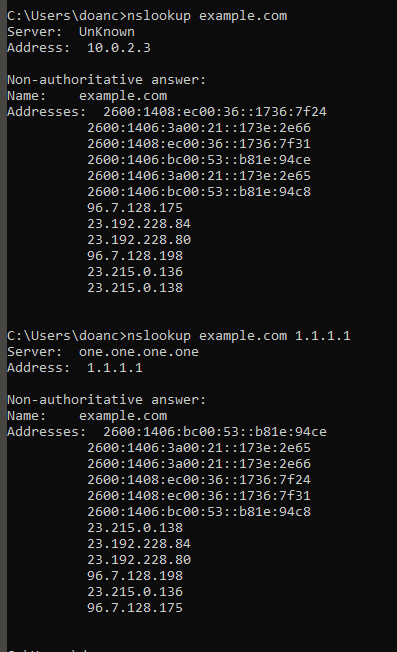

---

Lệnh mạng cuối cùng mà chúng ta sẽ đề cập trong phòng này là `netstat`.
Lệnh này hiển thị các kết nối mạng hiện tại và các cổng đang lắng nghe.

Một lệnh `netstat` cơ bản không có đối số sẽ hiển thị cho bạn các kết nối đã được thiết lập, như được minh họa bên dưới.

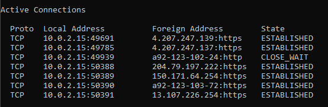

---

Chúng có thể chạy `netstat -h`, trong đó `-h` hiển thị trang trợ giúp.


* `-a` hiển thị tất cả các kết nối đã thiết lập và các cổng đang lắng nghe
* `-b` hiển thị chương trình liên quan đến mỗi cổng đang lắng nghe và kết nối đã thiết lập
* `-o` tiết lộ ID tiến trình (PID) liên quan đến kết nối
* `-n` sử dụng dạng số cho địa chỉ và số cổng

Có thể kết hợp bốn tùy chọn này và thực thi lệnh `netstat -abon`.

---

**Hãy trả lời các câu hỏi bên dưới**

**Câu hỏi: Lệnh nào được dùng để tra địa chỉ vật lý (MAC address) của máy chủ?**

<details>
  <summary>Hiển thị đáp án</summary>
  Đáp án: ipconfig /all
</details>

---

**Câu hỏi: Tên tiến trình đang lắng nghe trên cổng 3389 là gì?**

<details>
  <summary>Hiển thị đáp án</summary>
  Đáp án: TermService
</details>

Cổng **3389** được sử dụng bởi **Giao thức Remote Desktop (RDP)**.

Tiến trình (process) thường lắng nghe trên cổng này là: `TermService` (Dịch vụ Terminal)**

* Trên hệ điều hành **Windows**, đây là thành phần của **Remote Desktop Services** (dịch vụ máy tính từ xa).
* Tập tin thực thi liên quan thường là:
  **`svchost.exe -k NetworkService`** và nó chứa dịch vụ `TermService`.

Cách kiểm tra tiến trình đang lắng nghe trên cổng 3389: dùng Command Prompt hoặc PowerShell):

```bash
netstat -ano | findstr :3389
```

Lệnh này sẽ hiển thị PID của tiến trình đang lắng nghe trên cổng 3389.

Sau đó:

```bash
tasklist /FI "PID eq <PID>"
```

Thay `<PID>` bằng mã tiến trình bạn nhận được từ lệnh trên để biết tên tiến trình.

---

**Câu hỏi: Subnet mask là gì?**

<details>
  <summary>Hiển thị đáp án</summary>
  Đáp án: 255.255.0.0
</details>

# Task 4: File and Disk Management

### Làm việc với thư mục

Bạn có thể sử dụng lệnh `cd` mà không có tham số để hiển thị ổ đĩa và thư mục hiện tại.
Nó tương đương với việc hỏi hệ thống: *"Tôi đang ở đâu?"*

Bạn có thể xem các thư mục con bằng cách sử dụng lệnh `dir`.

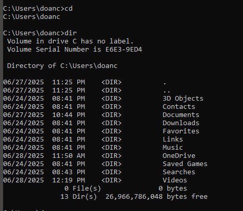

---


Lưu ý rằng bạn có thể sử dụng các tùy chọn sau với lệnh `dir`:

* `dir /a` – Hiển thị cả các tệp ẩn và tệp hệ thống.
* `dir /s` – Hiển thị các tệp trong thư mục hiện tại và tất cả các thư mục con.

Bạn có thể gõ `tree` để hiển thị trực quan cấu trúc các thư mục con và thư mục lồng nhau.

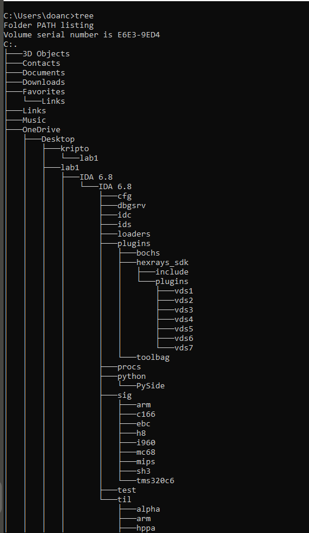

---

Bạn có thể chuyển đến bất kỳ thư mục nào bằng cách sử dụng lệnh `cd target_directory`; lệnh này tương đương với việc nhấp đúp vào thư mục `target_directory` trên màn hình nền của bạn. Ngoài ra, bạn có thể dùng `cd ..` để quay lại một cấp thư mục. Một ví dụ được hiển thị trong đầu ra của terminal bên dưới.

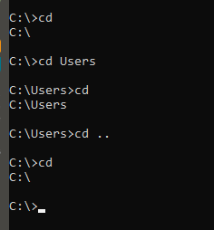

---

Để tạo một thư mục, hãy sử dụng `mkdir directory_name`; `mkdir` là viết tắt của *make directory* (tạo thư mục).
Để xóa một thư mục, hãy dùng `rmdir directory_name`; `rmdir` là viết tắt của *remove directory* (xóa thư mục).
Đầu ra của terminal bên dưới minh họa việc tạo và xóa một thư mục.

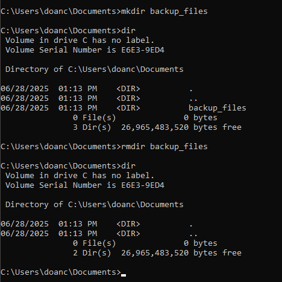

---

### Làm việc với tập tin

Bạn đang làm việc với dòng lệnh. Bạn tò mò về nội dung của một tập tin văn bản cụ thể. Bạn có thể dễ dàng xem nội dung của tập tin văn bản bằng lệnh `type`. Lệnh này sẽ hiển thị toàn bộ nội dung của tập tin văn bản lên màn hình; điều này thuận tiện cho những tập tin có nội dung ngắn, vừa với cửa sổ terminal của bạn.

Bạn cũng có thể sử dụng `more` đối với các tập tin văn bản dài hơn. Lệnh này sẽ hiển thị nội dung vừa đủ để lấp đầy cửa sổ terminal. Nói cách khác, đối với các tập tin văn bản dài, `more` sẽ hiển thị từng trang và chờ bạn nhấn `Spacebar` để chuyển trang hoặc nhấn `Enter` để cuộn từng dòng.

Lệnh `copy` cho phép bạn sao chép các tập tin từ vị trí này sang vị trí khác. Đầu ra của terminal dưới đây cung cấp một ví dụ minh họa.

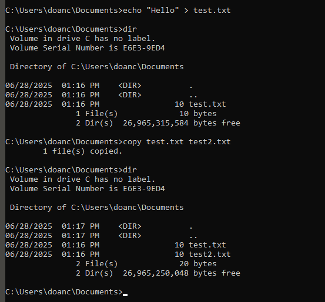

---

Tương tự, bạn có thể di chuyển các tập tin bằng lệnh `move`. Một ví dụ được hiển thị trong đầu ra của terminal bên dưới.

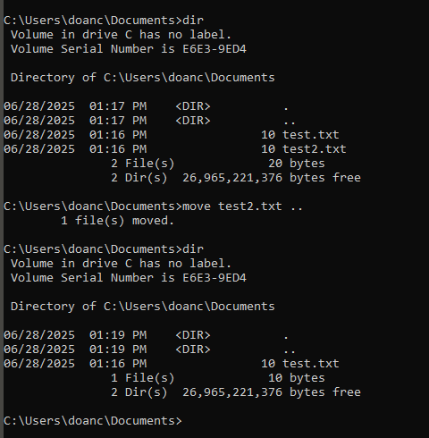

---

Cuối cùng, chúng ta có thể xóa một tập tin bằng lệnh `del` hoặc `erase`.

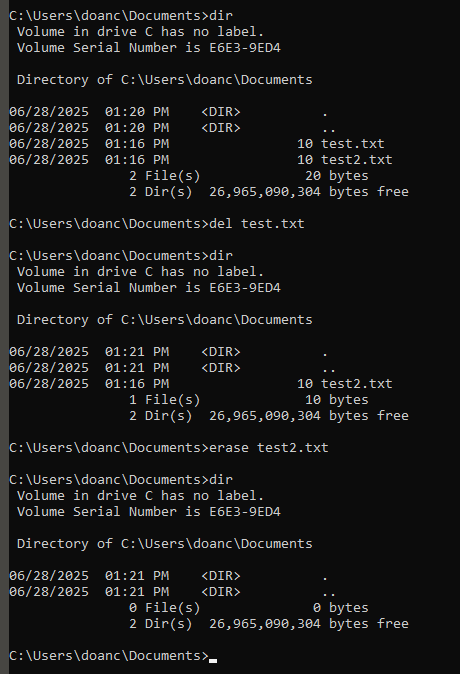

---

Chúng ta có thể sử dụng ký tự đại diện `*` để tham chiếu đến nhiều tệp. Ví dụ, `copy *.md C:\Markdown` sẽ sao chép tất cả các tệp có phần mở rộng là `.md` vào thư mục `C:\Markdown`.

---

**Hãy trả lời các câu hỏi bên dưới**

**Câu hỏi: Nội dung của file trong thư mục `C:\Treasure\Hunt` là gì?**

<details>
  <summary>Hiển thị đáp án</summary>
  Đáp án: `THM{CLI_POWER}`
</details>

```bash
type C:\Treasure\Hunt\flag.txt
````

---


