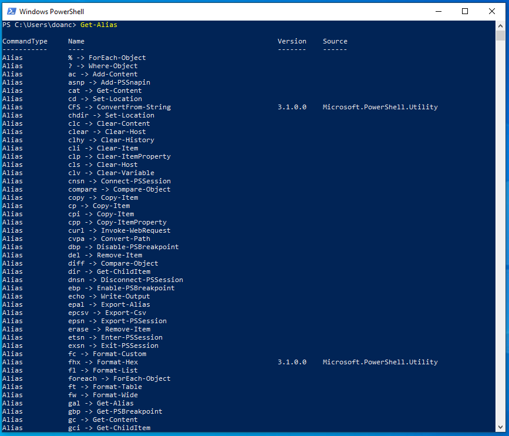

# Windows PowerShell

## Mục lục:

1. [Task 1: Introduction](#task-1-introduction)
2. [Task 2: What Is PowerShell](#task-2-what-is-powershell)
3. [Task 3: PowerShell Basics](#task-3-powershell-basics)


# Task 1: Introduction

### Mục tiêu học tập

Đây là phòng giới thiệu về PowerShell — công cụ dòng lệnh thứ hai (chỉ xét về mặt lịch sử) được xây dựng dành cho hệ điều hành Windows.

* Tìm hiểu PowerShell là gì và khả năng của nó.
* Hiểu cấu trúc cơ bản của ngôn ngữ PowerShell.
* Học và thực thi một số lệnh PowerShell cơ bản.
* Hiểu nhiều ứng dụng của PowerShell trong ngành an ninh mạng.

---

# Task 2: What Is PowerShell

Theo trang chính thức của Microsoft:
**"PowerShell là một giải pháp tự động hóa tác vụ đa nền tảng được tạo thành từ một shell dòng lệnh, một ngôn ngữ kịch bản và một khung quản lý cấu hình."**

PowerShell là một công cụ tự động hóa tác vụ đa nền tảng kết hợp giữa shell dòng lệnh, ngôn ngữ kịch bản và khung quản lý cấu hình. Nó hướng đối tượng (xử lý các kiểu dữ liệu phức tạp) và được xây dựng dựa trên nền tảng .NET, khác với CMD dựa trên văn bản, vốn chỉ xử lý văn bản thuần túy. Ban đầu được tạo ra cho Windows, PowerShell hiện cũng hỗ trợ macOS và Linux.

**So sánh chính**: PowerShell làm việc với **đối tượng** (bao gồm thuộc tính và phương thức), trong khi CMD chỉ làm việc với văn bản thuần túy.

---

### Lược sử ngắn gọn về PowerShell

**PowerShell** được phát triển để vượt qua những hạn chế của các công cụ dòng lệnh và môi trường kịch bản hiện có trong Windows. Vào đầu những năm 2000, khi Windows ngày càng được sử dụng trong các môi trường doanh nghiệp phức tạp, các công cụ truyền thống như `cmd.exe` và các tập tin batch không đủ khả năng để tự động hóa và quản lý các hệ thống này. Microsoft cần một công cụ có thể xử lý các tác vụ quản trị phức tạp hơn và tương tác với các API hiện đại của Windows.

Jeffrey Snover, một kỹ sư của Microsoft, nhận ra rằng Windows và Unix xử lý các thao tác hệ thống khác nhau — Windows sử dụng dữ liệu có cấu trúc và API, trong khi Unix coi mọi thứ là tập tin văn bản. Sự khác biệt này khiến việc chuyển các công cụ Unix sang Windows trở nên không thực tế. Giải pháp của Snover là phát triển một cách tiếp cận hướng đối tượng, kết hợp sự đơn giản của kịch bản với sức mạnh của nền tảng .NET. Được phát hành vào năm 2006, **PowerShell** cho phép các quản trị viên tự động hóa các tác vụ hiệu quả hơn bằng cách thao tác với các đối tượng, cung cấp khả năng tích hợp sâu hơn với các hệ thống Windows.

Khi môi trường CNTT phát triển để bao gồm nhiều hệ điều hành khác nhau, nhu cầu về một công cụ tự động hóa linh hoạt cũng tăng lên. Năm 2016, Microsoft đã phản hồi bằng cách phát hành **PowerShell Core**, một phiên bản mã nguồn mở và đa nền tảng chạy được trên Windows, macOS và Linux.

---

### Sức mạnh trong PowerShell

Để hiểu đầy đủ sức mạnh của **PowerShell**, trước tiên chúng ta cần hiểu một **đối tượng (object)** là gì trong ngữ cảnh này.

Trong lập trình, một **đối tượng (object)** đại diện cho một thực thể có **thuộc tính (properties)** (đặc điểm) và **phương thức (methods)** (hành động). Ví dụ, một đối tượng **xe hơi (car)** có thể có các thuộc tính như `Color`, `Model`, `FuelLevel`, và các phương thức như `Drive()`, `HonkHorn()` và `Refuel()`.

Tương tự, trong **PowerShell**, các đối tượng là đơn vị cơ bản bao gồm dữ liệu và chức năng, giúp dễ dàng hơn trong việc quản lý và thao tác thông tin. Một đối tượng trong PowerShell có thể chứa tên tệp, tên người dùng hoặc kích thước dưới dạng **dữ liệu (properties)**, và thực hiện các **phương thức (methods)** như sao chép tập tin hoặc dừng tiến trình.

Các lệnh cơ bản của Command Shell truyền thống là dựa trên văn bản, nghĩa là chúng xử lý và xuất dữ liệu dưới dạng văn bản thuần túy. Trong khi đó, khi một **cmdlet** (đọc là *command-let*) được thực thi trong **PowerShell**, nó trả về các đối tượng có giữ nguyên thuộc tính và phương thức. Điều này cho phép thao tác dữ liệu mạnh mẽ và linh hoạt hơn vì các đối tượng này không yêu cầu phân tích cú pháp bổ sung như văn bản thuần túy.

---


**Hãy trả lời các câu hỏi bên dưới**

**Câu hỏi: Cách tiếp cận nâng cao nào được sử dụng để phát triển PowerShell?**

<details>
  <summary>Hiển thị đáp án</summary>
  Đáp án: object-oriented (hướng đối tượng)
</details>

>Thay vì làm việc với dòng văn bản như hầu hết các shell khác, PowerShell xử lý các đối tượng .NET, điều này mang lại sự linh hoạt và chức năng cao hơn.

# Task 3: PowerShell Basics

### Khởi chạy PowerShell

**PowerShell** có thể được khởi chạy theo nhiều cách khác nhau, tùy thuộc vào nhu cầu và môi trường của bạn. Nếu bạn đang làm việc trên hệ thống Windows từ giao diện đồ họa (GUI), đây là một số cách có thể để khởi chạy nó:

* **Menu Start**: Gõ `powershell` trong thanh tìm kiếm của Menu Start Windows, sau đó nhấp vào **Windows PowerShell** hoặc **PowerShell** từ kết quả tìm được.
* **Hộp thoại Run**: Nhấn `Win + R` để mở hộp thoại Run, gõ `powershell` và nhấn `Enter`.
* **File Explorer**: Điều hướng đến bất kỳ thư mục nào, sau đó gõ `powershell` vào thanh địa chỉ và nhấn `Enter`. Thao tác này sẽ mở PowerShell tại thư mục hiện tại.
* **Trình quản lý tác vụ (Task Manager)**: Mở Task Manager, đi đến **File > Run new task**, gõ `powershell`, và nhấn `Enter`.

Ngoài ra, **PowerShell** cũng có thể được khởi chạy từ **Command Prompt (`cmd.exe`)** bằng cách gõ `powershell` và nhấn `Enter`.

---


---

Giao diện của PowerShell


---

### Cú pháp cơ bản: Verb - Noun

Như đã đề cập trước đó, các lệnh trong **PowerShell** được gọi là **cmdlets** (phát âm là *command-lets*). Chúng mạnh mẽ hơn nhiều so với các lệnh truyền thống của Windows và cho phép thao tác dữ liệu nâng cao hơn.

Các cmdlets tuân theo quy ước đặt tên nhất quán theo dạng **Động từ - Danh từ (Verb-Noun)**. Cấu trúc này giúp dễ dàng hiểu được mỗi cmdlet thực hiện chức năng gì.
Trong đó:

* **Động từ (Verb)** mô tả hành động.
* **Danh từ (Noun)** xác định đối tượng mà hành động được thực hiện trên đó.

Ví dụ:

* `Get-Content`: Lấy nội dung của một tập tin và hiển thị nó trong cửa sổ console.
* `Set-Location`: Thay đổi thư mục làm việc hiện tại.

---

### Cmdlets cơ bản

Để liệt kê tất cả các **cmdlets**, **hàm**, **bí danh (aliases)** và **tập lệnh (scripts)** có thể được thực thi trong phiên làm việc hiện tại của **PowerShell**, ta có thể sử dụng lệnh:

```powershell
Get-Command
```


Đây là một công cụ thiết yếu để khám phá xem có thể sử dụng những lệnh nào.

---

Đối với mỗi đối tượng **`CommandInfo`** được truy xuất bởi cmdlet, một số thông tin thiết yếu (các thuộc tính) sẽ được hiển thị trên bảng điều khiển. Ta có thể lọc danh sách lệnh dựa trên các giá trị thuộc tính hiển thị.

Ví dụ: nếu ta muốn chỉ hiển thị các lệnh có kiểu là **"function"**, ta có thể sử dụng:

```powershell
Get-Command -CommandType "Function"
```

như minh họa bên dưới.


---

Chúng ta sẽ học các cách hiệu quả hơn để lọc đầu ra từ các cmdlet trong những nhiệm vụ tiếp theo.

Một cmdlet thiết yếu khác mà chúng ta nên có trong "hộp công cụ" là **`Get-Help`**: nó cung cấp thông tin chi tiết về các cmdlet, bao gồm cách sử dụng, các tham số, và ví dụ minh họa. Đây là cmdlet nên dùng để học cách sử dụng các lệnh PowerShell.


---

Như đã trình bày ở kết quả phía trên, **`Get-Help`** cho chúng ta biết rằng ta có thể lấy được các thông tin hữu ích khác về một cmdlet bằng cách thêm một số tùy chọn vào cú pháp cơ bản. Ví dụ, bằng cách thêm **`-examples`** vào lệnh đã hiển thị phía trên, chúng ta sẽ được hiển thị một danh sách các cách phổ biến mà cmdlet được chọn có thể được sử dụng.

Để giúp việc chuyển đổi dễ dàng hơn cho các chuyên gia CNTT, **PowerShell** bao gồm các **alias** — tức là các lối tắt hay tên thay thế cho các cmdlet — cho nhiều lệnh truyền thống trong Windows. Đây là tính năng không thể thiếu đối với những người đã quen thuộc với các công cụ dòng lệnh khác của Windows. **`Get-Alias`** liệt kê tất cả các alias có sẵn. Ví dụ: **`dir`** là alias cho **`Get-ChildItem`**, và **`cd`** là alias cho **`Set-Location`**.



---

### **Where to Find and Download Cmdlets**

Một tính năng mạnh mẽ khác của **PowerShell** là khả năng mở rộng chức năng của nó bằng cách tải thêm các cmdlet từ các kho trực tuyến.

**LƯU Ý:** Xin lưu ý rằng các cmdlet được liệt kê trong phần này yêu cầu kết nối internet đang hoạt động để truy vấn các kho trực tuyến. Máy đang sử dụng không có kết nối internet, vì vậy các lệnh này sẽ không hoạt động trong môi trường này.

Để tìm kiếm các mô-đun (bộ sưu tập các cmdlet) trong các kho trực tuyến như **PowerShell Gallery**, chúng ta có thể sử dụng lệnh **`Find-Module`**. Đôi khi, nếu chúng ta không biết chính xác tên của mô-đun, ta có thể tìm kiếm mô-đun có tên tương tự. Chúng ta có thể làm điều này bằng cách lọc theo thuộc tính **`Name`** và thêm ký tự đại diện (`*`) vào phần tên một phần của mô-đun, sử dụng cú pháp PowerShell chuẩn như sau:

```powershell
Cmdlet -Property "pattern*"
```


---

Khi đã xác định được mô-đun, chúng ta có thể tải xuống và cài đặt mô-đun đó từ kho bằng lệnh **`Install-Module`**, giúp các cmdlet mới có trong mô-đun sẵn sàng để sử dụng.


---

**Hãy trả lời các câu hỏi bên dưới**

**Câu hỏi: Làm thế nào để lấy danh sách các lệnh bắt đầu bằng động từ `Remove` (không sử dụng dấu nháy trong câu trả lời)?**

<details>
  <summary>Hiển thị đáp án</summary>
  Đáp án: Get-Command -Name Remove
</details>


---

**Câu hỏi: Cmdlet nào có đối tác truyền thống là lệnh `echo` (dưới dạng alias)?**

<details>
  <summary>Hiển thị đáp án</summary>
  Đáp án: Write-Output
</details>


---

**Câu hỏi: Lệnh nào dùng để xem ví dụ cách sử dụng cmdlet `New-LocalUser`?**

<details>
  <summary>Hiển thị đáp án</summary>
  Đáp án: Get-Help New-LocalUser -Examples
</details>

---

# Task 4: Navigating the File System and Working with Files

---

**PowerShell** cung cấp một loạt các cmdlet để điều hướng hệ thống tệp và quản lý tệp, nhiều trong số đó có các tương đương trong CLI truyền thống của Windows.

### Liệt kê

Tương tự như lệnh `dir` trong Command Prompt (hoặc `ls` trong các hệ thống giống Unix), **`Get-ChildItem`** liệt kê các tệp và thư mục trong một vị trí được chỉ định bằng tham số **`-Path`**. Nó có thể được dùng để khám phá thư mục và xem nội dung của chúng. Nếu không chỉ định **Path**, cmdlet sẽ hiển thị nội dung của thư mục làm việc hiện tại.


---

### Điều hướng thư mục

Để điều hướng đến một thư mục khác, chúng ta có thể sử dụng cmdlet **`Set-Location`**. Nó thay đổi thư mục hiện tại, đưa chúng ta đến đường dẫn đã chỉ định, tương tự như lệnh **`cd`** trong Command Prompt.


---

### Tạo file, folder

Trong khi CLI truyền thống của Windows sử dụng các lệnh riêng biệt để tạo và quản lý các mục khác nhau như thư mục và tệp, **PowerShell** đơn giản hóa quy trình này bằng cách cung cấp một tập hợp cmdlet duy nhất để xử lý việc tạo và quản lý cả hai loại mục đó.

Để tạo một mục trong **PowerShell**, chúng ta có thể sử dụng **`New-Item`**. Ta sẽ cần chỉ định đường dẫn của mục và loại của nó (liệu đó là tệp hay thư mục).


---

### Xóa

Tương tự như vậy, cmdlet **`Remove-Item`** dùng để xóa cả thư mục và tệp, trong khi trong CLI của Windows, chúng ta phải dùng các lệnh riêng biệt là **`rmdir`** và **`del`**.


---

### Sao chép, di chuyển

Chúng ta có thể sao chép hoặc di chuyển các tệp và thư mục tương tự nhau, lần lượt sử dụng **`Copy-Item`** (tương đương với lệnh **`copy`**) và **`Move-Item`** (tương đương với lệnh **`move`**).

- Các File ban đầu


- Copy:


- Move


---

