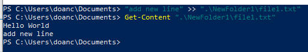
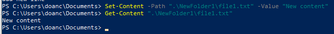
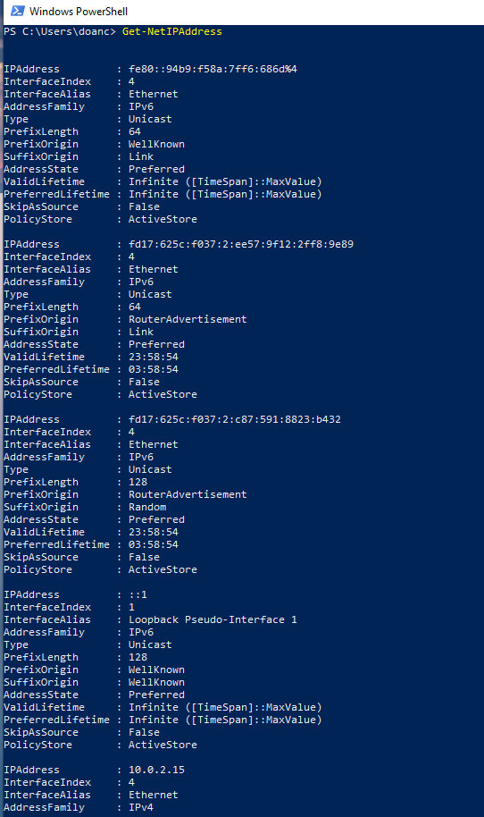

# Windows PowerShell

## Mục lục:

1. [Task 1: Introduction](#task-1-introduction)
2. [Task 2: What Is PowerShell](#task-2-what-is-powershell)
3. [Task 3: PowerShell Basics](#task-3-powershell-basics)
4. [Task 4: Navigating the File System and Working with Files](#task-4-navigating-the-file-system-and-working-with-files)
5. [Task 5: Piping, Filtering, and Sorting Data ](#task-5-piping-filtering-and-sorting-data)
6. [Task 6: System and Network Information](#task-6-system-and-network-information)

# Task 1: Introduction

### Mục tiêu học tập

Đây là phòng giới thiệu về PowerShell — công cụ dòng lệnh thứ hai (chỉ xét về mặt lịch sử) được xây dựng dành cho hệ điều hành Windows.

* Tìm hiểu PowerShell là gì và khả năng của nó.
* Hiểu cấu trúc cơ bản của ngôn ngữ PowerShell.
* Học và thực thi một số lệnh PowerShell cơ bản.
* Hiểu nhiều ứng dụng của PowerShell trong ngành an ninh mạng.

---

# Task 2: What Is PowerShell

Theo trang chính thức của Microsoft:
**"PowerShell là một giải pháp tự động hóa tác vụ đa nền tảng được tạo thành từ một shell dòng lệnh, một ngôn ngữ kịch bản và một khung quản lý cấu hình."**

PowerShell là một công cụ tự động hóa tác vụ đa nền tảng kết hợp giữa shell dòng lệnh, ngôn ngữ kịch bản và khung quản lý cấu hình. Nó hướng đối tượng (xử lý các kiểu dữ liệu phức tạp) và được xây dựng dựa trên nền tảng .NET, khác với CMD dựa trên văn bản, vốn chỉ xử lý văn bản thuần túy. Ban đầu được tạo ra cho Windows, PowerShell hiện cũng hỗ trợ macOS và Linux.

**So sánh chính**: PowerShell làm việc với **đối tượng** (bao gồm thuộc tính và phương thức), trong khi CMD chỉ làm việc với văn bản thuần túy.

---

### Lược sử ngắn gọn về PowerShell

**PowerShell** được phát triển để vượt qua những hạn chế của các công cụ dòng lệnh và môi trường kịch bản hiện có trong Windows. Vào đầu những năm 2000, khi Windows ngày càng được sử dụng trong các môi trường doanh nghiệp phức tạp, các công cụ truyền thống như `cmd.exe` và các tập tin batch không đủ khả năng để tự động hóa và quản lý các hệ thống này. Microsoft cần một công cụ có thể xử lý các tác vụ quản trị phức tạp hơn và tương tác với các API hiện đại của Windows.

Jeffrey Snover, một kỹ sư của Microsoft, nhận ra rằng Windows và Unix xử lý các thao tác hệ thống khác nhau — Windows sử dụng dữ liệu có cấu trúc và API, trong khi Unix coi mọi thứ là tập tin văn bản. Sự khác biệt này khiến việc chuyển các công cụ Unix sang Windows trở nên không thực tế. Giải pháp của Snover là phát triển một cách tiếp cận hướng đối tượng, kết hợp sự đơn giản của kịch bản với sức mạnh của nền tảng .NET. Được phát hành vào năm 2006, **PowerShell** cho phép các quản trị viên tự động hóa các tác vụ hiệu quả hơn bằng cách thao tác với các đối tượng, cung cấp khả năng tích hợp sâu hơn với các hệ thống Windows.

Khi môi trường CNTT phát triển để bao gồm nhiều hệ điều hành khác nhau, nhu cầu về một công cụ tự động hóa linh hoạt cũng tăng lên. Năm 2016, Microsoft đã phản hồi bằng cách phát hành **PowerShell Core**, một phiên bản mã nguồn mở và đa nền tảng chạy được trên Windows, macOS và Linux.

---

### Sức mạnh trong PowerShell

Để hiểu đầy đủ sức mạnh của **PowerShell**, trước tiên chúng ta cần hiểu một **đối tượng (object)** là gì trong ngữ cảnh này.

Trong lập trình, một **đối tượng (object)** đại diện cho một thực thể có **thuộc tính (properties)** (đặc điểm) và **phương thức (methods)** (hành động). Ví dụ, một đối tượng **xe hơi (car)** có thể có các thuộc tính như `Color`, `Model`, `FuelLevel`, và các phương thức như `Drive()`, `HonkHorn()` và `Refuel()`.

Tương tự, trong **PowerShell**, các đối tượng là đơn vị cơ bản bao gồm dữ liệu và chức năng, giúp dễ dàng hơn trong việc quản lý và thao tác thông tin. Một đối tượng trong PowerShell có thể chứa tên tệp, tên người dùng hoặc kích thước dưới dạng **dữ liệu (properties)**, và thực hiện các **phương thức (methods)** như sao chép tập tin hoặc dừng tiến trình.

Các lệnh cơ bản của Command Shell truyền thống là dựa trên văn bản, nghĩa là chúng xử lý và xuất dữ liệu dưới dạng văn bản thuần túy. Trong khi đó, khi một **cmdlet** (đọc là *command-let*) được thực thi trong **PowerShell**, nó trả về các đối tượng có giữ nguyên thuộc tính và phương thức. Điều này cho phép thao tác dữ liệu mạnh mẽ và linh hoạt hơn vì các đối tượng này không yêu cầu phân tích cú pháp bổ sung như văn bản thuần túy.

---


**Hãy trả lời các câu hỏi bên dưới**

**Câu hỏi: Cách tiếp cận nâng cao nào được sử dụng để phát triển PowerShell?**

<details>
  <summary>Hiển thị đáp án</summary>
  Đáp án: object-oriented (hướng đối tượng)
</details>

>Thay vì làm việc với dòng văn bản như hầu hết các shell khác, PowerShell xử lý các đối tượng .NET, điều này mang lại sự linh hoạt và chức năng cao hơn.

# Task 3: PowerShell Basics

### Khởi chạy PowerShell

**PowerShell** có thể được khởi chạy theo nhiều cách khác nhau, tùy thuộc vào nhu cầu và môi trường của bạn. Nếu bạn đang làm việc trên hệ thống Windows từ giao diện đồ họa (GUI), đây là một số cách có thể để khởi chạy nó:

* **Menu Start**: Gõ `powershell` trong thanh tìm kiếm của Menu Start Windows, sau đó nhấp vào **Windows PowerShell** hoặc **PowerShell** từ kết quả tìm được.
* **Hộp thoại Run**: Nhấn `Win + R` để mở hộp thoại Run, gõ `powershell` và nhấn `Enter`.
* **File Explorer**: Điều hướng đến bất kỳ thư mục nào, sau đó gõ `powershell` vào thanh địa chỉ và nhấn `Enter`. Thao tác này sẽ mở PowerShell tại thư mục hiện tại.
* **Trình quản lý tác vụ (Task Manager)**: Mở Task Manager, đi đến **File > Run new task**, gõ `powershell`, và nhấn `Enter`.

Ngoài ra, **PowerShell** cũng có thể được khởi chạy từ **Command Prompt (`cmd.exe`)** bằng cách gõ `powershell` và nhấn `Enter`.

---


---

Giao diện của PowerShell


---

### Cú pháp cơ bản: Verb - Noun

Như đã đề cập trước đó, các lệnh trong **PowerShell** được gọi là **cmdlets** (phát âm là *command-lets*). Chúng mạnh mẽ hơn nhiều so với các lệnh truyền thống của Windows và cho phép thao tác dữ liệu nâng cao hơn.

Các cmdlets tuân theo quy ước đặt tên nhất quán theo dạng **Động từ - Danh từ (Verb-Noun)**. Cấu trúc này giúp dễ dàng hiểu được mỗi cmdlet thực hiện chức năng gì.
Trong đó:

* **Động từ (Verb)** mô tả hành động.
* **Danh từ (Noun)** xác định đối tượng mà hành động được thực hiện trên đó.

Ví dụ:

* `Get-Content`: Lấy nội dung của một tập tin và hiển thị nó trong cửa sổ console.
* `Set-Location`: Thay đổi thư mục làm việc hiện tại.

---

### Cmdlets cơ bản

Để liệt kê tất cả các **cmdlets**, **hàm**, **bí danh (aliases)** và **tập lệnh (scripts)** có thể được thực thi trong phiên làm việc hiện tại của **PowerShell**, ta có thể sử dụng lệnh:

```powershell
Get-Command
```


Đây là một công cụ thiết yếu để khám phá xem có thể sử dụng những lệnh nào.

---

Đối với mỗi đối tượng **`CommandInfo`** được truy xuất bởi cmdlet, một số thông tin thiết yếu (các thuộc tính) sẽ được hiển thị trên bảng điều khiển. Ta có thể lọc danh sách lệnh dựa trên các giá trị thuộc tính hiển thị.

Ví dụ: nếu ta muốn chỉ hiển thị các lệnh có kiểu là **"function"**, ta có thể sử dụng:

```powershell
Get-Command -CommandType "Function"
```

như minh họa bên dưới.


---

Chúng ta sẽ học các cách hiệu quả hơn để lọc đầu ra từ các cmdlet trong những nhiệm vụ tiếp theo.

Một cmdlet thiết yếu khác mà chúng ta nên có trong "hộp công cụ" là **`Get-Help`**: nó cung cấp thông tin chi tiết về các cmdlet, bao gồm cách sử dụng, các tham số, và ví dụ minh họa. Đây là cmdlet nên dùng để học cách sử dụng các lệnh PowerShell.


---

Như đã trình bày ở kết quả phía trên, **`Get-Help`** cho chúng ta biết rằng ta có thể lấy được các thông tin hữu ích khác về một cmdlet bằng cách thêm một số tùy chọn vào cú pháp cơ bản. Ví dụ, bằng cách thêm **`-examples`** vào lệnh đã hiển thị phía trên, chúng ta sẽ được hiển thị một danh sách các cách phổ biến mà cmdlet được chọn có thể được sử dụng.

Để giúp việc chuyển đổi dễ dàng hơn cho các chuyên gia CNTT, **PowerShell** bao gồm các **alias** — tức là các lối tắt hay tên thay thế cho các cmdlet — cho nhiều lệnh truyền thống trong Windows. Đây là tính năng không thể thiếu đối với những người đã quen thuộc với các công cụ dòng lệnh khác của Windows. **`Get-Alias`** liệt kê tất cả các alias có sẵn. Ví dụ: **`dir`** là alias cho **`Get-ChildItem`**, và **`cd`** là alias cho **`Set-Location`**.


---

### **Where to Find and Download Cmdlets**

Một tính năng mạnh mẽ khác của **PowerShell** là khả năng mở rộng chức năng của nó bằng cách tải thêm các cmdlet từ các kho trực tuyến.

**LƯU Ý:** Xin lưu ý rằng các cmdlet được liệt kê trong phần này yêu cầu kết nối internet đang hoạt động để truy vấn các kho trực tuyến. Máy đang sử dụng không có kết nối internet, vì vậy các lệnh này sẽ không hoạt động trong môi trường này.

Để tìm kiếm các mô-đun (bộ sưu tập các cmdlet) trong các kho trực tuyến như **PowerShell Gallery**, chúng ta có thể sử dụng lệnh **`Find-Module`**. Đôi khi, nếu chúng ta không biết chính xác tên của mô-đun, ta có thể tìm kiếm mô-đun có tên tương tự. Chúng ta có thể làm điều này bằng cách lọc theo thuộc tính **`Name`** và thêm ký tự đại diện (`*`) vào phần tên một phần của mô-đun, sử dụng cú pháp PowerShell chuẩn như sau:

```powershell
Cmdlet -Property "pattern*"
```


---

Khi đã xác định được mô-đun, chúng ta có thể tải xuống và cài đặt mô-đun đó từ kho bằng lệnh **`Install-Module`**, giúp các cmdlet mới có trong mô-đun sẵn sàng để sử dụng.


---

**Hãy trả lời các câu hỏi bên dưới**

**Câu hỏi: Làm thế nào để lấy danh sách các lệnh bắt đầu bằng động từ `Remove` (không sử dụng dấu nháy trong câu trả lời)?**

<details>
  <summary>Hiển thị đáp án</summary>
  Đáp án: Get-Command -Name Remove
</details>


---

**Câu hỏi: Cmdlet nào có đối tác truyền thống là lệnh `echo` (dưới dạng alias)?**

<details>
  <summary>Hiển thị đáp án</summary>
  Đáp án: Write-Output
</details>


---

**Câu hỏi: Lệnh nào dùng để xem ví dụ cách sử dụng cmdlet `New-LocalUser`?**

<details>
  <summary>Hiển thị đáp án</summary>
  Đáp án: Get-Help New-LocalUser -Examples
</details>

---

# Task 4: Navigating the File System and Working with Files

---

**PowerShell** cung cấp một loạt các cmdlet để điều hướng hệ thống tệp và quản lý tệp, nhiều trong số đó có các tương đương trong CLI truyền thống của Windows.

### Liệt kê

Tương tự như lệnh `dir` trong Command Prompt (hoặc `ls` trong các hệ thống giống Unix), **`Get-ChildItem`** liệt kê các tệp và thư mục trong một vị trí được chỉ định bằng tham số **`-Path`**. Nó có thể được dùng để khám phá thư mục và xem nội dung của chúng. Nếu không chỉ định **Path**, cmdlet sẽ hiển thị nội dung của thư mục làm việc hiện tại.


---

### Điều hướng thư mục

Để điều hướng đến một thư mục khác, chúng ta có thể sử dụng cmdlet **`Set-Location`**. Nó thay đổi thư mục hiện tại, đưa chúng ta đến đường dẫn đã chỉ định, tương tự như lệnh **`cd`** trong Command Prompt.


---

### Tạo file, folder

Trong khi CLI truyền thống của Windows sử dụng các lệnh riêng biệt để tạo và quản lý các mục khác nhau như thư mục và tệp, **PowerShell** đơn giản hóa quy trình này bằng cách cung cấp một tập hợp cmdlet duy nhất để xử lý việc tạo và quản lý cả hai loại mục đó.

Để tạo một mục trong **PowerShell**, chúng ta có thể sử dụng **`New-Item`**. Ta sẽ cần chỉ định đường dẫn của mục và loại của nó (liệu đó là tệp hay thư mục).


---

### Xóa

Tương tự như vậy, cmdlet **`Remove-Item`** dùng để xóa cả thư mục và tệp, trong khi trong CLI của Windows, chúng ta phải dùng các lệnh riêng biệt là **`rmdir`** và **`del`**.


---

### Sao chép, di chuyển

Chúng ta có thể sao chép hoặc di chuyển các tệp và thư mục tương tự nhau, lần lượt sử dụng **`Copy-Item`** (tương đương với lệnh **`copy`**) và **`Move-Item`** (tương đương với lệnh **`move`**).

- Các File ban đầu


- Copy:


- Move


---

### Hiển thị nội dung của tệp: cat

Cuối cùng, để đọc và hiển thị nội dung của một tệp, chúng ta có thể sử dụng lệnh **`Get-Content`**, hoạt động tương tự như lệnh **`type`** trong Command Prompt (hoặc **`cat`** trong các hệ thống giống Unix).


### Ghi nội dung vào file

1. Ghi nội dung mới vào file (tạo mới hoặc ghi đè)


2. Thêm nội dung vào cuối file (append)



3. Sử dụng Set-Content để ghi đè



4. Sử dụng Add-Content để thêm dòng


5. Ghi nhiều dòng vào file


---

**Hãy trả lời các câu hỏi bên dưới**

**Câu hỏi: Cmdlet nào bạn có thể dùng thay cho lệnh `type` truyền thống của Windows?**

<details>
  <summary>Hiển thị đáp án</summary>
  Đáp án: `Get-Content`
</details>

---

**Câu hỏi: Lệnh PowerShell nào được dùng để hiển thị nội dung thư mục `C:\Users`? (Không sử dụng dấu nháy trong câu trả lời)**

<details>
  <summary>Hiển thị đáp án</summary>
  Đáp án: `Get-ChildItem -Path C:\Users`
</details>

---


Dưới đây là bản dịch tiếng Việt của đoạn văn trong ảnh:

---

# Task 5: Piping, Filtering, and Sorting Data

> Kết nối, lọc và sắp xếp dữ liệu)

PowerShell sử dụng **piping** (`|`) để gửi đầu ra của một lệnh (cmdlet) làm đầu vào cho lệnh khác. Không giống như CMD/Linux, PowerShell truyền **đối tượng** thay vì văn bản, cho phép thao tác dữ liệu linh hoạt hơn.

Tại đây, `Where-Object` lọc các tập tin dựa trên thuộc tính `Extension`, đảm bảo rằng chỉ các tập tin có phần mở rộng bằng (`-eq`) **`.txt`** mới được liệt kê.

Toán tử `-eq` (tức là **"bằng với"**) là một phần của tập hợp **các toán tử so sánh**, được dùng chung với các ngôn ngữ kịch bản khác (ví dụ: Bash, Python). Để minh họa khả năng lọc mạnh mẽ của PowerShell, dưới đây là một số toán tử hữu ích nhất từ danh sách đó:

* `-ne`: **"khác với"**. Toán tử này có thể dùng để loại bỏ các đối tượng không thỏa mãn tiêu chí chỉ định ra khỏi kết quả.

* `-gt`: **"lớn hơn"**. Toán tử này sẽ chỉ giữ lại những đối tượng có giá trị lớn hơn giá trị chỉ định. Lưu ý rằng đây là phép so sánh nghiêm ngặt, có nghĩa là những đối tượng có giá trị bằng với giá trị chỉ định sẽ bị loại khỏi kết quả.

* `-ge`: **"lớn hơn hoặc bằng"**. Đây là phiên bản không nghiêm ngặt của toán tử trước. Là sự kết hợp giữa `-gt` và `-eq`.

* `-lt`: **"nhỏ hơn"**. Tương tự như toán tử "lớn hơn", đây là một phép so sánh nghiêm ngặt. Chỉ giữ lại các đối tượng có giá trị nhỏ hơn rõ ràng so với giá trị chỉ định.

* `-le`: **"nhỏ hơn hoặc bằng"**. Tương tự như `-ge`, đây là phiên bản không nghiêm ngặt của toán tử trước. Là sự kết hợp giữa `-lt` và `-eq`.

---

### Ví dụ minh họa 

**1. Liệt kê các tập tin có phần mở rộng là `.txt`**

```powershell
Get-ChildItem | Where-Object { $_.Extension -eq ".txt" }
```

*Chỉ hiển thị các tập tin `.txt`.*

---

**2. Liệt kê các tập tin KHÔNG phải `.txt`**

```powershell
Get-ChildItem | Where-Object { $_.Extension -ne ".txt" }
```

*Loại bỏ tập tin `.txt`, chỉ hiển thị các loại khác như `.jpg`, `.exe`…*

---

**3. Liệt kê các tập tin có kích thước lớn hơn 1MB**

```powershell
Get-ChildItem | Where-Object { $_.Length -gt 1MB }
```

*Chỉ hiện tập tin có dung lượng lớn hơn 1MB (1MB = 1048576 byte).*

---

**4. Các tập tin có kích thước từ 500KB trở lên**

```powershell
Get-ChildItem | Where-Object { $_.Length -ge 500KB }
```

---

 **5. Tập tin nhỏ hơn 100KB**

```powershell
Get-ChildItem | Where-Object { $_.Length -lt 100KB }
```

---

**6. Tập tin nhỏ hơn hoặc bằng 2MB**

```powershell
Get-ChildItem | Where-Object { $_.Length -le 2MB }
```

---


### **Các lệnh phổ biến (Common Commands):**

* `Sort-Object` (sắp xếp các đối tượng theo thuộc tính) – không có lệnh tương đương trực tiếp trong CMD, nhưng giống với lệnh `sort` trong Linux.

* `Where-Object` (lọc đối tượng dựa trên điều kiện) – tương tự như lệnh `grep` trong Linux.

* `Select-Object` (chọn các thuộc tính từ đối tượng) – dùng để tinh chỉnh kết quả đầu ra.

---

### **Ví dụ (Example):**

* `Get-ChildItem | Where-Object -Property Length -gt 100`
  → Liệt kê các tập tin có kích thước lớn hơn **100 byte**.

---

**Hãy trả lời các câu hỏi bên dưới**

**Câu hỏi: Làm thế nào để lấy các mục trong thư mục hiện tại có kích thước lớn hơn 100? (Không sử dụng dấu nháy trong câu trả lời)**

<details>
  <summary>Hiển thị đáp án</summary>
  Đáp án:  
  `Get-ChildItem | Where-Object -Property Length -gt 100`
</details>

---

# Task 6: System and Network Information

>Thông tin Hệ thống và Mạng

**PowerShell** được tạo ra để đáp ứng nhu cầu ngày càng tăng về một công cụ tự động hóa và quản lý mạnh mẽ nhằm hỗ trợ các quản trị viên hệ thống và chuyên gia CNTT. Do đó, nó cung cấp một loạt các cmdlet cho phép truy xuất thông tin chi tiết về cấu hình hệ thống và cài đặt mạng.

---
### Xem thông tin hệ thống

Cmdlet **Get-ComputerInfo** truy xuất thông tin hệ thống toàn diện, bao gồm thông tin hệ điều hành, thông số phần cứng, chi tiết BIOS và nhiều hơn nữa. Nó cung cấp một bản chụp nhanh cấu hình toàn bộ hệ thống chỉ với một lệnh duy nhất. Lệnh truyền thống tương đương **systeminfo** chỉ truy xuất được một tập con nhỏ của các thông tin này.


---

### Xem các tài khoản người dùng

Cần thiết để quản lý tài khoản người dùng và hiểu cấu hình bảo mật của máy, lệnh **Get-LocalUser** liệt kê tất cả các tài khoản người dùng cục bộ trên hệ thống. Kết quả đầu ra mặc định hiển thị, đối với mỗi người dùng, tên người dùng, trạng thái tài khoản và mô tả.


---

### Xem cấu hình mạng

Tương tự như lệnh **ipconfig** truyền thống, hai cmdlet sau có thể được sử dụng để truy xuất thông tin chi tiết về cấu hình mạng của hệ thống.

**Get-NetIPConfiguration** cung cấp thông tin chi tiết về các giao diện mạng trên hệ thống, bao gồm địa chỉ IP, máy chủ DNS và cấu hình cổng (gateway).


---

### Xem địa chỉ IP

Trong trường hợp chúng ta cần thông tin chi tiết cụ thể về các địa chỉ IP được gán cho các giao diện mạng, cmdlet **Get-NetIPAddress** sẽ hiển thị chi tiết tất cả các địa chỉ IP được cấu hình trên hệ thống, bao gồm cả những địa chỉ hiện không hoạt động.



---

**Câu hỏi 1:**
Ngoài người dùng hiện tại của bạn và tài khoản “Administrator” mặc định, còn người dùng nào khác được bật trên máy đích?

<details>
  <summary>Hiển thị đáp án</summary>
  Đáp án:  p1r4t3
</details>

>Cách thực hiện

```bash
Get-LocalUser
```


---

**Câu hỏi 2:**
Tên cướp biển này đã giấu tài khoản của hắn giữa những tài khoản khác mà chẳng hề để tâm đến thuyền trưởng đáng kính của chúng ta! Phương châm mà hắn trắng trợn đặt trong phần mô tả tài khoản là gì?

<details>
  <summary>Hiển thị đáp án</summary>
  Đáp án:  
  `A merry life and a short one.`
</details>


---

**Câu hỏi 3:**
Giờ là một thử thách nhỏ để ghép tất cả lại. Tên cướp biển mà ta vừa tìm ra giữa đám tài khoản cục bộ có một thư mục riêng trong “C:\Users\”.
Bạn có thể điều hướng hệ thống tập tin và tìm kho báu ẩn trong nhà của tên cướp biển này không?

<details>
  <summary>Hiển thị đáp án</summary>
  Đáp án:  
  `THM{p34rlInAsh3ll}`
</details>

>Cách thực hiện

```bash
Set-Location C:\Users\p1r4t3
Get-ChildItem
Set-Location hidden-treasure-chest
Get-Content big-treasure.txt
```
>Hoặc


---

# Task 7: Real-Time System Analysic

>Phân tích hệ thống thời gian thực

Để thu thập thông tin hệ thống nâng cao hơn, đặc biệt liên quan đến các khía cạnh động như quy trình đang chạy, dịch vụ và các kết nối mạng đang hoạt động, chúng ta có thể tận dụng một tập hợp các lệnh cmdlet vượt ra ngoài các chi tiết máy tĩnh.

### Xem các tiến trình

`Get-Process` cung cấp cái nhìn chi tiết về tất cả các tiến trình đang chạy, bao gồm mức sử dụng CPU và bộ nhớ, khiến nó trở thành công cụ mạnh mẽ để giám sát và khắc phục sự cố.


---

### Xem các dịch vụ đang chạy

Tương tự, `Get-Service` cho phép truy xuất thông tin về trạng thái của các dịch vụ trên máy, chẳng hạn như dịch vụ nào đang chạy, đã dừng hoặc đang tạm dừng. Lệnh này được sử dụng rộng rãi trong việc khắc phục sự cố bởi các quản trị viên hệ thống, nhưng cũng được các nhà phân tích pháp y sử dụng để truy tìm các dịch vụ bất thường được cài đặt trên hệ thống.


---

### Giám sát các kết nối mạng

Để giám sát các kết nối mạng đang hoạt động, `Get-NetTCPConnection` hiển thị các kết nối TCP hiện tại, cung cấp cái nhìn sâu về cả các điểm cuối cục bộ và từ xa. Cmdlet này đặc biệt hữu ích trong quá trình phản ứng sự cố hoặc phân tích phần mềm độc hại, vì nó có thể phát hiện các cửa hậu ẩn hoặc các kết nối đã thiết lập đến máy chủ do kẻ tấn công kiểm soát.


---

### Băm tệp

Ngoài ra, chúng ta sẽ đề cập đến `Get-FileHash` như một cmdlet hữu ích để tạo ra các giá trị băm của tệp, điều này đặc biệt có giá trị trong phản ứng sự cố, truy vết mối đe dọa và phân tích phần mềm độc hại, vì nó giúp xác minh tính toàn vẹn của tệp và phát hiện hành vi can thiệp tiềm ẩn.


---

**Câu hỏi 1:**
Trong nhiệm vụ trước, bạn đã tìm thấy một kho báu tuyệt vời được giấu kỹ lưỡng trong máy mục tiêu. Hash của tệp chứa kho báu đó là gì?

<details>
  <summary>Hiển thị đáp án</summary>
  Đáp án:  
  `71FC5EC11C2497A32F8F08E61399687D90ABE6E204D2964DF589543A613F3E08`
</details>

>Cách thực hiện

```bash
Get-FileHash -Path big-treasure.txt
```


---

**Câu hỏi 2:**
Thuộc tính nào được truy xuất theo mặc định bởi `Get-NetTCPConnection` chứa thông tin về tiến trình đã bắt đầu kết nối?

<details>
  <summary>Hiển thị đáp án</summary>
  Đáp án:  
  `OwningProcess`
</details>


---

**Câu hỏi 3:**
Đã đến lúc cho một thử thách nhỏ khác. Một dịch vụ quan trọng đã được cài đặt trên con tàu cướp biển này để đảm bảo thuyền trưởng luôn có thể điều hướng an toàn. Nhưng có gì đó không ổn, và thuyền trưởng băn khoăn tại sao. Điều tra kỹ, cuối cùng họ phát hiện ra sự thật: dịch vụ đã bị can thiệp! Tên cướp biển trước đó đã sửa đổi thuộc tính `DisplayName` để phản ánh phương châm riêng của hắn, cũng chính là câu mô tả mà hắn đặt trong tài khoản người dùng của mình.

Với thông tin này và kiến thức PowerShell mà bạn đã tích lũy, bạn có tìm được tên của dịch vụ không?

<details>
  <summary>Hiển thị đáp án</summary>
  Đáp án:  
  `plr4t3-s-compass`
</details>

>Cách thực hiện

```bash
Get-Service | Where-Object { $_.DisplayName -like "*merry*" } | Select-Object Name, DisplayName
```


---

# Task 8 – Scripting

**Scripting** là quá trình viết và thực thi một loạt lệnh được chứa trong một tệp văn bản, được biết đến như là script, để tự động hóa các tác vụ mà thông thường bạn sẽ thực hiện thủ công trong một shell, như **PowerShell**.

Nói một cách đơn giản, scripting giống như việc đưa cho máy tính một danh sách những việc cần làm, trong đó mỗi dòng trong script là một nhiệm vụ mà máy tính sẽ tự động thực hiện. Điều này giúp tiết kiệm thời gian, giảm thiểu sai sót và cho phép thực hiện những tác vụ quá phức tạp hoặc tốn thời gian nếu làm thủ công. Khi bạn hiểu rõ hơn về shell và scripting, bạn sẽ khám phá ra rằng script có thể là công cụ mạnh mẽ để quản lý hệ thống, xử lý dữ liệu và nhiều việc khác.

Việc học scripting với **PowerShell** vượt ra ngoài phạm vi của nội dung trong phòng này. Tuy nhiên, chúng ta cần hiểu rằng sức mạnh của nó khiến cho nó trở thành một kỹ năng quan trọng trong tất cả các vai trò an ninh mạng.

* Đối với **blue team** (đội phòng thủ), bao gồm các chuyên gia phản ứng sự cố, phân tích phần mềm độc hại, và thợ săn mối đe dọa, các script **PowerShell** có thể tự động hóa nhiều tác vụ khác nhau, bao gồm phân tích nhật ký, phát hiện bất thường, và trích xuất các chỉ số xâm phạm (IOC). Những script này cũng có thể được sử dụng để dịch ngược mã độc (malware) hoặc tự động quét hệ thống nhằm phát hiện dấu hiệu xâm nhập.

* Đối với **red team** (đội tấn công), bao gồm các chuyên gia kiểm thử xâm nhập và hacker đạo đức, script **PowerShell** có thể tự động hóa các tác vụ như liệt kê hệ thống, thực hiện lệnh từ xa và tạo mã hóa nhằm vượt qua hệ thống phòng thủ. Việc tích hợp sâu với nhiều hệ thống khác nhau khiến nó trở thành công cụ mạnh để mô phỏng tấn công và kiểm tra khả năng chống chịu của hệ thống trước các mối đe dọa thực tế.

* Trong bối cảnh an ninh mạng, **quản trị viên hệ thống** cũng được hưởng lợi từ script **PowerShell** để tự động kiểm tra tính toàn vẹn, quản lý cấu hình hệ thống và bảo mật mạng, đặc biệt trong các môi trường từ xa hoặc quy mô lớn. Script PowerShell có thể được thiết kế để thực thi chính sách bảo mật, giám sát tình trạng hệ thống, và phản hồi tự động với các sự cố an ninh, qua đó nâng cao tư thế an ninh tổng thể.

---

