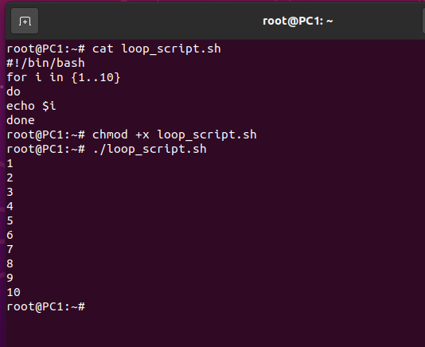
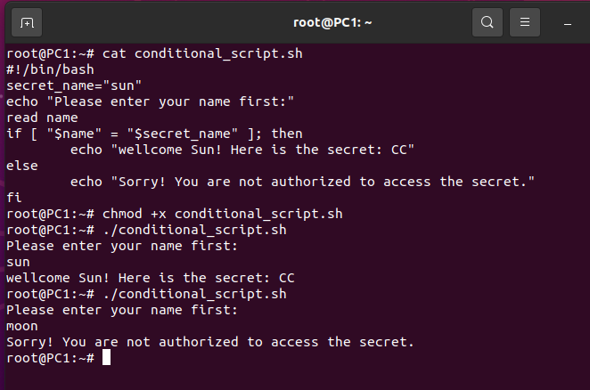

# 3 - Linux Shells

## Mục lục

1. [Task 1: Introduction to Linux Shells](#task-1-introduction-to-linux-shells)
2. [Task 2: How To Interact With a Shell?](#task-2-how-to-interact-with-a-shell)
3. [# Task 3: Types of Linux Shells](#task-3-types-of-linux-shells)
4. [Task 4: Shell Scripting and Components](#task-4-shell-scripting-and-components)
---

## Nội dung

# Task 1: Introduction to Linux Shells

>Giới thiệu về Linux Shells

Là người dùng thông thường của hệ điều hành, tất cả chúng ta đều sử dụng Giao diện Người dùng Đồ họa (GUI) để thực hiện hầu hết các thao tác. Chỉ cần vài cú nhấp chuột vào các tùy chọn khác nhau và công việc của bạn đã hoàn thành. Tuy nhiên, bạn có thể thực hiện hầu như mọi tác vụ bằng cách nhập lệnh trong Giao diện Dòng lệnh (CLI) của hệ điều hành thay vì dùng GUI. Shell cung cấp cho bạn một số tính năng tuyệt vời cho các lệnh bạn nhập trong CLI. Cách tương tác này với hệ điều hành hiệu quả hơn và tiết kiệm tài nguyên hơn.

Giả sử bạn đang ở trong một nhà hàng và có hai lựa chọn để ăn. Lựa chọn đầu tiên là gọi món từ thực đơn và nhân viên phục vụ sẽ mang đến. Lựa chọn thứ hai là bạn tự vào bếp nấu món mình muốn. Trong hệ thống Linux, nhà bếp ở đây tượng trưng cho hệ điều hành (OS), và việc sử dụng GUI của hệ điều hành giống như bạn gọi món từ thực đơn, rồi nhân viên phục vụ mang đến cho bạn. Tuy nhiên, sử dụng CLI có nghĩa là bạn phải vào bếp (OS) và tự nấu món ăn bạn muốn. Trong ví dụ này, Shell sẽ giúp bạn nấu món ăn bằng cách gợi ý một số công thức nấu ăn. Sử dụng CLI để thực hiện các thao tác trong hệ thống Linux mang lại cho bạn nhiều quyền kiểm soát và sức mạnh hơn khi làm việc.

Có thể bạn đã từng thấy các cảnh phim hack nơi có những màn hình terminal “ngầu” với nhiều lệnh đang được thực thi. Đó là vì hầu hết người dùng Linux thích thực hiện các thao tác bằng cách nhập lệnh trong CLI sử dụng shell thay vì GUI. Bài học này sẽ hướng dẫn chúng ta cách tương tác với shell của Linux. Chúng ta cũng sẽ tìm hiểu các shell khác nhau có trong Linux và viết một số tập lệnh shell ở phần cuối.

**Mục tiêu học tập**

* Học cách tương tác với Linux shell
* Sử dụng các lệnh shell cơ bản
* Tìm hiểu các loại shell trong Linux
* Viết một số tập lệnh shell

**Trả lời các câu hỏi dưới đây**

**Ai là người trung gian giữa người dùng và hệ điều hành?**

**Trả lời:** Shell

---

# Task 2: How To Interact With a Shell?

>Cách tương tác với Shell?

Khi máy mở ra ở chế độ chia đôi màn hình, bạn sẽ thấy dòng lệnh shell sẵn sàng để nhận lệnh.

---

### **Linux Shell**

```
user@ubuntu:~$
```

Hầu hết các bản phân phối Linux đều sử dụng Bash (Bourne Again Shell) làm shell mặc định. Tuy nhiên, shell mặc định hiển thị khi bạn mở terminal sẽ phụ thuộc vào bản phân phối Linux bạn đang dùng.

---

### **Kiểm tra thư mục làm việc hiện tại**

Để xem thư mục làm việc hiện tại của bạn, bạn có thể thực thi lệnh `pwd`, viết tắt của **Print Working Directory**, như được hiển thị trong terminal bên dưới:

```
user@ubuntu:~$ pwd
/home/user
```

Trong kết quả của lệnh trên, bạn có thể thấy rằng thư mục làm việc hiện tại của bạn là `/home/ubuntu`.

---

### **Thay đổi thư mục**

Tuy nhiên, bạn cũng có thể thay đổi thư mục hiện tại. Để làm điều đó, bạn có thể dùng lệnh `cd` (viết tắt của **Change Directory**), như trong terminal dưới đây:

```
user@ubuntu:~$ cd Desktop
user@ubuntu:~/Desktop$
```

---

### **Liệt kê nội dung thư mục**

Khi sử dụng GUI của hệ điều hành, bạn có thể thấy nội dung của một thư mục hiển thị trên màn hình. Tuy nhiên, khi sử dụng shell, để xem nội dung của một thư mục, bạn cần nhập lệnh sau:

```
user@ubuntu:~$ ls
Desktop  Documents  Downloads  Music  Pictures  Public  Templates  Videos
```
---

### **Hiển thị nội dung tập tin**

Nếu bạn muốn đọc nội dung của một tập tin, bạn có thể gõ lệnh sau trong shell của mình:

```
user@ubuntu:~$ cat filename.txt
this is a sample file
this is the second line of the file
```

---

### **Tìm một từ trong tập tin**

Lệnh `grep` là một lệnh rất phổ biến đối với người dùng Linux. Lệnh mạnh mẽ này có thể tìm kiếm bất kỳ từ hoặc mẫu nào bên trong một tập tin.
Giả sử bạn muốn tìm kiếm các mục cụ thể trong một tập tin lớn. Bạn có thể dùng lệnh `grep` cùng với mẫu (pattern) của mục cần tìm, và nó sẽ trích xuất chúng cho bạn. Nó cũng giúp bạn tìm kiếm một từ khóa cụ thể trong tập tin lớn.

Terminal dưới đây minh họa cách sử dụng lệnh `grep` để tìm từ “THM” trong một tập tin văn bản lớn. Kết quả đầu ra sẽ hiển thị dòng cụ thể trong tập tin chứa từ đó.

```
user@ubuntu:~$ grep THM dictionary.txt
The flag is THM
```

---

### **Trả lời các câu hỏi dưới đây**

**Câu hỏi:** Shell mặc định trong hầu hết các bản phân phối Linux là gì?

**Trả lời:** Bash

**Câu hỏi:** Lệnh nào được dùng để liệt kê nội dung của một thư mục?

**Trả lời:** ls

**Câu hỏi:** Lệnh nào có thể giúp bạn tìm kiếm bất kỳ nội dung nào trong một tập tin?

**Trả lời:** grep

---

# Task 3: Types of Linux Shells

>Các loại Shell trong Linux

Các bản phân phối Linux đi kèm với nhiều loại shell khác nhau, mỗi loại có một bộ tính năng riêng biệt. Bạn có thể dùng lệnh `echo $SHELL` để xem bạn đang sử dụng shell nào. Ngoài ra, tệp `/etc/shells` liệt kê tất cả các shell có sẵn trên hệ thống của bạn. Một số shell phổ biến bao gồm:

---

### **Shell hiện tại**

```
user@ubuntu:~$ echo $SHELL
/bin/bash
```
---

### **Các shell có sẵn**

Bạn cũng có thể liệt kê các shell có sẵn trong hệ điều hành Linux của bạn. Tệp `/etc/shells` chứa tất cả các shell đã được cài đặt trên hệ thống Linux. Bạn có thể liệt kê các shell có sẵn trong hệ điều hành của mình bằng cách gõ lệnh `cat /etc/shells` trong terminal như sau:

```
user@ubuntu:~$ cat /etc/shells
# /etc/shells: valid login shells
/bin/sh
/bin/bash
/usr/bin/bash
/bin/rbash
/usr/bin/rbash
/bin/dash
/usr/bin/dash
/usr/bin/tmux
/usr/bin/screen
/bin/zsh
/usr/bin/zsh
```

---

### **Chuyển đổi giữa các shell**

Để chuyển giữa các shell này, bạn có thể gõ tên shell có sẵn trên hệ điều hành, và nó sẽ được mở ra cho bạn, như minh họa dưới đây:

```
user@ubuntu:~$ zsh
user@ubuntu ~ %
```
---

Nếu bạn muốn **thay đổi shell mặc định** của mình một cách **vĩnh viễn**, bạn có thể sử dụng lệnh:

```
chsh -s /usr/bin/zsh
```

Lệnh này sẽ đặt Zsh làm shell mặc định cho terminal của bạn.

Có nhiều loại shell trong Linux. Dưới đây là một vài loại phổ biến cùng với các tính năng của chúng:

* **Bourne Again Shell (Bash)**: Là shell mặc định trong hầu hết các bản phân phối Linux, với khả năng lập trình mạnh mẽ và các tính năng như lưu lịch sử lệnh và tự động hoàn thành lệnh (tab completion).

* **Friendly Interactive Shell (Fish)**: Tập trung vào sự dễ sử dụng với các tính năng như tự động sửa lỗi chính tả, giao diện có thể tùy chỉnh và tô sáng cú pháp.

* **Z Shell (Zsh)**: Nổi tiếng với khả năng tùy biến cao và tính năng tự động hoàn thành nâng cao. Tuy nhiên, Zsh có thể chạy chậm hơn một chút do có nhiều tính năng hơn.

---

**Trả lời các câu hỏi dưới đây**

**Câu hỏi:** Shell nào có tính năng tô sáng cú pháp (syntax highlighting) ngay khi cài đặt?

**Trả lời:** Fish

**Câu hỏi:** Shell nào không có tính năng tự động sửa lỗi chính tả?

**Trả lời:** Bash

**Câu hỏi:** Lệnh nào hiển thị tất cả các lệnh đã được thực thi trong phiên làm việc hiện tại?

**Trả lời:** history

---

# Task 4: Shell Scripting and Components

>Lập trình Shell và Các thành phần

Lập trình shell cho phép người dùng tự động hóa các tác vụ lặp đi lặp lại bằng cách kết hợp nhiều lệnh thành một tập tin thực thi duy nhất, có thể chạy một lần. Một tập lệnh shell cơ bản bao gồm một số thành phần chính:

* **Shebang (`#!`)**: Xác định trình thông dịch sẽ được sử dụng để chạy script (ví dụ: `#!/bin/bash` cho Bash).
* **Biến (Variables)**: Cho phép lưu trữ giá trị để sử dụng trong toàn bộ script.
* **Vòng lặp (Loops)**: Thực thi một tập hợp các lệnh lặp đi lặp lại.
* **Câu lệnh điều kiện (Conditional Statements)**: Thực hiện các đoạn mã khác nhau tùy theo điều kiện.

---

```
user@ubuntu:~$ nano first_script.sh
```

**first\_script.sh**

```
#!/bin/bash
```

---

Bây giờ chúng ta đã sẵn sàng để viết script đầu tiên. Dưới đây là một số thành phần cơ bản của một script — chúng sẽ kết hợp lại để tạo nên một script hiệu quả. Hãy tìm hiểu và sử dụng những cấu trúc này để tự viết một script nhé.

---

### **Biến**

Một biến lưu trữ một giá trị bên trong nó. Giả sử bạn cần sử dụng một số giá trị phức tạp như URL, đường dẫn tệp, v.v... nhiều lần trong script. Thay vì phải nhớ và gõ lại nhiều lần, bạn có thể lưu chúng trong một biến và dùng tên biến ở bất kỳ nơi nào bạn cần.

Ví dụ dưới đây hiển thị một chuỗi ra màn hình: “Hey, what’s your name?”
Điều này được thực hiện bằng lệnh `echo`.
Dòng thứ hai trong script chứa lệnh `read name`. `read` được dùng để lấy dữ liệu đầu vào từ người dùng, và `name` là biến lưu trữ dữ liệu đó.
Dòng cuối cùng sử dụng `echo` để hiển thị lời chào kèm tên của người dùng, vốn đã được lưu trong biến.

---

```bash
# Định nghĩa trình thông dịch
#!/bin/bash
echo "Hey, what's your name?"
read name
echo "Welcome, $name"
```

---

Để thực thi một script, trước tiên chúng ta cần đảm bảo rằng script đó có quyền thực thi.
Để cấp quyền này cho script, chúng ta có thể gõ lệnh sau trong terminal:

 **Cấp quyền thực thi cho script**

```
user@ubuntu:~$ chmod +x variable_script.sh
```

---

**Thực thi script**

```
user@ubuntu:~$ ./variable_script.sh
Hey, What's your name?
John
Welcome, John
```
---

### **Vòng lặp (Loops)**

```bash
# Định nghĩa trình thông dịch
#!/bin/bash
for i in {1..10};
do
  echo $i
done
```

Dòng đầu tiên sử dụng biến `i`, biến này sẽ lặp từ 1 đến 10 và thực thi đoạn mã bên dưới trong mỗi vòng lặp.
Lệnh `do` đánh dấu **phần bắt đầu** của đoạn mã trong vòng lặp, và `done` đánh dấu **phần kết thúc**.
Mọi đoạn mã bạn muốn thực thi trong vòng lặp đều phải được viết giữa hai lệnh này.

Câu lệnh `for` sẽ lấy từng số trong ngoặc `{1..10}` và gán nó vào biến `i` trong mỗi vòng lặp.
Lệnh `echo $i` sẽ hiển thị giá trị của biến `i` ở mỗi vòng lặp.




---

### **Câu lệnh điều kiện (Conditional Statements)**

Câu lệnh điều kiện là một phần quan trọng trong lập trình shell. Chúng giúp bạn thực thi một đoạn mã **chỉ khi điều kiện được thỏa mãn**; nếu không, bạn có thể thực thi một đoạn mã khác.

Giả sử bạn muốn tạo một script hiển thị một “bí mật” cho người dùng. Tuy nhiên, bạn muốn chỉ một số người dùng cụ thể mới được xem, chẳng hạn chỉ những người có quyền cao. Bạn sẽ tạo một câu lệnh điều kiện mà trước tiên yêu cầu người dùng nhập tên của họ, và nếu tên đó trùng với tên người dùng có quyền cao, thì sẽ hiển thị “bí mật”.

---

```bash
# Định nghĩa trình thông dịch
#!/bin/bash
secret_name="sun"
echo "Please enter your name first:"
read name
if [ "$name" = "$secret_name" ]; then
    echo "Welcome Sun! Here is the secret: CC"
else
    echo "Sorry! You are not authorized to access the secret."
fi
```




---

### **Chú thích (Comments)**

```bash
# Định nghĩa trình thông dịch
#!/bin/bash

# Yêu cầu người dùng nhập một giá trị.
echo "Please enter your name first:"

# Lưu giá trị người dùng nhập vào một biến.
read name

# Kiểm tra xem tên người dùng nhập có trùng với tên yêu cầu hay không.
if [ "$name" = "Stewart" ]; then

    # Nếu trùng khớp, dòng sau sẽ được hiển thị.
    echo "Welcome Stewart! Here is the secret: THM_Script"

# Định nghĩa câu sẽ hiển thị nếu điều kiện không được đáp ứng.
else
    echo "Sorry! You are not authorized to access the secret."
fi
```

---

**Lưu ý:** Các loại biến, vòng lặp và câu lệnh điều kiện khác cũng có thể được sử dụng để thực hiện nhiều tác vụ khác nhau. Ngoài ra, có thể thêm nhiều dòng chú thích trong một chú thích duy nhất. Tuy nhiên, điều này **không nằm trong phạm vi** của bài học này.

---

**Trả lời các câu hỏi dưới đây**

**Câu hỏi:** Shebang được sử dụng trong một Bash script là gì?

**Trả lời:** `#!/bin/bash`

**Câu hỏi:** Lệnh nào cấp quyền thực thi cho một script?

**Trả lời:** `chmod +x`

**Câu hỏi:** Tính năng nào trong lập trình shell giúp chúng ta cấu hình các tác vụ lặp?

**Trả lời:** Vòng lặp (Loops)

---

