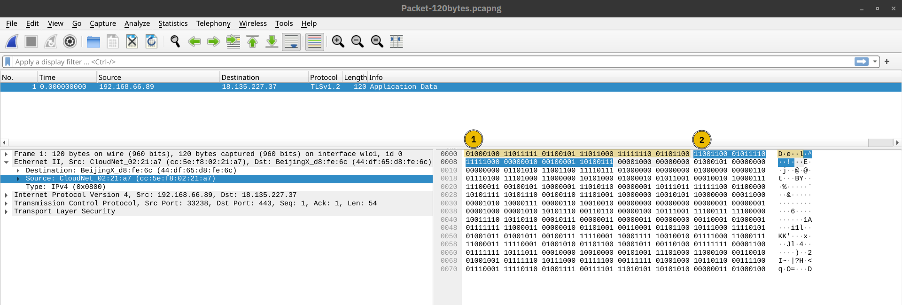
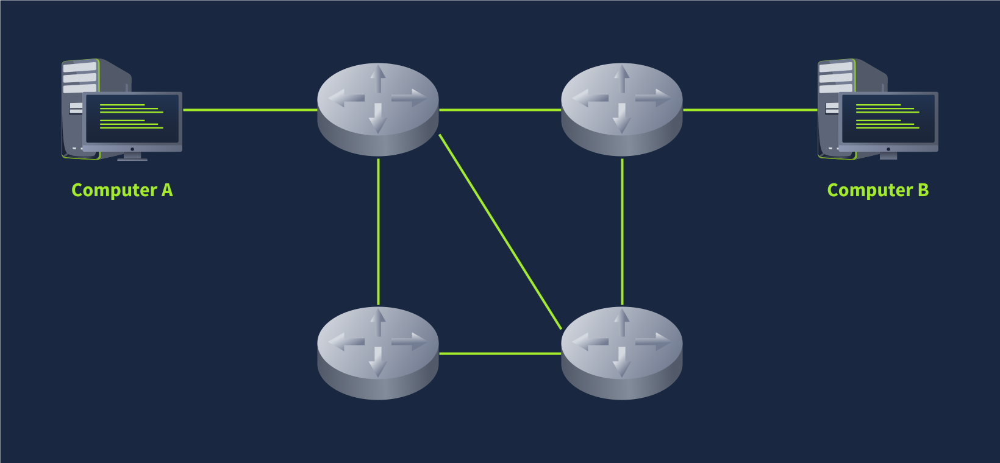

# Networking Concepts

## Mục lục

1. [Task 1: OSI Model](#task-1-osi-model)
2. [Task 3: TCP/IP Model](#task-2-tcpip-model)

## Nội dung

# Task 1: OSI Model

>Mô hình OSI

Trước khi bắt đầu, chúng tôi muốn lưu ý rằng mô hình OSI ban đầu có thể sẽ có vẻ phức tạp. Đừng lo nếu bạn gặp phải các từ viết tắt khó hiểu, vì chúng tôi sẽ cung cấp các ví dụ về các tầng trong mô hình OSI. Chúng tôi đảm bảo rằng khi bạn hoàn thành mô-đun này, nhiệm vụ này sẽ trở nên rất dễ dàng.

Mô hình OSI (Open Systems Interconnection – Kết nối Hệ thống Mở) là một mô hình khái niệm được phát triển bởi Tổ chức Tiêu chuẩn hóa Quốc tế (ISO) mô tả cách thức giao tiếp nên diễn ra trong một mạng máy tính. Nói cách khác, mô hình OSI định nghĩa một khung chuẩn cho các giao tiếp mạng máy tính. Mặc dù mô hình này mang tính lý thuyết, việc học và hiểu nó là rất quan trọng vì nó giúp nắm bắt các khái niệm mạng ở mức độ sâu hơn. Mô hình OSI bao gồm bảy tầng:

1. Tầng Vật lý (Physical Layer)
2. Tầng Liên kết Dữ liệu (Data Link Layer)
3. Tầng Mạng (Network Layer)
4. Tầng Giao vận (Transport Layer)
5. Tầng Phiên (Session Layer)
6. Tầng Trình bày (Presentation Layer)
7. Tầng Ứng dụng (Application Layer)

Việc đánh số bắt đầu với tầng vật lý là tầng 1, trong khi tầng cao nhất, tầng ứng dụng, là tầng 7. Để giúp bạn nhớ các tầng từ dưới lên trên, bạn có thể sử dụng một câu ghi nhớ như: “**Please Do Not Throw Spinach Pizza Away**” (Vui lòng Đừng Ném Pizza Rau Chân Vịt Đi). Bạn cũng có thể tra cứu trên Internet để tìm thêm các từ viết tắt dễ nhớ khác nếu điều đó giúp bạn học thuộc. Việc nhớ được các tầng trong mô hình OSI cùng với số thứ tự của chúng là rất quan trọng; nếu không, bạn sẽ gặp khó khăn khi hiểu các thuật ngữ như “thiết bị tầng 3” hoặc “tường lửa tầng 7”.

---

### **Tầng 1: Tầng Vật lý (Physical Layer)**

Tầng vật lý, còn được gọi là tầng 1, xử lý kết nối vật lý giữa các thiết bị; điều này bao gồm phương tiện truyền dẫn, chẳng hạn như dây cáp, và định nghĩa về các chữ số nhị phân 0 và 1.
Việc truyền dữ liệu có thể diễn ra thông qua tín hiệu điện, quang học hoặc không dây. Do đó, chúng ta cần cáp dữ liệu hoặc ăng-ten, tùy thuộc vào phương tiện vật lý mà ta sử dụng.

Ngoài cáp Ethernet (được minh họa bên dưới) và cáp quang, các ví dụ về phương tiện tầng vật lý còn bao gồm các dải tần số vô tuyến WiFi, cụ thể là dải 2.4 GHz, dải 5 GHz và dải 6 GHz.

---

### **Tầng 2: Tầng Liên kết Dữ liệu (Data Link Layer)**

Tầng vật lý xác định một phương tiện để truyền tín hiệu của chúng ta. Tầng liên kết dữ liệu, tức là tầng 2, đại diện cho giao thức cho phép truyền dữ liệu giữa các nút trong cùng một đoạn mạng.
Nói đơn giản hơn, tầng liên kết dữ liệu mô tả một thỏa thuận giữa các hệ thống khác nhau trong cùng một đoạn mạng về cách giao tiếp với nhau. Một đoạn mạng (network segment) là một nhóm các thiết bị được kết nối trong mạng sử dụng cùng một phương tiện hoặc kênh để truyền thông tin.
Ví dụ, hãy tưởng tượng một văn phòng công ty có mười máy tính được kết nối với cùng một switch mạng – đó chính là một đoạn mạng.

Các ví dụ về tầng 2 bao gồm Ethernet (ví dụ: 802.3) và WiFi (ví dụ: 802.11). Địa chỉ của Ethernet và WiFi là dài 6 byte. Địa chỉ này được gọi là địa chỉ MAC, trong đó MAC là viết tắt của "Media Access Control" (Kiểm soát truy cập phương tiện).
Chúng thường được biểu diễn ở dạng thập lục phân, với dấu hai chấm (:) ngăn cách mỗi hai chữ số thập lục phân (tương ứng với một byte). Ba byte đầu tiên bên trái dùng để nhận diện nhà sản xuất.

Chúng ta kỳ vọng sẽ thấy hai địa chỉ MAC trong mỗi khung dữ liệu khi giao tiếp mạng thực tế qua Ethernet hoặc WiFi. Gói tin trong ảnh chụp màn hình bên dưới hiển thị:

* **Địa chỉ liên kết dữ liệu đích (địa chỉ MAC)** được đánh dấu màu vàng
* **Địa chỉ liên kết dữ liệu nguồn (địa chỉ MAC)** được đánh dấu màu xanh dương
* **Các bit còn lại thể hiện dữ liệu đang được gửi**

---

### **Tầng 3: Tầng Mạng (Network Layer)**

Tầng liên kết dữ liệu tập trung vào việc gửi dữ liệu giữa hai nút trong cùng một đoạn mạng. Tầng mạng, tức là tầng 3, liên quan đến việc gửi dữ liệu giữa các mạng khác nhau. Nói theo cách kỹ thuật hơn, tầng mạng xử lý việc định địa chỉ logic và định tuyến – tức là tìm một đường đi để truyền các gói dữ liệu giữa các mạng khác nhau.

Ở tầng liên kết dữ liệu, chúng ta đã lấy ví dụ về một văn phòng công ty có mười máy tính, nơi tầng liên kết dữ liệu chịu trách nhiệm thiết lập kết nối giữa chúng. Giả sử công ty này có nhiều văn phòng phân bố ở nhiều thành phố, quốc gia, hoặc thậm chí là các châu lục khác nhau. Khi đó, tầng mạng sẽ chịu trách nhiệm kết nối các văn phòng này lại với nhau.

Sơ đồ mạng bên dưới cho thấy máy tính A và máy tính B được kết nối với nhau, mặc dù chúng nằm ở các mạng khác nhau. Bạn cũng có thể thấy có hai đường đi kết nối hai máy tính; tầng mạng sẽ định tuyến các gói tin mạng thông qua đường đi mà nó cho là tối ưu hơn.

*(Hình minh họa: hai máy tính A và B kết nối qua nhiều router với hai tuyến đường khác nhau)*

**Các ví dụ về tầng mạng bao gồm:**

* Giao thức Internet (IP)
* Giao thức Thông điệp Điều khiển Internet (ICMP)
* Các giao thức Mạng Riêng Ảo (VPN) như IPSec và SSL/TLS VPN

---

### **Tầng 4: Tầng Giao vận (Transport Layer)**

Tầng 4, tầng giao vận, cho phép giao tiếp từ đầu đến cuối giữa các ứng dụng đang chạy trên các máy chủ khác nhau. Trình duyệt web của bạn được kết nối với máy chủ web TryHackMe thông qua tầng giao vận, vốn hỗ trợ nhiều chức năng như kiểm soát luồng, phân mảnh dữ liệu, và sửa lỗi.

**Ví dụ về tầng 4:** Giao thức Điều khiển Truyền tải (TCP) và Giao thức Gói dữ liệu Người dùng (UDP).

---

### **Tầng 5: Tầng Phiên (Session Layer)**

Tầng phiên chịu trách nhiệm thiết lập, duy trì và đồng bộ hóa việc giao tiếp giữa các ứng dụng đang chạy trên các máy chủ khác nhau. Thiết lập một phiên có nghĩa là khởi tạo việc giao tiếp giữa các ứng dụng và thỏa thuận các tham số cần thiết cho phiên làm việc. Đồng bộ dữ liệu đảm bảo rằng dữ liệu được truyền theo đúng thứ tự và cung cấp cơ chế khôi phục khi xảy ra lỗi trong quá trình truyền tải.

**Ví dụ về tầng phiên:** Hệ thống Tập tin Mạng (NFS) và Gọi Thủ tục Từ xa (RPC).

---

### **Tầng 6: Tầng Trình bày (Presentation Layer)**

Tầng trình bày đảm bảo dữ liệu được trình bày ở dạng mà tầng ứng dụng có thể hiểu được. Tầng 6 xử lý việc mã hóa dữ liệu, nén và mã hóa bảo mật. Một ví dụ về mã hóa là mã hóa ký tự như ASCII hoặc Unicode.

Nhiều tiêu chuẩn được sử dụng ở tầng trình bày. Hãy xem xét tình huống khi bạn muốn gửi một hình ảnh qua email. Đầu tiên, chúng ta sử dụng định dạng JPEG, GIF hoặc PNG để lưu hình ảnh; sau đó, dù ẩn với người dùng, ứng dụng email sẽ sử dụng MIME (Định dạng Mở rộng Thư Internet Đa năng) để đính kèm tập tin vào email. MIME mã hóa tập tin nhị phân bằng cách sử dụng ký tự ASCII 7-bit.

---

### **Tầng 7: Tầng Ứng dụng (Application Layer)**

Tầng ứng dụng cung cấp các dịch vụ mạng trực tiếp cho các ứng dụng của người dùng cuối. Ví dụ, trình duyệt web của bạn sử dụng giao thức HTTP để yêu cầu một tập tin, gửi biểu mẫu, hoặc tải tệp lên.

Tầng ứng dụng là tầng cao nhất, và bạn có thể đã từng gặp nhiều giao thức thuộc tầng này khi sử dụng các ứng dụng khác nhau.

**Ví dụ về các giao thức tầng 7:**

* HTTP
* FTP
* DNS
* POP3
* SMTP
* IMAP

---

### **Tóm tắt**

Việc đọc về mô hình OSI của ISO lần đầu tiên có thể khiến bạn cảm thấy choáng ngợp; tuy nhiên, mọi thứ sẽ trở nên dễ dàng hơn khi bạn tiến bộ trong việc học các giao thức mạng. Để hỗ trợ cho quá trình học của bạn, chúng tôi đã tóm tắt các tầng của mô hình OSI trong bảng dưới đây:

| **Số tầng** | **Tên tầng**                      | **Chức năng chính**                            | **Ví dụ về giao thức và tiêu chuẩn**   |
| ----------- | --------------------------------- | ---------------------------------------------- | -------------------------------------- |
| **Tầng 7**  | Tầng Ứng dụng (Application)       | Cung cấp dịch vụ và giao diện cho các ứng dụng | HTTP, FTP, DNS, POP3, SMTP, IMAP       |
| **Tầng 6**  | Tầng Trình bày (Presentation)     | Mã hóa dữ liệu, mã hóa bảo mật, và nén dữ liệu | Unicode, MIME, JPEG, PNG, MPEG         |
| **Tầng 5**  | Tầng Phiên (Session)              | Thiết lập, duy trì và đồng bộ hóa các phiên    | NFS, RPC                               |
| **Tầng 4**  | Tầng Giao vận (Transport)         | Giao tiếp đầu-cuối và phân đoạn dữ liệu        | UDP, TCP                               |
| **Tầng 3**  | Tầng Mạng (Network)               | Định địa chỉ logic và định tuyến giữa các mạng | IP, ICMP, IPSec                        |
| **Tầng 2**  | Tầng Liên kết dữ liệu (Data Link) | Truyền dữ liệu tin cậy giữa các nút liền kề    | Ethernet (802.3), WiFi (802.11)        |
| **Tầng 1**  | Tầng Vật lý (Physical)            | Phương tiện truyền dẫn dữ liệu vật lý          | Tín hiệu điện, quang học, và không dây |

---

**Trả lời các câu hỏi bên dưới**

1. **Tầng nào chịu trách nhiệm cho việc giao tiếp từ đầu đến cuối giữa các ứng dụng đang chạy?**

   → **4**

2. **Tầng nào chịu trách nhiệm định tuyến các gói tin đến đúng mạng?**

   → **3**

3. **Trong mô hình OSI, tầng nào chịu trách nhiệm mã hóa dữ liệu của ứng dụng?**

   → **6**

4. **Tầng nào chịu trách nhiệm truyền dữ liệu giữa các máy chủ trên cùng một đoạn mạng?**

   → **2**

---

# Task 2: TCP/IP Model

>Mô hình TCP/IP

Bây giờ khi chúng ta đã tìm hiểu xong mô hình OSI của ISO (một mô hình mang tính khái niệm), đã đến lúc nghiên cứu một mô hình được triển khai thực tế — mô hình **TCP/IP**.
TCP/IP là viết tắt của **Transmission Control Protocol/Internet Protocol** và được phát triển vào những năm 1970 bởi Bộ Quốc phòng Hoa Kỳ (DoD). Bạn có thể thắc mắc vì sao Bộ Quốc phòng lại tạo ra một mô hình như vậy. Một trong những điểm mạnh của mô hình này là nó cho phép mạng vẫn tiếp tục hoạt động ngay cả khi một phần của nó bị gián đoạn — chẳng hạn, do một cuộc tấn công quân sự. Khả năng này phần nào có được nhờ thiết kế của các giao thức định tuyến có thể thích nghi với sự thay đổi trong cấu trúc mạng.

Trong phần trình bày về mô hình OSI của ISO, chúng ta đã học theo thứ tự từ dưới lên, từ tầng 1 đến tầng 7. Trong nhiệm vụ này, hãy nhìn sự việc từ một góc độ khác — từ trên xuống dưới. Từ trên xuống, ta có:

* **Tầng Ứng dụng (Application Layer):** Trong mô hình OSI, các tầng 5, 6 và 7 — tức là tầng phiên, tầng trình bày và tầng ứng dụng — được gộp lại thành tầng ứng dụng trong mô hình TCP/IP.
* **Tầng Giao vận (Transport Layer):** Đây là tầng 4.
* **Tầng Internet (Internet Layer):** Đây là tầng 3. Tầng mạng trong mô hình OSI được gọi là tầng Internet trong mô hình TCP/IP.
* **Tầng Liên kết (Link Layer):** Đây là tầng 2.

---

**Bảng dưới đây cho thấy cách các tầng trong mô hình TCP/IP ánh xạ (tương ứng) với các tầng trong mô hình ISO/OSI.**

| **Số Tầng** | **Mô hình ISO OSI**                     | **Mô hình TCP/IP (RFC 1122)**     | **Các Giao thức**                                                           |
| ----------- | --------------------------------------- | --------------------------------- | --------------------------------------------------------------------------- |
| Tầng 7      | Tầng Ứng dụng (Application Layer)       | Tầng Ứng dụng (Application Layer) | **HTTP**, **HTTPS**, **FTP**, **POP3**, **SMTP**, **IMAP**, Telnet, **SSH** |
| Tầng 6      | Tầng Trình bày (Presentation Layer)     | *(gộp chung vào tầng ứng dụng)*   |                                                                             |
| Tầng 5      | Tầng Phiên (Session Layer)              | *(gộp chung vào tầng ứng dụng)*   |                                                                             |
| Tầng 4      | Tầng Giao vận (Transport Layer)         | Tầng Giao vận (Transport Layer)   | **TCP**, **UDP**                                                            |
| Tầng 3      | Tầng Mạng (Network Layer)               | Tầng Internet (Internet Layer)    | **IP**, **ICMP**, **IPSec**                                                 |
| Tầng 2      | Tầng Liên kết dữ liệu (Data Link Layer) | Tầng Liên kết (Link Layer)        | **Ethernet 802.3**, **WiFi 802.11**                                         |
| Tầng 1      | Tầng Vật lý (Physical Layer)            | *(gộp chung vào tầng liên kết)*   |                                                                             |

---

Nhiều giáo trình mạng hiện đại mô tả mô hình **TCP/IP** gồm **năm tầng** thay vì bốn.
Ví dụ, trong cuốn *Computer Networking: A Top-Down Approach, ấn bản lần thứ 8* của **Kurose và Ross**, mô hình giao thức Internet năm tầng được trình bày như sau, bằng cách thêm tầng vật lý:

* Ứng dụng (Application)
* Giao vận (Transport)
* Mạng (Network)
* Liên kết (Link)
* Vật lý (Physical)

Trong các nhiệm vụ tiếp theo, chúng ta sẽ tìm hiểu về giao thức IP từ tầng Internet và các giao thức **UDP** và **TCP** từ tầng giao vận.

---

**Trả lời các câu hỏi dưới đây**

**HTTP thuộc tầng nào trong mô hình TCP/IP?**

→ **Tầng Ứng dụng (Application Layer)**

**Tầng ứng dụng trong mô hình TCP/IP bao gồm bao nhiêu tầng của mô hình OSI?**

→ **3 tầng**

(Cụ thể là các tầng 5 - Phiên, tầng 6 - Trình bày, và tầng 7 - Ứng dụng trong mô hình OSI được gộp lại thành một tầng trong mô hình TCP/IP.)
