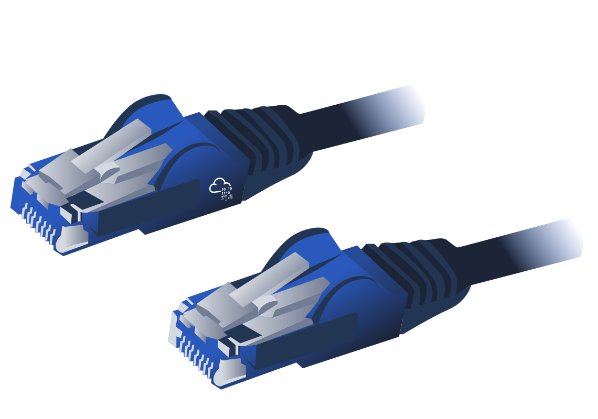

# Networking Concepts

## Mục lục

1. [Task 1: OSI Model](#task-1-osi-model)
2. [Task 2: TCP/IP Model](#task-2-tcpip-model)
3. [Task 3: IP Addresses and Subnets](#task-3-ip-addresses-and-subnets)
4. [Task 4: UDP and TCP](#task-4-udp-and-tcp)

## Nội dung

# Task 1: OSI Model

>Mô hình OSI

Trước khi bắt đầu, chúng tôi muốn lưu ý rằng mô hình OSI ban đầu có thể sẽ có vẻ phức tạp. Đừng lo nếu bạn gặp phải các từ viết tắt khó hiểu, vì chúng tôi sẽ cung cấp các ví dụ về các tầng trong mô hình OSI. Chúng tôi đảm bảo rằng khi bạn hoàn thành mô-đun này, nhiệm vụ này sẽ trở nên rất dễ dàng.

Mô hình OSI (Open Systems Interconnection – Kết nối Hệ thống Mở) là một mô hình khái niệm được phát triển bởi Tổ chức Tiêu chuẩn hóa Quốc tế (ISO) mô tả cách thức giao tiếp nên diễn ra trong một mạng máy tính. Nói cách khác, mô hình OSI định nghĩa một khung chuẩn cho các giao tiếp mạng máy tính. Mặc dù mô hình này mang tính lý thuyết, việc học và hiểu nó là rất quan trọng vì nó giúp nắm bắt các khái niệm mạng ở mức độ sâu hơn. Mô hình OSI bao gồm bảy tầng:

1. Tầng Vật lý (Physical Layer)
2. Tầng Liên kết Dữ liệu (Data Link Layer)
3. Tầng Mạng (Network Layer)
4. Tầng Giao vận (Transport Layer)
5. Tầng Phiên (Session Layer)
6. Tầng Trình bày (Presentation Layer)
7. Tầng Ứng dụng (Application Layer)

Việc đánh số bắt đầu với tầng vật lý là tầng 1, trong khi tầng cao nhất, tầng ứng dụng, là tầng 7. Để giúp bạn nhớ các tầng từ dưới lên trên, bạn có thể sử dụng một câu ghi nhớ như: “**Please Do Not Throw Spinach Pizza Away**” (Vui lòng Đừng Ném Pizza Rau Chân Vịt Đi). Bạn cũng có thể tra cứu trên Internet để tìm thêm các từ viết tắt dễ nhớ khác nếu điều đó giúp bạn học thuộc. Việc nhớ được các tầng trong mô hình OSI cùng với số thứ tự của chúng là rất quan trọng; nếu không, bạn sẽ gặp khó khăn khi hiểu các thuật ngữ như “thiết bị tầng 3” hoặc “tường lửa tầng 7”.

---

### **Tầng 1: Tầng Vật lý (Physical Layer)**

Tầng vật lý, còn được gọi là tầng 1, xử lý kết nối vật lý giữa các thiết bị; điều này bao gồm phương tiện truyền dẫn, chẳng hạn như dây cáp, và định nghĩa về các chữ số nhị phân 0 và 1.
Việc truyền dữ liệu có thể diễn ra thông qua tín hiệu điện, quang học hoặc không dây. Do đó, chúng ta cần cáp dữ liệu hoặc ăng-ten, tùy thuộc vào phương tiện vật lý mà ta sử dụng.

Ngoài cáp Ethernet (được minh họa bên dưới) và cáp quang, các ví dụ về phương tiện tầng vật lý còn bao gồm các dải tần số vô tuyến WiFi, cụ thể là dải 2.4 GHz, dải 5 GHz và dải 6 GHz.

---

### **Tầng 2: Tầng Liên kết Dữ liệu (Data Link Layer)**

Tầng vật lý xác định một phương tiện để truyền tín hiệu của chúng ta. Tầng liên kết dữ liệu, tức là tầng 2, đại diện cho giao thức cho phép truyền dữ liệu giữa các nút trong cùng một đoạn mạng.
Nói đơn giản hơn, tầng liên kết dữ liệu mô tả một thỏa thuận giữa các hệ thống khác nhau trong cùng một đoạn mạng về cách giao tiếp với nhau. Một đoạn mạng (network segment) là một nhóm các thiết bị được kết nối trong mạng sử dụng cùng một phương tiện hoặc kênh để truyền thông tin.
Ví dụ, hãy tưởng tượng một văn phòng công ty có mười máy tính được kết nối với cùng một switch mạng – đó chính là một đoạn mạng.

Các ví dụ về tầng 2 bao gồm Ethernet (ví dụ: 802.3) và WiFi (ví dụ: 802.11). Địa chỉ của Ethernet và WiFi là dài 6 byte. Địa chỉ này được gọi là địa chỉ MAC, trong đó MAC là viết tắt của "Media Access Control" (Kiểm soát truy cập phương tiện).
Chúng thường được biểu diễn ở dạng thập lục phân, với dấu hai chấm (:) ngăn cách mỗi hai chữ số thập lục phân (tương ứng với một byte). Ba byte đầu tiên bên trái dùng để nhận diện nhà sản xuất.

Chúng ta kỳ vọng sẽ thấy hai địa chỉ MAC trong mỗi khung dữ liệu khi giao tiếp mạng thực tế qua Ethernet hoặc WiFi. Gói tin trong ảnh chụp màn hình bên dưới hiển thị:

* **Địa chỉ liên kết dữ liệu đích (địa chỉ MAC)** được đánh dấu màu vàng
* **Địa chỉ liên kết dữ liệu nguồn (địa chỉ MAC)** được đánh dấu màu xanh dương
* **Các bit còn lại thể hiện dữ liệu đang được gửi**

---

### **Tầng 3: Tầng Mạng (Network Layer)**

Tầng liên kết dữ liệu tập trung vào việc gửi dữ liệu giữa hai nút trong cùng một đoạn mạng. Tầng mạng, tức là tầng 3, liên quan đến việc gửi dữ liệu giữa các mạng khác nhau. Nói theo cách kỹ thuật hơn, tầng mạng xử lý việc định địa chỉ logic và định tuyến – tức là tìm một đường đi để truyền các gói dữ liệu giữa các mạng khác nhau.

Ở tầng liên kết dữ liệu, chúng ta đã lấy ví dụ về một văn phòng công ty có mười máy tính, nơi tầng liên kết dữ liệu chịu trách nhiệm thiết lập kết nối giữa chúng. Giả sử công ty này có nhiều văn phòng phân bố ở nhiều thành phố, quốc gia, hoặc thậm chí là các châu lục khác nhau. Khi đó, tầng mạng sẽ chịu trách nhiệm kết nối các văn phòng này lại với nhau.

Sơ đồ mạng bên dưới cho thấy máy tính A và máy tính B được kết nối với nhau, mặc dù chúng nằm ở các mạng khác nhau. Bạn cũng có thể thấy có hai đường đi kết nối hai máy tính; tầng mạng sẽ định tuyến các gói tin mạng thông qua đường đi mà nó cho là tối ưu hơn.

*(Hình minh họa: hai máy tính A và B kết nối qua nhiều router với hai tuyến đường khác nhau)*

**Các ví dụ về tầng mạng bao gồm:**

* Giao thức Internet (IP)
* Giao thức Thông điệp Điều khiển Internet (ICMP)
* Các giao thức Mạng Riêng Ảo (VPN) như IPSec và SSL/TLS VPN

---

### **Tầng 4: Tầng Giao vận (Transport Layer)**

Tầng 4, tầng giao vận, cho phép giao tiếp từ đầu đến cuối giữa các ứng dụng đang chạy trên các máy chủ khác nhau. Trình duyệt web của bạn được kết nối với máy chủ web TryHackMe thông qua tầng giao vận, vốn hỗ trợ nhiều chức năng như kiểm soát luồng, phân mảnh dữ liệu, và sửa lỗi.

**Ví dụ về tầng 4:** Giao thức Điều khiển Truyền tải (TCP) và Giao thức Gói dữ liệu Người dùng (UDP).

---

### **Tầng 5: Tầng Phiên (Session Layer)**

Tầng phiên chịu trách nhiệm thiết lập, duy trì và đồng bộ hóa việc giao tiếp giữa các ứng dụng đang chạy trên các máy chủ khác nhau. Thiết lập một phiên có nghĩa là khởi tạo việc giao tiếp giữa các ứng dụng và thỏa thuận các tham số cần thiết cho phiên làm việc. Đồng bộ dữ liệu đảm bảo rằng dữ liệu được truyền theo đúng thứ tự và cung cấp cơ chế khôi phục khi xảy ra lỗi trong quá trình truyền tải.

**Ví dụ về tầng phiên:** Hệ thống Tập tin Mạng (NFS) và Gọi Thủ tục Từ xa (RPC).

---

### **Tầng 6: Tầng Trình bày (Presentation Layer)**

Tầng trình bày đảm bảo dữ liệu được trình bày ở dạng mà tầng ứng dụng có thể hiểu được. Tầng 6 xử lý việc mã hóa dữ liệu, nén và mã hóa bảo mật. Một ví dụ về mã hóa là mã hóa ký tự như ASCII hoặc Unicode.

Nhiều tiêu chuẩn được sử dụng ở tầng trình bày. Hãy xem xét tình huống khi bạn muốn gửi một hình ảnh qua email. Đầu tiên, chúng ta sử dụng định dạng JPEG, GIF hoặc PNG để lưu hình ảnh; sau đó, dù ẩn với người dùng, ứng dụng email sẽ sử dụng MIME (Định dạng Mở rộng Thư Internet Đa năng) để đính kèm tập tin vào email. MIME mã hóa tập tin nhị phân bằng cách sử dụng ký tự ASCII 7-bit.

---

### **Tầng 7: Tầng Ứng dụng (Application Layer)**

Tầng ứng dụng cung cấp các dịch vụ mạng trực tiếp cho các ứng dụng của người dùng cuối. Ví dụ, trình duyệt web của bạn sử dụng giao thức HTTP để yêu cầu một tập tin, gửi biểu mẫu, hoặc tải tệp lên.

Tầng ứng dụng là tầng cao nhất, và bạn có thể đã từng gặp nhiều giao thức thuộc tầng này khi sử dụng các ứng dụng khác nhau.

**Ví dụ về các giao thức tầng 7:**

* HTTP
* FTP
* DNS
* POP3
* SMTP
* IMAP

---

### **Tóm tắt**

Việc đọc về mô hình OSI của ISO lần đầu tiên có thể khiến bạn cảm thấy choáng ngợp; tuy nhiên, mọi thứ sẽ trở nên dễ dàng hơn khi bạn tiến bộ trong việc học các giao thức mạng. Để hỗ trợ cho quá trình học của bạn, chúng tôi đã tóm tắt các tầng của mô hình OSI trong bảng dưới đây:

| **Số tầng** | **Tên tầng**                      | **Chức năng chính**                            | **Ví dụ về giao thức và tiêu chuẩn**   |
| ----------- | --------------------------------- | ---------------------------------------------- | -------------------------------------- |
| **Tầng 7**  | Tầng Ứng dụng (Application)       | Cung cấp dịch vụ và giao diện cho các ứng dụng | HTTP, FTP, DNS, POP3, SMTP, IMAP       |
| **Tầng 6**  | Tầng Trình bày (Presentation)     | Mã hóa dữ liệu, mã hóa bảo mật, và nén dữ liệu | Unicode, MIME, JPEG, PNG, MPEG         |
| **Tầng 5**  | Tầng Phiên (Session)              | Thiết lập, duy trì và đồng bộ hóa các phiên    | NFS, RPC                               |
| **Tầng 4**  | Tầng Giao vận (Transport)         | Giao tiếp đầu-cuối và phân đoạn dữ liệu        | UDP, TCP                               |
| **Tầng 3**  | Tầng Mạng (Network)               | Định địa chỉ logic và định tuyến giữa các mạng | IP, ICMP, IPSec                        |
| **Tầng 2**  | Tầng Liên kết dữ liệu (Data Link) | Truyền dữ liệu tin cậy giữa các nút liền kề    | Ethernet (802.3), WiFi (802.11)        |
| **Tầng 1**  | Tầng Vật lý (Physical)            | Phương tiện truyền dẫn dữ liệu vật lý          | Tín hiệu điện, quang học, và không dây |

---

**Trả lời các câu hỏi bên dưới**

1. **Tầng nào chịu trách nhiệm cho việc giao tiếp từ đầu đến cuối giữa các ứng dụng đang chạy?**

   → **4**

2. **Tầng nào chịu trách nhiệm định tuyến các gói tin đến đúng mạng?**

   → **3**

3. **Trong mô hình OSI, tầng nào chịu trách nhiệm mã hóa dữ liệu của ứng dụng?**

   → **6**

4. **Tầng nào chịu trách nhiệm truyền dữ liệu giữa các máy chủ trên cùng một đoạn mạng?**

   → **2**

---

# Task 2: TCP/IP Model

>Mô hình TCP/IP

Bây giờ khi chúng ta đã tìm hiểu xong mô hình OSI của ISO (một mô hình mang tính khái niệm), đã đến lúc nghiên cứu một mô hình được triển khai thực tế — mô hình **TCP/IP**.
TCP/IP là viết tắt của **Transmission Control Protocol/Internet Protocol** và được phát triển vào những năm 1970 bởi Bộ Quốc phòng Hoa Kỳ (DoD). Bạn có thể thắc mắc vì sao Bộ Quốc phòng lại tạo ra một mô hình như vậy. Một trong những điểm mạnh của mô hình này là nó cho phép mạng vẫn tiếp tục hoạt động ngay cả khi một phần của nó bị gián đoạn — chẳng hạn, do một cuộc tấn công quân sự. Khả năng này phần nào có được nhờ thiết kế của các giao thức định tuyến có thể thích nghi với sự thay đổi trong cấu trúc mạng.

Trong phần trình bày về mô hình OSI của ISO, chúng ta đã học theo thứ tự từ dưới lên, từ tầng 1 đến tầng 7. Trong nhiệm vụ này, hãy nhìn sự việc từ một góc độ khác — từ trên xuống dưới. Từ trên xuống, ta có:

* **Tầng Ứng dụng (Application Layer):** Trong mô hình OSI, các tầng 5, 6 và 7 — tức là tầng phiên, tầng trình bày và tầng ứng dụng — được gộp lại thành tầng ứng dụng trong mô hình TCP/IP.
* **Tầng Giao vận (Transport Layer):** Đây là tầng 4.
* **Tầng Internet (Internet Layer):** Đây là tầng 3. Tầng mạng trong mô hình OSI được gọi là tầng Internet trong mô hình TCP/IP.
* **Tầng Liên kết (Link Layer):** Đây là tầng 2.

---

**Bảng dưới đây cho thấy cách các tầng trong mô hình TCP/IP ánh xạ (tương ứng) với các tầng trong mô hình ISO/OSI.**

| **Số Tầng** | **Mô hình ISO OSI**                     | **Mô hình TCP/IP (RFC 1122)**     | **Các Giao thức**                                                           |
| ----------- | --------------------------------------- | --------------------------------- | --------------------------------------------------------------------------- |
| Tầng 7      | Tầng Ứng dụng (Application Layer)       | Tầng Ứng dụng (Application Layer) | **HTTP**, **HTTPS**, **FTP**, **POP3**, **SMTP**, **IMAP**, Telnet, **SSH** |
| Tầng 6      | Tầng Trình bày (Presentation Layer)     | *(gộp chung vào tầng ứng dụng)*   |                                                                             |
| Tầng 5      | Tầng Phiên (Session Layer)              | *(gộp chung vào tầng ứng dụng)*   |                                                                             |
| Tầng 4      | Tầng Giao vận (Transport Layer)         | Tầng Giao vận (Transport Layer)   | **TCP**, **UDP**                                                            |
| Tầng 3      | Tầng Mạng (Network Layer)               | Tầng Internet (Internet Layer)    | **IP**, **ICMP**, **IPSec**                                                 |
| Tầng 2      | Tầng Liên kết dữ liệu (Data Link Layer) | Tầng Liên kết (Link Layer)        | **Ethernet 802.3**, **WiFi 802.11**                                         |
| Tầng 1      | Tầng Vật lý (Physical Layer)            | *(gộp chung vào tầng liên kết)*   |                                                                             |

---

Nhiều giáo trình mạng hiện đại mô tả mô hình **TCP/IP** gồm **năm tầng** thay vì bốn.
Ví dụ, trong cuốn *Computer Networking: A Top-Down Approach, ấn bản lần thứ 8* của **Kurose và Ross**, mô hình giao thức Internet năm tầng được trình bày như sau, bằng cách thêm tầng vật lý:

* Ứng dụng (Application)
* Giao vận (Transport)
* Mạng (Network)
* Liên kết (Link)
* Vật lý (Physical)

Trong các nhiệm vụ tiếp theo, chúng ta sẽ tìm hiểu về giao thức IP từ tầng Internet và các giao thức **UDP** và **TCP** từ tầng giao vận.

---

**Trả lời các câu hỏi dưới đây**

**HTTP thuộc tầng nào trong mô hình TCP/IP?**

→ **Tầng Ứng dụng (Application Layer)**

**Tầng ứng dụng trong mô hình TCP/IP bao gồm bao nhiêu tầng của mô hình OSI?**

→ **3 tầng**

(Cụ thể là các tầng 5 - Phiên, tầng 6 - Trình bày, và tầng 7 - Ứng dụng trong mô hình OSI được gộp lại thành một tầng trong mô hình TCP/IP.)

---

# Task 3: IP Addresses and Subnets

>Địa chỉ IP và Subnet

Khi bạn nghe đến cụm từ “địa chỉ IP”, bạn có thể nghĩ đến một địa chỉ như **192.168.0.1** hoặc một địa chỉ ít phổ biến hơn, chẳng hạn như **172.16.159.243**. Trong cả hai trường hợp, bạn đều đúng. Cả hai đều là địa chỉ IP — cụ thể là địa chỉ IPv4 (Internet Protocol phiên bản 4).

Mỗi thiết bị (host) trong mạng đều cần một định danh duy nhất để các thiết bị khác có thể giao tiếp với nó. Nếu không có định danh duy nhất, thiết bị đó không thể được xác định một cách rõ ràng. Khi sử dụng bộ giao thức TCP/IP, chúng ta cần gán một địa chỉ IP cho mỗi thiết bị kết nối với mạng.

Một phép so sánh đơn giản cho địa chỉ IP là địa chỉ nhà của bạn. Địa chỉ nhà giúp bạn nhận thư và bưu kiện từ khắp nơi trên thế giới. Tương tự, địa chỉ IP xác định vị trí của bạn trong mạng để các thiết bị khác có thể liên lạc. Nếu không có địa chỉ rõ ràng, bạn không thể mua hàng trực tuyến!

Như bạn có thể đã biết, hiện có IPv4 và IPv6 (Internet Protocol phiên bản 6). IPv4 vẫn là phiên bản phổ biến nhất, và bất cứ khi nào văn bản đề cập đến "IP" mà không ghi rõ phiên bản, ta thường ngầm hiểu đó là IPv4.

Vậy điều gì tạo nên một địa chỉ IP? Một địa chỉ IP gồm bốn **octet**, tức là **32 bit**. Mỗi octet có 8 bit, cho phép biểu diễn một số thập phân từ 0 đến 255. Một địa chỉ IP sẽ được minh họa trong hình ảnh bên dưới.

---

Ở mức độ đơn giản hóa, địa chỉ có số cuối là **0** và **255** thường được dành cho địa chỉ mạng và địa chỉ quảng bá (broadcast), tương ứng.
Nói cách khác, **192.168.1.0** là địa chỉ mạng, trong khi **192.168.1.255** là địa chỉ broadcast.
Gửi dữ liệu đến địa chỉ broadcast đồng nghĩa với việc gửi đến tất cả các thiết bị trong cùng một mạng.

Với phép tính đơn giản, bạn có thể kết luận rằng chúng ta không thể có quá 4 tỷ địa chỉ IPv4 duy nhất.
Nếu bạn tò mò về phép toán, con số này xấp xỉ là 2³², vì chúng ta có 32 bit. Con số này chỉ là xấp xỉ vì chưa tính đến các địa chỉ mạng và broadcast.

---

### **Xem cấu hình mạng của bạn**

Bạn có thể kiểm tra địa chỉ IP của mình trên dòng lệnh của Windows bằng cách sử dụng lệnh: **ipconfig**
Trên các hệ thống Linux hoặc dựa trên UNIX, bạn có thể dùng lệnh **ifconfig** hoặc
**ip address show**, có thể viết tắt là **ip a s**.

Trong cửa sổ dòng lệnh bên dưới, chúng tôi sử dụng lệnh **ifconfig**.

Dựa vào kết quả lệnh `ifconfig` bạn cung cấp, thông tin của **host (laptop)** có thể được lấy từ giao diện đang hoạt động và có địa chỉ IP thật, cụ thể là giao diện `eno2`.

---

**Host (laptop) IP Address**:

**`192.168.31.231`**

**Subnet Mask**:

**`255.255.255.0`**

**Broadcast Address**:

**`192.168.31.255`**

---

Hãy sử dụng lệnh `ip a s` để so sánh cách địa chỉ IP của card mạng được hiển thị.

Dựa trên kết quả lệnh `ip a s` mà bạn cung cấp, thông tin **IP của máy (host laptop)** có thể được lấy từ giao diện chính đang hoạt động. Giao diện đó là `eno2`.

**Thông tin IP của host (từ interface `eno2`)**:

* **IP address (IPv4)**: `192.168.31.231`

* **Subnet mask**: `/24` (tương đương với `255.255.255.0`)

* **Broadcast address**: `192.168.31.255`

* **MAC address**: `74:78:27:0c:05:1c`

---

Nếu bạn đang thắc mắc thì subnet mask `255.255.255.0` cũng có thể được viết dưới dạng **`/24`**.
Ký hiệu **`/24`** nghĩa là 24 bit bên trái trong địa chỉ IP sẽ không thay đổi trong toàn bộ mạng con — tức là phần mạng.

Nói cách khác, 3 octet đầu tiên giống nhau đối với toàn bộ subnet; do đó, các địa chỉ trong subnet này sẽ có thể nằm trong khoảng từ **`192.168.31.1`** đến **`192.168.31.254`**.

Tương tự như đã đề cập, **`192.168.31.0`** và **`192.168.31.255`** lần lượt là địa chỉ **mạng** và **broadcast**.

---

### **Địa chỉ IP riêng (Private Addresses)**

Khi chúng ta đang giải thích về địa chỉ IP, sẽ rất hữu ích khi đề cập rằng trong hầu hết các tình huống thực tế, có hai loại địa chỉ IP:

* Địa chỉ IP công cộng (Public IP addresses)
* Địa chỉ IP riêng (Private IP addresses)

**RFC 1918** định nghĩa ba dải địa chỉ IP riêng như sau:

* `10.0.0.0` - `10.255.255.255` (hay `/8`)
* `172.16.0.0` - `172.31.255.255` (hay `/12`)
* `192.168.0.0` - `192.168.255.255` (hay `/16`)

---

Trước đó, chúng ta đã sử dụng một phép so sánh rằng địa chỉ IP công cộng giống như địa chỉ nhà của bạn – cho phép người khác gửi thư đến từ bất kỳ nơi nào trên thế giới.

Địa chỉ IP riêng thì khác – về cơ bản, nó không thể kết nối ra ngoài hoặc được kết nối từ bên ngoài. Nó giống như một khu dân cư hoặc khu phức hợp cách biệt, nơi tất cả các căn hộ đều được đánh số rõ ràng và có thể gửi thư cho nhau dễ dàng, nhưng không liên lạc trực tiếp với thế giới bên ngoài.

Để địa chỉ IP riêng có thể truy cập Internet, **router** cần phải có một địa chỉ IP công cộng và hỗ trợ **NAT (Network Address Translation)**.
Ở giai đoạn này, bạn chưa cần lo lắng về NAT vì chúng ta sẽ học sâu hơn ở phần sau của mô-đun.

---

**Trước khi tiếp tục, bạn nên ghi nhớ các dải địa chỉ IP riêng.**
Nếu không, bạn có thể gặp một địa chỉ như `10.1.33.7` hoặc `172.31.33.7` và cố truy cập nó như thể đó là địa chỉ công cộng.

---

### **Định tuyến (Routing)**

Một bộ định tuyến (router) giống như bưu điện địa phương của bạn; bạn đưa cho họ một gói thư, và họ sẽ biết cách chuyển nó đi đâu. Nếu ta đi sâu hơn, bạn có thể hình dung việc gửi thư đến một địa chỉ ở thành phố hoặc quốc gia khác. Bưu điện sẽ kiểm tra địa chỉ và quyết định gửi tiếp theo đến đâu. Ví dụ, nếu thư cần rời khỏi quốc gia, chúng ta sẽ trông đợi một bưu cục trung tâm xử lý tất cả các lô hàng quốc tế.

Ở khía cạnh kỹ thuật, một bộ định tuyến chuyển tiếp các gói dữ liệu đến mạng thích hợp. Thông thường, một gói dữ liệu sẽ đi qua nhiều bộ định tuyến trước khi đến đích cuối cùng.
Bộ định tuyến hoạt động ở **tầng 3**, nó kiểm tra địa chỉ IP và chuyển gói tin đến mạng (hoặc bộ định tuyến) tốt nhất, giúp gói tin tiến gần hơn đến điểm đích của nó.

---

### **Trả lời các câu hỏi dưới đây**

---

**Câu hỏi 1:**

Địa chỉ IP nào sau đây **không phải là địa chỉ IP riêng (private IP)**?

* 192.168.250.125
* 10.20.141.132
* 49.69.147.197 
* 172.23.182.251

**Trả lời:** `49.69.147.197` (đây là địa chỉ IP công cộng)

---

**Câu hỏi 2:**
Địa chỉ IP nào sau đây **không phải là địa chỉ IP hợp lệ**?

* 192.168.250.15
* 192.168.254.17
* 192.168.305.19 
* 192.168.199.13

**Trả lời:** `192.168.305.19` (không hợp lệ vì số `305` vượt quá giới hạn 255 của một octet trong địa chỉ IPv4)

---

# Task 4: UDP and TCP

Giao thức IP cho phép chúng ta tiếp cận một thiết bị đích trên mạng; thiết bị đó được nhận diện thông qua địa chỉ IP của nó. Tuy nhiên, chúng ta cần các giao thức giúp các tiến trình trên các thiết bị mạng có thể giao tiếp với nhau. Có hai giao thức truyền tải được dùng để làm điều đó: **UDP** và **TCP**.

### **UDP**

**UDP** (User Datagram Protocol – Giao thức Gói tin Người dùng) cho phép chúng ta gửi đến một tiến trình cụ thể trên thiết bị đích.
**UDP** là một giao thức đơn giản, **không kết nối** và hoạt động ở tầng giao vận – tức là **tầng 4** trong mô hình OSI. Không kết nối có nghĩa là UDP **không cần thiết lập kết nối trước khi gửi dữ liệu**.
UDP thậm chí còn **không cung cấp cơ chế nào để biết liệu gói tin đã được nhận hay chưa**.

Một địa chỉ IP giúp xác định thiết bị, nhưng ta vẫn cần một cơ chế để xác định tiến trình gửi và nhận. Điều này được thực hiện thông qua **số hiệu cổng (port)**.
Một số cổng sử dụng hai **octet**, do đó nó nằm trong khoảng từ **1 đến 65535**, trong đó **port 0 là dành riêng** (không sử dụng).
(Số 65535 được tính từ biểu thức: $2^{16} - 1$)

Một ví dụ trong thực tế giống với UDP là dịch vụ gửi thư thông thường, **không có xác nhận giao hàng**.
Nói cách khác, **không có gì đảm bảo rằng gói tin UDP đã đến nơi thành công**, tương tự như khi bạn gửi thư mà không có xác nhận phát.

Trong trường hợp thư tiêu chuẩn, điều này đồng nghĩa với chi phí thấp hơn so với dịch vụ có xác nhận.
Trong trường hợp của **UDP**, nó cũng đồng nghĩa với **tốc độ cao hơn** so với các giao thức truyền tải có xác nhận.

Vậy nếu chúng ta **muốn một giao thức truyền tải có xác nhận rằng gói tin đã được nhận**, thì sao?
Câu trả lời là: **hãy dùng TCP thay vì UDP.**

---

### **TCP**

**TCP** (Transmission Control Protocol – Giao thức Điều khiển Truyền tải) là một giao thức tầng giao vận **có kết nối**.
Nó sử dụng nhiều cơ chế để đảm bảo việc truyền dữ liệu giữa các tiến trình trên các thiết bị mạng được **đáng tin cậy**.

Giống như **UDP**, TCP cũng hoạt động ở **tầng 4**. Tuy nhiên, vì là giao thức có kết nối, TCP yêu cầu **thiết lập kết nối trước khi gửi dữ liệu**.

Trong TCP, mỗi **octet dữ liệu** (byte) đều có **số thứ tự** riêng.
Điều này giúp bên nhận dễ dàng xác định các gói tin bị mất hoặc bị trùng lặp.
Ngược lại, bên nhận sẽ xác nhận (ACK) rằng dữ liệu đã được nhận thành công, bằng cách gửi lại số thứ tự của byte cuối cùng đã nhận được.

**TCP thiết lập kết nối thông qua quy trình gọi là "bắt tay 3 bước" (three-way handshake)**

Hai cờ hiệu được sử dụng: **SYN** (Synchronise – đồng bộ) và **ACK** (Acknowledgment – xác nhận).
Các gói tin được gửi theo thứ tự sau:

1. **SYN Packet**:

   * Client khởi tạo kết nối bằng cách gửi gói SYN đến server.
   * Gói này chứa một số thứ tự ban đầu do client chọn ngẫu nhiên.

2. **SYN-ACK Packet**:

   * Server phản hồi bằng một gói SYN-ACK, trong đó bao gồm số thứ tự ban đầu do server chọn.

3. **ACK Packet**:

   * Quá trình "bắt tay 3 bước" hoàn tất khi client gửi gói ACK để xác nhận đã nhận được gói SYN-ACK.

*Hình minh họa cho thấy:*

* Máy tính gửi SYN ➝ Server
* Server trả về SYN-ACK ➝ Máy tính
* Máy tính gửi ACK ➝ Server

---

Tương tự như **UDP**, **TCP** cũng sử dụng số hiệu cổng (port) để xác định tiến trình bắt đầu hoặc chờ (lắng nghe) kết nối.
Số hiệu cổng hợp lệ nằm trong khoảng **1 đến 65535**, vì nó sử dụng 2 octet, còn **port 0 được dành riêng** (không sử dụng).

---

### **Trả lời các câu hỏi dưới đây**

**Giao thức nào yêu cầu bắt tay ba bước (three-way handshake)?**

→ **TCP**

**Số lượng cổng (port) xấp xỉ là bao nhiêu (tính bằng hàng nghìn)?**

→ **65** (tức là khoảng 65.000 cổng – cụ thể là 65.535)

---

