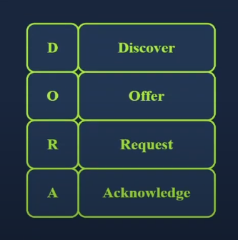

# Networking Essentails

## Mục lục

1. [Task 1: Introduction](#task-1-introduction)
2. [Task 2: DHCP: Give Me My Network Settings](#task-2-dhcp-give-me-my-network-settings)
3. [Task 3: ARP: Bridging Layer 3 Addressing to Layer 2 Addressing](#task-3-arp-bridging-layer-3-addressing-to-layer-2-addressing)
4. [Task 4: ICMP - Troubleshooting Networks](#task-4-icmp---troubleshooting-networks)
5. [Task 5: Routing](#task-5-routing)
6. [Task 6: NAT](#task-6-nat)

## Nội dung

---

# Task 1: Introduction

>Giới thiệu

Bạn đã bao giờ tự hỏi máy tính của mình có thể tự động cấu hình cài đặt mạng như thế nào khi bạn bật nó lên hoặc kết nối vào một mạng mới chưa?
Bạn đã bao giờ muốn biết có bao nhiêu thiết bị và quốc gia mà các gói tin của bạn đi qua trước khi đến đích chưa?
Bạn có tò mò tại sao tất cả các thiết bị trong nhà bạn có thể truy cập Internet dù nhà cung cấp dịch vụ (ISP) chỉ cung cấp một địa chỉ IP duy nhất không?

Nếu bạn muốn biết câu trả lời cho những câu hỏi này, trong số nhiều câu hỏi khác, thì căn phòng học này là dành cho bạn.

Đây là phòng học thứ hai trong loạt bốn phòng học về mạng máy tính:

* [x] **Khái niệm Mạng (Networking Concepts)**
* [x] **Kiến thức Cơ bản về Mạng (phòng học hiện tại)**
* [x] **Giao thức Mạng Cốt lõi**
* [x] **Giao thức Mạng Bảo mật**

---

**Kiến thức cần có trước khi học**

Để đạt hiệu quả tốt nhất khi học phòng này, chúng tôi khuyến nghị bạn nên biết những kiến thức sau:

* Mô hình OSI và các tầng
* Mô hình TCP/IP và các tầng
* Các giao thức Ethernet, IP và TCP

Nói cách khác, bắt đầu phòng học này sau khi học xong phòng **Networking Concepts** là cách tiếp cận được khuyến khích.

---

**Mục tiêu học tập**

Mục tiêu của phòng học này là giúp bạn hiểu về các giao thức và công nghệ tiêu chuẩn khác nhau giúp kết nối mạng lại với nhau, bao gồm:

* Giao thức Cấu hình Host Động (DHCP)
* Giao thức Phân giải Địa chỉ (ARP)
* Chuyển đổi Địa chỉ Mạng (NAT)
* Giao thức Thông báo Kiểm soát Internet (ICMP)
* Ping
* Traceroute

---

# Task 2: DHCP: Give Me My Network Settings

>DHCP – Cấp cho tôi các thiết lập mạng

Bạn đến quán cà phê yêu thích, gọi món đồ uống nóng yêu thích, và mở laptop của mình. Laptop của bạn kết nối với WiFi của quán và tự động cấu hình mạng, nhờ vậy bạn có thể bắt đầu làm việc trên một phòng học mới của TryHackMe. Bạn không nhập một địa chỉ IP nào, nhưng thiết bị của bạn vẫn được thiết lập sẵn sàng. Hãy xem điều gì đã xảy ra nhé.

---

Bất cứ khi nào chúng ta muốn truy cập một mạng, ít nhất chúng ta cần cấu hình các thông số sau:

* Địa chỉ IP cùng với subnet mask (mặt nạ mạng con)
* Router (hoặc gateway – cổng mặc định)
* Máy chủ DNS

---

Bất cứ khi nào chúng ta kết nối thiết bị vào một mạng mới, các cấu hình trên phải được đặt theo mạng mới đó. Việc cấu hình thủ công những thiết lập này là một lựa chọn tốt, đặc biệt đối với các máy chủ. Các máy chủ không được kỳ vọng sẽ chuyển đổi mạng – bạn không mang theo domain controller của mình và kết nối nó vào WiFi của quán cà phê. Hơn nữa, các thiết bị khác cần kết nối đến các máy chủ đó và mong đợi sẽ tìm thấy chúng tại địa chỉ IP cụ thể.

---

Việc có một cách tự động để cấu hình thiết bị kết nối mạng mang lại nhiều lợi ích. Thứ nhất, nó giúp chúng ta khỏi phải cấu hình mạng thủ công – điều này đặc biệt quan trọng đối với thiết bị di động. Thứ hai, nó giúp tránh các xung đột địa chỉ, tức là khi hai thiết bị được cấu hình với cùng một địa chỉ IP. Xung đột địa chỉ IP sẽ ngăn các thiết bị liên quan sử dụng tài nguyên mạng – điều này áp dụng cho cả tài nguyên nội bộ lẫn Internet.

Giải pháp nằm ở việc sử dụng **Giao thức Cấu hình Host Động (DHCP)**. DHCP là một giao thức hoạt động ở tầng ứng dụng, dựa trên **UDP**. Máy chủ DHCP lắng nghe tại **cổng UDP 67**, và máy khách gửi dữ liệu từ **cổng UDP 68**. Điện thoại và laptop của bạn được cấu hình để sử dụng **DHCP** theo mặc định.



---

**DHCP** gồm bốn bước: Khám phá, Đề nghị, Yêu cầu và Xác nhận (viết tắt là **DORA**):

1. **DHCP Discover (Khám phá DHCP)**: Máy khách (client) phát đi một thông điệp **DHCPDISCOVER** để tìm kiếm máy chủ DHCP cục bộ nếu có.

2. **DHCP Offer (Đề nghị DHCP)**: Máy chủ phản hồi bằng một thông điệp **DHCPOFFER** với một địa chỉ IP sẵn có mà máy khách có thể chấp nhận.

3. **DHCP Request (Yêu cầu DHCP)**: Máy khách phản hồi bằng một thông điệp **DHCPREQUEST** để biểu thị rằng nó đã chấp nhận địa chỉ IP được đề nghị.

4. **DHCP Acknowledge (Xác nhận DHCP)**: Máy chủ phản hồi bằng một thông điệp **DHCPACK** để xác nhận rằng địa chỉ IP được đề nghị giờ đây đã được gán cho máy khách đó.


---

Đoạn bắt gói tin dưới đây minh họa bốn bước đã nêu phía trên. Trong ví dụ này, máy khách nhận được địa chỉ **192.168.66.133**.

```bash
user@TryHackMe$ tshark -r DHCP-G5000.pcap -n
    1   0.000000      0.0.0.0 → 255.255.255.255 DHCP 342 DHCP Discover - Transaction ID 0xfb92d53f
    2   0.013904 192.168.66.1 → 192.168.66.133 DHCP 376 DHCP Offer    - Transaction ID 0xfb92d53f
    3   4.115318      0.0.0.0 → 255.255.255.255 DHCP 342 DHCP Request  - Transaction ID 0xfb92d53f
    4   4.228117 192.168.66.1 → 192.168.66.133 DHCP 376 DHCP ACK      - Transaction ID 0xfb92d53f
```

Trong quá trình trao đổi gói tin **DHCP**, ta có thể ghi nhận như sau:

* Máy khách bắt đầu mà không có bất kỳ cấu hình IP nào. Nó chỉ có địa chỉ MAC. Trong gói tin đầu tiên và thứ ba, **DHCP Discover** và **DHCP Request**, máy khách đang tìm kiếm một máy chủ DHCP nên vẫn chưa có cấu hình IP và chưa sử dụng địa chỉ IP được cấp từ máy chủ DHCP. Do đó, nó gửi các gói tin từ địa chỉ IP **0.0.0.0** tới địa chỉ IP quảng bá **255.255.255.255**.

* Ở lớp liên kết (link layer), trong gói tin đầu tiên và thứ ba, máy khách gửi đến địa chỉ MAC quảng bá **ff\:ff\:ff\:ff\:ff\:ff** (không hiển thị trong kết quả đầu ra bên trên). Máy chủ DHCP cung cấp một địa chỉ IP cùng với cấu hình mạng trong gói **DHCP Offer**. Nó sử dụng địa chỉ MAC đích của máy khách (trong hệ thống ví dụ này, nó dùng địa chỉ IP được đề xuất).

Kết thúc quá trình **DHCP**, thiết bị của chúng ta sẽ nhận được tất cả cấu hình cần thiết để truy cập mạng hoặc thậm chí là Internet. Cụ thể, ta mong đợi máy chủ DHCP cung cấp:

* Địa chỉ IP đã được cấp phát để truy cập tài nguyên mạng
* Cổng mặc định (gateway) để định tuyến các gói tin ra khỏi mạng nội bộ
* Máy chủ **DNS** để phân giải tên miền (sẽ được nói thêm sau)

---

### **Trả lời các câu hỏi dưới đây**

**DHCP sử dụng bao nhiêu bước để cung cấp cấu hình mạng?**
**Trả lời:** 4

**Địa chỉ IP đích mà máy khách sử dụng khi gửi một gói tin DHCP Discover là gì?**
**Trả lời:** 255.255.255.255

**Địa chỉ IP nguồn mà máy khách sử dụng khi cố gắng lấy cấu hình mạng IP thông qua DHCP là gì?**
**Trả lời:** 0.0.0.0

---

# Task 3: ARP: Bridging Layer 3 Addressing to Layer 2 Addressing

>ARP – Cầu nối giữa địa chỉ tầng 3 và tầng 2

Chúng ta đã đề cập trong phần *Khái niệm Mạng* rằng khi hai thiết bị giao tiếp qua mạng, một gói IP sẽ được đóng gói bên trong khung tầng liên kết dữ liệu khi nó di chuyển qua tầng 2.
Hãy nhớ rằng hai lớp liên kết dữ liệu phổ biến nhất là Ethernet (IEEE 802.3) và WiFi (IEEE 802.11). Bất cứ khi nào một thiết bị cần giao tiếp với thiết bị khác trên cùng một mạng Ethernet hoặc WiFi, nó phải gửi gói IP bên trong khung dữ liệu tầng liên kết.
Mặc dù thiết bị biết địa chỉ IP của thiết bị đích, nó cần tra cứu địa chỉ MAC của thiết bị đó để tạo ra tiêu đề tầng liên kết phù hợp.

Như bạn đã biết, địa chỉ MAC là một chuỗi 48 bit thường được biểu diễn ở dạng thập lục phân; ví dụ:
`7C:DF:A1:D3:8C:5C` và `44:DF:65:D8:FE:6C` là hai địa chỉ MAC trên mạng của tôi.

Tuy nhiên, các thiết bị trong cùng một mạng Ethernet không cần phải biết địa chỉ MAC của nhau mọi lúc; chúng chỉ cần biết trong quá trình giao tiếp. Mọi thứ xoay quanh địa chỉ IP.
Xem ví dụ sau: bạn kết nối thiết bị vào một mạng, và nếu mạng có máy chủ DHCP, thiết bị của bạn sẽ được cấu hình tự động để sử dụng một gateway (bộ định tuyến) và máy chủ DNS cụ thể.
Do đó, thiết bị của bạn biết địa chỉ IP của máy chủ DNS để phân giải tên miền; hơn nữa, nó biết địa chỉ IP của router khi cần gửi gói ra Internet. Trong toàn bộ quá trình này, không một địa chỉ MAC nào được tiết lộ.
Tuy nhiên, hai thiết bị trong cùng một mạng Ethernet không thể giao tiếp nếu không biết địa chỉ MAC của nhau.

**Gợi nhắc:** Trong ảnh chụp màn hình bên dưới, chúng ta thấy một gói IP nằm trong khung Ethernet. Tiêu đề của khung Ethernet chứa:

* Địa chỉ MAC đích
* Địa chỉ MAC nguồn
* Loại (trong trường hợp này là IPv4)


---

Giao thức phân giải địa chỉ (ARP - Address Resolution Protocol) cho phép xác định địa chỉ MAC của thiết bị khác trên mạng Ethernet.
Trong ví dụ bên dưới, một máy có địa chỉ IP `192.168.66.89` muốn giao tiếp với hệ thống khác có địa chỉ IP `192.168.66.1`.
Nó gửi một gói ARP Request để hỏi thiết bị có IP `192.168.66.1` phản hồi. Gói ARP Request này được gửi từ địa chỉ MAC của thiết bị gửi đến địa chỉ MAC quảng bá `ff:ff:ff:ff:ff:ff` (như thể hiện trong gói đầu tiên).
Gói ARP Reply xuất hiện ngay sau đó, và thiết bị có IP `192.168.66.1` đã phản hồi với địa chỉ MAC của mình.
Từ thời điểm này, hai thiết bị có thể trao đổi các khung dữ liệu ở tầng liên kết.

```bash
user@TryHackMe$ tshark -r arp.pcapng -Nn
    1 0.000000000 cc:5e:f8:02:21:a7 → ff:ff:ff:ff:ff:ff ARP 42 Who has 192.168.66.1? Tell 192.168.66.89
    2 0.003566632 44:df:65:d8:fe:6c → cc:5e:f8:02:21:a7 ARP 42 192.168.66.1 is at 44:df:65:d8:fe:6c
```

**Terminal (đầu ra lệnh tshark):**

```bash
tshark -r arp.pcapng -Nn
```

Kết quả đầu ra:

* Gói 1: `ff:ff:ff:ff:ff:ff` ← ai là `192.168.66.1`? Báo cho `192.168.66.89`
* Gói 2: `192.168.66.1` là `44:df:65:d8:fe:6c`

---

Nếu chúng ta dùng công cụ `tcpdump`, các gói sẽ được hiển thị khác đi.
Nó sử dụng các thuật ngữ **ARP Request** và **ARP Reply**.
Ví dụ dưới đây hiển thị kết quả đầu ra từ `tcpdump`:

```bash
user@TryHackMe$ tcpdump -r arp.pcapng -n -v
    17:23:44.506615 ARP, Ethernet (len 6), IPv4 (len 4), Request who-has 192.168.66.1 tell 192.168.66.89, length 28
    17:23:44.510182 ARP, Ethernet (len 6), IPv4 (len 4), Reply 192.168.66.1 is-at 44:df:65:d8:fe:6c, length 28
```

```bash
tcpdump -r arp.pcapng -n -v
```

* Gói 1: Yêu cầu: ai có IP `192.168.66.1`, báo cho `192.168.66.89`, độ dài 28
* Gói 2: Phản hồi: `192.168.66.1` là `44:df:65:d8:fe:6c`, độ dài 28

* **tcpdump**: Lệnh dùng để chạy tcpdump, một công cụ được sử dụng để thu thập hoặc phân tích lưu lượng mạng.
* **-r arp.pcapng**: Tuỳ chọn **-r** chỉ định tệp thu thập gói tin (**arp.pcapng**) để đọc dữ liệu từ đó.
* **-n**: Tương tự như trong TShark, tuỳ chọn **-n** vô hiệu hoá việc tra cứu DNS, ngăn không cho địa chỉ IP được chuyển thành tên miền.
* **-v**: Tuỳ chọn này kích hoạt chế độ **verbose** (chi tiết), tức là hiển thị kết quả chi tiết hơn. Nó sẽ hiển thị thêm thông tin về các gói tin như kích thước gói, và thông tin chi tiết về giao thức.

Một gói ARP Request hoặc ARP Reply không được đóng gói bên trong UDP hay thậm chí là gói IP;
nó được đóng gói trực tiếp trong khung Ethernet. Gói ARP Reply dưới đây minh họa điều đó.


---

### **Quy trình ARP:**

* **ARP Request**: Thiết bị gửi một thông điệp quảng bá (broadcast) để hỏi địa chỉ MAC tương ứng với địa chỉ IP đã biết.
* **ARP Reply**: Thiết bị có địa chỉ IP đó sẽ phản hồi với địa chỉ MAC của nó (DHCP).

---

**Trả lời các câu hỏi bên dưới**

**Hỏi:** Địa chỉ MAC đích được sử dụng trong một ARP Request là gì?

**Trả lời:** ff\:ff\:ff\:ff\:ff\:ff

**Hỏi:** Trong ví dụ ở trên, địa chỉ MAC của **192.168.66.1** là gì?

**Trả lời:** 44\:df:65\:d8\:fe:6c


---

# Task 4: ICMP - Troubleshooting Networks

>ICMP - Khắc phục sự cố mạng

**Internet Control Message Protocol (ICMP)** chủ yếu được sử dụng để chẩn đoán mạng và báo lỗi. Hai lệnh phổ biến dựa trên ICMP rất hữu ích trong việc khắc phục sự cố mạng và đảm bảo an ninh mạng. Các lệnh đó là:

* **`ping`**: Lệnh này sử dụng ICMP để kiểm tra khả năng kết nối tới hệ thống đích và đo thời gian khứ hồi (RTT). Nói cách khác, nó có thể được sử dụng để kiểm tra xem hệ thống đích có đang hoạt động và có thể phản hồi hệ thống của chúng ta hay không.

* **`traceroute`**: Lệnh này được gọi là `traceroute` trên hệ điều hành Linux và UNIX-like, và là `tracert` trên hệ điều hành MS Windows. Nó sử dụng ICMP để phát hiện đường đi từ máy của bạn đến hệ thống đích.

---

### **Ping**

Có thể bạn chưa từng chơi bóng bàn (ping-pong), nhưng nhờ có ICMP, bạn có thể “chơi” nó với máy tính!
Lệnh **`ping`** sẽ gửi một ICMP Echo Request (ICMP Type **8**). Ảnh chụp màn hình bên dưới sẽ hiển thị thông điệp ICMP nằm bên trong một gói IP.


- Máy tính ở đầu nhận sẽ phản hồi bằng ICMP Echo Reply (ICMP Loại 0).


Nhiều yếu tố có thể khiến chúng ta không nhận được phản hồi. Bên cạnh khả năng hệ thống đích đang ngoại tuyến hoặc đã tắt, một tường lửa (firewall) dọc theo tuyến đường có thể chặn các gói tin cần thiết khiến lệnh **`ping`** không hoạt động.

Trong ví dụ bên dưới, chúng tôi đã sử dụng **`-c 4`** để yêu cầu lệnh **`ping`** dừng lại sau khi gửi bốn gói tin.

```bash
user@TryHackMe$ ping 192.168.11.1 -c 4
PING 192.168.11.1 (192.168.11.1) 56(84) bytes of data.
64 bytes from 192.168.11.1: icmp_seq=1 ttl=63 time=11.2 ms
64 bytes from 192.168.11.1: icmp_seq=2 ttl=63 time=3.81 ms
64 bytes from 192.168.11.1: icmp_seq=3 ttl=63 time=3.99 ms
64 bytes from 192.168.11.1: icmp_seq=4 ttl=63 time=23.4 ms
--- 192.168.11.1 ping statistics ---
4 packets transmitted, 4 received, 0% packet loss, time 3003ms
rtt min/avg/max/mdev = 3.805/10.596/23.366/7.956 ms
```

* **ping**: Lệnh gửi một ICMP Echo Request để kiểm tra khả năng kết nối mạng.

* **192.168.11.1**: Địa chỉ IP đích của thiết bị mà bạn đang cố gắng kết nối đến.

* **-c 4**: Tùy chọn **-c** chỉ định số lượng yêu cầu ping cần gửi. Trong trường hợp này, nó sẽ gửi 4 gói tin và dừng lại.


---

### Traceroute

Làm thế nào để chúng ta có thể khiến mọi router giữa hệ thống của mình và hệ thống đích tiết lộ thông tin?

Giao thức Internet có một trường gọi là Time-to-Live (TTL), chỉ ra số lượng tối đa router mà một gói tin có thể đi qua trước khi bị loại bỏ. Router sẽ giảm giá trị TTL của gói tin đi 1 trước khi chuyển tiếp nó. Khi TTL giảm xuống 0, router sẽ loại bỏ gói tin và gửi lại một thông báo ICMP Time Exceeded (ICMP Type **11**). (Trong ngữ cảnh này, “thời gian” được đo bằng số lượng router, không phải giây.)

Kết quả đầu ra trong terminal bên dưới cho thấy kết quả khi chạy lệnh **traceroute** để phát hiện các router giữa hệ thống của chúng ta và **example.com**. Một số router không phản hồi; nói cách khác, chúng sẽ loại bỏ gói tin mà không gửi bất kỳ thông báo ICMP nào. Các router thuộc về nhà cung cấp dịch vụ Internet (ISP) của chúng ta có thể phản hồi, tiết lộ địa chỉ IP riêng của họ. Thậm chí một số router phản hồi và hiển thị địa chỉ IP công cộng của họ, điều này cho phép chúng ta tra cứu tên miền và vị trí địa lý của họ. Cuối cùng, luôn có khả năng rằng một thông báo ICMP Time Exceeded bị chặn và không bao giờ đến được chúng ta.


```bash
user@TryHackMe$ traceroute example.com
traceroute to example.com (93.184.215.14), 30 hops max, 60 byte packets
 1  _gateway (192.168.66.1)  4.414 ms  4.342 ms  4.320 ms
 2  192.168.11.1 (192.168.11.1)  5.849 ms  5.830 ms  5.811 ms
 3  100.104.0.1 (100.104.0.1)  11.130 ms  11.111 ms  11.093 ms
 4  10.149.1.45 (10.149.1.45)  6.156 ms  6.138 ms  6.120 ms
 5  * * *
 6  * * *
 7  * * *
 8  172.16.48.1 (172.16.48.1)  5.667 ms  8.165 ms  6.861 ms
 9  ae81.edge4.Marseille1.Level3.net (212.73.201.45)  50.811 ms  52.857 ms 213.242.116.233 (213.242.116.233)  52.798 ms
10  NTT-level3-Marseille1.Level3.net (4.68.68.150)  93.351 ms  79.897 ms  79.804 ms
11  ae-9.r20.parsfr04.fr.bb.gin.ntt.net (129.250.3.38)  62.935 ms  62.908 ms  64.313 ms
12  ae-14.r21.nwrknj03.us.bb.gin.ntt.net (129.250.4.194)  141.816 ms  141.782 ms  141.757 ms
13  ae-1.a02.nycmny17.us.bb.gin.ntt.net (129.250.3.17)  145.786 ms ae-1.a03.nycmny17.us.bb.gin.ntt.net (129.250.3.128)  141.701 ms  147.586 ms
14  ce-0-3-0.a02.nycmny17.us.ce.gin.ntt.net (128.241.1.14)  148.692 ms ce-3-3-0.a03.nycmny17.us.ce.gin.ntt.net (128.241.1.90)  141.615 ms ce-0-3-0.a02.nycmny17.us.ce.gin.ntt.net (128.241.1.14)  148.168 ms
15  ae-66.core1.nyd.edgecastcdn.net (152.195.69.133)  141.100 ms ae-65.core1.nyd.edgecastcdn.net (152.195.68.133)  140.360 ms ae-66.core1.nyd.edgecastcdn.net (152.195.69.133)  140.638 ms
16  93.184.215.14 (93.184.215.14)  140.574 ms  140.543 ms  140.514 ms
17  93.184.215.14 (93.184.215.14)  140.488 ms  139.397 ms  141.854 ms
```

---

### Trả lời các câu hỏi dưới đây

**Hỏi:** Dựa trên các hình ảnh ví dụ ở trên, có bao nhiêu byte được gửi trong yêu cầu echo (ping)?

**Trả lời:** 40

**Hỏi:** Trường nào trong tiêu đề IP mà lệnh `traceroute` yêu cầu phải trở về giá trị bằng không?

**Trả lời:** TTL

---

# Task 5: Routing

>Định tuyến (Routing)

Hãy xem sơ đồ mạng được hiển thị bên dưới. Nó chỉ có ba mạng; tuy nhiên, làm cách nào Internet có thể xác định cách chuyển một gói tin từ Mạng 1 đến Mạng 2 hoặc Mạng 3?
Mặc dù đây là một sơ đồ quá đơn giản hóa, chúng ta vẫn cần một số thuật toán để xác định cách kết nối Mạng 1 với Mạng 2 và Mạng 3, và ngược lại.


Hãy cùng xem xét một sơ đồ chi tiết hơn. Internet bao gồm hàng triệu bộ định tuyến (router) và hàng tỷ thiết bị. Mạng dưới đây chỉ là một tập con rất nhỏ của Internet. Người dùng di động có thể truy cập máy chủ web; tuy nhiên, để điều này xảy ra, mỗi bộ định tuyến trên đường truyền phải gửi các gói dữ liệu thông qua liên kết thích hợp.
Rõ ràng, có nhiều hơn một đường đi (hay còn gọi là route) kết nối người dùng di động với máy chủ web. Chúng ta cần một thuật toán định tuyến để bộ định tuyến xác định được liên kết nào cần sử dụng.


---

Các thuật toán định tuyến nằm ngoài phạm vi của phòng học này; tuy nhiên, chúng tôi sẽ mô tả ngắn gọn một vài giao thức định tuyến để bạn làm quen với tên gọi của chúng:

* **OSPF (Open Shortest Path First)**: OSPF là một giao thức định tuyến cho phép các router chia sẻ thông tin về cấu trúc liên kết mạng và tính toán các tuyến đường hiệu quả nhất cho việc truyền dữ liệu. Nó làm điều này bằng cách cho phép các router trao đổi cập nhật về trạng thái của các liên kết và mạng mà chúng kết nối. Bằng cách này, mỗi router sẽ có một bản đồ hoàn chỉnh của mạng và có thể xác định tuyến đường tốt nhất đến bất kỳ đích nào.

* **EIGRP (Enhanced Interior Gateway Routing Protocol)**: EIGRP là giao thức định tuyến độc quyền của Cisco kết hợp các khía cạnh của các thuật toán định tuyến khác nhau. Nó cho phép các router chia sẻ thông tin về các mạng mà chúng có thể truy cập và chi phí (như băng thông hoặc độ trễ) liên quan đến các tuyến đó. Các router sau đó sử dụng thông tin này để chọn ra tuyến đường hiệu quả nhất để truyền dữ liệu.

* **BGP (Border Gateway Protocol)**: BGP là giao thức định tuyến chính được sử dụng trên Internet. Nó cho phép các mạng khác nhau (chẳng hạn như của các nhà cung cấp dịch vụ Internet) trao đổi thông tin định tuyến và thiết lập các đường đi để dữ liệu truyền giữa các mạng này. BGP giúp đảm bảo dữ liệu được định tuyến hiệu quả trên toàn Internet, ngay cả khi đi qua nhiều mạng khác nhau.

* **RIP (Routing Information Protocol)**: RIP là một giao thức định tuyến đơn giản, thường được sử dụng trong các mạng nhỏ. Các router chạy RIP chia sẻ thông tin về các mạng mà chúng có thể truy cập và số lượng bước nhảy (router) cần thiết để đến đó. Do đó, mỗi router xây dựng bảng định tuyến dựa trên thông tin này, chọn tuyến đường có số bước nhảy ít nhất đến đích.

---

### **Trả lời các câu hỏi dưới đây**

**Câu hỏi:**
Giao thức định tuyến nào được đề cập trong nhiệm vụ này là giao thức độc quyền của Cisco?

**Trả lời:**

**EIGRP**

---

# Task 6: NAT

Như đã đề cập trong phòng học **Networking Concepts**, chúng ta đã tính được rằng IPv4 có thể hỗ trợ tối đa bốn tỷ thiết bị. Với sự gia tăng số lượng thiết bị kết nối Internet — từ máy tính, điện thoại thông minh đến camera an ninh và máy giặt — rõ ràng không gian địa chỉ IPv4 sẽ nhanh chóng cạn kiệt. Một giải pháp để giải quyết tình trạng cạn kiệt này là **Network Address Translation (NAT)**.

Ý tưởng đằng sau NAT là sử dụng **một địa chỉ IP công cộng** để cung cấp quyền truy cập Internet cho **nhiều địa chỉ IP riêng**. Nói cách khác, nếu bạn kết nối một công ty có 20 máy tính, bạn có thể cung cấp quyền truy cập Internet cho cả 20 máy bằng **một địa chỉ IP công cộng**, thay vì cần tới 20 địa chỉ IP công cộng.
(*Lưu ý: Về mặt kỹ thuật, số lượng địa chỉ IP luôn được biểu diễn dưới dạng lũy thừa của 2. Chính xác hơn, với NAT, bạn cần dự trữ hai địa chỉ IP công cộng thay vì 32. Như vậy, bạn đã tiết kiệm được 30 địa chỉ IP công cộng.*)

Không giống như định tuyến — là cách tự nhiên để truyền gói tin đến máy đích — các bộ định tuyến hỗ trợ NAT phải tìm cách theo dõi các kết nối đang hoạt động. Do đó, router hỗ trợ NAT duy trì một bảng chuyển đổi địa chỉ mạng giữa mạng nội bộ và mạng bên ngoài. Thông thường, mạng nội bộ sử dụng địa chỉ IP riêng, trong khi mạng bên ngoài sẽ sử dụng địa chỉ IP công cộng.

Trong sơ đồ dưới đây, nhiều thiết bị truy cập Internet thông qua một router hỗ trợ NAT. Router duy trì một bảng ánh xạ giữa địa chỉ IP nội bộ và số cổng của nó với địa chỉ IP công cộng và số cổng tương ứng. Ví dụ, máy tính xách tay có thể tạo kết nối với một máy chủ web.
Từ góc nhìn của máy tính, kết nối được khởi tạo từ địa chỉ IP **192.168.0.129** và cổng nguồn **TCP 15401**;
Tuy nhiên, máy chủ web sẽ thấy kết nối này đến từ **212.3.4.5** và cổng **TCP 19273**, như được thể hiện trong bảng chuyển đổi.
Router thực hiện việc chuyển đổi địa chỉ này một cách liền mạch.


---

**Trả lời các câu hỏi dưới đây**

**Trong sơ đồ mạng ở trên, địa chỉ IP công cộng mà điện thoại sẽ sử dụng khi truy cập Internet là gì?**

> **Trả lời:** 212.3.4.5

> **Giả sử rằng router có khả năng xử lý vô hạn, nói một cách xấp xỉ, nó có thể duy trì khoảng bao nhiêu *nghìn* kết nối TCP đồng thời?**

> **Trả lời:** 65

---

**Ghi chú Kết thúc**

Phòng này đã giới thiệu nhiều giao thức mà chúng ta thường xuyên sử dụng trực tiếp hoặc gián tiếp. Chúng ta đã tìm hiểu ICMP, DHCP, ARP, NAT và định tuyến.
Mặc dù chúng ta sử dụng Internet hàng ngày mà không nhận ra phần lớn các từ viết tắt trong phòng này, các giao thức này lại là nền tảng cho một mạng hoạt động hiệu quả.

---

**Trả lời các câu hỏi dưới đây**

**Nhấn vào nút *View Site* để truy cập trang liên quan. Vui lòng làm theo hướng dẫn trên trang để lấy flag.**

> **Trả lời:** THM{computer\_is\_happy}

---


