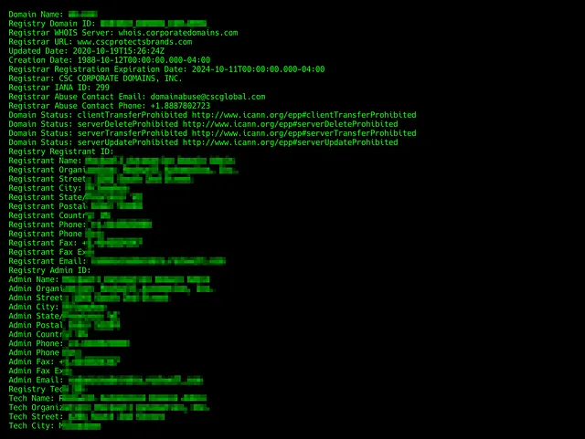
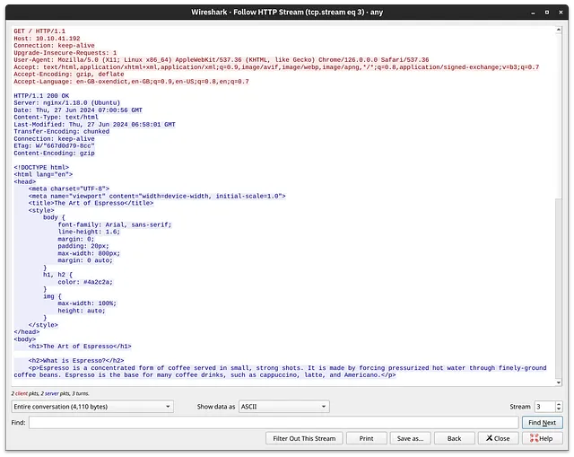
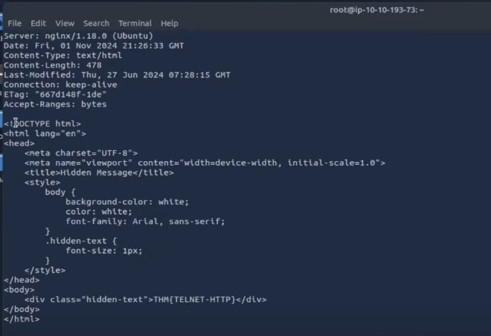
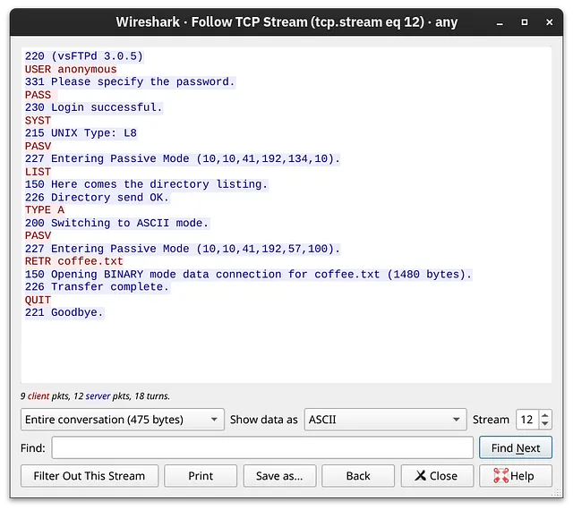
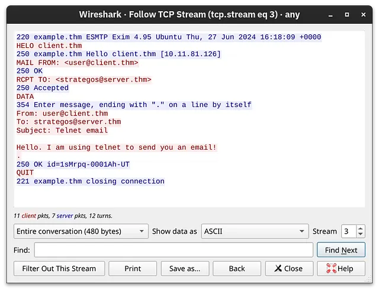
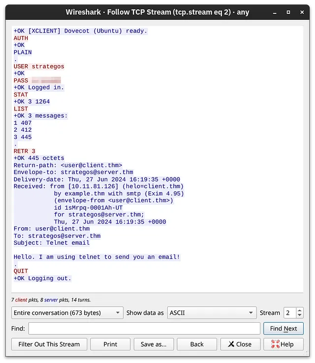
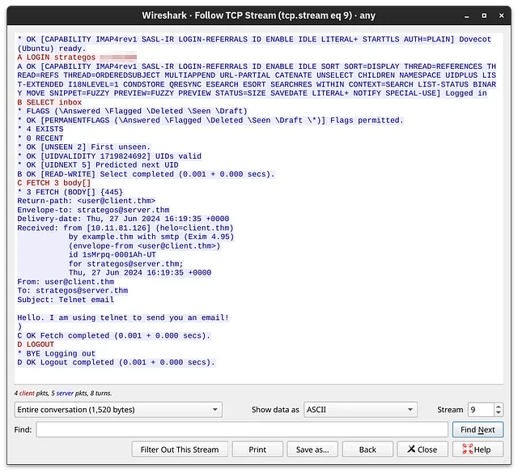

# Networking Core Protocols

## Mục lục

1. [Task 1: Introduction](#task-1-introduction)
2. [Task 2: DNS - Remembering Addresses](#task-2-dns---remembering-addresses)
3. [Task 3: WHOIS](#task-3-whois)
4. [Task 4: HTTP(S) - Accessing the Web](#task-4-https---accessing-the-web)
5. [Task 5: FTP - Transferring Files](#task-5-ftp---transferring-files)
6. [Task 6: SMTP - Sending Email](#task-6-smtp---sending-email)
7. [Task 7: POP3 - Receiving Email](#task-7-pop3---receiving-email)
8. [Task 8: IMAP: Synchronizing Email](#task-8-imap-synchronizing-email)

## Nội dung


---

# Task 1: Introduction

>Giới thiệu

Phòng này là phòng thứ ba trong chuỗi bốn phòng về mạng máy tính:

* [Khái niệm Mạng (Networking Concepts)](/SOC/2_Cyber_Security_101/5_Networking/1_Networking_Concepts.md)
* [Kiến thức Cơ bản về Mạng (Networking Essentials)](/SOC/2_Cyber_Security_101/5_Networking/2_Networking_Essentials.md)
* Giao thức Mạng Cốt lõi (phòng này)
* [Giao thức Mạng Bảo mật (Networking Secure Protocols)]()

---

### **Yêu cầu trước khi học**

Để tận dụng tối đa nội dung của phòng này, chúng tôi khuyến nghị bạn nên biết các kiến thức sau:

* Mô hình OSI ISO và các lớp
* Mô hình TCP/IP và các lớp
* Các giao thức Ethernet, IP và TCP

Nói cách khác, bắt đầu học phòng này sau [Networking Concepts](/SOC/2_Cyber_Security_101/5_Networking/1_Networking_Concepts.md) là cách tiếp cận được khuyến khích.

---

### **Mục tiêu Học tập**

Khi bạn hoàn thành phòng này, bạn sẽ nắm được các giao thức sau:

* WHOIS
* DNS
* HTTP và FTP
* SMTP, POP3 và IMAP

---

# Task 2: DNS - Remembering Addresses

>DNS: Ghi nhớ địa chỉ

Bạn có nhớ địa chỉ IP của các trang web yêu thích của mình không? Trừ khi đó là địa chỉ IP riêng của thiết bị cục bộ, thì không ai cần phải nhớ địa chỉ IP cả. Điều này một phần là nhờ vào Hệ thống tên miền (DNS), giúp ánh xạ đúng tên miền tới địa chỉ IP.

**DNS** hoạt động ở tầng Ứng dụng, tức là Tầng 7 của mô hình OSI. Giao thức DNS mặc định sử dụng cổng UDP 53 và dùng cổng TCP 53 khi cần thiết. Có nhiều loại bản ghi DNS, tuy nhiên trong bài này chúng ta sẽ tập trung vào 4 loại sau:

* **A record**: Bản ghi A (Address) ánh xạ một tên máy chủ (hostname) tới một hoặc nhiều địa chỉ IPv4. Ví dụ, bạn có thể thiết lập `example.com` trỏ đến địa chỉ `172.17.2.172`.

* **AAAA Record**: Tương tự như bản ghi A, nhưng dành cho IPv6. Ghi nhớ: nó là "AAAA" (bốn chữ A), không nên nhầm với kích cỡ pin AA hay AAA. Ngoài ra, AAA còn là viết tắt của Authentication, Authorization, and Accounting, không liên quan đến DNS.

* **CNAME Record**: Bản ghi CNAME (Canonical Name) ánh xạ một tên miền tới một tên miền khác. Ví dụ, `www.example.com` có thể ánh xạ tới `example.com` hoặc thậm chí `example.org`.

* **MX Record**: Bản ghi MX (Mail Exchange) xác định máy chủ thư chịu trách nhiệm xử lý email của tên miền.

Nói cách khác, khi bạn gõ `example.com` vào trình duyệt, trình duyệt sẽ cố gắng phân giải tên miền đó bằng cách truy vấn máy chủ DNS để lấy bản ghi A. Tuy nhiên, khi bạn gửi email tới `test@example.com`, máy chủ thư sẽ truy vấn bản ghi MX từ máy chủ DNS.

Nếu bạn muốn tra địa chỉ IP của một tên miền qua dòng lệnh, bạn có thể dùng công cụ như `nslookup`. Hãy xem ví dụ trong terminal dưới đây khi chúng ta tra `example.com`.

```bash
user@TryHackMe$ nslookup www.example.com
Server:         127.0.0.53
Address:        127.0.0.53#53
Non-authoritative answer:
Name:   www.example.com
Address: 93.184.215.14
Name:   www.example.com
Address: 2606:2800:21f:cb07:6820:80da:af6b:8b2c
```

Truy vấn ở trên đã tạo ra bốn gói tin. Trong cửa sổ dòng lệnh bên dưới, chúng ta có thể thấy rằng gói đầu tiên và gói thứ ba gửi truy vấn DNS cho các bản ghi A và AAAA, tương ứng. Gói thứ hai và gói thứ tư là các phản hồi cho các truy vấn DNS đó.


```bash
user@TryHackMe$ tshark -r dns-query.pcapng -Nn
    1 0.000000000 192.168.66.89 → 192.168.66.1 DNS 86 Standard query 0x2e0f A www.example.com OPT
    2 0.059049584 192.168.66.1 → 192.168.66.89 DNS 102 Standard query response 0x2e0f A www.example.com A 93.184.215.14 OPT
    3 0.059721705 192.168.66.89 → 192.168.66.1 DNS 86 Standard query 0x96e1 AAAA www.example.com OPT
    4 0.101568276 192.168.66.1 → 192.168.66.89 DNS 114 Standard query response 0x96e1 AAAA www.example.com AAAA 2606:2800:21f:cb07:6820:80da:af6b:8b2c OPT
```

* **tshark**: Khởi động TShark, phiên bản dòng lệnh của Wireshark.

* **-r dns-query.pcapng**: Đọc dữ liệu truy vấn DNS từ một tệp (dns-query.pcapng).

* **-n**: Ngăn TShark phân giải địa chỉ IP thành tên miền, giúp tăng tốc quá trình phân tích.

**Ví dụ kết quả đầu ra**: Lệnh này sẽ hiển thị các truy vấn và phản hồi DNS, mô tả chi tiết cách máy khách yêu cầu các bản ghi A và AAAA cho `www.example.com`, và cách máy chủ DNS phản hồi với các địa chỉ IP tương ứng (DNS).


### **Trả lời các câu hỏi bên dưới**

> **Loại bản ghi DNS nào đề cập đến IPv6?**

> **Trả lời:** AAAA

> **Loại bản ghi DNS nào đề cập đến máy chủ email?**

> **Trả lời:** MX

---

# Task 3: WHOIS

Trong nhiệm vụ trước, chúng ta đã tìm hiểu cách một tên miền được phân giải thành địa chỉ IP. Tuy nhiên, để điều đó xảy ra, ai đó cần có quyền để thiết lập các bản ghi A, AAAA và MX, cùng với các bản ghi DNS khác cho tên miền đó. Bất kỳ ai đăng ký tên miền đều có quyền này. Vì vậy, nếu bạn đăng ký example.com, bạn có thể thiết lập bất kỳ bản ghi DNS hợp lệ nào cho example.com.

Bạn có thể đăng ký bất kỳ tên miền khả dụng nào trong một hoặc nhiều năm. Bạn cần trả phí hằng năm và phải cung cấp **thông tin liên hệ chính xác** với tư cách là người đăng ký. Thông tin này là một phần của dữ liệu có sẵn thông qua bản ghi WHOIS và được công khai. (Mặc dù được viết bằng chữ in hoa, WHOIS không phải là một từ viết tắt; nó được phát âm như “who is”). Tuy nhiên, đừng lo nếu bạn muốn đăng ký một tên miền mà không tiết lộ thông tin liên hệ của mình; bạn có thể sử dụng một trong các dịch vụ bảo mật giúp ẩn toàn bộ thông tin của bạn khỏi bản ghi WHOIS.

Bạn có thể tra cứu bản ghi WHOIS của bất kỳ tên miền đã đăng ký nào bằng một trong các dịch vụ trực tuyến hoặc bằng công cụ dòng lệnh `whois`, có sẵn trên các hệ thống Linux, trong số các hệ thống khác. Như mong đợi, một bản ghi WHOIS cung cấp thông tin về thực thể đã đăng ký tên miền, bao gồm tên, số điện thoại, email và địa chỉ. Trong ảnh chụp màn hình bên dưới, bạn có thể thấy khi nào bản ghi được tạo lần đầu và lần cuối được cập nhật. Ngoài ra, bạn còn có thể tìm thấy tên, địa chỉ, số điện thoại và email của người đăng ký.



---

Trong đầu ra của thiết bị đầu cuối bên dưới, chúng tôi đã sử dụng lệnh whois để tra cứu tên miền có bản ghi WHOIS được bảo vệ bởi chế độ bảo vệ quyền riêng tư.

```bash
user@TryHackMe$ whois [REDACTED].com
[...]
Domain Name: [REDACTED].COM
Registry Domain ID: [REDACTED]
Registrar WHOIS Server: whois.godaddy.com
Registrar URL: https://www.godaddy.com
Updated Date: 2017-07-05T16:02:43Z
Creation Date: 1993-04-02T00:00:00Z
Registrar Registration Expiration Date: 2026-10-20T14:56:17Z
Registrar: GoDaddy.com, LLC
Registrar IANA ID: 146
Registrar Abuse Contact Email: abuse@godaddy.com
Registrar Abuse Contact Phone: +1.4806242505
[...]
Registrant Name: Registration Private
Registrant Organization: Domains By Proxy, LLC
Registrant Street: DomainsByProxy.com
[...]

```

Thao tác này sẽ hiển thị thông tin như thông tin liên hệ của người đăng ký, ngày tạo tên miền và ngày hết hạn.


### **Trả lời các câu hỏi dưới đây**

**Hỏi:** Hồ sơ của `x.com` được tạo vào thời điểm nào? Vui lòng cung cấp câu trả lời theo định dạng YYYY-MM-DD.
**Trả lời:** 1993-04-02

**Hỏi:** Hồ sơ của `twitter.com` được tạo vào thời điểm nào? Vui lòng cung cấp câu trả lời theo định dạng YYYY-MM-DD.
**Trả lời:** 2000-01-21

---
# Task 4: HTTP(S) - Accessing the Web

>HTTP(S): Truy cập Web

Khi bạn mở trình duyệt, bạn chủ yếu sử dụng các giao thức HTTP và HTTPS. HTTP là viết tắt của **Hypertext Transfer Protocol**, còn chữ S trong HTTPS là viết tắt của **Secure** (bảo mật). Giao thức này dựa trên **TCP** và xác định cách trình duyệt web của bạn giao tiếp với các máy chủ web.

Một số lệnh hoặc phương thức mà trình duyệt web của bạn thường gửi đến máy chủ web là:

* **GET**: truy xuất dữ liệu từ máy chủ, như tệp HTML hoặc hình ảnh.
* **POST**: cho phép chúng ta gửi dữ liệu mới lên máy chủ, chẳng hạn như gửi biểu mẫu hoặc tải tệp lên.
* **PUT**: được sử dụng để tạo tài nguyên mới trên máy chủ, đồng thời cập nhật hoặc ghi đè thông tin hiện có.
* **DELETE**: như tên gọi, được sử dụng để xóa tệp hoặc tài nguyên cụ thể trên máy chủ.

HTTP và HTTPS thường sử dụng các cổng **TCP 80 và 443**, và ít phổ biến hơn là các cổng như **8080** và **8443**.

Trong ví dụ sau, chúng ta sử dụng trình duyệt Firefox để truy cập máy chủ web tại địa chỉ **10.10.168.93**. Trình duyệt của chúng ta tải trang web và hiển thị hoàn chỉnh; tuy nhiên, điều chúng ta quan tâm là **chuyện gì diễn ra phía sau hậu trường**.




Khi bạn còn nhớ từ phần **Networking Concepts**, chúng ta đã sử dụng client **telnet** để kết nối tới máy chủ web đang chạy trên **MACHINE\_IP** tại cổng **80**. Chúng ta cần gửi một vài dòng lệnh như:

```
GET / HTTP/1.1  
Host: anything
```

để lấy trang mà chúng ta muốn. (Trên một số máy chủ, bạn có thể lấy được file mà không cần gửi dòng `Host: anything`.) Bạn có thể sử dụng phương pháp này để truy cập bất kỳ trang nào chứ không chỉ mặc định là `/`.
Ví dụ: để lấy file `file.html`, bạn cần gửi:

```
GET /file.html HTTP/1.1
```

(tùy máy chủ, `GET /file.html` cũng có thể hoạt động).
Cách tiếp cận này rất hiệu quả trong việc gỡ lỗi vì bạn sẽ “nói chuyện trực tiếp” bằng HTTP với máy chủ.

---

### Trả lời các câu hỏi bên dưới

> **Sử dụng `telnet` để truy cập file `flag.html` trên `MACHINE_IP`. Cờ ẩn là gì?**

> **Trả lời:** `THM{TELNET-HTTP}`

---

Các lệnh được sử dụng:

```bash
telnet 10.10.60.35 80
GET /flag.html HTTP/1.1
Host: anything
```

Hoặc:

```bash
wget http://10.10.60.35/flag.html
cat flag.html
```

Và:

```bash
curl http://10.10.60.35/flag.html -o flag.html
cat flag.html
```



---

# Task 5: FTP - Transferring Files

>FTP: Chuyển tệp

**FTP (File Transfer Protocol)** được thiết kế để chuyển các tệp giữa máy khách và máy chủ. Nó nhanh hơn HTTP đối với các tệp lớn và thường sử dụng **cổng TCP 21**.

---

### **Các lệnh ví dụ:**

* **USER**: Cung cấp tên đăng nhập để đăng nhập.
* **PASS**: Cung cấp mật khẩu.
* **RETR**: Tải một tệp từ máy chủ về.
* **STOR**: Tải một tệp lên máy chủ.

Máy chủ FTP mặc định lắng nghe trên cổng TCP 21; việc truyền dữ liệu được thực hiện qua một kết nối khác giữa máy khách và máy chủ.

---

Trong cửa sổ dòng lệnh dưới đây, chúng tôi đã thực thi lệnh `ftp MACHINE_IP` để kết nối tới máy chủ FTP từ xa bằng công cụ dòng lệnh `ftp`. Sau đó, chúng tôi thực hiện các bước sau:

* Chúng tôi sử dụng tên đăng nhập **anonymous** để đăng nhập
* Không cần cung cấp mật khẩu nào
* Gõ lệnh `ls` để hiển thị danh sách các tệp có thể tải về
* Gõ `type ascii` để chuyển sang chế độ ASCII (vì đây là tệp văn bản)
* Gõ `get coffee.txt` để tải về tệp mong muốn

```bash
user@TryHackMe$ ftp MACHINE_IP
Connected to MACHINE_IP (MACHINE_IP).
220 (vsFTPd 3.0.5)
Name (MACHINE_IP:strategos): anonymous
331 Please specify the password.
Password:
230 Login successful.
Remote system type is UNIX.
Using binary mode to transfer files.
ftp> ls
227 Entering Passive Mode (10,10,41,192,134,10).
150 Here comes the directory listing.
-rw-r--r--    1 0        0            1480 Jun 27 08:03 coffee.txt
-rw-r--r--    1 0        0              14 Jun 27 08:04 flag.txt
-rw-r--r--    1 0        0            1595 Jun 27 08:05 tea.txt
226 Directory send OK.
ftp> type ascii
200 Switching to ASCII mode.
ftp> get coffee.txt
local: coffee.txt remote: coffee.txt
227 Entering Passive Mode (10,10,41,192,57,100).
150 Opening BINARY mode data connection for coffee.txt (1480 bytes).
WARNING! 47 bare linefeeds received in ASCII mode
File may not have transferred correctly.
226 Transfer complete.
1480 bytes received in 8e-05 secs (18500.00 Kbytes/sec)
ftp> quit
221 Goodbye.
```

---

Chúng tôi đã sử dụng Wireshark để kiểm tra kỹ hơn các thông điệp trao đổi.
Các thông điệp từ phía **máy khách** được hiển thị **màu đỏ**, trong khi phản hồi từ **máy chủ** được hiển thị **màu xanh dương**.
Hãy chú ý cách các lệnh khác nhau giữa máy khách và máy chủ.

Ví dụ, khi bạn gõ lệnh `ls` trên máy khách, máy khách sẽ gửi lệnh `LIST` tới máy chủ.
Một điều cuối cùng cần lưu ý là danh sách thư mục và tệp mà chúng tôi đã tải về được gửi qua **các kết nối riêng biệt** nhau.




**Trả lời các câu hỏi dưới đây**

> **Sử dụng trình khách FTP** (`ftp`) **trên AttackBox, truy cập vào máy chủ FTP tại** `MACHINE_IP` **và lấy tệp** `flag.txt`. *Cờ tìm được là gì?*

**Trả lời:** THM{FAST-FTP}

```bash
root@ip-10-10-101-191:~# ftp 10.10.60.35
Connected to 10.10.60.35.
220 (vsFTPd 3.0.5)
Name (10.10.60.35:root): anonymous
331 Please specify the password.
Password:
230 Login successful.
Remote system type is UNIX.
Using binary mode to transfer files.
ftp> ls
200 PORT command successful. Consider using PASV.
150 Here comes the directory listing.
-rw-r--r--    1 0        0            1480 Jun 27 08:03 coffee.txt
-rw-r--r--    1 0        0              14 Jun 27 08:04 flag.txt
-rw-r--r--    1 0        0            1595 Jun 27 08:05 tea.txt
226 Directory send OK.
ftp> get flag.txt
local: flag.txt remote: flag.txt
200 PORT command successful. Consider using PASV.
150 Opening BINARY mode data connection for flag.txt (14 bytes).
226 Transfer complete.
14 bytes received in 0.00 secs (9.1451 kB/s)
ftp> quit
221 Goodbye.
root@ip-10-10-101-191:~# cat flag.txt
THM{FAST-FTP}
```

# Task 6: SMTP - Sending Email

>SMTP: Gửi Email

SMTP (Simple Mail Transfer Protocol – Giao thức truyền thư đơn giản) được sử dụng để gửi email và thường hoạt động trên **cổng TCP 25**. Nó xác định cách mà ứng dụng email của bạn giao tiếp với máy chủ thư.

---

### **Các lệnh SMTP chính:**

* **HELO/EHLO**: Xác định máy khách với máy chủ.
* **MAIL FROM**: Chỉ định địa chỉ email của người gửi.
* **RCPT TO**: Chỉ định địa chỉ email của người nhận.
* **DATA**: Bắt đầu gửi nội dung email.
* **.** (dấu chấm): Được gửi một mình trên một dòng để chỉ ra kết thúc nội dung thư.
* **QUIT**: Kết thúc phiên làm việc.

Cửa sổ dòng lệnh bên dưới hiển thị một ví dụ về việc gửi email bằng **telnet**. Máy chủ SMTP mặc định lắng nghe trên cổng TCP 25.

```bash
user@TryHackMe$ telnet MACHINE_IP 25
Trying MACHINE_IP...
Connected to MACHINE_IP.
Escape character is '^]'.
220 example.thm ESMTP Exim 4.95 Ubuntu Thu, 27 Jun 2024 16:18:09 +0000
HELO client.thm
250 example.thm Hello client.thm [10.11.81.126]
MAIL FROM: <user@client.thm>
250 OK
RCPT TO: <strategos@server.thm>
250 Accepted
DATA
354 Enter message, ending with "." on a line by itself
From: user@client.thm
To: strategos@server.thm
Subject: Telnet email
Hello. I am using telnet to send you an email!
.
250 OK id=1sMrpq-0001Ah-UT
QUIT
221 example.thm closing connection
Connection closed by foreign host.
```

Rõ ràng, việc gửi email bằng **telnet** khá rườm rà; tuy nhiên, nó giúp bạn hiểu rõ hơn các lệnh mà ứng dụng email của bạn thực thi phía sau hậu trường. Giao diện bắt gói tin của Wireshark hiển thị quá trình trao đổi với các màu sắc: các thông điệp từ phía máy khách được hiển thị màu **đỏ**, trong khi phản hồi từ máy chủ được hiển thị màu **xanh dương**.



---

Bây giờ chúng ta đã tìm hiểu về một số lệnh cơ bản của các giao thức HTTP, FTP và SMTP, bạn nên đã nắm vững cách thức các giao thức được thiết kế và sử dụng. Việc học các giao thức dạng văn bản khác như POP3 và IMAP sẽ trở nên dễ dàng hơn.

**Trả lời các câu hỏi dưới đây**

> **Lệnh SMTP nào cho biết rằng máy khách sẽ bắt đầu gửi nội dung của email?**

> **Trả lời:** DATA

> **Máy khách email gửi gì để báo rằng nội dung email đã được nhập hoàn tất?**

> **Trả lời:** `.` (dấu chấm)

---

# Task 7: POP3 - Receiving Email


**POP3 (Post Office Protocol version 3)** được sử dụng để tải email từ máy chủ thư về thiết bị cục bộ của bạn. Nó thường được dùng khi bạn muốn lấy email và sau đó xóa chúng khỏi máy chủ. POP3 sử dụng **cổng TCP 110**.

### Các lệnh chính của POP3:

* **USER**: Xác định người dùng.
* **PASS**: Cung cấp mật khẩu của người dùng.
* **LIST**: Liệt kê tất cả các email có sẵn cùng với kích thước của chúng.
* **RETR \<số\_thứ\_tự\_email>**: Lấy nội dung email được chỉ định.
* **DELE \<số\_thứ\_tự\_email>**: Đánh dấu một email để xóa.
* **QUIT**: Kết thúc phiên POP3 và áp dụng các thay đổi như xóa email.

---

Trong màn hình terminal bên dưới, chúng ta có thể thấy một phiên POP3 được thực hiện qua telnet. Vì máy chủ POP3 mặc định sử dụng **cổng TCP 110**, nên lệnh để kết nối tới cổng TELNET là:
`telnet MACHINE_IP 110`.
Cuộc trao đổi bên dưới sẽ truy xuất email đã được gửi trong nhiệm vụ trước đó.

```bash
user@TryHackMe$ telnet MACHINE_IP 110
Trying MACHINE_IP...
Connected to MACHINE_IP.
Escape character is '^]'.
+OK [XCLIENT] Dovecot (Ubuntu) ready.
AUTH
+OK
PLAIN
.
USER strategos
+OK
PASS 
+OK Logged in.
STAT
+OK 3 1264
LIST
+OK 3 messages:
1 407
2 412
3 445
.
RETR 3
+OK 445 octets
Return-path: <user@client.thm>
Envelope-to: strategos@server.thm
Delivery-date: Thu, 27 Jun 2024 16:19:35 +0000
Received: from [10.11.81.126] (helo=client.thm)
        by example.thm with smtp (Exim 4.95)
        (envelope-from <user@client.thm>)
        id 1sMrpq-0001Ah-UT
        for strategos@server.thm;
        Thu, 27 Jun 2024 16:19:35 +0000
From: user@client.thm
To: strategos@server.thm
Subject: Telnet email
Hello. I am using telnet to send you an email!
.
QUIT
+OK Logging out.
Connection closed by foreign host.
```


Một người nào đó nếu bắt được các gói tin mạng có thể chặn và xem được lưu lượng trao đổi. Theo các bản ghi lại từ Wireshark trước đó, các lệnh được gửi từ phía máy khách sẽ hiển thị màu đỏ, còn phản hồi từ máy chủ hiển thị màu xanh dương. Điều này cũng cho thấy rõ rằng bất kỳ ai bắt được lưu lượng mạng đều có thể đọc được mật khẩu.




Kết nối đến một máy chủ POP3 yêu cầu xác thực. Sử dụng thông tin đăng nhập sau khi được yêu cầu:

* **Tên người dùng:** linda
* **Mật khẩu:** Pa\$123

---

**Trả lời các câu hỏi dưới đây**

> **Nhìn vào quá trình trao đổi lưu lượng, tên của máy chủ POP3 đang chạy trên máy chủ từ xa là gì?**

> **Trả lời:** Dovecot

> **Sử dụng `telnet` để kết nối đến máy chủ POP3 của `MACHINE_IP`. Cờ (flag) nằm trong tin nhắn thứ tư là gì?**

> **Trả lời:** THM{TELNET\_RETR\_EMAIL}

```bash
root@ip-10-10-101-191:~# telnet 10.10.60.35 110
Trying 10.10.60.35...
Connected to 10.10.60.35.
Escape character is '^]'.
+OK [XCLIENT] Dovecot (Ubuntu) ready.
AUTH
+OK
PLAIN
.
USER linda
+OK
PASS Pa$$123
+OK Logged in.
STAT
+OK 4 2216
LIST
+OK 4 messages:
1 690
2 589
3 483
4 454
.
RETR 4
+OK 454 octets
Return-path: <user@client.thm>
Envelope-to: linda@server.thm
Delivery-date: Thu, 12 Sep 2024 20:12:42 +0000
Received: from [10.11.81.126] (helo=client.thm)
 by example.thm with smtp (Exim 4.95)
 (envelope-from <user@client.thm>)
 id 1soqAj-0007li-39
 for linda@server.thm;
 Thu, 12 Sep 2024 20:12:42 +0000
From: user@client.thm
To: linda@server.thm
Subject: Your Flag

Hello!
Here's your flag:
THM{TELNET_RETR_EMAIL}
Enjoy your journey!
```

---

# Task 8: IMAP: Synchronizing Email

>MAP: Đồng Bộ Email

IMAP (Internet Message Access Protocol) là một giao thức email tiên tiến hơn so với POP3, cho phép bạn **đồng bộ hóa** email của mình trên nhiều thiết bị. Không giống như POP3, IMAP lưu trữ email trên máy chủ, giúp chúng có thể được truy cập từ nhiều vị trí khác nhau. IMAP sử dụng **cổng TCP 143**.

---

### Các lệnh chính của IMAP:

* **LOGIN**: Xác thực người dùng bằng tên đăng nhập và mật khẩu.
* **SELECT \<mailbox>**: Chọn thư mục hộp thư để làm việc.
* **FETCH \<message\_number>**: Truy xuất nội dung của một email cụ thể.
* **MOVE \<sequence\_set> \<mailbox>**: Di chuyển một email đến thư mục khác.
* **LOGOUT**: Kết thúc phiên làm việc IMAP.

---

Vì biết rằng máy chủ IMAP lắng nghe trên cổng TCP 143 theo mặc định, chúng ta sẽ sử dụng **telnet** để kết nối đến cổng 143 của **MACHINE\_IP** và truy xuất tin nhắn mà ta đã gửi trong một bài trước.

```bash
user@TryHackMe$ telnet 10.10.41.192 143
Trying 10.10.41.192...
Connected to 10.10.41.192.
Escape character is '^]'.
* OK [CAPABILITY IMAP4rev1 SASL-IR LOGIN-REFERRALS ID ENABLE IDLE LITERAL+ STARTTLS AUTH=PLAIN] Dovecot (Ubuntu) ready.
A LOGIN strategos
A OK [CAPABILITY IMAP4rev1 SASL-IR LOGIN-REFERRALS ID ENABLE IDLE SORT SORT=DISPLAY THREAD=REFERENCES THREAD=REFS THREAD=ORDEREDSUBJECT MULTIAPPEND URL-PARTIAL CATENATE UNSELECT CHILDREN NAMESPACE UIDPLUS LIST-EXTENDED I18NLEVEL=1 CONDSTORE QRESYNC ESEARCH ESORT SEARCHRES WITHIN CONTEXT=SEARCH LIST-STATUS BINARY MOVE SNIPPET=FUZZY PREVIEW=FUZZY PREVIEW STATUS=SIZE SAVEDATE LITERAL+ NOTIFY SPECIAL-USE] Logged in
B SELECT inbox
* FLAGS (\Answered \Flagged \Deleted \Seen \Draft)
* OK [PERMANENTFLAGS (\Answered \Flagged \Deleted \Seen \Draft \*)] Flags permitted.
* 4 EXISTS
* 0 RECENT
* OK [UNSEEN 2] First unseen.
* OK [UIDVALIDITY 1719824692] UIDs valid
* OK [UIDNEXT 5] Predicted next UID
B OK [READ-WRITE] Select completed (0.001 + 0.000 secs).
C FETCH 3 body[]
* 3 FETCH (BODY[] {445}
Return-path: <user@client.thm>
Envelope-to: strategos@server.thm
Delivery-date: Thu, 27 Jun 2024 16:19:35 +0000
Received: from [10.11.81.126] (helo=client.thm)
        by example.thm with smtp (Exim 4.95)
        (envelope-from <user@client.thm>)
        id 1sMrpq-0001Ah-UT
        for strategos@server.thm;
        Thu, 27 Jun 2024 16:19:35 +0000
From: user@client.thm
To: strategos@server.thm
Subject: Telnet email
Hello. I am using telnet to send you an email!
)
C OK Fetch completed (0.001 + 0.000 secs).
D LOGOUT
* BYE Logging out
D OK Logout completed (0.001 + 0.000 secs).
Connection closed by foreign host.
```

Ảnh chụp màn hình bên dưới hiển thị các thông điệp được trao đổi giữa máy khách và máy chủ như được nhìn thấy từ Wireshark. Máy khách chỉ cần gửi bốn lệnh (hiển thị bằng màu đỏ), trong khi các phản hồi “dài” từ máy chủ được hiển thị bằng màu xanh lam.




**Trả lời các câu hỏi bên dưới**

**Câu Hỏi:** Lệnh IMAP nào dùng để truy xuất email thứ tư?

**Trả lời:** `FETCH 4 body[]`

```bash
root@ip-10-10-101-191:~# telnet 10.10.60.35 143
Trying 10.10.60.35...
Connected to 10.10.60.35.
Escape character is '^]'.
* OK [CAPABILITY IMAP4rev1 SASL-IR LOGIN-REFERRALS ID ENABLE IDLE LITERAL+ STARTTLS AUTH=PLAIN] Dovecot (Ubuntu) ready.
A LOGIN linda Pa$$123
A OK [CAPABILITY IMAP4rev1 SASL-IR LOGIN-REFERRALS ID ENABLE IDLE SORT SORT=DISPLAY THREAD=REFERENCES THREAD=REFS THREAD=ORDEREDSUBJECT MULTIAPPEND URL-PARTIAL CATENATE UNSELECT CHILDREN NAMESPACE UIDPLUS LIST-EXTENDED I18NLEVEL=1 CONDSTORE QRESYNC ESEARCH ESORT SEARCHRES WITHIN CONTEXT=SEARCH LIST-STATUS BINARY MOVE SNIPPET=FUZZY PREVIEW=FUZZY PREVIEW STATUS=SIZE SAVEDATE LITERAL+ NOTIFY SPECIAL-USE] Logged in
B SELECT inbox
* FLAGS (\Answered \Flagged \Deleted \Seen \Draft)
* OK [PERMANENTFLAGS (\Answered \Flagged \Deleted \Seen \Draft \*)] Flags permitted.
* 4 EXISTS
* 0 RECENT
* OK [UIDVALIDITY 1719824692] UIDs valid
* OK [UIDNEXT 9] Predicted next UID
B OK [READ-WRITE] Select completed (0.001 + 0.000 secs).
C FETCH 4 body[]    
* 4 FETCH (BODY[] {454}
Return-path: <user@client.thm>
Envelope-to: linda@server.thm
Delivery-date: Thu, 12 Sep 2024 20:12:42 +0000
Received: from [10.11.81.126] (helo=client.thm)
 by example.thm with smtp (Exim 4.95)
 (envelope-from <user@client.thm>)
 id 1soqAj-0007li-39
 for linda@server.thm;
 Thu, 12 Sep 2024 20:12:42 +0000
From: user@client.thm
To: linda@server.thm
Subject: Your Flag

Hello!
Here's your flag:
THM{TELNET_RETR_EMAIL}
Enjoy your journey!
)
C OK Fetch completed (0.001 + 0.000 secs).
```


---

# Kết luận

Trong phòng học trước, chúng ta đã thảo luận về giao thức **TELNET**; còn phòng học này tập trung vào các giao thức cơ bản khác: **DNS, HTTP, FTP, SMTP, POP3 và IMAP**. Với những giao thức đã được đề cập, giờ đây chúng ta đã hiểu rõ hơn về cách tên miền được phân giải, cách các trang web được phục vụ, và cách email được gửi và nhận. Một mục đích chính khác của phòng học này là giúp bạn có được sự hiểu biết rõ ràng về cách mà một giao thức hoạt động đằng sau các giao diện đồ họa.

Bảng dưới đây tóm tắt các **số hiệu cổng mặc định** của các giao thức mà chúng ta đã học cho đến thời điểm này:

| Giao thức | Giao thức truyền tải | Cổng mặc định |
| --------- | -------------------- | ------------- |
| TELNET    | TCP                  | 23            |
| DNS       | UDP hoặc TCP         | 53            |
| HTTP      | TCP                  | 80            |
| HTTPS     | TCP                  | 443           |
| FTP       | TCP                  | 21            |
| SMTP      | TCP                  | 25            |
| POP3      | TCP                  | 110           |
| IMAP      | TCP                  | 143           |
