# Networking Secure Protocols

## Mục lục

1. [Task 1: Introduction](#task-1-introduction)
2. [Task 2: TLS](#task-2-tls)
3. [Task 3: HTTPS](#task-3-https)
4. [Task 4: SMTPS, POP3S, and IMAPS](#task-4-smtps-pop3s-and-imaps)
5. [Task 5: SSH](#task-5-ssh)
6. [Task 6: SFTP and FTPS](#task-6-sftp-and-ftps)
7. [Task 7: VPN](#task-7-vpn)
8. [Task 8: Closing Notes](#task-8-closing-notes)

## Nội dung

# Task 1: Introduction

Trong phòng học về **Giao thức mạng lõi (Networking Core Protocols)**, chúng ta đã tìm hiểu về các giao thức được sử dụng để duyệt web và truy cập email, cùng một số giao thức khác. Những giao thức này hoạt động rất hiệu quả; tuy nhiên, chúng **không thể bảo vệ tính bảo mật, toàn vẹn hoặc xác thực** của dữ liệu được truyền.

Nói đơn giản, **khi nói rằng tính bảo mật không được bảo vệ**, điều đó có nghĩa là một người theo dõi các gói tin có thể đọc được mật khẩu hoặc thông tin thẻ tín dụng của bạn khi được gửi qua HTTP. Tương tự, họ có thể truy cập các tài liệu riêng tư của bạn khi chúng được gửi qua email.

**Không bảo vệ tính toàn vẹn** có nghĩa là một kẻ tấn công có thể thay đổi nội dung của dữ liệu được truyền đi; nói cách khác, nếu bạn ủy quyền thanh toán 100 bảng Anh, kẻ tấn công có thể dễ dàng thay đổi thành một giá trị khác, chẳng hạn như 800 bảng Anh.

**Tính xác thực** đề cập đến việc đảm bảo rằng chúng ta đang giao tiếp với đúng máy chủ, chứ không phải một máy chủ giả mạo. Những giao dịch trực tuyến quan trọng trở nên rất rủi ro nếu không đảm bảo được **tính bảo mật, toàn vẹn và xác thực**.

**Transport Layer Security (TLS)** được thêm vào các giao thức hiện có nhằm bảo vệ **tính bảo mật, toàn vẹn và xác thực** của giao tiếp. Nhờ đó, các giao thức như HTTP, POP3, SMTP và IMAP sẽ trở thành **HTTPS, POP3S, SMTPS và IMAPS**, trong đó chữ “S” là viết tắt của **Secure** (bảo mật). Chúng ta sẽ cùng tìm hiểu về các giao thức này và những lợi ích mà TLS mang lại.

Tương tự, việc truy cập từ xa vào hệ thống bằng giao thức **TELNET** được coi là không an toàn; do đó, **Secure Shell (SSH)** đã được tạo ra để cung cấp một phương thức **truy cập từ xa an toàn**. Hơn nữa, SSH là một giao thức mở rộng có thể cung cấp các tính năng bảo mật bổ sung cho các giao thức khác.

### Mục tiêu học tập

Sau khi hoàn thành phòng học này, bạn sẽ nắm được kiến thức về:

* **SSL/TLS**
* Cách bảo mật các giao thức văn bản thuần túy (plaintext) hiện có:

  * HTTP
  * SMTP
  * POP3
  * IMAP
* **Cách SSH thay thế TELNET dạng văn bản thuần túy**
* **Cách VPN tạo ra một mạng an toàn** trên một hạ tầng mạng không an toàn

# Task 2: TLS

**TLS (Transport Layer Security)** là một giao thức mã hóa giúp bảo mật giao tiếp qua mạng bằng cách cung cấp **tính bảo mật (confidentiality)** và **tính toàn vẹn (integrity)**.
TLS hoạt động ở **Tầng Giao vận (Transport Layer)** trong mô hình OSI. Đây là phiên bản phát triển từ **SSL (Secure Sockets Layer)**, với phiên bản TLS 1.3 là mới nhất, được giới thiệu vào năm 2018.

### Ví dụ:

Vào những năm 1990, trước khi có TLS, kẻ tấn công có thể dễ dàng thu thập dữ liệu chưa mã hóa — chẳng hạn như thông tin đăng nhập — chỉ bằng cách chặn lưu lượng mạng.
Với sự ra đời của SSL và sau đó là TLS, các thông tin nhạy cảm như tên người dùng và mật khẩu **được mã hóa trong quá trình truyền**, giúp đảm bảo an toàn.

### Các khái niệm chính:

* TLS bảo mật dữ liệu ở **Tầng Giao vận (Transport Layer)** trong mô hình OSI.
* Khi được triển khai, TLS sẽ **mã hóa toàn bộ dữ liệu trao đổi** giữa máy khách và máy chủ, đảm bảo **tính bảo mật và toàn vẹn** của dữ liệu.

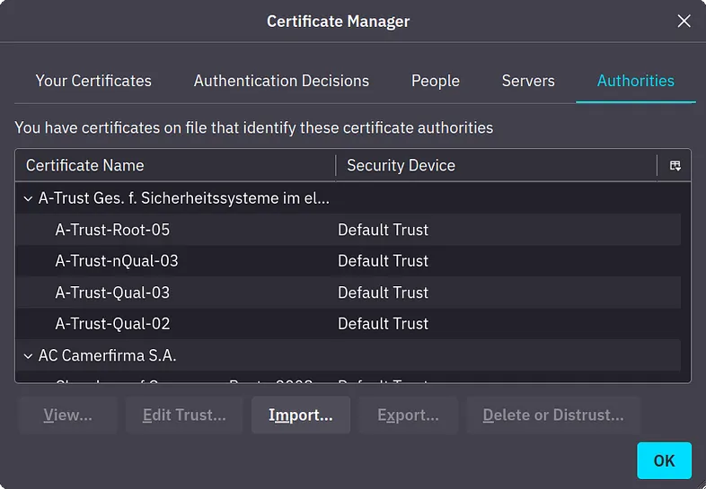

### Chứng chỉ trong TLS

Trước khi bắt đầu một kết nối bảo mật, máy chủ (hoặc máy khách) cần có một **chứng chỉ TLS đã được ký** để xác minh danh tính của nó.
Chứng chỉ này được cấp bởi một **Tổ chức chứng thực (CA – Certificate Authority)** sau khi máy chủ gửi một **Yêu cầu ký chứng chỉ (CSR – Certificate Signing Request)**.

### Các điểm chính:

* **Chứng chỉ đáng tin cậy (Trusted Certificates):** Các chứng chỉ được cấp bởi CA đáng tin cậy sẽ tự động được trình duyệt web nhận diện.
* **Chứng chỉ tự ký (Self-Signed Certificates):** Không được khuyến nghị dùng để xác minh tính xác thực, vì chúng không được xác nhận bởi bên thứ ba.

### Ví dụ:

Nhiều trang web sử dụng chứng chỉ đáng tin cậy được cấp bởi các CA như Let’s Encrypt, cung cấp chứng chỉ miễn phí.
Chứng chỉ tự ký có thể được dùng cho mục đích nội bộ hoặc kiểm thử, nhưng ít an toàn hơn.

### Trả lời các câu hỏi bên dưới

**Hỏi:** Giao thức nào mà TLS kế thừa và phát triển từ đó?
**Trả lời:** SSL

**Hỏi:** Loại chứng chỉ nào không nên được dùng để xác minh tính xác thực của một máy chủ?
**Trả lời:** Chứng chỉ tự ký (self-signed certificate)


---

# Task 3: HTTPS

### HTTP

Như chúng ta đã học trong phòng học **Networking Core Protocols**, HTTP hoạt động dựa trên giao thức TCP và mặc định sử dụng cổng 80.
Chúng ta cũng đã thấy rằng toàn bộ lưu lượng HTTP đều được gửi dưới dạng **văn bản thuần (cleartext)**, khiến bất kỳ ai cũng có thể **chặn và theo dõi**.

Ảnh chụp màn hình bên dưới là từ phòng học trước và nó cho thấy rõ **kẻ tấn công có thể dễ dàng đọc toàn bộ dữ liệu trao đổi giữa máy khách và máy chủ như thế nào**.

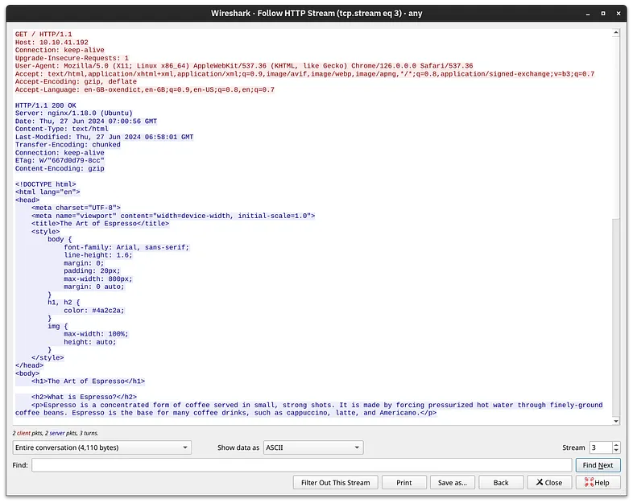


Hãy dành một phút để xem lại các bước phổ biến nhất trước khi trình duyệt web có thể yêu cầu một trang qua HTTP. Sau khi phân giải tên miền thành địa chỉ IP, máy khách sẽ thực hiện hai bước sau:

1. Thiết lập bắt tay ba bước TCP với máy chủ đích
2. Giao tiếp bằng giao thức HTTP; ví dụ, gửi các yêu cầu HTTP như `GET / HTTP/1.1`

Hai bước được mô tả ở trên được hiển thị trong cửa sổ bên dưới. Ba gói tin đầu tiên cho quá trình bắt tay TCP (được đánh dấu là 1) sẽ xuất hiện trước gói HTTP đầu tiên có chứa `GET`. Giao tiếp HTTP được đánh dấu là 2. Ba gói tin cuối cùng được hiển thị là để kết thúc kết nối TCP và được đánh dấu là 3.

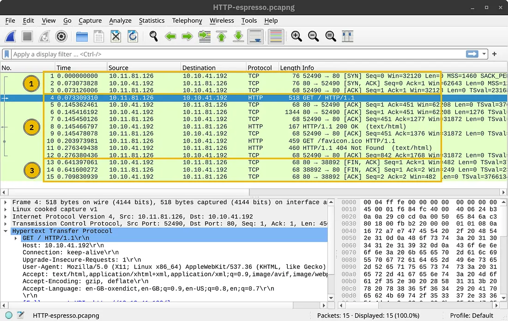

---

### HTTP Over TLS

HTTPS là viết tắt của Hypertext Transfer Protocol Secure. Về cơ bản, nó là HTTP hoạt động trên nền TLS. Do đó, khi yêu cầu một trang web qua HTTPS, quá trình sẽ cần thực hiện ba bước sau (sau khi phân giải tên miền):

1. Thiết lập bắt tay ba bước TCP với máy chủ đích
2. Thiết lập phiên TLS
3. Giao tiếp bằng giao thức HTTP; ví dụ, gửi các yêu cầu HTTP như `GET / HTTP/1.1`

Ảnh chụp màn hình bên dưới cho thấy một phiên TCP được thiết lập qua ba gói đầu tiên, được đánh dấu là 1. Sau đó, một số gói được trao đổi để đàm phán giao thức TLS, được đánh dấu là 2. Cuối cùng, dữ liệu ứng dụng HTTP được trao đổi, được đánh dấu là 3. Khi nhìn vào ảnh chụp màn hình của Wireshark, ta thấy rằng nó hiển thị là “Application Data” vì không có cách nào để biết chắc rằng đó là HTTP hay một giao thức khác được gửi qua cổng 443.

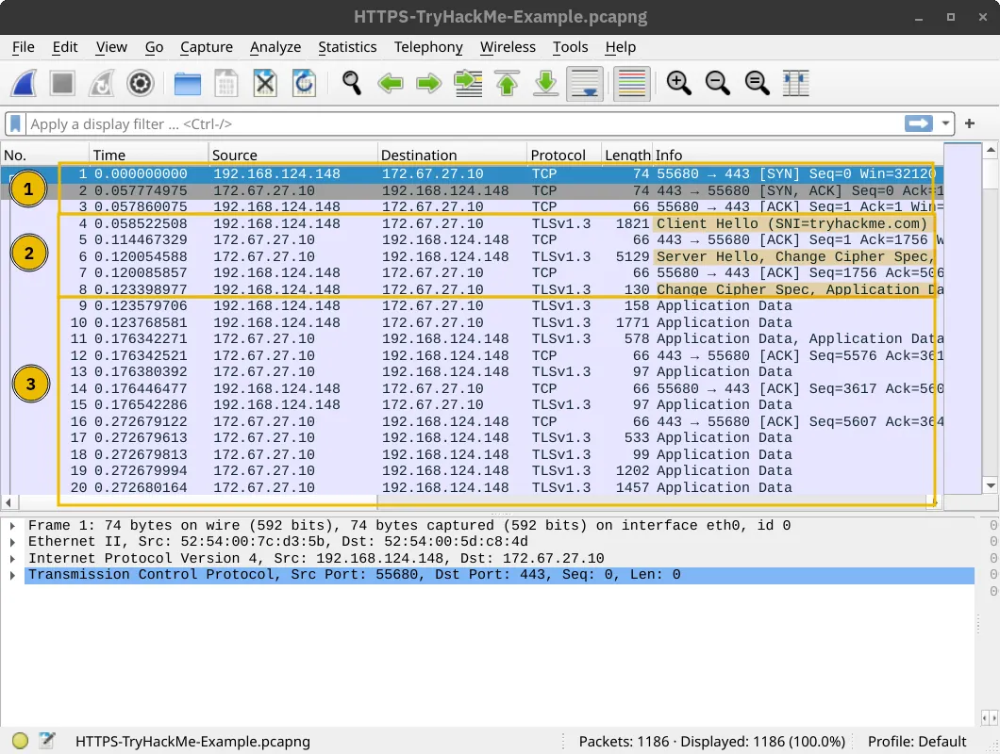


Như đã dự đoán, nếu ai đó cố gắng theo dõi luồng các gói tin và kết hợp tất cả nội dung của chúng lại, họ sẽ chỉ nhận được những ký tự vô nghĩa, như minh họa trong ảnh chụp màn hình bên dưới. Lưu lượng trao đổi đã được mã hóa; phần màu đỏ là do máy khách gửi, còn phần màu xanh là do máy chủ gửi. Không có cách nào để biết được nội dung nếu không có khóa giải mã.

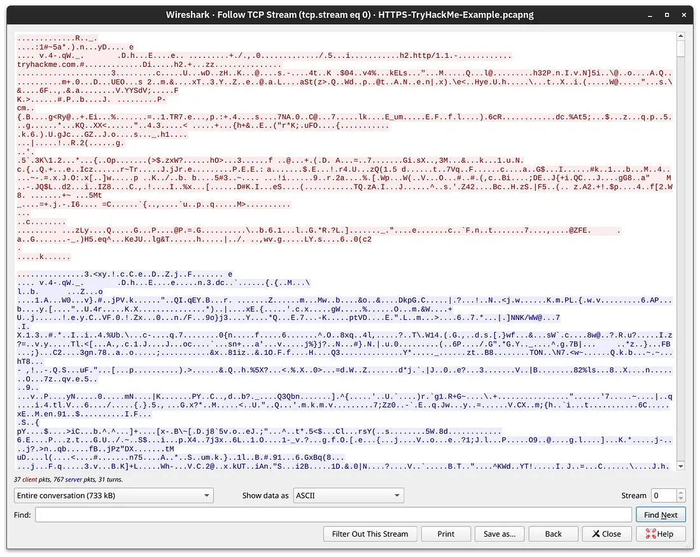


---

### Getting the Encryption Key
>Lấy khóa giải mã

Việc thêm TLS vào HTTP khiến tất cả các gói tin đều bị mã hóa. Chúng ta không thể xem nội dung của các gói tin được trao đổi trừ khi có quyền truy cập vào khóa riêng. Mặc dù khả năng có được các khóa dùng để mã hóa trong một phiên TLS là rất thấp, chúng tôi đã lặp lại các ảnh chụp màn hình ở trên sau khi cung cấp khóa giải mã cho Wireshark. Quá trình bắt tay TCP và TLS không thay đổi; điểm khác biệt chính bắt đầu từ giao thức HTTP được đánh dấu là 3. Ví dụ, chúng ta có thể thấy khi máy khách gửi một yêu cầu `GET`.

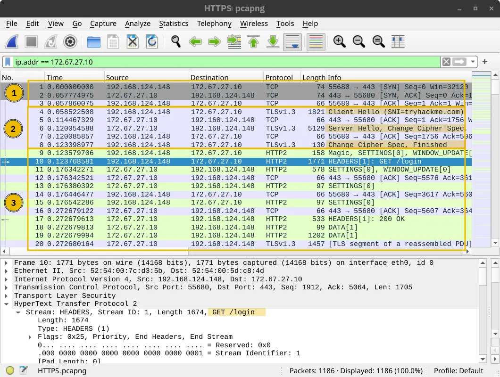


Nếu bạn muốn xem dữ liệu được trao đổi, thì bây giờ là cơ hội của bạn! Đây vẫn là lưu lượng HTTP thông thường nhưng đã được ẩn khỏi con mắt tò mò.

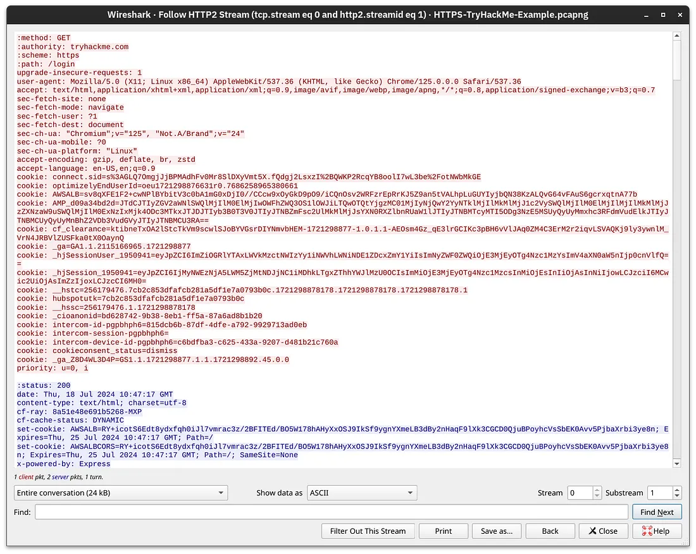

Điều rút ra chính là TLS cung cấp bảo mật cho HTTP mà không cần bất kỳ thay đổi nào ở các tầng thấp hơn hoặc cao hơn trong mô hình giao thức. Nói cách khác, TCP và IP không bị thay đổi, trong khi HTTP được truyền qua TLS theo cách tương tự như khi nó được truyền qua TCP.


### **Trả lời các câu hỏi bên dưới**

Câu 1: *Có bao nhiêu gói tin được sử dụng trong quá trình đàm phán và thiết lập TLS trong các ảnh chụp Wireshark HTTPS ở trên?*

**Trả lời: 8**

> Bạn cần **đếm các gói tin** để **thiết lập** một kết nối **TCP**

---

Câu 2: *Số thứ tự của gói tin chứa lệnh* `GET /login` *khi truy cập trang web qua HTTPS là bao nhiêu?*

**Trả lời:** 10


---

# Task 4: SMTPS, POP3S, and IMAPS

Việc thêm TLS vào các giao thức như **SMTP**, **POP3** và **IMAP** giúp bảo mật cho việc giao tiếp email. Các giao thức này lần lượt trở thành **SMTPS**, **POP3S** và **IMAPS**, đảm bảo rằng dữ liệu email được mã hóa khi truyền qua mạng.

* **SMTPS**: Giao thức Truyền Thư Bảo Mật qua TLS.
* **POP3S**: Giao thức Bưu Điện Bảo Mật (truy xuất email) qua TLS.
* **IMAPS**: Giao thức Truy Cập Thư Internet Bảo Mật (đồng bộ email) qua TLS.

Các phiên bản không an toàn sử dụng các cổng TCP mặc định như được hiển thị trong bảng dưới đây:

| Giao thức | Cổng mặc định |
| --------- | ------------- |
| HTTP      | 80            |
| SMTP      | 25            |
| POP3      | 110           |
| IMAP      | 143           |

Các phiên bản an toàn, tức là sử dụng TLS, sử dụng các cổng TCP sau theo mặc định:

| Giao thức | Cổng mặc định |
| --------- | ------------- |
| HTTPS     | 443           |
| SMTPS     | 465 và 587    |
| POP3S     | 995           |
| IMAPS     | 993           |


**Ví dụ:**
Sử dụng IMAPS đảm bảo rằng các email bạn đọc trên nhiều thiết bị (như điện thoại và máy tính xách tay) được đồng bộ hóa một cách an toàn, ngăn chặn những kẻ nghe lén truy cập vào thông tin nhạy cảm.

---

### **Trả lời các câu hỏi bên dưới**

*Nếu bạn ghi lại lưu lượng mạng, trong số các giao thức sau đây — SMTPS, POP3S hoặc IMAP — bạn có thể trích xuất thông tin đăng nhập từ giao thức nào?*

**Trả lời:** IMAP

(Giải thích thêm: Vì IMAP không sử dụng mã hóa nếu không có TLS, nên thông tin đăng nhập có thể bị lộ qua mạng nếu không bảo mật.)

---

# Task 5: SSH

**SSH** (Secure Shell) là một giao thức được sử dụng để đăng nhập an toàn vào các hệ thống từ xa. Nó cung cấp giao tiếp được mã hóa, giúp bảo vệ tính toàn vẹn và tính bảo mật của kết nối. SSH đã thay thế các phương pháp không an toàn trước đây như Telnet, nơi tất cả dữ liệu, bao gồm cả mật khẩu, được gửi dưới dạng văn bản thuần túy.

OpenSSH mang lại nhiều lợi ích. Dưới đây là một vài điểm chính:

* **Xác thực an toàn**: Bên cạnh xác thực bằng mật khẩu, SSH còn hỗ trợ xác thực bằng khóa công khai và xác thực hai yếu tố.

* **Bảo mật thông tin**: OpenSSH cung cấp mã hóa đầu-cuối, bảo vệ chống nghe lén. Hơn nữa, nó thông báo cho bạn khi có khóa máy chủ mới để phòng tránh các cuộc tấn công dạng "man-in-the-middle" (kẻ trung gian).

* **Tính toàn vẹn**: Ngoài việc bảo vệ tính bảo mật của dữ liệu được trao đổi, mật mã học còn bảo vệ tính toàn vẹn của lưu lượng truyền tải.

* **Tunneling (Đường hầm)**: SSH có thể tạo một “đường hầm” an toàn để chuyển tiếp các giao thức khác thông qua SSH. Cấu hình này hoạt động giống như một kết nối VPN.

* **Chuyển tiếp X11**: Nếu bạn kết nối tới một hệ thống giống Unix với giao diện đồ họa, SSH cho phép bạn sử dụng ứng dụng đồ họa đó thông qua mạng.

Bạn sẽ sử dụng lệnh `ssh username@hostname` để kết nối đến một máy chủ SSH. Nếu tên người dùng giống với tên người dùng hiện tại mà bạn đang đăng nhập, bạn chỉ cần dùng `ssh hostname`. Sau đó, bạn sẽ được yêu cầu nhập mật khẩu; tuy nhiên, nếu sử dụng xác thực bằng khóa công khai, bạn sẽ được đăng nhập ngay lập tức.

Ảnh chụp màn hình bên dưới cho thấy ví dụ về việc chạy Wireshark trên một hệ thống Kali Linux từ xa. Tham số `-X` là cần thiết để hỗ trợ chạy giao diện đồ họa, ví dụ: `ssh 192.168.124.148 -X`. (Hệ thống cục bộ cần phải được cài đặt sẵn môi trường đồ họa phù hợp.)

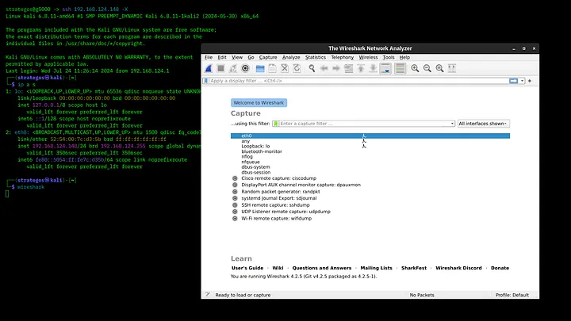


Trong khi máy chủ **TELNET** lắng nghe trên cổng 23, thì máy chủ **SSH** lắng nghe trên cổng 22.

### **Trả lời các câu hỏi bên dưới**

*Tên của bản triển khai mã nguồn mở của giao thức SSH là gì?*

**Trả lời:** OpenSSH

---

# Task 6: SFTP and FTPS

**SFTP** (SSH File Transfer Protocol) và **FTPS** (File Transfer Protocol Secure) đều cung cấp các phương thức bảo mật để truyền tệp, nhưng chúng sử dụng các công nghệ nền tảng khác nhau.

* **SFTP**: Là một phần của bộ giao thức SSH, hoạt động trên **cổng 22**.

* **FTPS**: Sử dụng TLS để bảo mật, tương tự như HTTPS, và thường hoạt động trên **cổng 990**.

### Ví dụ:

```bash
sftp user@hostname
```

Lệnh này thiết lập một phiên truyền tệp bảo mật sử dụng SFTP, đảm bảo rằng tất cả quá trình tải lên và tải xuống tệp đều được mã hóa.

### Trả lời các câu hỏi bên dưới

**Nhấp vào nút *View Site* để truy cập trang liên quan. Vui lòng làm theo hướng dẫn trên trang để lấy được cờ.**

**Trả lời:** `THM{Protocols_secur3d}`

```bash
FTP 21 > TTPS 990
Telnet 23 > SSH 22
SMTP 25 > SMTPS 465 and 587
POP3 110 > POP3S 995
IMAP 143 > IMAPS 993
```

---

# Task 7: VPN

**VPN** (Mạng riêng ảo) tạo ra một “đường hầm” bảo mật giữa máy khách và máy chủ VPN, cho phép người dùng truy cập vào mạng từ xa như thể họ đang kết nối trực tiếp. VPN được sử dụng rộng rãi bởi các công ty để nhân viên có thể truy cập an toàn vào tài nguyên nội bộ từ xa.

### Các tính năng chính:

* **Mã hóa**: VPN mã hóa toàn bộ lưu lượng giữa máy khách và máy chủ.
* **Ẩn danh**: Người dùng VPN sẽ hiển thị như đang truy cập từ địa chỉ IP của máy chủ VPN thay vì vị trí thực tế của họ.

### Ví dụ:

Một nhân viên làm việc từ xa có thể sử dụng VPN để kết nối an toàn đến mạng của công ty và truy cập các tập tin cũng như ứng dụng được chia sẻ, giống như khi họ đang làm việc tại văn phòng.

Khi một đường hầm VPN được thiết lập, toàn bộ lưu lượng Internet của chúng ta thường sẽ được chuyển qua kết nối VPN, tức là qua đường hầm VPN. Do đó, khi chúng ta cố gắng truy cập một dịch vụ Internet hay ứng dụng web, họ sẽ không thấy địa chỉ IP công khai của chúng ta mà sẽ thấy địa chỉ của máy chủ VPN. Đây là lý do tại sao một số người dùng Internet kết nối qua VPN để vượt qua các giới hạn địa lý. Thêm vào đó, nhà cung cấp dịch vụ Internet (ISP) tại địa phương sẽ chỉ nhìn thấy dữ liệu đã được mã hóa, điều này hạn chế khả năng kiểm duyệt truy cập Internet.

Nói cách khác, nếu một người dùng kết nối đến máy chủ VPN đặt tại Nhật Bản, họ sẽ hiển thị như đang truy cập từ Nhật Bản. Các máy chủ dịch vụ sẽ tùy chỉnh trải nghiệm tương ứng, chẳng hạn như chuyển hướng người dùng đến phiên bản tiếng Nhật của dịch vụ. Ảnh chụp màn hình bên dưới hiển thị trang tìm kiếm của Google sau khi kết nối đến máy chủ VPN tại Nhật Bản.

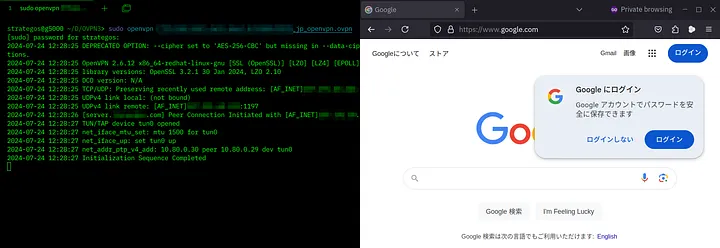

Cuối cùng, mặc dù trong nhiều trường hợp, người dùng sẽ thiết lập kết nối VPN để chuyển toàn bộ lưu lượng qua đường hầm VPN, nhưng một số kết nối VPN lại không làm điều đó. Máy chủ VPN có thể được cấu hình để chỉ cung cấp quyền truy cập vào mạng riêng mà không định tuyến toàn bộ lưu lượng của bạn. Thêm vào đó, một số máy chủ VPN có thể làm rò rỉ địa chỉ IP thực của bạn, mặc dù về lý thuyết, chúng được kỳ vọng sẽ chuyển hướng toàn bộ lưu lượng của bạn qua VPN. Tùy thuộc vào mục đích sử dụng VPN, bạn có thể cần chạy thêm một số kiểm tra, chẳng hạn như kiểm tra rò rỉ DNS.

Cuối cùng, một số quốc gia coi việc sử dụng VPN là bất hợp pháp, thậm chí có thể bị xử phạt. Vui lòng kiểm tra luật pháp và quy định địa phương trước khi sử dụng VPN, đặc biệt là khi bạn đang đi du lịch.


### **Trả lời các câu hỏi bên dưới**

*Công cụ nào bạn sẽ sử dụng để kết nối các chi nhánh khác nhau của công ty, nhằm giúp người dùng tại văn phòng từ xa có thể truy cập tài nguyên được lưu trữ tại trụ sở chính?*

**Trả lời:** VPN

---

# Task 8: Closing Notes
>Ghi chú kết luận

Tóm lại, **TLS** đóng vai trò quan trọng trong việc bảo mật các giao tiếp Internet hiện đại. Nó cung cấp một nền tảng để bảo vệ nhiều giao thức khác nhau, bao gồm HTTP, SMTP, IMAP và nhiều giao thức khác. Cùng với SSH và VPN, các công nghệ này bảo vệ tính toàn vẹn và bảo mật của dữ liệu, cho phép truy cập từ xa an toàn, truyền tệp, và giao dịch trực tuyến.

Sự kết hợp của các giao thức này đảm bảo rằng dữ liệu nhạy cảm — dù đang được truyền tải, gửi qua email hay chuyển tập tin — vẫn luôn được bảo mật và không thể bị truy cập bởi kẻ tấn công.


Chúng tôi đã cấu hình trình duyệt để ghi lại các khóa TLS của phiên làm việc, nhờ đó có thể quan sát lưu lượng truy cập kỹ hơn bằng Wireshark. Việc ghi này được thực hiện bằng cách thêm một tùy chọn vào lối tắt của trình duyệt. Khi chạy lệnh:

```bash
chromium --ssl-key-log-file=~/ssl-key.log
```

trình duyệt sẽ ghi các khóa TLS vào tập tin `ssl-key.log`.

Tập tin bắt gói được gọi là **randy-chromium.pcapng** và được lưu trong thư mục **Documents**. Khi bạn mở tập tin này trong Wireshark, bạn có thể cấu hình để Wireshark sử dụng tập tin `ssl-key.log`, nhờ đó toàn bộ lưu lượng TLS sẽ được giải mã. Bạn có thể thấy năm bước để thực hiện điều này trong hai ảnh chụp màn hình bên dưới.

Trước hết, nhấp chuột phải vào bất kỳ đâu, chọn **“Protocol Preferences”**. Trong menu con, chọn **“Transport Layer Security”**, sau đó nhấp vào **“Open Transport Layer Security preferences”**.

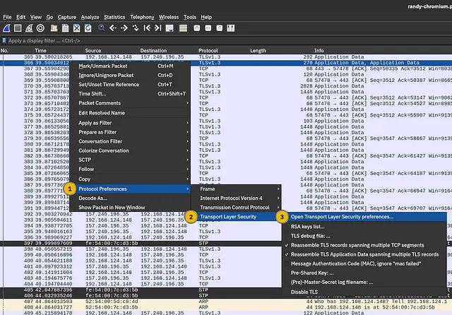


Nhấp vào “Open Transport Layer Security preferences” sẽ hiển thị một hộp thoại. Bạn cần nhấp vào nút “Browse” được đánh dấu là số bốn để tìm tập tin `ssl-key.log`. Bạn có thể tìm thấy nó trong thư mục **Documents**. Cuối cùng, nhấn OK và Wireshark sẽ hiển thị toàn bộ lưu lượng TLS đã được giải mã. Một trong những gói tin này chứa thông tin đăng nhập.

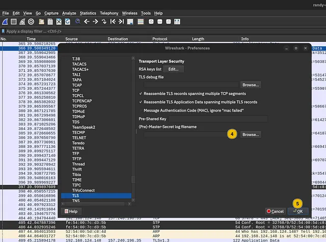


### **Trả lời các câu hỏi bên dưới**

*Một trong các gói tin chứa thông tin đăng nhập. Mật khẩu mà người dùng đã nhập là gì?*

**Trả lời:** `THM{B8WM6P}`

```bash
Step-by-Step from Tryhackme
Check packet number 366
```
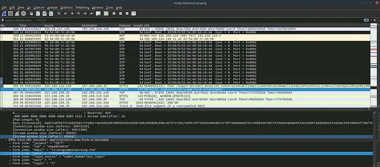

---


