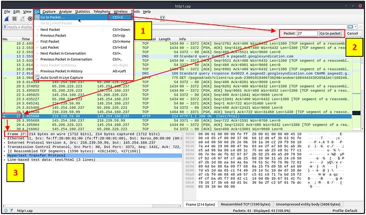

# Wireshark: The Basics

## Mục lục

1. [ Task 1: Introduction](#task-1-introduction)
2. [Task 2: Tool Overview](#task-2-tool-overview)
3. [Task 3: Packet Dissection](#task-3-packet-dissection)
4. [Task 4: Packet Navigation](#task-4-packet-navigation)
5. [Task 5: Packet Filtering](#task-5-packet-filtering)

## Nội dung

# Task 1: Introduction

Wireshark là một công cụ phân tích gói tin mạng mã nguồn mở, đa nền tảng, có khả năng "nghe lén" và điều tra lưu lượng mạng trực tiếp cũng như kiểm tra các tệp ghi lại gói tin (PCAP). Nó thường được xem là một trong những công cụ phân tích gói tin tốt nhất. Trong phòng này, chúng ta sẽ tìm hiểu những kiến thức cơ bản về Wireshark và sử dụng nó để thực hiện phân tích gói tin ở mức cơ bản.

---

# Task 2: Tool Overview

>Tổng quan về công cụ

### Các trường hợp sử dụng

Wireshark là một trong những công cụ phân tích lưu lượng mạng mạnh mẽ nhất hiện có. Có nhiều mục đích khác nhau khi sử dụng công cụ này:

* Phát hiện và xử lý sự cố mạng, chẳng hạn như điểm nghẽn hoặc tắc nghẽn lưu lượng mạng.
* Phát hiện các bất thường về bảo mật, chẳng hạn như máy chủ lạ, việc sử dụng cổng bất thường và lưu lượng khả nghi.
* Điều tra và tìm hiểu chi tiết về giao thức, chẳng hạn như mã phản hồi và dữ liệu gói tin.

**Lưu ý:** Wireshark không phải là Hệ thống Phát hiện Xâm nhập (IDS). Nó chỉ cho phép các nhà phân tích phát hiện và điều tra các gói tin một cách chi tiết. Công cụ này cũng không chỉnh sửa gói tin; nó chỉ đọc chúng. Do đó, việc phát hiện bất kỳ bất thường hoặc sự cố nào phụ thuộc rất nhiều vào kiến thức và kỹ năng điều tra của nhà phân tích.

---

### GUI and Data
>Giao diện đồ họa (GUI) và Dữ liệu

Giao diện đồ họa của Wireshark mở ra dưới dạng một trang tích hợp duy nhất, giúp người dùng điều tra lưu lượng mạng theo nhiều cách khác nhau. Ở cái nhìn đầu tiên, có năm khu vực nổi bật:

| **Thành phần**                    | **Mô tả**                                                                                                                                                                                    |
| --------------------------------- | -------------------------------------------------------------------------------------------------------------------------------------------------------------------------------------------- |
| **Toolbar**                       | Thanh công cụ chính chứa nhiều menu và phím tắt cho việc bắt và xử lý gói tin, bao gồm lọc, sắp xếp, tóm tắt, xuất và gộp.                                                                   |
| **Display Filter Bar**            | Khu vực chính để truy vấn và lọc dữ liệu.                                                                                                                                                    |
| **Recent Files**                  | Danh sách các tệp đã phân tích gần đây. Bạn có thể mở lại tệp bằng cách nhấp đúp.                                                                                                            |
| **Capture Filter and Interfaces** | Bộ lọc gói tin và các điểm bắt (giao diện mạng) khả dụng. Giao diện mạng là điểm kết nối giữa máy tính và mạng. Kết nối phần mềm (ví dụ: lo, eth0, ens33) cho phép phần cứng mạng hoạt động. |
| **Status Bar**                    | Hiển thị trạng thái công cụ, hồ sơ và thông tin gói tin dưới dạng số.                                                                                                                        |

Hình bên dưới hiển thị cửa sổ chính của Wireshark. Các khu vực được mô tả trong bảng ở trên sẽ được đánh dấu. Giờ hãy mở Wireshark và thực hiện theo hướng dẫn.

---

### Loading PCAP Files

>Tải tệp PCAP

Hình trên hiển thị giao diện trống của Wireshark. Thông tin duy nhất sẵn có là tệp “http1.cap” đã được xử lý gần đây. Hãy tải tệp đó lên để xem cách Wireshark trình bày chi tiết các gói tin. Lưu ý rằng bạn cũng có thể sử dụng menu **“File”**, kéo và thả tệp vào, hoặc nhấp đúp vào tệp để tải tệp pcap.

Bây giờ, chúng ta có thể thấy tên tệp đã được xử lý, số lượng gói tin chi tiết và thông tin gói tin. Thông tin gói tin được hiển thị trong ba khung khác nhau, cho phép chúng ta khám phá chúng dưới các định dạng khác nhau:

| **Khung danh sách gói tin (Packet List Pane)**   | Tóm tắt của từng gói tin (địa chỉ nguồn và đích, giao thức và thông tin gói). Bạn có thể nhấp vào danh sách để chọn một gói tin cần điều tra thêm. Khi bạn chọn một gói, thông tin chi tiết sẽ hiển thị ở các khung còn lại. |
| ------------------------------------------------ | ---------------------------------------------------------------------------------------------------------------------------------------------------------------------------------------------------------------------------- |
| **Khung chi tiết gói tin (Packet Details Pane)** | Phân tích chi tiết theo giao thức của gói tin được chọn.                                                                                                                                                                     |
| **Khung byte của gói tin (Packet Bytes Pane)**   | Dạng biểu diễn hex và ASCII đã giải mã của gói tin được chọn. Nó sẽ làm nổi bật trường của gói tin tương ứng với phần được nhấp trong khung chi tiết.                                                                        |

---

### Colouring Packets

>Tô màu các gói tin

Bên cạnh việc cung cấp thông tin nhanh về gói tin, Wireshark còn tô màu các gói dựa trên nhiều điều kiện khác nhau và theo giao thức, nhằm giúp phát hiện bất thường và xác định giao thức trong các gói tin một cách nhanh chóng (điều này lý giải tại sao hầu hết mọi thứ đều có màu xanh lá trong ảnh chụp màn hình). Việc nhìn lướt qua các thông tin được tô màu có thể giúp bạn nhanh chóng xác định được thứ mình đang tìm kiếm trong quá trình phân tích. Bạn có thể tạo quy tắc màu tùy chỉnh để phát hiện những sự kiện đáng chú ý bằng cách sử dụng bộ lọc hiển thị, và chúng ta sẽ tìm hiểu về điều này trong phòng kế tiếp. Bây giờ hãy tập trung vào các thiết lập mặc định và tìm hiểu cách xem và sử dụng các dữ liệu được trình bày.

Wireshark có hai loại quy tắc tô màu gói tin:

1. **Tạm thời** – chỉ khả dụng trong phiên làm việc hiện tại.
2. **Vĩnh viễn** – được lưu trong tệp cấu hình (hồ sơ) và sẽ có hiệu lực cho các phiên sau.

Bạn có thể sử dụng **menu chuột phải** hoặc **“View → Coloring Rules”** để tạo quy tắc tô màu vĩnh viễn. Menu **“Colourise Packet List”** dùng để bật/tắt các quy tắc tô màu.

Tô màu tạm thời có thể được thực hiện bằng **menu chuột phải** hoặc thông qua **“View → Conversation Filter”**, phần này sẽ được trình bày trong **Task 5**.

Màu mặc định vĩnh viễn sẽ được hiển thị bên dưới.

---

### Theo dõi lưu lượng (Traffic Sniffing)

Bạn có thể sử dụng **nút cá mập màu xanh dương** để bắt đầu quá trình theo dõi mạng (thu thập lưu lượng), **nút đỏ** sẽ dừng quá trình theo dõi, và **nút xanh lá** sẽ khởi động lại quá trình theo dõi. Thanh trạng thái cũng sẽ hiển thị giao diện mạng đang được sử dụng để theo dõi và số lượng gói tin đã thu thập được.

---

### **Gộp các tập tin PCAP**

Wireshark có thể kết hợp hai tập tin pcap thành một tập tin duy nhất. Bạn có thể sử dụng đường dẫn menu **“File → Merge”** để gộp một tập tin pcap với tập tin đã được xử lý. Khi bạn chọn tập tin thứ hai, Wireshark sẽ hiển thị tổng số gói tin trong tập tin được chọn. Sau khi bạn nhấn “open”, nó sẽ gộp tập tin pcap hiện tại với tập tin đã chọn và tạo ra một tập tin pcap mới. Lưu ý rằng bạn cần lưu tập tin pcap “đã gộp” trước khi tiến hành xử lý.

---

### **Xem Chi Tiết Tập Tin**

Biết được các chi tiết của tập tin là điều hữu ích. Đặc biệt khi làm việc với nhiều tập tin pcap, đôi khi bạn sẽ cần biết và ghi nhớ các chi tiết của tập tin (mã băm tập tin, thời gian ghi nhận, ghi chú tập tin, giao diện và thống kê) để xác định, phân loại và ưu tiên xử lý tập tin đó. Bạn có thể xem các chi tiết này bằng cách vào **“Statistics → Capture File Properties”** hoặc bằng cách nhấp vào **“biểu tượng pcap nằm ở góc dưới bên trái”** của cửa sổ.

---

### **Trả lời các câu hỏi dưới đây:**

Sử dụng tập tin **“Exercise.pcapng”** để trả lời các câu hỏi.

**Câu hỏi: 2.1** Đọc phần **“ghi chú của tập tin ghi nhận”**. Cờ (flag) là gì?

Trước hết, hãy khởi động máy. Bây giờ chúng ta mở Wireshark, vào File > Open và chọn tập tin **“Exercise.pcapng”** để tải lên.

Bây giờ chúng ta sẽ mở phần thuộc tính của tập tin ghi nhận. Vào Statistics > Capture File Properties:

Cuộn xuống phần comments:

**Answer: TryHackMe_Wireshark_Demo**

---

**Câu hỏi 2.2 Tổng số gói tin là bao nhiêu?**

Nó nằm ở góc dưới bên phải, trong thanh trạng thái:

**Answer: 58620**

---

**Câu hỏi: 2.3 Giá trị hàm băm SHA256 của tập tin ghi nhận là gì?**

Quay lại phần Thuộc tính Tập tin Ghi nhận (Statistics > Status File Properties) và đó là trường thứ ba trong phần thông tin tập tin:

Answer:`f446de335565fb0b0ee5e5a3266703c778b2f3dfad7efeaeccb2da5641a6d6eb`

---

# Task 3: Packet Dissection

>Phân tích Gói tin**

**Phân tích Gói tin**
Phân tích gói tin còn được gọi là phân tích giao thức, tức là điều tra chi tiết các gói tin bằng cách giải mã các giao thức và trường có sẵn. Wireshark hỗ trợ một danh sách dài các giao thức để phân tích, và bạn cũng có thể viết các tập lệnh phân tích của riêng mình. Bạn có thể tìm thêm thông tin chi tiết về phân tích tại **đây**.

**Lưu ý:** Phần này trình bày cách Wireshark sử dụng các lớp OSI để phân tách các gói tin và cách sử dụng các lớp này để phân tích. Yêu cầu bạn đã có kiến thức nền tảng về mô hình OSI và cách thức hoạt động của nó.

**Chi tiết Gói tin**
Bạn có thể nhấp vào một gói tin trong khung danh sách gói để mở chi tiết của nó (nhấp đúp sẽ mở chi tiết trong một cửa sổ mới). Các gói tin bao gồm từ 5 đến 7 lớp dựa trên mô hình OSI. Chúng ta sẽ tìm hiểu tất cả các lớp này trong một gói HTTP từ một bản ghi mẫu. Hình ảnh bên dưới minh họa việc xem gói tin số 27.

Mỗi khi bạn nhấp vào một chi tiết, phần tương ứng trong khung byte gói tin sẽ được tô sáng.

Chúng ta hãy xem kỹ hơn khung thông tin chi tiết.

Chúng ta có thể thấy bảy lớp riêng biệt trong một gói tin: khung/gói tin, địa chỉ nguồn \[MAC], địa chỉ nguồn \[IP], giao thức, lỗi giao thức, giao thức ứng dụng và dữ liệu ứng dụng. Dưới đây, chúng ta sẽ đi sâu vào từng lớp một cách chi tiết hơn.

**Khung (Lớp 1):** Phần này sẽ cho bạn biết bạn đang xem khung/gói tin nào và các chi tiết liên quan đến lớp Vật lý trong mô hình OSI.

**Nguồn \[MAC] (Lớp 2):** Phần này sẽ hiển thị cho bạn địa chỉ MAC nguồn và đích; thuộc lớp Liên kết Dữ liệu (Data Link) trong mô hình OSI.

**Nguồn \[IP] (Lớp 3):** Phần này sẽ hiển thị cho bạn địa chỉ IPv4 nguồn và đích; thuộc lớp Mạng (Network) trong mô hình OSI.

**Giao thức (Lớp 4):** Phần này sẽ hiển thị cho bạn chi tiết về giao thức được sử dụng (UDP/TCP) và các cổng nguồn và đích; thuộc lớp Giao vận (Transport) trong mô hình OSI.

**Lỗi Giao thức:** Phần tiếp nối của lớp 4 này hiển thị các đoạn cụ thể từ TCP cần được tái lắp ráp.

**Giao thức Ứng dụng (Lớp 5):** Phần này sẽ hiển thị các chi tiết cụ thể về giao thức được sử dụng, như HTTP, FTP và SMB. Thuộc lớp Ứng dụng trong mô hình OSI.

**Dữ liệu Ứng dụng:** Phần mở rộng của lớp 5 này có thể hiển thị dữ liệu riêng biệt của ứng dụng.

Bây giờ chúng ta đã hiểu một gói tin tổng quát bao gồm những gì, hãy xem xét các giao thức ứng dụng khác nhau và các chi tiết cụ thể của chúng.

---

### **Trả lời các câu hỏi sau:**

Sử dụng tập tin **“Exercise.pcapng”** để trả lời các câu hỏi.

**Câu hỏi 3.1: Xem gói tin số 38.** Ngôn ngữ đánh dấu nào được sử dụng trong giao thức HTTP?

Hãy mở gói tin được yêu cầu. Bạn có thể xem các gói tin cụ thể bằng cách nhấp “Go > Go to Packet...” và sau đó trường nhập số gói sẽ hiện ra bên phải, nhập số gói mong muốn và dữ liệu của gói sẽ được hiển thị bên dưới.

Câu trả lời nằm gần cuối ngăn chi tiết ở góc dưới bên trái:

Answer: eXtensible Markup Language

---

**3.2 Ngày đến của gói tin là gì?** (Định dạng câu trả lời: Tháng/Ngày/Năm)

Mở rộng chi tiết của khung (frame) và bạn sẽ thấy ngày và giờ đến của gói tin.

Answer: 05/13/2004

---

**3.3 Giá trị TTL là gì?**

Mở rộng cài đặt IPv4 và bạn sẽ thấy TTL.

Answer: 47

---

**3.4 Kích thước payload của TCP là bao nhiêu?**

Mở rộng phần chi tiết của TCP.

Answer: 424

---

**3.5 Giá trị e-tag là gì?**

Mở rộng phần cài đặt HTTP.

Answer: 9a01a-4696–7e354b00

---

# Task 4: Packet Navigation
>Nhiệm vụ 4: Dẫn hướng Gói tin

### **Số Gói tin**
Wireshark tính toán số lượng gói tin được kiểm tra và gán một số duy nhất cho mỗi gói. Điều này hỗ trợ quá trình phân tích đối với các bản ghi lớn và giúp dễ dàng quay lại một điểm cụ thể của một sự kiện.

### **Đi tới Gói tin**

Số gói tin không chỉ giúp đếm tổng số gói tin mà còn giúp dễ dàng tìm/kiểm tra các gói tin cụ thể. Tính năng này không chỉ điều hướng lên xuống giữa các gói tin mà còn cung cấp khả năng theo dõi gói trong khung và tìm gói tin tiếp theo trong phần cụ thể của cuộc trao đổi. Bạn có thể sử dụng menu **“Go”** và thanh công cụ để xem các gói tin cụ thể.

### **Tìm Gói tin**

Ngoài số gói tin, Wireshark còn có thể tìm gói tin dựa trên nội dung của gói. Bạn có thể sử dụng menu **“Edit → Find Packet”** để tìm kiếm bên trong các gói tin nhằm phát hiện một sự kiện cụ thể nào đó. Tính năng này giúp các nhà phân tích và quản trị viên tìm ra các mẫu xâm nhập cụ thể hoặc dấu vết lỗi.

Có hai điểm quan trọng khi tìm gói tin. Thứ nhất là xác định loại dữ liệu đầu vào. Chức năng này chấp nhận bốn loại đầu vào (bộ lọc hiển thị, Hex, chuỗi văn bản và Regex). Tìm kiếm bằng chuỗi và regex là hai loại phổ biến nhất. Việc tìm kiếm không phân biệt chữ hoa/thường, nhưng bạn có thể bật tùy chọn phân biệt chữ hoa/thường bằng cách chọn nút radio tương ứng.

Điểm thứ hai là chọn đúng khu vực tìm kiếm. Bạn có thể thực hiện tìm kiếm trong ba khung (danh sách gói tin, chi tiết gói tin, và byte của gói tin), và điều quan trọng là phải biết thông tin nào có sẵn trong từng khung để tìm đúng sự kiện. Ví dụ, nếu bạn cố tìm thông tin có trong khung chi tiết gói nhưng lại thực hiện tìm kiếm ở khung danh sách gói, Wireshark sẽ không tìm ra dù thông tin đó có tồn tại.

### **Đánh dấu Gói tin**

Đánh dấu gói tin là một chức năng hữu ích khác cho các nhà phân tích. Bạn có thể tìm/đánh dấu một gói tin cụ thể để điều tra thêm bằng cách đánh dấu nó. Nó giúp các nhà phân tích chỉ ra một sự kiện quan trọng hoặc xuất các gói tin cụ thể từ bản ghi. Bạn có thể sử dụng menu **“Edit”** hoặc menu “nhấp chuột phải” để đánh dấu/bỏ đánh dấu các gói tin.

Các gói tin được đánh dấu sẽ hiển thị bằng màu đen bất kể màu gốc đại diện cho loại kết nối. Lưu ý rằng thông tin đánh dấu gói tin sẽ được làm mới sau mỗi phiên làm việc với tập tin, vì vậy các gói đã được đánh dấu sẽ mất sau khi đóng tập tin ghi lại.

### **Ghi chú Gói tin**

Tương tự như việc đánh dấu gói tin, thêm ghi chú là một tính năng hữu ích khác cho các nhà phân tích. Bạn có thể thêm ghi chú cho các gói tin cụ thể nhằm hỗ trợ việc điều tra thêm hoặc để nhắc nhở và chỉ ra các điểm quan trọng/đáng ngờ cho các nhà phân tích ở tầng khác. Khác với việc đánh dấu, ghi chú có thể được giữ lại trong tập tin ghi nhận cho đến khi người vận hành xóa chúng.

### **Xuất Gói tin**

Tập tin ghi nhận có thể chứa hàng nghìn gói tin trong một tập tin duy nhất. Như đã đề cập trước đó, Wireshark không phải là một hệ thống phát hiện xâm nhập (IDS), vì vậy đôi khi cần phải tách các gói cụ thể ra khỏi tập tin để phân tích sâu hơn nhằm giải quyết một sự cố. Tính năng này giúp các nhà phân tích chia sẻ chỉ những gói tin đáng ngờ (phạm vi đã xác định). Nhờ đó, thông tin dư thừa sẽ không bị đưa vào quá trình phân tích. Bạn có thể sử dụng menu **“File”** để xuất các gói tin.

### **Xuất Đối tượng (Tập tin)**

Wireshark có thể trích xuất các tập tin được truyền qua đường truyền. Đối với một nhà phân tích bảo mật, việc phát hiện các tập tin được chia sẻ và lưu lại để điều tra thêm là rất quan trọng. Việc xuất đối tượng chỉ khả dụng đối với luồng của một số giao thức nhất định (DICOM, HTTP, IMF, SMB và TFTP).

### **Định dạng Hiển thị Thời gian**

Wireshark liệt kê các gói tin theo thứ tự chúng được ghi lại, vì vậy việc điều tra theo dòng mặc định không phải lúc nào cũng là lựa chọn tốt nhất. Theo mặc định, Wireshark hiển thị thời gian theo định dạng “Số giây kể từ khi bắt đầu ghi nhận”, cách sử dụng phổ biến hơn là dùng Định dạng Thời gian UTC để có cái nhìn rõ ràng hơn. Bạn có thể sử dụng menu **“View → Time Display Format”** để thay đổi định dạng hiển thị thời gian.

### **Thông tin Chuyên gia (Expert Info)**

Wireshark cũng phát hiện các trạng thái cụ thể của giao thức để giúp các nhà phân tích dễ dàng phát hiện các điểm bất thường và sự cố có thể xảy ra. Lưu ý rằng đây chỉ là các gợi ý và luôn có khả năng xảy ra cảnh báo sai (dương tính/âm tính giả). Thông tin chuyên gia có thể cung cấp các nhóm phân loại theo ba mức độ nghiêm trọng khác nhau. Chi tiết được thể hiện trong bảng dưới đây.

| Mức độ nghiêm trọng | Màu sắc          | Thông tin                                            |
| ------------------- | ---------------- | ---------------------------------------------------- |
| Chat                | Xanh dương       | Thông tin về quy trình thông thường.                 |
| Note                | Xanh nhạt (Cyan) | Các sự kiện đáng chú ý như mã lỗi ứng dụng.          |
| Warn                | Vàng             | Cảnh báo như mã lỗi bất thường hoặc thông báo sự cố. |
| Error               | Đỏ               | Các vấn đề như gói tin sai định dạng.                |

Các nhóm thông tin thường gặp được liệt kê trong bảng dưới đây. Bạn có thể tham khảo tài liệu chính thức của Wireshark để biết thêm thông tin về các mục thông tin chuyên gia.

| Nhóm     | Thông tin                 | Nhóm       | Thông tin                          |
| -------- | ------------------------- | ---------- | ---------------------------------- |
| Checksum | Lỗi kiểm tra checksum     | Deprecated | Việc sử dụng giao thức đã lỗi thời |
| Comment  | Phát hiện ghi chú gói tin | Malformed  | Phát hiện gói tin sai định dạng    |

Bạn có thể sử dụng khu vực **“góc dưới bên trái”** trong thanh trạng thái hoặc vào menu **“Analyse → Expert Information”** để xem tất cả các mục thông tin thông qua hộp thoại. Nó sẽ hiển thị số gói tin, tóm tắt, nhóm giao thức và tổng số lần xuất hiện.

### **Trả lời các câu hỏi sau:**

Sử dụng tập tin **“Exercise.pcapng”** để trả lời các câu hỏi.

**4.1 Tìm chuỗi “r4w”** trong phần chi tiết gói tin. Tên của nghệ sĩ số 1 là gì?

Để tìm kiếm theo chuỗi, bạn có thể nhấn **Ctrl + F** để mở hộp tìm kiếm, chuỗi sẽ được chọn theo mặc định, nhập chuỗi (trong trường hợp này là ‘r4w’) và nhấn Enter. Bạn sẽ được đưa đến phần HTML chứa câu trả lời.

Answer: r4w8173

---

**4.2 Đi tới gói tin số 12** và đọc phần ghi chú. Câu trả lời là gì?

Bắt đầu bằng cách sử dụng Go > To Packet (hoặc ctrl+G) để mở gói tin số 12, sau đó nhấp chuột phải và chọn packet comment:

Đầu tiên, bạn sẽ thấy văn bản ở trên cùng và sau khi miễn cưỡng xem liệu đó có phải là lá cờ thực sự hay không, bạn sẽ cuộn xuống hoặc mở rộng cửa sổ để tìm văn bản bên dưới:

Bây giờ hãy chuyển đến gói số 39765 theo hướng dẫn và xuất các byte gói bằng cách nhấp chuột phải vào gói:

Xuất theo hướng dẫn rồi lấy mã băm bằng cách sử dụng md5sum:

---

**4.3 Có một tập tin “.txt” bên trong tập tin ghi nhận. Hãy tìm và đọc tập tin đó; tên của người ngoài hành tinh là gì?**

Nhiệm vụ của chúng ta là tìm tên của một người ngoài hành tinh trong một tập tin văn bản nằm trong một trong các gói tin của tập tin pcap này. Theo yêu cầu, chúng ta có thể xuất các tập tin và đối tượng bằng cách sử dụng menu File, vì vậy hãy làm điều đó. Nhấn File > Export Objects > HTTP.

Sau đó sắp xếp theo tên tệp và tệp chúng ta muốn nằm ở đầu:

Bây giờ, hãy mở hoặc in tệp:

Answer: PACKETMASTER

---

**4.4 Xem phần thông tin chuyên gia. Có bao nhiêu cảnh báo?**

Vào Analyze > Expert Information:

Mở rộng cửa sổ hoặc cuộn sang phải để lấy số:

Answer: 1636

---

# Task 5: Packet Filtering

### **Lọc Gói tin**

Wireshark có một bộ máy lọc mạnh mẽ giúp các nhà phân tích thu hẹp lưu lượng và tập trung vào sự kiện quan tâm. Wireshark có hai loại phương pháp lọc: lọc ghi nhận và lọc hiển thị. Lọc ghi nhận được sử dụng để **“ghi lại”** chỉ các gói tin phù hợp với bộ lọc đang dùng. Lọc hiển thị được dùng để **“xem”** các gói tin phù hợp với bộ lọc được áp dụng. Chúng ta sẽ thảo luận sự khác biệt giữa các bộ lọc này và cách sử dụng nâng cao ở phần sau. Bây giờ, hãy tập trung vào cách sử dụng cơ bản của bộ lọc hiển thị, điều này sẽ hỗ trợ các nhà phân tích từ bước đầu tiên.

Bộ lọc là các truy vấn cụ thể được thiết kế cho các giao thức có trong tài liệu tham khảo chính thức của Wireshark. Mặc dù bộ lọc là lựa chọn duy nhất để điều tra sự kiện quan tâm, nhưng có hai cách khác nhau để lọc lưu lượng và loại bỏ nhiễu khỏi tập tin ghi nhận. Cách đầu tiên là sử dụng truy vấn, và cách thứ hai là sử dụng menu chuột phải. Wireshark cung cấp một giao diện người dùng mạnh mẽ, và có một quy tắc vàng dành cho các nhà phân tích không muốn viết truy vấn cho các tác vụ cơ bản: **“Nếu bạn có thể nhấp vào nó, bạn có thể lọc và sao chép nó.”**

### Apply as Filter

**Áp dụng làm Bộ lọc**

Đây là cách cơ bản nhất để lọc lưu lượng. Khi điều tra một tập tin ghi nhận, bạn có thể nhấp vào trường mà bạn muốn lọc và sử dụng **“menu chuột phải”** hoặc menu **“Analyse → Apply as Filter”** để lọc theo giá trị cụ thể. Khi bạn áp dụng bộ lọc, Wireshark sẽ tạo truy vấn lọc cần thiết, áp dụng nó, hiển thị các gói tin theo lựa chọn của bạn, và ẩn các gói tin không được chọn khỏi khung danh sách gói tin. Lưu ý rằng tổng số và số gói tin đang hiển thị luôn được hiển thị trên thanh trạng thái.

### **Bộ lọc Cuộc hội thoại (Conversation filter)**

Khi bạn sử dụng tùy chọn **“Apply as a Filter”**, bạn sẽ chỉ lọc một thành phần duy nhất của gói tin. Tùy chọn này là một cách tốt để điều tra một giá trị cụ thể trong các gói tin. Tuy nhiên, giả sử bạn muốn điều tra một số gói tin cụ thể và tất cả các gói liên quan bằng cách tập trung vào địa chỉ IP và số cổng. Trong trường hợp đó, tùy chọn **“Conversation Filter”** giúp bạn chỉ xem các gói tin liên quan và dễ dàng ẩn các gói tin còn lại. Bạn có thể sử dụng **“menu chuột phải”** hoặc menu **“Analyse → Conversation Filter”** để lọc các cuộc hội thoại.

### **Tô màu Cuộc hội thoại (Colourise Conversation)**

Tùy chọn này tương tự như **“Conversation Filter”** nhưng có một điểm khác biệt. Nó làm nổi bật các gói tin liên quan mà không áp dụng bộ lọc hiển thị và không làm giảm số lượng gói tin được hiển thị. Tùy chọn này hoạt động cùng với **“Colouring Rules”** và thay đổi màu sắc của gói tin mà không quan tâm đến quy tắc màu đã được áp dụng trước đó. Bạn có thể sử dụng **“menu chuột phải”** hoặc **“View → Colourise Conversation”** để tô màu một gói tin liên kết chỉ bằng một cú nhấp chuột. Lưu ý rằng bạn có thể sử dụng menu **“View → Colourise Conversation → Reset Colourisation”** để hoàn tác thao tác này.

### **Chuẩn bị làm Bộ lọc (Prepare as Filter)**

Tương tự như **“Apply as Filter”**, tùy chọn này giúp các nhà phân tích tạo bộ lọc hiển thị bằng **“menu chuột phải”**. Tuy nhiên, khác với tùy chọn trước, kiểu này không áp dụng bộ lọc ngay sau khi chọn. Nó thêm truy vấn cần thiết vào khung và chờ lệnh thực thi (Enter) hoặc một tùy chọn lọc khác được chọn bằng cách sử dụng **“.. and/or..”** từ **“menu chuột phải”**.

### **Áp dụng làm Cột (Apply as Column)**

Theo mặc định, khung danh sách gói tin cung cấp thông tin cơ bản về mỗi gói. Bạn có thể sử dụng **“menu chuột phải”** hoặc menu **“Analyse → Apply as Column”** để thêm cột vào khung danh sách gói tin. Khi bạn nhấp vào một giá trị và áp dụng nó làm cột, nó sẽ hiển thị trên khung danh sách gói tin. Chức năng này giúp các nhà phân tích kiểm tra sự xuất hiện của một giá trị/trường cụ thể trên các gói tin có trong tập tin ghi nhận. Bạn có thể bật/tắt các cột hiển thị trong khung danh sách gói tin bằng cách nhấp vào phần trên cùng của khung danh sách gói tin.

### **Theo Dõi Luồng (Follow Stream)**

Wireshark hiển thị mọi thứ theo kích thước từng phần của gói tin. Tuy nhiên, có thể tái tạo lại các luồng và xem lưu lượng thô như cách nó được trình bày ở cấp độ ứng dụng. Dựa theo giao thức, các luồng giúp nhà phân tích tái tạo dữ liệu ở cấp độ ứng dụng và hiểu sự kiện quan tâm. Cũng có thể xem dữ liệu giao thức chưa mã hóa như tên người dùng, mật khẩu và các dữ liệu được truyền khác.

Bạn có thể sử dụng **“menu chuột phải”** hoặc **“Analyse → Follow TCP/UDP/HTTP Stream”** để theo dõi các luồng lưu lượng. Các luồng sẽ được hiển thị trong một hộp thoại riêng biệt; các gói tin từ máy chủ sẽ được đánh dấu màu xanh dương và từ máy khách sẽ được đánh dấu màu đỏ.

Khi bạn theo dõi một luồng, Wireshark sẽ tự động tạo và áp dụng bộ lọc cần thiết để xem luồng cụ thể đó. Hãy nhớ rằng, khi bộ lọc được áp dụng, số lượng gói tin hiển thị sẽ thay đổi. Bạn cần sử dụng **nút “X”** nằm ở góc trên bên phải của thanh bộ lọc hiển thị để xóa bộ lọc và xem tất cả các gói tin trong tập tin ghi nhận.

---

### **Trả lời các câu hỏi sau:**

Sử dụng tập tin **“Exercise.pcapng”** để trả lời các câu hỏi.

**5.1 Đi tới gói tin số 4.** Nhấp chuột phải vào “Hypertext Transfer Protocol” và áp dụng nó làm bộ lọc. Bây giờ, hãy nhìn vào khung bộ lọc. Truy vấn bộ lọc là gì?

**Ctrl + G** để đi tới gói tin, nhập số 4, nhấp chuột phải và chọn **apply as selected filter**.

Câu trả lời sẽ nằm ở thanh lọc phía trên:

Answer: http

---

**5.2 Số lượng gói tin được hiển thị là bao nhiêu?**

Hãy nhìn vào khung dưới cùng bên phải:

Answer: 1089

---

**5.3 Đi tới gói tin số 33790** và theo dõi luồng. Tổng số nghệ sĩ là bao nhiêu?

Nhấn **Ctrl + G** để đi đến gói tin 33790, sau đó nhấp chuột phải vào gói tin và chọn **follow stream, http**.

Tôi đã tìm kiếm trường “artist” và tìm thấy con số theo cách đó, có thể có một cách trực tiếp hơn, tuy nhiên đây là cách đầu tiên tôi nghĩ đến.

Answer: 3

---

**5.4 Tên của nghệ sĩ thứ hai là gì?**

Việc này dễ hơn một chút, vì tôi đã thấy cách định dạng văn bản từ câu hỏi trước. Tôi đã tìm kiếm ‘artist=2’ và câu trả lời nằm ngay đó.

Answer: Blad3

---
