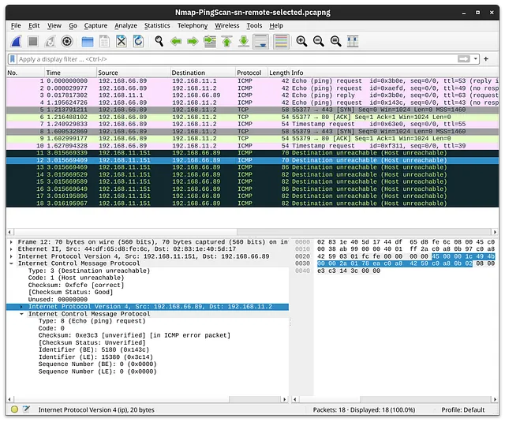
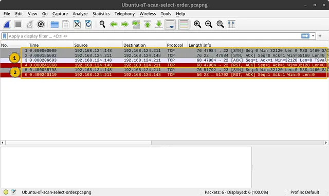
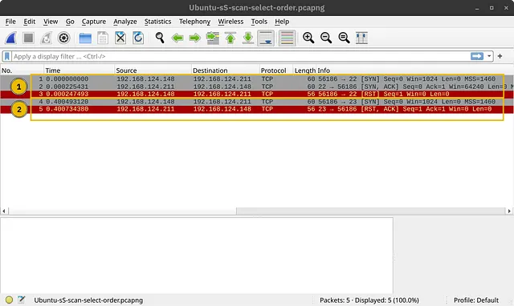
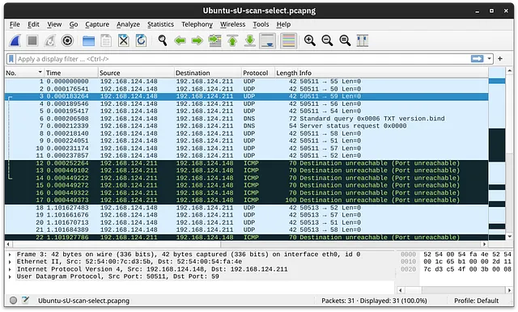
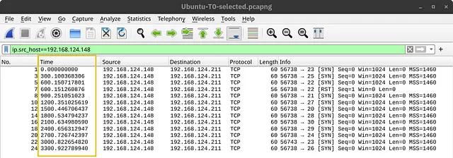
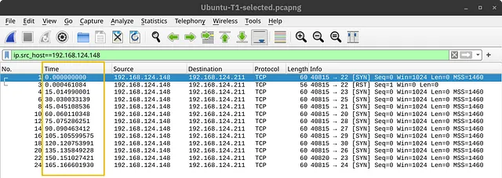
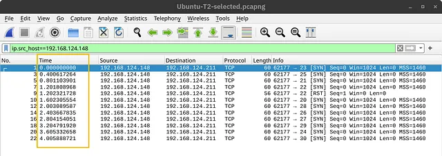
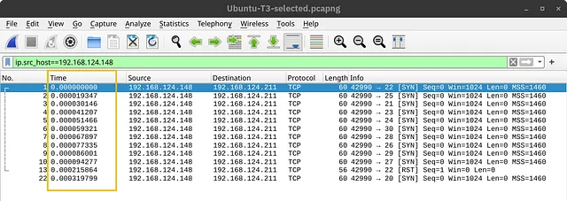

# Nmap The Basics

## Mục lục

1. [Task 1: Introduction](#task-1-introduction)
2. [Task 2: Host Discovery: Finding Who is Online](#task-2-host-discovery-finding-who-is-online)
3. [Task 3: Port Scanning: Finding Open Services](#task-3-port-scanning-finding-open-services)
4. [Task 4: Version Detection: Extract More Information](#task-4-version-detection-extract-more-information)
5. [ Task 5: Timing: How Fast is Fast](#task-5-timing-how-fast-is-fast)
6. [Task 6: Output: Controlling What You See](#task-6-output-controlling-what-you-see)
7. [Task 7: Conclusion and Summary](#task-7-conclusion-and-summary)

## Nội dung


# Task 1: Introduction

**Giới thiệu**

Hãy tưởng tượng bạn đang kết nối với một mạng và sử dụng các tài nguyên mạng khác nhau, như email và duyệt web. Hai câu hỏi phát sinh. Đầu tiên là làm sao để phát hiện các thiết bị đang hoạt động khác trên mạng này hoặc các mạng khác. Thứ hai là làm sao để tìm ra các dịch vụ mạng đang chạy trên các thiết bị đó; ví dụ như SSH và máy chủ web.

Một cách tiếp cận là làm thủ công. Nếu được yêu cầu phát hiện thiết bị nào đang hoạt động trên mạng `192.168.1.0/24`, chúng ta có thể sử dụng các công cụ cơ bản như `ping`, `arp-scan` hoặc công cụ khác để kiểm tra 254 địa chỉ IP (trong tổng số 256 địa chỉ, nhưng 2 địa chỉ được dành riêng). Tuy nhiên, mỗi công cụ đều có giới hạn. Ví dụ, `ping` sẽ không trả về gì nếu tường lửa của hệ thống mục tiêu chặn lưu lượng ICMP. Ngoài ra, `arp-scan` chỉ hoạt động nếu thiết bị của bạn kết nối cùng mạng với mục tiêu (Ethernet hoặc WiFi). Tóm lại, đây sẽ là một sự lãng phí lớn về thời gian nếu không có công cụ đáng tin cậy và mạnh mẽ. Với công cụ phù hợp và đủ thời gian, bạn sẽ có danh sách các thiết bị đang hoạt động trên mạng mục tiêu. Chúng ta cần một công cụ linh hoạt có thể xử lý nhiều tình huống.

Việc phát hiện các dịch vụ đang chạy trên một máy cụ thể cũng tốn thời gian nếu chỉ dựa vào giải pháp thủ công hoặc script không hiệu quả. Ví dụ, có thể dùng `telnet` để kiểm tra từng cổng một, tuy nhiên, với hàng ngàn cổng cần kiểm tra, đây là một nhiệm vụ rất tốn thời gian, ngay cả khi có script tự động hóa các lần kết nối `telnet`.

Một giải pháp hiệu quả để xử lý cả hai yêu cầu trên (và nhiều hơn nữa) là công cụ quét mạng **Nmap**. Đây là một phần mềm mã nguồn mở lần đầu ra mắt năm 1997. Kể từ đó, Nmap đã được bổ sung nhiều tính năng và tuỳ chọn. Nó là một trình quét mạng mạnh mẽ và linh hoạt, có thể tùy chỉnh theo nhiều tình huống khác nhau.

---

**Mục tiêu học tập**

Phòng học này sẽ cung cấp cho bạn các kiến thức cơ bản cần thiết để sử dụng trình quét Nmap (hoặc đơn giản là `nmap`). Cụ thể, bạn sẽ học được cách:

* Phát hiện thiết bị hoạt động
* Tìm các dịch vụ mạng đang chạy trên thiết bị đó
* Phân biệt các loại quét cổng khác nhau
* Phát hiện phiên bản của các dịch vụ
* Kiểm soát thời gian thực hiện quét
* Định dạng kết quả đầu ra

# Task 2: Host Discovery: Finding Who is Online

**Phát hiện thiết bị hoạt động: Tìm xem ai đang online**

Nmap có thể được dùng để phát hiện thiết bị nào đang hoạt động trên mạng. Bạn có thể chỉ định mục tiêu theo nhiều cách khác nhau:

* **Dải IP (IP range):** Dùng cú pháp như `192.168.0.1-10` để quét nhiều địa chỉ IP.

* **Mạng con (IP subnet):** Dùng ký hiệu CIDR, ví dụ `192.168.0.1/24`, để quét tất cả các IP trong một mạng con.

* **Tên máy chủ (Hostname):** Dùng tên miền hoặc tên máy (ví dụ: `example.com`) để nhắm tới một máy cụ thể.

---

**Chi tiết hơn về các cách chỉ định mục tiêu trong Nmap:**

* **Dải IP với dấu `-`:** Nếu bạn muốn quét tất cả các IP từ `192.168.0.1` đến `192.168.0.10`, bạn có thể viết là `192.168.0.1-10`.

* **Mạng con với dấu `/`:** Nếu bạn muốn quét toàn bộ mạng con, có thể viết là `192.168.0.1/24`, tương đương với `192.168.0.0-255`.

* **Hostname:** Bạn cũng có thể chỉ định mục tiêu bằng tên máy, ví dụ `example.thm`.

---

**Ví dụ:**
Giả sử bạn muốn tìm các thiết bị đang online trong mạng. Nmap cung cấp tùy chọn `-sn`, tức là quét ping. Tuy nhiên, bạn không nên nghĩ rằng điều này chỉ giới hạn như lệnh `ping`. Cùng xem nó hoạt động ra sao.

### Scanning a “Local” Network
**Quét một mạng “cục bộ”**

Trong ngữ cảnh này, từ “cục bộ” (local) được dùng để chỉ mạng mà chúng ta đang kết nối trực tiếp, chẳng hạn như mạng Ethernet hoặc WiFi. Trong phần minh họa đầu tiên, chúng ta sẽ quét mạng WiFi mà ta đang kết nối.

Địa chỉ IP của chúng ta là `192.168.66.89`, và chúng ta sẽ quét mạng `192.168.66.0/24`.
Lệnh sử dụng là:

```
nmap -sn 192.168.66.0/24
```

Lệnh này và kết quả của nó được hiển thị trong phần terminal bên dưới.

```bash
root@tryhackme:~# nmap -sn 192.168.66.0/24
Starting Nmap 7.92 ( https://nmap.org ) at 2024-08-07 13:49 EEST
Nmap scan report for XiaoQiang (192.168.66.1)
Host is up (0.0069s latency).
MAC Address: 44:DF:65:D8:FE:6C (Unknown)
Nmap scan report for S190023240007 (192.168.66.88)
Host is up (0.090s latency).
MAC Address: 7C:DF:A1:D3:8C:5C (Espressif)
Nmap scan report for wlan0 (192.168.66.97)
Host is up (0.20s latency).
MAC Address: 10:D5:61:E2:18:E6 (Tuya Smart)
Nmap scan report for 192.168.66.179
Host is up (0.10s latency).
MAC Address: E4:AA:EC:8F:88:C9 (Tianjin Hualai Technology)
[...]
Nmap done: 256 IP addresses (7 hosts up) scanned in 2.64 seconds
```
Lệnh này sẽ thực hiện một **quét ping** (ping scan) và cho bạn biết thiết bị nào đang hoạt động trên mạng cục bộ. Nmap sẽ gửi **yêu cầu ARP** để phát hiện thiết bị trong mạng cục bộ.
Với các mạng từ xa, Nmap sử dụng **ICMP echo requests** (ping) và có thể dùng thêm các gói SYN và ACK.

---

### Scanning a “Remote” Network

>Quét một mạng “từ xa” (Remote Network)

Xét trường hợp một mạng "từ xa". Trong ngữ cảnh này, “từ xa” nghĩa là có ít nhất một bộ định tuyến (router) ngăn cách hệ thống của bạn với mạng mục tiêu.
Vì vậy, mọi lưu lượng truy cập đến hệ thống mục tiêu phải đi qua một hoặc nhiều router.

Không giống như mạng cục bộ, khi quét mạng từ xa, bạn **không thể gửi yêu cầu ARP** tới thiết bị đích.

Ví dụ:

* Hệ thống của bạn có địa chỉ IP là `192.168.66.89` và thuộc mạng `192.168.66.0/24`.
* Trong ví dụ bên dưới, bạn quét mạng mục tiêu `192.168.11.0/24`, nơi có ít nhất 2 router (hops) ngăn cách mạng cục bộ của bạn với các máy chủ mục tiêu.

```bash
root@tryhackme:~# nmap -sn 192.168.11.0/24
Starting Nmap 7.92 ( https://nmap.org ) at 2024-08-07 14:05 EEST
Nmap scan report for 192.168.11.1
Host is up (0.018s latency).
Nmap scan report for 192.168.11.151
Host is up (0.0013s latency).
Nmap scan report for 192.168.11.152
Host is up (0.13s latency).
Nmap scan report for 192.168.11.154
Host is up (0.22s latency).
Nmap scan report for 192.168.11.155
Host is up (2.3s latency).
Nmap done: 256 IP addresses (5 hosts up) scanned in 10.67 seconds
```

**Đầu ra của Nmap cho thấy có năm thiết bị đang hoạt động. Vậy Nmap đã phát hiện chúng như thế nào?**

Để hiểu rõ hơn, ta xem một số lưu lượng mẫu được Nmap tạo ra. Trong ảnh chụp màn hình bên dưới, có phản hồi từ hai thiết bị:

* `192.168.11.1` đang hoạt động và đã phản hồi lại yêu cầu ICMP echo (ping).

* `192.168.11.2` có vẻ như không hoạt động. Nmap đã gửi:

  * hai yêu cầu ICMP echo (ping),
  * hai yêu cầu ICMP timestamp,
  * hai gói TCP đến cổng 443 với cờ SYN bật,
  * hai gói TCP đến cổng 80 với cờ ACK bật.

Thiết bị đích không phản hồi bất kỳ gói nào. Thay vào đó, ta nhận được nhiều gói ICMP “destination unreachable” từ router có địa chỉ `192.168.11.151`.



Bạn cần lưu ý rằng Nmap cho phép kiểm soát chi tiết hơn cách phát hiện các thiết bị đang hoạt động bằng các tùy chọn như:

* `-PS[portlist]` – gửi TCP SYN
* `-PA[portlist]` – gửi TCP ACK
* `-PU[portlist]` – gửi gói UDP

Tuy nhiên, các chi tiết này nằm ngoài phạm vi của phần học này.

---

**Quét danh sách với tùy chọn `-sL`:**

* Tùy chọn `-sL` dùng để liệt kê các mục tiêu sẽ được quét **mà không thực hiện quét thật sự**.
* Ví dụ:

  ```
  nmap -sL 192.168.0.1/24
  ```

  sẽ liệt kê ra 256 địa chỉ IP mục tiêu mà Nmap sẽ quét.

Tùy chọn này rất hữu ích để xác nhận danh sách mục tiêu trước khi quét thật sự.

---

### Trả lời câu hỏi

**Câu hỏi:**

*Địa chỉ IP cuối cùng sẽ được quét nếu mục tiêu là `192.168.0.1/27` là gì?*

**Trả lời:** `192.168.0.31`

```bash
nmap -sL 192.168.0.1/27
```

---

# Task 3: Port Scanning: Finding Open Services
**Quét cổng: Tìm các dịch vụ đang mở**

Nmap cũng được dùng để phát hiện những **dịch vụ** nào đang lắng nghe (đang hoạt động) trên các thiết bị thông qua việc quét các cổng mở. Một số dịch vụ phổ biến bao gồm:

* Máy chủ web (lắng nghe tại **TCP port 80** và **443**)
* Máy chủ DNS (lắng nghe tại **UDP port 53**)

---

### **TCP Scan:**

Cách đơn giản nhất để kiểm tra một cổng TCP có mở hay không là thử kết nối đến nó.
Điều này được thực hiện bằng **quét kết nối (connect scan)** với tùy chọn `-sT`, thực hiện toàn bộ quá trình **bắt tay ba bước (TCP three-way handshake)**.

**Ví dụ lệnh:**

```
nmap -sT 192.168.1.1
```

---

Trong ảnh minh họa phía dưới:

* Máy quét có địa chỉ IP: `192.168.124.148`
* Hệ thống mục tiêu có:

  * Cổng TCP 22 **mở**
  * Cổng TCP 23 **đóng**

**Chi tiết:**

* Vị trí được đánh dấu (1): cho thấy quá trình bắt tay TCP ba bước được hoàn tất, sau đó bị kết thúc bằng gói **TCP RST-ACK** do Nmap gửi.
* Vị trí (2): cho thấy nỗ lực kết nối tới một cổng đã đóng, hệ thống mục tiêu phản hồi bằng một gói **TCP RST-ACK** để báo hiệu từ chối kết nối.



### **Quét SYN (SYN Scan – Stealth Scan):**

**SYN scan** (sử dụng tùy chọn `-sS`) là phương pháp quét nhanh hơn và ít bị ghi nhận (log) hơn vì nó chỉ gửi gói **SYN ban đầu** mà **không hoàn tất bắt tay TCP**. Điều này rất hữu ích khi bạn cần thực hiện quét một cách bí mật.

**Ví dụ lệnh:**

```
nmap -sS 192.168.1.1
```

---

Trong ảnh minh họa bên dưới:

* Quét được thực hiện trên cùng hệ thống có **port 22 đang mở**.

* Phần được đánh dấu **(1)**:

  * Dịch vụ đang lắng nghe phản hồi bằng gói **SYN-ACK**.
  * Nmap sau đó **không hoàn tất** bắt tay TCP mà thay vào đó gửi gói **RST**, từ chối kết nối — điều này giúp tránh bị ghi log.

* Phần được đánh dấu **(2)**:

  * Là nỗ lực kết nối đến **một cổng đóng**.
  * Mục tiêu phản hồi bằng gói **TCP RST**, giống như trong kiểu quét connect (`-sT`).



Example Output:

```bash
22/tcp open  ssh
```

### **Quét UDP (UDP Scan – User Datagram Protocol)**

Một số dịch vụ như **DNS** sử dụng **UDP** thay vì TCP. UDP **không yêu cầu bắt tay (handshake)**, nên khó phát hiện cổng mở hơn. Tuy nhiên, Nmap vẫn có thể quét cổng UDP bằng tùy chọn `-sU`.

---

**Ví dụ lệnh:**

```
nmap -sU 192.168.1.1
```

---

Nmap sử dụng tùy chọn `-sU` để quét các dịch vụ UDP.
Do UDP đơn giản hơn TCP, lưu lượng phản hồi sẽ khác biệt. Ảnh minh họa bên dưới cho thấy nhiều gói ICMP phản hồi với thông báo **destination unreachable (port unreachable)** khi Nmap gửi gói UDP tới các cổng UDP đã đóng.



### **Giới hạn cổng mục tiêu**

Mặc định, Nmap sẽ quét **1.000 cổng phổ biến nhất**. Tuy nhiên, bạn có thể tùy chỉnh phạm vi cổng với các tùy chọn sau:

---

* `-F`: **Chế độ nhanh** (Fast mode) – chỉ quét **100 cổng phổ biến nhất** thay vì 1.000.

* `-p[range]`: Cho phép bạn **chỉ định phạm vi cổng** để quét. Ví dụ:

  * `-p10-1024`: quét từ cổng 10 đến 1024.
  * `-p-25`: quét từ cổng 1 đến 25.
  * `-p-`: quét **tất cả các cổng** (tương đương với `-p1-65535`) – thích hợp khi bạn cần **quét kỹ lưỡng toàn bộ**.

---

### **Tóm tắt tùy chọn Nmap:**

| Tùy chọn    | Mô tả                                                            |
| ----------- | ---------------------------------------------------------------- |
| `-sT`       | Quét TCP connect – bắt tay 3 bước đầy đủ                         |
| `-sS`       | Quét TCP SYN – chỉ gửi SYN, không hoàn tất bắt tay (ẩn danh hơn) |
| `-sU`       | Quét UDP                                                         |
| `-F`        | Chế độ nhanh – quét 100 cổng phổ biến nhất                       |
| `-p[range]` | Chỉ định phạm vi cổng để quét                                    |
| `-p-`       | Quét tất cả các cổng (1 đến 65535)                               |


**Trả lời các câu hỏi dưới đây**

---

**Câu hỏi:**
*Có bao nhiêu cổng TCP đang mở trên hệ thống mục tiêu tại `10.10.100.85`?*

**Trả lời:** `6`

```bash
nmap -sT 10.10.100.85
```

---

**Câu hỏi:**
*Tìm máy chủ web đang lắng nghe trên `10.10.100.85` và truy cập nó bằng trình duyệt. Cờ (flag) xuất hiện trên trang chính là gì?*
**Trả lời:** `THM{SECRET_PAGE_38B9P6}`

```bash
Port 8008 http open
Open Browser

http://10.10.100.85:8008/
```

---

# Task 4: Version Detection: Extract More Information
**Phát hiện phiên bản: Trích xuất thêm thông tin**

---

### **Phát hiện hệ điều hành (OS Detection)**

Nmap có thể **đoán hệ điều hành** của mục tiêu bằng tùy chọn `-O`.
Nó sẽ so sánh phản hồi mạng nhận được với các dấu vết (fingerprints) đã biết và trả về một **phiên bản hệ điều hành ước lượng**.

---

**Ví dụ lệnh:**

```
nmap -O 192.168.1.1
```

---

Thực tế, không có bộ dò hệ điều hành nào là hoàn hảo.
Tuy nhiên, nếu kết quả trả về là hệ điều hành nằm trong khoảng từ **4.15 đến 5.8**, thì đó là ước đoán rất gần nếu hệ điều hành thực tế của mục tiêu là **5.15**.

```bash
root@tryhackme:~# nmap -sS -O 192.168.124.211 
Starting Nmap 7.94SVN ( https://nmap.org ) at 2024-08-13 13:37 EEST
Nmap scan report for ubuntu22lts-vm (192.168.124.211)
Host is up (0.00043s latency).
Not shown: 999 closed tcp ports (reset)
PORT   STATE SERVICE
22/tcp open  ssh
MAC Address: 52:54:00:54:FA:4E (QEMU virtual NIC)
Device type: general purpose
Running: Linux 4.X|5.X
OS CPE: cpe:/o:linux:linux_kernel:4 cpe:/o:linux:linux_kernel:5
OS details: Linux 4.15 - 5.8
Network Distance: 1 hop
OS detection performed. Please report any incorrect results at https://nmap.org/submit/ .
Nmap done: 1 IP address (1 host up) scanned in 1.44 seconds
```

### **Phát hiện dịch vụ và phiên bản (Service and Version Detection)**

Nếu bạn muốn có thêm thông tin chi tiết về các dịch vụ đang chạy trên các cổng mở, bạn có thể sử dụng tùy chọn **phát hiện phiên bản**:

```
-sV
```

Tùy chọn này giúp xác định chính xác **phần mềm và phiên bản** đang chạy trên máy chủ mục tiêu.

---

**Ví dụ lệnh:**

```
nmap -sV 192.168.1.1
```

---

Kết quả trong terminal sẽ hiển thị thêm một cột **“VERSION”**, cho biết phiên bản phần mềm dịch vụ, ví dụ như phiên bản của máy chủ SSH.

```bash
root@tryhackme:~# nmap -sS -sV 192.168.124.211
Starting Nmap 7.94SVN ( https://nmap.org ) at 2024-08-13 13:33 EEST
Nmap scan report for ubuntu22lts-vm (192.168.124.211)
Host is up (0.000046s latency).
Not shown: 999 closed tcp ports (reset)
PORT   STATE SERVICE VERSION
22/tcp open  ssh     OpenSSH 8.9p1 Ubuntu 3ubuntu0.10 (Ubuntu Linux; protocol 2.0)
MAC Address: 52:54:00:54:FA:4E (QEMU virtual NIC)
Service Info: OS: Linux; CPE: cpe:/o:linux:linux_kernel
Service detection performed. Please report any incorrect results at https://nmap.org/submit/ .
Nmap done: 1 IP address (1 host up) scanned in 0.25
```

### **Kết hợp các tính năng:**

Bạn có thể kết hợp `-O`, `-sV` và các tùy chọn khác bằng một lệnh duy nhất:

```
-A
```

Tùy chọn `-A` sẽ kích hoạt:

* Phát hiện hệ điều hành (OS detection)
* Quét phiên bản (version detection)
* Traceroute
* Và các tính năng bổ sung khác

---

### **Cưỡng ép quét (Forcing the Scan):**

Khi thực hiện quét cổng (ví dụ với `-sS`), có thể mục tiêu không phản hồi trong giai đoạn phát hiện thiết bị (host discovery), ví dụ khi mục tiêu không trả lời ICMP.
Kết quả: Nmap sẽ đánh dấu thiết bị là “không hoạt động” và **không quét cổng**.

Để buộc Nmap **coi tất cả các thiết bị là đang hoạt động**, kể cả khi chúng không phản hồi trong giai đoạn host discovery, bạn dùng tùy chọn:

```
-Pn
```

---

### **Tóm tắt các tùy chọn:**

| Tùy chọn | Mô tả                                                                          |
| -------- | ------------------------------------------------------------------------------ |
| `-O`     | Phát hiện hệ điều hành (OS detection)                                          |
| `-sV`    | Phát hiện dịch vụ và phiên bản                                                 |
| `-A`     | Gồm `-O`, `-sV`, traceroute và nhiều tính năng khác                            |
| `-Pn`    | Quét cả những thiết bị không phản hồi trong quá trình host discovery (ép buộc) |


### **Trả lời câu hỏi dưới đây**

---

**Câu hỏi:**
*Tên và phiên bản được phát hiện của web server đang chạy trên `10.10.100.85` là gì?*

**Trả lời:** `lighttpd 1.4.74`

(Lệnh sử dụng: `nmap -sV 10.10.100.85`)

# Task 5: Timing: How Fast is Fast
**Tốc độ quét: Nhanh đến mức nào là nhanh?**

Nmap cho phép bạn điều chỉnh **tốc độ quét** để:

* Giảm khả năng bị phát hiện
* Tránh bị các công cụ bảo mật chặn

Có **6 mẫu thời gian (timing templates)** mà bạn có thể sử dụng:

* `T0` – paranoid (rất chậm)
* `T1` – sneaky
* `T2` – polite
* `T3` – normal (mặc định)
* `T4` – aggressive
* `T5` – insane (rất nhanh)

---

**Ví dụ lệnh:**

```bash
nmap -sS -T4 192.168.1.1
```

---

Trong ví dụ, lệnh:

```bash
nmap -sS 10.10.100.85 -F
```

được lặp lại với các giá trị `T0` đến `T4`. Mỗi chế độ mất thời gian khác nhau để quét 100 cổng.

---

### **Thời gian thực tế đo được trong phòng lab:**

| Timing          | Tổng thời gian thực hiện |
| --------------- | ------------------------ |
| T0 (paranoid)   | 9.8 giờ                  |
| T1 (sneaky)     | 27.5 phút                |
| T2 (polite)     | 40.56 giây               |
| T3 (normal)     | 0.15 giây                |
| T4 (aggressive) | 0.13 giây                |

---

Trong hình minh họa bên dưới, khi sử dụng `T0`, bạn có thể thấy Nmap **chờ đến 5 phút** trước khi chuyển sang cổng tiếp theo.



Trong ảnh chụp màn hình bên dưới, Nmap đã chờ 15 giây giữa mỗi hai cổng khi chúng ta đặt thời gian quét là T1.



Sau đó, thời gian chờ giảm xuống còn 0.4 giây với T2 như được hiển thị bên dưới.



Cuối cùng, trong trường hợp mặc định, T3, Nmap dường như đã chạy nhanh nhất có thể, như được hiển thị bên dưới. Cần nhắc lại rằng điều này có thể khác trên một thiết lập phòng lab khác. Tuy nhiên, trong trường hợp cụ thể này, Nmap cho rằng kết nối đến mục tiêu là nhanh và ổn định, vì không xảy ra mất gói tin nào.



Một tùy chọn hữu ích thứ hai là số lượng kiểm tra dịch vụ song song. Số lượng kiểm tra song song có thể được điều chỉnh bằng `--min-parallelism <numprobes>` và `--max-parallelism <numprobes>`. Các tùy chọn này có thể được sử dụng để đặt giới hạn tối thiểu và tối đa cho số lượng kiểm tra cổng TCP và UDP được thực hiện đồng thời trên một nhóm máy chủ. Theo mặc định, `nmap` sẽ tự động kiểm soát số lượng kiểm tra song song. Nếu mạng hoạt động kém, ví dụ như làm rơi gói tin, số lượng kiểm tra song song có thể giảm xuống chỉ còn một; hơn nữa, nếu mạng hoạt động hoàn hảo, số lượng kiểm tra song song có thể đạt tới vài trăm.

Một tùy chọn hữu ích tương tự là `--min-rate <number>` và `--max-rate <number>`. Như tên gọi, chúng có thể kiểm soát tốc độ tối thiểu và tối đa mà `nmap` gửi các gói tin. Tốc độ được cung cấp theo đơn vị **số gói tin mỗi giây**. Cần lưu ý rằng tốc độ được chỉ định áp dụng cho toàn bộ quá trình quét chứ không phải chỉ một máy chủ đơn lẻ.

Tùy chọn cuối cùng chúng ta sẽ đề cập trong nhiệm vụ này là `--host-timeout <time>`. Tùy chọn này xác định thời gian tối đa mà bạn sẵn sàng chờ, và nó phù hợp với các máy chủ chậm hoặc có kết nối mạng chậm.

| Tùy chọn                                                           | Giải thích                                                                                      |
| ------------------------------------------------------------------ | ----------------------------------------------------------------------------------------------- |
| `-T<0-5>`                                                          | Mẫu thời gian – paranoid (0), sneaky (1), polite (2), normal (3), aggressive (4), và insane (5) |
| `--min-parallelism <numprobes>` và `--max-parallelism <numprobes>` | Số lượng kiểm tra song song tối thiểu và tối đa                                                 |
| `--min-rate <number>` và `--max-rate <number>`                     | Tốc độ gửi gói tối thiểu và tối đa (gói/giây)                                                   |
| `--host-timeout`                                                   | Thời gian tối đa chờ đợi một máy chủ mục tiêu                                                   |


### **Trả lời các câu hỏi dưới đây**

**Câu hỏi:**

*Dạng tương đương không phải số của `-T4` là gì?*

**Trả lời:** `-T aggressive`

# Task 6: Output: Controlling What You See
**Output: Kiểm soát những gì bạn thấy**

Nhiệm vụ này tập trung vào hai tính năng chính:

* Hiển thị thông tin bổ sung trong khi quét diễn ra
* Chọn định dạng tệp để lưu báo cáo quét

**Ví dụ:**

```
nmap -sS 192.168.1.1 -oA scan_results
```

Lệnh này sẽ lưu kết quả quét ở ba định dạng: `.nmap`, `.xml`, và `.gnmap`.

---

### **Chi tiết và Gỡ lỗi**

Cách tốt nhất để nhận được thêm thông tin cập nhật về những gì đang xảy ra là bật chế độ đầu ra chi tiết bằng cách thêm tùy chọn `-v`.

```bash
root@tryhackme:~# nmap 192.168.139.1/24 -v
Starting Nmap 7.92 ( https://nmap.org ) at 2024-08-13 19:01 EEST
Initiating ARP Ping Scan at 19:01
Scanning 255 hosts [1 port/host]
Completed ARP Ping Scan at 19:01, 7.94s elapsed (255 total hosts)
Initiating Parallel DNS resolution of 1 host. at 19:01
Completed Parallel DNS resolution of 1 host. at 19:02, 13.00s elapsed
Nmap scan report for 192.168.139.0 [host down]
Nmap scan report for 192.168.139.2 [host down]
[...]
Nmap scan report for 192.168.139.253 [host down]
Nmap scan report for 192.168.139.255 [host down]
Initiating Parallel DNS resolution of 1 host. at 19:02
Completed Parallel DNS resolution of 1 host. at 19:02, 0.05s elapsed
Initiating SYN Stealth Scan at 19:02
Scanning 192.168.139.254 [1000 ports]
[...]
Initiating SYN Stealth Scan at 19:02
Scanning g5000 (192.168.139.1) [1000 ports]
Discovered open port 902/tcp on 192.168.139.1
Completed SYN Stealth Scan at 19:02, 0.03s elapsed (1000 total ports)
Nmap scan report for g5000 (192.168.139.1)
Host is up (0.0000090s latency).
Not shown: 999 closed tcp ports (reset)
PORT    STATE SERVICE
902/tcp open  iss-realsecure

Read data files from: /usr/bin/../share/nmap
Nmap done: 256 IP addresses (2 hosts up) scanned in 42.19 seconds
           Raw packets sent: 3512 (146.336KB) | Rcvd: 2005 (84.156KB)

```

Rất có thể, tùy chọn `-v` là đủ để tạo ra đầu ra chi tiết; tuy nhiên, nếu bạn vẫn chưa hài lòng, bạn có thể tăng mức độ chi tiết bằng cách thêm một hoặc nhiều chữ “v” như `-vv` hoặc thậm chí `-vvvv`. Bạn cũng có thể chỉ định trực tiếp mức độ chi tiết, ví dụ: `-v2` và `-v4`. Bạn thậm chí có thể tăng mức độ chi tiết bằng cách nhấn “v” sau khi quá trình quét đã bắt đầu.

Nếu tất cả mức độ chi tiết này vẫn chưa làm bạn hài lòng, bạn cần cân nhắc đến tùy chọn `-d` để tạo ra đầu ra ở mức độ gỡ lỗi. Tương tự, bạn có thể tăng mức độ gỡ lỗi bằng cách thêm một hoặc nhiều chữ “d” hoặc chỉ định trực tiếp mức độ gỡ lỗi. Mức tối đa là `-d9`; trước khi chọn mức này, hãy đảm bảo rằng bạn sẵn sàng với hàng ngàn dòng thông tin và gỡ lỗi.

---

**Lưu Báo Cáo Quét**

Trong nhiều trường hợp, chúng ta sẽ cần lưu kết quả quét. Nmap cung cấp nhiều định dạng. Ba định dạng hữu ích nhất là đầu ra chuẩn (dễ đọc cho con người), đầu ra XML, và đầu ra có thể dùng với `grep`, dựa theo lệnh `grep`. Bạn có thể chọn định dạng báo cáo như sau:

* `-oN <filename>` – đầu ra chuẩn
* `-oX <filename>` – đầu ra XML
* `-oG <filename>` – đầu ra cho `grep` (hữu ích cho `grep` và `awk`)
* `-oA <basename>` – đầu ra ở tất cả định dạng chính

Trong terminal bên dưới, chúng ta có thể thấy một ví dụ về việc dùng tùy chọn `-oA`. Nó tạo ra ba báo cáo với đuôi `.nmap`, `.xml`, và `.gnmap` tương ứng với đầu ra chuẩn, XML, và `grep`.


```bash
root@tryhackme:~# nmap -sS 192.168.139.1 -oA gateway
Starting Nmap 7.92 ( https://nmap.org ) at 2024-08-13 19:35 EEST
Nmap scan report for g5000 (192.168.139.1)
Host is up (0.0000070s latency).
Not shown: 999 closed tcp ports (reset)
PORT    STATE SERVICE
902/tcp open  iss-realsecure
Nmap done: 1 IP address (1 host up) scanned in 0.13 seconds
# ls
gateway.gnmap  gateway.nmap  gateway.xml
```

### **Trả lời các câu hỏi dưới đây**

*Cần thêm tùy chọn nào vào lệnh `nmap` để bật chế độ gỡ lỗi?*

**Trả lời:** `-d`

# Task 7: Conclusion and Summary
> Kết luận và Tóm tắt

Trong phòng này, chúng ta đã học cách sử dụng Nmap để phát hiện các máy chủ đang hoạt động trên bất kỳ mạng nào. Chúng ta cũng đã khám phá các loại quét cổng phổ biến và cách sử dụng Nmap để tìm phiên bản dịch vụ. Chúng ta cũng đã học cách kiểm soát tốc độ quét và cuối cùng là các định dạng khác nhau để lưu kết quả quét của Nmap.

Cần lưu ý rằng nên chạy Nmap với quyền sudo để có thể sử dụng đầy đủ tất cả các tính năng của nó. Chạy Nmap với quyền người dùng thông thường vẫn sẽ hoạt động; tuy nhiên, bạn nên mong đợi nhiều tính năng sẽ không khả dụng. Khi đó bạn chỉ sử dụng được một phần rất nhỏ sức mạnh của Nmap. Ví dụ, Nmap sẽ tự động sử dụng quét SYN (`-sS`) nếu bạn chạy nó với quyền sudo và sẽ mặc định sử dụng quét kết nối (`-sT`) nếu chạy với quyền người dùng thông thường. Nguyên nhân là vì việc tạo ra một số gói nhất định, như gói TCP SYN, yêu cầu quyền root.


| **Tùy chọn**                                                      | **Giải thích**                                                                                          |
| ----------------------------------------------------------------- | ------------------------------------------------------------------------------------------------------- |
| `-sL`                                                             | Quét danh sách – liệt kê các mục tiêu mà không thực hiện quét                                           |
| `-sn`                                                             | Quét ping – chỉ phát hiện máy chủ                                                                       |
| `-sT`                                                             | Quét kết nối TCP – hoàn tất bắt tay ba bước                                                             |
| `-sS`                                                             | TCP SYN – chỉ bước đầu của bắt tay ba bước                                                              |
| `-sU`                                                             | Quét UDP                                                                                                |
| `-F`                                                              | Chế độ nhanh – quét 100 cổng phổ biến nhất                                                              |
| `-p[range]`                                                       | Chỉ định dải số cổng – `-p-` quét tất cả các cổng                                                       |
| `-Pn`                                                             | Xem tất cả máy chủ là trực tuyến – quét cả máy chủ không phản hồi                                       |
| `-O`                                                              | Phát hiện hệ điều hành                                                                                  |
| `-sV`                                                             | Phát hiện phiên bản dịch vụ                                                                             |
| `-A`                                                              | Phát hiện hệ điều hành, phiên bản, và các thông tin bổ sung                                             |
| `-T<0-5>`                                                         | Mẫu thời gian – cẩn trọng (0), lén lút (1), lịch sự (2), bình thường (3), hung hăng (4), điên cuồng (5) |
| `--min-parallelism <numprobes>` / `--max-parallelism <numprobes>` | Số lượng song song tối thiểu và tối đa của các gói dò                                                   |
| `--min-rate <number>` / `--max-rate <number>`                     | Tốc độ gửi gói tối thiểu và tối đa (gói/giây)                                                           |
| `--host-timeout`                                                  | Thời gian tối đa để chờ một máy chủ mục tiêu                                                            |
| `-v`, `-vv`, `-v4`                                                | Mức chi tiết đầu ra                                                                                     |
| `-d`, `-d9`                                                       | Mức gỡ lỗi đầu ra                                                                                       |
| `-oN <filename>`                                                  | Đầu ra thông thường                                                                                     |
| `-oX <filename>`                                                  | Đầu ra XML                                                                                              |
| `-oG <filename>`                                                  | Đầu ra hỗ trợ grep (hữu ích cho `grep`, `awk`)                                                          |
| `-oA <basename>`                                                  | Đầu ra ở tất cả các định dạng chính                                                                     |


### **Trả lời các câu hỏi dưới đây**

*Câu hỏi:*
Nmap sẽ sử dụng loại quét nào nếu bạn chạy `nmap 10.10.100.85` với quyền người dùng cục bộ?

**Trả lời:** Connect Scan
