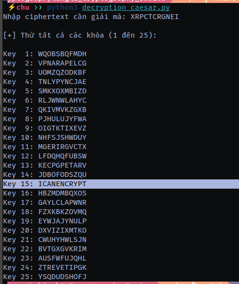
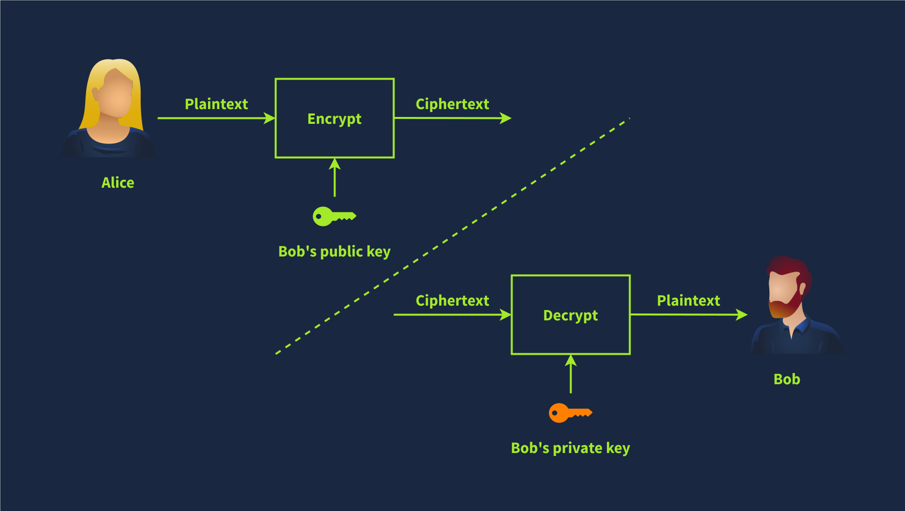

# Cryptography Basics

## Mục lục

1. [Task 1: Introduction](#task-1-introduction)
2. [Task 2: Importance of Cryptography](#task-2-common-use-of-asymmetric-encryption)
3. [Task 3: Plaintext to Ciphertext](#task-3-plaintext-to-ciphertext)
4. [Task 4: Historical Ciphers](#task-4-historical-ciphers)
5. [Task 5: Types of Encryption](#task-5-types-of-encryption)
6. [Task 6: Basic Math](#task-6-basic-math)

## Nội dung

# Task 1: Introduction

**Giới thiệu**

Hãy xem xét kịch bản sau đây trong cuộc sống hàng ngày. Giả sử bạn đang gặp một đối tác kinh doanh tại quán cà phê và thảo luận về các kế hoạch kinh doanh mang tính bảo mật. Hãy cùng phân tích cuộc gặp này từ góc nhìn bảo mật.

* Bạn có thể nhìn thấy và nghe thấy người kia. Do đó, rất dễ để chắc chắn về danh tính của họ. Đó là **xác thực (authentication)**, tức là bạn đang xác nhận danh tính của người mà bạn đang nói chuyện.

* Bạn cũng có thể xác nhận rằng những gì bạn đang “nghe thấy” thực sự đến từ đối tác kinh doanh của bạn. Bạn có thể phân biệt được từ ngữ và câu nói nào đến từ đối tác và cái nào đến từ người khác. Đó là **tính xác thực (authenticity)**, tức là bạn xác minh rằng thông điệp thực sự đến từ một người gửi cụ thể. Hơn nữa, bạn biết rằng những gì họ đang nói đến được truyền đạt nguyên vẹn đến bạn, không có khả năng bị ai đó thay đổi. Đó là **tính toàn vẹn (integrity)**, tức là đảm bảo rằng dữ liệu không bị thay đổi hoặc can thiệp.

* Cuối cùng, bạn có thể chọn ngồi cách xa những khách hàng khác và nói nhỏ để chỉ đối tác của bạn có thể nghe thấy. Đó là **tính bảo mật (confidentiality)**, tức là chỉ những bên được ủy quyền mới có thể truy cập dữ liệu.

Hãy nhanh chóng so sánh điều này với việc liên lạc trong không gian mạng. Khi ai đó gửi cho bạn một tin nhắn văn bản, làm sao bạn có thể chắc chắn họ đúng là người mà họ nói? Làm sao bạn có thể chắc rằng không ai đã thay đổi nội dung khi nó truyền qua các liên kết mạng khác nhau? Khi bạn giao tiếp với đối tác kinh doanh của mình qua một nền tảng nhắn tin trực tuyến, bạn cần phải chắc chắn về những điều sau:

* **Xác thực (Authentication):** Bạn muốn chắc rằng bạn đang giao tiếp với đúng người, không phải ai đó đang giả mạo.

* **Tính xác thực (Authenticity):** Bạn có thể xác minh rằng thông tin đến từ nguồn đã được khẳng định.

* **Tính toàn vẹn (Integrity):** Bạn phải đảm bảo rằng không ai thay đổi dữ liệu mà bạn trao đổi.

* **Tính bảo mật (Confidentiality):** Bạn muốn ngăn chặn bên không được ủy quyền nghe lén các cuộc trò chuyện của bạn.

Mật mã học có thể cung cấp giải pháp để đáp ứng các yêu cầu trên, cùng với nhiều yêu cầu khác. Mật mã khóa riêng (private key cryptography), tức mã hóa đối xứng, chủ yếu bảo vệ tính bảo mật. Tuy nhiên, mật mã khóa công khai (public key cryptography), tức mã hóa bất đối xứng, đóng vai trò quan trọng trong xác thực, tính xác thực và tính toàn vẹn. Phòng này sẽ trình bày các ví dụ khác nhau về cách mật mã khóa công khai đạt được điều đó.

**Mục tiêu học tập**

Trong phần này, chúng ta sẽ tìm hiểu về nhiều hệ mật mã bất đối xứng khác nhau và các ứng dụng sử dụng chúng, chẳng hạn như:

* RSA
* Diffie-Hellman
* SSH
* Chứng chỉ SSL/TLS
* PGP và GPG


# Task 2: Importance of Cryptography
**Tầm quan trọng của Mật mã học**

Mục đích cuối cùng của mật mã học là đảm bảo **giao tiếp an toàn trong sự hiện diện của các đối thủ**. Thuật ngữ “an toàn” bao gồm tính bảo mật và toàn vẹn của dữ liệu được truyền đạt. Mật mã học có thể được định nghĩa là thực hành và nghiên cứu các kỹ thuật để giao tiếp an toàn và bảo vệ dữ liệu trong trường hợp có sự hiện diện của các đối thủ và bên thứ ba. Nói cách khác, những đối thủ này không nên có khả năng tiết lộ hoặc thay đổi nội dung của các thông điệp.

Mật mã học được sử dụng để bảo vệ tính bảo mật, toàn vẹn và xác thực. Trong thời đại này, bạn sử dụng mật mã học hằng ngày, và bạn gần như chắc chắn đang đọc nội dung này qua một kết nối được mã hóa.

Hãy xem xét các tình huống sau đây khi bạn sẽ sử dụng mật mã học:

* Khi bạn đăng nhập vào TryHackMe, thông tin đăng nhập của bạn được mã hóa và gửi đến máy chủ để không ai có thể lấy được chúng bằng cách theo dõi kết nối của bạn.
* Khi bạn kết nối qua SSH, máy khách SSH của bạn và máy chủ thiết lập một đường hầm mã hóa để không ai có thể nghe lén phiên làm việc của bạn.
* Khi bạn thực hiện giao dịch ngân hàng trực tuyến, trình duyệt của bạn kiểm tra chứng chỉ của máy chủ từ xa để xác nhận rằng bạn đang giao tiếp với máy chủ ngân hàng và không phải máy chủ của kẻ tấn công.
* Khi bạn tải xuống một tệp, làm sao bạn kiểm tra được nó có được tải đúng không? Mật mã học cung cấp giải pháp thông qua các hàm băm để xác nhận rằng tệp của bạn giống hệt tệp gốc.

Như bạn thấy, bạn hiếm khi phải tương tác trực tiếp với mật mã học, nhưng các giải pháp và tác động của nó có mặt ở khắp nơi trong thế giới số. Hãy xem xét trường hợp một công ty muốn xử lý thông tin thẻ tín dụng và xử lý các giao dịch liên quan. Khi xử lý thẻ tín dụng, công ty phải tuân thủ và thực hiện các tiêu chuẩn của PCI DSS (Tiêu chuẩn Bảo mật Dữ liệu Ngành Thẻ Thanh toán). Trong trường hợp này, PCI DSS đảm bảo một mức độ bảo mật tối thiểu để lưu trữ, xử lý và truyền dữ liệu liên quan đến thẻ tín dụng. Nếu bạn kiểm tra [PCI DSS for Large Organizations](./PCI_DSS_for_Large_Organizations_v1.pdf), bạn sẽ thấy rằng dữ liệu phải được mã hóa cả khi được lưu trữ (at rest) và khi được truyền đi (in motion).

Tương tự như việc xử lý thông tin thẻ tín dụng yêu cầu tuân thủ PCI DSS, việc xử lý hồ sơ y tế yêu cầu tuân thủ các tiêu chuẩn tương ứng của chúng. Không giống như thẻ tín dụng, các tiêu chuẩn về xử lý hồ sơ y tế khác nhau tùy theo quốc gia. Các luật và quy định ví dụ cần được cân nhắc khi xử lý hồ sơ y tế bao gồm HIPAA (Đạo luật Trách nhiệm và Khả năng Giải trình Bảo hiểm Y tế) và HITECH (Công nghệ Thông tin Y tế cho Kinh tế và Sức khỏe Lâm sàng) ở Hoa Kỳ, GDPR (Quy định Bảo vệ Dữ liệu Chung) ở EU, DPA (Đạo luật Bảo vệ Dữ liệu) ở Vương quốc Anh. Mặc dù danh sách này không đầy đủ, nó cung cấp ý tưởng về các yêu cầu pháp lý mà các nhà cung cấp dịch vụ chăm sóc sức khỏe nên xem xét tùy thuộc vào quốc gia của họ. Các luật và quy định này cho thấy rằng mật mã học là điều cần thiết và nên được hiện diện, tuy nhiên thường bị ẩn đi khỏi quyền truy cập trực tiếp của người dùng.

**Trả lời câu hỏi sau:**

**Câu hỏi:** What is the standard required for handling credit card information?

**Trả lời:** PCI DSS


# Task 3: Plaintext to Ciphertext
>Chuyển đổi văn bản thuần túy thành văn bản mã hóa

Hãy bắt đầu với một minh họa trước khi giới thiệu các thuật ngữ chính. Chúng ta bắt đầu với bản rõ (plaintext) mà ta muốn mã hóa. Bản rõ là dữ liệu có thể đọc được; nó có thể là bất cứ thứ gì từ một từ đơn giản như “hello”, một bức ảnh mèo, thông tin thẻ tín dụng hoặc hồ sơ y tế. Từ góc nhìn của mật mã học, tất cả những thứ này đều là các “bản rõ” đang chờ được mã hóa. Bản rõ được đưa qua hàm mã hóa cùng với một khóa phù hợp; hàm mã hóa sẽ trả về bản mã (ciphertext). Hàm mã hóa là một phần của thuật toán mã hóa (cipher); một cipher là một thuật toán chuyển đổi bản rõ thành bản mã và ngược lại.


Để khôi phục bản rõ, ta phải đưa bản mã cùng với khóa phù hợp vào hàm giải mã, hàm này sẽ trả lại bản rõ ban đầu. Điều này được minh họa trong hình bên dưới.


Chúng ta vừa được giới thiệu một số thuật ngữ mới và cần học chúng để hiểu bất kỳ văn bản nào liên quan đến mật mã học. Các thuật ngữ được liệt kê dưới đây:

* **Plaintext** là thông điệp hoặc dữ liệu gốc, có thể đọc được trước khi được mã hóa. Nó có thể là một tài liệu, hình ảnh, tệp đa phương tiện hoặc bất kỳ dữ liệu nhị phân nào khác.
* **Ciphertext** là phiên bản bị xáo trộn, không thể đọc được của thông điệp sau khi được mã hóa. Lý tưởng nhất, chúng ta không thể thu được bất kỳ thông tin nào về bản rõ ban đầu ngoại trừ kích thước xấp xỉ của nó.
* **Cipher** là một thuật toán hoặc phương pháp để chuyển đổi bản rõ thành bản mã và ngược lại. Một cipher thường được phát triển bởi các nhà toán học.
* **Key** là một chuỗi bit mà cipher sử dụng để mã hóa hoặc giải mã dữ liệu. Nói chung, thuật toán cipher được công khai; tuy nhiên, key phải được giữ bí mật trừ khi nó là khóa công khai trong mã hóa bất đối xứng. Chúng ta sẽ tìm hiểu về mã hóa bất đối xứng trong một nhiệm vụ sau.
* **Encryption** là quá trình chuyển đổi bản rõ thành bản mã bằng cách sử dụng một thuật toán mã hóa và một khóa. Không giống như khóa, thuật toán mã hóa thường được công khai.
* **Decryption** là quá trình ngược lại của mã hóa, chuyển đổi bản mã trở lại thành bản rõ bằng cách sử dụng thuật toán mã hóa và khóa. Mặc dù thuật toán mã hóa có thể là công khai, việc khôi phục bản rõ mà không có kiến thức về khóa phải là điều bất khả thi (hoặc không khả thi).

**Trả lời các câu hỏi dưới đây**

- Câu 1: Bạn gọi văn bản thuần được mã hóa là gì?

**ciphertext**

- Câu 2: Bạn gọi quá trình trả lại văn bản thuần là gì?

**decryption**

---

# Task 4: Historical Ciphers

**Mật mã lịch sử**

Lịch sử của mật mã học rất lâu đời và có từ thời Ai Cập cổ đại vào năm 1900 trước Công nguyên. Tuy nhiên, một trong những mật mã lịch sử đơn giản nhất là Mật mã Caesar từ thế kỷ thứ nhất trước Công nguyên. Ý tưởng rất đơn giản: dịch chuyển mỗi chữ cái một số lần nhất định để mã hóa thông điệp.

Hãy xem ví dụ sau:

* Bản rõ (Plaintext): **TRYHACKME**
* Key: 3 (Giả sử đây là dịch chuyển sang phải 3 chữ cái)
* Cipher: Caesar Cipher (Mật mã Caesar)

Chúng ta có thể dễ dàng suy ra rằng T trở thành W, R trở thành U, Y trở thành B, và cứ tiếp tục như vậy. Như bạn thấy, khi chúng ta đến Z, chúng ta bắt đầu lại từ A. Do đó, chúng ta thu được bản mã (ciphertext) là **WUBKDFNPH**.


Để giải mã, chúng ta cần các thông tin sau:

* Bản mã (Ciphertext): **WUBKDFNPH**
* Key: 3
* Cipher: Mật mã Caesar


Để mã hóa, chúng ta dịch chuyển sang phải 3 ký tự; để giải mã, chúng ta dịch chuyển sang trái 3 ký tự để khôi phục văn bản gốc, như đã minh họa trong hình trên. Tuy nhiên, nếu ai đó đưa cho bạn một bản mã và nói rằng nó được mã hóa bằng Mật mã Caesar, việc khôi phục văn bản gốc sẽ là một nhiệm vụ đơn giản vì chỉ có 25 khóa khả thi. Bảng chữ cái tiếng Anh có 26 chữ cái, và việc dịch chuyển 26 ký tự sẽ giữ nguyên ký tự đó; do đó, có 25 khóa hợp lệ để mã hóa bằng Mật mã Caesar. Hình bên dưới cho thấy cách giải mã có thể thành công bằng cách thử tất cả các khóa khả thi; trong trường hợp này, chúng ta đã khôi phục thông điệp gốc với **khóa = 5**. Do đó, theo các tiêu chuẩn ngày nay, khi mật mã là công khai, **Mật mã Caesar bị coi là không an toàn**.


Bạn có thể bắt gặp nhiều loại mật mã lịch sử khác trong các bộ phim và sách về mật mã học. Ví dụ bao gồm:

* Mật mã Vigenère từ thế kỷ 16
* Máy Enigma từ Thế chiến thứ hai
* Bảng mã sử dụng một lần (one-time pad) từ thời Chiến tranh Lạnh

---
**Trả lời câu hỏi sau**

Biết rằng **XRPCTCRGNEI** đã được mã hóa bằng Mật mã Caesar, văn bản gốc là:

**Câu trả lời**: ICANENCRYPT

---

Mật mã Caesar là một dạng **mã thay thế đơn giản**, trong đó mỗi chữ cái trong bản rõ được dịch chuyển đi một số vị trí cố định trong bảng chữ cái. Ví dụ, với dịch chuyển là +3: A → D, B → E, ..., Z → C.

Do tính đơn giản này, mã Caesar rất dễ bị tấn công và giải mã. Dưới đây là **các kỹ thuật tấn công giải mã mật mã Caesar** phổ biến:

---

### 1. **Tấn công vét cạn (Brute-force attack)**

* **Ý tưởng**: Thử tất cả các khóa có thể (có 25 khóa nếu chỉ xét bảng chữ cái tiếng Anh).
* **Cách thực hiện**: Thử giải mã bản mã với từng giá trị dịch chuyển từ 1 đến 25, và quan sát kết quả để tìm văn bản rõ ràng có nghĩa.
* **Hiệu quả**: Rất cao, vì không gian khóa nhỏ.
* **Ví dụ**:

  * Bản mã: `Fdhvdu`
  * Thử tất cả các giá trị dịch chuyển, ta sẽ thấy khi dịch chuyển -3 sẽ được: `Caesar`

---

### 2. **Tấn công phân tích tần suất (Frequency analysis)**

* **Ý tưởng**: Dựa vào tần suất xuất hiện của các chữ cái trong ngôn ngữ tự nhiên.
* **Cách thực hiện**:

  * Phân tích tần suất các chữ cái xuất hiện trong bản mã.
  * So sánh với bảng tần suất chuẩn của ngôn ngữ (ví dụ: trong tiếng Anh, chữ 'E' thường xuất hiện nhiều nhất).
  * Suy luận ra khóa dịch chuyển.
* **Ưu điểm**: Có thể dùng khi bản mã đủ dài, cho kết quả nhanh hơn brute-force.
* **Ví dụ**:

  * Nếu chữ thường xuất hiện nhất trong bản mã là `K`, và biết trong tiếng Anh chữ thường xuất hiện nhất là `E`, có thể suy ra dịch chuyển là `K` → `E` → khóa là -6.

---

### 3. **Tấn công dựa trên từ điển (Known-word attack)**

* **Ý tưởng**: Nếu biết hoặc đoán trước được một vài từ trong bản rõ (ví dụ: “THE”, “ATTACK”,...), có thể thử giải mã với các khóa sao cho từ đó xuất hiện.
* **Cách thực hiện**:

  * Dò qua các khóa có thể, kiểm tra xem bản rõ có chứa từ được biết trước không.
* **Hiệu quả**: Cao nếu đoán được từ khóa.

---

### 4. **Tấn công dựa trên bản rõ tương ứng (Known-plaintext attack)**

* **Ý tưởng**: Nếu biết một đoạn bản rõ và bản mã tương ứng, có thể dễ dàng tính được khóa.
* **Cách thực hiện**:

  * Lấy một cặp ký tự tương ứng giữa bản rõ và bản mã.
  * Tính khóa: `k = (bản mã - bản rõ) mod 26`
* **Ví dụ**:

  * Bản rõ: `A`, bản mã: `D` → khóa: `(D - A) mod 26 = 3`

---

### 5. **Tấn công dựa trên đoạn mã đã biết (Chosen plaintext/ciphertext attack)**

* **Không thực tế với Caesar trong môi trường thực tế hiện đại**, nhưng về lý thuyết:

  * **Chosen plaintext**: Nếu có quyền chọn văn bản rõ để mã hóa, chỉ cần chọn `A`, rồi nhìn kết quả → biết được khóa.
  * **Chosen ciphertext**: Nếu có thể chọn bản mã và xem bản rõ, cũng dễ dàng tính được khóa.

---

### Tổng kết

| Phương pháp                        | Mức độ hiệu quả | Yêu cầu                        |
| ---------------------------------- | --------------- | ------------------------------ |
| Brute-force                        | Cao             | Không cần thông tin gì thêm    |
| Phân tích tần suất                 | Cao             | Cần bản mã đủ dài              |
| Tấn công theo từ điển              | Trung bình      | Cần đoán từ có thể xuất hiện   |
| Known-plaintext attack             | Rất cao         | Cần biết 1 cặp bản rõ - bản mã |
| Chosen-plaintext/ciphertext attack | Rất cao         | Cần truy cập hệ mã hóa/giải mã |

---

Code sử dụng kỹ thuật tấn công Brute-force:

```python
def caesar_decrypt(ciphertext, key):
    result = ""

    for char in ciphertext:
        if char.isalpha():
            # Giữ nguyên chữ hoa/chữ thường
            offset = ord('A') if char.isupper() else ord('a')
            decrypted_char = chr((ord(char) - offset - key) % 26 + offset)
            result += decrypted_char
        else:
            # Không thay đổi ký tự không phải chữ cái
            result += char

    return result

def brute_force_caesar(ciphertext):
    print("\n[+] Thử tất cả các khóa (1 đến 25):\n")
    for key in range(1, 26):
        decrypted = caesar_decrypt(ciphertext, key)
        print(f"Key {key:2d}: {decrypted}")

if __name__ == "__main__":
    ciphertext = input("Nhập ciphertext cần giải mã: ")
    brute_force_caesar(ciphertext)
```



----

# Task 5: Types of Encryption

**Nhiệm vụ 5: Các loại mã hóa**

Hai loại mã hóa chính là **mã hóa đối xứng** và **mã hóa bất đối xứng**.

### Mã hóa đối xứng

**Mã hóa đối xứng**, còn được gọi là **mật mã đối xứng**, sử dụng cùng một khóa để mã hóa và giải mã dữ liệu, như minh họa trong hình bên dưới. Việc giữ bí mật khóa là điều bắt buộc; nó cũng được gọi là **mật mã khóa riêng**. Hơn nữa, việc truyền đạt khóa đến các bên liên quan có thể gặp nhiều khó khăn vì yêu cầu phải có kênh liên lạc an toàn. Việc duy trì tính bí mật của khóa có thể là một thách thức lớn, đặc biệt nếu có nhiều người nhận. Vấn đề trở nên nghiêm trọng hơn nếu có sự hiện diện của một đối thủ mạnh; chẳng hạn như mối đe dọa từ gián điệp công nghiệp.


Hãy xem xét một tình huống đơn giản khi bạn tạo một tài liệu được bảo vệ bằng mật khẩu để chia sẻ với đồng nghiệp. Bạn có thể dễ dàng gửi email tài liệu đã được mã hóa cho họ, nhưng rất có thể bạn không thể gửi kèm mật khẩu qua email. Lý do là bất kỳ ai có quyền truy cập vào hộp thư của họ đều có thể truy cập cả tài liệu được bảo vệ và mật khẩu. Do đó, bạn cần nghĩ đến một cách khác, tức là một kênh khác, để chia sẻ mật khẩu. Trừ khi bạn nghĩ ra một kênh an toàn và có thể truy cập được, một giải pháp có thể là gặp trực tiếp để trao đổi mật khẩu.

Ví dụ về mã hóa đối xứng bao gồm **DES** (Tiêu chuẩn Mã hóa Dữ liệu), **3DES** (DES ba lần) và **AES** (Tiêu chuẩn Mã hóa Nâng cao).

* **DES** được chấp nhận như một tiêu chuẩn vào năm 1977 và sử dụng khóa 56 bit. Với sự phát triển của sức mạnh tính toán, vào năm 1999, một khóa DES đã bị phá vỡ thành công trong chưa đầy 24 giờ, thúc đẩy việc chuyển sang 3DES.

* **3DES** là DES được áp dụng ba lần; do đó, kích thước khóa là 168 bit, mặc dù mức độ bảo mật hiệu quả là 112 bit. 3DES được xem như một giải pháp tạm thời khi DES không còn được xem là an toàn. 3DES đã bị loại bỏ vào năm 2019 và nên được thay thế bằng AES; tuy nhiên, nó vẫn có thể được tìm thấy trong một số hệ thống cũ.

* **AES** được chấp nhận là tiêu chuẩn vào năm 2001. Kích thước khóa của nó có thể là 128, 192 hoặc 256 bit.

Có rất nhiều thuật toán mã hóa đối xứng khác được sử dụng trong các ứng dụng khác nhau; tuy nhiên, chúng không được chấp nhận là tiêu chuẩn.

---

### Mã hóa bất đối xứng

Không giống như mã hóa đối xứng, sử dụng cùng một khóa để mã hóa và giải mã, **mã hóa bất đối xứng** sử dụng một cặp khóa, một khóa để mã hóa và một khóa khác để giải mã, như minh họa bên dưới. Để bảo vệ tính bảo mật, mã hóa bất đối xứng hoặc **mật mã khóa công khai** sẽ mã hóa dữ liệu bằng **khóa công khai**; do đó, nó còn được gọi là **mật mã khóa công khai**.



Ví dụ như **RSA**, **Diffie-Hellman** và mật mã **đường cong elliptic (ECC)**. Hai khóa được sử dụng trong quá trình này được gọi là **khóa công khai** và **khóa riêng**. Dữ liệu được mã hóa bằng khóa công khai có thể được giải mã bằng khóa riêng. Khóa riêng cần được giữ bí mật — đó là lý do vì sao nó có tên như vậy.

Mã hóa bất đối xứng thường chậm hơn và nhiều thuật toán mã hóa bất đối xứng sử dụng khóa dài hơn so với mã hóa đối xứng. Ví dụ, **RSA** sử dụng khóa 2048-bit, 3072-bit và 4096-bit; 2048-bit là kích thước tối thiểu được khuyến nghị. Diffie-Hellman cũng có kích thước khóa tối thiểu được khuyến nghị là 2048-bit nhưng sử dụng khóa 3072-bit và 4096-bit để tăng cường bảo mật. Ngược lại, **ECC** có thể đạt được mức độ bảo mật tương đương với khóa ngắn hơn. Ví dụ, với khóa 256-bit, ECC cung cấp mức độ bảo mật tương đương với khóa RSA 3072-bit.

Mã hóa bất đối xứng dựa trên một nhóm bài toán toán học cụ thể mà dễ giải theo một chiều nhưng cực kỳ khó đảo ngược. Trong ngữ cảnh này, “cực kỳ khó” nghĩa là gần như không thể giải được trên thực tế. Ví dụ, ta có thể dựa vào một bài toán toán học mất hàng triệu năm để giải bằng công nghệ hiện nay.

Chúng ta sẽ tìm hiểu các thuật toán mã hóa bất đối xứng khác trong phần tiếp theo. Hiện tại, điều quan trọng cần ghi nhớ là mã hóa bất đối xứng cung cấp cho bạn một **khóa công khai** mà bạn chia sẻ với mọi người và một **khóa riêng** mà bạn giữ kín và bảo mật.

---

### Tổng kết các thuật ngữ mới

* **Alice và Bob** là những nhân vật hư cấu thường được dùng trong các ví dụ mật mã để đại diện cho hai bên cố gắng giao tiếp một cách an toàn.
* **Mã hóa đối xứng** là phương pháp trong đó cùng một khóa được sử dụng cho cả mã hóa và giải mã. Do đó, khóa này phải được giữ bí mật và không được tiết lộ cho bất kỳ ai ngoài bên nhận dự kiến.
* **Mã hóa bất đối xứng** là phương pháp sử dụng hai khóa khác nhau: một **khóa công khai** để mã hóa và một **khóa riêng** để giải mã.

---

**Trả lời các câu hỏi dưới đây**

Bạn có nên tin tưởng DES không? (Có/Không)

**Không**

AES được chấp nhận là tiêu chuẩn mã hóa vào năm nào?

**2001**

---

# Task 6: Basic Math

**Toán học cơ bản**

Các khối xây dựng nên mật mã học hiện đại nằm ở toán học. Để minh họa một số thuật toán cơ bản, chúng ta sẽ tìm hiểu hai phép toán được sử dụng trong nhiều thuật toán khác nhau:

* Phép toán XOR
* Phép toán Modulo

---

### Phép toán XOR

**XOR**, viết tắt của “exclusive OR” (hoặc loại trừ), là một phép toán logic trong số học nhị phân đóng vai trò quan trọng trong tính toán và ứng dụng mật mã. Trong nhị phân, XOR so sánh hai bit và trả về 1 nếu các bit khác nhau và trả về 0 nếu chúng giống nhau, như thể hiện trong bảng chân trị dưới đây. Phép toán này thường được ký hiệu là ⊕ hoặc ^.

| A | B | A ⊕ B |
| - | - | ----- |
| 0 | 0 | 0     |
| 0 | 1 | 1     |
| 1 | 0 | 1     |
| 1 | 1 | 0     |

Nếu đây là lần đầu bạn làm việc với bảng chân trị, thì đó là bảng thể hiện tất cả các kết quả có thể có. Bảng chân trị XOR ở trên thể hiện 4 trường hợp:
0 ⊕ 0 = 0, 0 ⊕ 1 = 1, 1 ⊕ 0 = 1, và 1 ⊕ 1 = 0.

Hãy xem một ví dụ khi ta muốn áp dụng XOR cho hai số nhị phân 1010 và 1100. Trong trường hợp này, ta thực hiện phép toán theo từng bit:
1 ⊕ 1 = 0, 0 ⊕ 1 = 1, 1 ⊕ 0 = 1, và 0 ⊕ 0 = 0,
kết quả là **0110**.

Bạn có thể thắc mắc tại sao XOR lại đóng vai trò trong mật mã học. XOR có nhiều tính chất thú vị khiến nó hữu ích trong mật mã và phát hiện lỗi. Một tính chất quan trọng là:

* XOR với chính nó trả về 0: A ⊕ A = 0
* XOR với 0 không thay đổi giá trị: A ⊕ 0 = A
* XOR là giao hoán: A ⊕ B = B ⊕ A
* XOR là kết hợp: (A ⊕ B) ⊕ C = A ⊕ (B ⊕ C)

---

Hãy xem ta có thể tận dụng các tính chất này trong mật mã học như thế nào. Ta sẽ minh họa cách **XOR** có thể được sử dụng như một thuật toán mã hóa đối xứng cơ bản.

Xét các giá trị nhị phân **P** là văn bản thuần (plaintext), và **K** là khóa bí mật (secret key). Bản mã (ciphertext) được tính là:
**C = P ⊕ K**

Bây giờ, nếu ta biết **C** và **K**, ta có thể khôi phục lại **P**. Ta bắt đầu với:
**C ⊕ K = (P ⊕ K) ⊕ K**
Vì XOR là kết hợp, nên:
**= P ⊕ (K ⊕ K)**
Ta biết rằng: **K ⊕ K = 0**,
do đó:
**P ⊕ 0 = P**

Nói cách khác, XOR hoạt động như một thuật toán mã hóa đối xứng đơn giản. Trong thực tế, nó phức tạp hơn vì cần một khóa bí mật có độ dài bằng văn bản thuần.

### Phép toán Modulo

Một phép toán toán học khác mà ta thường gặp trong mật mã học là phép toán **modulo**, thường được viết là `%` hoặc *mod*. Toán tử modulo, **X % Y**, là **phần dư** khi X chia cho Y. Trong các phép tính thường ngày, ta thường quan tâm đến kết quả của phép chia hơn là phần dư. Tuy nhiên, phần dư đóng vai trò quan trọng trong mật mã học.

Bạn cần làm việc với các số lớn khi giải các bài toán mật mã học. Nếu máy tính của bạn không xử lý được, chúng tôi khuyên bạn nên sử dụng ngôn ngữ lập trình như Python. Python có kiểu dữ liệu **int** tích hợp sẵn có thể xử lý các số nguyên có kích thước tùy ý và tự động chuyển sang kiểu lớn hơn nếu cần. Nhiều ngôn ngữ lập trình khác cũng có thư viện dành riêng cho số nguyên lớn. Nếu bạn thích làm toán trực tuyến, hãy tham khảo [WolframAlpha](https://www.wolframalpha.com/).

---

Hãy xem một vài ví dụ:

* `25 % 5 = 0` vì 25 chia 5 được 5, dư 0. Tức là: 25 = 5 × 5 + 0
* `23 % 6 = 5` vì 23 chia 6 được 3, dư 5. Tức là: 23 = 3 × 6 + 5
* `23 % 7 = 2` vì 23 chia 7 được 3, dư 2. Tức là: 23 = 3 × 7 + 2

---

Một điều quan trọng cần nhớ về phép modulo là **nó không khả nghịch**. Nếu ta được cho phương trình `x % 5 = 4`, thì tồn tại **vô số giá trị x** thỏa mãn phương trình này.

Phép toán modulo **luôn trả về một kết quả không âm nhỏ hơn số chia**. Điều này có nghĩa là với bất kỳ số nguyên **a** và số nguyên dương **n**, kết quả của `a % n` sẽ luôn nằm trong khoảng từ **0 đến n - 1**.

---

**Trả lời các câu hỏi dưới đây**

* `1001 ⊕ 1010` là: **0011**

* `118613842 % 9091` là: **3565**


* `60 % 12` là: **0**


---


