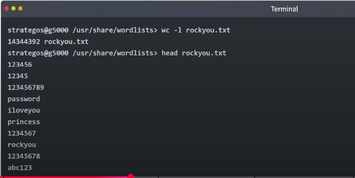
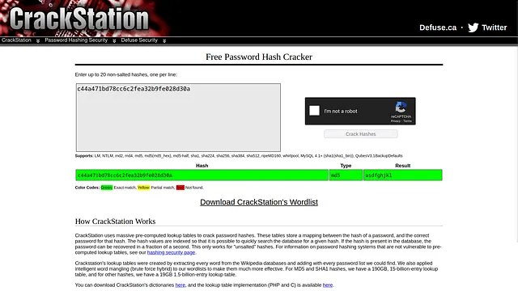
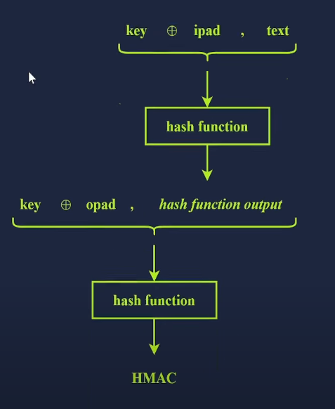

# Hashing Basics

## Mục lục

1. [Task 1: Introduction](#task-1-introduction)
2. [Task 2: Hash Functions](#task-2-hash-functions)
3. [Task 3: Insecure Password Storage for Authentication](#task-3-insecure-password-storage-for-authentication)
4. [Task 4: Using Hashing for Secure Password Storage](#task-4-using-hashing-for-secure-password-storage)
5. [Task 5: Recognising Password Hashes](#task-5-recognising-password-hashes)
6. [Task 6: Password Cracking](#task-6-password-cracking)
7. [Task 7: Hashing for Integrity Checking](#task-7-hashing-for-integrity-checking)
8. [Task 8: Conclusion](#task-8-conclusion)

## Nội dung


# Task 1: Introduction
>Giới thiệu

Hãy tưởng tượng bạn vừa tải xuống một tệp có dung lượng 6 GB và muốn biết liệu bản sao bạn tải về có giống hệt với tệp gốc, từng bit một hay không. Làm sao để bạn kiểm tra điều đó? Hoặc giả sử ai đó tốt bụng đưa cho bạn tệp 6 GB này trong một USB — làm sao bạn có thể chắc chắn rằng nó giống hệt với tệp mà bạn định tải xuống?

Câu trả lời cho cả hai tình huống trên nằm ở việc **so sánh các giá trị băm (hash)** của hai tệp; nếu **giá trị băm** giống nhau, bạn có thể **gần như chắc chắn rằng hai tệp là giống hệt nhau**. Nhưng giá trị băm là gì?

---

Một **giá trị băm (hash value)** là một chuỗi ký tự có độ dài cố định được tính toán bởi một **hàm băm (hash function)**.
Hàm băm nhận đầu vào có kích thước bất kỳ và trả về đầu ra có độ dài cố định — tức là giá trị băm. Trong phần này, chúng ta sẽ tìm hiểu các ứng dụng thú vị và sáng tạo của hàm băm và giá trị băm.

---

**Lưu ý về thuật ngữ:**

Chúng tôi sử dụng chủ yếu hai thuật ngữ là *hàm băm* và *giá trị băm*. Tuy nhiên, đôi khi từ **hash** được dùng như:

* **Động từ:** “to hash” = tính toán giá trị băm
* **Danh từ:** “hash” = giá trị băm (thay cho “hash value”)


### **Mục tiêu học tập**

Sau khi hoàn thành phòng học này, bạn sẽ nắm được:

* Các hàm băm và hiện tượng va chạm (collisions)
* Vai trò của hàm băm trong hệ thống xác thực
* Cách nhận diện các giá trị băm đã lưu trữ
* Cách phá vỡ (crack) giá trị băm
* Việc sử dụng hàm băm để bảo vệ tính toàn vẹn dữ liệu

---

# Task 2: Hash Functions

>Hàm băm là gì?

Hàm băm khác với mã hóa. Không có khóa, và việc đi từ đầu ra quay lại đầu vào là không thể (hoặc không khả thi về mặt tính toán).

Hàm băm nhận một lượng dữ liệu đầu vào có kích thước bất kỳ và tạo ra một bản tóm tắt (digest) của dữ liệu đó. Đầu ra có kích thước cố định. Rất khó để dự đoán đầu ra cho bất kỳ đầu vào nào và ngược lại. Thuật toán băm tốt sẽ tương đối nhanh để tính toán và cực kỳ chậm để đảo ngược, tức là đi từ đầu ra và xác định đầu vào. Bất kỳ thay đổi nhỏ nào trong dữ liệu đầu vào, thậm chí chỉ một bit, đều sẽ gây ra sự thay đổi đáng kể trong đầu ra.

Hãy kiểm tra một ví dụ. Trong terminal bên dưới, chúng ta thấy hai tệp: tệp đầu tiên chứa chữ T, trong khi tệp thứ hai chứa chữ U. Nếu bạn kiểm tra T và U trong bảng mã ASCII hoặc dùng `hexdump`, bạn sẽ nhận thấy rằng hai chữ cái này chỉ khác nhau một bit.

* Chữ cái T có mã **54** ở hệ thập lục phân, tức là **01010100** ở hệ nhị phân.
* Chữ cái U có mã **55** ở hệ thập lục phân, tức là **01010101** ở hệ nhị phân.

Do đó, hai tệp này chỉ khác nhau đúng một bit. Tuy nhiên, nếu chúng ta so sánh giá trị băm **MD5** (Message-Digest Algorithm 5), **SHA1** (Secure Hash Algorithm 1), hoặc **SHA-256** (Secure Hash Algorithm 256) của chúng, ta sẽ nhận thấy rằng chúng hoàn toàn khác nhau. Chúng tôi khuyến nghị bạn tự thử các lệnh bên dưới. Các tệp nằm trong thư mục `~/Hashing-Basics/Task-2/`.

```bash
strategos@g5000 ~> cat file1.txt 
T⏎
strategos@g5000 ~> cat file2.txt 
U⏎   
strategos@g5000 ~> hexdump -C file1.txt 
00000000  54                                                |T|
00000001
strategos@g5000 ~> hexdump -C file2.txt 
00000000  55                                                |U|
00000001
strategos@g5000 ~> md5sum *.txt
b9ece18c950afbfa6b0fdbfa4ff731d3  file1.txt
4c614360da93c0a041b22e537de151eb  file2.txt
strategos@g5000 ~> sha1sum *.txt
c2c53d66948214258a26ca9ca845d7ac0c17f8e7  file1.txt
b2c7c0caa10a0cca5ea7d69e54018ae0c0389dd6  file2.txt
strategos@g5000 ~> sha256sum *.txt
e632b7095b0bf32c260fa4c539e9fd7b852d0de454e9be26f24d0d6f91d069d3  file1.txt
a25513c7e0f6eaa80a3337ee18081b9e2ed09e00af8531c8f7bb2542764027e7  file2.txt
```

Đầu ra của một hàm băm thường là các byte thô (raw bytes), sau đó được mã hóa. Các dạng mã hóa phổ biến là base64 hoặc hexadecimal. Các lệnh `md5sum`, `sha1sum`, `sha256sum` và `sha512sum` tạo ra đầu ra ở định dạng hexadecimal. Hãy nhớ rằng định dạng hexadecimal in mỗi byte thô thành hai chữ số hexadecimal.

### Tại sao băm lại quan trọng?

Băm đóng vai trò thiết yếu trong việc sử dụng Internet hàng ngày. Giống như các hàm mật mã khác, băm thường được ẩn khỏi người dùng. Băm giúp bảo vệ tính toàn vẹn của dữ liệu và đảm bảo tính bảo mật của mật khẩu.

Xem ví dụ sau về cách băm được sử dụng để bảo vệ an ninh mạng của bạn. Khi bạn đăng nhập vào TryHackMe, máy chủ sử dụng băm để xác minh mật khẩu của bạn. Thực tế, theo các thực hành bảo mật tốt, máy chủ không lưu mật khẩu của bạn; thay vào đó, nó lưu **giá trị băm** của mật khẩu. Khi bạn đăng nhập, hệ thống sẽ tính giá trị băm của mật khẩu bạn nhập và so sánh với giá trị đã lưu. Tương tự, khi bạn đăng nhập vào máy tính của mình, băm cũng đóng vai trò xác minh mật khẩu. Bạn tương tác với băm một cách gián tiếp nhiều hơn bạn nghĩ, gần như hàng ngày trong ngữ cảnh mật khẩu.

---

### Va chạm hàm băm (Hash Collision) là gì?

Va chạm hàm băm xảy ra khi **hai đầu vào khác nhau cho cùng một đầu ra**.
Hàm băm được thiết kế để tránh va chạm tốt nhất có thể, và ngăn chặn kẻ tấn công tạo (hoặc "kỹ thuật hóa") ra va chạm một cách có chủ đích. Tuy nhiên, vì số lượng đầu vào là vô hạn còn số lượng đầu ra có giới hạn, điều này dẫn đến **hiệu ứng lồng chim (pigeonhole effect)**.

Ví dụ: nếu hàm băm tạo ra giá trị băm 4 bit, thì chỉ có 16 giá trị băm khác nhau. Tổng số đầu ra có thể là $2^4 = 16$. Xác suất xảy ra va chạm là tương đối cao.

**Hiệu ứng lồng chim** (pigeonhole effect) nói rằng nếu số lượng vật (chim) lớn hơn số lượng ngăn chứa (lồng chim), thì một số ngăn phải chứa nhiều hơn một vật. Trong ngữ cảnh này, có số lượng giá trị đầu ra hữu hạn, nhưng có thể đưa vào bất kỳ đầu vào nào → một số đầu vào **bắt buộc** phải cho cùng giá trị băm. Nếu có 21 con chim và chỉ 16 cái lồng, thì một số lồng phải chứa nhiều hơn một con → va chạm là **không thể tránh khỏi**. Tuy nhiên, một hàm băm tốt sẽ khiến xác suất xảy ra va chạm **rất nhỏ**.

---

**MD5** và **SHA1** đã bị tấn công và hiện nay bị coi là **không an toàn** do có thể tạo ra va chạm.
Tuy nhiên, **chưa có cuộc tấn công nào tạo được va chạm trong cả hai thuật toán cùng lúc**.

Nếu bạn so sánh kết quả băm của MD5 và SHA1, bạn sẽ thấy chúng khác nhau. Bạn có thể xem ví dụ về va chạm của MD5 tại trang **[MD5 Collision Demo](https://www.mscs.dal.ca/~selinger/md5collision/)**, và tìm hiểu thêm về tấn công va chạm SHA1 tại **[Shattered](https://shattered.io/)**.

Vì những lý do này, bạn **không nên tin tưởng MD5 hay SHA1** để băm mật khẩu hoặc dữ liệu.

---
**Trả lời các câu hỏi sau:**

**Câu hỏi:**
SHA256 hash của tệp `passport.jpg` trong `~/Hashing-Basics/Task-2/` là gì?
**Trả lời:**
`77148c6f605a8df855f2b764bcc3be749d7db814f5f79134d2aa539a64b61f02`

Lệnh sử dụng:

```bash
sha256sum ~/Hashing-Basics/Task-2/passport.jpg
```

---

**Câu hỏi:**
Kích thước đầu ra (output size) của hàm băm MD5 là bao nhiêu byte?
**Trả lời:** 16

---

**Câu hỏi:**
Nếu đầu ra của hàm băm là 8 bit, thì có bao nhiêu giá trị băm có thể xảy ra?
**Trả lời:** 256

---

# Task 3: Insecure Password Storage for Authentication

>Lưu trữ mật khẩu không an toàn cho xác thực

Băm có nhiều ứng dụng trong An ninh mạng. Trong phần này, chúng ta sẽ tập trung vào hai mục tiêu: **lưu trữ mật khẩu** và **bảo vệ tính toàn vẹn của dữ liệu**. Việc lưu trữ mật khẩu được nhắc đến trong ngữ cảnh xác thực.

**Lưu ý quan trọng:** điều này **không áp dụng cho trình quản lý mật khẩu**, vì trình quản lý cần **trả về mật khẩu ở dạng rõ (cleartext)**. Trong khi đó, **các cơ chế xác thực chỉ cần xác nhận rằng người dùng biết mật khẩu**, để cấp quyền truy cập — do đó, vấn đề này khác với trình quản lý mật khẩu.

---

### Các câu chuyện về lưu trữ mật khẩu không an toàn trong xác thực

Hầu hết các ứng dụng web đều cần xác minh mật khẩu của người dùng tại một thời điểm nào đó. **Lưu trữ mật khẩu ở dạng văn bản thuần túy (plaintext)** là một thực hành bảo mật **rất kém an toàn**. Có lẽ bạn đã từng thấy những tin tức về việc rò rỉ cơ sở dữ liệu của một công ty nào đó. Vì nhiều người dùng **dùng chung mật khẩu** cho nhiều tài khoản (kể cả ngân hàng trực tuyến), việc rò rỉ một mật khẩu sẽ **đe dọa toàn bộ hệ thống tài khoản khác**.

---

Chúng ta sẽ xem xét **ba thực hành không an toàn** phổ biến nhất trong việc lưu trữ mật khẩu:

* Lưu mật khẩu ở dạng **plaintext**
* Lưu mật khẩu bằng **thuật toán mã hóa đã lỗi thời**
* Lưu mật khẩu bằng **thuật toán băm không an toàn**

---

### **Lưu mật khẩu ở dạng văn bản thuần túy (plaintext)**

Nhiều vụ rò rỉ dữ liệu đã tiết lộ rằng mật khẩu người dùng được lưu ở dạng **plaintext**. Có thể bạn đã quen thuộc với danh sách mật khẩu **"rockyou.txt"** trên hệ điều hành **Kali Linux**, cùng nhiều công cụ tấn công khác.
Danh sách này có nguồn gốc từ công ty **RockYou**, công ty phát triển các ứng dụng mạng xã hội và widget. Họ đã lưu trữ mật khẩu người dùng ở **dạng văn bản rõ**, và bị rò rỉ dữ liệu nghiêm trọng.
Tệp văn bản chứa **hơn 14 triệu mật khẩu** và có thể được tìm thấy tại:

```
/usr/share/wordlists/rockyou.txt
```



### Sử dụng thuật toán mã hóa không an toàn

Vụ rò rỉ dữ liệu nghiêm trọng của Adobe có phần khác biệt. Thay vì sử dụng một hàm băm an toàn để lưu trữ các giá trị băm của mật khẩu, công ty này lại sử dụng một định dạng mã hóa đã lỗi thời. Hơn nữa, các gợi ý mật khẩu (password hints) cũng được lưu ở dạng văn bản thuần túy, đôi khi còn chứa cả mật khẩu thật. Do đó, **mật khẩu ở dạng rõ (plaintext)** có thể bị truy xuất khá nhanh chóng.

---

### Sử dụng hàm băm không an toàn

LinkedIn cũng đã bị rò rỉ dữ liệu vào năm 2012. LinkedIn sử dụng một thuật toán băm không an toàn là **SHA-1** để lưu trữ mật khẩu người dùng. Ngoài ra, họ **không sử dụng kỹ thuật salting cho mật khẩu**.

**Password salting** là việc thêm một **giá trị ngẫu nhiên** (gọi là **salt**) vào mật khẩu trước khi tiến hành băm.

---

**Trả lời các câu hỏi sau**

**Câu hỏi:**
Mật khẩu thứ 20 trong tệp `rockyou.txt` là gì?

**Trả lời:**
`qwerty`

**Lệnh sử dụng:**

```bash
sed -n '20p' /usr/share/wordlists/rockyou.txt
```

# Task 4: Using Hashing for Secure Password Storage

**Sử dụng Băm (Hashing) để Lưu Trữ Mật Khẩu**

Đây là lúc kỹ thuật băm phát huy tác dụng. Sẽ ra sao nếu, thay vì lưu mật khẩu, bạn chỉ lưu giá trị băm của nó bằng một hàm băm bảo mật? Quy trình này có nghĩa là bạn không bao giờ phải lưu mật khẩu của người dùng, và nếu cơ sở dữ liệu của bạn bị rò rỉ, kẻ tấn công sẽ phải phá từng mật khẩu để tìm ra mật khẩu ban đầu là gì.

Tuy nhiên, có một vấn đề với cách này. Sẽ thế nào nếu hai người dùng có cùng một mật khẩu? Vì một hàm băm luôn biến cùng một đầu vào thành cùng một đầu ra, bạn sẽ lưu cùng một giá trị băm cho mỗi người dùng. Điều đó có nghĩa là nếu ai đó giải mã được giá trị băm đó, họ sẽ có quyền truy cập vào nhiều hơn một tài khoản. Điều này cũng có nghĩa là ai đó có thể tạo ra **Bảng cầu vồng** (Rainbow Table) để phá các giá trị băm.

Một **Bảng cầu vồng** là một bảng tra cứu chứa các giá trị băm và chuỗi văn bản gốc tương ứng, giúp bạn nhanh chóng tìm ra người dùng đã sử dụng mật khẩu nào chỉ từ giá trị băm. Bảng cầu vồng đánh đổi thời gian phá giá trị băm lấy không gian ổ đĩa cứng, nhưng lại tốn thời gian để tạo ra. Dưới đây là một ví dụ đơn giản để hình dung bảng cầu vồng trông như thế nào.

| Hash                             | Password        |
| -------------------------------- | --------------- |
| 02c75fb22c75b23dc963c7eb91a062cc | zxcvbnm         |
| b0baee9d279d34fa1dfd71aadb908c3f | 11111           |
| c44a471bd78cc6c2fea32b9fe028d30a | asdfghjkl       |
| d0199f51d2728db6011945145a1b607a | basketball      |
| dcddb75469b4b4875094e14561e573d8 | 000000          |
| e10adc3949ba59abbe56e057f20f883e | 123456          |
| e19d5cd5af0378da05f63f891c7467af | abcd1234        |
| e99a18c428cb38d5f260853678922e03 | abc123          |
| fcea920f7412b5da7be0cf42b8c93759 | 1234567         |
| 4c5923b6a6fac7b7355f53bfe2b8f8c1 | inS3CyourP4\$\$ |


Các trang web như [CrackStation](https://crackstation.net/) và [Hashes.com](https://hashes.com/en/decrypt/hash) sử dụng nội bộ các bảng rainbow khổng lồ để cung cấp khả năng bẻ khóa mật khẩu nhanh cho các hàm băm **không có muối**. Việc tra cứu trong một danh sách được sắp xếp các hàm băm thì nhanh hơn so với việc cố gắng bẻ khóa hàm băm.



**Bảo vệ chống lại bảng Rainbow**

Để bảo vệ chống lại các bảng rainbow, ta thêm một giá trị muối (salt) vào mật khẩu. Muối là một giá trị được tạo ngẫu nhiên, được lưu trữ trong cơ sở dữ liệu và nên là duy nhất đối với từng người dùng. Về lý thuyết, bạn có thể sử dụng cùng một muối cho tất cả người dùng, nhưng khi đó các mật khẩu trùng nhau vẫn sẽ có cùng giá trị băm, và có thể tạo bảng rainbow tương ứng với muối đó.

Muối được thêm vào đầu hoặc cuối mật khẩu trước khi băm, điều này giúp mỗi người dùng có giá trị băm mật khẩu khác nhau ngay cả khi họ dùng cùng một mật khẩu. Các hàm băm như Bcrypt và Scrypt tự động xử lý việc này. Muối không cần phải giữ bí mật.

**Ví dụ lưu mật khẩu an toàn**

1. Chọn một hàm băm an toàn, như Argon2, Scrypt, Bcrypt, hoặc PBKDF2.
2. Thêm một chuỗi muối duy nhất vào mật khẩu, ví dụ: `Y4UV*^(=go_!`
3. Nối mật khẩu với muối đó. Ví dụ, nếu mật khẩu là `AL4RMc10k`, chuỗi kết quả sẽ là `AL4RMc10kY4UV*^(=go_!`
4. Tính giá trị băm của chuỗi kết hợp mật khẩu và muối. Trong ví dụ này, tính giá trị băm của `AL4RMc10kY4UV*^(=go_!`
5. Lưu giá trị băm và chuỗi muối đã sử dụng (`Y4UV*^(=go_!`)

**Sử dụng mã hóa để lưu mật khẩu**

Xét đến vấn đề lưu mật khẩu để xác thực, tại sao không dùng mã hóa thay vì tất cả các bước phức tạp trên? Lý do là dù ta chọn thuật toán mã hóa an toàn để mã hóa mật khẩu trước khi lưu, ta vẫn cần lưu khóa để giải mã. Do đó, nếu ai đó có được khóa, họ có thể dễ dàng giải mã tất cả mật khẩu.

---

**Trả lời các câu hỏi dưới đây**

Câu 1: Thủ công kiểm tra hash “4c5923b6a6fac7b7355f53bfe2b8f8c1” bằng cách sử dụng bảng rainbow ở trên.

> **Trả lời:** inS3CyourP4\$\$

Câu 2: Giải mã hash “5b31f93c09ad1d065c0491b764d04933” bằng một công cụ trực tuyến.

> **Trả lời:** tryhackme

[https://hashes.com/en/decrypt/hash](https://hashes.com/en/decrypt/hash)

Câu 3: Bạn có nên mã hóa mật khẩu trong các hệ thống xác minh mật khẩu không? Có / Không

> **Trả lời:** Không

---

# Task 5: Recognising Password Hashes
**Nhận diện Hash Mật khẩu**

Từ góc nhìn bảo mật phòng thủ mạng, ta đã đề cập cách lưu trữ mật khẩu một cách an toàn cho hệ thống xác thực. Giờ hãy tiếp cận vấn đề này từ góc nhìn bảo mật tấn công: nếu bắt đầu với một hash, làm sao để nhận diện loại hash, cuối cùng là phá giải nó và khôi phục mật khẩu gốc?

Các công cụ nhận diện hash tự động như [hashID](https://github.com/psypanda/hashID) tồn tại nhưng không đáng tin cậy với nhiều định dạng. Với các hash có tiền tố, các công cụ này đáng tin cậy hơn. Hãy sử dụng sự kết hợp hợp lý giữa ngữ cảnh và công cụ. Nếu bạn tìm thấy hash trong cơ sở dữ liệu của ứng dụng web, nhiều khả năng đó là MD5 hơn là NTLM (NT LAN Manager). Các công cụ nhận diện hash tự động thường dễ nhầm lẫn giữa các loại hash này, điều này nhấn mạnh tầm quan trọng của việc học nhận diện thủ công.

---

### Mật khẩu Linux

Trên Linux, các hash mật khẩu được lưu trong tệp `/etc/shadow`, tệp này chỉ root mới có thể đọc. Trước đây, chúng được lưu trong tệp `/etc/passwd`, ai cũng đọc được.

Tệp `shadow` chứa thông tin mật khẩu. Mỗi dòng gồm 9 trường, phân cách bằng dấu hai chấm `:`. Hai trường đầu là tên đăng nhập và mật khẩu mã hóa. Bạn có thể tìm hiểu thêm về các trường khác bằng lệnh `man 5 shadow` trên hệ thống Linux.

Trường mật khẩu mã hóa chứa chuỗi hash có 4 thành phần: tiền tố (id thuật toán), tùy chọn (tham số), muối (salt), và hash. Nó được lưu theo định dạng:

```
$prefix$options$salt$hash
```

Tiền tố giúp dễ nhận biết mật khẩu theo kiểu Unix và Linux; nó xác định thuật toán hash được dùng để tạo chuỗi hash.

Dưới đây là bảng tóm tắt nhanh các tiền tố hash mật khẩu kiểu Unix phổ biến mà bạn có thể gặp. Chúng được liệt kê theo thứ tự giảm dần về độ mạnh. Bạn có thể đọc thêm bằng cách xem trang trợ giúp với `man 5 crypt`.

| **Prefix**                     | **Thuật toán**                                                                                                                                                                          |
| ------------------------------ | --------------------------------------------------------------------------------------------------------------------------------------------------------------------------------------- |
| `$y$`                          | yescrypt là một phương pháp băm có khả năng mở rộng và là lựa chọn mặc định được khuyến nghị trong các hệ thống mới                                                                     |
| `$gy$`                         | gost-yescrypt sử dụng hàm băm GOST R 34.11-2012 và phương pháp băm yescrypt                                                                                                             |
| `$7$`                          | scrypt là một hàm dẫn xuất khóa dựa trên mật khẩu                                                                                                                                       |
| `$2b$`, `$2y$`, `$2a$`, `$2x$` | bcrypt là một hàm băm dựa trên thuật toán Blowfish, ban đầu được phát triển cho OpenBSD, nhưng hiện được hỗ trợ trên FreeBSD, NetBSD, Solaris 10 trở lên, và một số bản phân phối Linux |
| `$6$`                          | sha512crypt là hàm băm dựa trên SHA-2 với đầu ra 512-bit, ban đầu phát triển cho GNU libc và thường dùng trên hệ thống Linux (cũ)                                                       |
| `$md5`                         | SunMD5 là hàm băm dựa trên thuật toán MD5, ban đầu phát triển cho Solaris                                                                                                               |
| `$1$`                          | md5crypt là hàm băm dựa trên thuật toán MD5, ban đầu phát triển cho FreeBSD                                                                                                             |


**Ví dụ Linux hiện đại**

Hãy xem dòng sau đây từ tệp mật khẩu `shadow` của một hệ thống Linux hiện đại.

```bash
root@TryHackMe# sudo cat /etc/shadow | grep strategos
strategos:$y$j9T$76UzfgEM5PnymhQ7TlJey1$/OOSg64dhfF.TigVPdzqiFang6uZA4QA1pzzegKdVm4:19965:0:99999:7:::
```

Các trường được phân tách bằng dấu hai chấm. Những trường quan trọng là tên người dùng, thuật toán băm, salt và giá trị băm. Trường thứ hai có định dạng:

```
$prefix$options$salt$hash
```

Trong ví dụ trên, ta có bốn phần phân tách bởi dấu `$`:

* **y**: chỉ thuật toán băm được sử dụng, là `yescrypt`
* **j9T**: là một tham số truyền vào thuật toán
* **76UzFgEM5pnymhQ7T1Jey1**: là giá trị salt được sử dụng
* **/0OSg64dHfF.TigVPdzqiFang6UzA4QA1pzzegKdVm4**: là giá trị hash được tạo ra

---

### Mật khẩu MS Windows

Mật khẩu trên MS Windows được băm bằng NTLM, một biến thể của MD4. Chúng trông tương tự như các hash MD4 và MD5, do đó rất quan trọng phải dùng ngữ cảnh để xác định đúng loại hash.

Trên MS Windows, các hash mật khẩu được lưu trữ trong SAM (Security Accounts Manager). Hệ điều hành cố ngăn người dùng thường truy xuất các hash này, nhưng các công cụ như **mimikatz** có thể vượt qua lớp bảo vệ đó. Lưu ý, các hash này chia làm 2 loại: **NT hashes** và **LM hashes**.

Một nguồn tốt để tra cứu các định dạng hash và tiền tố là trang [Hashcat Example Hashes](https://hashcat.net/wiki/doku.php?id=example_hashes). Với các loại hash khác, bạn thường phải kiểm tra độ dài, mã hóa hoặc tìm hiểu ứng dụng đã tạo ra chúng. Đừng bao giờ đánh giá thấp sức mạnh của việc nghiên cứu.

---

Trả lời các câu hỏi dưới đây

Câu 1: Kích thước hash trong yescrypt là bao nhiêu?

> **Trả lời:** 256

Câu 2: Hash-Mode được liệt kê cho Cisco-ASA MD5 là gì?

> **Trả lời:** 2410

> [https://hashcat.net/wiki/doku.php?id=example\_hashes](https://hashcat.net/wiki/doku.php?id=example_hashes)

Câu 3: Thuật toán băm nào được sử dụng trong Cisco-IOS nếu bắt đầu bằng `$9$`?

> **Trả lời:** scrypt

> [https://hashcat.net/wiki/doku.php?id=example\_hashes](https://hashcat.net/wiki/doku.php?id=example_hashes)

---

# Task 6: Password Cracking
**Nhiệm vụ 6 – Bẻ khóa mật khẩu**

Chúng ta đã nhắc đến bảng rainbow như một phương pháp để bẻ khóa các hash không dùng salt, nhưng nếu có salt thì sao?

Bạn không thể “giải mã” hash mật khẩu — vì chúng không được mã hóa. Thay vào đó, bạn phải bẻ khóa chúng bằng cách tạo ra rất nhiều đầu vào khác nhau (chẳng hạn từ **rockyou.txt** vì nó bao phủ nhiều mật khẩu phổ biến), thêm salt nếu có, rồi so sánh kết quả băm với hash mục tiêu. Nếu khớp, bạn sẽ biết được mật khẩu gốc. Các công cụ như **Hashcat** và **John the Ripper** thường được dùng cho mục đích này.

---

### Bẻ khóa mật khẩu bằng GPU

GPU hiện đại có hàng ngàn lõi. Chúng được thiết kế để xử lý hình ảnh số và tăng tốc xử lý đồ họa. Dù không thực hiện cùng loại công việc như CPU, GPU lại rất tốt trong các phép toán phức tạp dùng trong hàm băm. Bạn có thể dùng GPU để bẻ khóa nhiều loại hash rất nhanh.

Tuy nhiên, một số thuật toán băm như **Bcrypt** được thiết kế sao cho việc sử dụng GPU không nhanh hơn so với CPU, từ đó tăng khả năng chống bị bẻ khóa.

---

### Bẻ khóa trong máy ảo (VM)?

Máy ảo (VM) thường không có quyền truy cập vào GPU của hệ thống. Tùy vào phần mềm ảo hóa bạn dùng, bạn có thể cấu hình điều này, nhưng rất bất tiện. Ngoài ra, hiệu năng giảm đáng kể vì CPU bị ảo hóa, và với mục tiêu bẻ khóa hash, bạn cần tận dụng tối đa từng chu kỳ CPU.

Nếu muốn dùng **Hashcat**, bạn nên chạy trực tiếp trên máy chủ thật (host) để tận dụng GPU tối đa. Nếu bạn dùng Windows, có thể chạy Hashcat qua **PowerShell**. Hashcat có thể chạy qua **OpenCL** trong máy ảo, nhưng tốc độ sẽ chậm hơn so với chạy trực tiếp.

**John the Ripper** mặc định dùng CPU và chạy tốt trong máy ảo, nhưng tốc độ sẽ cao hơn nếu bạn chạy trực tiếp trên hệ điều hành host để tránh tiêu tốn tài nguyên do ảo hóa và tận dụng toàn bộ CPU.

**Đến lúc bẻ khóa một số hash**

Tôi sẽ cung cấp các hash. Hãy bẻ khóa chúng. Bạn có thể chọn công cụ, ví dụ như **Hashcat** hoặc **John the Ripper**. Dù bạn có thể dùng bảng rainbow online để giải các hash sau đây, nhưng chúng tôi **khuyến khích không làm vậy** để tránh hạn chế trải nghiệm học tập. Với ba câu hỏi đầu, dùng **hashcat** kết hợp với file **rockyou.txt** là đủ để tìm ra câu trả lời.

---

Hashcat sử dụng cú pháp cơ bản sau:

```
hashcat -m <hash_type> -a <attack_mode> hashfile wordlist
```

Trong đó:

* `-m <hash_type>`: chỉ định loại hash theo định dạng số. Ví dụ: `-m 1000` là dành cho NTLM. Bạn có thể xem hướng dẫn chính thức với `man hashcat` hoặc tra [trang ví dụ](https://hashcat.net/wiki/doku.php?id=example_hashes) để biết mã tương ứng.

* `-a <attack_mode>`: chỉ định kiểu tấn công. Ví dụ: `-a 0` là kiểu "thẳng" – thử từng mật khẩu trong wordlist tuần tự.

* `hashfile`: là file chứa các hash bạn muốn bẻ.

* `wordlist`: là danh sách mật khẩu dùng trong tấn công (ví dụ: `rockyou.txt`).

---

Ví dụ lệnh:

```
hashcat -m 3200 -a 0 hash.txt /usr/share/wordlists/rockyou.txt
```

Lệnh trên sẽ xử lý hash theo dạng Bcrypt và thử mật khẩu trong file `rockyou.txt`.

---

**Trả lời các câu hỏi dưới đây**

Câu 1: Sử dụng hashcat để bẻ khóa hash:

`$2a$06$7yoU3Ng8dHTXphAg913cyO6Bjs3K5lBnwq5FJyaA6d01pMSrddr1ZG`,

lưu tại đường dẫn `~/Hashing-Basics/Task-6/hash1.txt`.

**Trả lời:** 85208520

```bash
hashcat -m 3200 -a 0 ~/Hashing-Basics/Task-6/hash1.txt rockyou.txt

john --format=bcrypt --wordlist=rockyou.txt ~/Hashing-Basics/Task-6/hash1.txt
```

---

Câu 2: Sử dụng hashcat để bẻ khóa hash SHA2-256:

`9eb7ee7f551d2f0ac684981bd1fle2fa4a37590199636753efe614d4db30e8e1`,

được lưu tại `~/Hashing-Basics/Task-6/hash2.txt`.

**Trả lời:** halloween


```bash
hashcat -m 1400 -a 0 ~/Hashing-Basics/Task-6/hash2.txt rockyou.txt
```
https://crackstation.net/?source=post_page-----17f1549693f7---------------------------------------

---

Câu 3: Sử dụng hashcat để bẻ khóa hash:

`$6$GQXVvW4EuM$ehD6jWiMsfNorxy5SlNsgdlxmAEl3.yif0/c3NqzGLa0P.S7KRDYjycw5bnYkF5ZtB8wQy8KnskuWQS3Yr1wQ0`,

được lưu tại `~/Hashing-Basics/Task-6/hash3.txt`.

**Trả lời:** spaceman

```bash
hashcat -m 1800 -a 0 ~/Hashing-Basics/Task-6/hash3.txt rockyou.txt
```

https://hashes.com/en/decrypt/hash?source=post_page-----17f1549693f7---------------------------------------

---

Câu 4: Bẻ khóa hash:

`b6b0d451bbf6fed658659a9e7e5598fe`,

được lưu tại `~/Hashing-Basics/Task-6/hash4.txt`.

**Trả lời:** funforyou

https://crackstation.net/?source=post_page-----17f1549693f7---------------------------------------

---

# Task 7: Hashing for Integrity Checking

**Băm để kiểm tra tính toàn vẹn**

Trong Nhiệm vụ 3, chúng ta đã đề cập đến hai mục đích chính của hàm băm: lưu trữ mật khẩu và đảm bảo tính toàn vẹn của dữ liệu. Ta đã bàn kỹ về cách hàm băm bảo vệ mật khẩu trong hệ thống xác thực. Trong nhiệm vụ này, ta sẽ tìm hiểu cách sử dụng hàm băm để kiểm tra tính toàn vẹn của tệp tin.

---

### Kiểm tra tính toàn vẹn (Integrity Checking)

Hashing có thể được dùng để xác minh rằng tệp tin không bị thay đổi. Nếu bạn nhập cùng một dữ liệu, bạn sẽ luôn nhận được cùng một giá trị băm. Ngay cả khi chỉ một bit thay đổi, hash cũng sẽ thay đổi rõ rệt (như đã trình bày ở Nhiệm vụ 2).

Điều này có nghĩa là bạn có thể dùng hash để kiểm tra xem tệp tin có bị sửa đổi không, hoặc để đảm bảo rằng tệp bạn tải về giống hệt tệp được lưu trữ trên máy chủ web.

Tệp văn bản được liệt kê dưới đây hiển thị hash SHA256 của hai file ISO Fedora Workstation. Nếu bạn chạy lệnh `sha256sum` trên tệp đã tải về và kết quả khớp với hash được liệt kê, bạn có thể yên tâm rằng tệp của mình giống hệt bản chính thức.

```bash
root@AttackBox# head Fedora-Workstation-40-1.14-x86_64-CHECKSUM
-----BEGIN PGP SIGNED MESSAGE-----
Hash: SHA256
# Fedora-Workstation-Live-osb-40-1.14.x86_64.iso: 2623733760 bytes
SHA256 (Fedora-Workstation-Live-osb-40-1.14.x86_64.iso) = 8d3cb4d99f27eb932064915bc9ad34a7529d5d073a390896152a8a899518573f
# Fedora-Workstation-Live-x86_64-40-1.14.iso: 2295853056 bytes
SHA256 (Fedora-Workstation-Live-x86_64-40-1.14.iso) = dd1faca950d1a8c3d169adf2df4c3644ebb62f8aac04c401f2393e521395d613
[...]
```

Bạn cũng có thể dùng hàm băm để tìm các tệp trùng lặp; nếu hai tài liệu có cùng hash, chúng là cùng một tài liệu. Điều này rất tiện lợi khi cần tìm và xóa tệp trùng.

---

### HMACs

**HMAC (Keyed-Hash Message Authentication Code)** là một loại mã xác thực thông điệp (MAC) sử dụng hàm băm mật mã kết hợp với một khóa bí mật để xác minh tính xác thực và toàn vẹn của dữ liệu.

HMAC được dùng để đảm bảo rằng người tạo ra HMAC là người họ tuyên bố (xác minh danh tính); hơn nữa, nó chứng minh rằng thông điệp không bị sửa đổi hay hỏng hóc – tức là duy trì tính toàn vẹn. Điều này đạt được nhờ việc sử dụng khóa bí mật để xác minh danh tính và một thuật toán băm để tạo hash nhằm chứng minh toàn vẹn.

---

Các bước sau mô tả cách HMAC hoạt động:

1. Khóa bí mật được đệm để phù hợp với kích thước khối của hàm băm.
2. Khóa đã đệm được XOR với một hằng số (thường là một khối toàn số 0 hoặc 1).
3. Thông điệp được băm bằng hàm băm kết hợp với khóa đã XOR.
4. Kết quả từ bước 3 được băm lại bằng chính hàm băm đó, lần này sử dụng khóa đã đệm XOR với một hằng số khác.
5. Kết quả cuối cùng là giá trị HMAC – thường là một chuỗi có độ dài cố định.

Phần minh họa bên dưới sẽ giúp làm rõ quy trình trên.




Về mặt kỹ thuật, hàm HMAC được tính theo biểu thức sau:

$$
\text{HMAC}(K, M) = H\left((K \oplus \text{opad}) \, \| \, H((K \oplus \text{ipad}) \, \| \, M)\right)
$$

Trong đó:

* $K$ là khóa bí mật
* $M$ là thông điệp
* $H$ là hàm băm
* $\oplus$ là phép XOR
* $\|$ là phép nối chuỗi
* `ipad` và `opad` là hai hằng số đệm được dùng trong thuật toán

---

**Trả lời các câu hỏi sau**

câu 1: SHA256 hash của tệp `libgcrypt-1.11.0.tar.bz2` nằm trong thư mục `~/Hashing-Basics/Task-7` là gì?

**Trả lời:**
`09120c9867ce7f2081d6aaa1775386b98c2f2f246135761aae47d81f58685b9c`

```bash
sha256sum ~/Hashing-Basics/Task-7/libgcrypt-1.11.0.tar.bz2
```

---

> Số chế độ hashcat cho HMAC-SHA512 (key = \$pass) là gì?

**Trả lời:** 1750

[https://hashcat.net/wiki/doku.php?id=example\_hashes](https://hashcat.net/wiki/doku.php?id=example_hashes)


---

# Task 8: Conclusion

**Kết luận**

Phòng học này đã đề cập đến các hàm băm và cách sử dụng của chúng từ nhiều góc độ khác nhau. Trước khi tiếp tục, ta cần phân biệt giữa **băm (hashing)**, **mã hóa (encoding)** và **mã hóa bảo mật (encryption)**.

---

### **Hashing**

Như đã trình bày, hashing là quá trình nhận dữ liệu đầu vào và tạo ra một giá trị băm — chuỗi ký tự có độ dài cố định, còn gọi là **digest**. Giá trị băm này đại diện duy nhất cho dữ liệu; bất kỳ thay đổi nào, dù nhỏ nhất, đều dẫn đến sự thay đổi trong giá trị băm.

Hashing **không phải là mã hóa hay mã hóa bảo mật**. Hashing là **một chiều**, bạn không thể đảo ngược để lấy lại dữ liệu gốc từ giá trị băm.

---

### **Encoding**

Encoding chuyển đổi dữ liệu từ định dạng này sang định dạng khác để tương thích với một hệ thống cụ thể. Ví dụ: ASCII, UTF-8, UTF-16, UTF-32, ISO-8859-1, Windows-1252 đều là các phương pháp encoding hợp lệ cho tiếng Anh.

Lưu ý rằng UTF-8, UTF-16, và UTF-32 là encoding của Unicode, có thể biểu diễn các ký tự từ nhiều ngôn ngữ khác nhau như tiếng Ả Rập hay tiếng Nhật.

Một dạng encoding khác thường được dùng để truyền/tải dữ liệu không liên quan đến ngôn ngữ cụ thể là Base32 và Base64. Ví dụ sau minh họa cách dùng **base64** để mã hóa và giải mã.

```bash
strategos@g5000 ~> base64
TryHackMe
VHJ5SGFja01lCg==
strategos@g5000 ~> base64 -d
VHJ5SGFja01lCg==
TryHackMe
```

**Encoding không nên bị nhầm lẫn với encryption**, vì sử dụng một phương pháp encoding cụ thể **không bảo vệ được tính bảo mật của thông điệp**. Encoding là quá trình **có thể đảo ngược**; bất kỳ ai cũng có thể thay đổi encoding dữ liệu nếu có công cụ phù hợp.

---

**Chỉ có encryption**, như đã trình bày ở các phòng trước, mới bảo vệ được **tính bảo mật** của dữ liệu bằng cách sử dụng thuật toán mã hóa và khóa. Encryption có thể đảo ngược **nếu biết thuật toán và có khóa giải mã**.

---

### Trả lời các câu hỏi bên dưới

> Sử dụng `base64` để giải mã chuỗi: `RU5jb2RlREVDb2RlCg==`, được lưu dưới tên `decode-this.txt` tại thư mục `~/Hashing-Basics/Task-8`. Từ gốc là gì?

**Trả lời:** ENcodeDEcode

```bash
base64 -d ~/Hashing-Basics/Task-8/decode-this.txt
```

