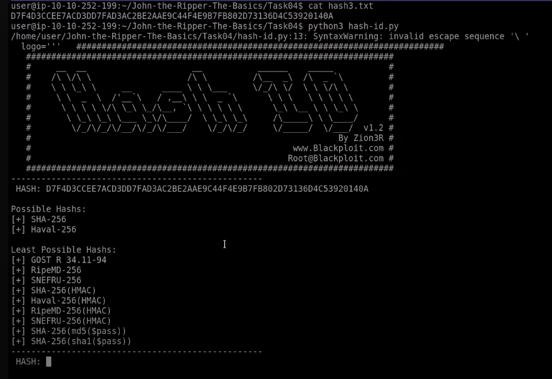

# John the Ripper The Basics 

## Mục lục

1. [Task 1: Introduction to John the Ripper](#task-1-introduction-to-john-the-ripper)
2. [Task 2: Basic Terms](#task-2-basic-terms)
3. [Task 3: Setting Up Your System](#task-3-setting-up-your-system)
4. [Task 4: Cracking Basic Hashed](#task-4-cracking-basic-hashed)
5. [Task 5: Cracking Windows Authentication Hashes](#task-5-cracking-windows-authentication-hashes)
6. [ Task 6: Cracking /etc/shadow Hashes](#task-6-cracking-etcshadow-hashes)
7. [Task 7: Single Crack Mode](#task-7-single-crack-mode)
8. [Task 8: Custom Rules](#task-8-custom-rules)
9. [Task 9: Cracking Password Protected Zip Files](#task-9-cracking-password-protected-zip-files)


## Nội dung


# Task 1: Introduction to John the Ripper

### Mục tiêu học tập

Sau khi hoàn thành phòng học này, bạn sẽ nắm được cách sử dụng **John** để:

* Bẻ khóa các hash xác thực Windows
* Bẻ khóa các hash trong tệp `/etc/shadow`
* Bẻ khóa file `.zip` được bảo vệ bằng mật khẩu
* Bẻ khóa file `.rar` được bảo vệ bằng mật khẩu
* Bẻ khóa khóa SSH

---

# Task 2: Basic Terms

>Thuật ngữ cơ bản 

---

### **Hash là gì?**

Hash là cách biểu diễn một đoạn dữ liệu có độ dài bất kỳ thành một chuỗi ký tự có độ dài cố định. Quá trình này che giấu giá trị gốc bằng cách sử dụng **thuật toán băm**. Các thuật toán băm phổ biến gồm **MD4**, **MD5**, **SHA1** và **NTLM**.

Ví dụ:

* Với chuỗi `"polo"` (4 ký tự), sau khi băm bằng **MD5** ta nhận được:
  `b53759f3ce692de7af1fb5779d3964da`

* Với chuỗi `"polomints"` (9 ký tự), cũng băm bằng **MD5**, ta nhận được:
  `584b6e4f4586e136bc280f27f9c64f3b`

Mỗi chuỗi đều cho ra một **hash MD5 dài 32 ký tự**, dù độ dài đầu vào khác nhau.

---

### **Điều gì làm cho hash trở nên an toàn?**

Các hàm băm được thiết kế là **hàm một chiều** – dễ tính toán từ đầu vào, nhưng cực kỳ khó để đảo ngược và tìm ra đầu vào ban đầu từ hash.

Về mặt toán học, vấn đề này gắn liền với lý thuyết **P vs NP** trong khoa học máy tính:

* **P (Polynomial Time)**: Bài toán có thể giải được trong thời gian đa thức. Ví dụ: sắp xếp danh sách.

* **NP (Non-deterministic Polynomial Time)**: Bài toán có thể kiểm tra nghiệm nhanh chóng, nhưng **việc tìm nghiệm lại cực kỳ khó**. “Bẻ khóa hash” rơi vào loại này.

---

**Tóm lại:**
Hash **dễ tính**, **khó đảo ngược**, và **bảo mật nếu không có thuật toán "giải ngược" hiệu quả**. Do đó, hash đóng vai trò quan trọng trong mật mã học và bảo mật hệ thống.

### Vai trò của John (John the Ripper)

Dù thuật toán băm không thể đảo ngược một cách khả thi, điều đó không có nghĩa là không thể bẻ khóa các hash.

Nếu bạn có phiên bản đã băm của một mật khẩu (ví dụ), và bạn biết thuật toán băm được sử dụng, bạn có thể dùng chính thuật toán đó để băm hàng loạt từ trong một **từ điển** (dictionary). Sau đó, so sánh các giá trị hash thu được với giá trị hash mà bạn đang cố gắng bẻ. Nếu khớp, bạn đã tìm được từ ban đầu tương ứng với hash — bạn đã **bẻ khóa thành công**!

Quá trình này được gọi là **dictionary attack (tấn công từ điển)**, và **John the Ripper** (thường gọi tắt là **John**) là công cụ được thiết kế để thực hiện các cuộc tấn công dạng brute force cực nhanh trên nhiều loại hash khác nhau.


---

> Phiên bản mở rộng phổ biến nhất của **John the Ripper** là gì?

**Trả lời:** Jumbo John

---

# Task 3: Setting Up Your System
>Nhiệm vụ 3 – Cài đặt hệ thống

Trong suốt các bài tập trong phòng học này, bạn sẽ sử dụng:

* Phiên bản **"Jumbo John"** của **John the Ripper**
* Danh sách mật khẩu **RockYou**

---

Nếu bạn sử dụng máy ảo đính kèm hoặc **AttackBox**, **không cần cài đặt John the Ripper**. Tuy nhiên, nếu bạn sử dụng hệ thống của riêng mình và không dùng phiên bản **Jumbo John**, bạn có thể thiếu một số công cụ cần thiết như:

* `zip2john`
* `rar2john`

---

### Cài đặt

**John the Ripper** hỗ trợ nhiều hệ điều hành, không chỉ riêng các bản phân phối Linux. Có nhiều phiên bản của John, bao gồm bản "core" tiêu chuẩn và các bản mở rộng từ cộng đồng. Bản phổ biến nhất là **Jumbo John**, bản này sẽ được sử dụng trong hướng dẫn này.

---

#### **AttackBox và Kali**

* **Jumbo John** đã được cài sẵn trên AttackBox và các bản phân phối như **Kali Linux**.
* Nếu bạn dùng những nền tảng đó, **không cần thao tác thêm**.

Bạn có thể kiểm tra nhanh bằng cách nhập lệnh:

```bash
john
```

Nếu đúng, dòng đầu tiên sẽ hiển thị thông tin như:

```
John the Ripper 1.9.0-jumbo-1
```

hoặc tương tự với số phiên bản khác.

### Các bản phân phối Linux khác

Nhiều bản phân phối Linux cung cấp **John the Ripper** thông qua kho chính thức:

* Trên **Fedora**, cài bằng:

  ```bash
  sudo dnf install john
  ```

* Trên **Ubuntu**, cài bằng:

  ```bash
  sudo apt install john
  ```

Tuy nhiên, **các phiên bản này thường chỉ có chức năng cơ bản** và **thiếu nhiều công cụ mở rộng** có trong bản **Jumbo John** (như `zip2john`, `rar2john`, v.v.).

Vì vậy, bạn nên **biên dịch từ mã nguồn** nếu muốn sử dụng đầy đủ các tính năng.

Tham khảo hướng dẫn chi tiết tại [official installation guide](https://github.com/openwall/john/blob/bleeding-jumbo/doc/INSTALL)

---

### Cài đặt trên Windows

Để cài **Jumbo John the Ripper** trên Windows:

* Tải bản ZIP phù hợp và cài đặt cho:

  * Hệ thống **64-bit**: [tại đây](https://www.openwall.com/john/#windows)
  * Hệ thống **32-bit**: [tại đây](https://www.openwall.com/john/#windows)

### Danh sách từ (Wordlists)

Bây giờ khi đã có **john** sẵn sàng, chúng ta cần xem xét một thành phần không thể thiếu khác: wordlists.

Như đã đề cập trước đó, để thực hiện tấn công từ điển vào các hash, bạn cần một danh sách các từ để băm và so sánh; không ngạc nhiên khi danh sách này được gọi là wordlist. Có rất nhiều wordlist khác nhau, và một bộ sưu tập tốt có thể được tìm thấy trong kho lưu trữ **SecLists**. Có một vài nơi bạn có thể tìm các wordlist để tấn công hệ thống bạn chọn; chúng ta sẽ nhanh chóng điểm qua nơi bạn có thể tìm thấy chúng.

Trên AttackBox và các bản phân phối Kali Linux, thư mục **/usr/share/wordlists** chứa một loạt wordlist rất tốt.

### RockYou

Đối với tất cả các nhiệm vụ trong phòng học này, chúng ta sẽ sử dụng wordlist nổi tiếng **rockyou.txt**, một danh sách mật khẩu phổ biến rất lớn thu được từ vụ rò rỉ dữ liệu trên trang web rockyou.com vào năm 2009. Nếu bạn không sử dụng bất kỳ bản phân phối nào ở trên, bạn có thể lấy wordlist **rockyou.txt** từ kho lưu trữ **SecLists** trong mục con **/Passwords/Leaked-Databases**. Bạn có thể cần giải nén tệp từ định dạng **.tar.gz** bằng lệnh:

```bash
tar xvzf rockyou.txt.tar.gz
```

Giờ khi đã cài đặt công cụ bẻ khóa hash và wordlist, hãy chuyển sang phần bẻ hash!

---

Để làm theo, trước tiên hãy khởi động **Máy ảo (Virtual Machine)** bằng cách nhấn nút **Start Machine** bên dưới.

Máy sẽ khởi động ở chế độ **Split-Screen**. Nếu **VM** không hiển thị, hãy dùng nút **Show Split View** màu xanh ở đầu trang.

Bạn cũng có thể truy cập máy ảo bằng **SSH** tại địa chỉ IP **10.10.252.199** với thông tin sau:

* Tên đăng nhập: `user`
* Mật khẩu: `Tryhackme123!`


---

> Danh sách mật khẩu **rockyou.txt** được tạo ra từ vụ rò rỉ dữ liệu của trang web nào?

**Trả lời:** rockyou.com

---

# Task 4: Cracking Basic Hashed

>Bẻ khóa các hash cơ bản

Có nhiều cách để sử dụng **John the Ripper** để bẻ các hash đơn giản. Chúng ta sẽ làm một vài ví dụ trước khi tự thực hành.

---

### Cú pháp cơ bản của John

Cú pháp lệnh cơ bản của **John the Ripper** như sau:

```
john [options] [file path]
```

* `john`: gọi chương trình **John the Ripper**
* `[options]`: chỉ định các tùy chọn bạn muốn sử dụng
* `[file path]`: tệp chứa các hash bạn muốn bẻ; nếu nằm cùng thư mục với terminal thì chỉ cần tên file

---

### Bẻ khóa tự động (Automatic Cracking)

John có tính năng tự động phát hiện loại hash và chọn quy tắc, định dạng phù hợp để bẻ. Tuy nhiên, việc này có thể **không đáng tin cậy** nên chỉ nên dùng nếu bạn **không biết rõ loại hash** đang xử lý.

Cú pháp để thực hiện:

```
john --wordlist=[đường dẫn tới wordlist] [đường dẫn tới file]
```

* `--wordlist=`: chỉ định danh sách từ (wordlist) sẽ sử dụng
* `[path to wordlist]`: đường dẫn đến file wordlist (ví dụ `rockyou.txt`)
* `[path to file]`: đường dẫn đến file chứa hash cần bẻ

---

### Ví dụ sử dụng:

```bash
john --wordlist=/usr/share/wordlists/rockyou.txt hash_to_crack.txt
```

### Nhận diện Hashes

Đôi khi, John không hoạt động tốt khi tự động nhận diện và nạp các hash, nhưng không sao cả! Ta có thể sử dụng công cụ khác để xác định loại hash, sau đó chỉ định đúng định dạng cho John.

Có nhiều cách để làm điều này, ví dụ dùng công cụ nhận diện hash online như [trang web này](https://www.tunnelsup.com/hash-analyzer/). Một công cụ phổ biến là **hash-identifier**, một script Python rất dễ dùng và có thể cho bạn biết các loại hash khả dĩ mà chuỗi bạn nhập có thể là.

Để dùng **hash-identifier**, bạn có thể dùng `wget` hoặc `curl` để tải file Python **hash-id.py** từ GitLab. Sau đó chạy bằng:

```bash
python3 hash-id.py
```

Rồi nhập chuỗi hash bạn muốn xác định. Công cụ sẽ trả về danh sách các định dạng hash có khả năng cao nhất. Hai bước này được minh họa bên dưới trong terminal.


### Bẻ khóa theo định dạng cụ thể (Format-Specific Cracking)

Khi bạn đã xác định được loại hash đang xử lý, bạn có thể yêu cầu John sử dụng định dạng cụ thể đó để bẻ khóa bằng cú pháp sau:

```
john --format=[format] --wordlist=[đường dẫn đến wordlist] [đường dẫn đến file]
```

* `--format=`: là cờ thông báo cho John rằng bạn đang cung cấp hash theo một định dạng cụ thể, và hãy sử dụng định dạng đó để bẻ.
* `[format]`: định dạng hash.

---

**Ví dụ sử dụng:**

```
john --format=raw-md5 --wordlist=/usr/share/wordlists/rockyou.txt hash_to_crack.txt
```

---

### Lưu ý về định dạng:

Khi bạn chỉ định định dạng cho John, nếu bạn đang xử lý một loại hash tiêu chuẩn, ví dụ `md5` như trong ví dụ trên, bạn cần thêm tiền tố `raw-` để thông báo rằng hash này thuộc loại chuẩn (chưa qua mã hóa thêm).

Tuy nhiên, không phải lúc nào quy tắc này cũng đúng.
Để kiểm tra xem bạn cần dùng tiền tố hay không, bạn có thể liệt kê toàn bộ định dạng mà John hỗ trợ bằng:

```
john --list=formats
```

Hoặc lọc theo từ khóa bằng:

```
john --list=formats | grep -iF "md5"
```


---

**Trả lời các câu hỏi dưới đây**


Câu 1: Loại hàm băm của hash1.txt là gì?

md5


---

Câu 2: Giá trị đã giải mã của hash1.txt là gì?

biscuit


---
Câu 3: Loại hàm băm của hash2.txt là gì?

sha1


---


Câu 4: Giá trị đã giải mã của hash2.txt là gì?

kangeroo


---
Câu 5: Loại hàm băm của hash3.txt là gì?

sha256



---

Câu 6: Giá trị đã giải mã của hash3.txt là gì?

microphone


---

Câu 7: Loại hàm băm của hash4.txt là gì?

whirlpool


---

Câu 8: Giá trị đã giải mã của hash4.txt là gì?

colossal


---


# Task 5: Cracking Windows Authentication Hashes

Bây giờ khi chúng ta đã hiểu cú pháp cơ bản và cách sử dụng của John the Ripper, hãy chuyển sang bẻ khóa một thứ phức tạp hơn một chút, điều mà bạn thậm chí có thể muốn thử nếu bạn đang thực hiện một cuộc kiểm thử xâm nhập thực sự hoặc tham gia nhóm Đỏ. Hash xác thực là các phiên bản đã được băm của mật khẩu được lưu trữ bởi hệ điều hành; đôi khi có thể bẻ khóa chúng bằng các phương pháp brute-force của chúng ta. Để lấy được các hash này, bạn thường phải là người dùng có đặc quyền, vì vậy chúng tôi sẽ giải thích một số hash mà chúng tôi dự định bẻ khóa khi thử nghiệm chúng.

**NTHash / NTLM**

NTHash là định dạng hash mà các hệ điều hành Windows hiện đại sử dụng để lưu trữ mật khẩu người dùng và dịch vụ. Nó cũng thường được gọi là NTLM, ám chỉ đến phiên bản trước của định dạng hash Windows là LM, do đó có tên NT/LM.

Một chút lịch sử: ký hiệu NT cho các sản phẩm Windows ban đầu có nghĩa là Công nghệ Mới (New Technology). Nó được sử dụng bắt đầu từ Windows NT để chỉ các sản phẩm không được xây dựng từ hệ điều hành MS-DOS. Cuối cùng, dòng “NT” trở thành loại hệ điều hành tiêu chuẩn được phát hành bởi Microsoft, và tên gọi này đã bị loại bỏ, nhưng vẫn tồn tại trong tên gọi của một số công nghệ Microsoft.

Trong Windows, SAM (Trình quản lý tài khoản bảo mật) được sử dụng để lưu trữ thông tin tài khoản người dùng, bao gồm cả tên người dùng và mật khẩu đã được băm. Bạn có thể lấy các hash NTHash/NTLM bằng cách trích xuất cơ sở dữ liệu SAM trên máy Windows, sử dụng công cụ như Mimikatz, hoặc sử dụng cơ sở dữ liệu Active Directory: **NTDS.dit**. Bạn có thể không cần bẻ khóa hash để tiếp tục leo thang đặc quyền, vì bạn thường có thể thực hiện một cuộc tấn công “pass the hash” thay thế, tuy nhiên đôi khi bẻ khóa hash vẫn là một lựa chọn khả thi nếu có chính sách mật khẩu yếu.

**Thực hành**

Bây giờ bạn đã biết lý thuyết đằng sau nó, hãy xem bạn có thể sử dụng các kỹ thuật đã thực hành trong nhiệm vụ trước và kiến thức về loại hash nào để bẻ khóa tệp **ntlm.txt** hay không! Tệp nằm trong `~/John-the-Ripper-The-Basics/Task5/`.

---

**Trả lời các câu hỏi sau**

Câu 1: Chúng ta cần đặt cờ `--format` thành giá trị nào để bẻ khóa hash này?

nt

Câu 2: Giá trị đã giải mã của mật khẩu này là gì?

mushroom


---

# Task 6: Cracking /etc/shadow Hashes

**Bẻ khóa Hash từ /etc/shadow**

Tệp `/etc/shadow` là tệp trên các máy Linux nơi lưu trữ các hash mật khẩu. Nó cũng lưu trữ thông tin khác, chẳng hạn như ngày thay đổi mật khẩu cuối cùng và thông tin hết hạn mật khẩu. Tệp này chứa một dòng cho mỗi người dùng hoặc tài khoản người dùng của hệ thống. Tệp này thường chỉ có thể truy cập bởi người dùng root, vì vậy bạn phải có đủ đặc quyền để truy cập các hash. Tuy nhiên, nếu bạn làm được điều đó, bạn có thể có cơ hội bẻ khóa một số hash.

---

**Unshadowing**

John có thể rất nghiêm ngặt về định dạng dữ liệu để có thể xử lý nó; vì lý do này, để bẻ khóa mật khẩu từ `/etc/shadow`, bạn phải kết hợp nó với tệp `/etc/passwd` để John có thể hiểu dữ liệu được cung cấp. Để làm điều này, chúng ta sử dụng một công cụ tích hợp trong bộ công cụ John gọi là `unshadow`. Cú pháp cơ bản của `unshadow` như sau:

```
unshadow [đường dẫn tới passwd] [đường dẫn tới shadow]
```

* `unshadow`: gọi công cụ unshadow
* `[đường dẫn tới passwd]`: Tệp chứa bản sao của tệp `/etc/passwd` bạn đã lấy từ máy mục tiêu
* `[đường dẫn tới shadow]`: Tệp chứa bản sao của tệp `/etc/shadow` bạn đã lấy từ máy mục tiêu

---

**Ví dụ sử dụng:**

```
unshadow local_passwd local_shadow > unshadowed.txt
```

---

**Ghi chú về các tệp**

Khi sử dụng `unshadow`, bạn có thể sử dụng toàn bộ tệp `/etc/passwd` và `/etc/shadow` (nếu bạn có sẵn), hoặc bạn có thể sử dụng dòng tương ứng từ mỗi tệp, ví dụ:

---

**TỆP 1 - local\_passwd**

Chứa dòng `/etc/passwd` cho người dùng root:

**TỆP 2 - local\_shadow**

Chứa dòng từ tệp `/etc/shadow` cho người dùng root:

```
root:$6$2mwjN454g.dv4HN/$m9Z/r2xVfweVYkrr.vSFt8Ws3/YYksfNwg96UL1FX00JjY1L61.DS3KEVsZ9rOVLB/1dTeEL/OihJZ4GMFMGA0:18576:::::: 
```


**Cracking**

Chúng ta có thể đưa đầu ra từ `unshadow`, trong ví dụ này là tệp `unshadowed.txt`, trực tiếp vào John. Chúng ta không cần chỉ định chế độ cụ thể vì đầu vào đã được chuẩn bị riêng cho John; tuy nhiên, trong một số trường hợp, bạn sẽ cần chỉ định định dạng như đã làm trước đó bằng cách sử dụng: `--format=sha512crypt`

```
john --wordlist=/usr/share/wordlists/rockyou.txt --format=sha512crypt unshadowed.txt
```

---

**Practical**

Bây giờ, hãy thử làm theo quy trình để bẻ khóa hash mật khẩu của người dùng root có trong tệp `etchashes.txt`. Chúc may mắn! Các tệp được đặt tại:

```
~/John-the-Ripper-The-Basics/Task06/
```

---

Câu hỏi: Mật khẩu của người dùng root là:

**1234**


---

# Task 7: Single Crack Mode

Cho đến nay, chúng ta đã sử dụng chế độ wordlist của John để brute-force các hash đơn giản và không quá đơn giản. Nhưng John còn có một chế độ khác, gọi là **Single Crack Mode**. Trong chế độ này, John chỉ sử dụng thông tin cung cấp trong tên người dùng để thử tìm ra các mật khẩu khả dĩ theo cách heuristic bằng cách thay đổi nhẹ chữ cái và số có trong tên người dùng.

---

### Word Mangling

Cách tốt nhất để giải thích chế độ Single Crack và kỹ thuật word mangling là thông qua một ví dụ:

Giả sử tên người dùng là “Markus”.

Một số mật khẩu có thể là:

* Markus1, Markus2, Markus3 (v.v.)
* MArkus, MARKus, MARKus (v.v.)
* Markus!, Markus\$, Markus\* (v.v.)

---

Kỹ thuật này được gọi là **word mangling**. John tạo ra từ điển dựa trên thông tin mà nó được cung cấp và sử dụng một tập hợp các quy tắc gọi là **mangling rules**, xác định cách thức mà nó có thể biến đổi từ ban đầu để tạo ra một wordlist dựa trên các yếu tố liên quan đến mục tiêu bạn đang cố gắng bẻ khóa. Điều này khai thác việc sử dụng mật khẩu yếu thường được đặt dựa trên thông tin như tên người dùng hoặc dịch vụ mà người dùng đăng nhập vào.

**GECOS**

Việc triển khai kỹ thuật word mangling của John cũng hỗ trợ tương thích với trường GECOS trong hệ điều hành UNIX, cũng như các hệ điều hành tương tự UNIX khác như Linux. GECOS là viết tắt của *General Electric Comprehensive Operating System*.

Trong nhiệm vụ trước, chúng ta đã xem xét các mục nhập trong cả hai tệp `/etc/shadow` và `/etc/passwd`. Quan sát kỹ, bạn sẽ thấy rằng các trường được phân tách bằng dấu hai chấm `:`. Trường thứ năm trong bản ghi tài khoản người dùng là trường GECOS. Trường này lưu trữ thông tin tổng quát về người dùng, chẳng hạn như họ tên đầy đủ, số phòng làm việc, và số điện thoại, cùng với một số thông tin khác.

John có thể lấy thông tin được lưu trong các bản ghi đó — chẳng hạn như họ tên và tên thư mục home — để thêm vào wordlist mà nó tạo ra khi bẻ khóa các hash trong `/etc/shadow` bằng chế độ single crack.

**Sử dụng Single Crack Mode**

Để sử dụng chế độ single crack, chúng ta sử dụng cú pháp gần giống với những gì đã dùng trước đây; ví dụ, nếu chúng ta muốn bẻ khóa mật khẩu của người dùng tên “Mike” bằng chế độ single, ta sẽ dùng:

```
john --single --format=[định_dạng] [đường_dẫn_đến_tệp]
```

* `--single`: Tham số này cho John biết bạn muốn sử dụng chế độ bẻ khóa hash đơn (single crack mode).
* `--format=[định_dạng]`: Như thường lệ, việc xác định đúng định dạng là rất quan trọng.

**Ví dụ sử dụng:**

```
john --single --format=raw-sha256 hashes.txt
```

**Lưu ý về định dạng tệp trong chế độ Single Crack:**

Nếu bạn đang bẻ khóa các hash trong chế độ single crack, bạn cần thay đổi định dạng tệp mà bạn cung cấp cho John để John hiểu dữ liệu và tạo wordlist từ đó. Bạn thực hiện việc này bằng cách thêm tên người dùng mà hash thuộc về ở đầu dòng hash. Theo ví dụ bên trên, chúng ta sẽ thay đổi tệp `hashes.txt` như sau:

```
Từ:    1efee03cdcb96d90ad48ccc7b8666633  
Thành: mike:1efee03cdcb96d90ad48ccc7b8666633
```

---

**Thực hành**

Bây giờ bạn đã quen với cú pháp cho chế độ single crack của John, hãy truy cập tệp hash và bẻ khóa nó, giả sử rằng người dùng mà hash thuộc về có tên là “Joker”. Tệp được đặt tại:

```
~/John-the-Ripper-The-Basics/Task07/
```

---

**Trả lời các câu hỏi dưới đây**

Mật khẩu của Joker là gì?

Jok3r


---

# Task 8: Custom Rules

---

### Custom Rules là gì?

Khi chúng ta khám phá những gì John có thể làm trong chế độ Single Crack, bạn có thể đã hình dung ra một vài mẫu word mangling tốt hoặc các mẫu mà mật khẩu thường sử dụng có thể được sao chép bằng một quy tắc biến đổi cụ thể. Tin tốt là bạn có thể tự định nghĩa các quy tắc, và John sẽ sử dụng chúng để tạo mật khẩu một cách linh hoạt. Việc có thể định nghĩa các quy tắc như vậy rất hữu ích khi bạn biết thêm thông tin về cấu trúc mật khẩu của mục tiêu.

---

### Các quy tắc tùy chỉnh phổ biến

Nhiều tổ chức sẽ yêu cầu một mức độ phức tạp nhất định cho mật khẩu để cố gắng chống lại các cuộc tấn công từ điển. Nói cách khác, khi tạo tài khoản mới hoặc thay đổi mật khẩu, nếu bạn thử một mật khẩu như `polopassword`, rất có thể nó sẽ không hoạt động. Lý do là do yêu cầu độ phức tạp của mật khẩu. Kết quả là, bạn có thể nhận được thông báo rằng mật khẩu phải chứa ít nhất một ký tự từ mỗi nhóm sau:

* Chữ thường
* Chữ hoa
* Số
* Ký hiệu

Độ phức tạp của mật khẩu là điều tốt! Tuy nhiên, chúng ta có thể khai thác thực tế rằng phần lớn người dùng sẽ có xu hướng đặt các ký hiệu này ở vị trí dễ đoán. Với các tiêu chí trên, nhiều người dùng sẽ tạo mật khẩu như:

```
PoloPassword1!
```

Xét một mật khẩu với chữ cái đầu viết hoa, sau đó là một số và kết thúc bằng ký hiệu. Mẫu mật khẩu quen thuộc này, được thêm hoặc chèn vào với các ký tự bổ sung (chữ hoa hoặc ký hiệu), là kiểu dễ nhớ mà người dùng thường sử dụng lại khi tạo mật khẩu. Mẫu này cho phép chúng ta khai thác tính dự đoán được của độ phức tạp mật khẩu.

Mặc dù điều này đáp ứng được các yêu cầu phức tạp về mật khẩu, nhưng với tư cách là kẻ tấn công, chúng ta có thể khai thác việc biết vị trí có khả năng xuất hiện của các yếu tố bổ sung để tạo ra các mật khẩu động từ wordlist của mình.

**Cách tạo Custom Rules**

Các quy tắc tùy chỉnh (custom rules) được định nghĩa trong tệp `john.conf`. Tệp này có thể được tìm thấy ở:

* `/opt/john/john.conf` trên TryHackMe Attackbox
* hoặc thường nằm tại `/etc/john/john.conf` nếu bạn cài đặt John qua trình quản lý gói hoặc build từ source với `make`.

---

Hãy cùng xem cú pháp của các custom rules này, sử dụng ví dụ bên trên làm mẫu. Lưu ý rằng bạn có thể định nghĩa mức độ kiểm soát chi tiết rất lớn trong các quy tắc này. Bạn có thể tham khảo thêm trên wiki (được gợi ý trong văn bản gốc) để biết thêm về các modifier và ví dụ áp dụng.

**Dòng đầu tiên:**

```
[List.Rules:THMRRules]
```

Dùng để định nghĩa tên quy tắc của bạn; bạn sẽ sử dụng tên này làm đối số khi gọi custom rule trong John.

---

**Sau đó dùng cú pháp regex để xác định vị trí và cách từ sẽ được chỉnh sửa.** Dưới đây là một số modifier chính và phổ biến:

* `Az`: thêm các ký tự bạn định nghĩa vào **sau** từ
* `Az0`: thêm các ký tự bạn định nghĩa vào **trước** từ
* `c`: viết hoa chữ cái theo vị trí

Các modifier này có thể được kết hợp để xác định **ở đâu** và **cái gì** trong từ bạn muốn chỉnh sửa.

---

**Cuối cùng**, bạn phải xác định **các ký tự** sẽ được thêm vào, chèn vào đầu/cuối hay ở vị trí khác. Làm điều này bằng cách đặt tập ký tự vào trong dấu ngoặc vuông `[ ]`, theo cú pháp:

* `[0-9]`: bao gồm các số từ 0 đến 9
* `[0]`: chỉ bao gồm số 0
* `[A-z]`: bao gồm cả chữ hoa và chữ thường
* `[A-Z]`: chỉ bao gồm chữ hoa
* `[a-z]`: chỉ bao gồm chữ thường

Các tập ký tự này phải nằm trong dấu ngoặc kép `" "` khi sử dụng trong quy tắc.

Lưu ý rằng:

* `[a]`: Chỉ bao gồm chữ **a**
* `[!£#$%@]`: Bao gồm các ký hiệu **!, £, #, \$, %, @**

---

Kết hợp tất cả lại, để tạo một wordlist từ các quy tắc có thể tạo ra mật khẩu ví dụ `Polopassword1!` (giả sử từ gốc `polopassword` có trong wordlist), ta sẽ tạo một dòng quy tắc như sau:

```
[List.Rules:PoloPassword]
cAz"[0-9] [!£#$%@]"
```

---

Sử dụng các thành phần sau:

* `c`: Viết hoa chữ cái đầu tiên
* `Az`: Thêm vào cuối từ
* `[0-9]`: Thêm một chữ số từ 0–9
* `[!£#$%@]`: Mật khẩu kết thúc bằng một trong các ký hiệu này

**Sử dụng Custom Rules**

Chúng ta có thể gọi custom rule này như một đối số trong lệnh của John bằng cờ `--rule=PoloPassword`.

---

**Câu lệnh đầy đủ:**

```
john --wordlist=[đường_dẫn_wordlist] --rule=PoloPassword [đường_dẫn_tệp]
```

---

**Lưu ý:**
Tôi thấy việc diễn giải mẫu khi viết quy tắc rất hữu ích; như được trình bày ở trên, điều này cũng áp dụng khi viết mẫu RegEx.

Jumbo John đã có sẵn một danh sách phong phú các custom rules chứa các modifier để sử dụng trong hầu hết các trường hợp. Nếu bạn gặp khó khăn, hãy thử xem các quy tắc đó (khoảng dòng 678) nếu cú pháp của bạn không hoạt động đúng.

---

**Trả lời các câu hỏi dưới đây**

Custom rules cho phép chúng ta khai thác điều gì?

**Password complexity predictability**

Quy tắc nào sẽ được sử dụng để thêm tất cả chữ in hoa vào cuối từ?

**Az"\[A-Z]"**

Cờ nào sẽ được sử dụng để gọi custom rule có tên là **THMRRules**?

**--rule=THMRRules**


# Task 9: Cracking Password Protected Zip Files

---

Vâng! Đúng vậy đấy. Chúng ta có thể dùng John để bẻ khóa mật khẩu trên các tệp Zip được bảo vệ bằng mật khẩu. Chúng ta sẽ sử dụng một phần riêng biệt trong bộ công cụ của John để chuyển đổi tệp Zip sang định dạng mà John có thể hiểu, nhưng vẫn sử dụng cú pháp mà bạn đã quen thuộc.

---

### Zip2John

Tương tự như công cụ `unshadow` mà ta đã dùng trước đó, ta sẽ dùng công cụ `zip2john` để chuyển tệp Zip sang định dạng hash mà John có thể hiểu và (hy vọng là) bẻ khóa được. Cách sử dụng cơ bản như sau:

```
zip2john [options] [zip file] > [output file]
```

* `[options]`: Cho phép bạn truyền các tùy chọn checksum cụ thể cho `zip2john`; thường không cần thiết.
* `[zip file]`: Đường dẫn đến tệp Zip mà bạn muốn lấy hash.
* `>`: Dùng để chuyển hướng đầu ra của lệnh này sang tệp khác.
* `[output file]`: Tệp sẽ lưu phần đầu ra (hash).

**Ví dụ sử dụng:**

```
zip2john zipfile.zip > zip_hash.txt
```

---

### Cracking

Sau đó, ta có thể dùng tệp đầu ra từ `zip2john`, ví dụ ở đây là `zip_hash.txt`, và giống như đã làm với `unshadow`, đưa trực tiếp vào John vì định dạng đã được chuẩn bị sẵn:

```
john --wordlist=/usr/share/wordlists/rockyou.txt zip_hash.txt
```

---

### Practical

Giờ thì bạn đã sẵn sàng để bẻ khóa một tệp Zip “bảo mật”! Tệp được đặt tại:

```
~/John-the-Ripper-The-Basics/Task09/
```

---

**Trả lời các câu hỏi dưới đây**

Mật khẩu của tệp secure.zip là gì?
**pass123**

Nội dung của cờ bên trong tệp zip là gì?
**THM{w3ll\_d0n3\_h4sh\_r0y4l}**

