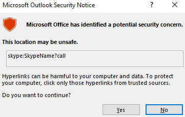

# Moniker Link (CVE-2024-21413)

## Mục lục

1. [Task 1: Introduction](#task-1-introduction)
2. [Task 2: Moniker Link (CVE-2024-21413)](#task-2-moniker-link-cve-2024-21413)

## Nội dung

# Task 1: Introduction
>Giới thiệu

Vào ngày 13 tháng 2 năm 2024, Microsoft đã công bố một lỗ hổng thực thi mã từ xa (RCE) và rò rỉ thông tin xác thực trên Microsoft Outlook với mã định danh CVE [**CVE-2024-21413**](https://www.cve.org/CVERecord?id=CVE-2024-21413) (Moniker Link). Haifei Li từ Check Point Research được ghi nhận là người đã phát hiện ra lỗ hổng này.

[Xem lỗ hổng này tại đây](https://research.checkpoint.com/2024/the-risks-of-the-monikerlink-bug-in-microsoft-outlook-and-the-big-picture/)

Lỗ hổng này bỏ qua các cơ chế bảo mật của Outlook khi xử lý một loại siêu liên kết đặc biệt được gọi là **Moniker Link**. Kẻ tấn công có thể lợi dụng điều này bằng cách gửi email chứa một Moniker Link độc hại cho nạn nhân. Khi nạn nhân nhấp vào liên kết này, Outlook sẽ gửi thông tin xác thực **NTLM** của người dùng tới kẻ tấn công.

Các chi tiết về điểm số của lỗ hổng này được cung cấp trong bảng sau:

| CVSS                 | Mô tả                                                                                                                                                    |
| -------------------- | -------------------------------------------------------------------------------------------------------------------------------------------------------- |
| Ngày công bố         | 13 tháng 2, 2024                                                                                                                                         |
| Bài viết MS          | [https://msrc.microsoft.com/update-guide/en-US/vulnerability/CVE-2024-21413](https://msrc.microsoft.com/update-guide/en-US/vulnerability/CVE-2024-21413) |
| Ảnh hưởng            | Thực thi mã từ xa & Rò rỉ thông tin xác thực                                                                                                             |
| Mức độ nghiêm trọng  | Nghiêm trọng                                                                                                                                             |
| Độ phức tạp tấn công | Thấp                                                                                                                                                     |
| Điểm số              | 9.8                                                                                                                                                      |

Lỗ hổng này được biết là ảnh hưởng đến các bản phát hành Office sau:

| Phiên bản phát hành               | Phiên bản bị ảnh hưởng                      |
| --------------------------------- | ------------------------------------------- |
| Microsoft Office LTSC 2021        | bị ảnh hưởng từ 19.0.0                      |
| Microsoft 365 Apps for Enterprise | bị ảnh hưởng từ 16.0.1                      |
| Microsoft Office 2019             | bị ảnh hưởng từ 16.0.1                      |
| Microsoft Office 2016             | bị ảnh hưởng từ 16.0.0 trước 16.0.5435.1001 |

---

**Mục tiêu học tập**

* Cách hoạt động của lỗ hổng
* Hiểu về chế độ “Protected View” của Outlook
* Sử dụng lỗ hổng để rò rỉ thông tin xác thực từ ứng dụng Outlook
* Các biện pháp phát hiện và giảm thiểu

---

Câu hỏi: Mức độ “Severity” nào đã được gán cho CVE này?

Trả lời: **Critical**

# Task 2: Moniker Link (CVE-2024-21413)

Outlook có thể hiển thị email dưới dạng HTML. Bạn có thể nhận thấy điều này khi sử dụng các bản tin yêu thích của mình. Ngoài ra, Outlook có thể phân tích các siêu liên kết như HTTP và HTTPS. Tuy nhiên, nó cũng có thể mở các URL chỉ định ứng dụng, được gọi là [**Moniker Links**](https://learn.microsoft.com/en-us/windows/win32/com/url-monikers). Thông thường, Outlook sẽ hiển thị cảnh báo bảo mật khi các ứng dụng bên ngoài được kích hoạt.

