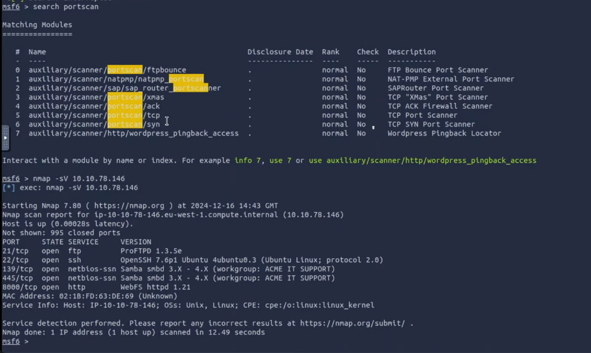
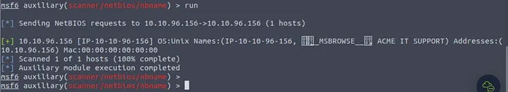
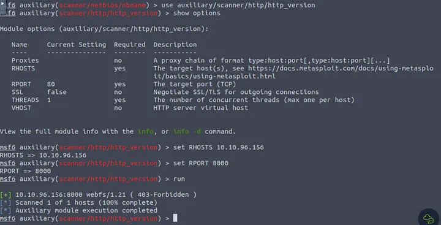
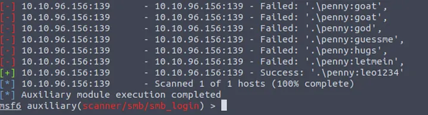

# Metasploit Exploitation

## Mục lục

1. [Task 1: Introduction](#task-1-introduction)
2. [Task 2: Scanning](#task-2-scanning)


## Nội dung

# Task 1: Introduction

>Giới thiệu

Trong phòng này, chúng ta sẽ học cách sử dụng Metasploit để quét lỗ hổng bảo mật và khai thác. Chúng ta cũng sẽ đề cập đến cách tính năng cơ sở dữ liệu giúp việc quản lý các hoạt động kiểm thử xâm nhập trở nên dễ dàng hơn với phạm vi rộng hơn. Cuối cùng, chúng ta sẽ xem cách tạo payload với **msfvenom** và cách bắt đầu một phiên **Meterpreter** trên hầu hết các nền tảng mục tiêu.

Cụ thể hơn, các chủ đề chúng ta sẽ đề cập gồm:

* Cách quét các hệ thống mục tiêu bằng Metasploit.
* Cách sử dụng tính năng cơ sở dữ liệu của Metasploit.
* Cách sử dụng Metasploit để thực hiện quét lỗ hổng.
* Cách sử dụng Metasploit để khai thác các dịch vụ dễ bị tấn công trên hệ thống mục tiêu.
* Cách sử dụng **msfvenom** để tạo payload và có được một phiên Meterpreter trên hệ thống mục tiêu.

Lưu ý: Với tất cả các câu hỏi yêu cầu sử dụng wordlist (ví dụ tấn công brute-force), chúng ta sẽ sử dụng wordlist trên AttackBox tại đường dẫn:

```
/usr/share/wordlists/MetasploitRoom/MetasploitWordlist.txt
```

Nếu bạn chọn sử dụng máy của riêng mình, vui lòng tải xuống wordlist bằng cách nhấp vào nút "Download Task Files" ở bên phải.

Khởi động AttackBox và chạy Metasploit bằng lệnh **msfconsole** để làm theo nội dung của phòng này.

---

# Task 2: Scanning

### Port Scanning - Quét cổng 

Metasploit có nhiều mô-đun để quét các cổng đang mở trên hệ thống và mạng mục tiêu. Bạn có thể liệt kê các mô-đun quét cổng tiềm năng có sẵn bằng cách sử dụng lệnh:

```
search portscan
```

```bash
msf6 > search portscan

Matching Modules
================

 #  Name                                                 Disclosure Date  Rank    Check  Description
 -  ----                                                 ---------------  ----    -----  -----------
 0  auxiliary/scanner/http/wordpress_pingback_access                      normal  No     Wordpress Pingback Locator
 1  auxiliary/scanner/natpmp/natpmp_portscan                              normal  No     NAT-PMP External Port Scanner
 2  auxiliary/scanner/portscan/ack                                        normal  No     TCP ACK Firewall Scanner
 3  auxiliary/scanner/portscan/ftpbounce                                  normal  No     FTP Bounce Port Scanner
 4  auxiliary/scanner/portscan/syn                                        normal  No     TCP SYN Port Scanner
 5  auxiliary/scanner/portscan/tcp                                        normal  No     TCP Port Scanner
 6  auxiliary/scanner/portscan/xmas                                       normal  No     TCP "XMas" Port Scanner
 7  auxiliary/scanner/sap/sap_router_portscanner                          normal  No     SAPRouter Port Scanner

Interact with a module by name or index, for example use 7 or use auxiliary/scanner/sap/sap_router_portscanner

msf6 >
```

Các mô-đun quét cổng sẽ yêu cầu bạn thiết lập một số tùy chọn:

```bash
msf6 auxiliary(scanner/portscan/tcp) > show options

Module options (auxiliary/scanner/portscan/tcp):

   Name         Current Setting  Required  Description
   ----         ---------------  --------  -----------
   CONCURRENCY  10               yes       The number of concurrent ports to check per host
   DELAY        0                yes       The delay between connections, per thread, in milliseconds
   JITTER       0                yes       The delay jitter factor (maximum value by which to +/- DELAY) in milliseconds.
   PORTS        1-10000          yes       Ports to scan (e.g. 22-25,80,110-900)
   RHOSTS                        yes       The target host(s), range CIDR identifier, or hosts file with syntax 'file:'
   THREADS      1                yes       The number of concurrent threads (max one per host)
   TIMEOUT      1000             yes       The socket connect timeout in milliseconds

msf6 auxiliary(scanner/portscan/tcp) >
```

* **CONCURRENCY**: Số lượng mục tiêu sẽ được quét đồng thời.
* **PORTS**: Phạm vi cổng cần quét. Lưu ý rằng phạm vi 1–1000 ở đây sẽ không giống với khi sử dụng Nmap với cấu hình mặc định. Nmap sẽ quét 1000 cổng được sử dụng nhiều nhất, trong khi Metasploit sẽ quét các cổng từ 1 đến 10000.
* **RHOSTS**: Mục tiêu hoặc mạng mục tiêu cần quét.
* **THREADS**: Số lượng luồng sẽ được sử dụng đồng thời. Số luồng nhiều hơn sẽ giúp quét nhanh hơn.

Bạn có thể thực hiện quét Nmap trực tiếp từ dấu nhắc `msfconsole` như minh họa bên dưới để nhanh hơn:

```bash
msf6 > nmap -sS 10.10.12.229
[*] exec: nmap -sS 10.10.12.229

Starting Nmap 7.60 ( https://nmap.org ) at 2021-08-20 03:54 BST
Nmap scan report for ip-10-10-12-229.eu-west-1.compute.internal (10.10.12.229)
Host is up (0.0011s latency).
Not shown: 992 closed ports
PORT      STATE SERVICE
135/tcp   open  msrpc
139/tcp   open  netbios-ssn
445/tcp   open  microsoft-ds
3389/tcp  open  ms-wbt-server
49152/tcp open  unknown
49153/tcp open  unknown
49154/tcp open  unknown
49158/tcp open  unknown
MAC Address: 02:CE:59:27:C8:E3 (Unknown)

Nmap done: 1 IP address (1 host up) scanned in 64.19 seconds
msf6 >
```

Như để thu thập thông tin, nếu bạn cần một phương pháp quét cổng nhanh hơn, **Metasploit** có thể không phải là lựa chọn hàng đầu. Tuy nhiên, có một số module khiến **Metasploit** trở thành công cụ hữu ích trong giai đoạn quét.

### Xác định dịch vụ UDP 

Module **scanner/discovery/udp\_sweep** sẽ cho phép bạn nhanh chóng xác định các dịch vụ đang chạy trên UDP (User Datagram Protocol).
Như bạn có thể thấy bên dưới, module này sẽ không thực hiện quét toàn diện tất cả các dịch vụ UDP có thể có, nhưng cung cấp một cách nhanh chóng để nhận diện các dịch vụ như **DNS** hoặc **NetBIOS**.

```bash
msf6 auxiliary(scanner/discovery/udp_sweep) > run

[*] Sending 13 probes to 10.10.12.229->10.10.12.229 (1 hosts)
[*] Discovered NetBIOS on 10.10.12.229:137 (JON-PC;:U ;WORKGROUP;:G ;JON-PC;:U ;WORKGROUP;:G ;WORKGROUP;:U ;__MSBROWSE__;:G ;02:ce:59:27:c8:e3)
[*] Scanned 1 of 1 hosts (100% complete)
[*] Auxiliary module execution completed

msf6 auxiliary(scanner/discovery/udp_sweep) >
```

### Quét SMB

Metasploit cung cấp một số mô-đun phụ trợ hữu ích cho phép chúng ta quét các dịch vụ cụ thể. Dưới đây là một ví dụ cho SMB. Đặc biệt hữu ích trong mạng doanh nghiệp sẽ là `smb_enumshares` và `smb_version`, nhưng hãy dành thời gian để xác định các công cụ quét mà phiên bản Metasploit được cài đặt trên hệ thống của bạn cung cấp.

```bash
msf6 auxiliary(scanner/smb/smb_version) > run

[+] 10.10.12.229:445 - Host is running Windows 7 Professional SP1 (build:7601) (name:JON-PC) (workgroup:WORKGROUP) (signatures:optional)
[*] 10.10.12.229:445 - Scanned 1 of 1 hosts (100% complete)
[*] Auxiliary module execution completed

msf6 auxiliary(scanner/smb/smb_version) >
```

Khi thực hiện quét dịch vụ, điều quan trọng là không bỏ qua các dịch vụ “đặc biệt” hơn như NetBIOS.
NetBIOS (Network Basic Input Output System), tương tự SMB, cho phép máy tính giao tiếp qua mạng để chia sẻ tệp hoặc gửi tệp tới máy in.
Tên NetBIOS của hệ thống mục tiêu có thể cho bạn biết vai trò của nó và thậm chí cả mức độ quan trọng (ví dụ: CORP-DC, DEVOPS, SALES, v.v.).
Bạn cũng có thể bắt gặp một số tệp và thư mục chia sẻ có thể truy cập mà không cần mật khẩu hoặc được bảo vệ bằng mật khẩu đơn giản (ví dụ: admin, administrator, root, toor, v.v.).

Hãy nhớ rằng Metasploit có nhiều mô-đun có thể giúp bạn hiểu rõ hơn về hệ thống mục tiêu và có thể giúp bạn tìm ra lỗ hổng bảo mật.
Luôn đáng để thực hiện tìm kiếm nhanh để xem có mô-đun nào hữu ích dựa trên hệ thống mục tiêu của bạn hay không.

---

**Trả lời các câu hỏi sau**

Câu 1: Có bao nhiêu cổng đang mở trên hệ thống mục tiêu?

Trả lời 1: 5




---
Câu 2: Sử dụng trình quét phù hợp, tên NetBIOS bạn thấy là gì?

Trả lời 2: ACME IT SUPPORT



---

Câu 3: Dịch vụ nào đang chạy trên cổng 8000?

Trả lời 3: webfs/1.21



---

Câu 4: Mật khẩu SMB của người dùng “penny” là gì? Sử dụng danh sách từ đã đề cập trong nhiệm vụ trước.

Trả lời 4: leo1234



---

