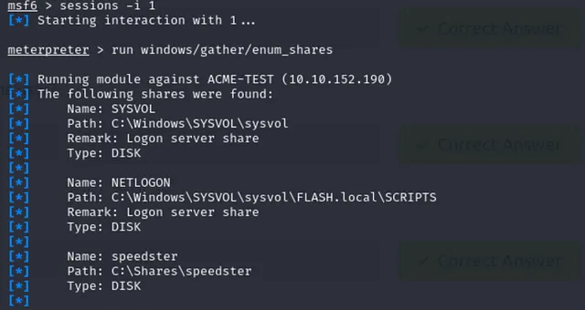

# Metasploit Meterpreter

## Mục lục

1. [Task 1: Introduction to Meterpreter](#task-1-introduction-to-meterpreter)
2. [Task 2: Meterpreter Flavors](#task-2-meterpreter-flavors)
3. [Task 3: Meterpreter Commands](#task-3-meterpreter-commands)
4. [Task 4: Post Exploitation with Meterpreter](#task-4-post-exploitation-with-meterpreter)
5. [Task 5: Post Exploitation Challenge](#task-5-post-exploitation-challenge)


## Nội dung


# Task 1: Introduction to Meterpreter

**Nhiệm vụ 1 | Giới thiệu về Meterpreter**

Meterpreter là một payload của Metasploit chạy trên hệ thống mục tiêu và hỗ trợ quá trình kiểm thử xâm nhập với nhiều thành phần hữu ích. Nó có nhiều phiên bản cung cấp các chức năng khác nhau tùy thuộc vào hệ thống mục tiêu.

Meterpreter chạy trên hệ thống mục tiêu nhưng không được cài đặt vào đó. Thay vào đó, nó chạy trực tiếp trên bộ nhớ RAM thay vì ghi vào ổ đĩa của mục tiêu (ví dụ: Meterpreter.exe). Phần mềm diệt virus thường quét các tệp mới trên ổ đĩa, vì vậy chạy trực tiếp trên RAM giúp tránh bị phát hiện. Meterpreter sẽ được nhận diện như một tiến trình, không phải là một tệp trên hệ thống.

Tránh bị phát hiện bởi các hệ thống IPS và IDS cũng là mục tiêu của Meterpreter. Nó thực hiện điều này bằng cách mã hóa thông tin liên lạc với máy chủ Metasploit (máy tấn công). Nếu tổ chức mục tiêu không giải mã và kiểm tra lưu lượng đã mã hóa vào/ra mạng (như HTTPS), các hệ thống này sẽ không thể phát hiện hoạt động của nó.

Mặc dù hầu hết phần mềm diệt virus đều có thể phát hiện tiến trình Meterpreter, nó vẫn có thể mang lại mức độ ẩn mình nhất định. Ví dụ dưới đây sẽ minh họa điều đó.

Ví dụ này mô tả một máy mục tiêu chạy Windows OS bị khai thác bằng lỗ hổng MS17-010. Meterpreter chạy với ID tiến trình (PID) là 1304 (con số của bạn có thể khác). Lệnh `getpid` sẽ trả về PID của phiên Meterpreter. Hệ điều hành sẽ dùng PID này để nhận diện tiến trình đang chạy. Với PID, chúng ta có thể tương tác với tiến trình đó.


Lệnh **ps** liệt kê các tiến trình đang chạy. Khi liệt kê các tiến trình, bạn có thể nghĩ rằng PID 1304 sẽ được hiển thị là *Meterpreter.exe* vì đó là PID được hiển thị cho tiến trình Meterpreter, nhưng thực tế nó lại là *spoolsv.exe*.


Mặc dù Meterpreter rất bí mật, nhưng vẫn có những công cụ có thể giúp phát hiện khi nào nó đang chạy!

---

# Task 2: Meterpreter Flavors

**Nhiệm vụ 2 | Các biến thể của Meterpreter**

Payloads của Metasploit có hai loại:

* **Inline (đơn bước)** – gửi trong một bước duy nhất.
* **Staged** – Các payload này được gửi đến mục tiêu theo hai bước. Trình nạp (stager) sẽ được cài đặt trước, sau đó yêu cầu phần còn lại của payload, cho phép kích thước payload nhỏ hơn.

Meterpreter có nhiều loại payload khác nhau tùy thuộc vào mục tiêu của bạn. Một cách đơn giản để xem các payload này là sử dụng **msfvenom** như sau:

```
msfvenom --list payloads
```

và thêm `| grep meterpreter` để chỉ hiển thị các payload của meterpreter.


Danh sách này hiển thị các phiên bản tương thích với Android, Apple iOS, Java, Linux, OSX, PHP, Python và Windows. Việc chọn một phiên bản phụ thuộc vào 3 yếu tố:

* **Hệ điều hành mục tiêu** (Linux, Windows hoặc Mac, v.v.)
* **Các thành phần có sẵn trên mục tiêu** (Python đã được cài đặt chưa? Đây có phải là một trang web PHP không? v.v.)
* **Các loại kết nối mạng** bạn có thể có với hệ thống mục tiêu (Họ có cho phép kết nối TCP thô không? Bạn chỉ có thể có kết nối HTTPS reverse không? Địa chỉ IPv6 có ít bị giám sát hơn địa chỉ IPv4 không? v.v.)


---

# Task 3: Meterpreter Commands
**Nhiệm vụ 3 | Các lệnh Meterpreter**

Gõ **help** trong bất kỳ phiên Meterpreter nào (được hiển thị bởi dấu nhắc `meterpreter>` trên màn hình) sẽ liệt kê các lệnh khả dụng. Việc liệt kê các lệnh này là ý tưởng hay vì mỗi phiên bản của Meterpreter sẽ có sự khác nhau.

Khi vào menu trợ giúp, bạn sẽ thấy các lệnh được phân loại thành nhiều nhóm khác nhau (core, file system, networking, system, user interface, webcam, audio output, elevate, password database, timestamp).

Một số lệnh trong số này có thể không hoạt động.

---

# Task 4: Post Exploitation with Meterpreter
**Nhiệm vụ 4 | Khai thác sau tấn công với Meterpreter**

Meterpreter cung cấp các lệnh hữu ích giúp giai đoạn **hậu khai thác** trở nên dễ dàng hơn.

**Help**
Liệt kê tất cả các lệnh khả dụng trong Meterpreter.

**Các lệnh Meterpreter**

* Lệnh **getuid** sẽ hiển thị phiên Meterpreter nào hiện đang chạy. Điều này cho bạn ý tưởng về mức độ đặc quyền hiện tại trên hệ thống mục tiêu (ví dụ: bạn có phải là người dùng cấp quản trị như `NT AUTHORITY\SYSTEM` hay chỉ là người dùng thông thường?).

* Lệnh **ps** sẽ liệt kê các tiến trình đang chạy. Lệnh này cung cấp thông tin **PID** cần thiết để di chuyển Meterpreter sang một tiến trình khác.

**Migrate**

Di chuyển sang một tiến trình khác sẽ giúp Meterpreter tương tác với tiến trình đó.
Ví dụ: nếu bạn thấy một trình xử lý văn bản đang chạy trên mục tiêu (như `word.exe`, `notepad.exe`, v.v.), bạn có thể di chuyển sang tiến trình đó và bắt đầu thu thập các phím gõ mà người dùng gửi tới nó.
Một số phiên bản Meterpreter hỗ trợ lệnh `keyscan_[start, stop, dump]` để hoạt động như một **keylogger**. Việc di chuyển sang tiến trình khác cũng có thể giúp phiên làm việc ổn định hơn.

Để di chuyển sang tiến trình bất kỳ, gõ lệnh `migrate` kèm theo **PID** của tiến trình.
Ví dụ:

```
migrate 716
```

⚠ Lưu ý: Việc di chuyển có thể khiến bạn mất quyền người dùng hiện tại (ví dụ: từ SYSTEM sang webserver) và không thể lấy lại được quyền này.

---

**Hashdump**

Lệnh này liệt kê nội dung của cơ sở dữ liệu **SAM** – nơi lưu trữ mật khẩu của người dùng trên hệ thống Windows.
Các mật khẩu này được lưu dưới dạng **NTLM hash**.
Để liệt kê, sử dụng:

```
hashdump
```

Bạn có thể tìm ra mật khẩu gốc bằng cách sử dụng cơ sở dữ liệu NTLM trực tuyến hoặc tấn công **rainbow table**.
Các hash này cũng có thể dùng trong tấn công **Pass-the-Hash** để xác thực vào các hệ thống khác.

**Search**

Lệnh **`search`** giúp tìm kiếm các tệp tin.
Trong bối cảnh **CTF**, đây là cách dễ dàng để tìm flag hoặc tệp proof.
Trong một bài kiểm thử xâm nhập thực tế, bạn có thể cần tìm các tệp do người dùng tạo hoặc các tệp cấu hình có thể chứa thông tin nhạy cảm.


**Shell**

Lệnh **`shell`** sẽ khởi chạy một shell dòng lệnh thông thường trên máy đích.
Nhấn **CTRL+Z** sẽ đưa bạn quay lại shell của Meterpreter.


---

# Task 5: Post Exploitation Challenge
**Nhiệm vụ 5 | Thử thách Hậu khai thác**

Meterpreter có các chức năng có thể hỗ trợ trong giai đoạn hậu khai thác.

**Chức năng:**

* Thu thập thông tin về hệ thống mục tiêu
* Tìm kiếm các tệp tin thú vị, thông tin đăng nhập của người dùng, các giao diện mạng bổ sung và thông tin nói chung thú vị trên hệ thống mục tiêu
* Leo thang đặc quyền
* Di chuyển ngang trong mạng

Các lệnh như **load** có thể tận dụng thêm các công cụ bổ sung. Sau khi tải, sử dụng lệnh **help** để xem các lệnh mới mà bạn có thể dùng.

**Câu hỏi:**

Khai thác SMB bằng **exploit/windows/smb/psexec**

**Quy trình:**

Khởi động **msfconsole**. Sau khi tải xong, sử dụng exploit ở trên.

Sau đó dùng **show options** để xem những gì cần được thiết lập.

Chúng ta biết các thông tin sau:

* **RHOSTS** (IP mục tiêu)
* **SMBPass** (Password1)
* **SMBUser** (ballen)
* **LHOST** (IP máy tấn công của bạn)

Một shell Meterpreter sẽ được tải khi exploit thành công.


---

**Trả lời các câu hỏi sau:**

Tên máy tính là gì?

**Trả lời:** ACME-TEST

**Giải thích:**
Lệnh **sysinfo** sẽ lấy thông tin về hệ thống từ xa.


---

Tên miền mục tiêu là gì?

**Trả lời:** FLASH

**Giải thích:**
Có hai cách để xem thông tin này: dùng **sysinfo** hoặc sử dụng module **post/windows/gather/enum\_domain**.

Để làm điều này, hãy đưa phiên làm việc Meterpreter hiện tại về chế độ nền và truy cập vào module trên.

Khi đã vào module, dùng **show options** để xem những gì cần thiết lập. Có vẻ như chúng ta phải sử dụng phiên vừa tạo.

Tôi đã có một phiên (session) được tạo, nên tôi đặt **SESSION = 1**. Chạy module và bạn sẽ thấy tên miền mục tiêu.


---

Tên của thư mục chia sẻ có thể do người dùng tạo là gì?

**Trả lời:** speedster

**Giải thích:**
Chúng ta cần quay lại phiên làm việc trước đó. Để làm điều này, sử dụng lệnh **sessions -i 1**.

Module **windows/gather/enum\_shares** sẽ cung cấp cho bạn tên thư mục chia sẻ do người dùng tạo.




---

Giá trị băm NTLM của người dùng jchambers là gì?

**Trả lời:** 69596c7aa1e8daee17f8e78870e25a5c

**Giải thích:**
Lệnh **hashdump** sẽ cung cấp cho chúng ta các giá trị băm của người dùng. Tìm người dùng **jchambers**. Chuỗi dài đầu tiên nằm giữa dấu “:” là giá trị băm của tên người dùng, và tập thứ hai là giá trị băm của mật khẩu.


---

Mật khẩu dạng rõ (cleartext) của người dùng jchambers là gì?

**Trả lời:** Trustno1

**Giải thích:**
Một cách đơn giản để lấy mật khẩu dạng rõ từ giá trị băm là sử dụng công cụ giải băm NTLM trực tuyến. Bạn có thể dùng **crackstation.net** để giải.

---

Tệp “secrets.txt” nằm ở đâu? (Đường dẫn đầy đủ của tệp)

**Trả lời:** `c:\Program Files (x86)\Windows Multimedia Platform\secrets.txt`

**Giải thích:**
Xác định vị trí tệp bằng lệnh tìm kiếm: `search -f secrets.txt`


---

Mật khẩu Twitter được tiết lộ trong tệp “secrets.txt” là gì?

**Trả lời:** KDSvbSw3849

**Giải thích:**
Hiển thị nội dung của tệp bằng lệnh **cat**. Việc tìm cách để lệnh này hoạt động khá khó chịu! Sau khi tìm kiếm nhanh trên Google, bạn chỉ cần đặt đường dẫn tệp trong dấu ngoặc kép.


---

Tệp “realsecret.txt” nằm ở đâu? (Đường dẫn đầy đủ của tệp)

**Trả lời:** `c:\inetpub\wwwroot\realsecret.txt`

**Giải thích:**
Giống như tệp trước!

---

Bí mật thực sự là gì?

**Trả lời:** *The Flash is the fastest man alive*

**Giải thích:**
Có thể bạn nghĩ “Mình sẽ dùng cùng định dạng như tệp trước?” → Sai. Hãy đảm bảo rằng có hai dấu gạch chéo ngược (`\\`) và **không** có dấu ngoặc kép.


